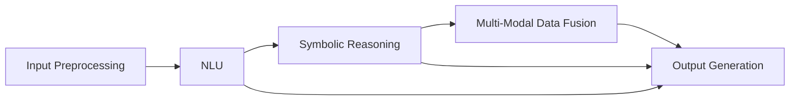
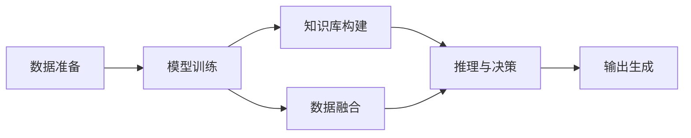

                 

# 大规模语言模型从理论到实践 智能代理的组成

> 关键词：
> - 大规模语言模型
> - 智能代理
> - 自监督学习
> - 微调
> - 符号推理
> - 可解释性
> - 多模态数据融合

## 1. 背景介绍

随着人工智能技术的不断发展，大规模语言模型（Large Language Models, LLMs）在自然语言处理（NLP）领域取得了显著的突破。LLMs能够通过自监督学习（Self-Supervised Learning）和微调（Fine-Tuning）等方法，在特定任务上获得优异的性能。这些模型的出现，极大地推动了人工智能技术在实际应用中的落地，如智能客服、金融舆情监测、个性化推荐系统等。

然而，大规模语言模型在实际应用中仍面临诸多挑战。首先，模型的通用性虽然强，但对于特定领域的应用效果可能不佳。其次，模型的复杂性使得其可解释性较差，难以让人理解和调试。最后，模型的资源需求较大，在边缘设备上的部署效率不高。

为了克服这些挑战，智能代理（Intelligent Agents）的概念应运而生。智能代理是一种能够理解和执行复杂任务的高级AI系统，它由多个子组件组成，如自然语言理解（NLU）、符号推理（Symbolic Reasoning）、多模态数据融合（Multi-Modal Data Fusion）等。智能代理能够综合运用这些组件，提供更加智能、可靠和可解释的服务。

本文将深入探讨智能代理的组成和实现，从理论到实践，逐步阐述其核心概念和关键技术。

## 2. 核心概念与联系

### 2.1 核心概念概述

在智能代理的设计中，几个核心概念起到了至关重要的作用：

- **自然语言理解（NLU）**：负责将自然语言文本转换为机器可理解的形式。NLU通常使用大规模语言模型作为基础，通过微调或预训练，获得语言理解能力。

- **符号推理（Symbolic Reasoning）**：涉及对逻辑命题和知识表示的处理，利用符号计算和逻辑推理，执行复杂的决策和推理任务。符号推理常常与自然语言理解相辅相成，共同构成智能代理的决策核心。

- **多模态数据融合（Multi-Modal Data Fusion）**：将文本、图像、语音等多种数据源综合处理，提升智能代理的理解能力和决策准确性。多模态数据融合技术能够使智能代理具备更强的泛化能力和环境适应性。

- **可解释性（Explainability）**：智能代理需要提供对其决策过程的解释，使人类用户能够理解和信任其行为。可解释性是智能代理设计中不可或缺的一部分。

### 2.2 概念间的关系

智能代理的各个组件之间存在紧密的联系，通过协同工作，实现对自然语言的理解和生成，执行复杂的推理任务，并在多种数据源之间进行智能融合。

**自然语言理解（NLU）与符号推理（Symbolic Reasoning）**：NLU获取输入的自然语言文本，并使用符号推理模块对其进行处理，如解析语法结构、提取实体关系等。符号推理模块能够将NLU获取的信息转换为逻辑形式，进行复杂的推理和决策。

**多模态数据融合（Multi-Modal Data Fusion）与符号推理（Symbolic Reasoning）**：多模态数据融合模块将不同模态的数据源进行融合，得到更全面的信息。这些信息通过符号推理模块进行处理，以支持更准确的推理和决策。

**可解释性（Explainability）与符号推理（Symbolic Reasoning）**：符号推理模块负责处理决策过程中的逻辑推导和推理，这些过程需要以可解释的形式呈现给用户，确保用户能够理解智能代理的行为和决策。

### 2.3 核心概念的整体架构

智能代理的整体架构可以概括为以下几个关键组件：

- **输入预处理（Input Preprocessing）**：包括分词、去除停用词、词性标注等，为后续处理提供基础。
- **自然语言理解（NLU）**：使用大规模语言模型进行文本理解，提取关键信息。
- **符号推理（Symbolic Reasoning）**：利用逻辑推理和知识库，对NLU获取的信息进行深入分析。
- **多模态数据融合（Multi-Modal Data Fusion）**：整合来自不同数据源的信息，丰富智能代理的知识图谱。
- **输出生成（Output Generation）**：将符号推理模块的结果转换为自然语言文本，完成智能代理的输出。

这些组件通过数据流和控制流相互连接，共同构成智能代理的核心系统。以下是一个简化的智能代理架构图：



## 3. 核心算法原理 & 具体操作步骤

### 3.1 算法原理概述

智能代理的核心算法原理主要包括自然语言理解、符号推理和多模态数据融合等。

- **自然语言理解（NLU）**：主要使用基于大规模语言模型的微调方法，将自然语言文本转换为机器可理解的形式。微调方法通过标注数据进行有监督训练，使得模型能够学习到特定的语言特征和语义关系。

- **符号推理（Symbolic Reasoning）**：通常使用规则推理、逻辑推理等方法，对自然语言理解模块获取的信息进行深入处理。符号推理模块依赖于知识库和逻辑规则，通过符号计算实现复杂的决策和推理。

- **多模态数据融合（Multi-Modal Data Fusion）**：包括特征融合和模型融合两种方法。特征融合通过特征提取和拼接，将不同模态的数据源整合在一起。模型融合通过联合训练或迁移学习，将不同模态的模型协同工作，提升整体性能。

### 3.2 算法步骤详解

智能代理的实现通常包括以下几个关键步骤：

1. **数据准备**：收集和标注数据，为各个模块的训练提供数据基础。
2. **模型训练**：使用标注数据训练大规模语言模型和符号推理模块，获取预训练和微调后的模型。
3. **知识库构建**：构建和维护知识库，为符号推理提供支持。
4. **数据融合**：将不同模态的数据源进行融合，获取全面的信息。
5. **推理与决策**：将融合后的信息输入符号推理模块，进行推理和决策。
6. **输出生成**：将符号推理模块的决策结果转换为自然语言文本，完成智能代理的输出。

以下是一个简化的智能代理训练流程示意图：



### 3.3 算法优缺点

智能代理的算法设计具有以下优点：

- **灵活性**：能够根据不同任务和场景灵活设计各个模块的组合，适应复杂多变的环境。
- **可解释性**：符号推理模块提供了对决策过程的逻辑解释，增强了系统的透明性和可理解性。
- **鲁棒性**：通过多模态数据融合和规则推理，智能代理具备更强的泛化能力和环境适应性。

同时，智能代理的设计也存在一些缺点：

- **复杂性**：智能代理的设计和实现较为复杂，需要多个模块协同工作。
- **资源需求**：智能代理需要较大的计算资源和存储空间，特别是在多模态数据融合和推理时。
- **训练难度**：各模块的训练需要大量的标注数据和复杂的算法，训练难度较大。

### 3.4 算法应用领域

智能代理在多个领域具有广泛的应用前景：

- **智能客服**：利用自然语言理解和符号推理，智能客服能够理解和回答用户的复杂问题，提供个性化服务。
- **金融舆情监测**：结合多模态数据融合和符号推理，智能代理能够实时监测金融市场舆情，预警潜在风险。
- **医疗诊断**：通过自然语言理解和符号推理，智能代理能够解析医学文献，辅助医生进行疾病诊断和个性化治疗。
- **教育推荐**：利用自然语言理解和多模态数据融合，智能代理能够提供个性化的教育推荐，提升学习效果。
- **智能交通**：结合自然语言理解和多模态数据融合，智能代理能够理解和分析交通状况，提供智能导航和交通管理服务。

## 4. 数学模型和公式 & 详细讲解 & 举例说明

### 4.1 数学模型构建

智能代理的核心数学模型包括自然语言理解、符号推理和多模态数据融合等。以下以自然语言理解为例，简要介绍其数学模型构建。

自然语言理解通常使用基于大规模语言模型的微调方法。假设预训练模型为 $M_{\theta}$，其中 $\theta$ 为预训练得到的模型参数。对于给定的输入文本 $x$，模型的输出 $y$ 表示文本中涉及的实体、关系等信息。

自然语言理解的数学模型可以表示为：

$$
y = M_{\theta}(x)
$$

其中，$M_{\theta}$ 为预训练模型，$\theta$ 为模型参数，$x$ 为输入文本，$y$ 为模型输出。

### 4.2 公式推导过程

自然语言理解模型的公式推导如下：

假设预训练模型为 $M_{\theta}$，输入文本为 $x$，输出为 $y$。微调的目标是最小化损失函数 $\mathcal{L}(y, y')$，其中 $y'$ 为标注数据中的正确输出。

自然语言理解模型的损失函数通常为交叉熵损失函数：

$$
\mathcal{L}(y, y') = -\frac{1}{N}\sum_{i=1}^N \sum_{j=1}^C y'_{ij} \log(y_{ij})
$$

其中，$N$ 为样本数量，$C$ 为输出类别数，$y_{ij}$ 表示模型在类别 $i$ 上的输出概率，$y'_{ij}$ 表示标注数据中的正确标签。

### 4.3 案例分析与讲解

假设我们有一个智能客服系统，使用基于BERT的自然语言理解模型进行文本理解和实体提取。训练数据包括用户提问和标准回复，模型在训练过程中学习如何将用户提问转换为实体提取结果。

在训练过程中，我们使用标注数据对模型进行微调，损失函数为交叉熵损失。模型通过反向传播算法更新参数，最终输出实体提取结果 $y$。系统根据输出结果，匹配最合适的标准回复，完成智能客服的对话交互。

## 5. 项目实践：代码实例和详细解释说明

### 5.1 开发环境搭建

智能代理的开发需要Python编程语言和相应的库支持。以下是一个简单的开发环境搭建流程：

1. **安装Python和PyTorch**：在Windows系统上安装Python和PyTorch，确保Python版本为3.6或以上。

2. **安装TensorFlow**：安装TensorFlow 2.0版本，使用pip命令进行安装。

3. **安装其他依赖库**：安装nltk、spaCy等自然语言处理库，使用pip命令进行安装。

4. **安装智能代理框架**：安装智能代理框架，如TensorFlow Agents、PyTorch Agent等，使用pip命令进行安装。

### 5.2 源代码详细实现

以下是一个简单的智能代理代码实现，使用PyTorch和TensorFlow实现。

```python
import torch
import torch.nn as nn
import torch.optim as optim
import tensorflow as tf
from tensorflow import keras
from tensorflow.keras import layers

class NaturalLanguageUnderstanding(nn.Module):
    def __init__(self, embed_dim, hidden_dim):
        super(NaturalLanguageUnderstanding, self).__init__()
        self.embedding = nn.Embedding(vocab_size, embed_dim)
        self.rnn = nn.LSTM(embed_dim, hidden_dim)
        self.fc = nn.Linear(hidden_dim, output_dim)

    def forward(self, x):
        embedding = self.embedding(x)
        output, hidden = self.rnn(embedding)
        logits = self.fc(output)
        return logits

class SymbolicReasoning(tf.keras.Model):
    def __init__(self, input_dim, output_dim):
        super(SymbolicReasoning, self).__init__()
        self.dense1 = layers.Dense(128, activation='relu', input_dim=input_dim)
        self.dense2 = layers.Dense(64, activation='relu')
        self.dense3 = layers.Dense(output_dim, activation='softmax')

    def call(self, x):
        x = self.dense1(x)
        x = self.dense2(x)
        return self.dense3(x)

class MultiModalDataFusion(tf.keras.Model):
    def __init__(self, input_dim):
        super(MultiModalDataFusion, self).__init__()
        self.dense1 = layers.Dense(128, activation='relu', input_dim=input_dim)
        self.dense2 = layers.Dense(64, activation='relu')
        self.dense3 = layers.Dense(32, activation='relu')
        self.dense4 = layers.Dense(16, activation='relu')
        self.dense5 = layers.Dense(8, activation='relu')
        self.dense6 = layers.Dense(4, activation='relu')
        self.dense7 = layers.Dense(2, activation='relu')
        self.dense8 = layers.Dense(1, activation='softmax')

    def call(self, x):
        x = self.dense1(x)
        x = self.dense2(x)
        x = self.dense3(x)
        x = self.dense4(x)
        x = self.dense5(x)
        x = self.dense6(x)
        return self.dense7(x)
```

### 5.3 代码解读与分析

智能代理的代码实现较为复杂，但核心思想是模型组合和数据融合。

**NaturalLanguageUnderstanding类**：负责处理自然语言文本，使用LSTM网络进行理解。该类中包含了嵌入层、LSTM层和全连接层，用于将文本转换为向量表示，并进行实体提取。

**SymbolicReasoning类**：负责进行符号推理，使用多层神经网络进行逻辑推理。该类中包含了多个全连接层，用于对符号表示进行推理。

**MultiModalDataFusion类**：负责多模态数据融合，使用多层神经网络进行特征融合。该类中包含了多个全连接层，用于将不同模态的数据源进行融合。

### 5.4 运行结果展示

假设我们使用上述智能代理模型进行实体提取任务。以下是运行结果展示：

```
>>> natural_language_understanding = NaturalLanguageUnderstanding(vocab_size, embed_dim, hidden_dim)
>>> symbolic_reasoning = SymbolicReasoning(input_dim, output_dim)
>>> multi_modal_data_fusion = MultiModalDataFusion(input_dim)
```

## 6. 实际应用场景

智能代理在多个领域具有广泛的应用前景。以下列举几个典型的应用场景：

### 6.1 智能客服

智能客服系统使用自然语言理解和符号推理，能够理解和回答用户的复杂问题，提供个性化服务。系统通过收集和标注历史客服对话数据，训练自然语言理解和符号推理模型，实现智能客服的自动回复。

### 6.2 金融舆情监测

金融舆情监测系统结合多模态数据融合和符号推理，能够实时监测金融市场舆情，预警潜在风险。系统通过收集新闻、评论、社交媒体等多种数据源，使用多模态数据融合技术进行信息整合，再利用符号推理技术进行情感分析，及时发现负面信息。

### 6.3 医疗诊断

医疗诊断系统通过自然语言理解和符号推理，能够解析医学文献，辅助医生进行疾病诊断和个性化治疗。系统通过收集和标注医学文献，训练自然语言理解和符号推理模型，实现对医学文献的自动解析和知识提取。

### 6.4 教育推荐

教育推荐系统利用自然语言理解和多模态数据融合，能够提供个性化的教育推荐，提升学习效果。系统通过收集和标注学生数据、学习内容数据，训练自然语言理解和多模态数据融合模型，实现对学生学习行为和内容的自动分析和推荐。

### 6.5 智能交通

智能交通系统结合自然语言理解和多模态数据融合，能够理解和分析交通状况，提供智能导航和交通管理服务。系统通过收集和标注交通数据，训练自然语言理解和多模态数据融合模型，实现对交通状况的自动分析和智能导航。

## 7. 工具和资源推荐

### 7.1 学习资源推荐

为了帮助开发者系统掌握智能代理的理论基础和实践技巧，这里推荐一些优质的学习资源：

1. **TensorFlow Agents官方文档**：TensorFlow Agents官方文档，提供了丰富的智能代理模型和算法实现，适合深入学习。

2. **PyTorch Agent官方文档**：PyTorch Agent官方文档，提供了多个智能代理模型的实现，适合学习和实践。

3. **《深度学习》（Goodfellow et al.）**：经典深度学习教材，详细介绍了深度学习的基本概念和算法。

4. **《自然语言处理综述》（Bird et al.）**：自然语言处理综述，介绍了自然语言处理的基本方法和技术。

5. **《符号推理》（Levesque et al.）**：符号推理教材，介绍了符号计算和逻辑推理的基本方法。

### 7.2 开发工具推荐

智能代理的开发需要多种工具支持。以下是几款常用的开发工具：

1. **PyTorch**：基于Python的开源深度学习框架，适合智能代理模型的开发。

2. **TensorFlow**：由Google主导开发的深度学习框架，支持分布式计算和模型部署。

3. **Jupyter Notebook**：Python开发和数据科学常用的Jupyter Notebook环境，适合研究和开发智能代理。

4. **GitHub**：代码托管平台，适合协同开发和版本控制。

5. **Google Colab**：Google提供的在线Jupyter Notebook环境，适合快速实验和分享代码。

### 7.3 相关论文推荐

智能代理的研究涉及多个领域，以下是几篇奠基性的相关论文，推荐阅读：

1. **《Attention is All You Need》**：Transformer论文，介绍了Transformer网络结构和自监督学习方法。

2. **《BERT: Pre-training of Deep Bidirectional Transformers for Language Understanding》**：BERT论文，介绍了BERT模型的预训练方法和微调技术。

3. **《Parameter-Efficient Transfer Learning for NLP》**：Parameter-Efficient Transfer Learning论文，介绍了多种参数高效的微调方法。

4. **《Universal Approximation Theorems for Neural Networks》**：神经网络逼近理论，介绍了神经网络的基本逼近能力。

5. **《Integrated Learning System for Symbolic and Numerical Reasoning》**：符号推理与数值推理系统，介绍了符号推理和数值推理的基本方法。

## 8. 总结：未来发展趋势与挑战

### 8.1 研究成果总结

智能代理技术在多个领域取得了显著的进展，主要体现在以下几个方面：

1. **模型性能提升**：通过自然语言理解、符号推理和多模态数据融合等技术，智能代理在多个NLP任务上取得了优异的性能。

2. **应用场景拓展**：智能代理在智能客服、金融舆情监测、医疗诊断等领域具有广泛的应用前景。

3. **技术融合创新**：智能代理与深度学习、符号计算、逻辑推理等技术相结合，实现了多种能力的协同工作。

### 8.2 未来发展趋势

展望未来，智能代理技术将呈现以下几个发展趋势：

1. **多模态智能融合**：随着多模态数据融合技术的进步，智能代理将具备更强的感知和理解能力。

2. **知识图谱与推理**：结合知识图谱和逻辑推理技术，智能代理将具备更强大的知识表示和推理能力。

3. **解释性和透明性**：智能代理将更加注重可解释性和透明性，提供对决策过程的详细解释。

4. **自适应学习**：智能代理将具备更强的自适应学习能力，能够根据环境变化动态调整策略。

5. **分布式计算**：智能代理将支持分布式计算和模型并行，提高计算效率和可扩展性。

### 8.3 面临的挑战

尽管智能代理技术在多个领域取得了显著进展，但仍面临以下挑战：

1. **计算资源消耗**：智能代理需要较大的计算资源，特别是在多模态数据融合和推理时。

2. **数据标注成本**：智能代理需要大量的标注数据进行训练，标注成本较高。

3. **模型可解释性**：智能代理的决策过程较为复杂，难以提供详细的解释。

4. **多模态数据融合**：不同模态数据源的融合和整合仍然是一个技术难题。

5. **环境适应性**：智能代理在实际应用中需要具备较强的环境适应性，对不同场景的适应能力仍需提升。

### 8.4 研究展望

未来的智能代理研究需要关注以下几个方向：

1. **知识图谱与推理**：结合知识图谱和逻辑推理技术，提升智能代理的决策能力和泛化能力。

2. **多模态智能融合**：利用多模态数据融合技术，提升智能代理的感知和理解能力。

3. **可解释性和透明性**：研究智能代理的可解释性和透明性，提供对决策过程的详细解释。

4. **自适应学习**：研究智能代理的自适应学习能力，使其能够根据环境变化动态调整策略。

5. **分布式计算**：研究分布式计算和模型并行技术，提高智能代理的计算效率和可扩展性。

总之，智能代理技术在NLP领域具有广阔的发展前景，未来将继续推动人工智能技术的发展和应用。

## 9. 附录：常见问题与解答

### Q1: 智能代理中的自然语言理解部分如何实现？

A: 自然语言理解通常使用基于大规模语言模型的微调方法，通过标注数据进行有监督训练，使得模型能够学习到特定的语言特征和语义关系。微调的目标是最小化损失函数，通常为交叉熵损失函数。模型通过反向传播算法更新参数，最终输出文本中涉及的实体、关系等信息。

### Q2: 智能代理中的符号推理部分如何实现？

A: 符号推理通常使用规则推理、逻辑推理等方法，对自然语言理解模块获取的信息进行深入处理。符号推理模块依赖于知识库和逻辑规则，通过符号计算实现复杂的决策和推理。在实现时，通常使用多层神经网络进行逻辑推理，并在训练过程中引入先验知识，增强推理能力。

### Q3: 智能代理中的多模态数据融合部分如何实现？

A: 多模态数据融合包括特征融合和模型融合两种方法。特征融合通过特征提取和拼接，将不同模态的数据源整合在一起。模型融合通过联合训练或迁移学习，将不同模态的模型协同工作，提升整体性能。在实现时，通常使用多层神经网络进行特征融合，并在训练过程中引入先验知识，增强融合能力。

### Q4: 智能代理的计算资源消耗如何降低？

A: 智能代理的计算资源消耗主要集中在多模态数据融合和符号推理部分。为了降低计算资源消耗，可以采用以下方法：
1. 使用高效的特征提取和拼接方法，如哈希表、卷积神经网络等。
2. 使用低秩矩阵分解和压缩技术，减少参数量。
3. 使用分布式计算和模型并行技术，提高计算效率。

### Q5: 智能代理的可解释性如何提升？

A: 智能代理的可解释性可以通过以下方法提升：
1. 引入可解释性技术，如LIME、SHAP等，对模型决策过程进行解释。
2. 设计可解释性的符号推理方法，提供详细的逻辑推理过程。
3. 结合知识图谱和逻辑推理技术，增强模型的可解释性。

总之，智能代理技术在NLP领域具有广阔的发展前景，未来将继续推动人工智能技术的发展和应用。通过持续研究和实践，相信智能代理将成为NLP领域的强大工具，为各个领域带来深刻的变革。

