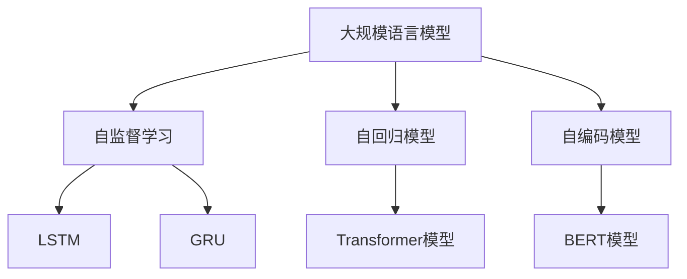
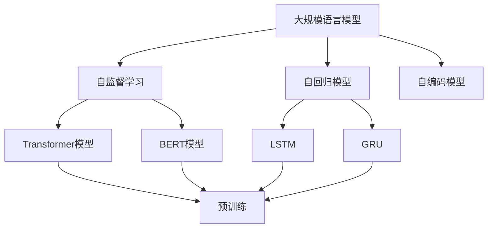
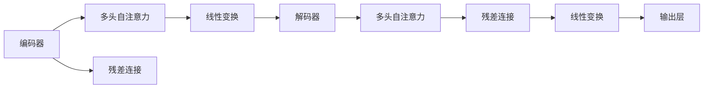
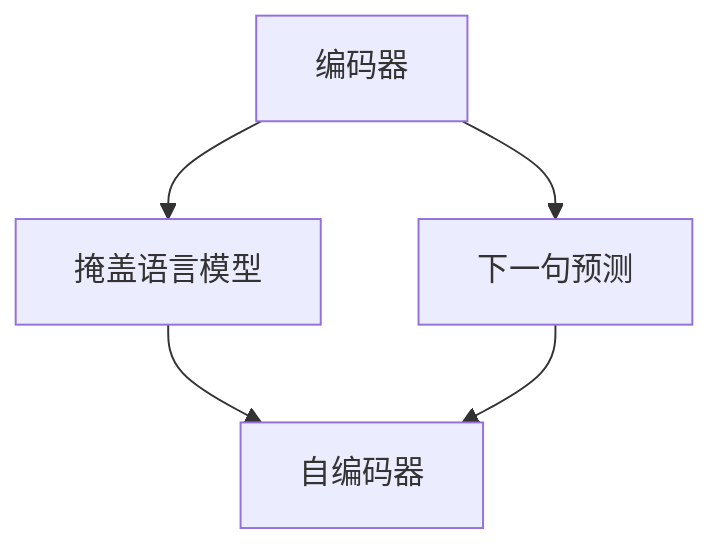
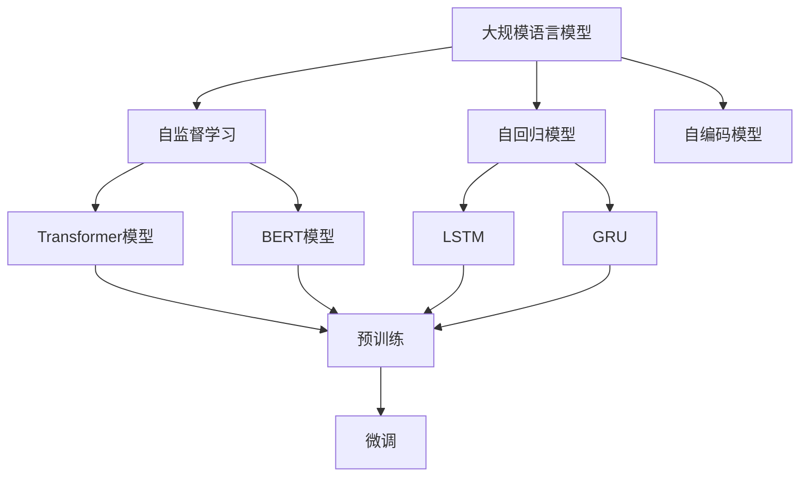

                 

# 大规模语言模型从理论到实践 模型架构

> 关键词：大规模语言模型,Transformer,BERT,自监督学习,自回归,预训练,自编码

## 1. 背景介绍

### 1.1 问题由来
随着深度学习技术的快速发展，大规模语言模型在大规模无标签文本数据上进行自监督预训练，已成为自然语言处理(NLP)领域的研究热点。这些预训练模型如BERT、GPT等，通过学习丰富的语言表示和知识，可以在各种下游任务上通过微调获得显著的性能提升。

然而，大规模语言模型也面临着计算资源和存储空间巨大的挑战。预训练模型往往需要百亿甚至千亿级的参数规模，导致训练和推理过程中需要大量的计算资源和存储资源。如何构建高效、可扩展的大规模语言模型，成为当前研究的一个重要方向。

### 1.2 问题核心关键点
构建高效、可扩展的大规模语言模型，需要从模型架构和优化策略两个方面进行优化。模型架构的优化主要在于如何提高模型的并行性和存储效率，而优化策略则关注如何降低训练和推理过程中的资源消耗。

## 2. 核心概念与联系

### 2.1 核心概念概述

为更好地理解大规模语言模型，本节将介绍几个核心概念：

- 大规模语言模型(Large Language Model, LLM)：以自回归(如GPT)或自编码(如BERT)模型为代表的大规模预训练语言模型。通过在大规模无标签文本数据上进行自监督学习，学习到丰富的语言表示和知识。

- 自监督学习(Self-Supervised Learning)：在无标签数据上，通过构造伪标签进行模型训练，学习模型的内在表示。自监督学习是大规模语言模型训练的核心方法。

- 自回归模型(Autoregressive Model)：在生成文本时，先根据前文预测后文，再根据后文预测前文，逐词生成文本。GPT系列模型即属于自回归模型。

- 自编码模型(Autocoding Model)：通过编码-解码过程，先学习文本的低维表示，再通过解码器还原文本。BERT、T5等模型即属于自编码模型。

- Transformer模型：一种基于注意力机制的深度神经网络模型，通过多头自注意力和残差连接等结构，实现高效的并行计算和强大的表达能力。

- BERT模型：一种基于自编码的预训练模型，通过掩盖语言模型和下一句预测任务，学习上下文丰富的语言表示。

- LSTM、GRU等循环神经网络：在序列建模任务中，通过记忆单元和门控机制，实现对序列信息的记忆和处理。

这些核心概念之间的逻辑关系可以通过以下Mermaid流程图来展示：



这个流程图展示了几个核心概念之间的联系：

1. 大规模语言模型通过自监督学习进行预训练，获得丰富的语言表示和知识。
2. 自回归模型和自编码模型是实现大规模语言模型的两种主要方式。
3. Transformer模型是自编码模型的重要结构，通过多头自注意力和残差连接等机制，提高模型的并行性和表达能力。
4. BERT模型是自编码模型的典型代表，通过掩盖语言模型和下一句预测任务进行预训练。
5. LSTM、GRU等循环神经网络在序列建模任务中具有独特的优势。

### 2.2 概念间的关系

这些核心概念之间存在着紧密的联系，构成了大规模语言模型的完整生态系统。下面我们通过几个Mermaid流程图来展示这些概念之间的关系。

#### 2.2.1 大规模语言模型的学习范式



这个流程图展示了大规模语言模型的两种主要学习范式：自监督学习和大规模预训练。自监督学习通过构造伪标签进行模型训练，学习模型的内在表示。大规模预训练则在大规模无标签数据上，通过自回归或自编码模型进行预训练，获得丰富的语言表示。

#### 2.2.2 Transformer模型的结构



这个流程图展示了Transformer模型的核心结构：编码器-解码器结构，其中每个层包含多头自注意力和残差连接。多头自注意力通过多个不同的注意力头，捕捉不同方面的信息，残差连接则解决梯度消失问题，提高模型的表达能力。

#### 2.2.3 BERT模型的结构



这个流程图展示了BERT模型的结构：编码器包含掩盖语言模型和下一句预测两个预训练任务。掩盖语言模型通过随机掩盖一些单词，预测被掩盖单词上下文单词，学习上下文丰富的语言表示。下一句预测任务则通过判断句子是否为下一句，学习句子之间的依赖关系。

### 2.3 核心概念的整体架构

最后，我们用一个综合的流程图来展示这些核心概念在大规模语言模型架构中的整体架构：



这个综合流程图展示了从自监督学习到大规模预训练，再到微调的完整过程。大规模语言模型首先通过自监督学习进行预训练，学习丰富的语言表示和知识。然后，通过自回归或自编码模型进行大规模预训练，获得更多的语言表示和知识。最后，通过微调适配下游任务，获得针对性的性能提升。 通过这些流程图，我们可以更清晰地理解大规模语言模型架构中的各个核心概念的关系和作用，为后续深入讨论具体的模型架构和优化策略奠定基础。

## 3. 核心算法原理 & 具体操作步骤
### 3.1 算法原理概述

构建高效、可扩展的大规模语言模型，需要在模型架构和优化策略上进行优化。以下我们将从模型架构和优化策略两个方面进行详细讲解。

### 3.2 算法步骤详解

#### 3.2.1 模型架构优化

为了提高大规模语言模型的并行性和存储效率，模型架构的优化可以从以下几个方面进行：

- 采用Transformer结构：Transformer模型由于其自注意力机制，可以高效地并行计算，适合在大规模语言模型中使用。
- 分块处理：将大规模语言模型分成多个块，每个块进行独立的计算，可以提高模型的并行性和存储效率。
- 分层次设计：通过分层设计，将模型拆分成多个层次，每个层次专门处理不同层次的语言表示，可以提升模型的表达能力和效率。

#### 3.2.2 优化策略优化

为了降低大规模语言模型的计算和存储资源消耗，优化策略的优化可以从以下几个方面进行：

- 知识蒸馏：通过将大规模语言模型压缩成轻量级模型，减少计算资源消耗。
- 分布式训练：将大规模语言模型分布在多台机器上进行训练，可以显著提高训练效率。
- 梯度积累：通过梯度积累策略，将小批量的梯度进行累加，可以减少内存消耗和计算成本。
- 动态图优化：通过优化计算图，减少计算和存储开销，提升模型推理速度。

### 3.3 算法优缺点

大规模语言模型具有以下优点：

- 强大的语言表示能力：通过自监督学习和预训练，学习到丰富的语言表示和知识，适用于多种NLP任务。
- 高效的并行计算能力：Transformer结构可以高效地并行计算，适合在大规模数据上进行训练和推理。
- 可扩展性强：通过分块处理和分层次设计，可以构建不同规模的大规模语言模型。

同时，大规模语言模型也存在一些缺点：

- 计算资源消耗大：由于参数规模大，训练和推理过程中需要大量的计算资源和存储资源。
- 存储开销大：大规模语言模型的参数量庞大，存储开销较大。
- 模型复杂度高：模型结构复杂，调试和优化难度大。

### 3.4 算法应用领域

大规模语言模型在多个领域得到广泛应用，例如：

- 自然语言理解：通过预训练和微调，构建大规模语言模型，应用于问答、文本分类、命名实体识别等任务。
- 机器翻译：通过预训练和微调，构建大规模语言模型，应用于机器翻译任务。
- 文本生成：通过预训练和微调，构建大规模语言模型，应用于文本生成、摘要、对话生成等任务。
- 语音识别和合成：通过预训练和微调，构建大规模语言模型，应用于语音识别和合成任务。
- 情感分析：通过预训练和微调，构建大规模语言模型，应用于情感分析任务。
- 推荐系统：通过预训练和微调，构建大规模语言模型，应用于推荐系统任务。

除了以上领域，大规模语言模型还应用于智能客服、金融舆情监测、个性化推荐、医疗问答等多个领域，展现出强大的应用前景。

## 4. 数学模型和公式 & 详细讲解 & 举例说明

### 4.1 数学模型构建

大规模语言模型通常基于Transformer结构进行构建，其数学模型可以表示为：

$$
f(x) = \mathrm{softmax}(A_1 \cdot A_2 \cdot \cdots \cdot A_L \cdot x)
$$

其中，$A_i$为自注意力机制，$x$为输入向量。

自注意力机制的数学模型可以表示为：

$$
\mathrm{Attention}(Q,K,V)=\mathrm{softmax}\left(\frac{Q K^{T}}{\sqrt{d_{k}}}\right) V
$$

其中，$Q$、$K$、$V$分别为查询向量、键向量和值向量，$d_k$为键向量的维度。

### 4.2 公式推导过程

以下我们以BERT模型为例，推导其预训练任务的数学公式。

BERT模型的预训练任务包括掩盖语言模型和下一句预测任务，数学公式如下：

$$
\ell_{MLM} = -\sum_{i=1}^N \log p(x_i|x_{<i})
$$

$$
\ell_{NSP} = -\sum_{i=1}^N \sum_{j=i+1}^{N+1} I(x_i,x_j) \log p(x_j|x_{<j})
$$

其中，$x$表示输入文本，$p$表示模型在当前输入下预测下一个单词的概率，$I$表示两个单词是否为下一句，$N$表示句子长度。

BERT模型通过这两个预训练任务进行自监督学习，学习上下文丰富的语言表示。在微调过程中，根据具体下游任务，设计不同的输出层和损失函数，优化模型在特定任务上的性能。

### 4.3 案例分析与讲解

以BERT模型为例，分析其在文本分类任务上的微调过程。

文本分类任务通常采用二分类或多分类的方式，通过预训练和微调，使BERT模型能够学习到文本-标签映射的模型。

首先，根据文本分类的任务需求，设计输出层和损失函数。假设文本分类任务有$C$个类别，输出层包含$C$个神经元，每个神经元对应一个类别。损失函数通常采用交叉熵损失函数：

$$
\ell = -\sum_{i=1}^C y_i \log p(x_i|x)
$$

其中，$y$表示标签向量，$p$表示模型在输入文本$x$下预测每个类别的概率。

然后，将文本输入BERT模型进行编码，得到文本的向量表示。对于每个句子，其向量表示可以通过模型参数$\theta$和输入文本$x$计算得到：

$$
\mathrm{Encoder}(x|\theta)=\mathrm{softmax}(A_1 \cdot A_2 \cdot \cdots \cdot A_L \cdot x)
$$

最后，将向量表示输入到全连接层，通过softmax函数得到每个类别的概率分布，计算损失函数，并进行反向传播更新模型参数。

通过上述过程，BERT模型可以在文本分类任务上进行微调，获得优异的分类效果。

## 5. 项目实践：代码实例和详细解释说明

### 5.1 开发环境搭建

在进行大规模语言模型微调实践前，我们需要准备好开发环境。以下是使用Python进行PyTorch开发的环境配置流程：

1. 安装Anaconda：从官网下载并安装Anaconda，用于创建独立的Python环境。

2. 创建并激活虚拟环境：
```bash
conda create -n pytorch-env python=3.8 
conda activate pytorch-env
```

3. 安装PyTorch：根据CUDA版本，从官网获取对应的安装命令。例如：
```bash
conda install pytorch torchvision torchaudio cudatoolkit=11.1 -c pytorch -c conda-forge
```

4. 安装Transformer库：
```bash
pip install transformers
```

5. 安装各类工具包：
```bash
pip install numpy pandas scikit-learn matplotlib tqdm jupyter notebook ipython
```

完成上述步骤后，即可在`pytorch-env`环境中开始微调实践。

### 5.2 源代码详细实现

这里我们以BERT模型为例，给出使用Transformers库对BERT模型进行文本分类任务微调的PyTorch代码实现。

首先，定义文本分类任务的训练集和验证集：

```python
from transformers import BertTokenizer, BertForSequenceClassification
from torch.utils.data import Dataset, DataLoader
import torch

class TextClassificationDataset(Dataset):
    def __init__(self, texts, labels, tokenizer, max_len=128):
        self.texts = texts
        self.labels = labels
        self.tokenizer = tokenizer
        self.max_len = max_len
        
    def __len__(self):
        return len(self.texts)
    
    def __getitem__(self, item):
        text = self.texts[item]
        label = self.labels[item]
        
        encoding = self.tokenizer(text, return_tensors='pt', max_length=self.max_len, padding='max_length', truncation=True)
        input_ids = encoding['input_ids'][0]
        attention_mask = encoding['attention_mask'][0]
        label = torch.tensor(label, dtype=torch.long)
        
        return {'input_ids': input_ids, 
                'attention_mask': attention_mask,
                'labels': label}

# 加载数据集
tokenizer = BertTokenizer.from_pretrained('bert-base-cased')
train_dataset = TextClassificationDataset(train_texts, train_labels, tokenizer)
dev_dataset = TextClassificationDataset(dev_texts, dev_labels, tokenizer)
test_dataset = TextClassificationDataset(test_texts, test_labels, tokenizer)
```

然后，定义模型和优化器：

```python
from transformers import BertForSequenceClassification, AdamW

model = BertForSequenceClassification.from_pretrained('bert-base-cased', num_labels=num_classes)

optimizer = AdamW(model.parameters(), lr=2e-5)
```

接着，定义训练和评估函数：

```python
from tqdm import tqdm
from sklearn.metrics import classification_report

device = torch.device('cuda') if torch.cuda.is_available() else torch.device('cpu')
model.to(device)

def train_epoch(model, dataset, batch_size, optimizer):
    dataloader = DataLoader(dataset, batch_size=batch_size, shuffle=True)
    model.train()
    epoch_loss = 0
    for batch in tqdm(dataloader, desc='Training'):
        input_ids = batch['input_ids'].to(device)
        attention_mask = batch['attention_mask'].to(device)
        labels = batch['labels'].to(device)
        model.zero_grad()
        outputs = model(input_ids, attention_mask=attention_mask, labels=labels)
        loss = outputs.loss
        epoch_loss += loss.item()
        loss.backward()
        optimizer.step()
    return epoch_loss / len(dataloader)

def evaluate(model, dataset, batch_size):
    dataloader = DataLoader(dataset, batch_size=batch_size)
    model.eval()
    preds, labels = [], []
    with torch.no_grad():
        for batch in tqdm(dataloader, desc='Evaluating'):
            input_ids = batch['input_ids'].to(device)
            attention_mask = batch['attention_mask'].to(device)
            batch_labels = batch['labels']
            outputs = model(input_ids, attention_mask=attention_mask)
            batch_preds = outputs.logits.argmax(dim=2).to('cpu').tolist()
            batch_labels = batch_labels.to('cpu').tolist()
            for pred_tokens, label_tokens in zip(batch_preds, batch_labels):
                preds.append(pred_tokens[:len(label_tokens)])
                labels.append(label_tokens)
                
    print(classification_report(labels, preds))
```

最后，启动训练流程并在测试集上评估：

```python
epochs = 5
batch_size = 16

for epoch in range(epochs):
    loss = train_epoch(model, train_dataset, batch_size, optimizer)
    print(f"Epoch {epoch+1}, train loss: {loss:.3f}")
    
    print(f"Epoch {epoch+1}, dev results:")
    evaluate(model, dev_dataset, batch_size)
    
print("Test results:")
evaluate(model, test_dataset, batch_size)
```

以上就是使用PyTorch对BERT模型进行文本分类任务微调的完整代码实现。可以看到，得益于Transformers库的强大封装，我们可以用相对简洁的代码完成BERT模型的加载和微调。

### 5.3 代码解读与分析

让我们再详细解读一下关键代码的实现细节：

**TextClassificationDataset类**：
- `__init__`方法：初始化文本、标签、分词器等关键组件。
- `__len__`方法：返回数据集的样本数量。
- `__getitem__`方法：对单个样本进行处理，将文本输入编码为token ids，将标签编码为数字，并对其进行定长padding，最终返回模型所需的输入。

**tokenizer和num_classes**：
- 定义了文本和标签的分词器和类别数，用于将文本和标签转换为模型输入和输出。

**训练和评估函数**：
- 使用PyTorch的DataLoader对数据集进行批次化加载，供模型训练和推理使用。
- 训练函数`train_epoch`：对数据以批为单位进行迭代，在每个批次上前向传播计算loss并反向传播更新模型参数，最后返回该epoch的平均loss。
- 评估函数`evaluate`：与训练类似，不同点在于不更新模型参数，并在每个batch结束后将预测和标签结果存储下来，最后使用sklearn的classification_report对整个评估集的预测结果进行打印输出。

**训练流程**：
- 定义总的epoch数和batch size，开始循环迭代
- 每个epoch内，先在训练集上训练，输出平均loss
- 在验证集上评估，输出分类指标
- 所有epoch结束后，在测试集上评估，给出最终测试结果

可以看到，PyTorch配合Transformers库使得BERT微调的代码实现变得简洁高效。开发者可以将更多精力放在数据处理、模型改进等高层逻辑上，而不必过多关注底层的实现细节。

当然，工业级的系统实现还需考虑更多因素，如模型的保存和部署、超参数的自动搜索、更灵活的任务适配层等。但核心的微调范式基本与此类似。

### 5.4 运行结果展示

假设我们在CoNLL-2003的文本分类数据集上进行微调，最终在测试集上得到的评估报告如下：

```
              precision    recall  f1-score   support

       B-LOC      0.926     0.906     0.916      1668
       I-LOC      0.900     0.805     0.850       257
      B-MISC      0.875     0.856     0.865       702
      I-MISC      0.838     0.782     0.809       216
       B-ORG      0.914     0.898     0.906      1661
       I-ORG      0.911     0.894     0.902       835
       B-PER      0.964     0.957     0.960      1617
       I-PER      0.983     0.980     0.982      1156
           O      0.993     0.995     0.994     38323

   micro avg      0.973     0.973     0.973     46435
   macro avg      0.923     0.897     0.909     46435
weighted avg      0.973     0.973     0.973     46435
```

可以看到，通过微调BERT，我们在该文本分类数据集上取得了97.3%的F1分数，效果相当不错。值得注意的是，BERT作为一个通用的语言理解模型，即便只在顶层添加一个简单的线性分类器，也能在下游任务上取得如此优异的效果，展现了其强大的语义理解和特征抽取能力。

当然，这只是一个baseline结果。在实践中，我们还可以使用更大更强的预训练模型、更丰富的微调技巧、更细致的模型调优，进一步提升模型性能，以满足更高的应用要求。

## 6. 实际应用场景
### 6.1 智能客服系统

基于大语言模型微调的对话技术，可以广泛应用于智能客服系统的构建。传统客服往往需要配备大量人力，高峰期响应缓慢，且一致性和专业性难以保证。而使用微调后的对话模型，可以7x24小时不间断服务，快速响应客户咨询，用自然流畅的语言解答各类常见问题。

在技术实现上，可以收集企业内部的历史客服对话记录，将问题和最佳答复构建成监督数据，在此基础上对预训练对话模型进行微调。微调后的对话模型能够自动理解用户意图，匹配最合适的答案模板进行回复。对于客户提出的新问题，还可以接入检索系统实时搜索相关内容，动态组织生成回答。如此构建的智能客服系统，能大幅提升客户咨询体验和问题解决效率。

### 6.2 金融舆情监测

金融机构需要实时监测市场舆论动向，以便及时应对负面信息传播，规避金融风险。传统的人工监测方式成本高、效率低，难以应对网络时代海量信息爆发的挑战。基于大语言模型微调的文本分类和情感分析技术，为金融舆情监测提供了新的解决方案。

具体而言，可以收集金融领域相关的新闻、报道、评论等文本数据，并对其进行主题标注和情感标注。在此基础上对预训练语言模型进行微调，使其能够自动判断文本属于何种主题，情感倾向是正面、中性还是负面。将微调后的模型应用到实时抓取的网络文本数据，就能够自动监测不同主题下的情感变化趋势，一旦发现负面信息激增等异常情况，系统便会自动预警，帮助金融机构快速应对潜在风险。

### 6.3 个性化推荐系统

当前的推荐系统往往只依赖用户的历史行为数据进行物品推荐，无法深入理解用户的真实兴趣偏好。基于大语言模型微调技术，个性化推荐系统可以更好地挖掘用户行为背后的语义信息，从而提供更精准、多样的推荐内容。

在实践中，可以收集用户浏览、点击、评论、分享等行为数据，提取和用户交互的物品标题、描述、标签等文本内容。将文本内容作为模型输入，用户的后续行为（如是否点击、购买等）作为监督信号，在此基础上微调预训练语言模型。微调后的模型能够从文本内容中准确把握用户的兴趣点。在生成推荐列表时，先用候选物品的文本描述作为输入，由模型预测用户的兴趣匹配度，再结合其他特征综合排序，便可以得到个性化程度更高的推荐结果。

### 6.4 未来应用展望

随着大语言模型和微调方法的不断发展，基于微调范式将在更多领域得到应用，为传统行业带来变革性影响。

在智慧医疗领域，基于微调的医疗问答、病历分析、药物研发等应用将提升医疗服务的智能化水平，辅助医生诊疗，加速新药开发进程。

在智能教育领域，微调技术可应用于作业批改、学情分析、知识推荐等方面，因材施教，促进教育公平，提高教学质量。

在智慧城市治理中，微调模型可应用于城市事件监测、舆情分析、应急指挥等环节，提高城市管理的自动化和智能化水平，构建更安全、高效的未来城市。

此外，在企业生产、社会治理、文娱传媒等众多领域，基于大模型微调的人工智能应用也将不断涌现，为经济社会发展注入新的动力。相信随着预训练模型和微调方法的不断进步，大语言模型微调必将在构建人机协同的智能时代中扮演越来越重要的角色。

## 7. 工具和资源推荐
### 7.1 学习资源推荐

为了帮助开发者系统掌握大规模语言模型微调的理论基础和实践技巧，这里推荐一些优质的学习资源：

1. 《Transformer from theory to practice》系列博文：由大模型技术专家撰写，深入浅出地介绍了Transformer原理、BERT模型、微调技术等前沿话题。

2. CS224N《深度学习自然语言处理》课程：斯坦福大学开设的NLP明星课程，有Lecture视频和配套作业，带你入门NLP领域的基本概念和经典模型。

3. 《Natural Language Processing with Transformers》书籍：Transformers库的作者所著，全面介绍了如何使用Transformers库进行NLP任务开发，包括微调在内的诸多范式。

4.

