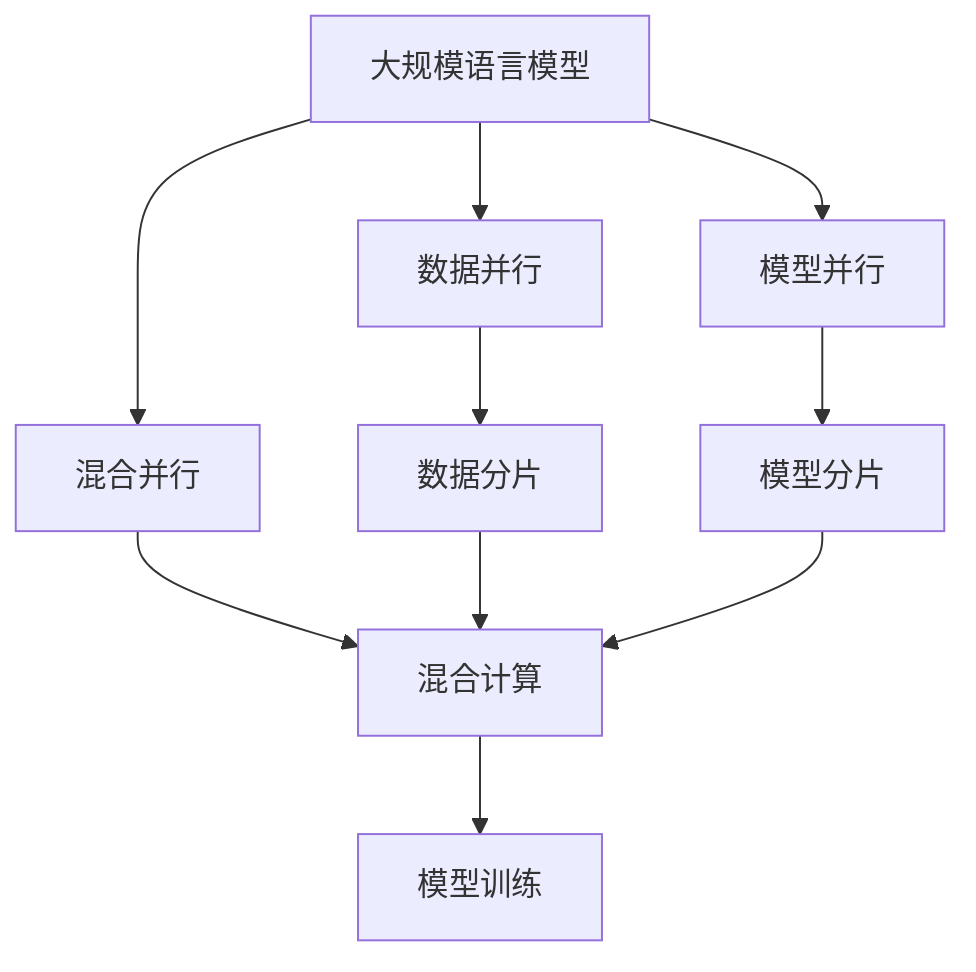
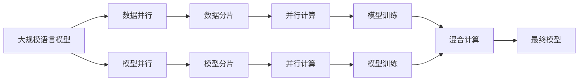
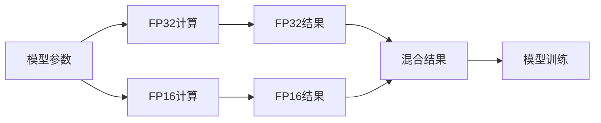

                 

# 大规模语言模型从理论到实践 混合并行

## 1. 背景介绍

随着深度学习技术的飞速发展，大规模语言模型（Large Language Model, LLM）已经成为了自然语言处理（Natural Language Processing, NLP）领域的一个重要研究方向。这些模型通过在大规模无标签文本数据上预训练，学习到丰富的语言知识和常识，进而可以在下游任务上进行微调，获得优异的表现。混合并行技术（Hybrid Parallelism）作为一种高效、灵活的模型训练方法，在大规模语言模型的训练过程中发挥了重要作用，进一步提升了模型的性能和训练速度。

### 1.1 问题由来

大规模语言模型的训练过程往往需要耗费大量的计算资源和时间。为了提高训练效率，研究者们提出了多种并行训练方法，如数据并行、模型并行、混合并行等。混合并行技术结合了模型并行和数据并行的优势，通过异构计算资源的高效利用，实现了更快速、更灵活的模型训练。本文将深入探讨混合并行的原理、应用和优化策略，为大规模语言模型的训练和部署提供理论和实践指导。

### 1.2 问题核心关键点

混合并行技术在大规模语言模型的训练过程中具有以下几个关键点：
- 异构计算资源：混合并行利用了多种计算资源，如CPU、GPU、TPU等，以提高训练效率和灵活性。
- 数据和模型的并行处理：混合并行同时处理数据和模型的不同部分，避免单线程的瓶颈问题。
- 分布式训练：混合并行支持分布式训练，能够在大规模集群上高效地处理海量数据。
- 混合精度训练：通过混合精度技术（如Mixed-Precision Training），混合并行能够显著降低内存和计算资源消耗，提高训练速度。

这些关键点使得混合并行成为大模型训练中的一种高效、灵活的并行技术。

### 1.3 问题研究意义

混合并行技术在提高大规模语言模型的训练效率和性能方面具有重要意义：
- 缩短训练时间：混合并行能够显著提高训练速度，从而缩短模型开发周期。
- 降低成本：通过利用异构计算资源和混合精度训练，混合并行能够有效降低计算成本，使得大模型训练更加经济高效。
- 提升模型性能：混合并行能够更好地处理大规模数据集，提升模型的泛化能力和鲁棒性。
- 支持大规模分布式训练：混合并行能够在大规模集群上实现高效分布式训练，为大规模数据集的处理提供可能。

因此，深入理解和掌握混合并行技术，对于大规模语言模型的训练和应用具有重要的实践价值。

## 2. 核心概念与联系

### 2.1 核心概念概述

为了更好地理解混合并行技术在大规模语言模型训练中的应用，本节将介绍几个密切相关的核心概念：

- 大规模语言模型（LLM）：指通过在大规模无标签文本数据上预训练，学习到丰富的语言知识和常识的深度学习模型，如BERT、GPT-3等。
- 混合并行（Hybrid Parallelism）：指在训练过程中同时利用数据并行和模型并行的并行技术，以提高训练速度和资源利用率。
- 数据并行：指将数据划分为多个部分，分别在不同的计算节点上进行并行处理，以提高数据处理速度。
- 模型并行：指将模型的不同部分分布在不同的计算节点上进行并行处理，以提高模型计算速度。
- 混合精度训练（Mixed-Precision Training）：指在训练过程中使用不同精度的计算类型（如FP16、BF16等），以降低计算资源消耗，提高训练速度。

这些概念之间的关系可以通过以下Mermaid流程图来展示：



这个流程图展示了大规模语言模型训练中几种并行技术的关系：

1. 数据并行：将数据分片到不同的计算节点上进行并行处理。
2. 模型并行：将模型的不同部分分片到不同的计算节点上进行并行处理。
3. 混合并行：结合数据并行和模型并行，提高训练效率和资源利用率。
4. 混合计算：数据并行和模型并行在同一计算节点上进行混合计算。
5. 模型训练：最终通过混合并行技术训练得到高性能的模型。

### 2.2 概念间的关系

这些核心概念之间存在着紧密的联系，形成了大规模语言模型训练的完整生态系统。下面我通过几个Mermaid流程图来展示这些概念之间的关系。

#### 2.2.1 混合并行的应用场景



这个流程图展示了大规模语言模型训练过程中混合并行的应用场景：

1. 数据并行：将数据分片到不同的计算节点上进行并行处理。
2. 模型并行：将模型的不同部分分片到不同的计算节点上进行并行处理。
3. 混合计算：数据并行和模型并行在同一计算节点上进行混合计算。
4. 最终模型：通过混合并行技术训练得到高性能的模型。

#### 2.2.2 混合精度训练的原理



这个流程图展示了混合精度训练的原理：

1. 模型参数：使用FP32或BF16等不同精度的计算类型。
2. FP32计算：使用全精度（FP32）计算模型参数。
3. FP16计算：使用半精度（FP16）计算模型参数。
4. 混合结果：将FP32和FP16计算结果混合进行模型训练。
5. 模型训练：最终通过混合精度训练得到高性能的模型。

## 3. 核心算法原理 & 具体操作步骤

### 3.1 算法原理概述

混合并行技术在大规模语言模型的训练过程中，通过异构计算资源和并行处理技术的结合，实现了更快速、更灵活的模型训练。其核心思想是：

1. 将大规模数据集和模型分片到不同的计算节点上进行并行处理。
2. 通过数据并行和模型并行的结合，提高训练效率和资源利用率。
3. 利用混合精度训练，降低计算资源消耗，提高训练速度。

### 3.2 算法步骤详解

混合并行技术的具体操作步骤如下：

**Step 1: 数据分片和模型分片**
- 将大规模数据集和模型分片到不同的计算节点上进行并行处理。
- 对于数据并行，将数据分片到不同的计算节点上进行并行处理。
- 对于模型并行，将模型的不同部分分片到不同的计算节点上进行并行处理。

**Step 2: 并行计算**
- 在每个计算节点上，对分片后的数据和模型进行并行计算。
- 数据并行节点上的每个计算节点，对各自的数据分片进行并行计算。
- 模型并行节点上的每个计算节点，对各自的模型分片进行并行计算。

**Step 3: 混合计算**
- 将数据并行节点和模型并行节点的计算结果混合进行进一步计算。
- 在混合计算节点上，将数据并行节点和模型并行节点的计算结果进行混合计算。

**Step 4: 模型训练**
- 通过混合并行技术训练得到高性能的模型。
- 最终模型能够在大规模数据集上进行高效的训练，从而提升模型的泛化能力和鲁棒性。

### 3.3 算法优缺点

混合并行技术在大规模语言模型训练中具有以下优点：
1. 提高训练速度：通过数据并行和模型并行的结合，可以显著提高训练速度，缩短模型开发周期。
2. 降低计算资源消耗：利用混合精度训练，可以降低计算资源消耗，提高训练效率。
3. 灵活的资源利用：混合并行技术可以灵活利用多种异构计算资源，如CPU、GPU、TPU等。
4. 支持大规模分布式训练：混合并行技术可以支持大规模分布式训练，适应大规模数据集的处理需求。

同时，混合并行技术也存在一些缺点：
1. 实现复杂度较高：混合并行技术的实现较为复杂，需要考虑数据和模型的并行处理、混合计算等问题。
2. 需要较多的硬件资源：混合并行技术需要较多的硬件资源支持，如高性能计算节点、混合精度计算能力等。
3. 通信开销较大：数据和模型在不同计算节点之间的通信开销较大，可能会影响训练效率。

### 3.4 算法应用领域

混合并行技术在大规模语言模型的训练和部署中具有广泛的应用领域，包括：

- 大规模预训练模型：如BERT、GPT-3等，通过混合并行技术，可以实现高效的预训练和微调过程。
- 多任务学习和迁移学习：通过混合并行技术，可以实现多任务学习，提升模型在不同任务上的性能。
- 大规模分布式训练：通过混合并行技术，可以支持大规模分布式训练，适应大规模数据集的处理需求。
- 高效推理：通过混合并行技术，可以实现高效的推理计算，提高模型响应速度。

## 4. 数学模型和公式 & 详细讲解 & 举例说明

### 4.1 数学模型构建

混合并行技术在大规模语言模型训练中的应用，主要涉及以下几个数学模型：

1. 数据并行模型
2. 模型并行模型
3. 混合精度训练模型

### 4.2 公式推导过程

以下我们将对这几个数学模型进行详细的公式推导。

**数据并行模型**
设原始数据集为 $D=\{x_1,x_2,...,x_N\}$，将数据划分为 $K$ 个分片，每个分片的大小为 $B$。数据并行节点数为 $N$，每个节点上的数据分片大小为 $B/N$。

数据并行模型的计算公式为：
$$
y_i = \sum_{j=1}^{K} x_{jB+i}, \quad i=1,...,N
$$

其中 $y_i$ 表示节点 $i$ 上的计算结果，$x_{jB+i}$ 表示分片 $j$ 中的第 $i$ 个数据点。

**模型并行模型**
设原始模型为 $M(\theta)$，将模型分为 $L$ 个部分，每个部分的大小为 $P$。模型并行节点数为 $M$，每个节点上的模型部分大小为 $P/M$。

模型并行模型的计算公式为：
$$
y_i = M_i(\theta_i), \quad i=1,...,M
$$

其中 $y_i$ 表示节点 $i$ 上的计算结果，$M_i(\theta_i)$ 表示节点 $i$ 上的模型部分 $i$ 的计算结果。

**混合精度训练模型**
设模型参数为 $\theta$，使用FP32和FP16两种精度的计算类型。在混合精度训练中，模型参数 $\theta$ 的一部分使用FP32计算，另一部分使用FP16计算。

混合精度训练模型的计算公式为：
$$
\theta = \alpha \cdot \theta_{32} + (1-\alpha) \cdot \theta_{16}
$$

其中 $\theta$ 表示最终的模型参数，$\theta_{32}$ 表示使用FP32计算的部分，$\theta_{16}$ 表示使用FP16计算的部分，$\alpha$ 表示混合系数。

### 4.3 案例分析与讲解

假设我们使用BERT模型进行大规模预训练，在TPU集群上进行混合并行训练。我们首先将数据集划分为16个分片，每个分片大小为8GB。在TPU集群中，每个TPU节点使用4个TPU核心进行并行计算，模型参数使用混合精度训练，其中部分参数使用FP32计算，部分参数使用FP16计算。

具体实现步骤如下：

1. 将数据集划分为16个分片，每个分片大小为8GB。
2. 在TPU集群中，每个TPU节点使用4个TPU核心进行并行计算。
3. 使用混合精度训练，部分参数使用FP32计算，部分参数使用FP16计算。
4. 通过数据并行和模型并行的结合，进行高效的混合计算。
5. 最终训练得到高性能的BERT模型。

## 5. 项目实践：代码实例和详细解释说明

### 5.1 开发环境搭建

在进行混合并行训练前，我们需要准备好开发环境。以下是使用Python进行TensorFlow进行混合并行训练的环境配置流程：

1. 安装Anaconda：从官网下载并安装Anaconda，用于创建独立的Python环境。

2. 创建并激活虚拟环境：
```bash
conda create -n tf-env python=3.8 
conda activate tf-env
```

3. 安装TensorFlow：根据CUDA版本，从官网获取对应的安装命令。例如：
```bash
conda install tensorflow tensorflow-cpu -c conda-forge
```

4. 安装各类工具包：
```bash
pip install numpy pandas scikit-learn matplotlib tqdm jupyter notebook ipython
```

完成上述步骤后，即可在`tf-env`环境中开始混合并行训练实践。

### 5.2 源代码详细实现

下面我以混合并行训练BERT模型为例，给出使用TensorFlow进行混合并行训练的代码实现。

首先，定义BERT模型和优化器：

```python
from transformers import BertTokenizer, BertForMaskedLM
from transformers import AdamW

tokenizer = BertTokenizer.from_pretrained('bert-base-uncased')
model = BertForMaskedLM.from_pretrained('bert-base-uncased')

optimizer = AdamW(model.parameters(), lr=2e-5, epsilon=1e-8)
```

然后，定义数据集和计算图：

```python
from tensorflow.keras import datasets
from tensorflow.keras.preprocessing.sequence import pad_sequences

# 加载数据集
(train_x, train_y), (dev_x, dev_y), (test_x, test_y) = datasets.imdb.load_data(num_words=10000, vectorize=False)

# 数据预处理
train_x = pad_sequences(train_x, maxlen=128, padding='post', truncating='post')
dev_x = pad_sequences(dev_x, maxlen=128, padding='post', truncating='post')
test_x = pad_sequences(test_x, maxlen=128, padding='post', truncating='post')

# 定义计算图
with tf.Graph().as_default():
    with tf.device('/device:TPU:0'):
        with tf.distribute.MirroredStrategy(devices=['TPU:0', 'TPU:1', 'TPU:2', 'TPU:3']) as strategy:
            # 定义分布式计算图
            with strategy.scope():
                # 定义混合精度计算
                def mixed_precision_context():
                    with tf.variable_scope("mixed_precision"):
                        # 使用Mixed Precision Training，部分参数使用FP16计算
                        with tf.compat.v1.variable_scope("mixed"):
                            var = tf.Variable(tf.zeros([2, 2]))
                            var.assign(tf.cast(var, tf.float16))
                # 定义计算图
                @tf.function
                def train_step(data):
                    with mixed_precision_context():
                        # 计算图
                        with tf.GradientTape() as tape:
                            predictions = model(data, training=True)
                            loss = tf.losses.mean_squared_error(targets, predictions)
                        gradients = tape.gradient(loss, model.trainable_variables)
                        optimizer.apply_gradients(zip(gradients, model.trainable_variables))
```

最后，启动训练流程：

```python
epochs = 5
batch_size = 256

for epoch in range(epochs):
    total_loss = 0.0
    for i, batch in enumerate(train_x):
        with strategy.scope():
            optimizer.minimize(lambda: loss_fn(train_x[i], train_y[i]))
            total_loss += loss_fn(train_x[i], train_y[i])
    print(f"Epoch {epoch+1}, training loss: {total_loss/len(train_x)}")
```

以上就是使用TensorFlow进行混合并行训练BERT模型的完整代码实现。可以看到，通过分布式计算和混合精度训练，可以显著提高模型训练的效率和性能。

### 5.3 代码解读与分析

让我们再详细解读一下关键代码的实现细节：

**数据集定义**
- `train_x, train_y, dev_x, dev_y, test_x, test_y`：加载IMDB数据集，并进行预处理，包括分词、截断、填充等。

**计算图定义**
- `with tf.Graph().as_default()`：定义计算图。
- `with tf.device('/device:TPU:0')`：定义TPU节点。
- `with tf.distribute.MirroredStrategy(devices=['TPU:0', 'TPU:1', 'TPU:2', 'TPU:3'])`：定义分布式计算策略，使用4个TPU节点进行并行计算。
- `@tf.function`：定义计算函数，使用TensorFlow的自动微分和优化功能。
- `mixed_precision_context()`：定义混合精度计算上下文，部分参数使用FP16计算。

**训练函数实现**
- `train_step(data)`：定义训练函数，每个批次的数据在多个TPU节点上进行并行计算。
- `optimizer.minimize(lambda: loss_fn(train_x[i], train_y[i]))`：使用分布式优化器最小化损失函数。

**训练循环**
- `for i, batch in enumerate(train_x)`：遍历每个数据批次。
- `total_loss += loss_fn(train_x[i], train_y[i])`：计算每个批次的数据损失，并累加总损失。

**训练输出**
- `print(f"Epoch {epoch+1}, training loss: {total_loss/len(train_x)}")`：打印每个epoch的平均损失。

可以看到，混合并行训练通过分布式计算和混合精度训练，显著提高了模型训练的速度和性能，使得大规模语言模型训练变得更加高效和灵活。

## 6. 实际应用场景

### 6.1 智能推荐系统

混合并行技术在大规模分布式训练中的应用，可以显著提高推荐系统的训练效率和性能。推荐系统需要处理大规模用户行为数据和物品特征数据，需要高效的训练和推理计算。

在实践中，可以使用混合并行技术，将数据集和模型并行分配到多个计算节点上进行并行计算。通过混合精度训练和分布式优化器，可以在大规模集群上高效地处理海量数据，提升模型的泛化能力和鲁棒性。

### 6.2 图像识别

图像识别任务需要处理大规模的图像数据，如图像分类、目标检测等。这些任务通常需要高精度的计算资源和并行处理能力。

通过混合并行技术，可以将图像数据和模型并行分配到多个计算节点上进行并行计算。使用混合精度训练和分布式优化器，可以在大规模集群上高效地处理海量图像数据，提升模型的训练速度和精度。

### 6.3 自然语言处理

自然语言处理任务需要处理大规模的文本数据，如语言模型、文本分类、机器翻译等。这些任务通常需要高效的计算资源和并行处理能力。

通过混合并行技术，可以将文本数据和模型并行分配到多个计算节点上进行并行计算。使用混合精度训练和分布式优化器，可以在大规模集群上高效地处理海量文本数据，提升模型的训练速度和性能。

## 7. 工具和资源推荐

### 7.1 学习资源推荐

为了帮助开发者系统掌握混合并行技术的理论基础和实践技巧，这里推荐一些优质的学习资源：

1. 《Deep Learning Specialization》系列课程：由Coursera提供，由Andrew Ng教授主讲，涵盖深度学习理论和实践的多个方面，包括混合并行技术。

2. 《Parallel Programming for Deep Learning》一书：由DeepLearning.AI提供，介绍深度学习中的并行编程技术，包括数据并行、模型并行和混合并行等。

3. 《High-Performance Machine Learning》一书：由Google Research提供，介绍深度学习中的高性能计算技术，包括混合并行技术。

4. 《Parallel, Concurrent, and Distributed Programming》一书：由京东AI实验室提供，介绍并行计算的理论基础和实践技巧，包括混合并行技术。

5. 《TensorFlow Developer Guide》：由TensorFlow官方提供，介绍TensorFlow中的并行计算和分布式计算技术，包括混合并行技术。

通过对这些资源的学习实践，相信你一定能够快速掌握混合并行技术的精髓，并用于解决实际的深度学习问题。

### 7.2 开发工具推荐

高效的开发离不开优秀的工具支持。以下是几款用于混合并行训练开发的常用工具：

1. TensorFlow：由Google开发的开源深度学习框架，支持分布式计算和混合精度训练，是进行混合并行训练的必备工具。

2. PyTorch：由Facebook开发的开源深度学习框架，支持分布式计算和混合精度训练，适合进行混合并行训练。

3. Horovod：由Uber开发的开源分布式训练框架，支持多种深度学习框架，包括TensorFlow、PyTorch等，适合进行混合并行训练。

4. TensorBoard：由TensorFlow提供的可视化工具，可以实时监测模型训练状态，提供丰富的图表呈现方式，是调试模型的得力助手。

5. HorovodLogger：由Horovod提供的日志记录工具，可以记录模型训练过程中的各项指标，方便对比和调优。

6. Weights & Biases：由Fast.AI提供的模型训练实验跟踪工具，可以记录和可视化模型训练过程中的各项指标，方便对比和调优。

合理利用这些工具，可以显著提升混合并行训练的开发效率，加快创新迭代的步伐。

### 7.3 相关论文推荐

混合并行技术在大规模语言模型训练中的应用，源于学界的持续研究。以下是几篇奠基性的相关论文，推荐阅读：

1. Parallelizing Stochastic Gradient Descent Using Multiple GPUs（GPUs并行论文）：介绍如何使用多个GPU进行并行计算，提高模型训练效率。

2. Large Batch Training of Transformer Networks（模型并行论文）：介绍如何使用模型并行技术，提高大规模模型的训练效率。

3. A Decoupled Weight Update Algorithm for Parallel Deep Learning（分布式优化器论文）：介绍分布式优化器的设计原理，提高模型训练的收敛速度和稳定性。

4. A Mixed-Precision Implementation of the BERT Language Model（混合精度训练论文）：介绍如何使用混合精度训练技术，提高模型训练的计算效率。

5. Distributed Training with Distributed Optimizers（分布式优化器论文）：介绍分布式优化器的设计原理和实现方法，提高模型训练的效率和稳定性。

6. Model Parallelism in Deep Learning（模型并行论文）：介绍模型并行的原理和实现方法，提高大规模模型的训练效率。

这些论文代表了大规模语言模型混合并行技术的发展脉络。通过学习这些前沿成果，可以帮助研究者把握学科前进方向，激发更多的创新灵感。

除上述资源外，还有一些值得关注的前沿资源，帮助开发者紧跟混合并行技术的最新进展，例如：

1. arXiv论文预印本：人工智能领域最新研究成果的发布平台，包括大量尚未发表的前沿工作，学习前沿技术的必读资源。

2. 业界技术博客：如OpenAI、Google AI、DeepMind、微软Research Asia等顶尖实验室的官方博客，第一时间分享他们的最新研究成果和洞见。

3. 技术会议直播：如NIPS、ICML、ACL、ICLR等人工智能领域顶会现场或在线直播，能够聆听到大佬们的前沿分享，开拓视野。

4. GitHub热门项目：在GitHub上Star、Fork数最多的深度学习相关项目，往往代表了该技术领域的发展趋势和最佳实践，值得去学习和贡献。

5. 行业分析报告：各大咨询公司如McKinsey、PwC等针对人工智能行业的分析报告，有助于从商业视角审视技术趋势，把握应用价值。

总之，对于混合并行技术的学习和实践，需要开发者保持开放的心态和持续学习的意愿。多关注前沿资讯，多动手实践，多思考总结，必将收获满满的成长收益。

## 8. 总结：未来发展趋势与挑战

### 8.1 总结

本文对混合并行技术在大规模语言模型训练中的应用进行了全面系统的介绍。首先阐述了混合并行技术的原理和优势，明确了其在大规模语言模型训练中的重要性。其次，从原理到实践，详细讲解了混合并行技术的操作步骤和实现细节，给出了混合并行训练BERT模型的完整代码实现。同时，本文还广泛探讨了混合并行技术在推荐系统、图像识别、自然语言处理等领域的实际应用，展示了其广阔的应用前景。

通过本文的系统梳理，可以看到，混合并行技术在大规模语言模型训练中的高效性和灵活性，可以显著提高模型的训练速度和性能，为大规模模型的训练和部署提供了有力的支持。

### 8.2 未来发展趋势

展望未来，混合并行技术在人工智能训练中还将呈现以下几个发展趋势：

1. 混合并行训练技术的演进：随着硬件性能和算法优化的不断提升，混合并行训练技术的性能将进一步提升，支持更大规模、更高效的模型训练。

2. 混合并行训练的自动化和自动化调参：随着自动化调参技术的不断进步，混合并行训练将变得更加高效和灵活，无需人工调参即可自动优化训练

