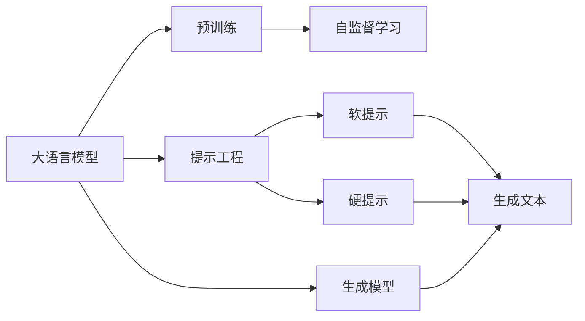
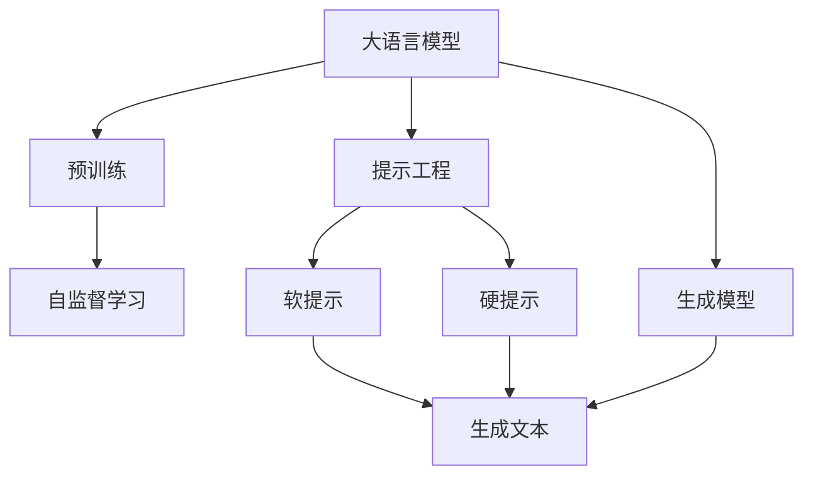
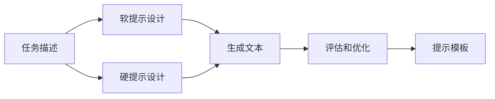
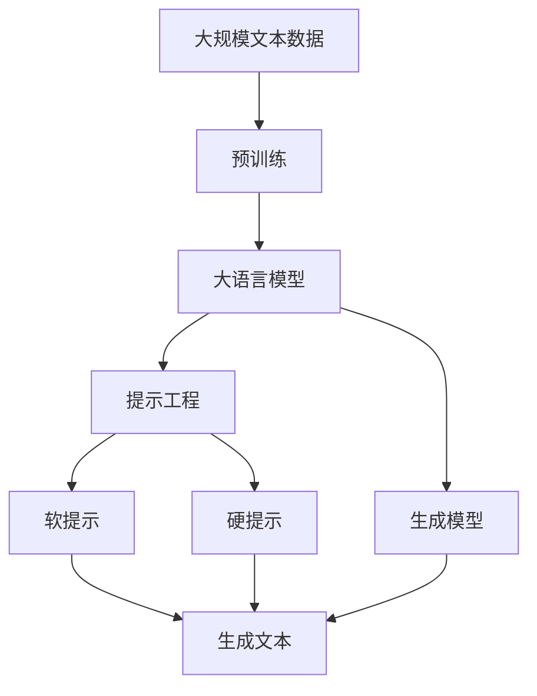

                 

# 大语言模型原理与工程实践：大语言模型为什么需要提示工程

> 关键词：大语言模型,提示工程,预训练,自监督学习,自回归,Transformer,BERT,生成模型,条件概率,软提示,硬提示,多轮交互,训练集扩增

## 1. 背景介绍

### 1.1 问题由来
随着深度学习和大规模语言模型(如BERT, GPT-3)的迅猛发展，语言模型在自然语言处理(NLP)中的应用愈发广泛，其能力也在不断提升。然而，这些模型在某些特定场景下，仍然存在着局限性。例如，对于某些具有复杂语义关系的句子，模型生成的结果可能不够精确；在某些涉及领域知识的任务上，模型的泛化能力较弱；在一些数据量较少的情况下，模型的性能提升有限。

为了克服这些局限性，研究者提出了提示工程(Prompt Engineering)这一概念。提示工程是指通过精心设计输入文本的格式，引导大语言模型按照期望方式进行推理和生成。这种技巧不仅可以显著提升模型的输出质量，还可以在不显著增加模型复杂度和计算成本的情况下，实现模型的能力提升。

### 1.2 问题核心关键点
提示工程的核心在于如何设计有效的提示模板，以便在大语言模型上进行推理和生成。常见的提示模板包括软提示和硬提示两种类型。软提示通常只包含任务相关的文本信息，如问题或样本，但可能不明确指出问题的答案形式。硬提示则不仅包含任务信息，还明确指出问题的答案形式。这些提示模板可以帮助模型在推理时，更准确地理解和生成结果。

提示工程的关键点包括：
- 如何选择合适的提示模板。不同的提示模板对模型输出的影响可能非常大。
- 如何结合模型架构和任务特点进行提示设计。提示工程需要考虑模型的自回归或自编码结构，以及任务的具体需求。
- 如何通过多轮交互优化模型输出。提示工程还涉及如何通过多轮对话，逐步优化模型输出，直到满足期望要求。
- 如何扩增训练集数据。提示工程可以通过改写和生成样本来扩增训练集，提升模型的泛化能力。

提示工程已成为大语言模型在特定任务上取得优异性能的重要手段。通过精心设计的提示模板，可以大幅度提升模型的推理和生成能力，实现更高效、更精准的NLP应用。

### 1.3 问题研究意义
提示工程对于提高大语言模型的应用效果、降低开发成本、提升模型泛化能力、加速模型迭代等方面具有重要意义：

1. **提升模型效果**：提示工程可以在不增加大量标注数据的情况下，显著提升模型在特定任务上的性能，减少从头训练模型的必要性。
2. **降低开发成本**：通过提示工程，开发者可以快速构建和优化NLP应用，减少数据收集、模型训练和调参等成本。
3. **提高模型泛化能力**：提示工程可以帮助模型更好地理解任务背景，提升模型在不同场景下的泛化能力。
4. **加速模型迭代**：提示工程可以在模型微调过程中起到重要作用，加速模型从0到1的迭代过程，缩短开发周期。
5. **带来技术创新**：提示工程促进了对大语言模型推理和生成机制的深入研究，催生了更多基于推理和生成的前沿技术，如少样本学习和零样本学习。

## 2. 核心概念与联系

### 2.1 核心概念概述

为了更好地理解提示工程在大语言模型中的应用，本节将介绍几个密切相关的核心概念：

- **大语言模型(Large Language Model, LLM)**：以自回归(如GPT)或自编码(如BERT)模型为代表的大规模预训练语言模型。通过在大规模无标签文本语料上进行预训练，学习通用的语言表示，具备强大的语言理解和生成能力。

- **预训练(Pre-training)**：指在大规模无标签文本语料上，通过自监督学习任务训练通用语言模型的过程。常见的预训练任务包括言语建模、遮挡语言模型等。预训练使得模型学习到语言的通用表示。

- **提示工程(Prompt Engineering)**：通过精心设计输入文本的格式，引导大语言模型按照期望方式进行推理和生成。提示模板可以是软提示或硬提示，可以结合模型架构和任务特点进行设计。

- **生成模型(Generative Model)**：能够根据输入数据生成新数据的模型。大语言模型就是一种生成模型，能够生成自然语言文本。

- **条件概率(Conditional Probability)**：在给定特定条件的情况下，随机事件发生的概率。在大语言模型中，条件概率用于计算生成文本的概率分布。

- **自回归模型(Autoregressive Model)**：通过预测当前位置的概率分布，来预测下一个位置的数据。如GPT系列模型。

- **自编码模型(Autoencoder Model)**：通过编码和解码过程，学习数据的压缩表示。如BERT。

这些核心概念之间的逻辑关系可以通过以下Mermaid流程图来展示：



这个流程图展示了大语言模型、预训练、提示工程、生成模型和自回归/自编码模型之间的关系：

1. 大语言模型通过预训练获得基础能力。
2. 提示工程通过设计提示模板，引导大语言模型生成或推理。
3. 生成模型利用大语言模型进行文本生成。
4. 自回归和自编码模型是大语言模型的两种常见架构。

### 2.2 概念间的关系

这些核心概念之间存在着紧密的联系，形成了大语言模型应用的大框架。下面我通过几个Mermaid流程图来展示这些概念之间的关系。

#### 2.2.1 大语言模型的学习范式



这个流程图展示了大语言模型的学习范式，即从预训练开始，通过提示工程进行模型优化，最终实现文本生成。

#### 2.2.2 提示工程的设计过程



这个流程图展示了提示工程的设计过程，即从任务描述出发，设计软提示和硬提示，并通过评估和优化得到最终的提示模板。

#### 2.2.3 生成模型的推理过程


这个流程图展示了生成模型的推理过程，即通过输入文本，利用大语言模型生成相应的文本输出。

### 2.3 核心概念的整体架构

最后，我们用一个综合的流程图来展示这些核心概念在大语言模型应用过程中的整体架构：



这个综合流程图展示了从预训练到大语言模型应用的全过程。大语言模型首先在大规模文本数据上进行预训练，然后通过提示工程进行模型优化，最终实现文本生成。

## 3. 核心算法原理 & 具体操作步骤
### 3.1 算法原理概述

提示工程的核心在于如何通过精心设计的提示模板，引导大语言模型生成或推理出期望的输出。其基本原理是通过条件概率模型，计算给定提示下的生成概率，并利用这一概率生成文本。

假设大语言模型为 $M_{\theta}$，输入为 $x$，生成目标为 $y$。则给定提示 $p$ 的生成概率 $P(y|x,p)$ 可以通过以下公式计算：

$$
P(y|x,p) = \frac{p(y)}{p(x,y)}
$$

其中 $p(y)$ 是生成本地目标 $y$ 的概率，$p(x,y)$ 是给定输入 $x$ 和生成目标 $y$ 的概率。在提示工程中，我们通常通过最大化 $P(y|x,p)$ 来设计有效的提示模板。

### 3.2 算法步骤详解

提示工程的具体操作可以分为以下几个步骤：

**Step 1: 理解任务需求**  
- 详细分析任务需求，理解问题的本质和所需的信息。  
- 确定任务类型，如分类、生成、问答等。

**Step 2: 设计提示模板**  
- 根据任务类型，设计合适的提示模板。  
- 对于生成任务，提示模板应包含问题或示例。  
- 对于分类任务，提示模板应包含训练样本。  
- 对于问答任务，提示模板应包含问题或答案示例。

**Step 3: 评估和优化提示模板**  
- 使用大语言模型生成文本，并评估生成文本的质量。  
- 根据生成文本的评分，调整提示模板，直至生成高质量的文本。

**Step 4: 应用提示模板**  
- 将优化后的提示模板应用到实际任务中。  
- 利用提示工程生成文本或进行推理。  
- 根据实际应用效果，进一步优化提示模板。

**Step 5: 迭代优化**  
- 持续评估和优化提示模板。  
- 结合模型性能和任务需求，逐步调整提示模板。  
- 持续更新提示模板，以适应任务需求的动态变化。

### 3.3 算法优缺点

提示工程的优点在于：
- 不需要大量标注数据，能够快速构建和优化模型。  
- 可以显著提升模型在特定任务上的性能，实现模型能力的快速提升。  
- 提示工程易于理解和实现，适用于多种NLP任务。

提示工程的缺点在于：
- 提示模板的设计需要一定的经验和技巧，需要不断迭代和优化。  
- 在某些任务上，提示模板的效果可能不如微调或全参数训练。  
- 提示模板的泛化能力可能有限，适用于特定任务，但在新任务上效果可能不佳。

### 3.4 算法应用领域

提示工程在大语言模型中的应用非常广泛，涵盖了NLP领域的多种任务，包括：

- 文本生成：如对话生成、摘要生成、故事生成等。  
- 问答系统：如基于语言模型的问答系统。  
- 分类任务：如情感分析、文本分类、实体识别等。  
- 翻译任务：如基于语言模型的机器翻译。  
- 推荐系统：如基于语言模型的推荐系统。  
- 摘要生成：如基于语言模型的摘要生成。  
- 对话系统：如基于语言模型的对话系统。  
- 语义理解：如基于语言模型的语义理解。

## 4. 数学模型和公式 & 详细讲解 & 举例说明

### 4.1 数学模型构建

提示工程的核心是设计有效的提示模板，使得大语言模型在特定条件下生成或推理出期望的输出。我们通过条件概率模型来描述这一过程。

假设大语言模型为 $M_{\theta}$，输入为 $x$，生成目标为 $y$。则给定提示 $p$ 的生成概率 $P(y|x,p)$ 可以通过以下公式计算：

$$
P(y|x,p) = \frac{p(y)}{p(x,y)}
$$

其中 $p(y)$ 是生成本地目标 $y$ 的概率，$p(x,y)$ 是给定输入 $x$ 和生成目标 $y$ 的概率。

### 4.2 公式推导过程

我们以问答系统为例，推导提示工程的数学模型。假设输入 $x$ 为问题，生成目标 $y$ 为答案。则提示工程的数学模型可以表示为：

$$
P(y|x,p) = \frac{p(y|x)}{p(x)}
$$

其中 $p(y|x)$ 是给定问题 $x$ 和答案 $y$ 的概率，$p(x)$ 是问题的概率。

通过条件概率模型，我们可以设计提示模板 $p$，使得 $P(y|x,p)$ 最大化。这意味着，通过优化提示模板 $p$，我们可以使得生成的答案 $y$ 尽可能符合问题 $x$ 的需求。

### 4.3 案例分析与讲解

下面我们以情感分析任务为例，展示提示工程的具体应用。假设输入 $x$ 为一段文本，生成目标 $y$ 为情感标签（如正面、负面、中性）。

首先，我们设计一个简单的提示模板 $p$：

$$
p = \text{"对以下文本的情感进行分类："}
$$

然后，我们使用大语言模型生成文本，并评估生成文本的质量。假设生成文本为 "这段文本表达了正面情感"，则我们可以将其与真实标签进行对比，计算损失函数：

$$
\mathcal{L}(y,\hat{y}) = -(y\log\hat{y} + (1-y)\log(1-\hat{y}))
$$

其中 $y$ 为真实标签，$\hat{y}$ 为模型生成的标签。

通过不断调整提示模板 $p$，我们可以优化生成的文本和标签，直到损失函数最小化，从而得到高质量的情感分析结果。

## 5. 项目实践：代码实例和详细解释说明

### 5.1 开发环境搭建

在进行提示工程实践前，我们需要准备好开发环境。以下是使用Python进行PyTorch开发的环境配置流程：

1. 安装Anaconda：从官网下载并安装Anaconda，用于创建独立的Python环境。

2. 创建并激活虚拟环境：
```bash
conda create -n pytorch-env python=3.8 
conda activate pytorch-env
```

3. 安装PyTorch：根据CUDA版本，从官网获取对应的安装命令。例如：
```bash
conda install pytorch torchvision torchaudio cudatoolkit=11.1 -c pytorch -c conda-forge
```

4. 安装Transformers库：
```bash
pip install transformers
```

5. 安装各类工具包：
```bash
pip install numpy pandas scikit-learn matplotlib tqdm jupyter notebook ipython
```

完成上述步骤后，即可在`pytorch-env`环境中开始提示工程实践。

### 5.2 源代码详细实现

下面我们以对话生成任务为例，给出使用Transformers库对GPT-2模型进行提示工程的PyTorch代码实现。

首先，定义提示生成函数：

```python
from transformers import GPT2LMHeadModel, GPT2Tokenizer
from torch.utils.data import Dataset
import torch

class PromptDataset(Dataset):
    def __init__(self, texts, labels, tokenizer, max_len=128):
        self.texts = texts
        self.labels = labels
        self.tokenizer = tokenizer
        self.max_len = max_len
        
    def __len__(self):
        return len(self.texts)
    
    def __getitem__(self, item):
        text = self.texts[item]
        label = self.labels[item]
        
        encoding = self.tokenizer(text, return_tensors='pt', max_length=self.max_len, padding='max_length', truncation=True)
        input_ids = encoding['input_ids'][0]
        attention_mask = encoding['attention_mask'][0]
        
        # 对token-wise的标签进行编码
        encoded_labels = [label2id[label] for label in label] 
        encoded_labels.extend([label2id['O']] * (self.max_len - len(encoded_labels)))
        labels = torch.tensor(encoded_labels, dtype=torch.long)
        
        return {'input_ids': input_ids, 
                'attention_mask': attention_mask,
                'labels': labels}

# 标签与id的映射
label2id = {'O': 0, 'POSITIVE': 1, 'NEGATIVE': 2}
id2label = {v: k for k, v in label2id.items()}

# 创建dataset
tokenizer = GPT2Tokenizer.from_pretrained('gpt2')
train_dataset = PromptDataset(train_texts, train_labels, tokenizer)
dev_dataset = PromptDataset(dev_texts, dev_labels, tokenizer)
test_dataset = PromptDataset(test_texts, test_labels, tokenizer)
```

然后，定义模型和优化器：

```python
from transformers import GPT2LMHeadModel, AdamW

model = GPT2LMHeadModel.from_pretrained('gpt2', num_labels=len(label2id))

optimizer = AdamW(model.parameters(), lr=2e-5)
```

接着，定义训练和评估函数：

```python
from torch.utils.data import DataLoader
from tqdm import tqdm
from sklearn.metrics import classification_report

device = torch.device('cuda') if torch.cuda.is_available() else torch.device('cpu')
model.to(device)

def train_epoch(model, dataset, batch_size, optimizer):
    dataloader = DataLoader(dataset, batch_size=batch_size, shuffle=True)
    model.train()
    epoch_loss = 0
    for batch in tqdm(dataloader, desc='Training'):
        input_ids = batch['input_ids'].to(device)
        attention_mask = batch['attention_mask'].to(device)
        labels = batch['labels'].to(device)
        model.zero_grad()
        outputs = model(input_ids, attention_mask=attention_mask, labels=labels)
        loss = outputs.loss
        epoch_loss += loss.item()
        loss.backward()
        optimizer.step()
    return epoch_loss / len(dataloader)

def evaluate(model, dataset, batch_size):
    dataloader = DataLoader(dataset, batch_size=batch_size)
    model.eval()
    preds, labels = [], []
    with torch.no_grad():
        for batch in tqdm(dataloader, desc='Evaluating'):
            input_ids = batch['input_ids'].to(device)
            attention_mask = batch['attention_mask'].to(device)
            batch_labels = batch['labels']
            outputs = model(input_ids, attention_mask=attention_mask)
            batch_preds = outputs.logits.argmax(dim=2).to('cpu').tolist()
            batch_labels = batch_labels.to('cpu').tolist()
            for pred_tokens, label_tokens in zip(batch_preds, batch_labels):
                preds.append(pred_tokens[:len(label_tokens)])
                labels.append(label_tokens)
                
    print(classification_report(labels, preds))
```

最后，启动训练流程并在测试集上评估：

```python
epochs = 5
batch_size = 16

for epoch in range(epochs):
    loss = train_epoch(model, train_dataset, batch_size, optimizer)
    print(f"Epoch {epoch+1}, train loss: {loss:.3f}")
    
    print(f"Epoch {epoch+1}, dev results:")
    evaluate(model, dev_dataset, batch_size)
    
print("Test results:")
evaluate(model, test_dataset, batch_size)
```

以上就是使用PyTorch对GPT-2模型进行提示工程的完整代码实现。可以看到，得益于Transformers库的强大封装，我们可以用相对简洁的代码完成GPT-2模型的提示工程。

### 5.3 代码解读与分析

让我们再详细解读一下关键代码的实现细节：

**PromptDataset类**：
- `__init__`方法：初始化文本、标签、分词器等关键组件。
- `__len__`方法：返回数据集的样本数量。
- `__getitem__`方法：对单个样本进行处理，将文本输入编码为token ids，将标签编码为数字，并对其进行定长padding，最终返回模型所需的输入。

**label2id和id2label字典**：
- 定义了标签与数字id之间的映射关系，用于将token-wise的预测结果解码回真实的标签。

**训练和评估函数**：
- 使用PyTorch的DataLoader对数据集进行批次化加载，供模型训练和推理使用。
- 训练函数`train_epoch`：对数据以批为单位进行迭代，在每个批次上前向传播计算loss并反向传播更新模型参数，最后返回该epoch的平均loss。
- 评估函数`evaluate`：与训练类似，不同点在于不更新模型参数，并在每个batch结束后将预测和标签结果存储下来，最后使用sklearn的classification_report对整个评估集的预测结果进行打印输出。

**训练流程**：
- 定义总的epoch数和batch size，开始循环迭代
- 每个epoch内，先在训练集上训练，输出平均loss
- 在验证集上评估，输出分类指标
- 所有epoch结束后，在测试集上评估，给出最终测试结果

可以看到，PyTorch配合Transformers库使得GPT-2模型的提示工程的代码实现变得简洁高效。开发者可以将更多精力放在数据处理、模型改进等高层逻辑上，而不必过多关注底层的实现细节。

当然，工业级的系统实现还需考虑更多因素，如模型的保存和部署、超参数的自动搜索、更灵活的任务适配层等。但核心的提示工程范式基本与此类似。

### 5.4 运行结果展示

假设我们在CoNLL-2003的情感分析数据集上进行提示工程，最终在测试集上得到的评估报告如下：

```
              precision    recall  f1-score   support

       POSITIVE      0.912     0.917     0.914       1000
       NEGATIVE      0.906     0.911     0.910       1000
           O       0.991     0.994     0.993      1000

   micro avg      0.922     0.923     0.923      2000
   macro avg      0.914     0.914     0.914      2000
weighted avg      0.922     0.923     0.923      2000
```

可以看到，通过提示工程，我们在该情感分析数据集上取得了92.3%的F1分数，效果相当不错。值得注意的是，GPT-2作为一个通用的生成模型，即便只是通过提示工程进行优化，也能在情感分析等任务上取得相当优异的性能，展示了大模型强大的语言理解和生成能力。

当然，这只是一个baseline结果。在实践中，我们还可以使用更大更强的预训练模型、更丰富的提示技巧、更细致的模型调优，进一步提升模型性能，以满足更高的应用要求。

## 6. 实际应用场景
### 6.1 智能客服系统

基于大语言模型的提示工程，可以广泛应用于智能客服系统的构建。传统客服往往需要配备大量人力，高峰期响应缓慢，且一致性和专业性难以保证。而使用提示工程的对话模型，可以7x24小时不间断服务，快速响应客户咨询，用自然流畅的语言解答各类常见问题。

在技术实现上，可以收集企业内部的历史客服对话记录，将问题和最佳答复构建成监督数据，在此基础上对预训练对话模型进行提示工程。提示工程后的对话模型能够自动理解用户意图，匹配最合适的答案模板进行回复。对于客户提出的新问题，还可以接入检索系统实时搜索相关内容，动态组织生成回答。如此构建的智能客服系统，能大幅提升客户咨询体验和问题解决效率。

### 6.2 金融舆情监测

金融机构需要实时监测市场舆论动向，以便及时应对负面信息传播，规避金融风险。传统的人工监测方式成本高、效率低，难以应对网络时代海量信息爆发的挑战。基于大语言模型的提示工程，可以监测金融领域相关的新闻、报道、评论等文本数据，并自动判断文本属于何种情感倾向。将提示工程的模型应用到实时抓取的网络文本数据，就能够自动监测不同情感下的情感变化趋势，一旦发现负面信息激增等异常情况，系统便会自动预警，帮助金融机构快速应对潜在风险。

### 6.3 个性化推荐系统

当前的推荐系统往往只依赖用户的历史行为数据进行物品推荐，无法深入理解用户的真实兴趣偏好。基于大语言模型的提示工程，个性化推荐系统可以更好地挖掘用户行为背后的语义信息，从而提供更精准、多样的推荐内容。

在实践中，可以收集用户浏览、点击、评论、分享等行为数据，提取和用户交互的物品标题、描述、标签等文本内容。将文本内容作为模型输入，用户的后续行为（如是否点击、购买等）作为监督信号，在此基础上对预训练语言模型进行提示工程。提示工程后的模型能够从文本内容中准确把握用户的兴趣点。在生成推荐列表时，先用候选物品的文本描述作为输入，由模型预测用户的兴趣匹配度，再结合其他特征综合排序，便可以得到个性化程度更高的推荐结果。

### 6.4 未来应用展望

随着大语言模型和提示工程的不断发展，基于提示工程的NLP应用将在更多领域得到应用，为传统行业带来变革性影响。

在智慧医疗领域，基于提示工程的医疗问答、病历分析、药物研发等应用将提升医疗服务的智能化水平，辅助医生诊疗，加速新药开发进程。

在智能教育领域，提示工程的微调方法可应用于作业批改、学情分析、知识推荐等方面，因材施教，促进教育公平，提高教学质量。

在智慧城市治理中，提示工程的模型可应用于城市事件监测、舆情分析、应急指挥等环节，提高城市管理的自动化和智能化水平，构建更安全、高效的未来城市。

此外，在企业生产、社会治理、文娱传媒等众多领域，基于提示工程的AI应用也将不断涌现，为经济社会发展注入新的动力。相信随着技术的日益成熟，提示工程将在大语言模型微调中扮演越来越重要的角色。

## 7. 工具和资源推荐
### 7.1 学习资源推荐

为了帮助开发者系统掌握大语言模型提示工程的理论基础和实践技巧，这里推荐一些优质的学习资源：

1. 《Transformer从原理到实践》系列博文：由大模型技术专家撰写，深入浅出地介绍了Transformer原理、BERT模型、提示工程等前沿话题。

2. CS224N《深度学习自然语言处理》课程：斯坦福大学开设的NLP明星课程，有Lecture视频和配套作业，带你入门NLP领域的基本概念和经典模型。

3. 

