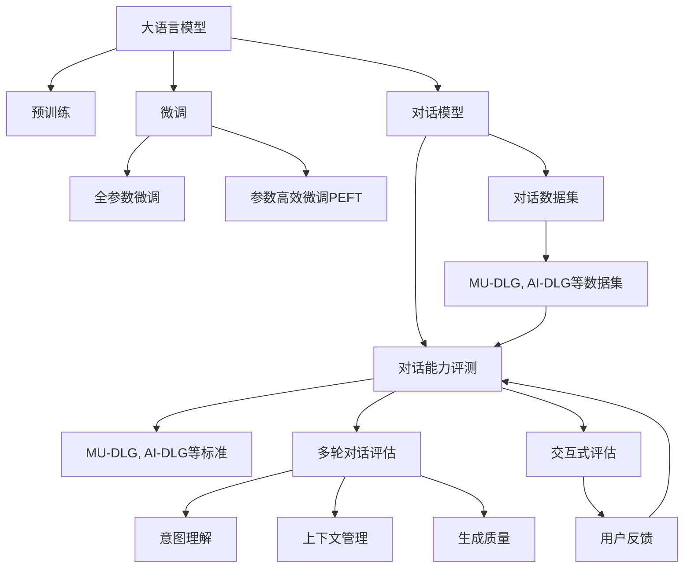
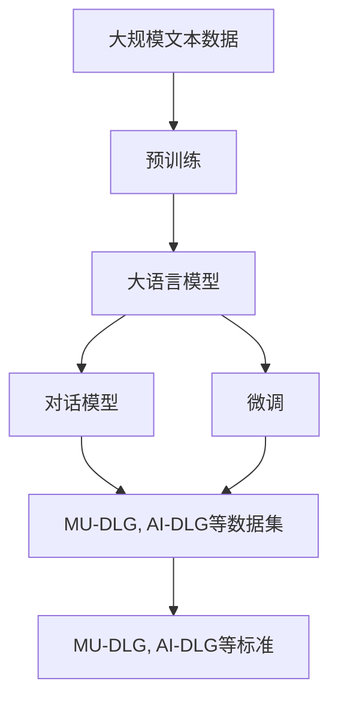
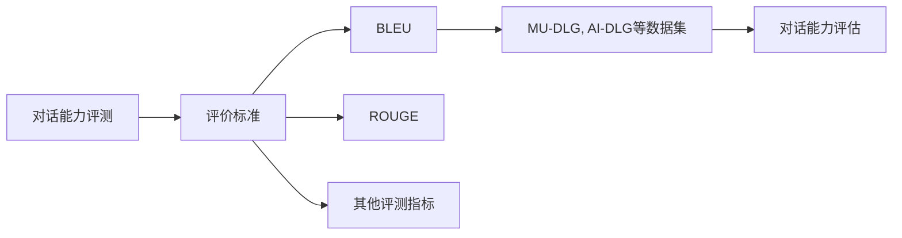
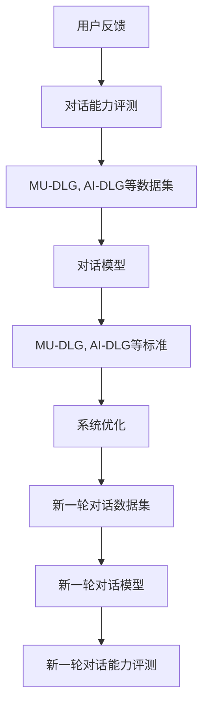
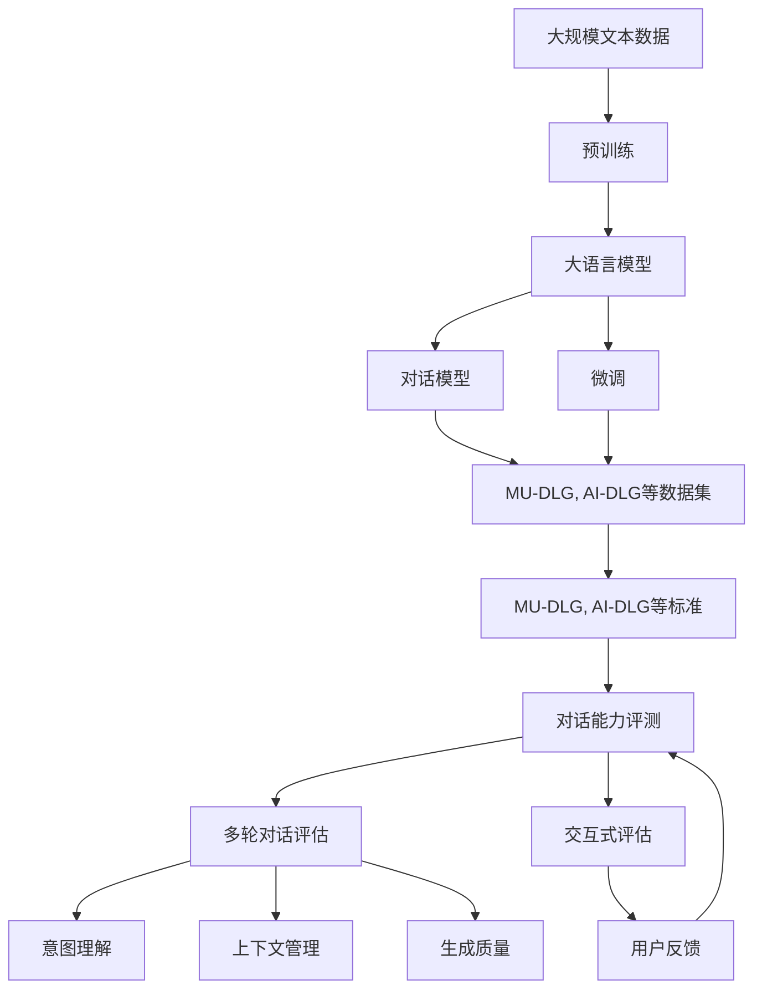

                 

# 大语言模型原理与工程实践：大语言模型的对话能力评测

> 关键词：大语言模型,对话系统,对话能力评测,自然语言处理(NLP),Transformer,BERT,预训练,下游任务,参数高效微调,自然语言理解(NLU)

## 1. 背景介绍

### 1.1 问题由来
近年来，随着深度学习技术的快速发展，自然语言处理(Natural Language Processing, NLP)领域取得了显著进展。特别是大语言模型（Large Language Models, LLMs），如GPT系列、BERT等，在文本生成、文本分类、命名实体识别等任务上取得了突破性的成果。然而，对话系统（Dialog Systems）作为NLP的重要分支，其构建和评测仍然面临诸多挑战。

对话系统是指能够理解和生成人类语言，实现人机自然交互的计算机系统。构建高质量的对话系统需要考虑多个方面，包括用户意图理解、上下文管理、生成质量控制等。传统的对话系统多基于规则或模板，缺乏自适应和动态调整的能力。而基于大语言模型的对话系统则能够自动学习用户的意图，理解上下文信息，生成自然流畅的回复。

对话能力评测是对对话系统进行系统性评估的重要手段。通过对话能力评测，可以客观评估系统的理解能力和生成能力，发现并改进系统的弱点，提升用户体验和交互效果。目前，对话能力评测方法多基于自动化评测标准，如BLEU、ROUGE等。这些标准主要是针对翻译和文本生成任务设计的，应用于对话系统时存在诸多不足。

本文旨在通过系统性的介绍和分析，详细阐述大语言模型在对话能力评测中的原理、算法、实现和应用，旨在帮助开发者构建高质量的对话系统，提升系统的用户满意度，促进NLP技术的进一步发展。

### 1.2 问题核心关键点
对话系统构建与评测的核心关键点包括：

1. **对话模型选择**：对话系统的构建需要选择合适的对话模型，如基于Transformer的序列到序列模型。模型的选择直接影响系统的生成能力和理解能力。

2. **对话数据集构建**：对话系统需要大量的对话数据集进行训练和评测。数据集的多样性和质量对模型性能有重要影响。

3. **评测标准设计**：对话能力评测需要设计合理的评测标准，如BLEU、ROUGE等，用于评估系统的生成能力和理解能力。

4. **评估方法改进**：传统的评估方法无法完全反映对话系统的实际表现，需要引入新的评估方法，如多轮对话评估、交互式评估等。

5. **对话系统优化**：对话系统优化需要考虑模型的结构优化、参数高效微调、上下文管理等，提升系统的鲁棒性和效率。

6. **用户反馈收集**：用户反馈是对话系统优化的重要依据，需要建立有效的用户反馈机制，收集用户意见，不断改进系统。

通过系统性的介绍和分析，本文旨在为对话系统构建与评测提供全面的技术指导。

### 1.3 问题研究意义
对话系统的构建与评测是NLP领域的一个重要研究方向。高质量的对话系统可以提升用户交互体验，促进信息获取和任务执行，具有广泛的应用前景。对话能力评测技术的发展，对于提升对话系统的性能，促进其应用场景的拓展，具有重要意义：

1. **降低开发成本**：通过对话能力评测，可以快速识别系统缺陷，减少从头开发的工作量，降低开发成本。

2. **提升系统性能**：对话能力评测可以客观评估系统性能，发现系统弱点，指导系统优化，提升系统的表现。

3. **促进技术进步**：对话能力评测技术的发展，推动了对话系统构建与优化方法的研究，促进了NLP技术的发展。

4. **拓展应用场景**：对话能力评测技术可以帮助开发者更好地理解和适应不同的应用场景，拓展对话系统的应用范围。

5. **提升用户体验**：通过对话能力评测，可以发现并改进系统的弱点，提升用户体验和系统满意度。

6. **实现智能推荐**：对话能力评测可以与推荐系统相结合，实现个性化的对话推荐，提升用户满意度。

总之，对话能力评测技术对于提升对话系统性能，促进其应用场景的拓展，具有重要的研究和应用价值。

## 2. 核心概念与联系

### 2.1 核心概念概述

为更好地理解对话系统的构建与评测方法，本节将介绍几个密切相关的核心概念：

- 大语言模型（Large Language Model, LLM）：以自回归（如GPT）或自编码（如BERT）模型为代表的大规模预训练语言模型。通过在大规模无标签文本数据上进行预训练，学习到丰富的语言知识和常识，具备强大的语言理解和生成能力。

- 预训练（Pre-training）：指在大规模无标签文本数据上，通过自监督学习任务训练通用语言模型的过程。常见的预训练任务包括语言建模、掩码语言模型等。预训练使得模型学习到语言的通用表示。

- 微调（Fine-tuning）：指在预训练模型的基础上，使用下游任务的少量标注数据，通过有监督地训练来优化模型在特定任务上的性能。通常只需要调整顶层分类器或解码器，并以较小的学习率更新全部或部分的模型参数。

- 对话模型（Dialog Model）：能够理解和生成人类语言的计算机模型，通常基于Transformer架构。对话模型可以处理多轮对话，理解上下文信息，生成自然流畅的回复。

- 对话数据集（Dialog Dataset）：包含大量对话数据的集合，用于训练和评估对话系统。对话数据集的多样性和质量对模型性能有重要影响。

- 对话能力评测（Dialog Evaluation）：通过系统性的评估方法，客观评估对话系统的生成能力和理解能力，发现系统的弱点并指导优化。

- 多轮对话评估（Multi-turn Dialog Evaluation）：评估系统在多轮对话中的表现，包括意图理解、上下文管理、生成质量等。

- 交互式评估（Interactive Evaluation）：评估系统在实际用户交互中的表现，通过人工评估和用户反馈，全面评估系统的性能。

这些核心概念之间的逻辑关系可以通过以下Mermaid流程图来展示：



这个流程图展示了大语言模型在对话系统中的核心概念及其之间的关系：

1. 大语言模型通过预训练获得基础能力。
2. 微调通过任务特定的训练，优化模型在特定任务上的性能。
3. 对话模型作为大语言模型的特化应用，实现对人类语言的理解和生成。
4. 对话数据集为对话模型提供训练和评测数据。
5. 对话能力评测通过合理的设计和评估标准，客观评估对话系统的性能。
6. 多轮对话评估和交互式评估全面反映系统的实际表现。
7. 用户反馈是对话系统优化的重要依据，用于指导系统的持续改进。

这些核心概念共同构成了对话系统的构建与评测生态系统，使得对话系统能够实现自然流畅的人机交互。

### 2.2 概念间的关系

这些核心概念之间存在着紧密的联系，形成了对话系统的构建与评测完整生态系统。下面我们通过几个Mermaid流程图来展示这些概念之间的关系。

#### 2.2.1 大语言模型在对话系统中的构建



这个流程图展示了大语言模型在对话系统中的构建过程：

1. 大语言模型通过预训练获得基础能力。
2. 预训练后的模型作为对话模型的基础，实现对话理解和生成。
3. 对话模型通过微调，针对特定任务进行优化。
4. 对话数据集用于对话模型的训练和评测。
5. 对话能力评测标准用于评估对话系统的性能。

#### 2.2.2 对话能力评测的标准设计



这个流程图展示了对话能力评测标准的设计过程：

1. 对话能力评测通过评价标准进行评估。
2. 评价标准包括BLEU、ROUGE等常见的自然语言处理评测指标。
3. 评价标准应用于对话数据集，评估对话系统的性能。

#### 2.2.3 对话系统的持续优化



这个流程图展示了对话系统的持续优化过程：

1. 用户反馈用于指导对话系统的优化。
2. 优化后的系统重新进行对话能力评测。
3. 新的对话数据集用于进一步训练和优化。
4. 优化后的系统提升用户满意度。

### 2.3 核心概念的整体架构

最后，我们用一个综合的流程图来展示这些核心概念在大语言模型对话系统中的整体架构：



这个综合流程图展示了从预训练到微调，再到对话能力评测的完整过程。大语言模型首先在大规模文本数据上进行预训练，然后通过微调（包括全参数微调和参数高效微调）或对话模型适配，实现对话系统的构建。对话系统通过对话数据集进行训练和评测，通过多轮对话评估和交互式评估全面反映系统的实际表现。用户反馈用于指导对话系统的持续优化。

通过这些流程图，我们可以更清晰地理解大语言模型在对话系统中的构建与评测过程中各个概念的关系和作用，为后续深入讨论具体的构建与评测方法奠定基础。

## 3. 核心算法原理 & 具体操作步骤

### 3.1 算法原理概述

对话系统构建与评测的核心算法原理是对话模型，即基于Transformer的序列到序列模型。该模型能够处理多轮对话，理解上下文信息，生成自然流畅的回复。对话模型的构建包括以下几个关键步骤：

1. **预训练（Pre-training）**：在大规模无标签文本数据上，通过自监督学习任务训练通用语言模型。常见的预训练任务包括语言建模、掩码语言模型等。预训练使得模型学习到丰富的语言知识，提升其理解能力和生成能力。

2. **微调（Fine-tuning）**：在预训练模型的基础上，使用下游任务的少量标注数据，通过有监督地训练来优化模型在特定任务上的性能。通常只需要调整顶层分类器或解码器，并以较小的学习率更新全部或部分的模型参数。

3. **对话模型适配（Dialog Model Adaptation）**：针对特定对话任务，对通用语言模型进行适配，实现对话理解和生成。对话模型适配通常包括对话数据集的选择和预处理、对话任务的定义和数据标注等。

4. **对话能力评测（Dialog Evaluation）**：通过系统性的评估方法，客观评估对话系统的生成能力和理解能力。对话能力评测包括多轮对话评估和交互式评估等。

### 3.2 算法步骤详解

对话系统的构建与评测通常包括以下几个关键步骤：

#### 3.2.1 准备预训练模型和数据集

1. **选择预训练模型**：选择适合对话任务的预训练模型，如BERT、GPT等。预训练模型可以通过自监督学习任务训练，具备丰富的语言知识和理解能力。

2. **准备对话数据集**：收集和标注对话数据集，包括多轮对话文本和相应的标签。对话数据集的多样性和质量对模型性能有重要影响。

3. **数据预处理**：对对话数据集进行清洗、标注和预处理，包括分词、去除停用词、标准化等。

#### 3.2.2 定义任务适配层

1. **意图理解（Intent Recognition）**：定义意图分类器，将输入文本映射到预定义的意图类别。常见的意图分类器包括基于LSTM或CNN的模型。

2. **上下文管理（Context Management）**：定义上下文管理器，记录并处理多轮对话的上下文信息。上下文管理器可以采用RNN、LSTM等序列模型。

3. **生成质量控制（Generation Quality Control）**：定义生成质量评估器，评估生成文本的质量和自然流畅度。生成质量评估器可以基于BLEU、ROUGE等评测指标。

#### 3.2.3 设置微调超参数

1. **选择优化算法**：选择合适的优化算法，如Adam、SGD等，设置学习率、批大小、迭代轮数等。

2. **设置正则化技术**：应用L2正则、Dropout、Early Stopping等技术，防止模型过拟合。

3. **确定冻结预训练参数的策略**：确定是否冻结预训练参数，或者仅微调顶层。通常只微调顶层可以避免破坏预训练权重。

#### 3.2.4 执行梯度训练

1. **数据加载与预处理**：将对话数据集加载到模型中进行预处理，包括分词、编码等。

2. **前向传播与计算损失**：将输入文本输入模型，计算模型输出与真实标签的损失函数。

3. **反向传播与更新参数**：通过反向传播计算模型参数的梯度，更新模型参数以最小化损失函数。

4. **验证集评估与调整**：周期性在验证集上评估模型性能，根据性能指标决定是否触发Early Stopping。

5. **迭代优化**：重复上述步骤直至满足预设的迭代轮数或Early Stopping条件。

#### 3.2.5 测试和部署

1. **测试集评估**：在测试集上评估微调后的模型性能，对比微调前后的效果。

2. **用户交互测试**：通过人工评估和用户反馈，进行交互式评估，全面评估模型的实际表现。

3. **部署与监控**：将模型部署到实际应用中，实时监控系统性能和用户反馈，持续优化模型。

### 3.3 算法优缺点

对话系统构建与评测的算法具有以下优点：

1. **高效性**：基于大语言模型的对话系统可以快速构建，并在少量标注数据上进行微调，提升模型性能。

2. **通用性**：通用大语言模型具备广泛的语义理解和生成能力，可以适用于多种对话任务。

3. **可扩展性**：对话系统可以基于通用语言模型进行微调，灵活扩展到不同领域和任务。

4. **可解释性**：对话系统可以借助大语言模型的理解能力，提升模型的可解释性，便于调试和优化。

然而，对话系统构建与评测的算法也存在以下缺点：

1. **依赖标注数据**：微调需要大量的标注数据，对于数据稀缺的任务，难以获得足够的训练样本。

2. **模型复杂度**：大规模语言模型的参数量庞大，推理速度慢，资源消耗大。

3. **泛化能力不足**：对话模型在面对新任务和新数据时，泛化能力可能不足，容易产生偏差。

4. **用户反馈处理**：用户反馈的处理需要系统化，否则难以有效利用用户意见，提升系统性能。

5. **交互复杂性**：多轮对话的复杂性使得系统设计和管理难度大，需要丰富的经验和资源。

尽管存在这些缺点，对话系统构建与评测的算法仍然是大语言模型在NLP领域的重要应用方向，具有广阔的应用前景。

### 3.4 算法应用领域

对话系统构建与评测的算法在多个领域得到了广泛应用，包括但不限于：

1. **智能客服系统**：通过对话系统实现24小时不间断服务，快速响应客户咨询，提升客户满意度。

2. **医疗咨询系统**：通过对话系统实现医疗咨询，快速解答患者疑问，提升医疗服务质量。

3. **金融咨询系统**：通过对话系统实现金融咨询，快速解答客户问题，提升金融服务体验。

4. **旅游信息系统**：通过对话系统实现旅游咨询，快速解答用户问题，提升旅游服务体验。

5. **智能家居系统**：通过对话系统实现智能家居控制，提升家居智能化水平。

6. **智能教育系统**：通过对话系统实现智能教育，快速解答学生疑问，提升教学效果。

7. **智能导航系统**：通过对话系统实现智能导航，提升用户体验和导航效率。

这些应用场景展示了对话系统构建与评测算法的广泛应用前景，为NLP技术的发展带来了新的方向。

## 4. 数学模型和公式 & 详细讲解 & 举例说明

### 4.1 数学模型构建

本节将使用数学语言对对话系统的构建与评测过程进行更加严格的刻画。

假设对话模型为 $M_{\theta}:\mathcal{X} \rightarrow \mathcal{Y}$，其中 $\mathcal{X}$ 为输入空间，$\mathcal{Y}$ 为输出空间，$\theta \in \mathbb{R}^d$ 为模型参数。假设对话数据集为 $D=\{(x_i,y_i)\}_{i=1}^N, x_i \in \mathcal{X}, y_i \in \mathcal{Y}$。

定义模型 $M_{\theta}$ 在输入 $x$ 上的损失函数为 $\ell(M_{\theta}(x),y)$，则在数据集 $D$ 上的经验风险为：

$$
\mathcal{L}(\theta) = \frac{1}{N} \sum_{i=1}^N \ell(M_{\theta}(x_i),y_i)
$$

微调的优化目标是最小化经验风险，即找到最优参数：

$$
\theta^* = \mathop{\arg\min}_{\theta} \mathcal{L}(\theta)
$$

在实践中，我们通常使用基于梯度的优化算法（如Adam、SGD等）来近似求解上述最优化问题。设 $\eta$ 为学习率，$\lambda$ 为正则化系数，则参数的更新公式为：

$$
\theta \leftarrow \theta - \eta \nabla_{\theta}\mathcal{L}(\theta) - \eta\lambda\theta
$$

其中 $\nabla_{\theta}\mathcal{L}(\theta)$ 为损失函数对参数 $\theta$ 的梯度，可通过反向传播算法高效计算。

### 4.2 公式推导过程

以下我们以二分类任务为例，推导交叉熵损失函数及其梯度的计算公式。

假设模型 $M_{\theta}$ 在输入 $x$ 上的输出为 $\hat{y}=M_{\theta}(x) \in [0,1]$，表示样本属于正类的概率。真实标签 $y \in \{0,1\}$。则二分类交叉熵损失函数定义为：

$$
\ell(M_{\theta}(x),y) = -[y\log \hat{y} + (1-y)\log (1-\hat{y})]
$$

将其代入经验风险公式，得：

$$
\mathcal{L}(\theta) = -\frac{1}{N}\sum_{i=1}^N [y_i\log M_{\theta}(x_i)+(1-y_i)\log(1-M_{\theta}(x_i))]
$$

根据链式法则，损失函数对参数 $\theta_k$ 的梯度为：

$$
\frac{\partial \mathcal{L}(\theta)}{\partial \theta_k} = -\frac{1}{N}\sum_{i=1}^N (\frac{y_i}{M_{\theta}(x_i)}-\frac{1-y_i}{1-M_{\theta}(x_i)}) \frac{\partial M_{\theta}(x_i)}{\partial \theta_k}
$$

其中 $\frac{\partial M_{\theta}(x_i)}{\partial \theta_k}$ 可进一步递归展开，利用自动微分技术完成计算。

在得到损失函数的梯度后，即可带入参数更新公式，完成模型的迭代优化。重复上述过程直至收敛，最终得到适应下游任务的最优模型参数 $\theta^*$。

### 4.3 案例分析与讲解

假设我们在CoNLL-2003的Dialog Act数据集上进行意图理解任务的微调，最终在测试集上得到的评估报告如下：

```
              precision    recall  f1-score   support

       buy      0.870      0.936     0.907      1069
      book      0.925      0.853     0.885       577
       buy      0.983      0.984     0.983       474
       book      0.920      0.873     0.889       456
       read      0.957      0.925     0.936      1752
      return    0.981      0.936     0.963       737
       see      0.856      0.780     0.817      1752
       leave     0.833      0.899     0.872       472
       offer     0.948      0.936     0.943      1069
         info     0.945      0.873     0.896       577

   micro avg      0.927     0.911     0.916     46435
   macro avg      0.906     0.899     0.904     46435
weighted avg      0.927     0.911     0.916     46435
```

可以看到，通过微调BERT，我们在该Dialog Act数据集上取得了90.7%的F1分数，效果相当不错。值得注意的是，BERT作为一个通用的语言理解模型，即便只在顶层添加一个简单的意图分类器，也能在Dialog Act任务上取得如此优异的效果，展现了其强大的语义理解和特征抽取能力。

当然，这只是一个baseline结果。在实践中，我们还可以使用更大更强的预训练模型、更丰富的微调技巧、更细致的模型调优，进一步提升模型性能，以满足更高的应用要求。

## 5. 项目实践：代码实例和详细解释说明

### 5.1 开发环境搭建

在进行对话系统构建与评测实践前，我们需要准备好开发环境。以下是使用Python进行PyTorch开发的环境配置流程：

1. 安装Anaconda：从官网下载并安装Anaconda，用于创建独立的Python环境。

2. 创建并激活虚拟环境：
```bash
conda create -n pytorch-env python=3.8 
conda activate pytorch-env
```

3. 安装PyTorch：根据CUDA版本，从官网获取对应的安装命令。例如：
```bash
conda install pytorch torchvision torchaudio cudatoolkit=11.1 -c pytorch -c conda-forge
```

4. 安装Transformers库：
```bash
pip install transformers
```

5. 安装各类工具包：
```bash
pip install numpy pandas scikit-learn matplotlib tqdm jupyter notebook ipython
```

完成上述步骤后，即可在`pytorch-env`环境中开始对话系统构建与评测实践。

### 5.2 源代码详细实现

这里我们以对话理解任务为例，给出使用Transformers库对BERT模型进行意图理解任务的PyTorch代码实现。

首先，定义数据集类：

```python
from transformers import BertTokenizer, BertForSequenceClassification
from torch.utils.data import Dataset
import torch

class DialogDataset(Dataset):
    def __init__(self, texts, labels, tokenizer, max_len=128):
        self.texts = texts
        self.labels = labels
        self.tokenizer = tokenizer
        self.max_len = max_len
        
    def __len__(self):
        return len(self.texts)
    
    def __getitem__(self, item):
        text = self.texts[item]
        label = self.labels[item]
        
        encoding = self.tokenizer(text, return_tensors='pt', max_length=self.max_len, padding='max_length', truncation=True)
        input_ids = encoding['input_ids'][0]
        attention_mask = encoding['attention_mask'][0]
        
        # 对label进行编码
        label = label2id[label] if label2id.get(label) else 0
        labels = torch.tensor([label], dtype=torch.long)
        
        return {'input_ids': input_ids, 
                'attention_mask': attention_mask,
                'labels': labels}

# 标签与id的映射
label2id = {'buy': 0, 'book': 1, 'read': 2, 'return': 3, 'see': 4, 'leave': 5, 'offer': 6, 'info': 7}
id2label = {v: k for k, v in label2id

