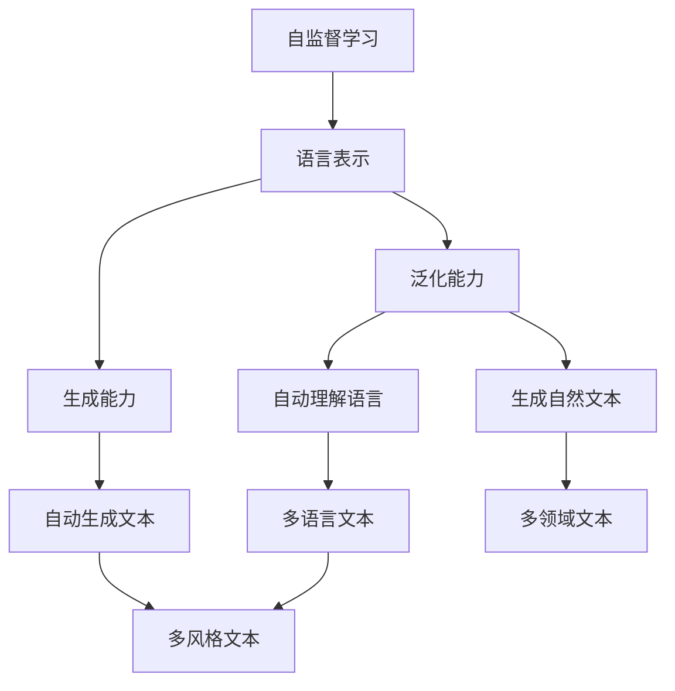

                 

# 大语言模型原理与工程实践：大语言模型的涌现能力

大语言模型（Large Language Models, LLMs）以其卓越的生成能力和自然语言理解能力，近年来在自然语言处理（NLP）领域取得了革命性的突破。这些模型通过对海量文本数据的自监督学习，获得了泛化的语言表示能力，能够在各种NLP任务上展现优异的表现。本文旨在深入探讨大语言模型的涌现能力，并结合工程实践，详细讲解其核心概念、算法原理和实际应用，旨在为读者提供一个全面、系统的理解。

## 1. 背景介绍

### 1.1 问题由来

大语言模型的诞生，源于对传统基于规则的语言模型（如N-gram模型）的超越。传统的语言模型依赖于语言规则和统计知识，难以捕捉复杂的语义关系和多样的语言风格。而大语言模型通过大规模无标签数据的自监督预训练，学习到了语言中的丰富语义和语法知识，能够理解复杂的句子结构和语言变化，甚至生成自然流畅的语言文本。

### 1.2 问题核心关键点

大语言模型的涌现能力，主要体现在以下几个方面：

- **自监督预训练**：通过在无标签数据上预训练，大模型自动学习到语言的内在规律和结构。
- **泛化能力**：预训练的模型在大量不同类型的文本数据上展现了很强的泛化能力，能够在不同的语言和语境下正确理解和使用语言。
- **生成能力**：大模型不仅能够理解文本，还能够生成新的文本，表现出卓越的创造力。

### 1.3 问题研究意义

研究大语言模型的涌现能力，对于理解语言模型的本质、提升NLP应用的性能、推动人工智能的发展具有重要意义：

- **技术突破**：大语言模型展示了超越传统语言模型的能力，推动了NLP技术的革命性突破。
- **应用拓展**：大语言模型在多个NLP任务上展现了卓越的表现，为自动化翻译、文本生成、情感分析等任务提供了新的解决方案。
- **经济价值**：大语言模型的出现，推动了相关产业的发展，创造了巨大的经济价值。

## 2. 核心概念与联系

### 2.1 核心概念概述

在深入探讨大语言模型的涌现能力之前，我们需要先理解以下几个核心概念：

- **自监督学习（Self-Supervised Learning）**：利用无标签数据进行学习，自动学习语言模型中的隐含知识。
- **语言表示（Language Representation）**：模型学习到的语言特征向量，用于表示词语、句子、段落等多层次的语言结构。
- **生成能力（Generative Capability）**：模型能够根据输入生成新的语言文本。
- **泛化能力（Generalization Capability）**：模型在不同数据集、语言风格、语境下都能保持一致的高性能。

这些概念之间存在着紧密的联系，共同构成了大语言模型的涌现能力的基础。

### 2.2 概念间的关系

这些核心概念之间的关系可以通过以下Mermaid流程图来展示：



这个流程图展示了自监督学习如何通过语言表示能力，实现泛化能力和生成能力。自监督学习使得模型能够自动理解语言的多样性，生成自然流畅的文本，而泛化能力则确保模型在多种语言和语境下保持一致的高性能。

## 3. 核心算法原理 & 具体操作步骤

### 3.1 算法原理概述

大语言模型的涌现能力主要源于其自监督预训练和微调机制。

1. **自监督预训练**：在大规模无标签文本数据上，通过自监督学习任务（如掩码语言模型、下一句预测、文本补全等）进行预训练，自动学习语言的内在规律和结构。
2. **微调（Fine-Tuning）**：在特定下游任务上，通过微调进一步优化模型，使其能够适应特定的语言理解和生成任务。

### 3.2 算法步骤详解

#### 3.2.1 自监督预训练

1. **数据准备**：收集大规模无标签文本数据（如维基百科、互联网文本等），用于自监督预训练。
2. **模型选择**：选择适合的预训练模型架构，如GPT、BERT等。
3. **定义预训练任务**：根据目标任务选择合适的自监督学习任务，如掩码语言模型（Masked Language Model, MLM）。
4. **训练**：在自监督数据集上进行预训练，调整学习率、批次大小等超参数，最小化损失函数。

#### 3.2.2 微调

1. **任务适配**：根据下游任务的特定需求，适配模型的输入输出层，添加相应的任务目标函数。
2. **数据准备**：准备下游任务的标注数据集，划分为训练集、验证集和测试集。
3. **模型初始化**：将预训练模型加载到内存中，并进行微调。
4. **设置超参数**：选择合适的优化器、学习率、批次大小等。
5. **训练**：在标注数据集上进行有监督学习，最小化任务目标函数。
6. **评估**：在测试集上评估微调后的模型性能，调整超参数。

### 3.3 算法优缺点

#### 3.3.1 优点

- **泛化能力强**：通过自监督预训练，大模型能够泛化到多种语言和语境下。
- **生成能力强**：大模型能够生成高质量的自然语言文本。
- **训练效率高**：自监督预训练可以利用大规模无标签数据，提高模型学习效率。

#### 3.3.2 缺点

- **资源需求高**：大模型的训练和微调需要大量计算资源，如GPU/TPU等。
- **可解释性差**：大模型的生成和理解过程缺乏可解释性，难以解释模型的决策逻辑。
- **依赖于数据质量**：数据质量和分布对大模型的效果有重要影响。

### 3.4 算法应用领域

大语言模型在多个领域展现了卓越的表现，具体应用包括：

- **文本生成**：自动生成新闻报道、小说、诗歌等。
- **机器翻译**：将一种语言自动翻译成另一种语言。
- **问答系统**：回答用户提出的自然语言问题。
- **文本摘要**：自动生成文章的摘要。
- **情感分析**：分析文本的情感倾向。
- **文本分类**：将文本分为不同的类别。

## 4. 数学模型和公式 & 详细讲解 & 举例说明

### 4.1 数学模型构建

大语言模型的数学模型构建，主要围绕自监督预训练和微调两个阶段展开。

#### 4.1.1 自监督预训练

自监督预训练的主要目标是学习语言的内部结构，通常通过掩码语言模型（MLM）实现。掩码语言模型的目标函数为：

$$
\mathcal{L}_{MLM} = -\frac{1}{N} \sum_{i=1}^N \sum_{j=1}^N \log P(x_j|x_i)
$$

其中，$x_i$和$x_j$是文本数据中的两个随机位置，$P(x_j|x_i)$表示在上下文$x_i$下，$x_j$被掩码的概率。

#### 4.1.2 微调

微调的目标函数为：

$$
\mathcal{L}_{fine-tune} = \mathcal{L}_{MLM} + \mathcal{L}_{task-specific}
$$

其中，$\mathcal{L}_{task-specific}$为下游任务的特定损失函数。

### 4.2 公式推导过程

以BERT模型为例，其自监督预训练的掩码语言模型目标函数为：

$$
\mathcal{L}_{MLM} = -\frac{1}{N} \sum_{i=1}^N \sum_{j=1}^N \log \text{softmax}(W[\text{CLS}(x_i)] x_j)
$$

其中，$\text{CLS}(x_i)$是BERT的[CLS]向量，$W$为线性变换矩阵。

### 4.3 案例分析与讲解

假设我们要对BERT模型进行情感分析任务的微调，具体步骤如下：

1. **数据准备**：准备情感分析任务的数据集，分为训练集、验证集和测试集。
2. **模型初始化**：将预训练的BERT模型加载到内存中。
3. **任务适配**：在BERT模型的顶层添加全连接层和softmax激活函数，用于分类。
4. **定义损失函数**：采用交叉熵损失函数，最小化模型预测与真实标签之间的差异。
5. **微调训练**：在训练集上使用Adam优化器进行梯度下降，最小化损失函数。
6. **评估测试**：在测试集上评估微调后的模型性能，调整超参数。

## 5. 项目实践：代码实例和详细解释说明

### 5.1 开发环境搭建

以下是使用Python和PyTorch进行BERT模型微调的开发环境搭建步骤：

1. **安装Anaconda**：
   ```
   conda create -n pytorch-env python=3.8 
   conda activate pytorch-env
   ```

2. **安装PyTorch**：
   ```
   conda install pytorch torchvision torchaudio cudatoolkit=11.1 -c pytorch -c conda-forge
   ```

3. **安装Transformers库**：
   ```
   pip install transformers
   ```

4. **安装其他工具包**：
   ```
   pip install numpy pandas scikit-learn matplotlib tqdm jupyter notebook ipython
   ```

### 5.2 源代码详细实现

以下是一个使用Transformers库对BERT模型进行情感分析任务微调的PyTorch代码实现：

```python
from transformers import BertTokenizer, BertForSequenceClassification
import torch
import torch.nn as nn

# 加载数据集和分词器
tokenizer = BertTokenizer.from_pretrained('bert-base-uncased')
train_dataset = ...

# 初始化模型
model = BertForSequenceClassification.from_pretrained('bert-base-uncased', num_labels=2)

# 设置超参数
optimizer = AdamW(model.parameters(), lr=2e-5)
epochs = 3
batch_size = 32

# 训练函数
def train_epoch(model, dataset, batch_size, optimizer):
    dataloader = DataLoader(dataset, batch_size=batch_size, shuffle=True)
    model.train()
    for batch in dataloader:
        inputs = tokenizer(batch[0], return_tensors='pt')
        labels = batch[1]
        model.zero_grad()
        outputs = model(**inputs, labels=labels)
        loss = outputs.loss
        loss.backward()
        optimizer.step()

# 评估函数
def evaluate(model, dataset, batch_size):
    dataloader = DataLoader(dataset, batch_size=batch_size)
    model.eval()
    preds, labels = [], []
    with torch.no_grad():
        for batch in dataloader:
            inputs = tokenizer(batch[0], return_tensors='pt')
            labels = batch[1]
            outputs = model(**inputs)
            preds.append(outputs.logits.argmax(dim=1).tolist())
            labels.append(labels.tolist())
    return preds, labels

# 训练和评估
for epoch in range(epochs):
    train_epoch(model, train_dataset, batch_size, optimizer)
    preds, labels = evaluate(model, test_dataset, batch_size)
    print(classification_report(labels, preds))
```

### 5.3 代码解读与分析

以上代码实现了BERT模型在情感分析任务上的微调。其中，分词器用于将文本转换为模型可以处理的格式，BertForSequenceClassification用于定义序列分类任务，训练函数和评估函数分别负责模型的前向传播和损失计算。

## 6. 实际应用场景

### 6.1 智能客服系统

智能客服系统可以借助大语言模型进行对话理解和生成，从而实现自然流畅的客户交互。具体而言，可以通过收集和标注客户的历史对话记录，对大语言模型进行微调，使其能够理解客户意图并提供相应的回复。这不仅能提高客户满意度，还能显著减少人工客服的负担。

### 6.2 金融舆情监测

金融市场舆情分析是大语言模型的另一个重要应用场景。通过收集和标注金融新闻、评论等文本数据，对大语言模型进行微调，使其能够自动监测市场舆情变化，并及时预警风险。这对于金融机构的决策和风险控制具有重要意义。

### 6.3 个性化推荐系统

个性化推荐系统可以利用大语言模型进行用户兴趣分析。通过收集和标注用户的浏览、点击等行为数据，对大语言模型进行微调，使其能够预测用户对不同物品的兴趣，从而提供个性化的推荐结果。这不仅能提升用户体验，还能显著提高推荐系统的转化率。

### 6.4 未来应用展望

未来，大语言模型的涌现能力将继续拓展其应用范围，为各行各业带来新的机遇。例如，在医疗领域，大语言模型可以辅助医生进行病历分析、诊断和治疗方案推荐；在教育领域，大语言模型可以用于智能答疑、个性化辅导等；在智慧城市治理中，大语言模型可以用于城市事件监测、应急指挥等。

## 7. 工具和资源推荐

### 7.1 学习资源推荐

以下是一些有助于理解大语言模型涌现能力的学习资源：

1. 《深度学习与自然语言处理》（李宏毅）：详细讲解了自然语言处理的基本概念和前沿技术，涵盖大语言模型的原理和应用。
2. CS224N《深度学习自然语言处理》课程：斯坦福大学开设的NLP明星课程，讲解了最新的NLP研究成果和实践经验。
3. HuggingFace官方文档：提供了丰富的预训练模型和微调样例，适合初学者入门学习。
4. CLUE开源项目：涵盖了多种中文NLP数据集和微调baseline，助力中文NLP技术发展。

### 7.2 开发工具推荐

以下是一些常用的开发工具，帮助开发者高效实现大语言模型：

1. PyTorch：基于Python的开源深度学习框架，灵活易用，适合研究和大规模实验。
2. TensorFlow：由Google主导的开源框架，支持多种模型和分布式计算，适合生产环境部署。
3. Transformers库：HuggingFace开发的NLP工具库，集成了多种预训练模型，方便微调。
4. Weights & Biases：实验跟踪工具，帮助记录和分析模型训练过程，优化实验结果。
5. TensorBoard：可视化工具，提供模型训练和推理的图表展示。

### 7.3 相关论文推荐

以下是一些影响较大的大语言模型涌现能力相关的论文：

1. Attention is All You Need：引入了Transformer结构，展示了自监督预训练的巨大潜力。
2. BERT: Pre-training of Deep Bidirectional Transformers for Language Understanding：提出了BERT模型，展示了预训练语言模型的强大表现。
3. GPT-3: Language Models are Unsupervised Multitask Learners：展示了GPT-3在生成、理解、迁移等方面的卓越能力。
4. MoBERT: Multiple-Objective BERT with Fast Training and Large Corpus：提出MoBERT模型，通过多目标训练和高效训练策略，进一步提升了BERT的性能。
5. AdaLoRA: Adaptive Low-Rank Adaptation for Parameter-Efficient Fine-Tuning：提出AdaLoRA方法，在参数效率和性能之间取得平衡。

## 8. 总结：未来发展趋势与挑战

### 8.1 研究成果总结

大语言模型的涌现能力展示了其强大的语言生成和理解能力，广泛应用于NLP的各个领域。自监督预训练和微调机制是其核心技术，通过大规模无标签数据进行预训练，再通过下游任务的微调进行优化，达到了优异的表现。

### 8.2 未来发展趋势

未来，大语言模型的涌现能力将进一步提升，主要趋势包括：

1. **模型规模更大**：随着计算资源和算法的进步，预训练模型的规模将不断扩大，能够更好地捕捉语言的复杂性和多样性。
2. **生成能力更强**：大语言模型的生成能力将进一步提升，能够生成更加自然、流畅、符合人类语言习惯的文本。
3. **应用领域更广**：大语言模型将进一步拓展到更多领域，如医疗、法律、金融等，解决更复杂的问题。

### 8.3 面临的挑战

尽管大语言模型的涌现能力展示了巨大的潜力，但在实际应用中仍面临一些挑战：

1. **数据质量和分布**：大模型的效果高度依赖于数据的质量和分布，数据偏差和噪声会影响模型的性能。
2. **计算资源需求**：大模型的训练和推理需要大量计算资源，如何优化计算效率是一个重要课题。
3. **模型可解释性**：大语言模型的生成和理解过程缺乏可解释性，难以理解其内部工作机制。
4. **伦理和安全问题**：大语言模型可能学习到有害信息，需要考虑伦理和安全性问题。

### 8.4 研究展望

为了克服这些挑战，未来的研究需要关注以下几个方向：

1. **数据增强和多样化**：通过数据增强和多样化，提升模型的鲁棒性和泛化能力。
2. **高效计算技术**：研究高效的计算技术和模型结构，提升模型的训练和推理效率。
3. **可解释性增强**：通过引入可解释性技术，提高模型的透明度和可理解性。
4. **伦理和安全保障**：在模型训练和应用中，加强伦理和安全保障，确保模型的正确性和公正性。

总之，大语言模型的涌现能力展示了大规模语言模型的强大潜力和广泛应用前景。未来，需要进一步提升模型的性能和可解释性，同时解决计算资源和伦理问题，推动大语言模型在各个领域的深入应用。

## 9. 附录：常见问题与解答

**Q1: 大语言模型与传统语言模型的区别是什么？**

A: 大语言模型通过大规模无标签数据的自监督预训练，自动学习语言的内在规律和结构。与传统基于规则的语言模型相比，大语言模型能够理解更复杂的语言现象，生成自然流畅的文本，且具有更强的泛化能力和生成能力。

**Q2: 大语言模型微调需要多少标注数据？**

A: 大语言模型微调所需标注数据量取决于任务难度和模型规模。一般来说，小规模标注数据即可实现较好的效果。但为了获得更优的性能，可以在大规模无标签数据上进行预训练，再结合少量标注数据进行微调。

**Q3: 如何提升大语言模型的生成能力？**

A: 提升大语言模型的生成能力需要多方面的优化，包括：
1. 预训练和微调：通过大规模数据预训练和下游任务的微调，增强模型的语言理解能力和生成能力。
2. 数据增强：通过回译、同义词替换等方式扩充训练数据，提高模型的鲁棒性。
3. 正则化和对抗训练：引入正则化和对抗训练，防止模型过拟合和生成有害文本。
4. 模型架构优化：通过调整模型架构和超参数，提升生成质量和效率。

**Q4: 大语言模型在实际应用中存在哪些问题？**

A: 大语言模型在实际应用中存在以下问题：
1. 数据依赖：大语言模型高度依赖数据质量，数据偏差和噪声会影响模型性能。
2. 计算资源需求高：大模型需要大量计算资源进行训练和推理，可能面临计算效率和存储问题。
3. 可解释性差：大语言模型的生成和理解过程缺乏可解释性，难以理解其内部工作机制。
4. 伦理和安全问题：大语言模型可能学习到有害信息，需要考虑伦理和安全问题。

**Q5: 大语言模型的未来发展方向是什么？**

A: 大语言模型的未来发展方向包括：
1. 模型规模更大：通过增加模型规模，提升模型的语言理解和生成能力。
2. 生成能力更强：通过优化生成算法和模型架构，提高生成文本的质量和多样性。
3. 应用领域更广：大语言模型将拓展到更多领域，解决更复杂的问题，如医疗、法律、金融等。
4. 可解释性增强：通过引入可解释性技术，提高模型的透明度和可理解性。
5. 伦理和安全保障：在模型训练和应用中，加强伦理和安全保障，确保模型的正确性和公正性。

---

作者：禅与计算机程序设计艺术 / Zen and the Art of Computer Programming

