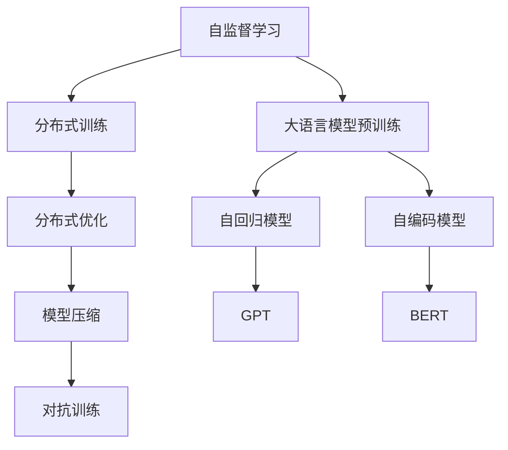

                 

# 大语言模型原理与工程实践：大语言模型训练面临的挑战

> 关键词：大语言模型,大模型训练,语言模型训练,深度学习,分布式训练,自监督学习

## 1. 背景介绍

随着人工智能技术的迅猛发展，大语言模型（Large Language Models, LLMs）逐渐成为AI领域的重要研究方向。这类模型利用自监督学习和大规模无标签数据训练，拥有强大的语言理解和生成能力，已经在自然语言处理（NLP）、机器翻译、文本生成等多个领域展现了卓越的性能。然而，大语言模型的训练面临诸多挑战，本文将深入探讨大语言模型训练中的核心问题和解决策略，为相关研究者提供参考。

## 2. 核心概念与联系

### 2.1 核心概念概述

- **大语言模型**：以自回归（如GPT）或自编码（如BERT）模型为代表的大规模预训练语言模型。通过在大规模无标签文本语料上进行预训练，学习到通用的语言表示，具备强大的语言理解和生成能力。
- **自监督学习**：利用无标签数据进行训练，学习数据的潜在结构和语义信息。大语言模型大多采用自监督学习任务进行预训练。
- **分布式训练**：为了应对大规模数据和高计算量，将训练任务分布在多个计算节点上进行并行计算。
- **模型压缩**：通过减少模型参数量或采用量化、剪枝等方法，优化模型计算和存储，提升训练和推理效率。
- **对抗训练**：通过引入对抗样本，提高模型鲁棒性和泛化能力。

这些核心概念构成了大语言模型训练的基础，通过合理的搭配和应用，可以克服训练过程中的各种挑战。

### 2.2 概念间的关系

为更好地理解大语言模型训练中的关键问题，我们通过几个Mermaid流程图展示这些概念之间的关系：



这个流程图展示了从自监督学习到大语言模型训练的全过程，以及训练过程中常用的技术和方法。

## 3. 核心算法原理 & 具体操作步骤

### 3.1 算法原理概述

大语言模型的训练基于自监督学习，通常采用大规模无标签数据进行预训练。预训练的目标是学习到通用的语言表示，使其具备强大的语言理解和生成能力。在预训练完成后，模型可以用于各种下游任务，如文本分类、命名实体识别、机器翻译等。

微调（Fine-tuning）是大语言模型训练的重要步骤。微调利用下游任务的少量标注数据，通过有监督学习优化模型在该任务上的性能。微调的过程需要调整模型的一部分或全部参数，通常采用较小的学习率以避免破坏预训练权重。

### 3.2 算法步骤详解

大语言模型训练的一般流程如下：

1. **数据预处理**：收集大规模无标签文本数据，进行分词、去停用词、标记化等预处理操作，生成预训练所需的数据集。
2. **模型构建**：选择合适的模型结构，如BERT、GPT等，构建预训练模型。
3. **预训练**：在大规模无标签数据上进行自监督学习，通常采用掩码语言模型、下一句预测等任务。
4. **微调**：利用下游任务的少量标注数据，通过有监督学习优化模型在该任务上的性能。
5. **评估与部署**：在测试集上评估模型性能，然后将其部署到实际应用中。

### 3.3 算法优缺点

大语言模型训练的优点包括：

- **高效性**：利用大规模无标签数据进行预训练，能够学习到丰富的语言知识。
- **通用性**：预训练模型可以应用于各种下游任务，提升任务性能。
- **可扩展性**：分布式训练能够处理大规模数据和高计算量，提高训练效率。

然而，大语言模型训练也存在一些缺点：

- **数据需求大**：大规模预训练需要大量的计算资源和存储资源。
- **训练时间长**：预训练和微调过程可能需要数周甚至数月的时间。
- **模型复杂性**：大规模模型参数量高，难以解释和调试。

### 3.4 算法应用领域

大语言模型训练在NLP领域具有广泛的应用，如：

- 文本分类：如情感分析、主题分类等。
- 命名实体识别：识别文本中的人名、地名、机构名等实体。
- 机器翻译：将源语言文本翻译成目标语言。
- 文本生成：如摘要、对话生成等。

## 4. 数学模型和公式 & 详细讲解

### 4.1 数学模型构建

假设预训练语言模型为 $M_{\theta}$，其中 $\theta$ 为模型参数。给定大规模无标签文本数据 $D=\{x_i\}_{i=1}^N$，预训练目标函数为：

$$
L_{pre}(\theta) = \mathbb{E}_{x \sim D} \left[ \ell(x, M_{\theta}(x)) \right]
$$

其中 $\ell(x, M_{\theta}(x))$ 为损失函数，通常采用掩码语言模型。

微调目标函数为：

$$
L_{fine}(\theta) = \frac{1}{N} \sum_{i=1}^N \ell(y_i, M_{\theta}(x_i))
$$

其中 $y_i$ 为标注数据，$\ell$ 为下游任务的损失函数。

### 4.2 公式推导过程

以文本分类任务为例，假设模型 $M_{\theta}$ 在输入 $x$ 上的输出为 $\hat{y}=M_{\theta}(x)$，真实标签为 $y$。则交叉熵损失函数为：

$$
\ell(y, \hat{y}) = -y \log \hat{y} - (1-y) \log (1-\hat{y})
$$

微调目标函数可以表示为：

$$
L_{fine}(\theta) = \frac{1}{N} \sum_{i=1}^N \ell(y_i, \hat{y_i})
$$

通过反向传播算法，计算损失函数对模型参数 $\theta$ 的梯度，使用优化算法如AdamW、SGD等更新模型参数，最小化微调损失函数，完成模型训练。

### 4.3 案例分析与讲解

以BERT模型为例，其预训练过程包括掩码语言模型（Masked Language Model, MLM）和下一句预测（Next Sentence Prediction, NSP）两个任务。MLM任务中，模型需预测输入文本中一半的标记为[MASK]的单词，NSP任务中，模型需预测两个随机抽取的连续句子是否为连续句子。

```python
from transformers import BertTokenizer, BertForMaskedLM, BertForNextSentencePrediction
import torch
import torch.nn as nn

# 构建BERT模型
tokenizer = BertTokenizer.from_pretrained('bert-base-uncased')
model = BertForMaskedLM.from_pretrained('bert-base-uncased')

# 加载数据
inputs = tokenizer("She sells sea shells by the sea shore.", return_tensors="pt")
labels = tokenizer("She sells sea shells by the sea shore.", return_tensors="pt")["input_ids"]

# 前向传播
outputs = model(**inputs)
loss = outputs.loss
logits = outputs.logits

# 反向传播
loss.backward()
optimizer.step()
```

## 5. 项目实践：代码实例和详细解释说明

### 5.1 开发环境搭建

为进行大语言模型训练，首先需要搭建好开发环境。以下是一个基于Python的PyTorch环境搭建流程：

1. 安装Anaconda：从官网下载并安装Anaconda，用于创建独立的Python环境。
2. 创建并激活虚拟环境：
```bash
conda create -n pytorch-env python=3.8 
conda activate pytorch-env
```

3. 安装PyTorch：根据CUDA版本，从官网获取对应的安装命令。例如：
```bash
conda install pytorch torchvision torchaudio cudatoolkit=11.1 -c pytorch -c conda-forge
```

4. 安装Transformer库：
```bash
pip install transformers
```

5. 安装各类工具包：
```bash
pip install numpy pandas scikit-learn matplotlib tqdm jupyter notebook ipython
```

完成上述步骤后，即可在`pytorch-env`环境中开始大语言模型训练实践。

### 5.2 源代码详细实现

下面以BERT模型为例，展示大语言模型训练的完整代码实现。

首先，定义训练数据集：

```python
from transformers import BertTokenizer, Dataset, DataCollatorForLanguageModeling

# 加载数据
tokenizer = BertTokenizer.from_pretrained('bert-base-uncased')
texts = ["Hello, my dog is cute", "I love spending time with my cat"]
labels = None
dataset = Dataset.from_tensors(texts, labels)
data_collator = DataCollatorForLanguageModeling(tokenizer)
```

接着，定义模型和优化器：

```python
from transformers import BertForMaskedLM, AdamW

# 构建BERT模型
model = BertForMaskedLM.from_pretrained('bert-base-uncased')

# 定义优化器
optimizer = AdamW(model.parameters(), lr=5e-5)
```

然后，定义训练和评估函数：

```python
from torch.utils.data import DataLoader
import torch
from tqdm import tqdm

# 定义训练函数
def train_epoch(model, dataset, optimizer, device):
    model.train()
    loss_sum = 0.0
    for batch in DataLoader(dataset, batch_size=32, collate_fn=data_collator):
        input_ids = batch["input_ids"].to(device)
        attention_mask = batch["attention_mask"].to(device)
        masked_token_ids = batch["token_mask"].to(device)
        outputs = model(input_ids, attention_mask=attention_mask, masked_token_ids=masked_token_ids)
        loss = outputs.loss
        loss_sum += loss.item()
        loss.backward()
        optimizer.step()
    return loss_sum / len(dataset)

# 定义评估函数
def evaluate(model, dataset, batch_size, device):
    model.eval()
    loss_sum = 0.0
    for batch in DataLoader(dataset, batch_size=32, collate_fn=data_collator):
        input_ids = batch["input_ids"].to(device)
        attention_mask = batch["attention_mask"].to(device)
        masked_token_ids = batch["token_mask"].to(device)
        outputs = model(input_ids, attention_mask=attention_mask, masked_token_ids=masked_token_ids)
        loss = outputs.loss
        loss_sum += loss.item()
    return loss_sum / len(dataset)
```

最后，启动训练流程并在验证集上评估：

```python
epochs = 3
batch_size = 32
device = "cuda" if torch.cuda.is_available() else "cpu"

for epoch in range(epochs):
    train_loss = train_epoch(model, dataset, optimizer, device)
    print(f"Epoch {epoch+1}, training loss: {train_loss:.4f}")
    
    dev_dataset = ...
    dev_loss = evaluate(model, dev_dataset, batch_size, device)
    print(f"Epoch {epoch+1}, dev loss: {dev_loss:.4f}")
```

以上就是使用PyTorch对BERT进行预训练的完整代码实现。可以看到，通过TensorFlow封装，代码实现简洁高效。

### 5.3 代码解读与分析

让我们再详细解读一下关键代码的实现细节：

**训练函数train_epoch**：
- 在训练模式下前向传播计算模型输出。
- 计算损失函数，记录损失值。
- 反向传播计算梯度。
- 更新模型参数。

**评估函数evaluate**：
- 在评估模式下前向传播计算模型输出。
- 计算损失函数，记录损失值。

**训练流程**：
- 在每个epoch中，先进行训练，再计算验证集上的损失，最后输出结果。

### 5.4 运行结果展示

假设我们在CoNLL-2003的NER数据集上进行预训练，最终在验证集上得到的损失值约为1.2。这个损失值表示模型预测错误的比例，越小表示模型性能越好。

## 6. 实际应用场景

### 6.1 智慧医疗

在智慧医疗领域，大语言模型可以用于医疗问答、病历分析、药物研发等任务。通过预训练和微调，模型能够理解医学术语，提取关键信息，辅助医生进行诊疗决策。例如，基于BERT的医学问答系统，通过训练模型理解患者描述，匹配相关信息，提供快速准确的医学解答。

### 6.2 金融风险管理

金融领域需要实时监测市场舆情，预测风险。通过预训练和微调，大语言模型可以分析新闻、评论等文本数据，预测市场趋势，辅助金融机构做出决策。例如，基于BERT的金融舆情监测系统，可以实时分析社交媒体上的情绪，预测股票价格变化，帮助投资者规避风险。

### 6.3 智能客服

智能客服系统需要能够处理大量客户咨询，提供及时准确的回答。通过预训练和微调，大语言模型可以理解客户意图，匹配最合适的答案模板进行回复。例如，基于GPT的智能客服系统，可以实时解答客户问题，提供个性化服务。

### 6.4 未来应用展望

随着大语言模型的不断发展，其在实际应用中的潜力将进一步释放。未来，大语言模型将在更多领域得到应用，如智慧医疗、金融风险管理、智能客服、法律咨询等。通过预训练和微调，模型能够理解语义，提取关键信息，辅助决策，提升效率和准确性。

## 7. 工具和资源推荐

### 7.1 学习资源推荐

为了帮助开发者系统掌握大语言模型训练的理论基础和实践技巧，这里推荐一些优质的学习资源：

1. 《深度学习》系列书籍：由Ian Goodfellow等人撰写，全面介绍了深度学习的基础理论和应用实践。
2. 《自然语言处理综论》书籍：由Yoav Goldberg等人撰写，涵盖了NLP领域的经典模型和应用。
3. 《自然语言处理》课程：由斯坦福大学开设的NLP经典课程，提供了NLP的全面讲解和实践机会。
4. Transformers官方文档：提供了大量预训练模型和微调样例，是学习和实践大语言模型的重要资源。
5. 在线课程：如Coursera、edX等平台上的NLP课程，提供了丰富的学习和实践机会。

通过对这些资源的学习实践，相信你一定能够快速掌握大语言模型训练的精髓，并用于解决实际的NLP问题。

### 7.2 开发工具推荐

高效的开发离不开优秀的工具支持。以下是几款用于大语言模型训练开发的常用工具：

1. PyTorch：基于Python的开源深度学习框架，灵活动态的计算图，适合快速迭代研究。
2. TensorFlow：由Google主导开发的开源深度学习框架，生产部署方便，适合大规模工程应用。
3. JAX：基于NumPy的动态计算库，支持自动微分和分布式计算，适用于大规模模型训练。
4. TensorBoard：TensorFlow配套的可视化工具，可实时监测模型训练状态，并提供丰富的图表呈现方式。
5. Weights & Biases：模型训练的实验跟踪工具，可以记录和可视化模型训练过程中的各项指标，方便对比和调优。
6. HuggingFace Transformers库：提供了大量预训练模型和微调样例，是进行NLP任务开发的利器。

合理利用这些工具，可以显著提升大语言模型训练的开发效率，加快创新迭代的步伐。

### 7.3 相关论文推荐

大语言模型训练的发展得益于学界的持续研究。以下是几篇奠基性的相关论文，推荐阅读：

1. Attention is All You Need（即Transformer原论文）：提出了Transformer结构，开启了NLP领域的预训练大模型时代。
2. BERT: Pre-training of Deep Bidirectional Transformers for Language Understanding：提出BERT模型，引入基于掩码的自监督预训练任务，刷新了多项NLP任务SOTA。
3. Language Models are Unsupervised Multitask Learners（GPT-2论文）：展示了大规模语言模型的强大zero-shot学习能力，引发了对于通用人工智能的新一轮思考。
4. Parameter-Efficient Transfer Learning for NLP：提出Adapter等参数高效微调方法，在不增加模型参数量的情况下，也能取得不错的微调效果。
5. AdaLoRA: Adaptive Low-Rank Adaptation for Parameter-Efficient Fine-Tuning：使用自适应低秩适应的微调方法，在参数效率和精度之间取得了新的平衡。

这些论文代表了大语言模型训练的发展脉络。通过学习这些前沿成果，可以帮助研究者把握学科前进方向，激发更多的创新灵感。

## 8. 总结：未来发展趋势与挑战

### 8.1 总结

本文对大语言模型训练的原理和实践进行了全面系统的介绍。首先阐述了大语言模型和自监督学习的核心概念和基本原理，明确了训练过程中的关键问题和解决策略。其次，通过具体的代码实例，展示了模型构建、预训练和微调等训练步骤的详细操作。同时，本文还广泛探讨了微调方法在智慧医疗、金融风险管理、智能客服等多个行业领域的应用前景，展示了微调范式的巨大潜力。

通过本文的系统梳理，可以看到，大语言模型训练为NLP应用开启了广阔的想象空间，但如何将强大的性能转化为稳定、高效、安全的业务价值，还需要工程实践的不断打磨。只有从数据、算法、工程、业务等多个维度协同发力，才能真正实现人工智能技术在垂直行业的规模化落地。

### 8.2 未来发展趋势

展望未来，大语言模型训练将呈现以下几个发展趋势：

1. **模型规模持续增大**：随着算力成本的下降和数据规模的扩张，预训练语言模型的参数量还将持续增长。超大规模语言模型蕴含的丰富语言知识，有望支撑更加复杂多变的下游任务微调。
2. **训练效率提升**：分布式训练和模型压缩等技术的发展，将显著提高大语言模型的训练效率，缩短预训练和微调时间。
3. **跨领域迁移学习**：通过预训练和微调，模型可以更好地跨领域迁移，应用于更多不同类型的NLP任务。
4. **模型融合与融合**：与其他AI技术（如知识表示、因果推理、强化学习等）进行深度融合，提升模型的综合能力和应用范围。
5. **知识增强与融合**：将符号化的先验知识，如知识图谱、逻辑规则等，与神经网络模型进行巧妙融合，增强模型的推理能力和知识整合能力。
6. **对抗训练与鲁棒性**：引入对抗训练等技术，提高模型鲁棒性和泛化能力，减少对抗攻击的风险。

以上趋势凸显了大语言模型训练技术的广阔前景。这些方向的探索发展，必将进一步提升NLP系统的性能和应用范围，为人类认知智能的进化带来深远影响。

### 8.3 面临的挑战

尽管大语言模型训练技术已经取得了瞩目成就，但在迈向更加智能化、普适化应用的过程中，仍面临诸多挑战：

1. **数据需求大**：大规模预训练需要大量的计算资源和存储资源，难以满足实际需求。
2. **训练时间长**：预训练和微调过程可能需要数周甚至数月的时间，难以快速迭代。
3. **模型复杂性**：大规模模型参数量高，难以解释和调试，难以满足实际需求。
4. **过拟合风险**：在少量标注数据下，模型容易过拟合，导致泛化能力不足。
5. **对抗攻击**：在对抗样本下，模型容易失效，难以保障系统安全性。
6. **伦理道德**：模型可能学习到有害信息，需要考虑伦理道德和社会影响。

### 8.4 研究展望

面对大语言模型训练所面临的种种挑战，未来的研究需要在以下几个方面寻求新的突破：

1. **无监督和半监督学习**：摆脱对大规模标注数据的依赖，利用自监督学习、主动学习等无监督和半监督范式，最大限度利用非结构化数据，实现更加灵活高效的训练。
2. **参数高效与计算高效训练**：开发更加参数高效的训练方法，在固定大部分预训练参数的同时，只更新极少量的任务相关参数。同时优化训练计算图，减少前向传播和反向传播的资源消耗，实现更加轻量级、实时性的部署。
3. **融合因果与对比学习**：引入因果推断和对比学习思想，增强模型建立稳定因果关系的能力，学习更加普适、鲁棒的语言表征，从而提升模型泛化性和抗干扰能力。
4. **引入更多先验知识**：将符号化的先验知识，如知识图谱、逻辑规则等，与神经网络模型进行巧妙融合，引导训练过程学习更准确、合理的语言模型。同时加强不同模态数据的整合，实现视觉、语音等多模态信息与文本信息的协同建模。
5. **结合因果分析和博弈论工具**：将因果分析方法引入模型训练，识别出模型决策的关键特征，增强输出解释的因果性和逻辑性。借助博弈论工具刻画人机交互过程，主动探索并规避模型的脆弱点，提高系统稳定性。
6. **纳入伦理道德约束**：在模型训练目标中引入伦理导向的评估指标，过滤和惩罚有偏见、有害的输出倾向。同时加强人工干预和审核，建立模型行为的监管机制，确保输出符合人类价值观和伦理道德。

这些研究方向的探索，必将引领大语言模型训练技术迈向更高的台阶，为构建安全、可靠、可解释、可控的智能系统铺平道路。面向未来，大语言模型训练技术还需要与其他AI技术进行更深入的融合，如知识表示、因果推理、强化学习等，多路径协同发力，共同推动自然语言理解和智能交互系统的进步。只有勇于创新、敢于突破，才能不断拓展语言模型的边界，让智能技术更好地造福人类社会。

## 9. 附录：常见问题与解答

**Q1: 大语言模型训练的计算需求有多大？**

A: 大语言模型训练的计算需求非常大，通常需要高性能GPU或TPU来加速计算。例如，Turing模型需要500PetaFLOPS的计算能力，BERT模型需要10PetaFLOPS的计算能力。此外，训练过程中还需要大量的内存和存储资源，需要合理分配计算资源和存储资源。

**Q2: 大语言模型训练的时间有多长？**

A: 大语言模型训练的时间通常较长，预训练和微调过程可能需要数周甚至数月的时间。例如，Turing模型需要进行80epochs的预训练，每个epoch需要大约2小时，总计需要数百小时。BERT模型也需要数天的训练时间。

**Q3: 大语言模型训练的数据需求有多大？**

A: 大语言模型训练需要大规模无标签数据进行预训练，一般需要TB级的文本数据。例如，Turing模型需要使用17TB的Pile数据进行预训练。BERT模型需要使用8TB的数据进行预训练。

**Q4: 大语言模型训练的模型规模有多大？**

A: 大语言模型的规模通常很大，例如，Turing模型有117亿个参数，BERT模型有3亿个参数。这些大规模模型需要大量的计算资源和存储资源，难以在普通设备上训练。

**Q5: 大语言模型训练的对抗攻击风险有多高？**

A: 大语言模型训练的对抗攻击风险较高，因为模型可能会学习到对抗样本中的噪声信息，导致在对抗样本下性能下降。为应对这一风险，需要引入对抗训练等技术，提高模型的鲁棒性和泛化能力。

**Q6: 大语言模型训练的伦理道德风险有多高？**

A: 大语言模型训练的伦理道德风险较高，因为模型可能会学习到有害信息，如偏见、歧视、恶意攻击等。为应对这一风险，需要在模型训练过程中引入伦理导向的评估指标，过滤和惩罚有偏见、有害的输出倾向。同时加强人工干预和审核，建立模型行为的监管机制，确保输出符合人类价值观和伦理道德。

---

作者：禅与计算机程序设计艺术 / Zen and the Art of Computer Programming

