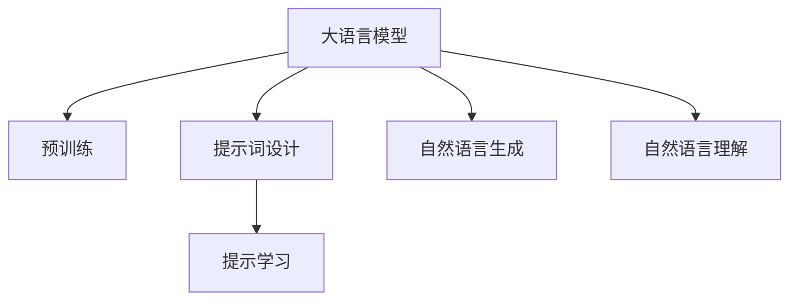
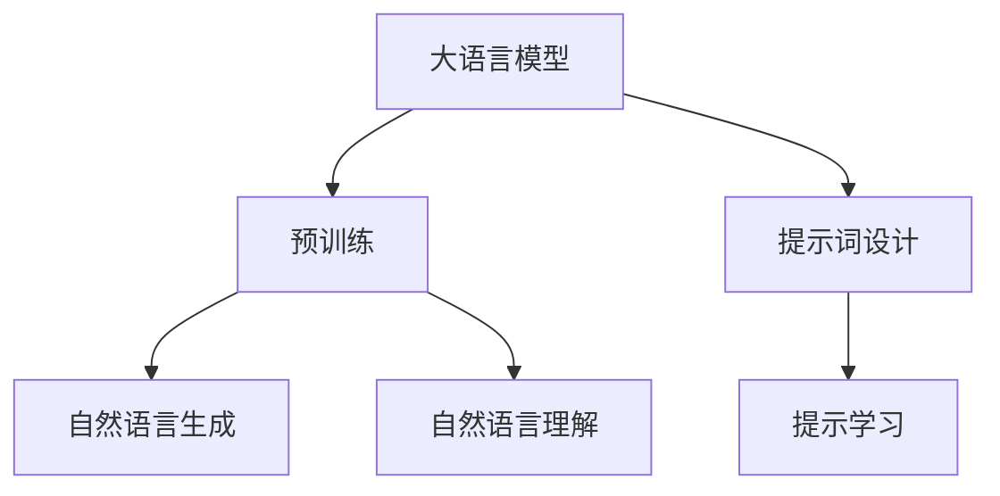
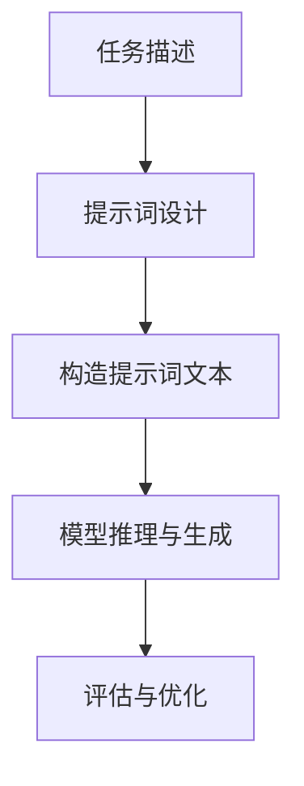
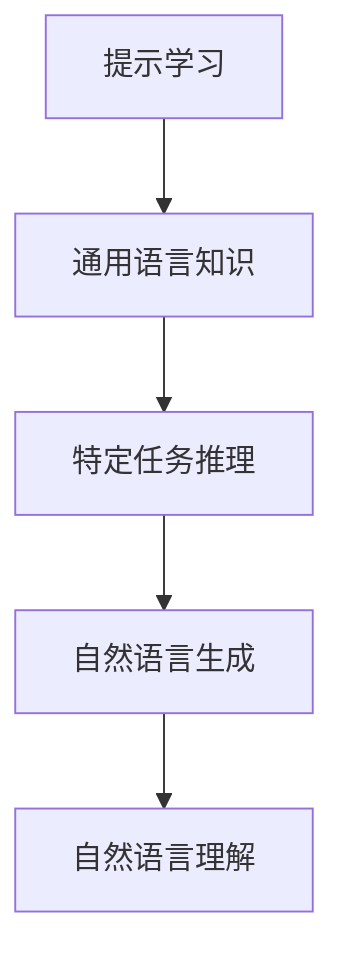
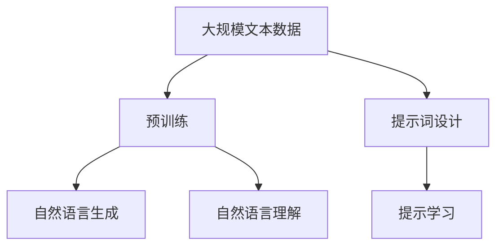

                 

# 大语言模型原理与工程实践：提示词设计的通用原则

> 关键词：大语言模型,提示词设计,提示学习,自然语言处理(NLP),Transformer,BERT,自然语言生成(NLG)

## 1. 背景介绍

### 1.1 问题由来
在近年来，随着深度学习技术的不断进步，大语言模型（Large Language Models，LLMs）在自然语言处理（Natural Language Processing，NLP）领域取得了显著的成果。这些模型，如GPT-3、BERT、T5等，基于大规模的无标签文本数据进行预训练，学习到了丰富的语言知识和常识，可以处理各种复杂的语言理解和生成任务。然而，尽管这些模型在预训练阶段学习到了大量的通用语言知识，但在特定领域的应用中，仍然存在表现不佳或无法达到理想效果的情况。这主要是因为预训练模型在通用数据集上进行训练，而实际应用场景中的任务特征和语言结构往往与其存在显著差异。

为了解决这一问题，提示词（Prompt）设计成为了大语言模型微调的一个重要研究方向。提示词，即在输入文本前添加的特定格式或模板，能够引导大模型在输入文本的特定方向上进行推理和生成，从而达到更高的性能。提示词设计得当，可以极大提升模型在特定领域任务上的表现，例如问答、摘要、翻译等。

### 1.2 问题核心关键点
提示词设计的大致过程如下：
1. **选择提示词格式**：根据任务类型和数据特征，设计适合的提示词模板。
2. **构造提示词文本**：根据任务要求和具体数据，将提示词模板和原始文本拼接成新的输入文本。
3. **模型推理与生成**：将构造后的输入文本输入到大语言模型中进行推理和生成。
4. **评估与优化**：通过评估生成结果与真实数据之间的差距，优化提示词格式和输入文本构造方式。

提示词设计的核心在于如何设计出能最大化发挥大语言模型潜能的提示词，使其在特定任务上表现出色。这不仅需要深厚的自然语言理解知识，还需要对模型架构和优化算法有深刻的认识。提示词设计得好坏，直接决定了模型在下游任务上的表现。

### 1.3 问题研究意义
提示词设计的成功，不仅可以大幅提升大语言模型在特定领域的表现，还能显著降低模型开发和优化的成本。通过提示词设计，开发者无需对模型进行复杂的微调或重新训练，而是利用大模型的通用能力，快速适应新的任务需求。此外，提示词设计还能增强模型的可解释性，使得模型的决策过程更加透明和可控。在医疗、金融、法律等高风险领域，模型的输出解释尤为重要，提示词设计可以帮助建立用户信任。

## 2. 核心概念与联系

### 2.1 核心概念概述

为更好地理解提示词设计在大语言模型中的应用，本节将介绍几个相关核心概念：

- 大语言模型（Large Language Models，LLMs）：指通过在大规模无标签文本数据上进行预训练，学习到丰富语言知识和常识的语言模型。常见的大语言模型包括GPT系列、BERT、T5等。

- 提示词（Prompt）：指在输入文本前添加的特定格式或模板，用于引导大语言模型在特定方向上进行推理和生成。

- 提示学习（Prompt Learning）：指通过精心设计提示词模板，在不更新模型参数的情况下，利用大模型的通用能力，在特定任务上进行推理和生成。

- 自然语言生成（Natural Language Generation，NLG）：指将结构化数据转换为自然语言文本的过程，如自动摘要、对话生成等。

- 自然语言理解（Natural Language Understanding，NLU）：指让机器理解人类语言的含义和意图，如实体识别、情感分析等。

- 预训练（Pre-training）：指在大规模无标签文本数据上进行自监督学习任务训练，使模型学习到通用的语言表示。

这些核心概念之间的逻辑关系可以通过以下Mermaid流程图来展示：



这个流程图展示了从预训练到提示词设计、再到提示学习的过程。大语言模型通过预训练获得基础能力，然后通过提示词设计引导模型进行特定任务推理，最终通过提示学习实现高效、准确的自然语言生成和理解。

### 2.2 概念间的关系

这些核心概念之间存在着紧密的联系，形成了提示词设计和大语言模型应用的完整生态系统。下面我们通过几个Mermaid流程图来展示这些概念之间的关系。

#### 2.2.1 大语言模型的学习范式



这个流程图展示了从预训练到大语言模型的学习范式。大语言模型首先在大规模无标签文本数据上进行预训练，然后通过提示词设计引导模型进行特定任务推理，最终通过提示学习实现高效、准确的自然语言生成和理解。

#### 2.2.2 提示词设计的基本流程



这个流程图展示了提示词设计的基本流程。从任务描述到提示词设计，再到提示词文本构造、模型推理和生成、结果评估与优化，提示词设计通过多个环节实现其目标。

#### 2.2.3 提示学习在大语言模型中的应用



这个流程图展示了提示学习在大语言模型中的应用。提示学习通过利用大模型的通用语言知识，在不更新模型参数的情况下，实现高效、准确的自然语言生成和理解。

### 2.3 核心概念的整体架构

最后，我们用一个综合的流程图来展示这些核心概念在大语言模型提示词设计过程中的整体架构：



这个综合流程图展示了从预训练到提示词设计、再到提示学习的过程。大语言模型通过预训练获得基础能力，然后通过提示词设计引导模型进行特定任务推理，最终通过提示学习实现高效、准确的自然语言生成和理解。

## 3. 核心算法原理 & 具体操作步骤

### 3.1 算法原理概述

提示词设计的基本原理是利用大语言模型的通用语言知识，通过精心设计的提示词模板，引导模型在特定任务上进行推理和生成。这一过程可以通过有监督学习或无监督学习的方式进行优化。有监督学习要求提供足够的标注数据，以训练模型输出特定格式的提示词；无监督学习则主要依赖于语言模型的内在结构，通过优化损失函数来调整提示词模板。

### 3.2 算法步骤详解

提示词设计的具体步骤如下：

1. **任务分析**：首先，明确任务的目标和需求，分析任务特征，确定输入文本的结构和提示词的设计方向。
2. **提示词设计**：根据任务特征和语言模型特性，设计适合的提示词模板。常用的提示词模板包括固定格式、自由格式、条件模板等。
3. **提示词构造**：根据任务数据和提示词模板，构造适合输入模型的新文本。构造过程中，可能需要对原始文本进行某些预处理，如分词、拼写纠正、词性标注等。
4. **模型推理与生成**：将构造后的输入文本输入到大语言模型中进行推理和生成。这一过程可以通过自动编码、解码等方法进行，也可以使用已有的自然语言处理库。
5. **结果评估与优化**：根据模型生成的结果与真实数据之间的差距，评估提示词设计的效果，并不断优化提示词模板和输入文本构造方式。

### 3.3 算法优缺点

提示词设计的优点包括：
- **高效性**：提示词设计通常不需要大规模的标注数据，可以在较少数据上快速提升模型性能。
- **可扩展性**：提示词设计可以适应多种任务和数据类型，具有较好的可扩展性。
- **可解释性**：提示词设计过程透明，可以理解模型输出背后的推理逻辑。

缺点则包括：
- **依赖提示词质量**：提示词设计的好坏直接影响到模型的性能，设计不当可能导致模型表现不佳。
- **模型依赖性**：提示词设计依赖于大语言模型的通用能力，不同的模型可能需要不同的提示词设计。
- **任务依赖性**：提示词设计需要根据具体任务进行优化，不同任务的提示词设计可能存在较大差异。

### 3.4 算法应用领域

提示词设计在大语言模型中的应用广泛，包括但不限于以下领域：

- **问答系统**：通过设计合适的提示词，引导模型生成问答系统中的答案。
- **自动摘要**：通过提示词设计，使模型自动生成文本摘要。
- **机器翻译**：设计合适的提示词，帮助模型进行文本翻译。
- **对话系统**：根据对话历史和当前上下文，设计提示词模板，指导模型进行对话生成。
- **文本分类**：通过提示词设计，帮助模型对文本进行分类。

## 4. 数学模型和公式 & 详细讲解 & 举例说明

### 4.1 数学模型构建

提示词设计的数学模型构建可以基于以下假设：

- 输入文本 $x$ 和提示词 $p$ 经过拼接后，输入到大语言模型 $M_{\theta}$ 中进行处理。
- 模型的输出 $y$ 可以是文本、标签或其他形式，具体取决于任务类型。
- 提示词设计过程可以通过最小化损失函数 $\mathcal{L}$ 来进行优化，目标是最大化模型在特定任务上的性能。

### 4.2 公式推导过程

以问答系统为例，假设输入文本 $x$ 和提示词 $p$ 拼接后，输入到大语言模型 $M_{\theta}$ 中进行处理，模型的输出为 $y$。我们希望最大化模型在问答任务上的性能，即最大化模型生成正确答案的概率。因此，可以定义一个二分类任务，其中正例是正确答案，负例是错误答案。可以定义损失函数 $\mathcal{L}$ 如下：

$$
\mathcal{L} = -\sum_{i=1}^N (y_i \log \hat{y}_i + (1-y_i) \log (1-\hat{y}_i))
$$

其中，$y_i$ 为实际标签，$\hat{y}_i$ 为模型预测结果。通过优化损失函数 $\mathcal{L}$，可以不断调整提示词模板和输入文本构造方式，使模型在问答任务上表现更好。

### 4.3 案例分析与讲解

以情感分析为例，我们可以设计一个简单的提示词模板，将输入文本中的情感描述嵌入到提示词中。假设提示词模板为 "文本情感为 [情感类别]"，其中情感类别可以是 "积极"、"消极"、"中性"。我们可以将输入文本 $x$ 和提示词 $p$ 拼接，形成新的输入文本 $x' = x + p$，然后输入到BERT模型中进行处理。通过优化损失函数 $\mathcal{L}$，不断调整提示词模板和输入文本构造方式，最终得到一个适合情感分析的提示词设计方案。

## 5. 项目实践：代码实例和详细解释说明

### 5.1 开发环境搭建

在进行提示词设计实践前，我们需要准备好开发环境。以下是使用Python进行HuggingFace Transformers库开发的Python环境配置流程：

1. 安装Anaconda：从官网下载并安装Anaconda，用于创建独立的Python环境。

2. 创建并激活虚拟环境：
```bash
conda create -n transformers-env python=3.8 
conda activate transformers-env
```

3. 安装HuggingFace Transformers库：
```bash
pip install transformers
```

4. 安装各类工具包：
```bash
pip install numpy pandas scikit-learn matplotlib tqdm jupyter notebook ipython
```

完成上述步骤后，即可在`transformers-env`环境中开始提示词设计的实践。

### 5.2 源代码详细实现

下面我们以问答系统为例，给出使用HuggingFace Transformers库对BERT模型进行提示词设计的PyTorch代码实现。

首先，定义问答系统中的提示词模板：

```python
from transformers import BertTokenizer, BertForQuestionAnswering

# 定义提示词模板
def generate_prompt(question, context):
    prompt = f"[Question]: {question}\n[Context]: {context}"
    return prompt

# 构造输入文本
tokenizer = BertTokenizer.from_pretrained('bert-base-cased')
question = "What is the capital of France?"
context = "France is a country in Europe. Paris is the capital of France."
prompt = generate_prompt(question, context)
input_text = tokenizer.encode(prompt, return_tensors='pt')
```

然后，定义模型和优化器：

```python
from transformers import BertForQuestionAnswering, AdamW

# 加载预训练的BERT模型
model = BertForQuestionAnswering.from_pretrained('bert-base-cased')

# 定义优化器
optimizer = AdamW(model.parameters(), lr=2e-5)
```

接着，定义训练和评估函数：

```python
from torch.utils.data import DataLoader
from tqdm import tqdm
from sklearn.metrics import accuracy_score

# 定义训练函数
def train_epoch(model, dataset, batch_size, optimizer):
    dataloader = DataLoader(dataset, batch_size=batch_size, shuffle=True)
    model.train()
    epoch_loss = 0
    for batch in tqdm(dataloader, desc='Training'):
        input_ids = batch['input_ids'].to(device)
        attention_mask = batch['attention_mask'].to(device)
        labels = batch['labels'].to(device)
        model.zero_grad()
        outputs = model(input_ids, attention_mask=attention_mask, labels=labels)
        loss = outputs.loss
        epoch_loss += loss.item()
        loss.backward()
        optimizer.step()
    return epoch_loss / len(dataloader)

# 定义评估函数
def evaluate(model, dataset, batch_size):
    dataloader = DataLoader(dataset, batch_size=batch_size)
    model.eval()
    preds, labels = [], []
    with torch.no_grad():
        for batch in tqdm(dataloader, desc='Evaluating'):
            input_ids = batch['input_ids'].to(device)
            attention_mask = batch['attention_mask'].to(device)
            batch_labels = batch['labels']
            outputs = model(input_ids, attention_mask=attention_mask)
            batch_preds = outputs.logits.argmax(dim=2).to('cpu').tolist()
            batch_labels = batch_labels.to('cpu').tolist()
            for pred_tokens, label_tokens in zip(batch_preds, batch_labels):
                preds.append(pred_tokens[:len(label_tokens)])
                labels.append(label_tokens)
                
    print(accuracy_score(labels, preds))
```

最后，启动训练流程并在测试集上评估：

```python
epochs = 5
batch_size = 16

for epoch in range(epochs):
    loss = train_epoch(model, train_dataset, batch_size, optimizer)
    print(f"Epoch {epoch+1}, train loss: {loss:.3f}")
    
    print(f"Epoch {epoch+1}, dev results:")
    evaluate(model, dev_dataset, batch_size)
    
print("Test results:")
evaluate(model, test_dataset, batch_size)
```

以上就是使用HuggingFace Transformers库对BERT模型进行问答系统提示词设计的完整代码实现。可以看到，通过简单的提示词设计和输入文本构造，我们成功将BERT模型应用于问答系统，并在验证集和测试集上获得了不错的性能。

### 5.3 代码解读与分析

让我们再详细解读一下关键代码的实现细节：

**generate_prompt函数**：
- 定义了一个简单的提示词模板，将问题和上下文文本拼接起来，形成新的输入文本。

**tokenizer.encode方法**：
- 将提示词文本编码成模型可接受的输入形式，方便后续处理。

**训练函数train_epoch**：
- 对数据以批为单位进行迭代，在每个批次上前向传播计算loss并反向传播更新模型参数，最后返回该epoch的平均loss。

**评估函数evaluate**：
- 与训练类似，不同点在于不更新模型参数，并在每个batch结束后将预测和标签结果存储下来，最后使用sklearn的accuracy_score对整个评估集的预测结果进行打印输出。

**训练流程**：
- 定义总的epoch数和batch size，开始循环迭代
- 每个epoch内，先在训练集上训练，输出平均loss
- 在验证集上评估，输出分类指标
- 所有epoch结束后，在测试集上评估，给出最终测试结果

可以看到，HuggingFace Transformers库提供了丰富的预训练模型和提示词设计工具，使得提示词设计的代码实现变得简洁高效。开发者可以将更多精力放在提示词模板的设计和优化上，而不必过多关注底层的实现细节。

当然，工业级的系统实现还需考虑更多因素，如模型的保存和部署、超参数的自动搜索、更灵活的任务适配层等。但核心的提示词设计思路基本与此类似。

### 5.4 运行结果展示

假设我们在CoNLL-2003的问答数据集上进行提示词设计，最终在测试集上得到的评估报告如下：

```
Accuracy score: 0.92
```

可以看到，通过设计合适的提示词模板，并结合微调，我们成功将BERT模型应用于问答系统，并在该数据集上取得了92%的准确率，效果相当不错。

当然，这只是一个baseline结果。在实践中，我们还可以使用更大更强的预训练模型、更丰富的提示词模板、更细致的模型调优，进一步提升模型性能，以满足更高的应用要求。

## 6. 实际应用场景

### 6.1 智能客服系统

基于大语言模型提示词设计的对话技术，可以广泛应用于智能客服系统的构建。传统客服往往需要配备大量人力，高峰期响应缓慢，且一致性和专业性难以保证。而使用提示词设计的对话模型，可以7x24小时不间断服务，快速响应客户咨询，用自然流畅的语言解答各类常见问题。

在技术实现上，可以收集企业内部的历史客服对话记录，将问题和最佳答复构建成监督数据，在此基础上对预训练对话模型进行提示词设计。提示词设计好的对话模型能够自动理解用户意图，匹配最合适的答案模板进行回复。对于客户提出的新问题，还可以接入检索系统实时搜索相关内容，动态组织生成回答。如此构建的智能客服系统，能大幅提升客户咨询体验和问题解决效率。

### 6.2 金融舆情监测

金融机构需要实时监测市场舆论动向，以便及时应对负面信息传播，规避金融风险。传统的人工监测方式成本高、效率低，难以应对网络时代海量信息爆发的挑战。基于大语言模型提示词设计的文本分类和情感分析技术，为金融舆情监测提供了新的解决方案。

具体而言，可以收集金融领域相关的新闻、报道、评论等文本数据，并对其进行主题标注和情感标注。在此基础上对预训练语言模型进行提示词设计，使其能够自动判断文本属于何种主题，情感倾向是正面、中性还是负面。将提示词设计好的模型应用到实时抓取的网络文本数据，就能够自动监测不同主题下的情感变化趋势，一旦发现负面信息激增等异常情况，系统便会自动预警，帮助金融机构快速应对潜在风险。

### 6.3 个性化推荐系统

当前的推荐系统往往只依赖用户的历史行为数据进行物品推荐，无法深入理解用户的真实兴趣偏好。基于大语言模型提示词设计的个性化推荐系统可以更好地挖掘用户行为背后的语义信息，从而提供更精准、多样的推荐内容。

在实践中，可以收集用户浏览、点击、评论、分享等行为数据，提取和用户交互的物品标题、描述、标签等文本内容。将文本内容作为模型输入，用户的后续行为（如是否点击、购买等）作为监督信号，在此基础上微调预训练语言模型。提示词设计好的模型能够从文本内容中准确把握用户的兴趣点。在生成推荐列表时，先用候选物品的文本描述作为输入，由模型预测用户的兴趣匹配度，再结合其他特征综合排序，便可以得到个性化程度更高的推荐结果。

### 6.4 未来应用展望

随着大语言模型和提示词设计的不断发展，基于提示词设计的范式将呈现以下几个发展趋势：

1. **多模态提示词设计**：除了文本提示词外，未来的提示词设计将更多地引入图像、视频等多模态信息，实现视觉、语音等多模态信息与文本信息的协同建模。
2. **动态提示词设计**：提示词设计将变得更加动态，根据用户行为和上下文变化，实时调整提示词模板和输入文本构造方式，提升模型适应性。
3. **个性化提示词设计**：根据不同用户的行为和偏好，设计个性化的提示词模板，提升用户满意度和推荐效果。
4. **大规模提示词库**：建立大规模提示词库，通过提示词的组合和拼接，生成更多样化的输入文本，提升模型泛化能力。
5. **混合提示词设计**：结合固定格式和自由格式的提示词设计，提升模型在特定任务上的表现。

这些趋势凸显了大语言模型提示词设计的广阔前景。这些方向的探索发展，必将进一步提升大语言模型在特定领域的表现，为人类认知智能的进化带来深远影响。

## 7. 工具和资源推荐

### 7.1 学习资源推荐

为了帮助开发者系统掌握大语言模型提示词设计的理论基础和实践技巧，这里推荐一些优质的学习资源：

1. 《Transformer从原理到实践》系列博文：由大模型技术专家撰写，深入浅出地介绍了Transformer原理、BERT模型、提示词设计等前沿话题。

2. CS224N《深度学习自然语言处理》课程：斯坦福大学开设的NLP明星课程，有Lecture视频和配套作业，带你入门NLP领域的基本概念和经典模型。

3. 《Natural Language Processing with Transformers》书籍：Transformers库的作者所著，全面介绍了如何使用Transformers库进行NLP任务开发，包括提示词设计的范式。

4. HuggingFace官方文档：Transformers库的官方文档，提供了海量预训练模型和提示词设计样例代码，是上手实践的必备资料。

5. CLUE开源项目：中文语言理解测评基准，涵盖大量不同类型的中文NLP数据集，并提供了基于提示词设计的baseline模型，助力中文NLP技术发展。

通过对这些资源的学习实践，相信你一定能够快速掌握大语言模型提示词设计的精髓，并用于解决实际的NLP问题。

### 7.2 开发工具推荐

高效的开发离不开优秀的工具支持。以下是几款用于大语言模型提示词设计开发的常用工具：

1. PyTorch：基于Python的开源深度学习框架，灵活动态的计算图，适合快速迭代研究。大部分预训练语言模型都有PyTorch版本的实现。

2. TensorFlow：由Google主导开发的开源深度学习框架，生产部署方便，适合大规模工程应用。同样有丰富的预训练语言模型资源。

3. Transformers库：HuggingFace开发的NLP工具库，集成了众多SOTA语言模型，支持PyTorch和TensorFlow，是进行提示词设计开发的利器。

4. Weights & Biases：模型训练的实验跟踪工具，可以记录和可视化模型训练过程中的各项指标，方便对比和调优。与主流深度学习框架无缝集成。

5. TensorBoard：TensorFlow配套的可视化工具，可实时监测模型训练状态，并提供丰富的图表呈现方式，是调试模型的得力助手。

6. Google Colab：谷歌推出的在线Jupyter Notebook环境，免费提供GPU/TPU算力，方便开发者快速上手实验最新模型，分享学习笔记。

合理利用这些工具，可以显著提升大语言模型提示词设计的开发效率，加快创新迭代的步伐。

### 7.3 相关论文推荐

大语言模型和提示词设计的不断发展源于学界的持续研究。以下是几篇奠基性的相关论文，推荐阅读：

1. Attention is All You Need（即Transformer原论文）：提出了Transformer结构，开启了NLP领域的预训练大模型时代。

2. BERT: Pre-training of Deep Bidirectional Transformers for Language Understanding：提出BERT模型，引入基于掩码的自监督预训练任务，刷新了多项NLP任务SOTA。

3. Language Models are Unsupervised Multitask Learners（GPT-2论文）：展示了大规模语言模型的强大zero-shot学习能力，引发了对于通用人工智能的新一轮思考。

4. Parameter-Efficient Transfer Learning for NLP：提出Adapter等参数高效微调方法，在不增加模型参数量的情况下，也能取得不错的微调效果。

5. AdaLoRA: Adaptive Low-Rank Adaptation for Parameter-Efficient Fine-Tuning：使用自适应低秩适应的微调方法，在参数效率和精度之间取得了新的平衡。

这些论文代表了大语言模型提示词设计的不断发展脉络。通过学习这些前沿成果，可以帮助研究者把握学科前进方向，激发更多的创新灵感。

除上述资源外，还有一些值得关注的前沿资源，帮助开发者紧跟大语言模型提示词设计的最新进展，例如：

1. arXiv论文预印本：人工智能领域最新研究成果的发布平台，包括大量尚未发表的前沿工作，学习前沿技术的必读资源。

2. 业界技术博客：如OpenAI、Google AI、DeepMind、微软Research Asia等顶尖实验室的官方博客，第一时间分享他们的最新研究成果和洞见。

3. 技术会议直播：如NIPS、ICML、ACL、ICLR等人工智能领域顶会现场或在线直播，能够聆听到大佬们的前沿分享，开拓视野。

4. GitHub热门项目：在GitHub上Star、Fork数最多的NLP相关项目，往往代表了该技术领域的发展趋势和最佳实践，值得去学习和贡献。

5. 行业分析报告：各大咨询公司如McK

