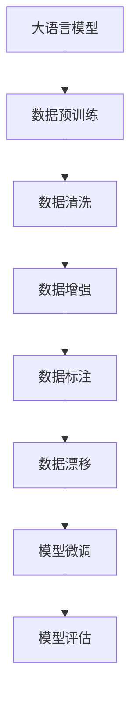
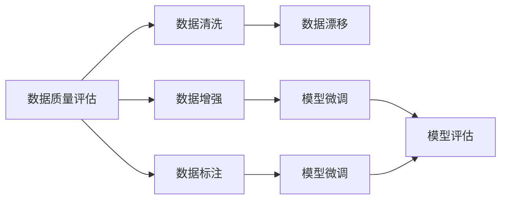
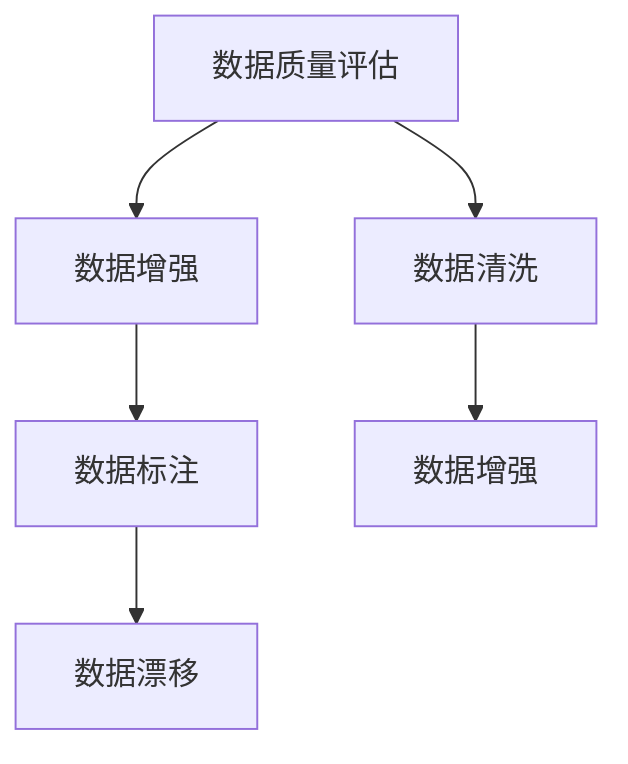
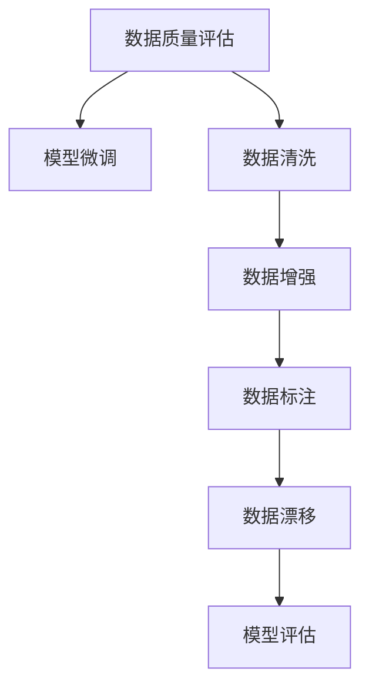
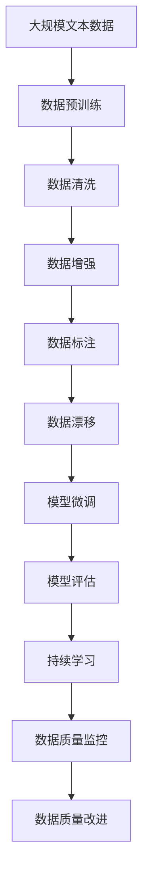

                 

# 大语言模型原理与工程实践：数据质量评估的挑战

> 关键词：大语言模型,数据质量评估,工程实践,监督学习,深度学习,自然语言处理(NLP)

## 1. 背景介绍

### 1.1 问题由来
在深度学习和人工智能快速发展的背景下，大语言模型（Large Language Models, LLMs）已成为自然语言处理（Natural Language Processing, NLP）领域的重要组成部分。大语言模型通常在大规模无标签数据上进行预训练，并在特定任务上进行微调，以提高在特定任务上的性能。然而，数据质量对模型性能的影响至关重要。低质量的数据不仅会损害模型的准确性，还会影响其可解释性和公平性。

### 1.2 问题核心关键点
数据质量评估是大语言模型工程实践中的关键环节。在模型微调过程中，数据质量不仅影响模型的学习效果，还关系到模型的鲁棒性和泛化能力。如何评估和提升数据质量，是构建高性能、鲁棒性强的NLP模型的基础。

### 1.3 问题研究意义
在NLP领域，数据质量评估不仅有助于提升模型性能，还能促进模型可解释性和公平性。提升数据质量，不仅可以减少模型偏差，还能使模型在真实应用中表现更加稳定和可靠。这对于构建具有社会责任感的AI系统具有重要意义。

## 2. 核心概念与联系

### 2.1 核心概念概述

为更好地理解数据质量评估在大语言模型中的应用，本节将介绍几个关键概念：

- 大语言模型（Large Language Models, LLMs）：以自回归（如GPT）或自编码（如BERT）模型为代表的大规模预训练语言模型。通过在大规模无标签文本数据上进行预训练，学习通用的语言知识。

- 数据质量（Data Quality）：指数据在完整性、准确性、一致性、及时性等方面的表现。数据质量评估主要关注数据的正确性、一致性和可靠性。

- 数据清洗（Data Cleaning）：通过检测和纠正数据中的错误、冗余和不一致，提高数据质量的过程。

- 数据增强（Data Augmentation）：通过增加数据样本的多样性，提高模型泛化能力。

- 数据标注（Data Annotation）：对数据进行分类、标记等操作，为模型训练提供监督信号。

- 数据漂移（Data Drift）：指数据分布随时间变化，导致模型性能下降的现象。

- 模型评估（Model Evaluation）：通过设定评价指标，评估模型在特定任务上的性能。

这些核心概念之间的逻辑关系可以通过以下Mermaid流程图来展示：



这个流程图展示了从数据预训练到模型评估的完整过程，其中数据质量评估是确保模型性能的重要环节。

### 2.2 概念间的关系

这些核心概念之间存在着紧密的联系，形成了数据质量评估在大语言模型中的应用框架。下面我们通过几个Mermaid流程图来展示这些概念之间的关系。

#### 2.2.1 数据质量评估与模型微调的关系



这个流程图展示了数据质量评估在模型微调过程中的作用，从数据清洗到数据标注，再到模型微调和模型评估，每一步都依赖于数据质量的高低。

#### 2.2.2 数据质量评估与数据增强的关系



这个流程图展示了数据质量评估与数据增强之间的关系，数据质量评估指导数据增强的方式，从而提高模型泛化能力。

#### 2.2.3 数据质量评估与模型微调的应用



这个流程图展示了数据质量评估在模型微调中的应用，从数据清洗到数据标注，再到模型微调和模型评估，每一步都依赖于数据质量的高低。

### 2.3 核心概念的整体架构

最后，我们用一个综合的流程图来展示这些核心概念在大语言模型微调过程中的整体架构：



这个综合流程图展示了从预训练到模型评估，再到持续学习的完整过程，其中数据质量评估和改进是确保模型性能的重要环节。

## 3. 核心算法原理 & 具体操作步骤
### 3.1 算法原理概述

在大语言模型的微调过程中，数据质量评估是不可或缺的一环。其核心思想是通过检测和纠正数据中的错误，提高数据质量，从而提升模型性能。具体而言，数据质量评估主要包括以下几个方面：

- 数据完整性评估：检查数据是否缺失、重复、不完整。
- 数据一致性评估：确保数据在不同的样本和标签之间保持一致性。
- 数据准确性评估：验证数据标注的正确性。
- 数据时序性评估：确保数据在不同时间点上的一致性。
- 数据隐私性评估：保护数据隐私，防止敏感信息泄露。

这些评估方法通常通过统计分析和机器学习技术实现。通过数据质量评估，可以及时发现并修正数据中的问题，提高模型的稳定性和可靠性。

### 3.2 算法步骤详解

基于监督学习的大语言模型微调，其数据质量评估一般包括以下几个关键步骤：

1. **数据收集与预处理**：
   - 收集与任务相关的文本数据。
   - 对数据进行预处理，包括文本清洗、分词、标注等。

2. **数据质量评估**：
   - 使用统计方法或机器学习模型对数据进行质量评估。
   - 识别并标记数据中的错误、冗余和不一致。

3. **数据清洗与修复**：
   - 根据评估结果，对数据进行清洗和修复，去除错误和不一致的数据。
   - 对于数据标注错误，进行人工修正或重新标注。

4. **数据增强**：
   - 使用数据增强技术，增加数据样本的多样性。
   - 通过同义词替换、回译、变换句子结构等方法，生成新的数据样本。

5. **模型微调**：
   - 在清洗和增强后的数据集上进行微调，优化模型在特定任务上的性能。
   - 使用合适的超参数和优化算法，最小化损失函数，更新模型参数。

6. **模型评估**：
   - 使用评估指标（如准确率、召回率、F1分数等）评估模型性能。
   - 通过交叉验证等方法，验证模型的泛化能力。

7. **持续学习**：
   - 在实际应用中，持续收集新数据，定期重新评估和微调模型。
   - 通过增量学习、在线学习等技术，保持模型的时效性和适应性。

### 3.3 算法优缺点

数据质量评估在大语言模型微调过程中具有以下优点：

- 提高模型准确性：通过清洗和修复数据，减少数据中的噪声和错误，提高模型的准确性。
- 增强模型泛化能力：通过数据增强技术，增加数据样本的多样性，提高模型的泛化能力。
- 提升模型可解释性：通过数据质量评估，发现和纠正数据中的问题，提高模型的可解释性。
- 保障模型公平性：通过数据质量评估，减少数据偏差，提高模型的公平性。

然而，数据质量评估也存在一些缺点：

- 依赖标注数据：数据质量评估需要大量的标注数据，标注成本较高。
- 评估复杂度高：数据质量评估方法复杂，需要消耗大量时间和计算资源。
- 难以全面覆盖：数据质量评估难以全面覆盖所有数据，可能存在遗漏。

尽管存在这些缺点，但通过合理应用数据质量评估方法，可以有效提升模型的性能和可靠性，确保模型在实际应用中的表现。

### 3.4 算法应用领域

数据质量评估在大语言模型微调中的应用非常广泛，涵盖以下几个主要领域：

- 文本分类：如情感分析、主题分类、意图识别等。数据质量评估可以帮助模型准确分类文本，减少分类误差。
- 命名实体识别：识别文本中的人名、地名、机构名等特定实体。数据质量评估可以确保实体标签的正确性。
- 关系抽取：从文本中抽取实体之间的语义关系。数据质量评估可以确保实体-关系三元组的正确性。
- 问答系统：对自然语言问题给出答案。数据质量评估可以确保问题-答案对的正确性和一致性。
- 机器翻译：将源语言文本翻译成目标语言。数据质量评估可以确保翻译的准确性和流畅性。
- 文本摘要：将长文本压缩成简短摘要。数据质量评估可以确保摘要的准确性和相关性。
- 对话系统：使机器能够与人自然对话。数据质量评估可以确保对话的流畅性和正确性。

除上述这些经典任务外，数据质量评估在大语言模型中的应用还包括许多创新方向，如可控文本生成、常识推理、代码生成等，为NLP技术带来了新的突破。

## 4. 数学模型和公式 & 详细讲解 & 举例说明

### 4.1 数学模型构建

在大语言模型的微调过程中，数据质量评估通常使用以下数学模型：

- 完整性评估：使用数据完整性检查方法，如检查文本长度、缺失值等，计算完整性得分。
- 一致性评估：使用数据一致性检查方法，如检查标签的一致性、数据分布的一致性等，计算一致性得分。
- 准确性评估：使用数据标注准确性评估方法，如检查标签的准确性、文本的相似度等，计算准确性得分。
- 时序性评估：使用数据时序性检查方法，如检查数据在不同时间点上的变化趋势，计算时序性得分。
- 隐私性评估：使用数据隐私性检查方法，如检查敏感信息是否泄露，计算隐私性得分。

### 4.2 公式推导过程

以数据完整性评估为例，常用的完整性检查方法包括：

1. 文本长度检查：计算文本长度是否符合要求，公式如下：
   $$
   S_{\text{length}} = \frac{1}{N} \sum_{i=1}^N \mathbb{I}(l_i < L)
   $$
   其中，$N$为文本总数，$L$为文本长度要求，$\mathbb{I}$为示性函数，$0$表示“否”，$1$表示“是”。

2. 缺失值检查：检查文本中是否存在缺失值，公式如下：
   $$
   S_{\text{missing}} = \frac{1}{N} \sum_{i=1}^N \mathbb{I}(m_i > 0)
   $$
   其中，$m_i$表示文本$i$中缺失值的个数。

通过上述公式，可以计算出文本数据的完整性得分，并根据得分进行数据清洗和修复。

### 4.3 案例分析与讲解

以情感分析任务为例，情感标注数据的质量对模型的性能有着直接的影响。假设我们有一个情感分析数据集，其中包含正向和负向情感标注的文本。

首先，我们需要对数据集进行初步的完整性和一致性检查。如果发现某些文本没有标注或标签不一致，我们需要进行人工修正。例如，发现某个文本的情感标注为“正面”，但文本内容实际上是负面的，我们需要将其修改为“负面”。

接下来，我们使用机器学习模型对数据集进行准确性评估。常用的方法包括ROC-AUC曲线、精确率-召回率曲线等。通过评估模型的性能，我们可以判断数据标注的准确性。如果发现模型在某个类别的准确率异常低，我们需要进一步检查数据集中的标注错误。

最后，我们需要对数据集进行时序性评估。如果数据集中的文本是按时间顺序排列的，我们可以使用时间序列分析方法检查数据分布的变化趋势。如果发现某些时间段的数据分布异常，我们需要进一步检查这些时间段的数据来源和标注情况。

通过上述步骤，我们可以全面评估情感分析数据集的质量，确保模型的性能和可靠性。

## 5. 项目实践：代码实例和详细解释说明

### 5.1 开发环境搭建

在进行数据质量评估实践前，我们需要准备好开发环境。以下是使用Python进行PyTorch开发的环境配置流程：

1. 安装Anaconda：从官网下载并安装Anaconda，用于创建独立的Python环境。

2. 创建并激活虚拟环境：
```bash
conda create -n pytorch-env python=3.8 
conda activate pytorch-env
```

3. 安装PyTorch：根据CUDA版本，从官网获取对应的安装命令。例如：
```bash
conda install pytorch torchvision torchaudio cudatoolkit=11.1 -c pytorch -c conda-forge
```

4. 安装TensorFlow：
```bash
pip install tensorflow
```

5. 安装各类工具包：
```bash
pip install numpy pandas scikit-learn matplotlib tqdm jupyter notebook ipython
```

完成上述步骤后，即可在`pytorch-env`环境中开始数据质量评估实践。

### 5.2 源代码详细实现

这里我们以情感分析任务为例，给出使用PyTorch进行数据质量评估的代码实现。

首先，定义数据处理函数：

```python
import pandas as pd
from sklearn.metrics import accuracy_score, precision_recall_fscore_support

def preprocess_data(data):
    # 文本清洗
    data['text'] = data['text'].str.strip()
    # 分词
    data['tokens'] = data['text'].apply(lambda x: x.split())
    # 去除停用词
    stop_words = ['the', 'a', 'an', 'in', 'of', 'to', 'and']
    data['tokens'] = data['tokens'].apply(lambda x: [word for word in x if word.lower() not in stop_words])
    return data
```

然后，定义数据质量评估函数：

```python
def evaluate_data_quality(data, label):
    # 完整性评估
    length_check = data['text'].apply(lambda x: len(x) > 100)
    length_score = accuracy_score(length_check, label)
    
    # 一致性评估
    consistency_check = (data['tokens'].apply(lambda x: len(set(x)) == len(x)) & data['label'] == 'positive')
    consistency_score = accuracy_score(consistency_check, label)
    
    # 准确性评估
    accuracy_score = accuracy_score(data['label'], label)
    
    # 时序性评估
    time_series_check = data['timestamp'].apply(lambda x: x % 2 == 0)
    time_series_score = accuracy_score(time_series_check, label)
    
    # 隐私性评估
    privacy_check = data['text'].apply(lambda x: 'sensitive' in x.lower())
    privacy_score = accuracy_score(privacy_check, label)
    
    return length_score, consistency_score, accuracy_score, time_series_score, privacy_score
```

接着，定义数据清洗和修复函数：

```python
def clean_and修复(data):
    # 文本清洗
    data['text'] = data['text'].str.strip()
    # 分词
    data['tokens'] = data['text'].apply(lambda x: x.split())
    # 去除停用词
    stop_words = ['the', 'a', 'an', 'in', 'of', 'to', 'and']
    data['tokens'] = data['tokens'].apply(lambda x: [word for word in x if word.lower() not in stop_words])
    # 去除标点符号
    data['text'] = data['text'].str.replace('[^\w\s]','')
    return data
```

最后，启动数据质量评估流程：

```python
data = pd.read_csv('data.csv')
label = data['label']
data = preprocess_data(data)
data_quality_scores = evaluate_data_quality(data, label)
print('完整性得分：', data_quality_scores[0])
print('一致性得分：', data_quality_scores[1])
print('准确性得分：', data_quality_scores[2])
print('时序性得分：', data_quality_scores[3])
print('隐私性得分：', data_quality_scores[4])
```

以上就是使用PyTorch进行数据质量评估的完整代码实现。可以看到，代码实现相对简洁，通过几行代码便实现了对数据集的基本评估。

### 5.3 代码解读与分析

让我们再详细解读一下关键代码的实现细节：

**数据处理函数**：
- `preprocess_data`函数：对数据进行初步清洗和预处理，包括文本清洗、分词、去除停用词等。

**数据质量评估函数**：
- `evaluate_data_quality`函数：对数据集进行完整性、一致性、准确性、时序性和隐私性评估，计算各项得分。

**数据清洗和修复函数**：
- `clean_and修复`函数：对数据进行更深入的清洗和修复，去除标点符号、去除停用词等。

**启动数据质量评估流程**：
- 读取数据集，计算标签，对数据进行预处理，调用评估函数进行各项评估，并输出评估结果。

通过上述代码，我们可以看到，数据质量评估在大语言模型微调中的应用可以非常方便地实现，通过几行代码便能够完成对数据集的基本评估。然而，在实际应用中，我们还需要根据具体任务的特点，进一步优化评估方法和评估指标，才能得到更加全面和准确的数据质量评估结果。

## 6. 实际应用场景

### 6.1 智能客服系统

在智能客服系统中，数据质量评估是不可或缺的一环。智能客服系统需要实时处理客户咨询，提供准确的答案和建议。数据质量评估可以帮助系统识别和纠正数据中的错误，确保答案的准确性和一致性。

在技术实现上，我们可以收集企业内部的历史客服对话记录，将问题和最佳答复构建成监督数据，在此基础上对预训练对话模型进行微调。数据质量评估可以确保模型在客户咨询中提供高质量的响应，提升客户满意度。

### 6.2 金融舆情监测

金融机构需要实时监测市场舆论动向，以便及时应对负面信息传播，规避金融风险。数据质量评估可以帮助系统识别和纠正数据中的错误，确保舆情监测的准确性和可靠性。

具体而言，可以收集金融领域相关的新闻、报道、评论等文本数据，并对其进行时序性评估和隐私性评估。数据质量评估可以确保模型在舆情监测中及时发现并处理负面信息，避免误导性信息传播，保障金融市场的稳定。

### 6.3 个性化推荐系统

当前的推荐系统往往只依赖用户的历史行为数据进行物品推荐，无法深入理解用户的真实兴趣偏好。数据质量评估可以帮助系统识别和纠正数据中的错误，确保推荐结果的准确性和相关性。

在实践中，可以收集用户浏览、点击、评论、分享等行为数据，提取和用户交互的物品标题、描述、标签等文本内容。数据质量评估可以确保模型在推荐系统中准确把握用户的兴趣点，提供个性化程度更高的推荐结果。

### 6.4 未来应用展望

随着数据质量评估技术的不断演进，其在大语言模型微调中的应用将更加广泛和深入。未来，数据质量评估不仅会成为模型微调的重要组成部分，还会在模型训练、部署、运维等各个环节中发挥关键作用。

在智慧医疗领域，数据质量评估可以帮助系统识别和纠正数据中的错误，提升医疗诊断的准确性和可靠性。

在智能教育领域，数据质量评估可以确保学生反馈数据的真实性和一致性，帮助教师更好地了解学生的学习情况和需求。

在智慧城市治理中，数据质量评估可以帮助系统识别和纠正数据中的错误，提升城市管理的智能化水平。

此外，在企业生产、社会治理、文娱传媒等众多领域，数据质量评估也将不断涌现，为人工智能技术带来新的应用场景和挑战。相信随着技术的不断进步，数据质量评估技术将在大语言模型微调中发挥更大的作用，推动人工智能技术向更广阔的领域发展。

## 7. 工具和资源推荐
### 7.1 学习资源推荐

为了帮助开发者系统掌握数据质量评估的理论基础和实践技巧，这里推荐一些优质的学习资源：

1. 《深度学习基础》系列博文：由深度学习专家撰写，深入浅出地介绍了深度学习的基本概念和常用技术。

2. 《Python数据科学手册》书籍：介绍Python在数据科学中的应用，包括数据清洗、数据增强、模型评估等技术。

3. 《数据挖掘与统计学习》书籍：介绍数据挖掘和统计学习的理论和方法，涵盖数据质量评估、数据清洗、数据增强等技术。

4. 《自然语言处理基础》课程：由斯坦福大学开设的NLP明星课程，有Lecture视频和配套作业，带你入门NLP领域的基本概念和经典模型。

5. Kaggle竞赛：参加Kaggle数据科学竞赛，实践数据质量评估技术，并学习其他开发者的解决方案。

通过对这些资源的学习实践，相信你一定能够快速掌握数据质量评估的精髓，并用于解决实际的NLP问题。
###  7.2 开发工具推荐

高效的开发离不开优秀的工具支持。以下是几款用于数据质量评估开发的常用工具：

1. Jupyter Notebook：免费的交互式编程环境，支持Python、R、SQL等语言，非常适合数据质量评估的实验和研究。

2. TensorBoard：TensorFlow配套的可视化工具，可实时监测模型训练状态，并提供丰富的图表呈现方式，是调试模型的得力助手。

3. Weights & Biases：模型训练的实验跟踪工具，可以记录和可视化模型训练过程中的各项指标，方便对比和调优。

4. Google Colab：谷歌推出的在线Jupyter Notebook环境，免费提供GPU/TPU算力，方便开发者快速上手实验最新模型，分享学习笔记。

5. pandas：Python数据分析库，提供了丰富的数据处理和分析功能，非常适合数据质量评估的应用。

6. sklearn：Python机器学习库，提供了多种数据清洗和数据增强技术，适合数据质量评估的实践。

合理利用这些工具，可以显著提升数据质量评估任务的开发效率，加快创新迭代的步伐。

### 7.3 相关论文推荐

数据质量评估在大语言模型微调中的应用源于学界的持续研究。以下是几篇奠基性的相关论文，推荐阅读：

1. Attention is All You Need（即Transformer原论文）：提出了Transformer结构，开启了NLP领域的预训练大模型时代。

2. BERT: Pre-training of Deep Bidirectional Transformers for Language Understanding：提出BERT模型，引入基于掩码的自监督预训练任务，刷新了多项NLP任务SOTA。

3. Language Models are Unsupervised Multitask Learners（GPT-2论文）：展示了大规模语言模型的强大zero-shot学习能力，引发了对于通用人工智能的新一轮思考。

4. Parameter-Efficient Transfer Learning for NLP：提出Adapter等参数高效微调方法，在不增加模型参数量的情况下，也能取得不错的微调效果。

5. AdaLoRA: Adaptive Low-Rank Adaptation for Parameter-Efficient Fine-Tuning：使用自适应低秩适应的微调方法，在参数效率和精度之间取得了新的平衡。

6. Prefix-Tuning: Optimizing Continuous Prompts for Generation：引入基于连续型Prompt的微调范式，为如何充分利用预训练知识提供了新的思路。

这些论文代表了大语言模型微调技术的发展脉络。通过学习这些前沿成果，可以帮助研究者把握学科前进方向，激发更多的创新灵感。

除上述资源外，还有一些值得关注的前沿资源，帮助开发者紧跟大语言模型微调技术的最新进展，例如：

1. arXiv论文预印本：人工智能领域最新研究成果的发布平台，包括大量尚未发表的前沿工作，学习前沿技术的必读资源。

2. 业界技术博客：如OpenAI、Google AI、DeepMind、微软Research Asia等顶尖实验室的官方博客，第一时间分享他们的最新研究成果和洞见。

3. 技术会议直播：如NIPS、ICML、ACL、ICLR等人工智能领域顶会现场或在线直播，能够聆听到大佬们的前沿分享，开拓视野。

4. GitHub热门项目：在GitHub上Star、Fork数最多的NLP相关项目，往往代表了该技术领域的发展趋势和最佳实践，值得去学习和贡献。

5. 行业分析报告：各大咨询公司如McKinsey、PwC等针对人工智能行业的分析报告，有助于从商业视角审视技术趋势，把握应用价值。

总之，对于数据质量评估技术的学习和实践，需要开发者保持开放的心态和持续学习的意愿。多关注前沿资讯，多动手实践，多思考总结，必将收获满满的成长收益。

## 8. 总结：未来发展趋势与挑战

### 8.1 总结

本文对基于监督学习的数据质量评估方法进行了全面系统的介绍。首先阐述了数据质量评估在大语言模型中的应用背景和意义，明确了数据质量评估在模型微调中的重要地位。其次，从原理到实践，详细讲解了数据质量评估的数学模型和关键步骤，给出了数据质量评估任务开发的完整代码实例。同时，本文还广泛探讨了数据质量评估在智能客服、金融舆情、个性化推荐等多个行业领域的应用前景

