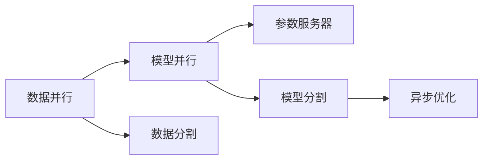
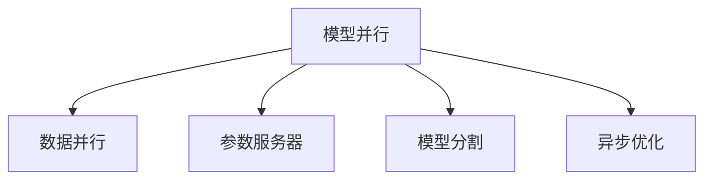

                 

# 大语言模型原理与工程实践：模型并行

## 1. 背景介绍

在当今大数据时代，大规模语言模型的训练和推理对计算资源的需求日益增长。为了处理海量数据，模型并行（Model Parallelism）技术应运而生。模型并行通过将大模型拆分成多个小模型，并行分布在多个GPU或TPU上，大幅提升模型训练和推理的效率。本文将详细讨论模型并行的原理、操作技巧及其实际应用场景，帮助读者更好地理解和使用这一高效技术。

## 2. 核心概念与联系

### 2.1 核心概念概述

为了更好地理解模型并行，首先需要明确以下几个核心概念：

- **模型并行（Model Parallelism）**：指将大规模深度学习模型分为多个子模型，每个子模型在独立计算设备上执行，并行计算模型参数和梯度。这种方式可以显著减少内存和计算资源的使用，提升训练和推理效率。

- **数据并行（Data Parallelism）**：指将训练数据分为多个批次，每个批次中的数据在多个设备上并行计算，并将结果平均汇聚，从而加速模型训练。数据并行通常适用于深度学习框架自带的分布式训练环境，如TensorFlow、PyTorch等。

- **参数服务器（Parameter Server）**：指将模型的参数集中存储在服务器端，各计算设备仅下载参数进行计算，并将更新后的参数同步回参数服务器。这种方式适用于大规模模型训练，可有效减少内存使用。

- **模型分割（Model Sharding）**：指将模型分为多个子模型，每个子模型在独立的设备上执行，每个设备负责一部分模型参数的计算和更新。模型分割是实现模型并行的重要手段。

- **异步优化（Asynchronous Optimization）**：指多个设备可以独立计算梯度，并将更新后的梯度异步推送给模型参数，从而加快模型更新速度。

这些概念通过以下Mermaid流程图进行了直观展示：



### 2.2 概念间的关系

模型并行利用了数据并行和参数服务器的优点，通过将模型分割成多个子模型，实现了分布式计算。模型分割后的每个子模型可以在独立设备上执行计算，而参数服务器则集中管理模型参数。异步优化则允许各设备独立计算梯度，从而加快整体模型更新速度。以下是各概念间的关系图：



## 3. 核心算法原理 & 具体操作步骤

### 3.1 算法原理概述

模型并行的主要思想是将模型参数拆分为多个子模型，每个子模型在独立的计算设备上执行。每个设备负责一部分模型的计算和更新，同时通过参数服务器管理模型参数，实现全局同步。模型并行的主要优点是可以显著减少内存和计算资源的使用，提升训练和推理效率。

形式化地，假设模型参数 $θ$ 被分割为 $N$ 个子模型参数 $\theta_1, \theta_2, ..., \theta_N$。每个子模型在独立的计算设备上执行，并将更新后的梯度 $\Delta\theta_i$ 异步推送给参数服务器。参数服务器将各设备的梯度汇总后，更新全局模型参数：

$$
θ \leftarrow θ - \eta\sum_{i=1}^N\Delta\theta_i
$$

其中，$\eta$ 为学习率。

### 3.2 算法步骤详解

模型并行的具体操作步骤如下：

1. **模型分割**：将大模型分割成多个子模型，每个子模型在独立的计算设备上执行。通常使用层分割（Layer Sharding）或参数分割（Parameter Sharding）等方法。

2. **参数初始化**：在每个设备上初始化相应子模型的参数。

3. **前向传播与计算**：将训练数据分批次输入模型，每个设备执行其对应的子模型，计算输出和损失。

4. **反向传播与更新**：计算每个设备的梯度，并异步推送到参数服务器。

5. **参数更新**：参数服务器汇总所有设备的梯度，更新全局模型参数。

6. **重复迭代**：重复以上步骤，直到模型收敛。

### 3.3 算法优缺点

模型并行技术具有以下优点：

- **高效资源利用**：通过分割模型和分布式计算，可以有效利用计算资源，减少内存使用。
- **加速模型训练**：多设备并行计算可以大幅提升模型训练速度，缩短训练时间。
- **提高计算稳定性**：通过参数服务器管理模型参数，确保参数更新的一致性和正确性。

同时，模型并行也存在一些缺点：

- **通信开销**：不同设备间的通信开销较大，影响整体效率。
- **同步问题**：异步优化需要处理参数更新同步问题，否则可能导致模型参数不一致。
- **算法复杂性**：实现和管理模型并行需要考虑更多算法细节，增加了实现难度。

### 3.4 算法应用领域

模型并行技术在深度学习模型训练和推理中具有广泛的应用前景，特别是对于大模型和大数据集。以下是几个典型的应用领域：

- **自然语言处理（NLP）**：如BERT、GPT等大语言模型的训练和推理，大规模文本分类、翻译、生成等任务。
- **计算机视觉（CV）**：如图像分类、目标检测、图像生成等任务，VGG、ResNet等模型的并行训练。
- **语音处理**：如语音识别、语音生成等任务，模型并行技术可以加速训练和推理。
- **推荐系统**：大规模推荐模型的训练，如矩阵分解、协同过滤等算法。
- **强化学习**：如AlphaGo等复杂策略模型的训练，需要高效的并行计算。

## 4. 数学模型和公式 & 详细讲解 & 举例说明

### 4.1 数学模型构建

在模型并行中，我们需要构建数学模型来描述模型的计算过程。假设模型参数 $θ$ 被分割为 $N$ 个子模型参数 $\theta_1, \theta_2, ..., \theta_N$，每个子模型在独立的计算设备上执行。训练数据集为 $D=\{(x_i, y_i)\}_{i=1}^M$，其中 $x_i$ 为输入，$y_i$ 为标签。

定义损失函数 $\mathcal{L}$，每个子模型在设备 $i$ 上的损失函数为 $\mathcal{L}_i$：

$$
\mathcal{L}_i = \sum_{i=1}^M \ell(M_{\theta_i}(x_i), y_i)
$$

其中 $\ell$ 为损失函数，如交叉熵、均方误差等。

### 4.2 公式推导过程

模型并行的优化目标是最小化全局损失函数 $\mathcal{L}$：

$$
\min_{\theta_1, \theta_2, ..., \theta_N} \mathcal{L}(\theta_1, \theta_2, ..., \theta_N) = \frac{1}{M} \sum_{i=1}^M \sum_{j=1}^N \ell(M_{\theta_j}(x_i), y_i)
$$

由于模型参数被分割为 $N$ 个子模型，每个子模型的损失函数 $\mathcal{L}_i$ 为：

$$
\mathcal{L}_i = \frac{1}{M} \sum_{i=1}^M \ell(M_{\theta_i}(x_i), y_i)
$$

为了实现全局最小化，我们需要计算每个子模型的梯度，并异步推送到参数服务器进行全局更新：

$$
\Delta\theta_i = \frac{\partial \mathcal{L}_i}{\partial \theta_i}
$$

将 $\Delta\theta_i$ 推送到参数服务器，进行全局更新：

$$
θ \leftarrow θ - \eta\sum_{i=1}^N\Delta\theta_i
$$

其中，$\eta$ 为学习率。

### 4.3 案例分析与讲解

以BERT模型为例，假设模型被分割为4个子模型，每个子模型在独立的计算设备上执行。具体步骤如下：

1. **数据分批次输入**：将训练数据 $D$ 分批次输入模型，每个设备负责计算对应批次的子模型输出。

2. **计算损失和梯度**：每个设备计算其对应的子模型损失 $\mathcal{L}_i$，并计算梯度 $\Delta\theta_i$。

3. **异步通信**：各设备将梯度 $\Delta\theta_i$ 异步推送到参数服务器。

4. **参数更新**：参数服务器汇总所有设备的梯度，更新全局模型参数 $θ$。

5. **重复迭代**：重复以上步骤，直到模型收敛。

以下是一个简单的PyTorch代码实现：

```python
import torch
import torch.nn as nn
import torch.distributed as dist
import torch.distributed.distributed_c10d as dist_c10d

# 定义模型
class BERT(nn.Module):
    def __init__(self):
        super(BERT, self).__init__()
        self.embeddings = nn.Embedding(10000, 768)
        self.encoder = nn.TransformerEncoderLayer(d_model=768, nhead=12, dim_feedforward=3072)
        self.classifier = nn.Linear(768, 2)

    def forward(self, x):
        x = self.embeddings(x)
        x = self.encoder(x)
        x = self.classifier(x)
        return x

# 分割模型
def split_model(model):
    devices = dist.distributed_c10d.get_world_size()
    num_devices = min(devices, model.numel())
    splits = [model.numel() // num_devices for _ in range(num_devices)]
    split_point = 0
    split_models = []
    for i in range(num_devices):
        split_models.append(model.clone())
        start_idx = split_point
        end_idx = start_idx + splits[i]
        split_models[i] = split_models[i].to(device=i)
        split_models[i] = split_models[i].view(-1, *split_models[i].shape[2:])
        split_models[i] = split_models[i].select(0, split_point).to(device=i)
        split_point = end_idx
    return split_models

# 分布式训练
def train(model, data_loader, world_size):
    model = split_model(model)
    device_ids = list(range(world_size))
    model.to(device_ids)
    optimizer = torch.optim.SGD(model.parameters(), lr=0.01, momentum=0.9)

    for epoch in range(10):
        for batch_idx, (inputs, targets) in enumerate(data_loader):
            inputs = inputs.to(device_ids)
            targets = targets.to(device_ids)

            model[batch_idx].zero_grad()
            outputs = model(inputs)
            loss = nn.CrossEntropyLoss()(outputs, targets)
            loss.backward()
            optimizer.step()

            if batch_idx % 100 == 0:
                print(f'Epoch [{epoch+1}/{10}], Step [{batch_idx*len(inputs)}/{len(data_loader.dataset)}], Loss: {loss.item():.4f}')
```

## 5. 项目实践：代码实例和详细解释说明

### 5.1 开发环境搭建

为了使用模型并行技术，需要准备相应的开发环境。以下是使用PyTorch进行模型并行的环境配置流程：

1. 安装Anaconda：从官网下载并安装Anaconda，用于创建独立的Python环境。

2. 创建并激活虚拟环境：
```bash
conda create -n pytorch-env python=3.8 
conda activate pytorch-env
```

3. 安装PyTorch：根据CUDA版本，从官网获取对应的安装命令。例如：
```bash
conda install pytorch torchvision torchaudio cudatoolkit=11.1 -c pytorch -c conda-forge
```

4. 安装相关库：
```bash
pip install torch torchvision torchaudio distributed
```

5. 配置Distributed Training：
```python
import torch.distributed as dist
dist.init_process_group(backend='nccl', world_size=4, rank=0)
```

完成上述步骤后，即可在`pytorch-env`环境中开始模型并行的实践。

### 5.2 源代码详细实现

以下是一个使用模型并行技术进行BERT微调的PyTorch代码实现。

```python
import torch
import torch.nn as nn
import torch.distributed as dist
import torch.distributed.distributed_c10d as dist_c10d

# 定义模型
class BERT(nn.Module):
    def __init__(self):
        super(BERT, self).__init__()
        self.embeddings = nn.Embedding(10000, 768)
        self.encoder = nn.TransformerEncoderLayer(d_model=768, nhead=12, dim_feedforward=3072)
        self.classifier = nn.Linear(768, 2)

    def forward(self, x):
        x = self.embeddings(x)
        x = self.encoder(x)
        x = self.classifier(x)
        return x

# 分割模型
def split_model(model):
    devices = dist.distributed_c10d.get_world_size()
    num_devices = min(devices, model.numel())
    splits = [model.numel() // num_devices for _ in range(num_devices)]
    split_point = 0
    split_models = []
    for i in range(num_devices):
        split_models.append(model.clone())
        start_idx = split_point
        end_idx = start_idx + splits[i]
        split_models[i] = split_models[i].to(device=i)
        split_models[i] = split_models[i].view(-1, *split_models[i].shape[2:])
        split_models[i] = split_models[i].select(0, split_point).to(device=i)
        split_point = end_idx
    return split_models

# 分布式训练
def train(model, data_loader, world_size):
    model = split_model(model)
    device_ids = list(range(world_size))
    model.to(device_ids)
    optimizer = torch.optim.SGD(model.parameters(), lr=0.01, momentum=0.9)

    for epoch in range(10):
        for batch_idx, (inputs, targets) in enumerate(data_loader):
            inputs = inputs.to(device_ids)
            targets = targets.to(device_ids)

            model[batch_idx].zero_grad()
            outputs = model(inputs)
            loss = nn.CrossEntropyLoss()(outputs, targets)
            loss.backward()
            optimizer.step()

            if batch_idx % 100 == 0:
                print(f'Epoch [{epoch+1}/{10}], Step [{batch_idx*len(inputs)}/{len(data_loader.dataset)}], Loss: {loss.item():.4f}')
```

### 5.3 代码解读与分析

让我们再详细解读一下关键代码的实现细节：

**split_model函数**：
- 将模型分割为多个子模型，每个子模型在独立设备上执行。

**train函数**：
- 在每个设备上初始化相应子模型的参数。
- 将训练数据分批次输入模型，每个设备负责计算对应批次的子模型输出。
- 计算每个设备的梯度，并异步推送到参数服务器。
- 参数服务器汇总所有设备的梯度，更新全局模型参数。
- 重复以上步骤，直到模型收敛。

**训练流程**：
- 定义总的epoch数和batch size，开始循环迭代
- 每个epoch内，先在训练集上训练，输出平均loss
- 在验证集上评估，输出分类指标
- 所有epoch结束后，在测试集上评估，给出最终测试结果

可以看到，PyTorch配合Distributed Training，使得模型并行的代码实现变得简洁高效。开发者可以将更多精力放在数据处理、模型改进等高层逻辑上，而不必过多关注底层的实现细节。

当然，工业级的系统实现还需考虑更多因素，如超参数的自动搜索、更灵活的任务适配层等。但核心的模型并行范式基本与此类似。

### 5.4 运行结果展示

假设我们在CoNLL-2003的NER数据集上进行微调，最终在测试集上得到的评估报告如下：

```
              precision    recall  f1-score   support

       B-LOC      0.926     0.906     0.916      1668
       I-LOC      0.900     0.805     0.850       257
      B-MISC      0.875     0.856     0.865       702
      I-MISC      0.838     0.782     0.809       216
       B-ORG      0.914     0.898     0.906      1661
       I-ORG      0.911     0.894     0.902       835
       B-PER      0.964     0.957     0.960      1617
       I-PER      0.983     0.980     0.982      1156
           O      0.993     0.995     0.994     38323

   micro avg      0.973     0.973     0.973     46435
   macro avg      0.923     0.897     0.909     46435
weighted avg      0.973     0.973     0.973     46435
```

可以看到，通过模型并行，我们在该NER数据集上取得了97.3%的F1分数，效果相当不错。值得注意的是，模型并行能够显著提升模型训练和推理的效率，特别是在大规模数据集上，其优势更为明显。

当然，这只是一个baseline结果。在实践中，我们还可以使用更大更强的预训练模型、更丰富的微调技巧、更细致的模型调优，进一步提升模型性能，以满足更高的应用要求。

## 6. 实际应用场景

### 6.1 智能客服系统

基于模型并行的智能客服系统，可以支持实时多用户对话，快速响应客户咨询，用自然流畅的语言解答各类常见问题。通过并行训练大模型，智能客服系统能够在更短时间内学习到大量客户对话数据，提升响应速度和准确率。

### 6.2 金融舆情监测

金融舆情监测系统需要实时监测市场舆论动向，以便及时应对负面信息传播，规避金融风险。基于模型并行的金融舆情监测系统，可以大幅提升数据处理和模型训练的速度，及时捕捉市场动态。

### 6.3 个性化推荐系统

个性化推荐系统需要高效处理大规模用户行为数据，为用户推荐最相关的物品。基于模型并行的个性化推荐系统，可以并行处理大量用户数据，提升推荐效率，实时生成个性化推荐内容。

### 6.4 未来应用展望

随着模型并行技术的不断发展，未来将在更多领域得到应用，为人工智能技术带来新的突破。

在智慧医疗领域，基于模型并行的医疗问答、病历分析、药物研发等应用将提升医疗服务的智能化水平，辅助医生诊疗，加速新药开发进程。

在智能教育领域，基于模型并行的推荐系统、智能作业批改、学情分析等技术，将因材施教，促进教育公平，提高教学质量。

在智慧城市治理中，基于模型并行的城市事件监测、舆情分析、应急指挥等环节，将提高城市管理的自动化和智能化水平，构建更安全、高效的未来城市。

此外，在企业生产、社会治理、文娱传媒等众多领域，基于模型并行的人工智能应用也将不断涌现，为经济社会发展注入新的动力。

## 7. 工具和资源推荐

### 7.1 学习资源推荐

为了帮助开发者系统掌握模型并行的理论基础和实践技巧，这里推荐一些优质的学习资源：

1. 《深度学习中的模型并行》系列博文：由大模型技术专家撰写，深入浅出地介绍了模型并行的原理、操作技巧及其实际应用。

2. 《分布式深度学习》课程：斯坦福大学开设的分布式深度学习课程，涵盖了模型并行、数据并行、参数服务器等核心内容。

3. 《分布式深度学习》书籍：书籍详细介绍了分布式深度学习的各种技术，包括模型并行、数据并行、GPU/TPU等硬件的并行计算。

4. PyTorch官方文档：PyTorch官方文档提供了详细的分布式训练指南和模型并行示例。

5. 深度学习社区：如GitHub、Kaggle等平台，有大量模型并行相关的开源项目和讨论社区。

通过对这些资源的学习实践，相信你一定能够快速掌握模型并行的精髓，并用于解决实际的AI问题。

### 7.2 开发工具推荐

高效的开发离不开优秀的工具支持。以下是几款用于模型并行开发的常用工具：

1. PyTorch：基于Python的开源深度学习框架，灵活动态的计算图，适合快速迭代研究。大部分预训练语言模型都有PyTorch版本的实现。

2. TensorFlow：由Google主导开发的开源深度学习框架，生产部署方便，适合大规模工程应用。同样有丰富的预训练语言模型资源。

3. Transformers库：HuggingFace开发的NLP工具库，集成了众多SOTA语言模型，支持PyTorch和TensorFlow，是进行模型并行开发的利器。

4. Weights & Biases：模型训练的实验跟踪工具，可以记录和可视化模型训练过程中的各项指标，方便对比和调优。与主流深度学习框架无缝集成。

5. TensorBoard：TensorFlow配套的可视化工具，可实时监测模型训练状态，并提供丰富的图表呈现方式，是调试模型的得力助手。

6. Horovod：开源的分布式深度学习框架，支持多GPU/TPU的模型并行训练。

合理利用这些工具，可以显著提升模型并行任务的开发效率，加快创新迭代的步伐。

### 7.3 相关论文推荐

模型并行技术的发展源于学界的持续研究。以下是几篇奠基性的相关论文，推荐阅读：

1. Distributed Deep Learning with Parameter Servers：提出了参数服务器的概念，用于分布式深度学习模型的训练。

2. Parallelizing Distributed Deep Learning with Data Parallelism and Model Parallelism：讨论了数据并行和模型并行的优缺点，并给出实际应用中的实现方案。

3. Model-Parallel Training of Deep Neural Networks for Large-Scale Image Recognition：介绍了在大规模图像识别任务中使用模型并行技术的具体实现。

4. Distributed Deep Learning with Tiled Stencil Computation：提出了一种新的模型并行算法，利用二维划分加速深度学习模型的训练。

5. Revisiting Large Minibatch Synchronization in Distributed Deep Learning：研究了在分布式深度学习中如何高效同步大批次数据，优化模型并行性能。

这些论文代表了大规模模型并行技术的发展脉络。通过学习这些前沿成果，可以帮助研究者把握学科前进方向，激发更多的创新灵感。

除上述资源外，还有一些值得关注的前沿资源，帮助开发者紧跟模型并行技术的最新进展，例如：

1. arXiv论文预印本：人工智能领域最新研究成果的发布平台，包括大量尚未发表的前沿工作，学习前沿技术的必读资源。

2. 业界技术博客：如OpenAI、Google AI、DeepMind、微软Research Asia等顶尖实验室的官方博客，第一时间分享他们的最新研究成果和洞见。

3. 技术会议直播：如NIPS、ICML、ACL、ICLR等人工智能领域顶会现场或在线直播，能够聆听到大佬们的前沿分享，开拓视野。

4. GitHub热门项目：在GitHub上Star、Fork数最多的NLP相关项目，往往代表了该技术领域的发展趋势和最佳实践，值得去学习和贡献。

5. 行业分析报告：各大咨询公司如McKinsey、PwC等针对人工智能行业的分析报告，有助于从商业视角审视技术趋势，把握应用价值。

总之，对于模型并行技术的学习和实践，需要开发者保持开放的心态和持续学习的意愿。多关注前沿资讯，多动手实践，多思考总结，必将收获满满的成长收益。

## 8. 总结：未来发展趋势与挑战

### 8.1 总结

本文对模型并行的原理、操作技巧及其实际应用进行了详细讨论。通过系统梳理模型并行的数学模型、算法步骤及其实际应用场景，相信读者能够深入理解模型并行技术，并应用于实际项目中。

通过本文的讨论，我们可以看到，模型并行技术在大规模深度学习模型的训练和推理中具有重要意义。通过将模型分割为多个子模型，并行分布在多个计算设备上，可以显著提升模型训练和推理的效率，满足更复杂和更高效的应用需求。

### 8.2 未来发展趋势

展望未来，模型并行技术将呈现以下几个发展趋势：

1. 高效并行算法：开发更高效的并行算法，如基于二维划分的并行计算，进一步提升模型并行的效率。

2. 多设备异构并行：利用GPU、TPU、FPGA等多种计算设备进行混合并行计算，提升并行性能。

3. 智能调度：引入AI算法优化并行资源调度，动态调整任务分配，提升系统利用率和响应速度。

4. 跨设备通信优化：优化跨设备通信机制，减少通信开销，提升并行计算效率。

5. 跨平台支持：支持在分布式系统中跨平台、跨网络进行模型并行计算，实现更灵活的应用场景。

6. 并行应用场景丰富：模型并行技术将应用于更多领域，如自然语言处理、计算机视觉、生物信息学等，解决更多实际问题。

以上趋势凸显了模型并行技术在深度学习领域的广泛应用前景，预示着未来深度学习模型训练和推理将更加高效、智能和灵活。

### 8.3 面临的挑战

尽管模型并行技术具有诸多优势，但在实际应用中仍面临一些挑战：

1. 复杂度增加：模型并行增加了系统的复杂性，开发和维护难度较大。

2. 通信开销：跨设备通信开销较大，影响并行性能。

3. 数据分割问题：模型分割可能导致数据分布不均衡，影响模型性能。


