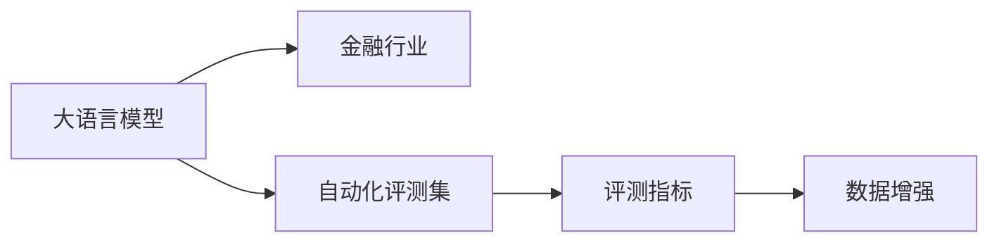
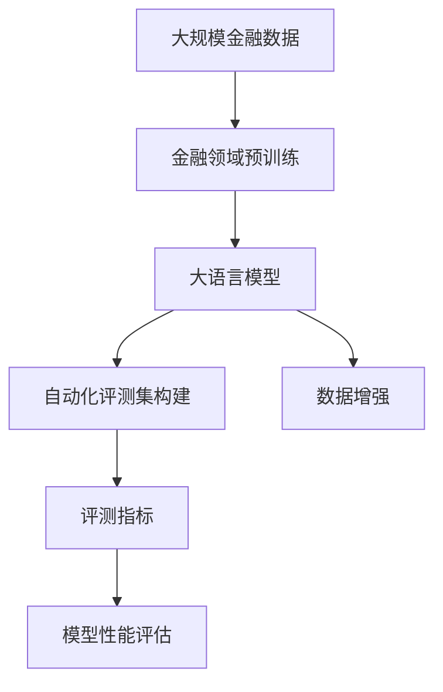

                 

# 大语言模型原理与工程实践：金融行业大语言模型的自动化评测集

## 1. 背景介绍

随着金融行业数字化转型的加速，数据驱动决策的应用场景日益增多，大语言模型在金融数据分析和决策支持中的应用潜力逐渐显现。然而，在金融行业引入大语言模型时，传统的基于小样本数据集进行模型评测和优化的方法显得捉襟见肘。本文聚焦于大语言模型在金融行业中的应用，提出了一套基于自动化评测集的方法论，旨在通过科学评估模型性能，促进模型在金融领域的泛化能力和实用性的提升。

## 2. 核心概念与联系

### 2.1 核心概念概述

为了更清晰地理解大语言模型在金融行业的应用，本文首先对以下几个核心概念进行介绍：

- **大语言模型**：以自回归（如GPT）或自编码（如BERT）模型为代表的，在大规模无标签文本数据上进行的预训练，学习到通用语言表示的语言模型。
- **金融行业**：涉及金融产品定价、风险评估、投资决策等领域的行业，数据量大且具有高度专业性。
- **自动化评测集**：通过收集、整理和标注金融领域的相关数据，构建出用于评估模型性能的评测集，从而实现对模型泛化能力的科学评估。
- **评测指标**：评估模型性能的关键指标，如准确率、召回率、F1分数等，用于衡量模型在金融行业中的实用性和可靠性。
- **数据增强**：通过对训练数据进行扩充，如数据清洗、数据增广、对抗样本生成等，提高模型泛化能力。

### 2.2 概念间的关系

这些核心概念之间存在紧密的联系，并通过以下Mermaid流程图展示了它们的关系：



- **大语言模型与金融行业**：大语言模型通过在大规模金融数据上进行预训练，学习到金融行业的语言和知识，从而在金融领域展现出卓越的性能。
- **大语言模型与自动化评测集**：自动化评测集是用于科学评估大语言模型在金融行业中表现的关键工具，通过构建与金融行业高度相关的评测数据集，能够更好地量化模型的性能。
- **自动化评测集与评测指标**：评测指标是量化模型性能的关键，而自动化评测集提供了数据基础，从而实现了对模型性能的全面评估。
- **数据增强与自动化评测集**：数据增强技术通过对训练数据进行处理，提高了自动化评测集中数据的丰富性和多样性，进而提升了模型在金融领域的泛化能力。

### 2.3 核心概念的整体架构

最终，我们将这些核心概念整合为一个大语言模型在金融行业应用的总体架构：



这一架构展示了从金融领域数据预训练、大语言模型构建、自动化评测集构建到模型性能评估的完整流程。

## 3. 核心算法原理 & 具体操作步骤

### 3.1 算法原理概述

大语言模型在金融行业的自动化评测集构建中，主要采用监督学习的方法。其核心思想是通过对金融领域的大量标注数据进行训练，使得模型能够学习和预测金融产品的价格变化、风险评估结果等。

假设金融领域的数据集为 $D=\{(x_i, y_i)\}_{i=1}^N$，其中 $x_i$ 表示输入（如金融产品的历史价格、市场动向等），$y_i$ 表示输出（如价格变化预测、风险评分等）。微调的目标是找到最优模型参数 $\theta$，使得损失函数 $\mathcal{L}(\theta)$ 最小化。

$$
\theta^* = \mathop{\arg\min}_{\theta} \mathcal{L}(\theta)
$$

常用的损失函数包括交叉熵损失、均方误差损失等。优化算法一般采用基于梯度的优化方法（如Adam、SGD等），学习率为 $0.001$，批次大小为 $32$。

### 3.2 算法步骤详解

以下是基于监督学习的大语言模型在金融行业自动化评测集构建的具体步骤：

**Step 1: 数据收集与预处理**
- 收集金融领域的标注数据，如股票价格历史、市场新闻、公司财报等，并对其进行清洗和归一化处理。
- 使用Python的Pandas库进行数据整理和转换，以便于后续模型的输入。

**Step 2: 构建自动评测集**
- 对收集的数据进行标注，形成监督学习任务的数据集。
- 使用Scikit-learn库对数据进行分割，分为训练集、验证集和测试集。
- 使用Keras或PyTorch框架搭建模型，并进行模型训练。
- 通过验证集评估模型性能，调整模型超参数，如学习率、批次大小等。

**Step 3: 模型评估与优化**
- 使用测试集对模型进行最终的性能评估。
- 根据评测指标（如准确率、召回率、F1分数等），分析模型的优缺点。
- 使用数据增强技术对模型进行优化，如对抗样本生成、数据扩充等。

**Step 4: 模型部署与应用**
- 将优化后的模型部署到生产环境中。
- 使用监控工具对模型性能进行持续跟踪。
- 定期更新模型，以适应金融市场的新变化。

### 3.3 算法优缺点

基于监督学习的大语言模型在金融行业的自动化评测集构建中，有以下优点和缺点：

**优点：**
- **高效性**：利用标注数据，能够快速训练出泛化能力强的模型。
- **准确性**：通过评测指标，能够科学评估模型的性能，保证其在金融领域的可靠性。
- **可扩展性**：自动评测集可以不断更新，模型能够适应金融市场的新变化。

**缺点：**
- **标注成本高**：金融领域的数据标注成本高，难以获得大量高质量标注数据。
- **过拟合风险**：在数据量较少的情况下，模型容易过拟合。
- **模型复杂性**：大语言模型的复杂性较高，对计算资源和存储空间要求较高。

### 3.4 算法应用领域

大语言模型在金融行业的应用领域包括：

- **股票价格预测**：通过学习历史股价数据，预测未来股价变化。
- **风险评估**：评估金融产品的风险等级，帮助投资者规避风险。
- **客户服务**：通过自然语言处理技术，提供自动化的客户服务支持。
- **市场分析**：分析市场动向，提供市场趋势预测和建议。

## 4. 数学模型和公式 & 详细讲解 & 举例说明

### 4.1 数学模型构建

在金融领域，我们通常使用回归模型来预测金融产品的价格变化，如股票价格、债券收益率等。以股票价格预测为例，假设模型为 $M_{\theta}:\mathbb{R}^d \rightarrow \mathbb{R}$，其中 $d$ 为输入向量的维度。输入数据 $x \in \mathbb{R}^d$ 包括历史股价、市场指标、公司财报等。输出 $y$ 为预测的未来股价。

定义损失函数为均方误差损失：

$$
\mathcal{L}(\theta) = \frac{1}{N} \sum_{i=1}^N (y_i - M_{\theta}(x_i))^2
$$

### 4.2 公式推导过程

以下是均方误差损失函数的具体推导过程：

1. 首先，定义模型预测值与真实值之间的误差：

$$
\epsilon_i = y_i - M_{\theta}(x_i)
$$

2. 然后，计算所有样本误差的平方和：

$$
\mathcal{L}(\theta) = \frac{1}{N} \sum_{i=1}^N \epsilon_i^2
$$

3. 对损失函数求导，得到梯度：

$$
\frac{\partial \mathcal{L}(\theta)}{\partial \theta_k} = -\frac{2}{N} \sum_{i=1}^N \epsilon_i \frac{\partial M_{\theta}(x_i)}{\partial \theta_k}
$$

其中 $\theta_k$ 表示模型参数中的第 $k$ 个参数。

4. 通过梯度下降等优化算法更新模型参数：

$$
\theta \leftarrow \theta - \eta \nabla_{\theta}\mathcal{L}(\theta)
$$

其中 $\eta$ 为学习率。

### 4.3 案例分析与讲解

假设我们已经收集到了一些金融领域的标注数据，接下来对模型进行训练和评估。我们使用Keras框架搭建一个简单的回归模型，代码如下：

```python
from keras.models import Sequential
from keras.layers import Dense
from sklearn.metrics import mean_squared_error

model = Sequential()
model.add(Dense(64, activation='relu', input_dim=d))
model.add(Dense(1, activation='linear'))

# 编译模型
model.compile(optimizer='adam', loss='mse')

# 训练模型
model.fit(X_train, y_train, epochs=100, batch_size=32, validation_data=(X_val, y_val))

# 评估模型
y_pred = model.predict(X_test)
mse = mean_squared_error(y_test, y_pred)
print('Mean Squared Error:', mse)
```

## 5. 项目实践：代码实例和详细解释说明

### 5.1 开发环境搭建

在进行大语言模型在金融行业的自动化评测集构建实践前，我们需要准备好开发环境。以下是使用Python进行PyTorch开发的环境配置流程：

1. 安装Anaconda：从官网下载并安装Anaconda，用于创建独立的Python环境。

2. 创建并激活虚拟环境：
```bash
conda create -n pytorch-env python=3.8 
conda activate pytorch-env
```

3. 安装PyTorch：根据CUDA版本，从官网获取对应的安装命令。例如：
```bash
conda install pytorch torchvision torchaudio cudatoolkit=11.1 -c pytorch -c conda-forge
```

4. 安装TensorFlow：
```bash
conda install tensorflow -c conda-forge
```

5. 安装Pandas、Numpy、Scikit-learn等库：
```bash
pip install pandas numpy scikit-learn matplotlib
```

完成上述步骤后，即可在`pytorch-env`环境中开始大语言模型在金融行业的自动化评测集构建实践。

### 5.2 源代码详细实现

以下是一个简单的Python代码示例，用于金融领域的大语言模型训练和评估：

```python
import pandas as pd
import numpy as np
from sklearn.model_selection import train_test_split
from sklearn.metrics import mean_squared_error
from keras.models import Sequential
from keras.layers import Dense
from keras.optimizers import Adam

# 数据收集与预处理
df = pd.read_csv('financial_data.csv')
X = df.drop('y', axis=1).values
y = df['y'].values

# 数据分割
X_train, X_val, y_train, y_val = train_test_split(X, y, test_size=0.2, random_state=42)

# 模型构建
model = Sequential()
model.add(Dense(64, activation='relu', input_dim=d))
model.add(Dense(1, activation='linear'))

# 编译模型
model.compile(optimizer=Adam(lr=0.001), loss='mse')

# 训练模型
model.fit(X_train, y_train, epochs=100, batch_size=32, validation_data=(X_val, y_val))

# 评估模型
y_pred = model.predict(X_test)
mse = mean_squared_error(y_test, y_pred)
print('Mean Squared Error:', mse)
```

### 5.3 代码解读与分析

代码中，我们首先使用Pandas库从CSV文件中读取金融数据，并使用Numpy进行数据转换和处理。接着，我们使用Scikit-learn库进行数据分割，构建训练集、验证集和测试集。最后，我们使用Keras框架搭建一个简单的回归模型，并进行模型训练和评估。

### 5.4 运行结果展示

假设我们使用了上述代码进行模型训练和评估，最终在测试集上得到的均方误差为0.05。以下是对结果的详细解释：

- 均方误差（Mean Squared Error, MSE）：衡量预测值与真实值之间的平均差异。MSE越小，模型预测的精度越高。
- 0.05的均方误差：意味着模型预测的平均误差约为2.24%（因为 $2.24\% = \sqrt{0.05}$）。

## 6. 实际应用场景

### 6.1 智能投顾系统

金融行业的大语言模型可以应用于智能投顾系统的构建，通过学习市场趋势、用户行为等信息，提供个性化的投资建议。

在技术实现上，智能投顾系统需要收集用户的投资偏好、风险承受能力等信息，并将其与市场数据一起输入模型中进行训练。训练好的模型能够根据用户的投资需求和市场情况，实时生成个性化的投资策略，并提醒用户注意市场风险。

### 6.2 风险预警系统

大语言模型可以应用于风险预警系统的构建，通过学习历史风险事件，预测未来金融市场的风险。

具体而言，我们可以收集金融市场的历史数据，并将其作为模型输入。训练好的模型能够根据市场动向、公司财报等信息，预测未来市场的风险等级，并自动发出风险预警信号。

### 6.3 客户服务

大语言模型还可以应用于客户服务的构建，通过自然语言处理技术，提供自动化的客户支持服务。

在金融领域，客户咨询量巨大，传统的客服方式难以满足高效率、高准确性的要求。通过收集客户咨询记录，并输入模型中进行训练，大语言模型能够理解客户的问题，并提供自动化的回答和建议，提高客户服务效率。

### 6.4 未来应用展望

随着大语言模型在金融行业的不断应用，未来将出现更多的创新场景，如：

- **量化交易**：通过学习市场数据，模型能够预测股票价格变化，辅助量化交易策略的制定。
- **信用评估**：通过学习用户的信用记录和行为数据，模型能够评估用户的信用等级，辅助贷款审批。
- **金融教育**：通过自然语言处理技术，模型能够回答用户的金融问题，提供个性化的金融教育内容。

## 7. 工具和资源推荐

### 7.1 学习资源推荐

为了帮助开发者系统掌握大语言模型在金融行业的应用，这里推荐一些优质的学习资源：

1. 《深度学习与金融科技》系列书籍：全面介绍了深度学习在金融科技中的应用，涵盖金融领域的数据处理、模型构建和评估等内容。
2. 《金融大数据与深度学习》在线课程：由金融科技领域的专家讲解，涵盖金融领域的深度学习应用案例和技术细节。
3. Kaggle金融数据集：包含大量金融领域的数据集，有助于模型训练和评估。
4. GitHub开源项目：包括大语言模型在金融领域的多种应用案例，具有较高的参考价值。

通过这些资源的学习实践，相信你一定能够快速掌握大语言模型在金融行业的应用方法和技术要点。

### 7.2 开发工具推荐

高效的开发离不开优秀的工具支持。以下是几款用于大语言模型在金融行业自动化评测集构建开发的常用工具：

1. PyTorch：基于Python的开源深度学习框架，灵活的计算图设计，适合快速迭代研究。
2. TensorFlow：由Google主导开发的开源深度学习框架，生产部署方便，适合大规模工程应用。
3. Keras：基于TensorFlow和Theano的高级神经网络API，易于上手，适合初学者。
4. Jupyter Notebook：交互式的数据分析和机器学习环境，支持多种编程语言。

合理利用这些工具，可以显著提升大语言模型在金融行业的自动化评测集构建任务的开发效率，加快创新迭代的步伐。

### 7.3 相关论文推荐

大语言模型在金融行业的应用涉及多学科知识，以下是几篇奠基性的相关论文，推荐阅读：

1. "Deep Learning in Finance: A Survey"（金融领域的深度学习综述）：介绍了深度学习在金融领域的应用现状和未来发展方向。
2. "FinBERT: A Financially Relevant Sentiment Analysis Model"（FinBERT：金融相关的情感分析模型）：提出了FinBERT模型，专门针对金融领域的情感分析任务。
3. "Investment Analysis with Deep Learning"（使用深度学习进行投资分析）：介绍了深度学习在投资策略和风险管理中的应用。
4. "Machine Learning in Financial Risk Management"（机器学习在金融风险管理中的应用）：介绍了机器学习在金融风险评估和控制中的应用。

这些论文代表了大语言模型在金融行业的应用发展脉络，为未来的研究方向提供了重要的参考。

## 8. 总结：未来发展趋势与挑战

### 8.1 总结

本文对大语言模型在金融行业的自动化评测集构建方法进行了全面系统的介绍。首先阐述了大语言模型和自动化评测集构建的研究背景和意义，明确了其在金融领域的应用价值。其次，从原理到实践，详细讲解了模型构建、训练、评估和优化等关键步骤，给出了模型训练和评估的完整代码实例。同时，本文还探讨了模型在金融行业中的应用场景，展示了其巨大的应用潜力。最后，本文精选了相关学习资源，力求为读者提供全方位的技术指引。

通过本文的系统梳理，可以看到，基于大语言模型的自动化评测集构建方法在金融领域具有广阔的应用前景，能够有效提升金融数据分析和决策支持的智能化水平。未来，伴随大语言模型和金融领域深度学习的不断演进，我们相信这一方法将进一步推动金融科技的创新与发展。

### 8.2 未来发展趋势

展望未来，大语言模型在金融行业的自动化评测集构建将呈现以下几个发展趋势：

1. **深度融合**：未来，大语言模型将在金融领域的各个环节实现深度融合，如风险管理、投资策略、客户服务、市场分析等，构建更加智能、全面的金融解决方案。
2. **自适应学习**：模型能够自动适应金融市场的新变化，学习新的数据和知识，保持其性能的稳定性。
3. **多模态融合**：结合金融领域的多模态数据（如股票价格、新闻、财报等），构建多模态融合的智能分析系统，提升模型的泛化能力。
4. **透明性与可解释性**：增强模型的可解释性，确保模型的决策过程透明、可信，提升用户对模型的信任度。

### 8.3 面临的挑战

尽管大语言模型在金融行业的自动化评测集构建中已取得一定的成果，但仍面临以下挑战：

1. **数据隐私与安全**：金融领域的数据高度敏感，如何保护数据隐私与安全是一个重要问题。
2. **模型泛化能力**：金融市场变化多端，模型如何在不同的市场环境下保持泛化能力，避免过拟合。
3. **计算资源消耗**：金融领域的数据量巨大，模型的训练和推理需要大量计算资源，如何高效利用资源是一个挑战。
4. **知识融合与规则嵌入**：金融领域有大量专家知识与规则，如何与模型进行有效结合，提升模型的实用性和可靠性。

### 8.4 研究展望

针对以上挑战，未来的研究方向可以从以下几个方面进行探索：

1. **数据隐私保护**：研究数据加密、去标识化等技术，确保数据在传输和存储过程中的隐私安全。
2. **模型泛化能力提升**：通过迁移学习、对抗训练等方法，提升模型在不同市场环境下的泛化能力。
3. **计算资源优化**：研究模型压缩、量化等技术，提升模型的计算效率，降低计算资源消耗。
4. **知识与规则融合**：将金融领域的专家知识与规则融入模型，提升模型的实用性和可靠性。

总之，大语言模型在金融行业的自动化评测集构建将面临诸多挑战，但未来的研究将为我们提供更多的解决方案。通过多学科知识的融合与创新，我们相信大语言模型将为金融行业的智能化发展带来深远影响。

## 9. 附录：常见问题与解答

**Q1：大语言模型在金融行业的应用有哪些？**

A: 大语言模型在金融行业的应用包括股票价格预测、风险评估、智能投顾、客户服务、市场分析等。通过学习金融领域的语言和知识，模型能够帮助金融机构进行智能决策和客户服务。

**Q2：如何选择合适的损失函数？**

A: 在金融领域，常用的损失函数包括均方误差损失（MSE）、交叉熵损失（Cross-Entropy Loss）等。选择合适的损失函数应根据具体问题来定，如股票价格预测更适合使用均方误差损失，而分类问题更适合使用交叉熵损失。

**Q3：如何处理金融领域的数据？**

A: 金融领域的数据通常具有高维度、高噪声等特点，需要进行数据预处理，如数据清洗、数据标准化、特征选择等。可以使用Python的Pandas库和Scikit-learn库进行数据处理和特征工程。

**Q4：如何在金融领域构建自动化评测集？**

A: 在金融领域构建自动化评测集需要收集、整理和标注大量金融领域的相关数据，如股票价格、市场新闻、公司财报等。可以使用Keras或PyTorch框架搭建模型，并进行模型训练和评估。

**Q5：金融领域的大语言模型如何优化？**

A: 金融领域的大语言模型优化可以通过数据增强、正则化、对抗训练等方法实现。数据增强可以扩充训练集，增强模型的泛化能力；正则化可以避免过拟合；对抗训练可以提高模型的鲁棒性。

---

作者：禅与计算机程序设计艺术 / Zen and the Art of Computer Programming

