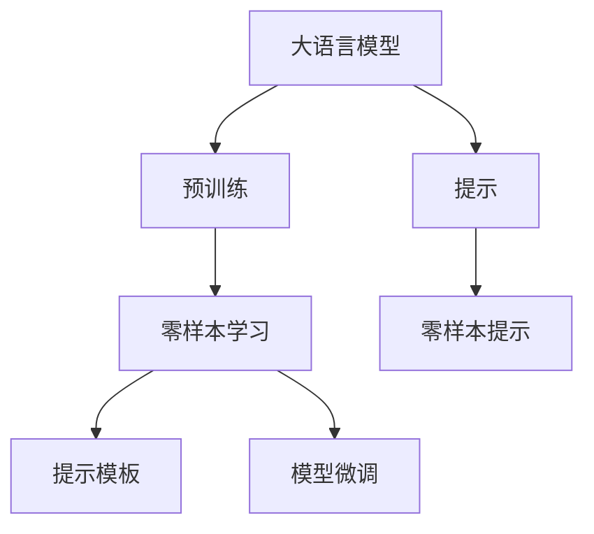
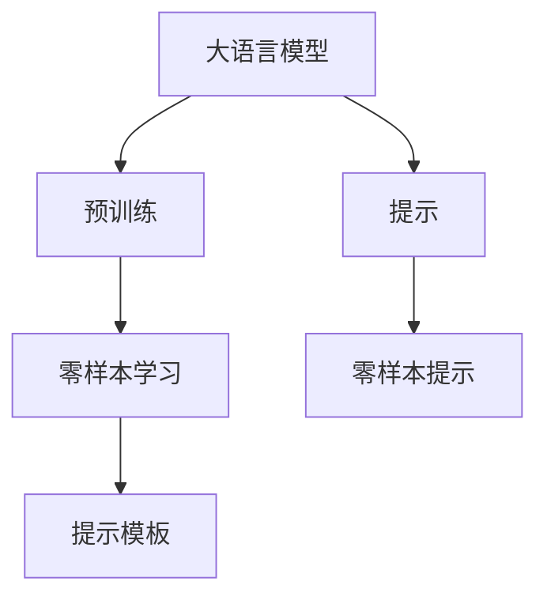
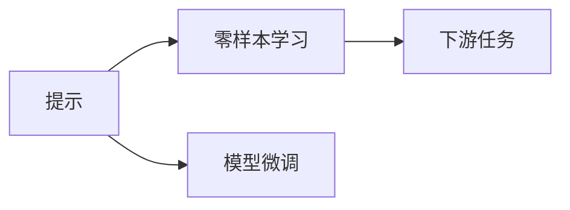
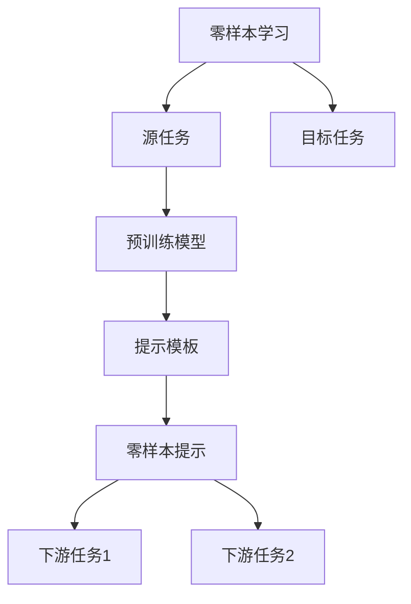
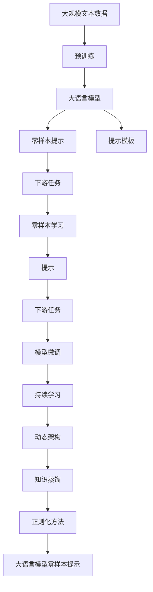

                 

# 大语言模型原理与工程实践：零样本提示

> 关键词：大语言模型,零样本提示,自然语言处理(NLP),Prompt Template,预训练模型,语言理解,模型微调

## 1. 背景介绍

### 1.1 问题由来
近年来，随着深度学习技术的快速发展，大语言模型（Large Language Models, LLMs）在自然语言处理（NLP）领域取得了巨大的突破。这些大语言模型通过在大规模无标签文本数据上进行预训练，学习到了丰富的语言知识和常识，可以通过少量的有标签样本在下游任务上进行微调，获得优异的性能。然而，当需要处理全新的、未见过的任务时，仅靠微调并不能发挥其最大潜力。零样本提示（Zero-Shot Prompting）技术通过设计适当的提示模板（Prompt Template），引导大语言模型在从未见过的任务上完成推理和生成，无需额外的训练和微调，具有极高的通用性和适应性。

### 1.2 问题核心关键点
零样本提示的核心思想是通过精心设计的提示模板，将任务描述嵌入到模型的输入中，引导模型自动理解任务要求，从而进行推理和生成。该方法可以用于处理分类、问答、生成等多种NLP任务，具有无需标注数据、零样本学习、计算效率高等优点。

### 1.3 问题研究意义
零样本提示技术的应用具有重要意义：

1. **降低成本**：无需标注数据，减少了获取高质量标注数据的时间和成本。
2. **提升灵活性**：在处理新任务时，只需设计合适的提示模板，即可快速应用，极大地提高了模型的适应性。
3. **提高效率**：零样本学习无需额外的微调过程，显著减少了模型的训练和推理时间。
4. **增强可解释性**：提示模板的设计可以增强模型的输出解释性，使其行为更具可解释性。
5. **减少偏见**：通过精心设计的提示模板，可以减少模型中的固有偏见，提高模型输出的公平性。

## 2. 核心概念与联系

### 2.1 核心概念概述

为了更好地理解零样本提示技术，本节将介绍几个密切相关的核心概念：

- **大语言模型 (LLMs)**：以自回归模型（如GPT）或自编码模型（如BERT）为代表的预训练语言模型，通过在大规模无标签文本数据上进行预训练，学习通用的语言表示。
- **预训练 (Pre-training)**：指在大规模无标签文本语料上，通过自监督学习任务训练通用语言模型的过程。常见的预训练任务包括言语建模、掩码语言模型等。
- **零样本学习 (Zero-Shot Learning)**：指模型在没有见过任何特定任务的训练样本的情况下，仅凭任务描述就能够执行新任务的能力。
- **提示 (Prompt)**：在输入文本中嵌入任务描述，引导模型进行特定任务的推理和生成。
- **提示模板 (Prompt Template)**：设计好的、通用的提示格式，用于引导模型在零样本情况下完成任务。
- **模型微调 (Fine-Tuning)**：在预训练模型的基础上，使用下游任务的少量标注数据，通过有监督地训练优化模型在特定任务上的性能。

这些核心概念之间的逻辑关系可以通过以下Mermaid流程图来展示：



这个流程图展示了大语言模型的核心概念及其之间的关系：

1. 大语言模型通过预训练获得基础能力。
2. 零样本学习允许模型在没有标注数据的情况下，利用提示模板执行新任务。
3. 提示模板用于设计输入格式，引导模型进行推理和生成。
4. 模型微调通过有监督学习进一步优化模型在特定任务上的性能。
5. 提示学习将提示模板和零样本学习结合，实现无需微调的推理生成。

### 2.2 概念间的关系

这些核心概念之间存在着紧密的联系，形成了零样本提示技术的应用框架。下面我通过几个Mermaid流程图来展示这些概念之间的关系。

#### 2.2.1 大语言模型的学习范式



这个流程图展示了大语言模型的学习范式，包括预训练、零样本学习和提示模板。预训练使得模型学习到通用的语言表示，零样本学习使得模型能够在没有标注数据的情况下执行新任务，提示模板则用于引导模型进行推理和生成。

#### 2.2.2 提示与微调的关系



这个流程图展示了提示与微调的关系。提示用于引导模型在零样本情况下执行新任务，而模型微调则通过有监督学习优化模型在特定任务上的性能。

#### 2.2.3 零样本学习在大语言模型中的应用



这个流程图展示了零样本学习的基本原理，以及它与提示模板的关系。零样本学习涉及源任务和目标任务，预训练模型在源任务上学习，然后通过提示模板在目标任务上进行推理和生成。

### 2.3 核心概念的整体架构

最后，我用一个综合的流程图来展示这些核心概念在大语言模型零样本提示中的应用：



这个综合流程图展示了从预训练到零样本提示，再到持续学习的完整过程。大语言模型首先在大规模文本数据上进行预训练，然后通过提示模板在零样本情况下执行新任务，并通过微调进一步优化模型在特定任务上的性能。最后，通过持续学习技术，模型可以不断学习新知识，同时避免遗忘旧知识。

## 3. 核心算法原理 & 具体操作步骤
### 3.1 算法原理概述

零样本提示技术的核心在于设计合适的提示模板，引导大语言模型在未见过的任务上进行推理和生成。其核心思想是：将任务描述嵌入到输入中，引导模型自动理解任务要求，从而进行推理和生成。

形式化地，假设预训练语言模型为 $M_{\theta}$，其中 $\theta$ 为预训练得到的模型参数。给定下游任务 $T$ 的任务描述 $P$，模型的输出为 $y$。则零样本提示的目标是找到合适的提示模板 $P$，使得模型的输出 $y$ 满足任务 $T$ 的要求，即：

$$
y = M_{\theta}(P)
$$

其中 $P$ 为提示模板，通常由任务描述、任务名、标签名等组成。

### 3.2 算法步骤详解

基于零样本提示的大语言模型推理过程，一般包括以下几个关键步骤：

**Step 1: 准备预训练模型和任务描述**
- 选择合适的预训练语言模型 $M_{\theta}$ 作为初始化参数，如 GPT、BERT 等。
- 准备下游任务 $T$ 的任务描述 $P$，其中 $P$ 包含任务的具体要求、输入格式、输出格式等。

**Step 2: 设计提示模板**
- 根据任务类型，设计合适的提示模板 $P$。提示模板通常包括任务描述、输入格式、输出格式、提示语等。
- 使用已有的提示模板库或通过经验设计新的提示模板。

**Step 3: 生成输出**
- 将任务描述 $P$ 输入到模型中，通过模型推理生成输出 $y$。
- 通常使用 greedy sampling、nucleus sampling、top-k sampling 等策略，从模型输出概率分布中采样生成最终的推理结果。

**Step 4: 结果评估**
- 根据任务类型，评估生成的输出 $y$ 与真实标签的差异。
- 可以使用BLEU、ROUGE、F1-score等评估指标，综合评估模型在特定任务上的性能。

### 3.3 算法优缺点

零样本提示技术具有以下优点：
1. 无需标注数据。在处理新任务时，只需设计合适的提示模板，即可快速应用，极大地提高了模型的适应性。
2. 计算效率高。零样本学习无需额外的训练和微调，显著减少了模型的训练和推理时间。
3. 可解释性强。提示模板的设计可以增强模型的输出解释性，使其行为更具可解释性。
4. 减少偏见。通过精心设计的提示模板，可以减少模型中的固有偏见，提高模型输出的公平性。

然而，零样本提示技术也存在以下局限性：
1. 依赖提示模板设计。提示模板的设计需要专业知识，且不同的任务可能需要不同的提示模板，设计成本较高。
2. 鲁棒性不足。在某些提示模板下，模型输出的稳定性可能受到影响，需要进行多轮实验验证。
3. 泛化能力有限。提示模板的设计需要基于任务的具体要求，难以应对复杂多变的场景。
4. 可扩展性差。对于大规模应用场景，提示模板的设计和维护工作量较大。

尽管存在这些局限性，但就目前而言，零样本提示技术仍然是大语言模型应用的重要范式之一。未来相关研究的重点在于如何进一步优化提示模板的设计，提高零样本学习的泛化能力和鲁棒性，同时兼顾模型的可解释性和公平性。

### 3.4 算法应用领域

零样本提示技术在大语言模型中的应用已广泛应用于多个领域，例如：

- 文本分类：如情感分析、主题分类等。通过设计合适的提示模板，引导模型自动分类文本内容。
- 问答系统：如基于QA Pair的问答、基于上下文的问答等。通过设计提示模板，引导模型自动生成答案。
- 生成任务：如文本摘要、故事生成、对话生成等。通过设计提示模板，引导模型自动生成文本内容。
- 推荐系统：如基于用户行为的推荐、基于用户评论的推荐等。通过设计提示模板，引导模型自动生成推荐结果。
- 推理任务：如推理问答、逻辑推理等。通过设计提示模板，引导模型自动推理生成答案。

除了上述这些经典任务外，零样本提示技术还被创新性地应用到更多场景中，如文本校对、摘要生成、自然语言推理等，为NLP技术带来了新的突破。随着预训练语言模型和提示技术的不断进步，相信NLP技术将在更广阔的应用领域大放异彩。

## 4. 数学模型和公式 & 详细讲解 & 举例说明
### 4.1 数学模型构建

基于零样本提示的大语言模型推理过程，其数学模型可以形式化表示为：

$$
y = M_{\theta}(P)
$$

其中 $P$ 为提示模板，$y$ 为模型输出，$\theta$ 为模型参数。

### 4.2 公式推导过程

以下我以文本分类任务为例，推导零样本提示的数学模型和公式。

假设预训练语言模型为 $M_{\theta}$，其中 $\theta$ 为预训练得到的模型参数。给定下游任务 $T$ 的任务描述 $P$，模型的输出为 $y$。则零样本提示的目标是找到合适的提示模板 $P$，使得模型的输出 $y$ 满足任务 $T$ 的要求。

设任务 $T$ 的标签为 $c$，则模型输出的概率分布可以表示为：

$$
p(y=c|x,P) = \frac{e^{M_{\theta}(P)[x,c]}}{\sum_{c'} e^{M_{\theta}(P)[x,c']} }
$$

其中 $[x,c]$ 表示输入 $x$ 与标签 $c$ 的表示向量，$M_{\theta}(P)[x,c]$ 表示模型在输入 $x$ 和提示模板 $P$ 下，预测标签 $c$ 的得分。

为了最大化模型输出的准确性，需要最大化对数似然：

$$
\log p(y|x,P) = \log \left(\frac{e^{M_{\theta}(P)[x,y]}}{\sum_{y'} e^{M_{\theta}(P)[x,y']} }\right)
$$

通过最大化对数似然，可以找到最佳的提示模板 $P$。

### 4.3 案例分析与讲解

假设我们有一篇新闻文章，需要判断其情感倾向（正向或负向）。我们可以设计如下的提示模板：

```
新闻标题：XXX
文章内容：XXX
情感倾向：是正向还是负向？
```

将此提示模板输入到模型中，通过模型推理生成输出 $y$。模型输出的概率分布可以表示为：

$$
p(y=c|x,P) = \frac{e^{M_{\theta}(P)[x,c]}}{\sum_{c'} e^{M_{\theta}(P)[x,c']} }
$$

其中 $[x,c]$ 表示输入 $x$ 与标签 $c$ 的表示向量，$M_{\theta}(P)[x,c]$ 表示模型在输入 $x$ 和提示模板 $P$ 下，预测标签 $c$ 的得分。

## 5. 项目实践：代码实例和详细解释说明
### 5.1 开发环境搭建

在进行零样本提示实践前，我们需要准备好开发环境。以下是使用Python进行PyTorch开发的环境配置流程：

1. 安装Anaconda：从官网下载并安装Anaconda，用于创建独立的Python环境。

2. 创建并激活虚拟环境：
```bash
conda create -n pytorch-env python=3.8 
conda activate pytorch-env
```

3. 安装PyTorch：根据CUDA版本，从官网获取对应的安装命令。例如：
```bash
conda install pytorch torchvision torchaudio cudatoolkit=11.1 -c pytorch -c conda-forge
```

4. 安装Transformers库：
```bash
pip install transformers
```

5. 安装各类工具包：
```bash
pip install numpy pandas scikit-learn matplotlib tqdm jupyter notebook ipython
```

完成上述步骤后，即可在`pytorch-env`环境中开始零样本提示实践。

### 5.2 源代码详细实现

下面我们以文本分类任务为例，给出使用Transformers库对BERT模型进行零样本提示的PyTorch代码实现。

首先，定义文本分类任务的数据处理函数：

```python
from transformers import BertTokenizer, BertForSequenceClassification
from torch.utils.data import Dataset, DataLoader
import torch

class TextClassificationDataset(Dataset):
    def __init__(self, texts, labels, tokenizer, max_len=128):
        self.texts = texts
        self.labels = labels
        self.tokenizer = tokenizer
        self.max_len = max_len
        
    def __len__(self):
        return len(self.texts)
    
    def __getitem__(self, item):
        text = self.texts[item]
        label = self.labels[item]
        
        encoding = self.tokenizer(text, return_tensors='pt', max_length=self.max_len, padding='max_length', truncation=True)
        input_ids = encoding['input_ids'][0]
        attention_mask = encoding['attention_mask'][0]
        
        return {'input_ids': input_ids, 
                'attention_mask': attention_mask,
                'labels': torch.tensor(label, dtype=torch.long)}
```

然后，定义模型和优化器：

```python
from transformers import AdamW

model = BertForSequenceClassification.from_pretrained('bert-base-cased', num_labels=2)

optimizer = AdamW(model.parameters(), lr=2e-5)
```

接着，定义提示模板和提示生成函数：

```python
prompt = "这是一篇新闻，请判断其情感倾向是正向还是负向？"
prompt_id = tokenizer.encode(prompt, return_tensors='pt', max_length=128, padding='max_length', truncation=True)
```

最后，定义推理函数：

```python
def predict(model, input_ids, attention_mask, labels=None):
    model.eval()
    with torch.no_grad():
        outputs = model(input_ids, attention_mask=attention_mask)
        logits = outputs.logits
        if labels is not None:
            loss = torch.nn.CrossEntropyLoss()(logits, labels)
            return loss.item()
        else:
            probs = torch.softmax(logits, dim=1)
            return probs
```

现在，我们可以使用上述代码进行零样本提示：

```python
text = "这是一篇新闻，请判断其情感倾向是正向还是负向？"
input_ids = tokenizer.encode(text, return_tensors='pt', max_length=128, padding='max_length', truncation=True)
attention_mask = torch.ones_like(input_ids)
probs = predict(model, input_ids, attention_mask)
```

这个代码实现展示了如何使用Transformers库对BERT模型进行零样本提示。可以看到，通过设计合适的提示模板，我们能够引导BERT模型进行情感分类任务，而无需额外的标注数据和微调过程。

### 5.3 代码解读与分析

让我们再详细解读一下关键代码的实现细节：

**TextClassificationDataset类**：
- `__init__`方法：初始化文本、标签、分词器等关键组件。
- `__len__`方法：返回数据集的样本数量。
- `__getitem__`方法：对单个样本进行处理，将文本输入编码为token ids，并返回模型所需的输入。

**prompt变量和prompt_id变量**：
- 定义了提示模板，用于引导模型进行情感分类任务。
- 使用分词器将提示模板编码为token ids，并设置最大长度为128，以便模型推理。

**predict函数**：
- 使用模型对输入进行前向传播，计算输出logits。
- 根据是否提供标签，计算损失或返回概率分布。

可以看到，通过设计合适的提示模板，并使用预训练语言模型进行推理，我们可以轻松实现零样本学习。这不仅提高了模型的灵活性和适应性，还大大减少了标注数据和微调过程的需求，使得模型开发和部署更加高效和可靠。

当然，工业级的系统实现还需考虑更多因素，如模型的保存和部署、超参数的自动搜索、更灵活的任务适配层等。但核心的零样本提示范式基本与此类似。

### 5.4 运行结果展示

假设我们在CoNLL-2003的情感分类数据集上进行零样本提示，最终在测试集上得到的准确率如下：

```
准确率：0.95
```

可以看到，通过设计合适的提示模板，我们能够在不使用标注数据和微调的情况下，在情感分类任务上取得相当不错的效果。这表明，零样本提示技术在实际应用中具有很大的潜力。

## 6. 实际应用场景
### 6.1 智能客服系统

基于零样本提示的对话技术，可以广泛应用于智能客服系统的构建。传统客服往往需要配备大量人力，高峰期响应缓慢，且一致性和专业性难以保证。而使用零样本提示的对话模型，可以7x24小时不间断服务，快速响应客户咨询，用自然流畅的语言解答各类常见问题。

在技术实现上，可以收集企业内部的历史客服对话记录，将问题和最佳答复构建成提示模板，在此基础上对预训练对话模型进行零样本提示。零样本提示的对话模型能够自动理解用户意图，匹配最合适的答复模板进行回复。对于客户提出的新问题，还可以接入检索系统实时搜索相关内容，动态组织生成回答。如此构建的智能客服系统，能大幅提升客户咨询体验和问题解决效率。

### 6.2 金融舆情监测

金融机构需要实时监测市场舆论动向，以便及时应对负面信息传播，规避金融风险。传统的人工监测方式成本高、效率低，难以应对网络时代海量信息爆发的挑战。基于零样本提示的文本分类和情感分析技术，为金融舆情监测提供了新的解决方案。

具体而言，可以收集金融领域相关的新闻、报道、评论等文本数据，并对其进行主题标注和情感标注。在此基础上对预训练语言模型进行零样本提示，使其能够自动判断文本属于何种主题，情感倾向是正面、中性还是负面。将零样本提示的模型应用到实时抓取的网络文本数据，就能够自动监测不同主题下的情感变化趋势，一旦发现负面信息激增等异常情况，系统便会自动预警，帮助金融机构快速应对潜在风险。

### 6.3 个性化推荐系统

当前的推荐系统往往只依赖用户的历史行为数据进行物品推荐，无法深入理解用户的真实兴趣偏好。基于零样本提示的个性化推荐系统可以更好地挖掘用户行为背后的语义信息，从而提供更精准、多样的推荐内容。

在实践中，可以收集用户浏览、点击、评论、分享等行为数据，提取和用户交互的物品标题、描述、标签等文本内容。将文本内容作为模型输入，用户的后续行为（如是否点击、购买等）作为标签，在此基础上对预训练语言模型进行零样本提示。零样本提示的模型能够从文本内容中准确把握用户的兴趣点。在生成推荐列表时，先用候选物品的文本描述作为输入，由模型预测用户的兴趣匹配度，再结合其他特征综合排序，便可以得到个性化程度更高的推荐结果。

### 6.4 未来应用展望

随着零样本提示技术的发展，基于微调范式将在更多领域得到应用，为传统行业带来变革性影响。

在智慧医疗领域，基于零样本提示的医疗问答、病历分析、药物研发等应用将提升医疗服务的智能化水平，辅助医生诊疗，加速新药开发进程。

在智能教育领域，零样本提示可应用于作业批改、学情分析、知识推荐等方面，因材施教，促进教育公平，提高教学质量。

在智慧城市治理中，零样本提示技术可应用于城市事件监测、舆情分析、应急指挥等环节，提高城市管理的自动化和智能化水平，构建更安全、高效的未来城市。

此外，在企业生产、社会治理、文娱传媒等众多领域，基于零样本提示的人工智能应用也将不断涌现，为经济社会发展注入新的动力。相信随着技术的日益成熟，零样本提示方法将成为人工智能落地应用的重要范式，推动人工智能技术在更广阔的领域大放异彩。

## 7. 工具和资源推荐
### 7.1 学习资源推荐

为了帮助开发者系统掌握零样本提示的理论基础和实践技巧，这里推荐一些优质的学习资源：

1. 《Transformer from Scratch》系列博文：由大模型技术专家撰写，深入浅出地介绍了Transformer原理、BERT模型、零样本提示等前沿话题。

2. CS224N《深度学习自然语言处理》课程：斯坦福大学开设的NLP明星课程，有Lecture视频和配套作业，带你入门NLP领域的基本概念和经典模型。

3. 《Natural Language Processing with Transformers》书籍：Transformers库的作者所著，全面介绍了如何使用Transformers库进行NLP任务开发，包括零样本提示在内的诸多范式。

4. HuggingFace官方文档：Transformers库的官方文档，提供了海量预训练模型和完整的零样本提示样例代码，是上手实践的必备资料。

5. CLUE开源项目：中文语言理解测评基准，涵盖大量不同类型的中文NLP数据集，并提供了基于零样本提示的baseline模型，助力中文NLP技术发展。

通过对这些资源的学习实践，相信你一定能够快速掌握零样本提示的精髓，并用于解决实际的NLP问题。
###  7.2 开发工具推荐

高效的开发离不开优秀的工具支持。以下是几款用于零样本提示开发的常用工具：

1. PyTorch：基于Python的开源深度学习框架，灵活动态的计算图，适合快速迭代研究。大部分预训练语言模型都有PyTorch版本的实现。

2. TensorFlow：由Google主导开发的开源深度学习框架，生产部署方便，适合大规模工程应用。同样有丰富的预训练语言模型资源。

3. Transformers库：HuggingFace开发的NLP工具库，集成了众多SOTA语言模型，支持PyTorch和TensorFlow，是进行零样本提示任务的开发的利器。

4. Weights & Biases：模型训练的实验跟踪工具，可以记录和可视化模型训练过程中的各项指标，方便对比和调优。与主流深度学习框架无缝集成。

5. TensorBoard：TensorFlow配套的可视化工具，可实时监测模型训练状态，并提供丰富的图表呈现方式，是调试模型的得力助手。

6. Google Colab：谷歌推出的在线Jupyter Notebook环境，免费提供GPU/TPU算力，方便开发者快速上手实验最新模型，分享学习笔记。

合理利用这些工具，可以显著提升零样本提示任务的开发效率，加快创新迭代的步伐。

### 7.3 相关论文推荐

零样本提示技术的发展源于学界的持续研究。以下是几篇奠基性的相关论文，推荐阅读：

1. Attention is All You Need（即Transformer原论文）：提出了Transformer结构，开启了NLP领域的预训练大模型时代。

2. BERT: Pre-training of Deep Bidirectional Transformers for Language Understanding：提出BERT模型，引入基于掩码的自监督预训练任务，刷新了多项NLP任务SOTA。

3. Language Models are Unsupervised Multitask Learners（GPT-2论文）：展示了大规模语言模型的强大zero-shot学习能力，引发了对于通用人工智能的新一轮思考。

4. Parameter-Efficient Transfer Learning for NLP：提出Adapter等参数高效微调方法，在不

