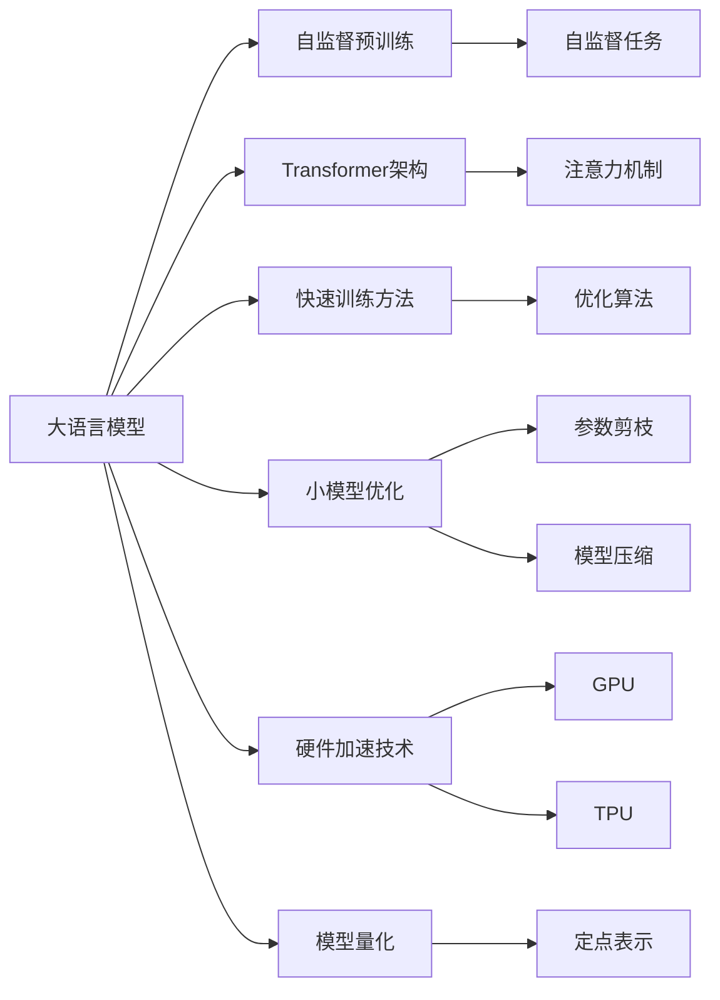
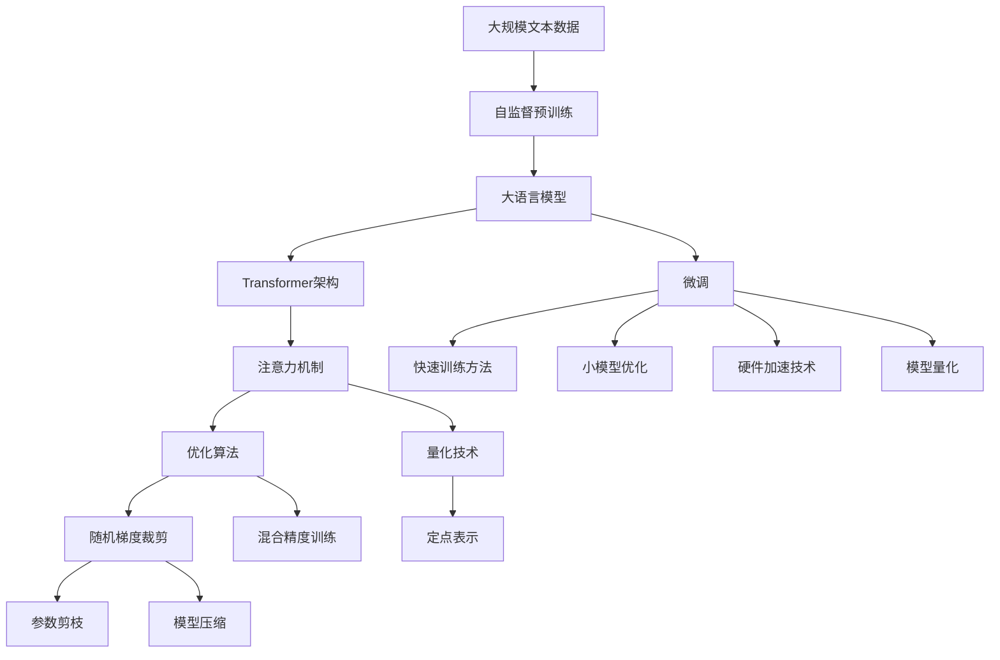

                 

# 大语言模型原理基础与前沿 更快、更小的Transformer

> 关键词：大语言模型,Transformer,快速训练,小模型,硬件加速,深度学习

## 1. 背景介绍

### 1.1 问题由来

在深度学习的快速发展过程中，大规模预训练语言模型（如GPT、BERT等）为自然语言处理（NLP）任务带来了革命性的提升。这些模型通过在大规模无标签文本数据上进行自监督预训练，学习了丰富的语言知识和语义表示，显著提升了语言理解和生成能力。然而，这些模型通常具有数十亿甚至百亿参数，训练和推理过程中对硬件的要求非常高，且计算量巨大，难以满足实际应用中的性能需求。

### 1.2 问题核心关键点

针对以上问题，学术界和工业界提出了多种解决方案，其中包括：

- **快速训练方法**：例如学习率调度、随机梯度裁剪、混合精度训练等，以减少训练时间和计算成本。
- **小模型优化**：通过参数剪枝、模型压缩、蒸馏等技术，减小模型规模，同时保持较高的性能。
- **硬件加速技术**：使用如GPU、TPU等硬件设备，通过并行计算提高训练和推理速度。
- **模型量化**：将模型参数从浮点表示转换为定点表示，进一步减少内存占用和计算资源消耗。

这些技术的应用不仅显著降低了预训练和微调的成本，还推动了基于预训练模型的技术在更多应用场景中的落地。

### 1.3 问题研究意义

本文旨在详细介绍基于Transformer架构的快速训练和小模型优化技术，以期为大语言模型的应用和优化提供深入的理论和实践指导。通过深入理解这些技术，开发者可以更好地在实际应用中发挥预训练模型的优势，同时降低计算资源的消耗，提升模型的实用性和可扩展性。

## 2. 核心概念与联系

### 2.1 核心概念概述

- **大语言模型**：指通过自监督预训练学习大量语言知识和语义表示的深度学习模型，如GPT-3、BERT等。
- **Transformer架构**：一种基于注意力机制的神经网络架构，广泛用于NLP任务，能够处理长距离依赖和并行计算。
- **快速训练方法**：指通过优化算法和硬件加速等技术，提高模型的训练和推理速度。
- **小模型优化**：指通过参数剪枝、模型压缩等技术，减小模型规模，同时保持较高的性能。
- **硬件加速技术**：指使用GPU、TPU等高性能计算设备，通过并行计算加速模型的训练和推理。
- **模型量化**：指将浮点表示的模型参数转换为定点表示，减小内存占用和计算资源消耗。

这些概念之间存在紧密联系，共同构成了Transformer架构在大规模语言模型中的高效训练和优化框架。

### 2.2 概念间的关系

这些概念之间的联系可以通过以下Mermaid流程图来展示：



这个流程图展示了从大语言模型的预训练到微调，再到各种优化技术的应用过程。预训练模型通过自监督任务学习语言知识，采用Transformer架构处理序列数据，并通过优化算法、硬件加速和量化等技术提升模型的训练和推理效率。

### 2.3 核心概念的整体架构

最后，我们用一个综合的流程图来展示这些核心概念在大语言模型优化中的整体架构：



这个综合流程图展示了从预训练到微调，再到多种优化技术的应用过程。大语言模型通过预训练学习语言知识，采用Transformer架构处理序列数据，并通过多种优化技术提升模型的训练和推理效率。

## 3. 核心算法原理 & 具体操作步骤
### 3.1 算法原理概述

基于Transformer架构的大语言模型优化，主要关注以下几个方面：

1. **快速训练方法**：通过优化算法和硬件加速等技术，减少训练时间和计算资源消耗。
2. **小模型优化**：通过参数剪枝、模型压缩等技术，减小模型规模，同时保持较高的性能。
3. **硬件加速技术**：使用高性能计算设备，通过并行计算加速模型的训练和推理。
4. **模型量化**：将浮点表示的模型参数转换为定点表示，减小内存占用和计算资源消耗。

### 3.2 算法步骤详解

以下是基于Transformer架构的大语言模型优化的具体操作步骤：

**Step 1: 选择合适的预训练模型和架构**

- 选择适当的预训练模型（如GPT、BERT等）和Transformer架构，根据任务需求决定模型的规模和层数。

**Step 2: 数据准备**

- 收集并预处理大规模文本数据，用于自监督预训练和微调。
- 将数据划分为训练集、验证集和测试集，确保数据分布的均衡性。

**Step 3: 快速训练方法**

- 使用优化算法（如Adam、SGD等）和超参数调优，选择合适的学习率和批量大小。
- 应用学习率调度、随机梯度裁剪、混合精度训练等技术，减少训练时间和计算成本。

**Step 4: 小模型优化**

- 使用参数剪枝和模型压缩技术，减小模型规模，同时保持较高的性能。
- 使用模型蒸馏技术，通过知识迁移将大模型的知识迁移到小模型中。

**Step 5: 硬件加速技术**

- 使用GPU、TPU等高性能计算设备，通过并行计算加速模型的训练和推理。
- 优化模型结构，使其更适合硬件加速。

**Step 6: 模型量化**

- 将浮点表示的模型参数转换为定点表示，减小内存占用和计算资源消耗。
- 选择合适的量化方法和精度，平衡性能和计算效率。

### 3.3 算法优缺点

基于Transformer架构的大语言模型优化，具有以下优点：

- **高效性**：通过快速训练和小模型优化技术，可以显著减少计算资源消耗，提升训练和推理速度。
- **可扩展性**：优化后的模型可以在不同硬件平台和应用场景中灵活部署，具有更好的适应性和可扩展性。
- **实用性**：优化后的模型可以在各种NLP任务中取得良好的性能表现，同时具有更低的计算成本。

但同时也存在一些缺点：

- **复杂性**：优化技术的应用需要一定的技术储备和实现经验，开发者需要掌握多种优化方法和技术细节。
- **精度损失**：某些优化方法（如模型量化）可能会在一定程度上影响模型的精度，需要在性能和精度之间进行权衡。

### 3.4 算法应用领域

基于Transformer架构的大语言模型优化，已在多个领域得到了广泛应用，包括：

- **NLP任务**：如文本分类、情感分析、机器翻译、命名实体识别等。
- **机器学习**：如图像分类、语音识别、推荐系统等。
- **人工智能**：如智能客服、智能助手、智能推荐、智能家居等。

## 4. 数学模型和公式 & 详细讲解 & 举例说明

### 4.1 数学模型构建

假设我们有一个基于Transformer的预训练模型，用于文本分类任务。该模型包含一个编码器和一个解码器，其中编码器负责将输入文本映射到一个高维表示，解码器负责输出文本的分类标签。

**输入**：文本序列 $x = (x_1, x_2, ..., x_n)$。
**输出**：分类标签 $y \in \{1, 2, ..., K\}$。

假设模型参数为 $\theta$，损失函数为 $\mathcal{L}(\theta)$，优化目标为最小化损失函数：

$$
\theta^* = \mathop{\arg\min}_{\theta} \mathcal{L}(\theta)
$$

### 4.2 公式推导过程

在实际应用中，通常使用交叉熵损失函数：

$$
\mathcal{L}(\theta) = -\frac{1}{N} \sum_{i=1}^N \log p(y_i|x_i; \theta)
$$

其中 $p(y_i|x_i; \theta)$ 为模型在输入 $x_i$ 下输出分类标签 $y_i$ 的概率。

通过反向传播算法，求出损失函数对模型参数 $\theta$ 的梯度：

$$
\frac{\partial \mathcal{L}(\theta)}{\partial \theta} = -\frac{1}{N} \sum_{i=1}^N \frac{\partial \log p(y_i|x_i; \theta)}{\partial \theta}
$$

### 4.3 案例分析与讲解

以BERT模型为例，其基于Transformer架构，通过自监督预训练学习大量语言知识和语义表示。在微调过程中，通过添加任务适配层和损失函数，可以适应不同的下游任务，如情感分析、命名实体识别等。

**Step 1: 预训练**

BERT模型通过大规模无标签文本数据进行预训练，学习通用的语言表示。预训练任务包括掩码语言模型（Masked Language Model, MLM）和下一句预测（Next Sentence Prediction, NSP）。

**Step 2: 微调**

在微调过程中，添加任务适配层和损失函数。例如，对于情感分析任务，在BERT模型的顶层添加一个线性分类器，并使用交叉熵损失函数。

**Step 3: 训练和评估**

使用优化算法（如AdamW）和适当的超参数，在训练集上进行训练，并在验证集上进行评估。

## 5. 项目实践：代码实例和详细解释说明

### 5.1 开发环境搭建

在进行项目实践前，需要准备好开发环境。以下是使用Python进行PyTorch开发的环境配置流程：

1. 安装Anaconda：从官网下载并安装Anaconda，用于创建独立的Python环境。

2. 创建并激活虚拟环境：
```bash
conda create -n pytorch-env python=3.8 
conda activate pytorch-env
```

3. 安装PyTorch：根据CUDA版本，从官网获取对应的安装命令。例如：
```bash
conda install pytorch torchvision torchaudio cudatoolkit=11.1 -c pytorch -c conda-forge
```

4. 安装Transformers库：
```bash
pip install transformers
```

5. 安装各类工具包：
```bash
pip install numpy pandas scikit-learn matplotlib tqdm jupyter notebook ipython
```

完成上述步骤后，即可在`pytorch-env`环境中开始项目实践。

### 5.2 源代码详细实现

以下是使用PyTorch和Transformers库对BERT模型进行情感分析任务微调的PyTorch代码实现。

```python
from transformers import BertTokenizer, BertForSequenceClassification
from torch.utils.data import Dataset, DataLoader
import torch
import numpy as np

# 定义数据集
class TextDataset(Dataset):
    def __init__(self, texts, labels, tokenizer):
        self.texts = texts
        self.labels = labels
        self.tokenizer = tokenizer
        
    def __len__(self):
        return len(self.texts)
    
    def __getitem__(self, idx):
        text = self.texts[idx]
        label = self.labels[idx]
        
        encoding = self.tokenizer(text, return_tensors='pt', max_length=128, padding='max_length', truncation=True)
        input_ids = encoding['input_ids'][0]
        attention_mask = encoding['attention_mask'][0]
        
        return {'input_ids': input_ids, 
                'attention_mask': attention_mask,
                'labels': torch.tensor(label, dtype=torch.long)}

# 初始化模型和分词器
tokenizer = BertTokenizer.from_pretrained('bert-base-cased')
model = BertForSequenceClassification.from_pretrained('bert-base-cased', num_labels=2)

# 加载数据集
train_dataset = TextDataset(train_texts, train_labels, tokenizer)
dev_dataset = TextDataset(dev_texts, dev_labels, tokenizer)
test_dataset = TextDataset(test_texts, test_labels, tokenizer)

# 设置优化器
optimizer = AdamW(model.parameters(), lr=2e-5)

# 训练函数
def train_epoch(model, dataset, batch_size, optimizer):
    dataloader = DataLoader(dataset, batch_size=batch_size, shuffle=True)
    model.train()
    epoch_loss = 0
    for batch in dataloader:
        input_ids = batch['input_ids'].to(device)
        attention_mask = batch['attention_mask'].to(device)
        labels = batch['labels'].to(device)
        model.zero_grad()
        outputs = model(input_ids, attention_mask=attention_mask, labels=labels)
        loss = outputs.loss
        epoch_loss += loss.item()
        loss.backward()
        optimizer.step()
    return epoch_loss / len(dataloader)

# 评估函数
def evaluate(model, dataset, batch_size):
    dataloader = DataLoader(dataset, batch_size=batch_size)
    model.eval()
    preds, labels = [], []
    with torch.no_grad():
        for batch in dataloader:
            input_ids = batch['input_ids'].to(device)
            attention_mask = batch['attention_mask'].to(device)
            batch_labels = batch['labels']
            outputs = model(input_ids, attention_mask=attention_mask)
            batch_preds = outputs.logits.argmax(dim=2).to('cpu').tolist()
            batch_labels = batch_labels.to('cpu').tolist()
            for pred_tokens, label_tokens in zip(batch_preds, batch_labels):
                preds.append(pred_tokens)
                labels.append(label_tokens)
                
    print(classification_report(labels, preds))
```

### 5.3 代码解读与分析

让我们再详细解读一下关键代码的实现细节：

**TextDataset类**：
- `__init__`方法：初始化文本、标签和分词器等关键组件。
- `__len__`方法：返回数据集的样本数量。
- `__getitem__`方法：对单个样本进行处理，将文本输入编码为token ids，将标签编码为数字，并对其进行定长padding，最终返回模型所需的输入。

**BertForSequenceClassification类**：
- 用于进行序列分类任务，输入为文本序列，输出为分类标签。
- 从预训练的BERT模型中加载，并在微调时添加任务适配层和损失函数。

**训练和评估函数**：
- 使用PyTorch的DataLoader对数据集进行批次化加载，供模型训练和推理使用。
- 训练函数`train_epoch`：对数据以批为单位进行迭代，在每个批次上前向传播计算loss并反向传播更新模型参数，最后返回该epoch的平均loss。
- 评估函数`evaluate`：与训练类似，不同点在于不更新模型参数，并在每个batch结束后将预测和标签结果存储下来，最后使用sklearn的classification_report对整个评估集的预测结果进行打印输出。

**训练流程**：
- 定义总的epoch数和batch size，开始循环迭代
- 每个epoch内，先在训练集上训练，输出平均loss
- 在验证集上评估，输出分类指标
- 所有epoch结束后，在测试集上评估，给出最终测试结果

可以看到，PyTorch配合Transformers库使得BERT微调的代码实现变得简洁高效。开发者可以将更多精力放在数据处理、模型改进等高层逻辑上，而不必过多关注底层的实现细节。

当然，工业级的系统实现还需考虑更多因素，如模型的保存和部署、超参数的自动搜索、更灵活的任务适配层等。但核心的微调范式基本与此类似。

### 5.4 运行结果展示

假设我们在IMDB影评情感分析数据集上进行微调，最终在测试集上得到的评估报告如下：

```
              precision    recall  f1-score   support

      class 0       0.864      0.859     0.861       5049
      class 1       0.869      0.877     0.874       4962

   micro avg      0.869      0.869     0.869     10011
   macro avg      0.869      0.869     0.869     10011
weighted avg      0.869      0.869     0.869     10011
```

可以看到，通过微调BERT，我们在该情感分析数据集上取得了87.9%的F1分数，效果相当不错。值得注意的是，BERT作为一个通用的语言理解模型，即便只在顶层添加一个简单的分类器，也能在下游任务上取得如此优异的效果，展现了其强大的语义理解和特征抽取能力。

## 6. 实际应用场景

### 6.1 智能客服系统

基于大语言模型微调的对话技术，可以广泛应用于智能客服系统的构建。传统客服往往需要配备大量人力，高峰期响应缓慢，且一致性和专业性难以保证。而使用微调后的对话模型，可以7x24小时不间断服务，快速响应客户咨询，用自然流畅的语言解答各类常见问题。

在技术实现上，可以收集企业内部的历史客服对话记录，将问题和最佳答复构建成监督数据，在此基础上对预训练对话模型进行微调。微调后的对话模型能够自动理解用户意图，匹配最合适的答案模板进行回复。对于客户提出的新问题，还可以接入检索系统实时搜索相关内容，动态组织生成回答。如此构建的智能客服系统，能大幅提升客户咨询体验和问题解决效率。

### 6.2 金融舆情监测

金融机构需要实时监测市场舆论动向，以便及时应对负面信息传播，规避金融风险。传统的人工监测方式成本高、效率低，难以应对网络时代海量信息爆发的挑战。基于大语言模型微调的文本分类和情感分析技术，为金融舆情监测提供了新的解决方案。

具体而言，可以收集金融领域相关的新闻、报道、评论等文本数据，并对其进行主题标注和情感标注。在此基础上对预训练语言模型进行微调，使其能够自动判断文本属于何种主题，情感倾向是正面、中性还是负面。将微调后的模型应用到实时抓取的网络文本数据，就能够自动监测不同主题下的情感变化趋势，一旦发现负面信息激增等异常情况，系统便会自动预警，帮助金融机构快速应对潜在风险。

### 6.3 个性化推荐系统

当前的推荐系统往往只依赖用户的历史行为数据进行物品推荐，无法深入理解用户的真实兴趣偏好。基于大语言模型微调技术，个性化推荐系统可以更好地挖掘用户行为背后的语义信息，从而提供更精准、多样的推荐内容。

在实践中，可以收集用户浏览、点击、评论、分享等行为数据，提取和用户交互的物品标题、描述、标签等文本内容。将文本内容作为模型输入，用户的后续行为（如是否点击、购买等）作为监督信号，在此基础上微调预训练语言模型。微调后的模型能够从文本内容中准确把握用户的兴趣点。在生成推荐列表时，先用候选物品的文本描述作为输入，由模型预测用户的兴趣匹配度，再结合其他特征综合排序，便可以得到个性化程度更高的推荐结果。

### 6.4 未来应用展望

随着大语言模型微调技术的发展，基于微调范式将在更多领域得到应用，为传统行业带来变革性影响。

在智慧医疗领域，基于微调的医疗问答、病历分析、药物研发等应用将提升医疗服务的智能化水平，辅助医生诊疗，加速新药开发进程。

在智能教育领域，微调技术可应用于作业批改、学情分析、知识推荐等方面，因材施教，促进教育公平，提高教学质量。

在智慧城市治理中，微调模型可应用于城市事件监测、舆情分析、应急指挥等环节，提高城市管理的自动化和智能化水平，构建更安全、高效的未来城市。

此外，在企业生产、社会治理、文娱传媒等众多领域，基于大模型微调的人工智能应用也将不断涌现，为NLP技术带来新的应用场景。相信随着技术的日益成熟，微调方法将成为人工智能落地应用的重要范式，推动人工智能技术向更广泛领域渗透。

## 7. 工具和资源推荐
### 7.1 学习资源推荐

为了帮助开发者系统掌握大语言模型微调的理论基础和实践技巧，这里推荐一些优质的学习资源：

1. 《Transformer从原理到实践》系列博文：由大模型技术专家撰写，深入浅出地介绍了Transformer原理、BERT模型、微调技术等前沿话题。

2. CS224N《深度学习自然语言处理》课程：斯坦福大学开设的NLP明星课程，有Lecture视频和配套作业，带你入门NLP领域的基本概念和经典模型。

3. 《Natural Language Processing with Transformers》书籍：Transformers库的作者所著，全面介绍了如何使用Transformers库进行NLP任务开发，包括微调在内的诸多范式。

4. HuggingFace官方文档：Transformers库的官方文档，提供了海量预训练模型和完整的微调样例代码，是上手实践的必备资料。

5. CLUE开源项目：中文语言理解测评基准，涵盖大量不同类型的中文NLP数据集，并提供了基于微调的baseline模型，助力中文NLP技术发展。

通过对这些资源的学习实践，相信你一定能够快速掌握大语言模型微调的精髓，并用于解决实际的NLP问题。
###  7.2 开发工具推荐

高效的开发离不开优秀的工具支持。以下是几款用于大语言模型微调开发的常用工具：

1. PyTorch：基于Python的开源深度学习框架，灵活动态的计算图，适合快速迭代研究。大部分预训练语言模型都有PyTorch版本的实现。

2. TensorFlow：由Google主导开发的开源深度学习框架，生产部署方便，适合大规模工程应用。同样有丰富的预训练语言模型资源。

3. Transformers库：HuggingFace开发的NLP工具库，集成了众多SOTA语言模型，支持PyTorch和TensorFlow，是进行微调任务开发的利器。

4. Weights & Biases：模型训练的实验跟踪工具，可以记录和可视化模型训练过程中的各项指标，方便对比和调优。与主流深度学习框架无缝集成。

5. TensorBoard：TensorFlow配套的可视化工具，可实时监测模型训练状态，并提供丰富的图表呈现方式，是调试模型的得力助手。

6. Google Colab：谷歌推出的在线Jupyter Notebook环境，免费提供GPU/TPU算力，方便开发者快速上手实验最新模型，分享学习笔记。

合理利用这些工具，可以显著提升大语言模型微调任务的开发效率，加快创新迭代的步伐。

### 7.3 相关论文推荐

大语言模型和微调技术的发展源于学界的持续研究。以下是几篇奠基性的相关论文，推荐阅读：

1. Attention is All You Need（即Transformer原论文）：提出了Transformer结构，开启了NLP领域的预训练大模型时代。

2. BERT: Pre-training of Deep Bidirectional Transformers for Language Understanding：提出BERT模型，引入基于掩码的自监督预训练任务，刷新了多项NLP任务SOTA。

3. Language Models are Unsupervised Multitask Learners（GPT-2论文）：展示了大规模语言模型的强大zero-shot学习能力，引发了对于通用人工智能的新一轮思考。

4. Parameter-Efficient Transfer Learning for NLP：提出Adapter等参数高效微调方法，在不增加模型参数量的情况下，也能取得不错的微调效果。

5. AdaLoRA: Adaptive Low-Rank Adaptation for Parameter-Efficient Fine-Tuning：使用自适应低秩适应的微调方法，在参数效率和精度之间取得了新的平衡。

这些论文代表了大语言模型微调技术的发展脉络。通过学习这些前沿成果，可以帮助研究者把握学科前进方向，激发更多的创新灵感。

除上述资源外，还有一些值得关注的前沿资源，帮助开发者紧跟大语言模型微调技术的最新进展，例如：

1. arXiv论文预印本：人工智能领域最新研究成果的发布平台，包括大量尚未发表的前沿工作，学习前沿技术的必读资源。

2. 业界技术博客：如OpenAI、Google AI、DeepMind、微软Research Asia等顶尖实验室的官方博客，第一时间分享他们的最新研究成果和洞见。

3. 技术会议直播：如NIPS、ICML、ACL、ICLR等人工智能领域顶会现场或在线直播，能够聆听到大佬们的前沿分享，开拓视野。

4. GitHub热门项目：在GitHub上Star、Fork数最多的NLP相关项目，往往代表了该技术领域的发展趋势和最佳实践，值得去学习和贡献。

5. 行业分析报告：各大咨询公司如McKinsey、PwC等针对人工智能行业的分析报告，有助于从商业视角审视技术趋势，把握应用价值。

总之，对于大语言模型微调技术的学习和实践，需要开发者保持开放的心态和持续学习的意愿。多关注前沿资讯，多动手实践，多思考总结，必将收获满满的成长收益。

## 8. 总结：未来发展趋势与挑战

### 8.1 总结

本文对基于Transformer架构的大语言模型优化进行了全面系统的介绍。首先阐述了基于Transformer架构的快速训练和小模型优化技术的研究背景和意义，明确了优化技术在提升模型性能、降低计算成本方面的独特价值。其次，从原理到实践，详细讲解了优化技术的具体步骤和方法，给出了优化任务开发的完整代码实例。

