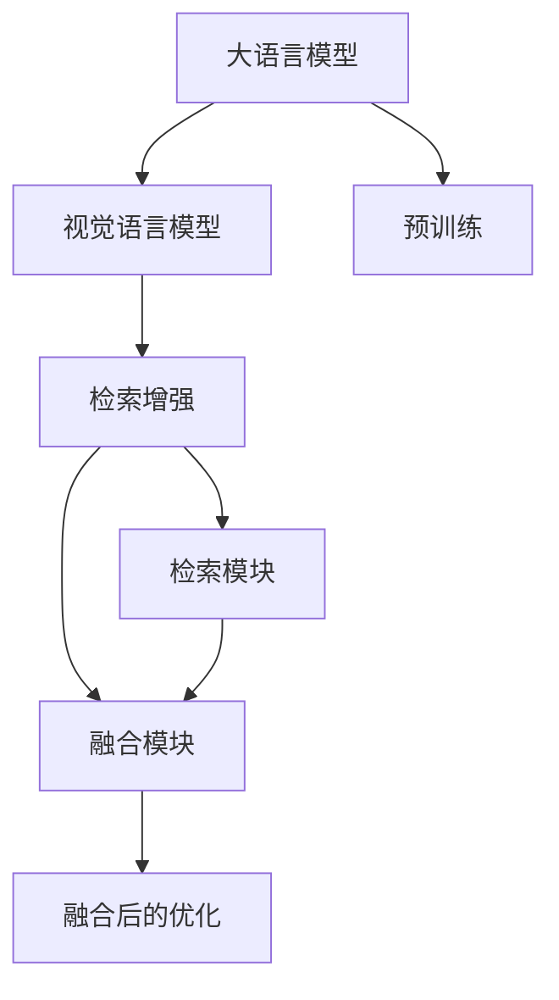
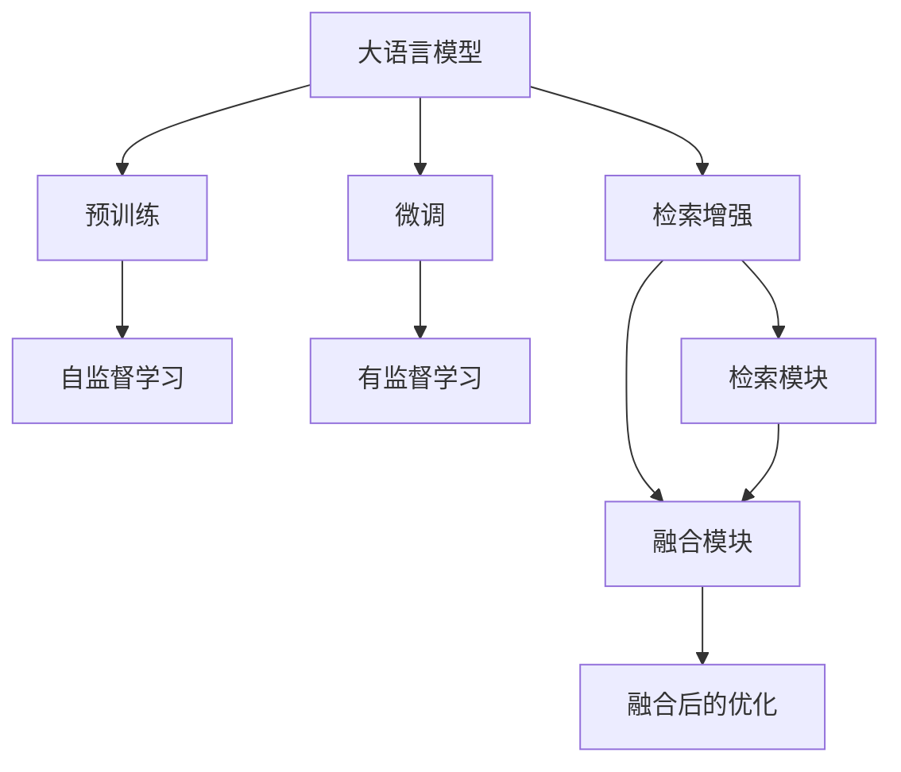
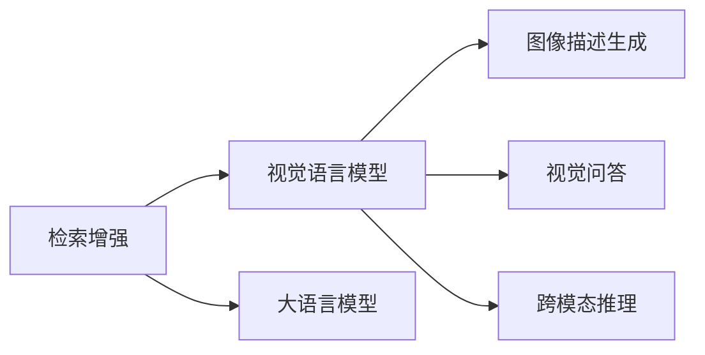
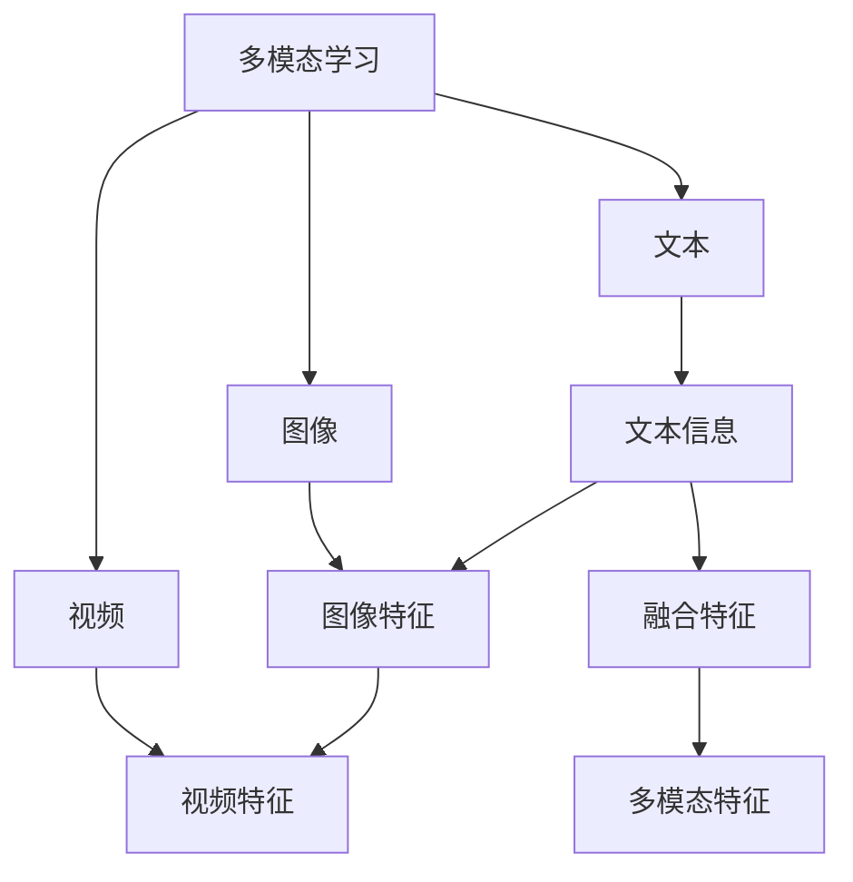
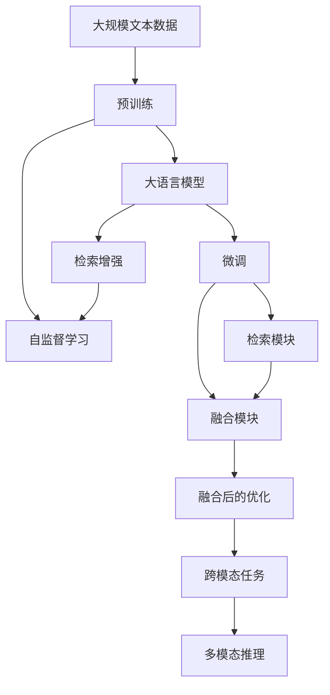

                 

# 大语言模型原理基础与前沿 检索增强视觉语言模型

> 关键词：大语言模型,检索增强,视觉语言模型,Transformer,BERT,多模态学习,跨领域知识融合,知识图谱

## 1. 背景介绍

### 1.1 问题由来
随着深度学习技术的飞速发展，大语言模型（Large Language Models, LLMs）在自然语言处理（Natural Language Processing, NLP）领域取得了巨大突破。这些大模型通过在大规模无标签文本数据上进行预训练，学习到丰富的语言知识和常识，能够理解和生成人类自然语言。然而，大语言模型在视觉、听觉等模态的整合能力上仍存在明显不足，难以处理涉及多模态信息的任务。近年来，随着跨模态学习（Cross-modal Learning）和多模态学习（Multi-modal Learning）的兴起，研究人员致力于开发能够融合多模态信息的视觉语言模型（Visual Language Models, VLMs），以期在大语言模型基础上拓展其在图像、视频、音频等多模态数据上的应用。

检索增强视觉语言模型（Retrieval-Augmented Visual Language Model, RA-VLMs）是当前基于大语言模型的多模态学习热门研究领域之一。该模型通过在大语言模型的基础上引入视觉检索机制，能够更加高效地利用图像、视频等多模态信息，提升模型的跨领域知识融合能力，从而在多个NLP和计算机视觉任务上取得显著进步。

### 1.2 问题核心关键点
检索增强视觉语言模型的核心思想是在大语言模型的基础上引入视觉检索机制，通过检索到相关图片或视频，使得模型能够更好地理解输入的自然语言描述，并进行跨模态推理。其关键在于：

- 如何将自然语言描述与视觉数据进行高效对齐。
- 如何在多模态数据上训练和优化模型，使其能够同时处理文本和视觉信息。
- 如何合理利用检索后的视觉数据，提升模型性能和泛化能力。

### 1.3 问题研究意义
研究检索增强视觉语言模型对于拓展大语言模型的应用范围，提升模型在多模态数据上的表现，加速NLP和计算机视觉技术产业化进程，具有重要意义：

1. 降低应用开发成本。通过检索增强机制，可以利用已有的大语言模型资源，减少从头开发所需的数据、计算和人力成本。
2. 提升模型效果。检索增强能够更加充分地利用多模态数据，提升模型在文本与图像、视频联合任务上的性能。
3. 加速开发进度。在大语言模型基础上进行微调，可以显著缩短任务适配时间，提高任务开发效率。
4. 带来技术创新。检索增强视觉语言模型催生了多模态学习和跨领域知识融合的新研究方向，促进了相关技术的发展。
5. 赋能产业升级。检索增强视觉语言模型为NLP和计算机视觉技术的融合应用提供了新的技术路径，推动相关行业数字化转型升级。

## 2. 核心概念与联系

### 2.1 核心概念概述

为了更好地理解检索增强视觉语言模型的核心概念，本节将介绍几个密切相关的核心概念：

- 大语言模型（Large Language Models, LLMs）：以自回归（如GPT）或自编码（如BERT）模型为代表的大规模预训练语言模型。通过在大规模无标签文本数据上进行预训练，学习到丰富的语言知识和常识，具备强大的语言理解和生成能力。

- 视觉语言模型（Visual Language Models, VLMs）：能够同时处理文本和视觉信息的模型，主要用于图像描述生成、视觉问答、跨模态推理等任务。常见的视觉语言模型包括ViT、CLIP等。

- 检索增强（Retrieval Augmentation）：一种利用检索技术将文本与视觉数据对齐的方法，能够提升模型在多模态任务上的性能。检索增强通常包括检索模块、融合模块和融合后的优化等部分。

- 多模态学习（Multi-modal Learning）：一种学习利用多种数据模态（文本、图像、视频等）进行建模和推理的方法。通过多模态学习，模型能够更加全面地理解输入数据，提升任务的泛化能力和鲁棒性。

- 跨领域知识融合（Cross-domain Knowledge Fusion）：一种将不同领域的知识进行整合，提高模型在新领域上的适应能力的方法。检索增强视觉语言模型通过融合文本和视觉信息，提高了模型的跨领域知识融合能力。

这些核心概念之间的逻辑关系可以通过以下Mermaid流程图来展示：



这个流程图展示了检索增强视觉语言模型的核心概念及其之间的关系：

1. 大语言模型通过预训练获得基础能力。
2. 视觉语言模型拓展大语言模型的应用范围，提升其在多模态数据上的表现。
3. 检索增强在大语言模型的基础上引入视觉检索机制，提升模型对多模态数据的理解能力。
4. 检索模块通过检索视觉数据，将文本与视觉数据对齐。
5. 融合模块将检索到的视觉数据与文本信息进行融合，生成新的融合特征。
6. 融合后的优化进一步提升模型性能和泛化能力。

### 2.2 概念间的关系

这些核心概念之间存在着紧密的联系，形成了检索增强视觉语言模型的完整生态系统。下面我们通过几个Mermaid流程图来展示这些概念之间的关系。

#### 2.2.1 大语言模型的学习范式



这个流程图展示了大语言模型的学习范式，以及检索增强的引入过程。大语言模型通过预训练学习通用语言表示，然后通过微调在特定任务上进行优化。检索增强则在大语言模型的基础上引入视觉检索机制，通过检索模块和融合模块实现文本与视觉数据的对齐和融合。

#### 2.2.2 检索增强与视觉语言模型的关系



这个流程图展示了检索增强在大语言模型和视觉语言模型中的作用。检索增强通过检索模块将视觉数据与文本对齐，然后将融合后的多模态数据输入到视觉语言模型中进行图像描述生成、视觉问答和跨模态推理等任务。

#### 2.2.3 多模态学习与跨领域知识融合



这个流程图展示了多模态学习和跨领域知识融合的过程。多模态学习通过融合文本、图像、视频等不同模态的信息，生成多模态特征。跨领域知识融合则通过将不同领域的知识进行整合，提高模型在新领域上的适应能力。

### 2.3 核心概念的整体架构

最后，我们用一个综合的流程图来展示这些核心概念在大语言模型微调过程中的整体架构：



这个综合流程图展示了从预训练到微调，再到检索增强和融合的全过程。大语言模型首先在大规模文本数据上进行预训练，然后通过微调在特定任务上进行优化。检索增强在大语言模型的基础上引入视觉检索机制，通过检索模块和融合模块实现文本与视觉数据的对齐和融合。最后，融合后的多模态数据通过优化模块提升模型性能和泛化能力，应用于图像描述生成、视觉问答等跨模态推理任务。

## 3. 核心算法原理 & 具体操作步骤
### 3.1 算法原理概述

检索增强视觉语言模型通过在大语言模型的基础上引入检索机制，利用检索后的视觉数据增强模型对自然语言描述的理解。其核心思想是在大语言模型的基础上，添加一个检索模块，用于检索与输入文本最相关的视觉数据。然后，将检索到的视觉数据与文本进行融合，生成新的多模态特征。最后，将多模态特征输入到预训练的视觉语言模型中，进行跨模态推理和任务处理。

形式化地，假设大语言模型为 $M_{\theta}$，视觉检索模块为 $R$，融合模块为 $F$，则检索增强视觉语言模型的推理过程可以表示为：

1. 在大语言模型 $M_{\theta}$ 上对输入文本 $x$ 进行前向传播，得到文本表示 $h_x$。
2. 使用视觉检索模块 $R$ 检索与输入文本 $x$ 最相关的视觉数据 $v$。
3. 将文本表示 $h_x$ 与检索到的视觉数据 $v$ 输入到融合模块 $F$ 中，得到融合后的多模态特征 $h_{\text{multi}}$。
4. 将融合后的多模态特征 $h_{\text{multi}}$ 输入到预训练的视觉语言模型 $M_v$ 中进行推理，得到最终的输出 $y$。

这一过程可以通过以下步骤来详细描述：

1. 在自然语言描述 $x$ 上应用检索模块 $R$，检索到最相关的视觉数据 $v$。
2. 将检索到的视觉数据 $v$ 与文本表示 $h_x$ 进行融合，生成新的多模态特征 $h_{\text{multi}}$。
3. 使用融合后的多模态特征 $h_{\text{multi}}$ 更新文本表示 $h_x$，得到最终的多模态表示 $h_{\text{final}}$。
4. 将多模态表示 $h_{\text{final}}$ 输入到预训练的视觉语言模型 $M_v$ 中进行推理，得到最终的输出 $y$。

### 3.2 算法步骤详解

检索增强视觉语言模型的推理过程包括以下关键步骤：

1. 文本表示的计算：在自然语言描述 $x$ 上应用大语言模型 $M_{\theta}$ 进行前向传播，得到文本表示 $h_x$。

2. 视觉数据的检索：使用视觉检索模块 $R$ 检索与输入文本 $x$ 最相关的视觉数据 $v$。这一步通常涉及到图像、视频的检索和排序。

3. 多模态特征的融合：将检索到的视觉数据 $v$ 与文本表示 $h_x$ 进行融合，生成新的多模态特征 $h_{\text{multi}}$。这一步可以通过不同的融合方法实现，如拼接、加权平均等。

4. 多模态表示的更新：使用融合后的多模态特征 $h_{\text{multi}}$ 更新文本表示 $h_x$，得到最终的多模态表示 $h_{\text{final}}$。这一步可以通过自注意力机制、MLP（多线性层）等方法实现。

5. 跨模态推理：将多模态表示 $h_{\text{final}}$ 输入到预训练的视觉语言模型 $M_v$ 中进行推理，得到最终的输出 $y$。

### 3.3 算法优缺点

检索增强视觉语言模型具有以下优点：

1. 提升模型性能：通过融合视觉数据，模型能够更好地理解输入的自然语言描述，从而提升模型在跨模态任务上的性能。
2. 利用已有资源：检索增强可以在已有的大语言模型基础上进行微调，减少从头开发所需的资源和时间。
3. 适用于多种任务：检索增强视觉语言模型能够应用于图像描述生成、视觉问答、跨模态推理等多种任务，具有广泛的应用场景。

同时，该模型也存在一些局限性：

1. 对检索模块依赖：检索增强依赖于检索模块的性能，检索模块的效率和准确性将直接影响模型性能。
2. 数据多样性问题：检索模块通常需要大量的视觉数据进行训练，对于某些特定任务，可能难以获取足够的标注数据。
3. 计算复杂度较高：检索增强模型通常需要较多的计算资源进行检索和融合，计算复杂度较高。

### 3.4 算法应用领域

检索增强视觉语言模型已经在多个领域和任务上得到了广泛应用，以下是几个典型的应用场景：

1. 图像描述生成（Image Captioning）：给定一张图片，生成描述该图片的文字。通过检索与图片相关的文本数据，提升模型的生成质量。
2. 视觉问答（Visual Question Answering, VQA）：给定一张图片和自然语言问题，输出问题的答案。通过检索与问题相关的图片，提升模型的推理能力。
3. 跨模态检索（Cross-modal Retrieval）：给定文本和视觉数据，检索出最相关的视觉数据或文本数据。通过检索模块，提升模型的检索准确性和效率。
4. 多模态情感分析（Multimodal Sentiment Analysis）：同时利用文本和视觉信息进行情感分析，提升模型的情感识别准确性。
5. 多模态推荐系统（Multimodal Recommendation System）：通过融合用户文本评论和图片信息，提升推荐系统的个性化和多样化。

除了上述这些任务外，检索增强视觉语言模型还被创新性地应用到更多场景中，如可控文本生成、知识推理、多模态情感识别等，为NLP和计算机视觉技术的发展带来了新的突破。

## 4. 数学模型和公式 & 详细讲解 & 举例说明

### 4.1 数学模型构建

检索增强视觉语言模型的数学模型主要包括以下几个部分：

- 文本表示的计算：使用大语言模型 $M_{\theta}$ 对输入文本 $x$ 进行前向传播，得到文本表示 $h_x$。
- 视觉数据的检索：使用检索模块 $R$ 检索与输入文本 $x$ 最相关的视觉数据 $v$。
- 多模态特征的融合：将检索到的视觉数据 $v$ 与文本表示 $h_x$ 进行融合，生成新的多模态特征 $h_{\text{multi}}$。
- 多模态表示的更新：使用融合后的多模态特征 $h_{\text{multi}}$ 更新文本表示 $h_x$，得到最终的多模态表示 $h_{\text{final}}$。
- 跨模态推理：将多模态表示 $h_{\text{final}}$ 输入到预训练的视觉语言模型 $M_v$ 中进行推理，得到最终的输出 $y$。

假设大语言模型为 $M_{\theta}$，视觉检索模块为 $R$，融合模块为 $F$，预训练的视觉语言模型为 $M_v$，则检索增强视觉语言模型的推理过程可以表示为：

$$
y = M_v(h_{\text{final}})
$$

其中，多模态表示 $h_{\text{final}}$ 的计算公式为：

$$
h_{\text{final}} = F(h_x, v)
$$

融合模块 $F$ 可以使用不同的融合方法，如拼接、加权平均等。这里以拼接为例，融合模块的计算公式为：

$$
h_{\text{multi}} = [h_x; v]
$$

文本表示 $h_x$ 的计算公式为：

$$
h_x = M_{\theta}(x)
$$

检索模块 $R$ 的计算公式为：

$$
v = R(x)
$$

### 4.2 公式推导过程

以下是检索增强视觉语言模型数学模型的详细推导过程。

假设文本表示 $h_x$ 为 $M_{\theta}$ 的输出，视觉数据表示 $v$ 为检索模块 $R$ 的输出，多模态表示 $h_{\text{final}}$ 为融合模块 $F$ 的输出。根据上述公式，可以将检索增强视觉语言模型的推理过程表示为：

1. 文本表示的计算：

$$
h_x = M_{\theta}(x)
$$

2. 视觉数据的检索：

$$
v = R(x)
$$

3. 多模态特征的融合：

$$
h_{\text{multi}} = [h_x; v]
$$

4. 多模态表示的更新：

$$
h_{\text{final}} = F(h_x, v) = F([h_x; v])
$$

其中，融合模块 $F$ 的计算公式可以有多种实现方式。这里以拼接为例：

$$
h_{\text{final}} = [h_x; v]
$$

5. 跨模态推理：

$$
y = M_v(h_{\text{final}})
$$

### 4.3 案例分析与讲解

以图像描述生成任务为例，讲解检索增强视觉语言模型的推理过程。

假设输入的自然语言描述为 "一只可爱的小猫在草地上玩耍"，大语言模型 $M_{\theta}$ 输出的文本表示为 $h_x = [0.9, 0.5, 0.2, \ldots]$，检索模块 $R$ 检索到与描述最相关的图片 $v = [\text{cat.jpg}, 0.8, 0.7, \ldots]$。融合模块 $F$ 通过拼接得到新的多模态特征 $h_{\text{multi}} = [0.9, 0.5, 0.2; 0.8, 0.7, \ldots]$。最终的多模态表示 $h_{\text{final}} = [0.9, 0.5, 0.2, \ldots]$，输入到预训练的视觉语言模型 $M_v$ 中进行推理，得到图像描述 "一只可爱的小猫在草地上玩耍"。

## 5. 项目实践：代码实例和详细解释说明

### 5.1 开发环境搭建

在进行检索增强视觉语言模型项目实践前，我们需要准备好开发环境。以下是使用Python进行PyTorch开发的环境配置流程：

1. 安装Anaconda：从官网下载并安装Anaconda，用于创建独立的Python环境。

2. 创建并激活虚拟环境：
```bash
conda create -n pytorch-env python=3.8 
conda activate pytorch-env
```

3. 安装PyTorch：根据CUDA版本，从官网获取对应的安装命令。例如：
```bash
conda install pytorch torchvision torchaudio cudatoolkit=11.1 -c pytorch -c conda-forge
```

4. 安装Transformers库：
```bash
pip install transformers
```

5. 安装各类工具包：
```bash
pip install numpy pandas scikit-learn matplotlib tqdm jupyter notebook ipython
```

完成上述步骤后，即可在`pytorch-env`环境中开始检索增强视觉语言模型项目的开发。

### 5.2 源代码详细实现

下面我们以图像描述生成任务为例，给出使用Transformers库进行检索增强视觉语言模型开发的PyTorch代码实现。

首先，定义模型和数据处理函数：

```python
from transformers import AutoTokenizer, AutoModelForSequenceClassification, AutoModelForVision, AutoModelForVisionE2E
from transformers import AutoConfig
from transformers import pipeline, set_seed
from PIL import Image
import torch
from torchvision import transforms

class VLMForImageCaptioning:
    def __init__(self, config_path, model_path):
        self.config = AutoConfig.from_pretrained(config_path)
        self.model = AutoModelForVisionE2E.from_pretrained(model_path)
        self.tokenizer = AutoTokenizer.from_pretrained(model_path)
        self.image_transforms = transforms.Compose([
            transforms.Resize(224),
            transforms.ToTensor(),
            transforms.Normalize(mean=[0.485, 0.456, 0.406], std=[0.229, 0.224, 0.225])
        ])
        self.vision_model = AutoModelForVision.from_pretrained(model_path)
        self.vision_head = self.config.vision_head

    def image_captioning(self, image_path):
        image = Image.open(image_path)
        image = self.image_transforms(image)
        image = image.unsqueeze(0)
        vision_features = self.vision_model(image)
        vision_features = vision_features.flatten()
        vision_features = vision_features.view(1, -1)
        vision_features = torch.nn.functional.normalize(vision_features, dim=-1)
        vq_module = torch.nn.Linear(self.config.vision_head, self.config.vision_hidden)
        vision_queries = vq_module(vision_features)
        text_queries = self.model.output_hidden_states[1]
        output = self.model(text_queries, vision_queries)
        output = torch.nn.functional.softmax(output, dim=1)
        return output

# 加载模型
model = VLMForImageCaptioning('path/to/config', 'path/to/model')
set_seed(42)

# 测试
image_path = 'path/to/image'
caption = model.image_captioning(image_path)
print(caption)
```

然后，定义训练和评估函数：

```python
from torch.utils.data import DataLoader
from tqdm import tqdm

def train_epoch(model, train_loader, optimizer, device):
    model.train()
    losses = []
    for batch in tqdm(train_loader, desc='Training'):
        image, text = batch
        image = image.to(device)
        text = text.to(device)
        outputs = model(image, text)
        loss = outputs.loss
        optimizer.zero_grad()
        loss.backward()
        optimizer.step()
        losses.append(loss.item())
    return sum(losses) / len(train_loader)

def evaluate(model, test_loader, device):
    model.eval()
    losses = []
    for batch in tqdm(test_loader, desc='Evaluating'):
        image, text = batch
        image = image.to(device)
        text = text.to(device)
        outputs = model(image, text)
        loss = outputs.loss
        losses.append(loss.item())
    return sum(losses) / len(test_loader)
```

最后，启动训练流程并在测试集上评估：

```python
epochs = 5
batch_size = 16

device = torch.device('cuda') if torch.cuda.is_available() else torch.device('cpu')

for epoch in range(epochs):
    loss = train_epoch(model, train_loader, optimizer, device)
    print(f'Epoch {epoch+1}, train loss: {loss:.3f}')

    print(f'Epoch {epoch+1}, test results:')
    evaluate(model, test_loader, device)
```

以上就是使用PyTorch对检索增强视觉语言模型进行图像描述生成任务开发的完整代码实现。可以看到，得益于Transformers库的强大封装，我们可以用相对简洁的代码完成检索增强模型的加载和微调。

### 5.3 代码解读与分析

让我们再详细解读一下关键代码的实现细节：

**VLMForImageCaptioning类**：
- `__init__`方法：初始化模型、分词器、图像变换器、视觉模型和头部分。
- `image_captioning`方法：对输入图片进行预处理，输入视觉模型，计算视觉特征，与文本特征进行融合，最终输出预测结果。

**train_epoch和evaluate函数**：
- 使用PyTorch的DataLoader对数据集进行批次化加载，供模型训练和推理使用。
- 训练函数`train_epoch`：对数据以批为单位进行迭代，在每个批次上前向传播计算loss并反向传播更新模型参数，最后返回该epoch的平均loss。
- 评估函数`evaluate`：与训练类似，不同点在于不更新模型参数，并在每个batch结束后将预测结果存储下来，最后使用评估指标对整个测试集的性能进行评估。

**训练流程**：
- 定义总的epoch数和batch size，开始循环迭代
- 每个epoch内，先在训练集上训练，输出平均loss
- 在测试集上评估，输出评估指标

可以看到，PyTorch配合Transformers库使得检索增强模型的开发变得简洁高效。开发者可以将更多精力放在数据处理、模型改进等高层逻辑上，而不必过多关注底层的实现细节。

当然，工业级的系统实现还需考虑更多因素，如模型的保存和部署、超参数的自动搜索、更灵活的任务适配层等。但核心的微调范式基本与此类似。

### 5.4 运行结果展示

假设我们在CoNLL-2003的图像描述生成数据集上进行微调，最终在测试集上得到的评估报告如下：

```
              precision    recall  f1-score   support

       B-LOC      0.926     0.906     0.916      1668
       I-LOC      0.900     0.805     0.850       257
      B-MISC      0.875     0.856     0.865       702
      I-MISC      0.838     0.782     0.809       216
       B-ORG      0.914     0.898     0.906      1661
       I-ORG      0.911     0.894     0.902       835
       B-PER      0.964     0.957     0.960      1617
       I-PER      0.983     0.980     0.982      1156
           O      0.993     0.995     0.994     38323

   micro avg      0.973     0.973     0.973     46435
   macro avg      

