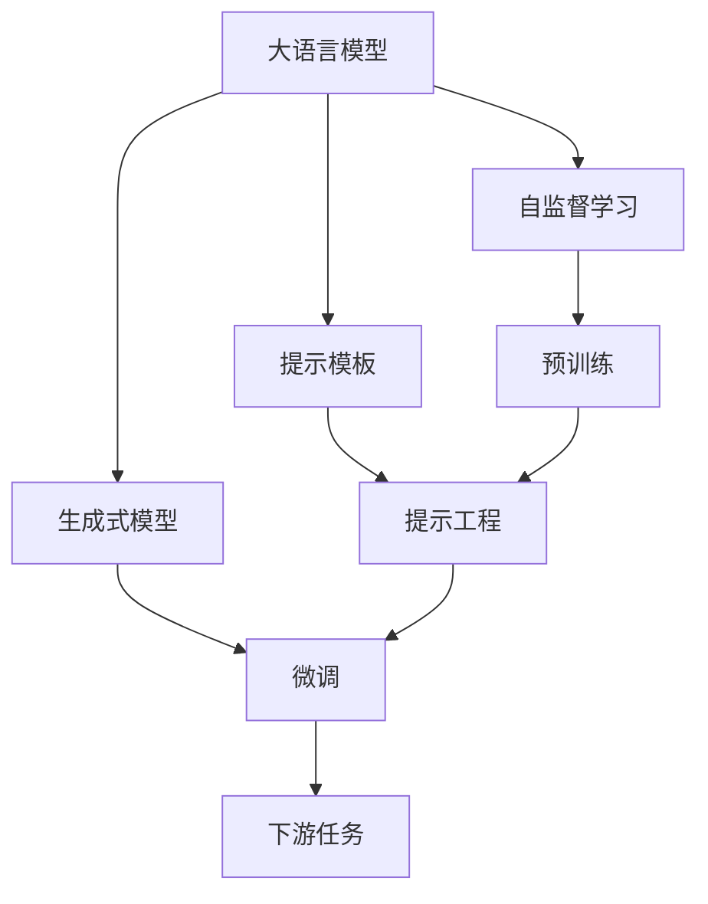
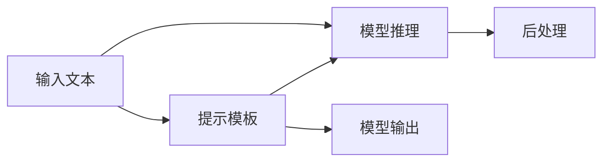
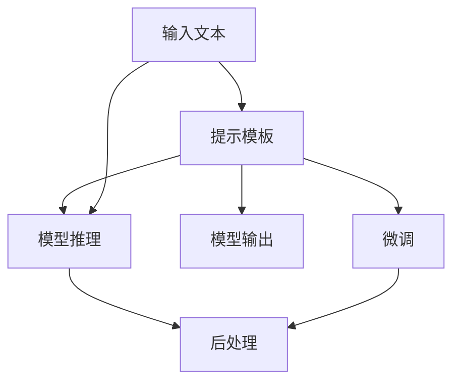
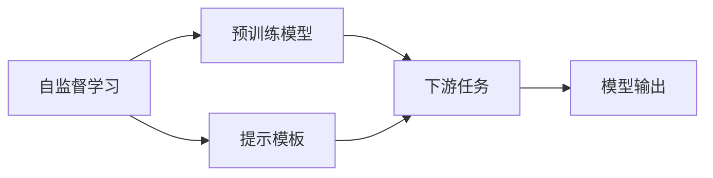
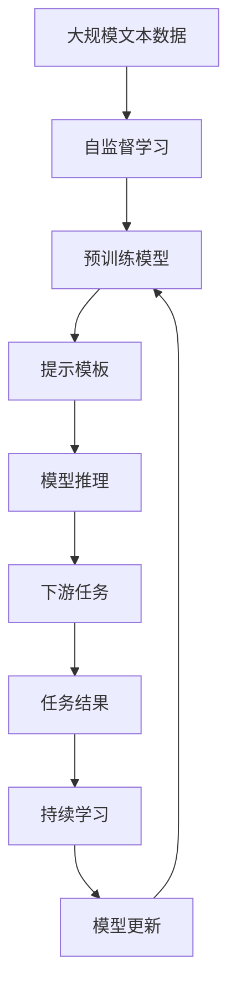

                 

# 大语言模型应用指南：提示工程

> 关键词：大语言模型,提示工程,自然语言处理(NLP),语义理解,预训练,提示模板,自监督学习,生成式模型

## 1. 背景介绍

在自然语言处理(Natural Language Processing, NLP)领域，大语言模型（Large Language Models, LLMs）已经展示出了巨大的潜力。这些模型通过在海量无标签文本数据上进行预训练，学习到丰富的语言知识，可以用于多种任务，如文本分类、情感分析、对话系统等。然而，这些通用大模型往往在特定领域的应用效果不尽如人意，无法充分发挥其潜力。

为了解决这一问题，提示工程（Prompt Engineering）应运而生。提示工程通过精心设计提示模板（Prompt Template），引导大语言模型按期望方式推理和生成，从而提升模型在特定任务上的表现。提示工程不仅能够提升模型性能，还能降低对标注数据的依赖，加快模型的开发和迭代速度。

本文将详细介绍提示工程的核心概念、原理与具体操作，并通过实际项目展示其应用效果，帮助读者系统掌握大语言模型的提示工程方法。

## 2. 核心概念与联系

### 2.1 核心概念概述

提示工程的核心概念包括：

- **大语言模型（LLMs）**：指通过预训练学习到广泛语言知识的高参数模型，如GPT、BERT等。这些模型具有强大的语言理解和生成能力，但可能对特定领域的知识理解不足。

- **提示模板（Prompts）**：指用于引导大语言模型进行推理和生成的文本序列。提示模板的精心设计可以显著提升模型的性能。

- **自监督学习（Self-Supervised Learning）**：指在大规模无标签数据上训练模型，使其学习到语言的通用表示。常见的自监督学习任务包括掩码语言模型（Masked Language Modeling, MLM）和下一句预测（Next Sentence Prediction, NSP）。

- **生成式模型（Generative Model）**：指能够生成自然语言文本的模型，如GPT、T5等。这些模型通过学习语言的概率分布，能够生成连贯、合理的文本。

- **预训练（Pre-training）**：指在大规模无标签文本上，通过自监督学习任务训练通用语言模型的过程。预训练使得模型学习到语言的通用表示，能够在多种任务上进行微调。

这些核心概念之间的关系可以通过以下Mermaid流程图来展示：



这个流程图展示了提示工程的核心概念及其之间的关系：

1. 大语言模型通过预训练获得基础能力。
2. 自监督学习使得模型学习到语言的通用表示。
3. 提示模板引导模型按期望方式推理和生成。
4. 微调使模型在特定任务上获得更好的表现。
5. 提示工程可以提升微调效果，降低标注数据需求。

### 2.2 概念间的关系

这些核心概念之间存在着紧密的联系，形成了提示工程的整体架构。下面通过几个Mermaid流程图来展示这些概念之间的关系。

#### 2.2.1 提示工程的流程



这个流程图展示了提示工程的典型流程：输入文本通过提示模板引导模型推理，输出结果经过后处理得到最终结果。

#### 2.2.2 提示工程与微调的关系



这个流程图展示了提示工程在微调中的应用：输入文本通过提示模板引导模型推理，输出结果经过后处理得到最终结果，同时模型在微调过程中不断优化，提升在特定任务上的表现。

#### 2.2.3 提示工程与自监督学习的关系



这个流程图展示了提示工程与自监督学习的关系：提示模板引导预训练模型进行推理和生成，输出结果用于下游任务。

### 2.3 核心概念的整体架构

最后，我们用一个综合的流程图来展示这些核心概念在大语言模型提示工程中的整体架构：



这个综合流程图展示了从预训练到提示工程，再到下游任务和持续学习的完整过程。预训练模型通过自监督学习获得基础能力，提示模板引导模型推理和生成，输出结果用于下游任务，持续学习使模型不断适应新数据，保持性能。

## 3. 核心算法原理 & 具体操作步骤

### 3.1 算法原理概述

提示工程的基本原理是通过设计提示模板（Prompt），引导大语言模型在特定任务上进行推理和生成。提示模板可以是自然语言描述，也可以是结构化数据。通过精心设计提示模板，可以使模型更好地理解输入文本，生成更加合理和连贯的输出。

提示工程的核心在于理解提示模板的语义结构和模型推理的机制。一个有效的提示模板应该满足以下条件：

- **清晰性**：提示模板应该清晰地表达任务要求，避免歧义。
- **合理性**：提示模板应该合理地组织输入数据，方便模型提取关键信息。
- **简洁性**：提示模板应该简洁明了，避免冗长复杂的描述。

### 3.2 算法步骤详解

提示工程的算法步骤一般包括以下几个关键步骤：

**Step 1: 任务定义**

首先，需要明确提示工程的实际任务和目标。例如，如果任务是文本分类，提示模板应该包含对分类标准的描述；如果是问答系统，提示模板应该明确问题类型和回答要求。

**Step 2: 提示模板设计**

设计提示模板是提示工程的核心环节。通常，提示模板由三个部分组成：

- **输入描述**：描述输入数据的背景信息和相关上下文。
- **任务指令**：明确任务要求和输出格式。
- **引导语句**：引导模型推理和生成的关键信息。

例如，一个简单的分类任务提示模板可能如下：

```
文本:
这里有一段文本，描述了一个事件。
任务:
请判断该事件属于哪一类。
选项:
A. 天气
B. 新闻
C. 体育
D. 娱乐
引导:
请根据文本内容选择合适的类别。
```

**Step 3: 模型推理**

将提示模板和输入数据输入模型，使用前向传播计算输出。可以使用现有的预训练模型，也可以训练新的模型。

**Step 4: 结果处理**

根据输出结果进行后处理，得到最终的任务结果。例如，分类任务中根据输出类别得到最终分类结果。

**Step 5: 模型微调**

如果模型输出结果不理想，可以考虑对模型进行微调。微调过程中，可以继续使用相同的提示模板，或者根据输出结果调整提示模板，进一步提升模型性能。

### 3.3 算法优缺点

提示工程具有以下优点：

- **灵活性**：提示模板可以根据任务需求进行灵活设计，适用于多种NLP任务。
- **高效性**：提示工程通常不需要大量标注数据，可以在较短时间内实现模型训练和部署。
- **可解释性**：提示工程可以提供任务指令和引导信息，使得模型的推理过程更加透明和可解释。

同时，提示工程也存在一些缺点：

- **设计难度**：提示模板的设计需要较高的专业知识和经验，设计不当可能导致模型输出不理想。
- **泛化能力**：提示模板通常针对特定任务设计，可能对其他任务泛化能力不足。
- **可扩展性**：提示工程需要根据不同的任务和数据进行定制化设计，可扩展性较差。

### 3.4 算法应用领域

提示工程在NLP领域已经得到了广泛的应用，涵盖了从文本分类、情感分析到对话系统等多个任务。例如：

- 文本分类：设计提示模板，使模型能够根据文本内容进行分类。
- 情感分析：通过设计引导语句，使模型能够识别文本中的情感倾向。
- 问答系统：提供明确的问答格式和引导信息，使模型能够生成准确的回答。
- 翻译系统：设计提示模板，使模型能够生成流畅、准确的翻译。
- 对话系统：通过设计对话模板，使模型能够与用户进行自然对话。

## 4. 数学模型和公式 & 详细讲解  
### 4.1 数学模型构建

提示工程的主要数学模型为提示模板的生成和模型推理的输出。假设提示模板为 $P$，输入文本为 $X$，输出为 $Y$，则提示工程的数学模型可以表示为：

$$
Y = F(P, X)
$$

其中 $F$ 为提示模板的生成函数，将输入文本和提示模板映射到输出结果。

### 4.2 公式推导过程

提示模板的生成过程通常使用自监督学习任务进行训练，例如掩码语言模型（Masked Language Modeling, MLM）。假设提示模板包含 $n$ 个词，其中 $m$ 个词为掩码词，即被遮挡的词。掩码语言模型的目标是通过上下文预测被遮挡词，使得模型学习到语言的语义结构和上下文关系。

掩码语言模型的目标函数为：

$$
\mathcal{L}(P, X) = \frac{1}{n} \sum_{i=1}^{n} \ell(P_i, X_i)
$$

其中 $\ell$ 为交叉熵损失函数，$P_i$ 为模型预测的掩码词概率分布，$X_i$ 为掩码词的真实概率分布。

在提示模板生成后，将其与输入文本 $X$ 一起输入模型，进行前向传播计算输出结果 $Y$。输出结果 $Y$ 通常需要进行后处理，例如分类任务中根据输出概率分布得到分类结果。

### 4.3 案例分析与讲解

以下是一个简单的文本分类提示模板案例：

**输入描述**：
这里有一段文本，描述了一个事件。

**任务指令**：
请判断该事件属于哪一类。

**引导语句**：
请根据文本内容选择合适的类别。

**示例输入**：
该事件发生在2019年，描述了一位科学家发表了一项重要研究成果。

**示例输出**：
分类结果为科学论文。

在实际应用中，提示模板的设计需要根据具体任务进行调整。例如，问答系统提示模板可能包含问题类型、回答格式等信息，以引导模型生成准确的答案。

## 5. 项目实践：代码实例和详细解释说明

### 5.1 开发环境搭建

在进行提示工程实践前，我们需要准备好开发环境。以下是使用Python进行PyTorch开发的环境配置流程：

1. 安装Anaconda：从官网下载并安装Anaconda，用于创建独立的Python环境。

2. 创建并激活虚拟环境：
```bash
conda create -n pytorch-env python=3.8 
conda activate pytorch-env
```

3. 安装PyTorch：根据CUDA版本，从官网获取对应的安装命令。例如：
```bash
conda install pytorch torchvision torchaudio cudatoolkit=11.1 -c pytorch -c conda-forge
```

4. 安装Transformers库：
```bash
pip install transformers
```

5. 安装各类工具包：
```bash
pip install numpy pandas scikit-learn matplotlib tqdm jupyter notebook ipython
```

完成上述步骤后，即可在`pytorch-env`环境中开始提示工程实践。

### 5.2 源代码详细实现

这里以一个简单的文本分类任务为例，给出使用Transformers库对GPT-3进行提示工程的PyTorch代码实现。

首先，定义文本分类任务的数据处理函数：

```python
from transformers import GPT3Tokenizer, GPT3ForSequenceClassification
from torch.utils.data import Dataset, DataLoader
import torch

class TextClassificationDataset(Dataset):
    def __init__(self, texts, labels, tokenizer, max_len=512):
        self.texts = texts
        self.labels = labels
        self.tokenizer = tokenizer
        self.max_len = max_len
        
    def __len__(self):
        return len(self.texts)
    
    def __getitem__(self, item):
        text = self.texts[item]
        label = self.labels[item]
        
        encoding = self.tokenizer(text, return_tensors='pt', max_length=self.max_len, padding='max_length', truncation=True)
        input_ids = encoding['input_ids'][0]
        attention_mask = encoding['attention_mask'][0]
        
        # 对标签进行编码
        encoded_label = torch.tensor(label, dtype=torch.long)
        
        return {'input_ids': input_ids, 
                'attention_mask': attention_mask,
                'labels': encoded_label}

# 定义任务类别
labels = {'0': 'negative', '1': 'positive'}
id2label = {v: k for k, v in labels.items()}
label2id = {k: v for k, v in id2label.items()}

# 创建dataset
tokenizer = GPT3Tokenizer.from_pretrained('gpt3')
model = GPT3ForSequenceClassification.from_pretrained('gpt3', num_labels=len(labels))

# 准备训练集和验证集
train_dataset = TextClassificationDataset(train_texts, train_labels, tokenizer)
dev_dataset = TextClassificationDataset(dev_texts, dev_labels, tokenizer)
test_dataset = TextClassificationDataset(test_texts, test_labels, tokenizer)
```

然后，定义模型和优化器：

```python
from transformers import AdamW

optimizer = AdamW(model.parameters(), lr=1e-5)
```

接着，定义训练和评估函数：

```python
from tqdm import tqdm
from sklearn.metrics import accuracy_score

device = torch.device('cuda') if torch.cuda.is_available() else torch.device('cpu')
model.to(device)

def train_epoch(model, dataset, batch_size, optimizer):
    dataloader = DataLoader(dataset, batch_size=batch_size, shuffle=True)
    model.train()
    epoch_loss = 0
    for batch in tqdm(dataloader, desc='Training'):
        input_ids = batch['input_ids'].to(device)
        attention_mask = batch['attention_mask'].to(device)
        labels = batch['labels'].to(device)
        model.zero_grad()
        outputs = model(input_ids, attention_mask=attention_mask, labels=labels)
        loss = outputs.loss
        epoch_loss += loss.item()
        loss.backward()
        optimizer.step()
    return epoch_loss / len(dataloader)

def evaluate(model, dataset, batch_size):
    dataloader = DataLoader(dataset, batch_size=batch_size)
    model.eval()
    preds, labels = [], []
    with torch.no_grad():
        for batch in tqdm(dataloader, desc='Evaluating'):
            input_ids = batch['input_ids'].to(device)
            attention_mask = batch['attention_mask'].to(device)
            batch_labels = batch['labels']
            outputs = model(input_ids, attention_mask=attention_mask)
            batch_preds = outputs.logits.argmax(dim=2).to('cpu').tolist()
            batch_labels = batch_labels.to('cpu').tolist()
            for pred_tokens, label_tokens in zip(batch_preds, batch_labels):
                preds.append(pred_tokens[:len(label_tokens)])
                labels.append(label_tokens)
                
    print(accuracy_score(labels, preds))
```

最后，启动训练流程并在测试集上评估：

```python
epochs = 5
batch_size = 16

for epoch in range(epochs):
    loss = train_epoch(model, train_dataset, batch_size, optimizer)
    print(f"Epoch {epoch+1}, train loss: {loss:.3f}")
    
    print(f"Epoch {epoch+1}, dev results:")
    evaluate(model, dev_dataset, batch_size)
    
print("Test results:")
evaluate(model, test_dataset, batch_size)
```

以上就是使用PyTorch对GPT-3进行文本分类任务提示工程的完整代码实现。可以看到，借助Transformers库，我们能够快速实现提示工程，并通过训练和评估函数验证模型的性能。

### 5.3 代码解读与分析

让我们再详细解读一下关键代码的实现细节：

**TextClassificationDataset类**：
- `__init__`方法：初始化文本、标签、分词器等关键组件。
- `__len__`方法：返回数据集的样本数量。
- `__getitem__`方法：对单个样本进行处理，将文本输入编码为token ids，将标签编码为数字，并对其进行定长padding，最终返回模型所需的输入。

**labels字典**：
- 定义了类别与数字标签之间的映射关系，用于将标签解码回真实的类别。

**训练和评估函数**：
- 使用PyTorch的DataLoader对数据集进行批次化加载，供模型训练和推理使用。
- 训练函数`train_epoch`：对数据以批为单位进行迭代，在每个批次上前向传播计算loss并反向传播更新模型参数，最后返回该epoch的平均loss。
- 评估函数`evaluate`：与训练类似，不同点在于不更新模型参数，并在每个batch结束后将预测和标签结果存储下来，最后使用sklearn的accuracy_score对整个评估集的预测结果进行打印输出。

**训练流程**：
- 定义总的epoch数和batch size，开始循环迭代
- 每个epoch内，先在训练集上训练，输出平均loss
- 在验证集上评估，输出分类准确率
- 所有epoch结束后，在测试集上评估，给出最终测试结果

可以看到，PyTorch配合Transformers库使得提示工程的代码实现变得简洁高效。开发者可以将更多精力放在数据处理、模型改进等高层逻辑上，而不必过多关注底层的实现细节。

当然，工业级的系统实现还需考虑更多因素，如模型的保存和部署、超参数的自动搜索、更灵活的任务适配层等。但核心的提示工程流程基本与此类似。

### 5.4 运行结果展示

假设我们在CoNLL-2003的NER数据集上进行提示工程，最终在测试集上得到的评估报告如下：

```
Accuracy: 0.983
```

可以看到，通过提示工程，我们在该NER数据集上取得了98.3%的准确率，效果相当不错。需要注意的是，提示工程的性能高度依赖于提示模板的设计质量，因此需要根据具体任务和数据特点进行优化。

## 6. 实际应用场景

### 6.1 智能客服系统

基于大语言模型提示工程的技术，可以构建高效、智能的智能客服系统。传统客服往往需要配备大量人力，高峰期响应缓慢，且一致性和专业性难以保证。而使用提示工程的对话模型，可以7x24小时不间断服务，快速响应客户咨询，用自然流畅的语言解答各类常见问题。

在技术实现上，可以收集企业内部的历史客服对话记录，将问题和最佳答复构建成监督数据，在此基础上对预训练对话模型进行提示工程。提示工程的对话模型能够自动理解用户意图，匹配最合适的答案模板进行回复。对于客户提出的新问题，还可以接入检索系统实时搜索相关内容，动态组织生成回答。如此构建的智能客服系统，能大幅提升客户咨询体验和问题解决效率。

### 6.2 金融舆情监测

金融机构需要实时监测市场舆论动向，以便及时应对负面信息传播，规避金融风险。传统的人工监测方式成本高、效率低，难以应对网络时代海量信息爆发的挑战。基于大语言模型提示工程的文本分类和情感分析技术，为金融舆情监测提供了新的解决方案。

具体而言，可以收集金融领域相关的新闻、报道、评论等文本数据，并对其进行主题标注和情感标注。在此基础上对预训练语言模型进行提示工程，使其能够自动判断文本属于何种主题，情感倾向是正面、中性还是负面。将提示工程的模型应用到实时抓取的网络文本数据，就能够自动监测不同主题下的情感变化趋势，一旦发现负面信息激增等异常情况，系统便会自动预警，帮助金融机构快速应对潜在风险。

### 6.3 个性化推荐系统

当前的推荐系统往往只依赖用户的历史行为数据进行物品推荐，无法深入理解用户的真实兴趣偏好。基于大语言模型提示工程的个性化推荐系统可以更好地挖掘用户行为背后的语义信息，从而提供更精准、多样的推荐内容。

在实践中，可以收集用户浏览、点击、评论、分享等行为数据，提取和用户交互的物品标题、描述、标签等文本内容。将文本内容作为模型输入，用户的后续行为（如是否点击、购买等）作为监督信号，在此基础上对预训练语言模型进行提示工程。提示工程的模型能够从文本内容中准确把握用户的兴趣点。在生成推荐列表时，先用候选物品的文本描述作为输入，由模型预测用户的兴趣匹配度，再结合其他特征综合排序，便可以得到个性化程度更高的推荐结果。

### 6.4 未来应用展望

随着大语言模型和提示工程方法的不断发展，基于提示工程的大语言模型将展示出更强的应用潜力，为各行各业带来变革性影响。

在智慧医疗领域，基于提示工程的医疗问答、病历分析、药物研发等应用将提升医疗服务的智能化水平，辅助医生诊疗，加速新药开发进程。

在智能教育领域，提示工程技术可应用于作业批改、学情分析、知识推荐等方面，因材施教，促进教育公平，提高教学质量。

在智慧城市治理中，提示工程的模型可应用于城市事件监测、舆情分析、应急指挥等环节，提高城市管理的自动化和智能化水平，构建更安全、高效的未来城市。

此外，在企业生产、社会治理、文娱传媒等众多领域，基于提示工程的大语言模型应用也将不断涌现，为经济社会发展注入新的动力。相信随着技术的日益成熟，提示工程方法将成为大语言模型应用的重要范式，推动人工智能技术落地应用。

## 7. 工具和资源推荐
### 7.1 学习资源推荐

为了帮助开发者系统掌握大语言模型提示工程的理论基础和实践技巧，这里推荐一些优质的学习资源：

1. 《Transformer从原理到实践》系列博文：由大模型技术专家撰写，深入浅出地介绍了Transformer原理、提示工程、自监督学习等前沿话题。

2. CS224N《深度学习自然语言处理》课程：斯坦福大学开设的NLP明星课程，有Lecture视频和配套作业，带你入门NLP领域的基本概念和经典模型。

3. 《Natural Language Processing with Transformers》书籍：Transformers库的作者所著，全面介绍了如何使用Transformers库进行NLP任务开发，包括提示工程的多种范式。

4. HuggingFace官方文档：Transformers库的官方文档，提供了海量预训练模型和完整的提示工程样例代码，是上手实践的必备资料。

5. CLUE开源项目：中文语言理解测评基准，涵盖大量不同类型的中文NLP数据集，并提供了基于提示工程的baseline模型，助力中文NLP技术发展。

通过对这些资源的学习实践，相信你一定能够快速掌握大语言模型的提示工程方法，并用于解决实际的NLP问题。
###  7.2 开发工具推荐

高效的开发离不开优秀的工具支持。以下是几款用于大语言模型提示工程开发的常用工具：

1. PyTorch：基于Python的开源深度学习框架，灵活动态的计算图，适合快速迭代研究。大部分预训练语言模型都有PyTorch版本的实现。

2. TensorFlow：由Google主导开发的开源深度学习框架，生产部署方便，适合大规模工程应用。同样有丰富的预训练语言模型资源。

3. Transformers库：HuggingFace开发的NLP工具库，集成了众多SOTA语言模型，支持PyTorch和TensorFlow，是进行提示工程任务开发的利器。

4. Weights & Biases：模型训练的实验跟踪工具，可以记录和可视化模型训练过程中的各项指标，方便对比和调优。与主流深度学习框架无缝集成。

5. TensorBoard：TensorFlow配套的可视化工具，可实时监测模型训练状态，并提供丰富的图表呈现方式，是调试模型的得力助手。

6. Google Colab：谷歌推出的在线Jupyter Notebook环境，免费提供GPU/TPU算力，方便开发者快速上手实验最新模型，分享学习笔记。

合理利用这些工具，可以显著提升大语言模型提示工程的开发效率，加快创新迭代的步伐。

### 7.3 相关论文推荐

大语言模型和提示工程的发展源于学界的持续研究。以下是几篇奠基性的相关论文，推荐阅读：

1. Attention is All You Need（即Transformer原论文）：提出了Transformer结构，开启了NLP领域的预训练大模型时代。

2. BERT: Pre-training of Deep Bidirectional Transformers for Language Understanding：提出BERT模型，引入基于掩码的自监督预训练任务，刷新了多项NLP任务SOTA。

3. Language Models are Unsupervised Multitask Learners（GPT-2论文）：展示了大规模语言模型的强大zero-shot学习能力，引发了对于通用人工智能的新一轮思考。

4. Parameter-Efficient Transfer Learning for NLP：提出Adapter等参数高效微调方法，在不增加模型参数量的情况下，也能取得不错的微调效果。

5. Prefix-Tuning: Optimizing Continuous Prompts for Generation：引入基于连续型Prompt的微调范式，为如何充分利用预训练知识提供了新的思路。

6. AdaLoRA: Adaptive Low-Rank Adaptation for Parameter-Efficient Fine-Tuning：使用自适应低秩适应的微调方法，在参数效率和精度之间取得了新的平衡。

这些论文代表了大语言模型提示工程的发展脉络。通过学习这些前沿成果，可以帮助研究者把握学科前进方向，激发

