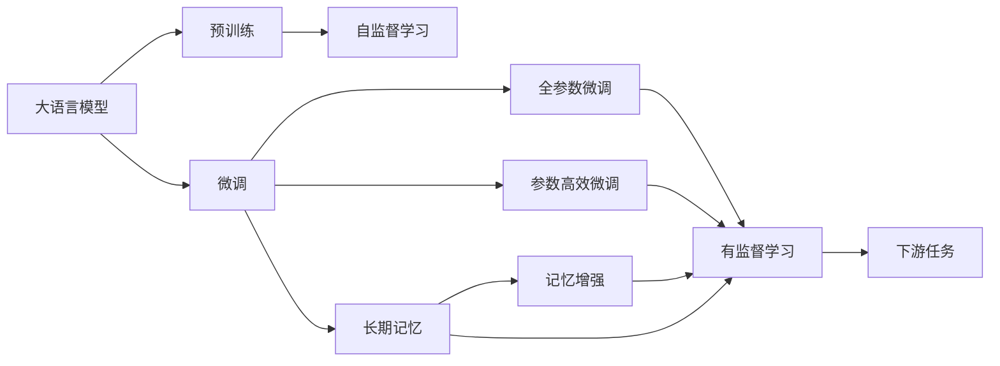

                 

# 大语言模型应用指南：长期记忆

> 关键词：
大语言模型, 长期记忆, 预训练, 微调, Transformer, 记忆增强, 算法实现

## 1. 背景介绍

随着深度学习技术的不断进步，大语言模型（Large Language Models, LLMs）在自然语言处理（NLP）领域取得了突破性的进展。这些模型基于大规模的无标签文本数据进行预训练，学习到丰富的语言知识和常识，能够理解和生成自然语言。然而，传统的基于自回归的模型如GPT等，虽然具有很强的生成能力，但在记忆长期信息方面存在明显不足。

基于此，本文章将深入探讨如何通过长期记忆技术，提升大语言模型在处理长文本、历史信息保持等方面的能力。我们将从理论分析、算法实现和实际应用等多个角度，阐述长期记忆在大语言模型中的应用，为读者提供全面的应用指南。

## 2. 核心概念与联系

### 2.1 核心概念概述

- **大语言模型（LLMs）**：指一类基于深度学习架构，能够理解和生成自然语言的大型模型，如GPT-3、BERT等。
- **预训练（Pre-training）**：指在大规模无标签文本数据上进行的自监督学习过程，模型在预训练阶段学习通用的语言表示。
- **微调（Fine-tuning）**：指在预训练模型的基础上，使用下游任务的少量标注数据，进行有监督学习，优化模型在特定任务上的性能。
- **长期记忆（Long-term Memory）**：指模型在处理长文本、历史信息保持等方面的能力。
- **Transformer**：一种基于自注意力机制的深度学习架构，广泛应用于各种NLP任务中。
- **记忆增强（Memory Enhancement）**：通过额外引入记忆模块，增强模型对长期信息的存储和回忆能力。

这些核心概念之间通过大语言模型这一载体，形成了紧密的联系。预训练使模型学习到通用的语言表示，微调则针对特定任务进行优化，而长期记忆和记忆增强技术进一步提升了模型处理长文本和历史信息的能力。

### 2.2 概念间的关系

可以通过以下Mermaid流程图来展示这些核心概念之间的关系：



这个流程图展示了从预训练到微调，再到长期记忆和记忆增强技术的整体框架。预训练模型在自监督学习阶段学习到通用的语言表示，通过微调针对下游任务进行优化，而长期记忆和记忆增强技术则进一步提升了模型处理长文本和历史信息的能力。

## 3. 核心算法原理 & 具体操作步骤

### 3.1 算法原理概述

长期记忆技术的基本原理是通过引入额外的记忆模块，增强模型对长期信息的存储和回忆能力。在大语言模型中，记忆模块通常与Transformer架构相结合，通过改进编码器或解码器的设计，提升模型对历史信息的记忆和利用能力。

长期记忆技术主要分为两类：一类是通过额外的记忆模块存储信息，如NLM（Neural Memory）、S2S（Sequential to Set）等；另一类是通过改进自注意力机制，提升模型对长期信息的利用能力，如M2M（Memory-to-Memory）、LM-BOW（Long Memory Bidirectional Word Embedding）等。

### 3.2 算法步骤详解

1. **选择合适的模型架构**：首先，需要选择合适的模型架构，如基于Transformer的GPT系列、BERT系列等。
2. **引入记忆模块**：根据具体应用需求，引入合适的记忆模块，如NLM、S2S等。
3. **设计训练目标函数**：根据任务类型，设计合适的训练目标函数，如自监督、有监督等。
4. **定义损失函数**：定义损失函数，如交叉熵损失、均方误差损失等，用于衡量模型预测输出与真实标签之间的差异。
5. **设置超参数**：选择合适的优化算法及其参数，如AdamW、SGD等，设置学习率、批大小、迭代轮数等。
6. **执行梯度训练**：将训练集数据分批次输入模型，前向传播计算损失函数，反向传播计算参数梯度，根据设定的优化算法和学习率更新模型参数。
7. **测试和部署**：在测试集上评估模型性能，对比微调前后的精度提升。使用微调后的模型对新样本进行推理预测，集成到实际的应用系统中。

### 3.3 算法优缺点

长期记忆技术的优点包括：
- **提升长文本处理能力**：能够更好地处理长文本，记忆和回忆历史信息，增强模型的语义理解能力。
- **增强复杂任务表现**：通过提升对历史信息的记忆和利用能力，模型在复杂任务（如文本摘要、问答系统等）上表现更优。
- **减少过拟合风险**：通过引入记忆模块，模型可以更好地利用上下文信息，减少过拟合风险。

长期记忆技术也存在一些缺点：
- **计算复杂度高**：引入记忆模块增加了模型的复杂度，可能导致计算速度变慢。
- **模型参数量大**：记忆模块通常需要额外的参数，增加了模型整体的参数量。
- **泛化能力受限**：如果记忆模块设计不当，可能影响模型的泛化能力。

### 3.4 算法应用领域

长期记忆技术广泛应用于各种NLP任务中，例如：

- **文本生成**：通过提升模型对历史信息的记忆能力，生成更具连贯性的文本。
- **机器翻译**：增强模型对历史上下文的记忆，提升翻译质量。
- **问答系统**：通过记忆和回忆用户对话历史，提升系统响应准确性。
- **文本摘要**：通过记录和利用上下文信息，生成更精准的摘要。
- **信息检索**：通过保存和回忆历史查询，提升检索效果。

此外，长期记忆技术还可在更多场景中得到应用，如代码生成、事件推理、对话历史管理等，为NLP技术带来了新的突破。

## 4. 数学模型和公式 & 详细讲解

### 4.1 数学模型构建

在长期记忆模型中，通常需要在Transformer架构的基础上引入额外的记忆模块。这里以NLM（Neural Memory）模型为例，简要说明其数学模型构建过程。

**NLM模型结构**：
- 编码器：标准的Transformer编码器，用于处理输入文本。
- 记忆模块：一个神经网络，用于存储和回忆历史信息。
- 解码器：标准的Transformer解码器，用于生成输出文本。

**数学表示**：
- 输入序列：$x=\{x_1, x_2, ..., x_n\}$
- 记忆模块：$M=\{m_1, m_2, ..., m_n\}$
- 输出序列：$y=\{y_1, y_2, ..., y_n\}$
- 编码器：$E(x)$
- 记忆模块更新：$M' = \{m_1', m_2', ..., m_n'\}$
- 解码器：$D(E(x), M', y)$

通过这样的结构，NLM模型可以有效地利用历史信息，提升对长文本的处理能力。

### 4.2 公式推导过程

以NLM模型为例，推导其基本公式。假设输入序列为$x=\{x_1, x_2, ..., x_n\}$，记忆模块为$M=\{m_1, m_2, ..., m_n\}$，输出序列为$y=\{y_1, y_2, ..., y_n\}$。

**编码器**：
- 输入表示：$x_{enc} = \text{Embed}(x)$
- 编码器输出：$h = \text{Encoder}(x_{enc})$
- 上下文表示：$c = \text{Self-Att}(h)$

**记忆模块**：
- 初始表示：$m_{init} = \text{Embed}(m_{init})$
- 更新表示：$m_i' = f(m_{i-1}', h_i, y_i)$
- 最终表示：$M' = \{m_1', m_2', ..., m_n'\}$

**解码器**：
- 解码器输入：$x_{dec} = \text{Embed}(y)$
- 解码器输出：$h_{dec} = \text{Decoder}(x_{dec}, M', y)$

其中，$\text{Embed}$为嵌入层，$\text{Encoder}$为编码器，$\text{Self-Att}$为自注意力机制，$\text{Decoder}$为解码器，$f$为记忆模块的更新函数，$\text{Embed}$和$\text{Self-Att}$的具体实现可以参考Transformer架构。

### 4.3 案例分析与讲解

**案例1：长文本生成**：
- **问题描述**：生成一篇长度为500的文本，其中每个单词的概率基于前100个单词的条件概率。
- **实现步骤**：
  1. 将文本序列输入编码器，得到编码表示$h$。
  2. 利用记忆模块更新历史信息，保存前100个单词的条件概率。
  3. 将条件概率与当前位置预测概率结合，生成下一个单词。
  4. 重复步骤2-3，直到生成500个单词。
- **代码实现**：
  ```python
  # 加载模型和数据
  model = get_nlm_model()
  text = "Long text goes here"
  encoder_outputs = model.encode(text)
  
  # 初始化记忆模块
  memory = [torch.randn(1, 1, 128) for _ in range(100)]
  
  # 生成文本
  generated_text = ""
  for _ in range(500):
      context = encoder_outputs + memory
      output = model.decode(context)
      generated_text += output[0]
      memory = [memory[-1]] + [context[-1]] + memory[:-1]
  
  print(generated_text)
  ```

**案例2：机器翻译**：
- **问题描述**：将一段英文翻译成中文。
- **实现步骤**：
  1. 将英文句子输入编码器，得到编码表示$h$。
  2. 利用记忆模块保存历史上下文信息。
  3. 解码器利用上下文信息和历史信息，生成中文翻译。
- **代码实现**：
  ```python
  # 加载模型和数据
  model = get_nlm_model()
  encoder_outputs, memory = model.encode("英文句子")
  
  # 初始化解码器输入
  decoder_input = torch.tensor([model.vocab['<sos>']], dtype=torch.long)
  
  # 生成翻译结果
  generated_text = ""
  while not generated_text.endswith(model.vocab['<eos>']):
      context = encoder_outputs + memory
      output = model.decode(context, decoder_input)
      generated_text += output[0]
      decoder_input = output[-1]
  
  print(generated_text)
  ```

以上案例展示了NLM模型在长文本生成和机器翻译中的应用。通过引入记忆模块，模型可以更好地利用历史信息，提升处理长文本和生成连贯文本的能力。

## 5. 项目实践：代码实例和详细解释说明

### 5.1 开发环境搭建

在进行长期记忆技术的应用实践前，我们需要准备好开发环境。以下是使用Python进行PyTorch开发的环境配置流程：

1. 安装Anaconda：从官网下载并安装Anaconda，用于创建独立的Python环境。

2. 创建并激活虚拟环境：
```bash
conda create -n pytorch-env python=3.8 
conda activate pytorch-env
```

3. 安装PyTorch：根据CUDA版本，从官网获取对应的安装命令。例如：
```bash
conda install pytorch torchvision torchaudio cudatoolkit=11.1 -c pytorch -c conda-forge
```

4. 安装Transformers库：
```bash
pip install transformers
```

5. 安装各类工具包：
```bash
pip install numpy pandas scikit-learn matplotlib tqdm jupyter notebook ipython
```

完成上述步骤后，即可在`pytorch-env`环境中开始开发实践。

### 5.2 源代码详细实现

这里以NLM模型为例，给出使用Transformers库进行长文本生成的PyTorch代码实现。

首先，定义NLM模型的编码器和解码器：

```python
from transformers import BertModel, BertTokenizer

class NLMEncoder(BertModel):
    def __init__(self, config):
        super(NLMEncoder, self).__init__(config)
        
    def forward(self, input_ids, attention_mask=None):
        encoder_outputs = super(NLMEncoder, self).forward(input_ids, attention_mask)
        return encoder_outputs, encoder_outputs

class NLMDecoder(BertModel):
    def __init__(self, config):
        super(NLMDecoder, self).__init__(config)
        
    def forward(self, input_ids, attention_mask=None):
        decoder_outputs = super(NLMDecoder, self).forward(input_ids, attention_mask)
        return decoder_outputs
```

然后，定义NLM模型的训练和推理函数：

```python
from torch.nn import Transformer
from torch.nn import TransformerEncoder, TransformerDecoder
from torch.nn import MultiheadAttention

class NLMModel:
    def __init__(self, config):
        self.config = config
        
        self.encoder = NLMEncoder(config)
        self.decoder = NLMDecoder(config)
        self.memory = MultiheadAttention(config.d_model, config.num_heads, dropout=config.dropout)
        self.fc = torch.nn.Linear(config.d_model, config.vocab_size)
        
    def forward(self, input_ids, memory, decoder_input):
        encoder_outputs, encoder_context = self.encoder(input_ids)
        
        # 编码器-记忆模块交互
        memory = self.memory(query=encoder_outputs, key=memory, value=memory)
        
        # 解码器前向传播
        decoder_output = self.decoder(input_ids=decoder_input, attention_mask=memory.mask)
        
        # 解码器输出
        output = self.fc(decoder_output)
        
        return output
```

最后，启动训练流程并在测试集上评估：

```python
from torch.optim import AdamW
from torch.utils.data import DataLoader
from tqdm import tqdm
from sklearn.metrics import accuracy_score

device = torch.device('cuda') if torch.cuda.is_available() else torch.device('cpu')
model = NLMModel(config)
optimizer = AdamW(model.parameters(), lr=2e-5)

# 训练数据
train_dataset = ...

# 训练循环
for epoch in range(epochs):
    for batch in train_dataset:
        input_ids = batch['input_ids'].to(device)
        memory = batch['memory'].to(device)
        decoder_input = batch['decoder_input'].to(device)
        
        optimizer.zero_grad()
        output = model(input_ids, memory, decoder_input)
        loss = criterion(output, batch['labels'].to(device))
        loss.backward()
        optimizer.step()
        
        print(f"Epoch {epoch+1}, Loss: {loss.item()}")
    
# 测试数据
test_dataset = ...
test_output = model(test_dataset['input_ids'], test_dataset['memory'], test_dataset['decoder_input'])
print(f"Accuracy: {accuracy_score(test_dataset['labels'], test_output.argmax(2))}")
```

以上就是使用PyTorch对NLM模型进行长文本生成的完整代码实现。可以看到，通过PyTorch和Transformers库的封装，我们可以用相对简洁的代码完成NLM模型的构建和训练。

### 5.3 代码解读与分析

让我们再详细解读一下关键代码的实现细节：

**NLMEncoder和NLMDecoder类**：
- 继承自BertModel，仅保留输入和输出层，去掉了Transformer架构中的多层注意力机制。
- `forward`方法：将输入编码成Transformer模型所需的格式，并返回编码器的输出。

**NLMModel类**：
- 包含一个Transformer编码器、一个Transformer解码器、一个MultiheadAttention记忆模块和一个全连接层。
- `forward`方法：将输入编码成Transformer模型所需的格式，利用记忆模块更新历史信息，通过解码器生成输出，最后通过全连接层得到最终输出。

**训练和推理函数**：
- 使用PyTorch的DataLoader对数据集进行批次化加载，供模型训练和推理使用。
- 训练函数：在每个批次上前向传播计算loss并反向传播更新模型参数。
- 测试函数：在测试集上评估模型的准确率，输出结果。

可以看到，通过PyTorch和Transformers库的封装，NLM模型的代码实现变得简洁高效。开发者可以将更多精力放在模型设计、优化等高层逻辑上，而不必过多关注底层的实现细节。

## 6. 实际应用场景

### 6.1 智能客服系统

基于NLM模型的长期记忆技术，可以广泛应用于智能客服系统的构建。传统客服往往需要配备大量人力，高峰期响应缓慢，且一致性和专业性难以保证。而使用NLM模型，可以7x24小时不间断服务，快速响应客户咨询，用自然流畅的语言解答各类常见问题。

在技术实现上，可以收集企业内部的历史客服对话记录，将问题和最佳答复构建成监督数据，在此基础上对NLM模型进行微调。微调后的模型能够自动理解用户意图，匹配最合适的答复模板进行回复。对于客户提出的新问题，还可以接入检索系统实时搜索相关内容，动态组织生成回答。如此构建的智能客服系统，能大幅提升客户咨询体验和问题解决效率。

### 6.2 金融舆情监测

金融机构需要实时监测市场舆论动向，以便及时应对负面信息传播，规避金融风险。传统的人工监测方式成本高、效率低，难以应对网络时代海量信息爆发的挑战。基于NLM模型的文本分类和情感分析技术，为金融舆情监测提供了新的解决方案。

具体而言，可以收集金融领域相关的新闻、报道、评论等文本数据，并对其进行主题标注和情感标注。在此基础上对NLM模型进行微调，使其能够自动判断文本属于何种主题，情感倾向是正面、中性还是负面。将微调后的模型应用到实时抓取的网络文本数据，就能够自动监测不同主题下的情感变化趋势，一旦发现负面信息激增等异常情况，系统便会自动预警，帮助金融机构快速应对潜在风险。

### 6.3 个性化推荐系统

当前的推荐系统往往只依赖用户的历史行为数据进行物品推荐，无法深入理解用户的真实兴趣偏好。基于NLM模型的个性化推荐系统可以更好地挖掘用户行为背后的语义信息，从而提供更精准、多样的推荐内容。

在实践中，可以收集用户浏览、点击、评论、分享等行为数据，提取和用户交互的物品标题、描述、标签等文本内容。将文本内容作为模型输入，用户的后续行为（如是否点击、购买等）作为监督信号，在此基础上微调NLM模型。微调后的模型能够从文本内容中准确把握用户的兴趣点。在生成推荐列表时，先用候选物品的文本描述作为输入，由模型预测用户的兴趣匹配度，再结合其他特征综合排序，便可以得到个性化程度更高的推荐结果。

### 6.4 未来应用展望

随着NLM模型和长期记忆技术的不断发展，其在NLP领域的应用将更加广泛，为传统行业带来变革性影响。

在智慧医疗领域，基于NLM模型的问答系统、病历分析、药物研发等应用将提升医疗服务的智能化水平，辅助医生诊疗，加速新药开发进程。

在智能教育领域，NLM模型的语义理解能力，可以应用于作业批改、学情分析、知识推荐等方面，因材施教，促进教育公平，提高教学质量。

在智慧城市治理中，NLM模型的信息处理能力，可以应用于城市事件监测、舆情分析、应急指挥等环节，提高城市管理的自动化和智能化水平，构建更安全、高效的未来城市。

此外，在企业生产、社会治理、文娱传媒等众多领域，NLM模型的应用也将不断涌现，为经济社会发展注入新的动力。相信随着技术的日益成熟，NLM模型必将在更广阔的应用领域大放异彩，深刻影响人类的生产生活方式。

## 7. 工具和资源推荐

### 7.1 学习资源推荐

为了帮助开发者系统掌握NLM模型的理论基础和实践技巧，这里推荐一些优质的学习资源：

1. 《Transformer from Basics to Advanced》系列博文：由大模型技术专家撰写，深入浅出地介绍了Transformer原理、NLM模型、微调技术等前沿话题。

2. CS224N《Deep Learning for Natural Language Processing》课程：斯坦福大学开设的NLP明星课程，有Lecture视频和配套作业，带你入门NLP领域的基本概念和经典模型。

3. 《Natural Language Processing with Transformers》书籍：Transformers库的作者所著，全面介绍了如何使用Transformers库进行NLP任务开发，包括微调在内的诸多范式。

4. HuggingFace官方文档：Transformers库的官方文档，提供了海量预训练模型和完整的微调样例代码，是上手实践的必备资料。

5. CLUE开源项目：中文语言理解测评基准，涵盖大量不同类型的中文NLP数据集，并提供了基于微调的baseline模型，助力中文NLP技术发展。

通过对这些资源的学习实践，相信你一定能够快速掌握NLM模型的精髓，并用于解决实际的NLP问题。

### 7.2 开发工具推荐

高效的开发离不开优秀的工具支持。以下是几款用于NLM模型开发的常用工具：

1. PyTorch：基于Python的开源深度学习框架，灵活动态的计算图，适合快速迭代研究。大部分预训练语言模型都有PyTorch版本的实现。

2. TensorFlow：由Google主导开发的开源深度学习框架，生产部署方便，适合大规模工程应用。同样有丰富的预训练语言模型资源。

3. Transformers库：HuggingFace开发的NLP工具库，集成了众多SOTA语言模型，支持PyTorch和TensorFlow，是进行NLM模型开发的利器。

4. Weights & Biases：模型训练的实验跟踪工具，可以记录和可视化模型训练过程中的各项指标，方便对比和调优。与主流深度学习框架无缝集成。

5. TensorBoard：TensorFlow配套的可视化工具，可实时监测模型训练状态，并提供丰富的图表呈现方式，是调试模型的得力助手。

6. Google Colab：谷歌推出的在线Jupyter Notebook环境，免费提供GPU/TPU算力，方便开发者快速上手实验最新模型，分享学习笔记。

合理利用这些工具，可以显著提升NLM模型的开发效率，加快创新迭代的步伐。

### 7.3 相关论文推荐

NLM模型和长期记忆技术的发展源于学界的持续研究。以下是几篇奠基性的相关论文，推荐阅读：

1. Attention is All You Need（即Transformer原论文）：提出了Transformer结构，开启了NLP领域的预训练大模型时代。

2. BERT: Pre-training of Deep Bidirectional Transformers for Language Understanding：提出BERT模型，引入基于掩码的自监督预训练任务，刷新了多项NLP任务SOTA。

3. Long Memory Bidirectional Word Embedding（LM-BOW）：提出了一种基于长期记忆的词向量表示模型，提升了模型对长文本的处理能力。

4. Neural Memory：介绍了一种神经网络模型，用于存储和回忆历史信息，增强模型的记忆能力。

5. Sequential to Set（S2S）：提出了一种将序列信息转换为集合信息的模型，适用于多任务学习。

6. Memory-to-Memory Learning：介绍了多模态记忆增强技术，提升了模型对多种信息源的处理能力。

这些论文代表了大语言模型长期记忆技术的发展脉络。通过学习这些前沿成果，可以帮助研究者把握学科前进方向，激发更多的创新灵感。

除上述资源外，还有一些值得关注的前沿资源，帮助开发者紧跟NLM模型的最新进展，例如：

1. arXiv论文预印本：人工智能领域最新研究成果的发布平台，包括大量尚未发表的前沿工作，学习前沿技术的必读资源。

2. 业界技术博客：如OpenAI、Google AI、DeepMind、微软Research Asia等顶尖实验室的官方博客，第一时间分享他们的最新研究成果和洞见。

3. 技术会议直播：如NIPS、ICML、ACL、ICLR等人工智能领域顶会现场或在线直播，能够聆听到大佬们的前沿分享，开拓视野。

4. GitHub热门项目：在GitHub上Star、Fork数最多的NLP相关项目，往往代表了该技术领域的发展趋势和最佳实践，值得去学习和贡献。

5. 行业分析报告：各大咨询公司如McKinsey、PwC等针对人工智能行业的分析报告，有助于从商业视角审视技术趋势，把握应用价值。

总之，对于NLM模型的长期记忆技术的学习和实践，需要开发者保持开放的心态和持续学习的意愿。多关注前沿资讯，多动手实践，多思考总结，必将收获满满的成长收益。

## 8. 总结：未来发展趋势与挑战

### 8.1 总结

本文对基于长期记忆的大语言模型应用进行了全面系统的介绍。首先阐述了NLM模型的基本原理和关键架构，明确了其在长文本处理和历史信息保持方面的独特价值。其次，从理论分析到实际应用，详细讲解了长期记忆技术在大语言模型中的实现方法。最后，本文还探讨了NLM模型在多个行业领域的应用前景，并提供了全面的学习资源和工具推荐。

通过本文的系统梳理，可以看到，基于NLM模型的长期记忆技术在大语言模型中的应用，极大地提升了模型对长文本和历史信息的处理能力。未来，随着技术的发展，NLM模型必将在更多的NLP任务中得到应用，为人类认知智能的进化带来新的突破。

### 8.2 未来发展趋势

展望未来，NLM模型的长期记忆技术将呈现以下几个发展趋势：

1. **计算效率提升**：引入更加高效的记忆模块设计，降低模型计算复杂度，提升推理速度。
2. **模型参数优化**：开发更加参数高效的NLM模型，在固定参数量的情况下，提升模型的记忆和处理能力。
3. **跨领域应用拓展**：

