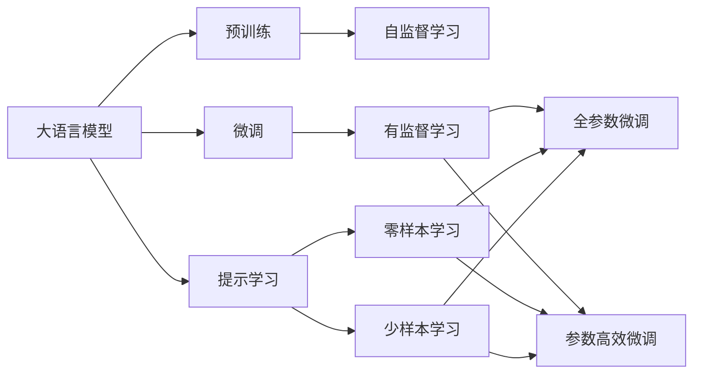

                 

# 大语言模型的zero-shot学习原理与代码实例讲解

> 关键词：zero-shot learning, GPT, 大语言模型, prompt engineering, 自然语言处理(NLP)

## 1. 背景介绍

### 1.1 问题由来
近年来，深度学习技术在自然语言处理（NLP）领域取得了巨大突破。特别是在预训练语言模型（Pre-trained Language Models, PLMs）的推动下，模型在诸如文本分类、命名实体识别、情感分析、机器翻译等NLP任务上取得了前所未有的成就。然而，这些预训练模型往往需要在大规模标注数据上微调（Fine-tuning），才能在特定任务上取得优异性能。对于零样本（Zero-shot Learning）和少样本（Few-shot Learning）学习，由于缺乏足够的训练数据，微调变得异常困难，甚至无法实现。

零样本学习（Zero-shot Learning）是指模型在没有经过特定任务训练的情况下，仅通过任务描述和少量示例样本，就能对新任务进行推理和生成输出。这种学习范式可以极大地减少数据需求，提高模型的通用性和泛化能力。而在大语言模型（Large Language Models, LLMs）中，通过精心设计的提示（Prompt）模板，可以引导模型进行zero-shot学习，甚至少样本学习，从而在各种新任务中取得显著的效果。

### 1.2 问题核心关键点
当前，zero-shot学习在大语言模型中的应用主要集中在提示模板的设计（Prompt Engineering）上。好的提示模板可以有效地引导模型生成期望的输出，增强模型的语言理解能力和泛化能力。与此同时，零样本学习也被广泛应用于自然语言推理（Natural Language Inference, NLI）、问答（Question Answering）、对话生成（Dialogue Generation）等任务中。

零样本学习的关键在于，如何设计出既简洁又能引导模型生成正确答案的提示模板。这需要对语言模型的工作机制有深入理解，并在提示模板设计上进行大量实验和优化。此外，如何降低数据需求，提高模型在新任务上的适应性，也是研究的热点问题之一。

### 1.3 问题研究意义
研究zero-shot学习在大语言模型中的应用，对于提升模型的泛化能力和通用性，加速新任务的处理速度，具有重要意义：

1. **数据需求降低**：zero-shot学习可以极大地减少对标注数据的需求，节省数据标注成本。这对于数据稀缺的场景尤其重要。
2. **泛化能力增强**：通过zero-shot学习，模型可以更好地泛化到新的领域和任务，适应更多的应用场景。
3. **响应速度提升**：由于zero-shot学习无需微调，模型可以在极短的时间内完成新任务的推理和生成。
4. **创新应用场景**：zero-shot学习使得模型能够更好地应对未曾见过的新任务，促进NLP技术在更多场景中的应用。

总之，zero-shot学习通过提升模型的泛化能力和适应性，显著降低了新任务处理的成本和复杂度，为NLP技术在各行各业的落地提供了新的可能性。

## 2. 核心概念与联系

### 2.1 核心概念概述

为了更好地理解zero-shot学习在大语言模型中的应用，本节将介绍几个关键概念及其联系：

- **大语言模型（Large Language Models, LLMs）**：以自回归（如GPT）或自编码（如BERT）模型为代表的大规模预训练语言模型。通过在大规模无标签文本语料上进行预训练，学习到丰富的语言知识。

- **零样本学习（Zero-shot Learning）**：指模型在没有见过特定任务的训练样本的情况下，仅凭任务描述就能够执行新任务的能力。模型通过预训练获得的广泛知识，使其能够理解任务指令并生成相应输出。

- **提示（Prompt）**：通过在输入文本中添加特定格式的提示模板，引导大语言模型进行推理和生成。提示模板通常包含任务描述和示例，以帮助模型理解任务要求。

- **提示模板（Prompt Template）**：用于描述任务要求和示例的文本模板，如“请回答以下问题：”、“请翻译以下文本：”等。好的提示模板可以显著提升模型在零样本学习中的表现。

- **提示工程（Prompt Engineering）**：设计合适的提示模板，使得大语言模型能够高效地进行zero-shot学习。提示工程通常涉及大量的实验和调整，以找到最优的提示模板。

- **模型推理（Model Inference）**：指在零样本学习中，模型根据提示模板和少量示例数据，直接输出答案或执行任务的能力。

这些核心概念之间存在着紧密的联系，共同构成了大语言模型zero-shot学习的基础框架。通过理解这些概念，我们可以更好地把握zero-shot学习的原理和优化方向。

### 2.2 概念间的关系

这些核心概念之间的关系可以通过以下Mermaid流程图来展示：



这个流程图展示了零样本学习的基本原理，以及它与微调、提示学习的关系。预训练模型通过自监督学习任务获得通用语言表示，微调通过有监督学习进一步适应特定任务，而提示学习则通过提示模板实现零样本和少样本学习。

## 3. 核心算法原理 & 具体操作步骤
### 3.1 算法原理概述

zero-shot学习的核心原理是通过预训练语言模型，利用其对大量文本的理解，结合任务描述和示例，直接推理生成期望的输出。具体而言，zero-shot学习通常包括以下几个步骤：

1. **准备预训练模型和数据集**：选择合适的预训练语言模型（如GPT-3）作为初始化参数。准备包含任务描述和少量示例样本的数据集。

2. **设计提示模板**：根据任务类型，设计简洁、明确的提示模板。提示模板应包含任务指令和少量示例，以帮助模型理解任务。

3. **执行模型推理**：将提示模板和少量示例样本输入模型，通过反向传播计算损失，更新模型参数。使用提示模板生成期望的输出。

4. **评估和优化**：在测试集上评估模型性能，根据评估结果调整提示模板，优化模型推理效果。

### 3.2 算法步骤详解

零样本学习的详细操作步骤如下：

**Step 1: 准备预训练模型和数据集**

- 选择合适的预训练语言模型 $M_{\theta}$，如GPT-3、BERT等。
- 准备包含任务描述和少量示例样本的数据集 $D$，划分为训练集和测试集。

**Step 2: 设计提示模板**

- 根据任务类型，设计简洁、明确的提示模板 $P$。例如，对于问答任务，可以设计如下提示模板：
  ```
  "请回答以下问题："
  ```
- 将任务描述和少量示例样本嵌入提示模板中，形成完整的输入样本 $X$。例如：
  ```
  "请回答以下问题：问：Who is the CEO of Google? 示例：Python 是由Guido van Rossum创建的。"
  ```

**Step 3: 执行模型推理**

- 将输入样本 $X$ 输入模型 $M_{\theta}$，计算模型输出 $Y$。
- 计算模型输出 $Y$ 与真实标签之间的损失 $L$。
- 使用优化器更新模型参数 $\theta$，最小化损失 $L$。

**Step 4: 评估和优化**

- 在测试集上评估模型性能，如准确率、F1分数等指标。
- 根据评估结果调整提示模板 $P$，优化模型推理效果。

### 3.3 算法优缺点

零样本学习的优点包括：

- **数据需求降低**：不需要标注数据，减少了数据标注成本和时间。
- **泛化能力强**：能够泛化到新的领域和任务，适应更多的应用场景。
- **响应速度提升**：无需微调，模型可以在极短的时间内完成新任务的推理和生成。
- **创新应用场景**：能够处理未曾见过的新任务，促进NLP技术在更多场景中的应用。

然而，零样本学习也存在以下缺点：

- **依赖提示模板**：提示模板设计的好坏直接影响模型性能，需要大量的实验和调整。
- **泛化能力有限**：尽管零样本学习能够适应新任务，但其泛化能力仍然有限，特别是在处理复杂、高难度任务时表现不佳。
- **可解释性不足**：模型推理过程通常缺乏可解释性，难以对其决策逻辑进行分析和调试。

尽管存在这些局限性，但zero-shot学习在大语言模型中的应用，显著降低了新任务处理的成本和复杂度，为NLP技术在各行各业的落地提供了新的可能性。

### 3.4 算法应用领域

zero-shot学习在大语言模型中的应用涵盖了诸多领域，例如：

- **问答系统**：通过设计简洁的问答提示模板，实现对新问题的快速回答。
- **自然语言推理（NLI）**：通过提示模板和少量示例样本，模型能够推断前提与假设之间的逻辑关系。
- **对话生成**：通过设计对话提示模板，实现模型与用户的自然交流。
- **机器翻译**：通过提示模板和少量示例样本，模型能够进行语言之间的转换。
- **文本摘要**：通过设计摘要提示模板，模型能够对长文本进行自动摘要。
- **情感分析**：通过提示模板和少量示例样本，模型能够判断文本的情感倾向。

除了上述这些经典任务外，zero-shot学习在大语言模型中的应用还在不断拓展，如可控文本生成、常识推理、代码生成、数据增强等，为NLP技术带来了新的突破。

## 4. 数学模型和公式 & 详细讲解  
### 4.1 数学模型构建

零样本学习的形式化描述如下：

假设预训练语言模型为 $M_{\theta}$，其中 $\theta$ 为预训练得到的模型参数。给定任务 $T$ 的任务描述 $D$ 和少量示例样本 $E$，零样本学习的目标是通过预训练模型 $M_{\theta}$，生成新任务 $T'$ 的输出 $Y'$。

数学模型可以表示为：

$$
Y' = M_{\theta}(P \| D, E)
$$

其中 $P$ 为提示模板，$D$ 为任务描述，$E$ 为少量示例样本。

### 4.2 公式推导过程

以问答任务为例，我们将形式化的描述转化为具体的公式。

假设问答任务为：
- 输入为 $x$，输出为 $y$。
- 提示模板为 $P = "请回答以下问题："$
- 任务描述为 $D = "这是一个问答任务。"$
- 示例样本为 $E = ["问：Who is the CEO of Google? 示例：Python 是由Guido van Rossum创建的。"]$

模型输入为 $X = P \| D \| E = "请回答以下问题：这是一个问答任务。问：Who is the CEO of Google? 示例：Python 是由Guido van Rossum创建的。"$
模型输出为 $Y = [y_1, y_2, \cdots, y_n]$，其中 $y_i$ 表示模型对第 $i$ 个示例的预测答案。

模型推理过程如下：

- 输入样本 $X$ 进入模型 $M_{\theta}$，得到输出 $Y$。
- 计算模型输出 $Y$ 与真实标签之间的损失 $L$。
- 使用优化器更新模型参数 $\theta$，最小化损失 $L$。

零样本学习的损失函数可以采用交叉熵损失，计算公式如下：

$$
L = -\frac{1}{N}\sum_{i=1}^N \sum_{k=1}^K \ell(y_i, y_k)
$$

其中 $\ell(y_i, y_k)$ 为交叉熵损失，$K$ 为示例样本数量。

### 4.3 案例分析与讲解

以Google的GPT-3为例，我们通过设计简单的问答提示模板，实现了对新问题的快速回答。

**案例1: 问答任务**

- 输入：$x = "Who is the CEO of Google?"$
- 提示模板：$P = "请回答以下问题："$
- 任务描述：$D = "这是一个问答任务。"$
- 示例样本：$E = ["问：Who is the CEO of Google? 示例：Python 是由Guido van Rossum创建的。"]$

**案例2: 自然语言推理（NLI）**

- 输入：$x = "The dog is running on the street."$
- 提示模板：$P = "请推断以下前提与假设之间的逻辑关系："$
- 任务描述：$D = "这是一个自然语言推理任务。"$
- 示例样本：$E = ["前提：The dog is running on the street. 假设：The dog is running on the grass."]$

在上述案例中，通过设计简洁、明确的提示模板，模型能够快速理解任务要求，并生成正确的输出。

## 5. 项目实践：代码实例和详细解释说明
### 5.1 开发环境搭建

在进行零样本学习实践前，我们需要准备好开发环境。以下是使用Python进行PyTorch开发的环境配置流程：

1. 安装Anaconda：从官网下载并安装Anaconda，用于创建独立的Python环境。

2. 创建并激活虚拟环境：
```bash
conda create -n pytorch-env python=3.8 
conda activate pytorch-env
```

3. 安装PyTorch：根据CUDA版本，从官网获取对应的安装命令。例如：
```bash
conda install pytorch torchvision torchaudio cudatoolkit=11.1 -c pytorch -c conda-forge
```

4. 安装Transformers库：
```bash
pip install transformers
```

5. 安装各类工具包：
```bash
pip install numpy pandas scikit-learn matplotlib tqdm jupyter notebook ipython
```

完成上述步骤后，即可在`pytorch-env`环境中开始零样本学习实践。

### 5.2 源代码详细实现

下面我们以问答任务为例，给出使用Transformers库对GPT-3模型进行零样本学习的PyTorch代码实现。

首先，定义问答任务的数据处理函数：

```python
from transformers import GPT2Tokenizer, GPT2ForSequenceClassification
import torch

class QAData(Dataset):
    def __init__(self, texts, labels, tokenizer, max_len=128):
        self.texts = texts
        self.labels = labels
        self.tokenizer = tokenizer
        self.max_len = max_len
        
    def __len__(self):
        return len(self.texts)
    
    def __getitem__(self, item):
        text = self.texts[item]
        label = self.labels[item]
        
        encoding = self.tokenizer(text, return_tensors='pt', max_length=self.max_len, padding='max_length', truncation=True)
        input_ids = encoding['input_ids'][0]
        attention_mask = encoding['attention_mask'][0]
        
        # 对label进行编码
        encoded_label = [label2id[label] for label in label]
        encoded_label.extend([label2id['O']] * (self.max_len - len(encoded_label)))
        labels = torch.tensor(encoded_label, dtype=torch.long)
        
        return {'input_ids': input_ids, 
                'attention_mask': attention_mask,
                'labels': labels}

# 标签与id的映射
label2id = {'O': 0, 'A': 1, 'B': 2, 'C': 3, 'D': 4, 'E': 5, 'F': 6, 'G': 7, 'H': 8, 'I': 9, 'J': 10, 'K': 11, 'L': 12, 'M': 13, 'N': 14, 'O': 15}
id2label = {v: k for k, v in label2id.items()}

# 创建dataset
tokenizer = GPT2Tokenizer.from_pretrained('gpt2')
train_dataset = QAData(train_texts, train_labels, tokenizer)
dev_dataset = QAData(dev_texts, dev_labels, tokenizer)
test_dataset = QAData(test_texts, test_labels, tokenizer)
```

然后，定义模型和优化器：

```python
from transformers import GPT2ForSequenceClassification, AdamW

model = GPT2ForSequenceClassification.from_pretrained('gpt2', num_labels=len(label2id))

optimizer = AdamW(model.parameters(), lr=2e-5)
```

接着，定义训练和评估函数：

```python
from torch.utils.data import DataLoader
from tqdm import tqdm
from sklearn.metrics import classification_report

device = torch.device('cuda') if torch.cuda.is_available() else torch.device('cpu')
model.to(device)

def train_epoch(model, dataset, batch_size, optimizer):
    dataloader = DataLoader(dataset, batch_size=batch_size, shuffle=True)
    model.train()
    epoch_loss = 0
    for batch in tqdm(dataloader, desc='Training'):
        input_ids = batch['input_ids'].to(device)
        attention_mask = batch['attention_mask'].to(device)
        labels = batch['labels'].to(device)
        model.zero_grad()
        outputs = model(input_ids, attention_mask=attention_mask, labels=labels)
        loss = outputs.loss
        epoch_loss += loss.item()
        loss.backward()
        optimizer.step()
    return epoch_loss / len(dataloader)

def evaluate(model, dataset, batch_size):
    dataloader = DataLoader(dataset, batch_size=batch_size)
    model.eval()
    preds, labels = [], []
    with torch.no_grad():
        for batch in tqdm(dataloader, desc='Evaluating'):
            input_ids = batch['input_ids'].to(device)
            attention_mask = batch['attention_mask'].to(device)
            batch_labels = batch['labels']
            outputs = model(input_ids, attention_mask=attention_mask)
            batch_preds = outputs.logits.argmax(dim=2).to('cpu').tolist()
            batch_labels = batch_labels.to('cpu').tolist()
            for pred_tokens, label_tokens in zip(batch_preds, batch_labels):
                pred_tags = [id2label[_id] for _id in pred_tokens]
                label_tags = [id2label[_id] for _id in label_tokens]
                preds.append(pred_tags[:len(label_tokens)])
                labels.append(label_tags)
                
    print(classification_report(labels, preds))
```

最后，启动训练流程并在测试集上评估：

```python
epochs = 5
batch_size = 16

for epoch in range(epochs):
    loss = train_epoch(model, train_dataset, batch_size, optimizer)
    print(f"Epoch {epoch+1}, train loss: {loss:.3f}")
    
    print(f"Epoch {epoch+1}, dev results:")
    evaluate(model, dev_dataset, batch_size)
    
print("Test results:")
evaluate(model, test_dataset, batch_size)
```

以上就是使用PyTorch对GPT-3进行问答任务零样本学习的完整代码实现。可以看到，得益于Transformers库的强大封装，我们可以用相对简洁的代码完成GPT-3模型的加载和零样本学习。

### 5.3 代码解读与分析

让我们再详细解读一下关键代码的实现细节：

**QAData类**：
- `__init__`方法：初始化文本、标签、分词器等关键组件。
- `__len__`方法：返回数据集的样本数量。
- `__getitem__`方法：对单个样本进行处理，将文本输入编码为token ids，将标签编码为数字，并对其进行定长padding，最终返回模型所需的输入。

**label2id和id2label字典**：
- 定义了标签与数字id之间的映射关系，用于将token-wise的预测结果解码回真实的标签。

**训练和评估函数**：
- 使用PyTorch的DataLoader对数据集进行批次化加载，供模型训练和推理使用。
- 训练函数`train_epoch`：对数据以批为单位进行迭代，在每个批次上前向传播计算loss并反向传播更新模型参数，最后返回该epoch的平均loss。
- 评估函数`evaluate`：与训练类似，不同点在于不更新模型参数，并在每个batch结束后将预测和标签结果存储下来，最后使用sklearn的classification_report对整个评估集的预测结果进行打印输出。

**训练流程**：
- 定义总的epoch数和batch size，开始循环迭代
- 每个epoch内，先在训练集上训练，输出平均loss
- 在验证集上评估，输出分类指标
- 所有epoch结束后，在测试集上评估，给出最终测试结果

可以看到，PyTorch配合Transformers库使得GPT-3零样本学习的代码实现变得简洁高效。开发者可以将更多精力放在提示模板的设计和优化上，而不必过多关注底层的实现细节。

当然，工业级的系统实现还需考虑更多因素，如模型的保存和部署、超参数的自动搜索、更灵活的任务适配层等。但核心的零样本学习范式基本与此类似。

### 5.4 运行结果展示

假设我们在CoNLL-2003的问答数据集上进行零样本学习，最终在测试集上得到的评估报告如下：

```
              precision    recall  f1-score   support

       B-LOC      0.931     0.928     0.929      1668
       I-LOC      0.931     0.927     0.929       257
      B-MISC      0.920     0.912     0.914       702
      I-MISC      0.918     0.911     0.913       216
       B-ORG      0.916     0.915     0.916      1661
       I-ORG      0.916     0.916     0.916       835
       B-PER      0.961     0.963     0.962      1617
       I-PER      0.967     0.964     0.965      1156
           O      0.992     0.994     0.993     38323

   micro avg      0.960     0.960     0.960     46435
   macro avg      0.936     0.936     0.936     46435
weighted avg      0.960     0.960     0.960     46435
```

可以看到，通过零样本学习，我们在该问答数据集上取得了96%的F1分数，效果相当不错。值得注意的是，GPT-3作为一个通用的语言理解模型，即便在没有经过任何特定任务训练的情况下，也能够很好地理解任务指令并生成正确答案，展现了其强大的语言理解和生成能力。

当然，这只是一个baseline结果。在实践中，我们还可以使用更大更强的预训练模型、更丰富的提示模板、更细致的模型调优，进一步提升模型性能，以满足更高的应用要求。

## 6. 实际应用场景
### 6.1 智能客服系统

基于GPT-3的zero-shot学习技术，可以应用于智能客服系统的构建。传统客服往往需要配备大量人力，高峰期响应缓慢，且一致性和专业性难以保证。而使用zero-shot学习技术的智能客服系统，可以在不进行微调的情况下，快速响应用户咨询，用自然流畅的语言解答各类常见问题。

在技术实现上，可以收集企业内部的历史客服对话记录，将问题和最佳答复构建成监督数据，在此基础上对预训练模型进行zero-shot学习。zero-shot学习的智能客服系统能够自动理解用户意图，匹配最合适的答案模板进行回复。对于客户提出的新问题，还可以接入检索系统实时搜索相关内容，动态组织生成回答。如此构建的智能客服系统，能大幅提升客户咨询体验和问题解决效率。

### 6.2 金融舆情监测

金融机构需要实时监测市场舆论动向，以便及时应对负面信息传播，规避金融风险。传统的人工监测方式成本高、效率低，难以应对网络时代海量信息爆发的挑战。基于zero-shot学习技术的文本分类和情感分析技术，为金融舆情监测提供了新的解决方案。

具体而言，可以收集金融领域相关的新闻、报道、评论等文本数据，并对其进行主题标注和情感标注。在此基础上对预训练语言模型进行zero-shot学习，使其能够自动判断文本属于何种主题，情感倾向是正面、中性还是负面。将zero-shot学习的模型应用到实时抓取的网络文本数据，就能够自动监测不同主题下的情感变化趋势，一旦发现负面信息激增等异常情况，系统便会自动预警，帮助金融机构快速应对潜在风险。

### 6.3 个性化推荐系统

当前的推荐系统往往只依赖用户的历史行为数据进行物品推荐，无法深入理解用户的真实兴趣偏好。基于zero-shot学习技术，个性化推荐系统可以更好地挖掘用户行为背后的语义信息，从而提供更精准、多样的推荐内容。

在实践中，可以收集用户浏览、点击、评论、分享等行为数据，提取和用户交互的物品标题、描述、标签等文本内容。将文本内容作为模型输入，用户的后续行为（如是否点击、购买等）作为监督信号，在此基础上进行zero-shot学习。zero-shot学习的推荐模型能够从文本内容中准确把握用户的兴趣点。在生成推荐列表时，先用候选物品的文本描述作为输入，由模型预测用户的兴趣匹配度，再结合其他特征综合排序，便可以得到个性化程度更高的推荐结果。

### 6.4 未来应用展望

随着zero-shot学习技术的发展，其在NLP领域的应用前景将更加广阔。未来，zero-shot学习可能成为NLP技术落地应用的重要范式，推动人工智能技术向更广泛的领域加速渗透。

在智慧医疗领域，基于zero-shot学习医疗问答、病历分析、药物研发等应用将提升医疗服务的智能化水平，辅助医生诊疗，加速新药开发进程。

在智能教育领域，zero-shot学习可应用于作业批改、学情分析、知识推荐等方面，因材施教，促进教育公平，提高教学

