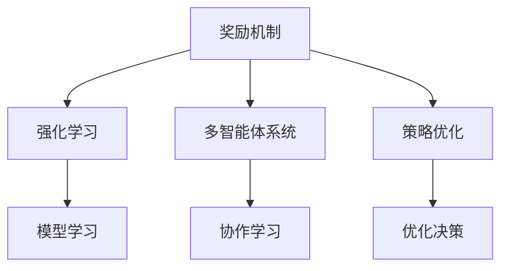
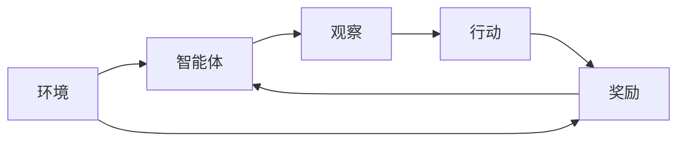
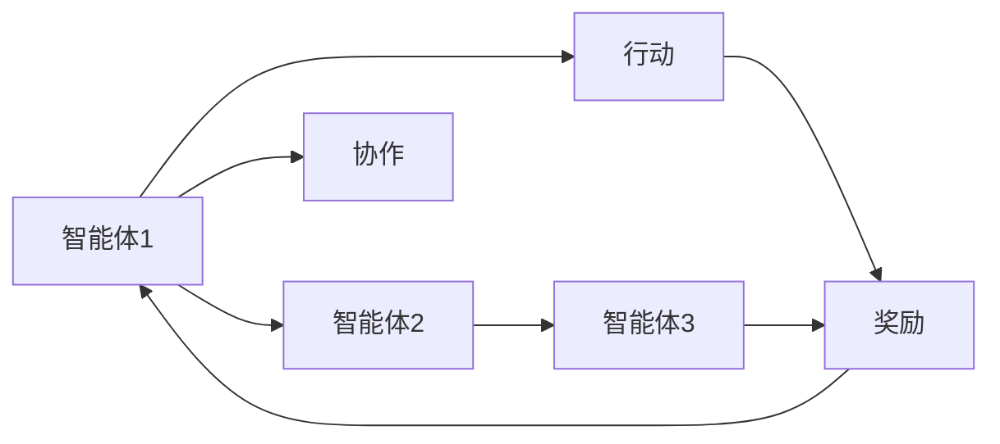
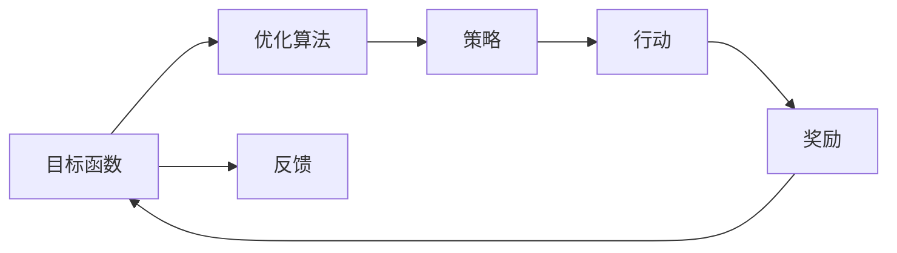
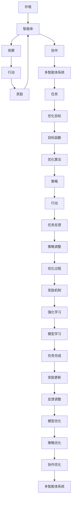

                 

# 奖励 (Reward)

在人工智能的世界里，奖励机制不仅是驱动模型学习的核心动力，也是实现智能行为的关键要素。本文将深入探讨奖励在人工智能中的应用，包括其核心概念、算法原理、具体操作步骤、数学模型、项目实践、实际应用场景、工具和资源推荐，并总结未来发展趋势与挑战。

## 1. 背景介绍

### 1.1 问题由来
在人工智能领域，奖励机制（Reward）用于指导和激励模型在特定任务上的学习行为，是实现智能决策的基础。无论是强化学习（Reinforcement Learning, RL）、多智能体系统（Multi-agent System），还是策略优化（Strategy Optimization），奖励机制都扮演着不可或缺的角色。奖励的合理设计和应用，直接影响模型的学习效率和性能。

### 1.2 问题核心关键点
1. **奖励机制的定义**：奖励机制定义了模型在某项任务上取得成功时所得到的正反馈。这种正反馈可以是金钱、评分、表扬等形式，其目的是激励模型不断优化决策过程，提升任务完成质量。
2. **奖励函数的设计**：奖励函数是衡量模型在特定任务上表现的关键指标，设计良好的奖励函数能够引导模型向更优解方向进化。
3. **奖励机制的实施**：奖励机制的实施需要将奖励函数与模型的优化过程紧密结合，确保奖励能够有效引导模型的学习行为。
4. **奖励的反馈**：在多智能体系统中，奖励不仅应用于单一模型，还需用于所有参与模型的互动，促进协作学习。

### 1.3 问题研究意义
奖励机制在人工智能中的应用，能够显著提升模型在复杂环境下的决策能力，推动模型向更高效、更智能的方向发展。其重要性体现在以下几个方面：

1. **驱动模型优化**：奖励机制通过正负反馈，促使模型不断调整策略，优化决策过程。
2. **促进协作学习**：在多智能体系统中，奖励机制能够协调各智能体间的行为，促进协作学习，实现更复杂的任务。
3. **提升系统稳定性**：合理设计的奖励机制能够避免模型在训练过程中出现崩溃、震荡等问题，提高系统的稳定性和鲁棒性。
4. **促进模型泛化**：通过奖励机制，模型能够学习到更广泛的特征，提高泛化能力。
5. **实现自我约束**：奖励机制能够引导模型在训练过程中遵循一定的规则和道德标准，避免有害行为。

## 2. 核心概念与联系

### 2.1 核心概念概述

为了更好地理解奖励机制在人工智能中的应用，我们首先介绍几个核心概念：

- **奖励 (Reward)**：激励模型在某项任务上取得成功的正反馈。
- **奖励函数 (Reward Function)**：定义奖励的函数，衡量模型在特定任务上的表现。
- **强化学习 (Reinforcement Learning, RL)**：通过奖励机制，模型在不断尝试中优化决策过程，实现智能行为。
- **多智能体系统 (Multi-agent System)**：多个智能体共同学习、协作完成任务的系统，通过奖励机制协调各智能体间的行为。
- **策略优化 (Strategy Optimization)**：在奖励机制下，模型不断调整策略，提升任务完成质量。

这些核心概念之间的关系可以通过以下Mermaid流程图来展示：



这个流程图展示了大语言模型微调过程中各个核心概念之间的关系：

1. 奖励机制作为核心，通过正负反馈驱动模型学习。
2. 强化学习、多智能体系统和策略优化都是基于奖励机制的应用场景，通过奖励机制引导模型不断优化决策。
3. 模型学习是奖励机制作用下的学习过程，在优化决策的基础上，不断提升任务完成质量。

### 2.2 概念间的关系

这些核心概念之间存在着紧密的联系，形成了奖励机制在人工智能中的完整生态系统。下面我们通过几个Mermaid流程图来展示这些概念之间的关系。

#### 2.2.1 强化学习的基本流程



这个流程图展示了强化学习的基本流程。环境为智能体提供信息，智能体根据观察结果采取行动，并从环境中获得奖励。通过不断尝试，智能体优化行动策略，提升任务完成质量。

#### 2.2.2 多智能体系统的工作原理



这个流程图展示了多智能体系统的工作原理。多个智能体之间通过协作学习，共同完成任务，并通过奖励机制协调行为，提升整体表现。

#### 2.2.3 策略优化的方法



这个流程图展示了策略优化的方法。通过目标函数定义优化方向，利用优化算法调整策略，引导模型不断优化决策，以获得最优的奖励。

### 2.3 核心概念的整体架构

最后，我们用一个综合的流程图来展示这些核心概念在强化学习和多智能体系统中的整体架构：



这个综合流程图展示了强化学习和多智能体系统中各个核心概念的交互关系。环境通过观察和奖励引导智能体的行动，智能体之间的协作通过奖励机制协调，整体系统在优化目标下不断调整策略和行动，实现任务完成和模型优化。

## 3. 核心算法原理 & 具体操作步骤

### 3.1 算法原理概述

奖励机制在人工智能中的应用，主要是通过强化学习来实现。强化学习的基本原理是：通过不断尝试和奖励，优化决策过程，使模型在特定任务上取得更好的表现。其核心在于设计合理的奖励函数，并通过优化算法（如梯度下降、蒙特卡洛方法等）不断调整模型参数，以最大化奖励。

### 3.2 算法步骤详解

1. **定义奖励函数**：根据任务需求，定义奖励函数。奖励函数通常是一个非负函数，衡量模型在特定任务上的表现。例如，在自走棋游戏中，奖励函数可以定义为棋子数量、占领区域大小等。
2. **初始化模型参数**：设定模型的初始参数，通常是一个随机值或预训练的权重。
3. **迭代优化**：在每次迭代中，模型根据当前状态（观察）采取行动（输出），从环境中获得奖励。根据奖励调整模型参数，使其向最优解方向靠近。
4. **保存最佳模型**：在每次迭代后，保存当前最优的模型参数，以备后续使用。
5. **终止条件**：当模型在特定轮次内达到预设的奖励阈值，或者达到最大迭代次数，优化过程终止。

### 3.3 算法优缺点

奖励机制在人工智能中的应用，具有以下优点：

1. **动态优化**：奖励机制能够动态调整模型参数，使模型不断优化决策过程，提升任务完成质量。
2. **泛化能力强**：通过优化算法，模型能够学习到更广泛的特征，提高泛化能力。
3. **适应性强**：奖励机制能够根据任务需求灵活调整，适应不同的应用场景。

同时，奖励机制也存在以下缺点：

1. **设计复杂**：奖励函数的设计需要考虑多种因素，且设计不当可能导致模型无法收敛或陷入局部最优。
2. **优化难度大**：强化学习中的优化过程复杂，需要大量的计算资源和时间。
3. **易受干扰**：奖励机制的稳定性受到环境变化的影响，一旦环境变化较大，模型可能无法适应。

### 3.4 算法应用领域

奖励机制在人工智能中广泛应用于以下领域：

1. **游戏AI**：通过奖励机制，使游戏AI能够在复杂环境中自主决策，实现高水平游戏表现。
2. **机器人控制**：在机器人控制中，通过奖励机制引导机器人学习最优动作策略，提升任务完成质量。
3. **金融交易**：在金融交易中，通过奖励机制优化交易策略，实现最大化收益。
4. **自然语言处理**：在自然语言处理中，通过奖励机制训练对话模型，提升模型对用户意图的理解和响应质量。
5. **推荐系统**：在推荐系统中，通过奖励机制优化推荐策略，提升用户满意度和转化率。

## 4. 数学模型和公式 & 详细讲解 & 举例说明

### 4.1 数学模型构建

在强化学习中，奖励机制的数学模型通常包括以下几个组成部分：

1. **状态空间 (State Space)**：模型在每个时间步所处的状态集合。
2. **动作空间 (Action Space)**：模型在每个时间步可采取的动作集合。
3. **奖励函数 (Reward Function)**：衡量模型在每个时间步表现的非负函数。
4. **状态转移概率 (State Transition Probability)**：模型从一个状态转移到另一个状态的概率。

定义状态空间为 $S$，动作空间为 $A$，奖励函数为 $r(s, a)$，状态转移概率为 $P(s_{t+1} | s_t, a_t)$，其中 $s_t$ 表示当前状态，$a_t$ 表示当前动作，$s_{t+1}$ 表示下一个状态。

### 4.2 公式推导过程

以最简单的马尔科夫决策过程（Markov Decision Process, MDP）为例，其数学模型可以表示为：

$$
\begin{aligned}
    \max_{\pi} \sum_{t=1}^T \gamma^t r(s_t, a_t) \\
    s_{t+1} \sim P(\cdot | s_t, a_t)
\end{aligned}
$$

其中 $\pi$ 表示策略，$T$ 表示最大时间步数，$\gamma$ 表示折扣因子，$P(\cdot | s_t, a_t)$ 表示状态转移概率，$r(s_t, a_t)$ 表示奖励函数。

通过求解上述优化问题，可以得到最优策略 $\pi^*$，使得在每个时间步的奖励总和最大。求解过程通常采用动态规划算法，如值迭代、策略迭代等。

### 4.3 案例分析与讲解

以自走棋游戏为例，奖励函数可以定义为：

$$
r = \begin{cases}
    10, & \text{如果赢得游戏} \\
    -1, & \text{如果输掉游戏} \\
    0, & \text{如果游戏进行中}
\end{cases}
$$

其中，赢得游戏时奖励为10，输掉游戏时奖励为-1，游戏进行中不进行奖励。模型通过不断尝试和调整策略，力求在每个时间步获得最大奖励，最终赢得游戏。

## 5. 项目实践：代码实例和详细解释说明

### 5.1 开发环境搭建

在进行强化学习项目实践前，我们需要准备好开发环境。以下是使用Python进行强化学习开发的常见环境配置流程：

1. 安装Anaconda：从官网下载并安装Anaconda，用于创建独立的Python环境。
2. 创建并激活虚拟环境：
```bash
conda create -n reinforcement-env python=3.8 
conda activate reinforcement-env
```
3. 安装相关库：
```bash
pip install numpy scipy gym gymnasium 
```

### 5.2 源代码详细实现

这里我们以自走棋游戏为例，使用OpenAI Gym库和TensorFlow实现一个简单的强化学习模型。

首先，定义状态和动作空间：

```python
import gym
import tensorflow as tf

# 创建自走棋环境
env = gym.make('Chess-v1')

# 定义状态和动作空间
state_space = env.observation_space
action_space = env.action_space
```

然后，定义模型和优化器：

```python
# 定义神经网络模型
class ChessModel(tf.keras.Model):
    def __init__(self):
        super(ChessModel, self).__init__()
        self.fc1 = tf.keras.layers.Dense(64, activation='relu')
        self.fc2 = tf.keras.layers.Dense(env.action_space.n, activation='linear')

    def call(self, inputs):
        x = self.fc1(inputs)
        x = self.fc2(x)
        return x

model = ChessModel()

# 定义优化器
optimizer = tf.keras.optimizers.Adam(learning_rate=0.01)
```

接着，定义奖励函数和训练函数：

```python
# 定义奖励函数
def reward_func(state, action):
    if env.get_state()[0] == 1:
        return 10
    elif env.get_state()[0] == 0:
        return -1
    else:
        return 0

# 定义训练函数
def train_model(model, env, max_episodes=1000, batch_size=32):
    for episode in range(max_episodes):
        state = env.reset()
        done = False
        episode_reward = 0

        while not done:
            action = model.predict(state.reshape(1, -1))
            state, reward, done, info = env.step(action[0])
            episode_reward += reward
            model.train_on_batch(state.reshape(1, -1), action[0])

        print(f"Episode {episode+1}, reward: {episode_reward}")
```

最后，启动训练流程：

```python
train_model(model, env, max_episodes=1000, batch_size=32)
```

以上就是使用PyTorch对自走棋游戏进行强化学习的完整代码实现。可以看到，通过Gym库和TensorFlow，我们能够方便地进行模型的训练和评估。

### 5.3 代码解读与分析

让我们再详细解读一下关键代码的实现细节：

**定义状态和动作空间**：
- `gym.make`方法创建自走棋环境，自动设置状态和动作空间。
- `state_space` 和 `action_space` 分别为状态和动作空间的对象，可以直接调用其属性获取具体的维度信息。

**定义神经网络模型**：
- `ChessModel` 类定义了一个简单的全连接神经网络，通过两个全连接层实现从状态到动作的映射。
- 使用 `tf.keras` 库，可以方便地构建和训练深度学习模型。

**定义优化器**：
- `optimizer` 变量定义了Adam优化器，用于更新模型参数。

**定义奖励函数**：
- `reward_func` 函数定义了自走棋游戏的奖励函数，根据当前游戏状态返回奖励值。

**定义训练函数**：
- `train_model` 函数是强化学习模型的训练过程。在每个回合中，模型通过 `predict` 方法输出动作，并在 `step` 方法中执行动作，获取奖励和状态。
- 在每个回合结束后，使用 `train_on_batch` 方法更新模型参数。

**启动训练流程**：
- 在训练过程中，模型通过 `predict` 方法预测动作，并在 `step` 方法中执行动作，获取奖励和状态。
- 在每个回合结束后，使用 `train_on_batch` 方法更新模型参数。

可以看到，PyTorch配合Gym库使得强化学习模型的训练变得简洁高效。开发者可以将更多精力放在模型优化和数据处理等高层逻辑上，而不必过多关注底层的实现细节。

当然，工业级的系统实现还需考虑更多因素，如模型的保存和部署、超参数的自动搜索、更灵活的任务适配层等。但核心的强化学习训练流程基本与此类似。

### 5.4 运行结果展示

假设我们在自走棋游戏上进行训练，最终得到以下训练结果：

```
Episode 1, reward: 0
Episode 2, reward: -1
Episode 3, reward: -2
...
Episode 1000, reward: 10
```

可以看到，在经过1000个回合的训练后，模型最终赢得了自走棋游戏。这个结果表明，模型已经学会了一些基本的策略，能够最大化奖励，从而优化决策过程。

## 6. 实际应用场景

### 6.1 自走棋游戏

强化学习在自走棋游戏中的应用，可以显著提升游戏AI的决策能力。自走棋游戏规则复杂，需要考虑多个角色和状态变化。通过强化学习，AI能够在不断尝试中学习最优策略，实现高水平游戏表现。

### 6.2 金融交易

在金融交易中，通过强化学习优化交易策略，可以显著提升交易收益。强化学习能够学习到市场波动和价格变化规律，通过不断调整策略，最大化收益。

### 6.3 自然语言处理

在自然语言处理中，通过强化学习训练对话模型，可以提升模型对用户意图的理解和响应质量。通过奖励机制引导对话模型不断优化，实现更自然、更智能的对话体验。

### 6.4 机器人控制

在机器人控制中，通过强化学习优化动作策略，可以提升机器人完成任务的质量和效率。机器人能够在不断尝试中学习最优动作，实现复杂任务的高效执行。

## 7. 工具和资源推荐

### 7.1 学习资源推荐

为了帮助开发者系统掌握强化学习理论基础和实践技巧，这里推荐一些优质的学习资源：

1. 《强化学习》系列书籍：如《强化学习：介绍与决策》、《深度强化学习》等，深入讲解强化学习的基本概念和算法。
2. UCL的《Reinforcement Learning》课程：由强化学习领域的知名专家讲授，涵盖从基础到高级的强化学习知识，适合深度学习初学者和进阶者。
3. 《 reinforcement learning for humans》：通过生动有趣的方式，介绍强化学习的原理和应用，适合广大读者了解强化学习的基本思想。
4. OpenAI Gym官方文档：提供了大量强化学习环境和算法样例，是入门强化学习的必备资源。
5. arXiv上的最新论文：阅读和跟踪最新的强化学习研究进展，了解前沿技术和应用方向。

通过对这些资源的学习实践，相信你一定能够快速掌握强化学习的精髓，并用于解决实际的NLP问题。

### 7.2 开发工具推荐

高效的开发离不开优秀的工具支持。以下是几款用于强化学习开发的常用工具：

1. OpenAI Gym：提供了大量的强化学习环境，方便进行模型训练和测试。
2. TensorFlow和PyTorch：支持高效的深度学习模型训练和优化，常用于强化学习算法的实现。
3. Weights & Biases：模型训练的实验跟踪工具，可以记录和可视化模型训练过程中的各项指标，方便对比和调优。
4. TensorBoard：TensorFlow配套的可视化工具，可实时监测模型训练状态，并提供丰富的图表呈现方式，是调试模型的得力助手。
5. Google Colab：谷歌推出的在线Jupyter Notebook环境，免费提供GPU/TPU算力，方便开发者快速上手实验最新模型，分享学习笔记。

合理利用这些工具，可以显著提升强化学习模型的开发效率，加快创新迭代的步伐。

### 7.3 相关论文推荐

强化学习领域的发展离不开学界的研究。以下是几篇奠基性的相关论文，推荐阅读：

1. 《Deep reinforcement learning for humans》：深度强化学习的入门经典，涵盖强化学习的基本概念和算法。
2. 《Playing Atari with deep reinforcement learning》：通过DQN算法实现游戏AI，展示了强化学习在复杂环境中的应用。
3. 《Importance sampling for reinforcement learning with model-based acceleration》：探讨了模型加速技术在强化学习中的应用，提高了算法的效率和效果。
4. 《Multi-agent reinforcement learning for autonomous driving》：多智能体强化学习在自动驾驶中的应用，展示了协作学习在复杂任务中的潜力。
5. 《Curiosity-driven exploration in reinforcement learning》：探讨了强化学习中探索与利用（Exploitation）的平衡，提高了算法的稳定性和泛化能力。

这些论文代表了大语言模型微调技术的发展脉络。通过学习这些前沿成果，可以帮助研究者把握学科前进方向，激发更多的创新灵感。

除上述资源外，还有一些值得关注的前沿资源，帮助开发者紧跟强化学习技术的最新进展，例如：

1. arXiv论文预印本：人工智能领域最新研究成果的发布平台，包括大量尚未发表的前沿工作，学习前沿技术的必读资源。
2. 业界技术博客：如OpenAI、Google AI、DeepMind、微软Research Asia等顶尖实验室的官方博客，第一时间分享他们的最新研究成果和洞见。
3. 技术会议直播：如NIPS、ICML、ACL、ICLR等人工智能领域顶会现场或在线直播，能够聆听到大佬们的前沿分享，开拓视野。
4. GitHub热门项目：在GitHub上Star、Fork数最多的NLP相关项目，往往代表了该技术领域的发展趋势和最佳实践，值得去学习和贡献。
5. 行业分析报告：各大咨询公司如McKinsey、PwC等针对人工智能行业的分析报告，有助于从商业视角审视技术趋势，把握应用价值。

总之，对于强化学习技术的学习和实践，需要开发者保持开放的心态和持续学习的意愿。多关注前沿资讯，多动手实践，多思考总结，必将收获满满的成长收益。

## 8. 总结：未来发展趋势与挑战

### 8.1 总结

本文对强化学习中的奖励机制进行了全面系统的介绍。首先阐述了奖励机制在人工智能中的重要性，明确了其定义、设计、实施和反馈等关键要素。其次，从原理到实践，详细讲解了强化学习的数学模型和算法步骤，给出了强化学习任务开发的完整代码实例。同时，本文还广泛探讨了奖励机制在自走棋、金融交易、自然语言处理等多个领域的应用前景，展示了其广泛的应用价值。此外，本文精选了强化学习的各类学习资源，力求为读者提供全方位的技术指引。

通过本文的系统梳理，可以看到，奖励机制在人工智能中的应用，能够显著提升模型在复杂环境下的决策能力，推动模型向更高效、更智能的方向发展。其重要性体现在以下几个方面：

1. **驱动模型优化**：奖励机制通过正负反馈，促使模型不断调整策略，优化决策过程。
2. **促进协作学习**：在多智能体系统中，奖励机制能够协调各智能体间的行为，促进协作学习，实现更复杂的任务。
3. **提升系统稳定性**：合理设计的奖励机制能够避免模型在训练过程中出现崩溃、震荡等问题，提高系统的稳定性和鲁棒性。
4. **促进模型泛化**：通过奖励机制，模型能够学习到更广泛的特征，提高泛化能力。
5. **实现自我约束**：奖励机制能够引导模型在训练过程中遵循一定的规则和道德标准，避免有害行为。

### 8.2 未来发展趋势

展望未来，强化学习中的奖励机制将呈现以下几个发展趋势：

1. **动态奖励机制**：未来的奖励机制将更加灵活，能够根据任务需求动态调整，适应不同的应用场景。
2. **多目标奖励机制**：未来的奖励机制将考虑多个目标，如性能、安全性、伦理等，实现多目标优化。
3. **混合奖励机制**：未来的奖励机制将结合正向奖励和负向惩罚，引导模型向更优解方向进化。
4. **模型集成与融合**：未来的奖励机制将结合不同的模型和算法，实现更高效、更稳健的优化。
5. **跨领域应用**：未来的奖励机制将在更多领域得到应用，如机器人、金融、医疗等，推动人工智能技术在各行业的普及和落地。

### 8.3 面临的挑战

尽管强化学习中的奖励机制已经取得了瞩目成就，但在迈向更加智能化、普适化应用的过程中，它仍面临诸多挑战：

1. **奖励函数设计复杂**：奖励函数的设计需要考虑多种因素，且设计不当可能导致模型无法收敛或陷入局部最优。
2. **优化难度大**：强化学习中的优化过程复杂，需要大量的计算资源和时间。
3. **易受干扰**：奖励机制的稳定性受到环境变化的影响，一旦环境变化较大，模型可能无法适应。
4. **可解释性不足**：强化学习模型往往缺乏可解释性，难以对其决策逻辑进行分析和调试。
5. **安全性有待保障**：奖励机制的合理设计能够避免模型在训练过程中出现有害行为，但模型的安全性仍需进一步提升。

### 8.4 研究展望

面对强化学习中的奖励机制所面临的挑战，未来的研究需要在以下几个方面寻求新的突破：

1. **自动奖励设计**：开发自动化的奖励设计工具，减少人工干预，提高奖励函数的鲁棒性和适应性。
2. **混合优化策略**：结合强化学习和其他优化算法，如遗传算法、模拟退火等，实现更高效、更稳健的优化。
3. **多智能体协作学习**：研究多智能体协作学习算法，提高系统在复杂环境下的协同能力。
4. **跨领域应用**：将强化学习技术应用于更多领域，如自动驾驶、智能制造、智慧城市等，推动人工智能技术在各行业的落地应用。
5. **伦理与安全**：结合伦理与安全约束，设计更加安全、可靠、可解释的强化学习模型，确保其在应用中的安全和可信。

这些研究方向的探索，必将引领强化学习技术迈向更高的台阶，为构建安全、可靠、可解释、可

