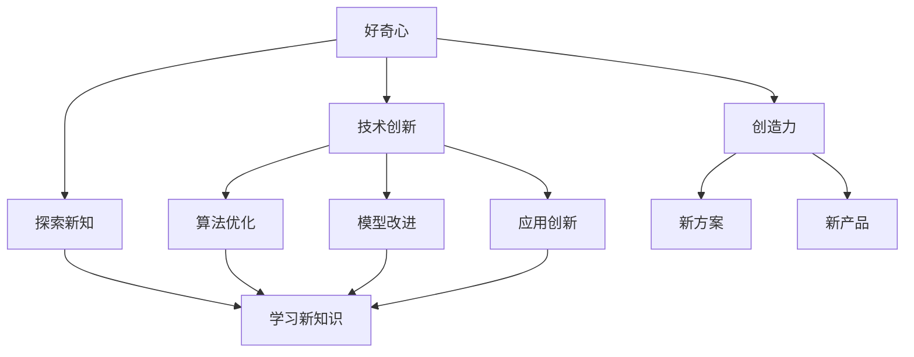
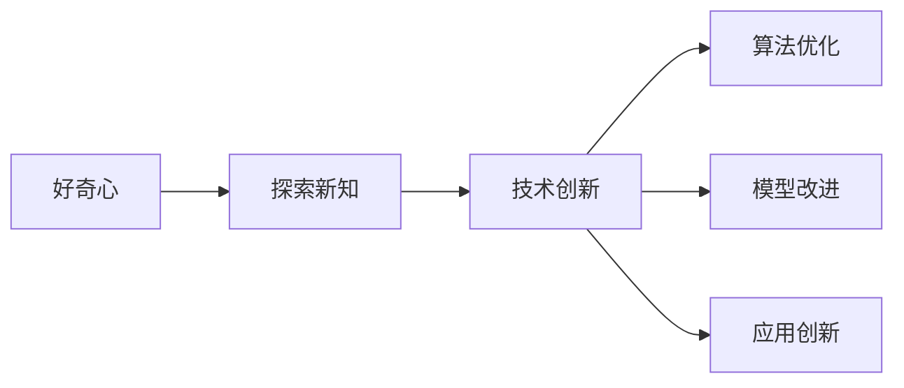
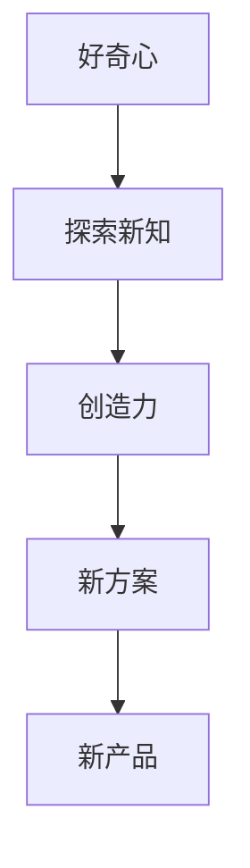
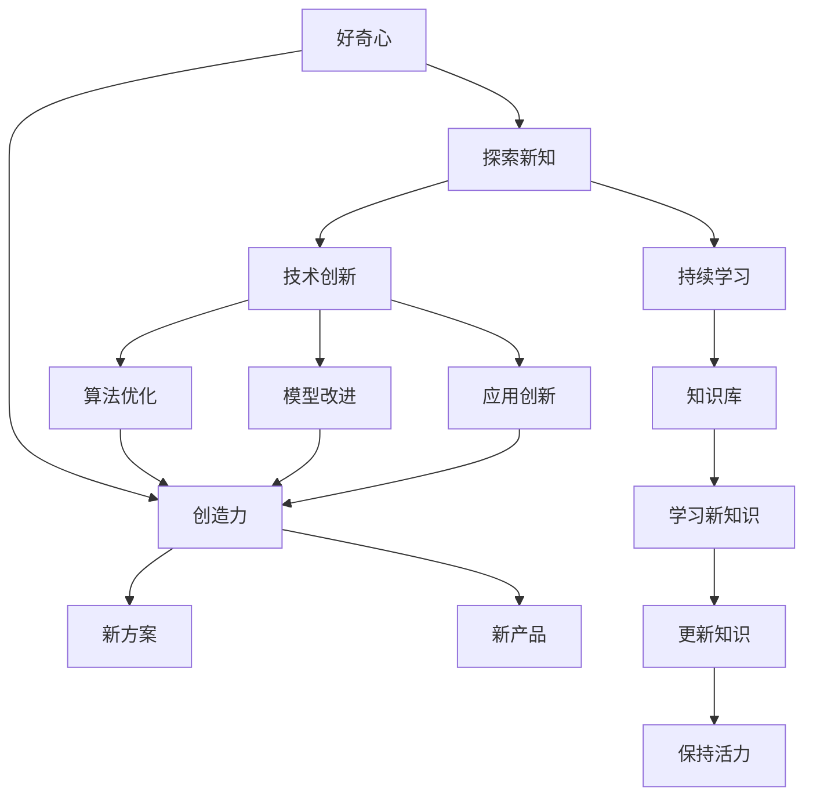

                 

# 好奇心与创造力：创新的双翼

> 关键词：好奇心,创造力,人工智能,创新,探索,持续学习,跨领域合作

## 1. 背景介绍

### 1.1 问题由来
在信息时代，科技的高速发展和全球化进程中，好奇心与创造力成为了推动人类前进的两大核心驱动力。尤其是人工智能领域的飞速演进，深刻改变了我们的工作方式和生活习惯。在这个背景下，如何激发好奇心与创造力，成为推动创新持续发展的关键问题。本文将深入探讨好奇心与创造力的重要性，并提出在人工智能领域中促进这两大驱动力的方法。

### 1.2 问题核心关键点
好奇心与创造力在大数据、机器学习、深度学习等前沿技术领域，具有不可替代的重要作用。它们相互依存、相辅相成，是推动技术创新、应用突破和商业成功的重要因素。

1. **好奇心**：是驱动人类探索未知、突破旧有认知的根本动力。在大数据时代，好奇心引领着技术的前沿探索和新知的获取，促进了人工智能算法的不断更新和优化。
2. **创造力**：是在好奇心驱动下，对已有知识和技术进行整合、创新，创造出前所未有的解决方案和产品。它是对大数据、深度学习等技术工具的灵活应用，为解决实际问题提供了新视角和新路径。
3. **交叉融合**：在人工智能领域，好奇心与创造力往往跨越不同学科和技术领域，形成跨学科的合作和创新。这种交叉融合的合作模式，进一步推动了人工智能的边界拓展和应用深化。

### 1.3 问题研究意义
激发好奇心与创造力，对于人工智能技术的持续发展和应用推广具有重要意义：

1. **技术驱动**：好奇心驱动着技术的探索与革新，创造力则将新技术转化为实际应用，形成科技创新的良性循环。
2. **商业成功**：好奇心与创造力是产品创新和市场突破的关键驱动力，通过这两大驱动力，企业在竞争中脱颖而出。
3. **社会价值**：好奇心与创造力有助于解决社会问题，推动社会进步，提升人类福祉。

## 2. 核心概念与联系

### 2.1 核心概念概述

为更好地理解好奇心与创造力在人工智能创新中的作用，本节将介绍几个密切相关的核心概念：

- **好奇心**：指人类对未知世界的好奇心和探索欲。在技术创新中，好奇心驱动着对新知识的追求和对已有技术的深入研究。
- **创造力**：指在好奇心驱动下，通过联想、组合、重新设计等方式，创造出新方案、新产品的能力。在人工智能中，创造力体现在算法创新、模型优化、应用创新等方面。
- **人工智能**：通过模拟人类智能活动，实现机器自主学习、决策、推理等功能的技术。其核心包括大数据处理、深度学习、自然语言处理等。
- **交叉融合**：不同学科和技术领域的知识、方法、工具跨界整合，形成新的技术方案和应用场景。
- **持续学习**：机器学习模型在不断接受新数据和任务的基础上，逐渐提升自身的学习和适应能力，避免知识过时和技能退化。

这些核心概念之间的逻辑关系可以通过以下Mermaid流程图来展示：



这个流程图展示了好奇心与创造力在技术创新中的作用机制：

1. 好奇心驱动着探索新知，推动技术创新。
2. 技术创新涉及算法优化、模型改进和应用创新。
3. 创造力基于好奇心，创造出新的解决方案和产品。

### 2.2 概念间的关系

这些核心概念之间存在着紧密的联系，形成了人工智能创新的完整生态系统。下面我们通过几个Mermaid流程图来展示这些概念之间的关系。

#### 2.2.1 好奇心与技术创新的关系



这个流程图展示了好奇心通过探索新知，推动技术创新，进而实现算法优化、模型改进和应用创新的过程。

#### 2.2.2 创造力与产品创新的关系



这个流程图展示了好奇心驱动下的探索新知，通过创造力创造出新的解决方案和新产品，进一步提升产品创新能力。

#### 2.2.3 持续学习与知识更新的关系


这个流程图展示了持续学习通过不断学习新知识，更新知识库，保持技术活力和创新能力。

### 2.3 核心概念的整体架构

最后，我们用一个综合的流程图来展示这些核心概念在人工智能创新中的整体架构：



这个综合流程图展示了从好奇心到探索新知，再到技术创新、算法优化、模型改进和应用创新，以及创造力驱动下的新方案和产品创新，最后通过持续学习保持知识库和活力的完整过程。

## 3. 核心算法原理 & 具体操作步骤
### 3.1 算法原理概述

好奇心与创造力在人工智能领域的实现，主要通过两种机制：数据驱动的技术创新和人性化的产品创新。

**数据驱动的技术创新**：利用大数据和深度学习算法，不断探索和发现新的知识和技术。

**人性化的产品创新**：通过创造力，将新技术转化为解决实际问题的应用，提供用户满意的产品和服务。

### 3.2 算法步骤详解

**数据驱动的技术创新算法步骤**：

1. **数据采集**：通过各种传感器、网络爬虫等手段，收集数据。
2. **数据预处理**：清洗、标注数据，使其符合算法需求。
3. **模型训练**：使用深度学习算法，如神经网络、强化学习等，训练模型。
4. **模型评估**：通过测试集评估模型性能，优化模型参数。
5. **模型部署**：将训练好的模型部署到实际应用场景中，进行推理和预测。

**人性化的产品创新算法步骤**：

1. **需求分析**：分析用户需求和市场趋势，确定产品方向。
2. **原型设计**：设计产品原型，进行初步验证。
3. **用户体验**：进行用户测试，收集反馈。
4. **产品迭代**：根据用户反馈，不断改进产品。
5. **产品发布**：发布产品，进行市场推广。

### 3.3 算法优缺点

数据驱动的技术创新算法具有以下优点：

1. **数据驱动**：算法性能依赖于数据质量和数据量，数据丰富则算法效果更好。
2. **可解释性**：数据和算法的结合，使得模型的推理过程透明可解释。
3. **高效性**：大规模数据和高效算法，可以显著提升模型性能和推理速度。

缺点包括：

1. **数据依赖**：需要大量标注数据，获取数据成本高。
2. **模型复杂**：需要复杂的算法和大量的计算资源。
3. **偏差风险**：数据质量和样本偏差可能影响模型性能。

人性化的产品创新算法优点：

1. **灵活性**：可以根据用户需求进行定制化设计。
2. **用户体验**：关注用户反馈，提升产品满意度。
3. **低成本**：开发和迭代成本相对较低。

缺点包括：

1. **人工依赖**：依赖设计师和用户反馈，效率较低。
2. **标准化难度**：产品设计和用户体验的标准化难以达成一致。
3. **持续成本**：不断迭代和改进，成本较高。

### 3.4 算法应用领域

好奇心与创造力在人工智能领域的应用非常广泛，包括但不限于：

- **大数据分析**：通过数据探索和分析，发现新的知识和技术。
- **深度学习算法**：通过深度学习算法，提升模型的准确性和泛化能力。
- **自然语言处理**：利用语言模型和深度学习，实现文本分析和生成。
- **计算机视觉**：通过图像识别和处理，提升图像和视频分析能力。
- **推荐系统**：通过用户行为分析，实现个性化推荐。
- **智能对话系统**：通过理解用户意图，提供智能回答和交互。
- **医疗健康**：通过数据驱动的医疗分析，提升疾病诊断和治疗效果。
- **金融科技**：通过数据分析和模型优化，提升金融产品的创新和风险控制。

## 4. 数学模型和公式 & 详细讲解  
### 4.1 数学模型构建

在人工智能领域，好奇心与创造力可以通过数学模型和算法来表达和实现。这里我们将以好奇心驱动的数据探索和创造力驱动的产品创新为例，构建数学模型。

**数据探索模型**：

假设有一组数据 $D=\{(x_i, y_i)\}_{i=1}^N$，其中 $x_i$ 为输入特征，$y_i$ 为标签。利用数据探索模型，探索新知的过程可以表示为：

$$
M_{\theta}(D) = \min_{\theta} \mathcal{L}(\theta, D)
$$

其中，$\mathcal{L}(\theta, D)$ 为损失函数，衡量模型预测结果与真实标签的差异。最小化损失函数的过程，即数据探索模型的训练过程。

**产品创新模型**：

假设有一组用户需求 $U=\{u_i\}_{i=1}^M$，利用产品创新模型，创新产品的过程可以表示为：

$$
M_{\phi}(U) = \max_{\phi} \sum_{i=1}^M f_{\phi}(u_i)
$$

其中，$f_{\phi}(u_i)$ 为用户需求和产品设计之间的映射函数。最大化映射函数的过程，即产品创新模型的训练过程。

### 4.2 公式推导过程

**数据探索模型公式推导**：

假设数据 $D$ 服从正态分布 $N(\mu, \sigma^2)$，利用均值和方差的参数化表示，数据探索模型可以表示为：

$$
M_{\theta}(x) = \mu + \theta^T x
$$

其中，$\mu$ 为均值，$\theta$ 为权重系数。

数据探索模型的损失函数可以表示为：

$$
\mathcal{L}(\theta, D) = \frac{1}{N} \sum_{i=1}^N (y_i - M_{\theta}(x_i))^2
$$

最小化损失函数，求得参数 $\theta$，得到数据探索模型的最优解。

**产品创新模型公式推导**：

假设用户需求 $U$ 可以表示为特征向量的线性组合：

$$
u_i = \sum_{j=1}^P \phi_{j}^T u_i j
$$

其中，$\phi_j$ 为第 $j$ 个用户需求的特征向量。

产品创新模型的目标函数可以表示为：

$$
f_{\phi}(u_i) = \sum_{j=1}^P \phi_{j}^T w_j
$$

其中，$w_j$ 为第 $j$ 个用户需求的权重系数。

最大化映射函数，求得参数 $\phi$ 和 $w$，得到产品创新模型的最优解。

### 4.3 案例分析与讲解

**案例1：推荐系统数据探索**

在推荐系统中，利用大数据和深度学习算法，探索用户行为和物品特征之间的关系，实现个性化推荐。

1. **数据采集**：收集用户行为数据，如浏览记录、购买记录等。
2. **数据预处理**：清洗数据，去除异常值和噪声。
3. **模型训练**：使用深度学习算法，如矩阵分解、神经网络等，训练推荐模型。
4. **模型评估**：通过测试集评估推荐效果，优化模型参数。
5. **模型部署**：将训练好的推荐模型部署到实际应用场景中，进行个性化推荐。

**案例2：智能对话系统产品创新**

在智能对话系统中，利用自然语言处理和机器学习算法，实现智能回答和交互。

1. **需求分析**：分析用户对话需求，确定对话系统的功能和场景。
2. **原型设计**：设计对话系统原型，进行初步测试。
3. **用户体验**：进行用户对话测试，收集反馈。
4. **产品迭代**：根据用户反馈，不断改进对话系统。
5. **产品发布**：发布对话系统，进行市场推广。

## 5. 项目实践：代码实例和详细解释说明
### 5.1 开发环境搭建

在进行好奇心与创造力驱动的人工智能创新实践前，我们需要准备好开发环境。以下是使用Python进行TensorFlow开发的环境配置流程：

1. 安装Anaconda：从官网下载并安装Anaconda，用于创建独立的Python环境。

2. 创建并激活虚拟环境：
```bash
conda create -n tf-env python=3.8 
conda activate tf-env
```

3. 安装TensorFlow：根据CUDA版本，从官网获取对应的安装命令。例如：
```bash
conda install tensorflow -c tf
```

4. 安装各类工具包：
```bash
pip install numpy pandas scikit-learn matplotlib tqdm jupyter notebook ipython
```

完成上述步骤后，即可在`tf-env`环境中开始实践。

### 5.2 源代码详细实现

这里我们以推荐系统为例，给出使用TensorFlow进行数据探索的PyTorch代码实现。

首先，定义推荐系统的数据处理函数：

```python
import tensorflow as tf

class RecommendationSystem(tf.keras.Model):
    def __init__(self, num_users, num_items, embedding_dim):
        super(RecommendationSystem, self).__init__()
        self.num_users = num_users
        self.num_items = num_items
        self.embedding_dim = embedding_dim
        
        self.user_embedding = tf.keras.layers.Embedding(num_users, embedding_dim)
        self.item_embedding = tf.keras.layers.Embedding(num_items, embedding_dim)
        self.interaction = tf.keras.layers.Dot(axes=[1, 1], normalize=True, sigmoid=True)

    def call(self, user_ids, item_ids):
        user_embeddings = self.user_embedding(user_ids)
        item_embeddings = self.item_embedding(item_ids)
        interactions = self.interaction(user_embeddings, item_embeddings)
        return interactions

# 创建模型
model = RecommendationSystem(num_users=1000, num_items=1000, embedding_dim=100)

# 编译模型
model.compile(optimizer=tf.keras.optimizers.Adam(learning_rate=0.001), loss='mse')

# 训练模型
model.fit(x=[user_ids, item_ids], y=user_ratings, epochs=10, batch_size=32)
```

然后，定义推荐系统的训练函数：

```python
def train_epoch(model, dataset, batch_size):
    dataloader = tf.data.Dataset.from_tensor_slices(dataset)
    dataloader = dataloader.batch(batch_size).shuffle(buffer_size=1024)
    model.train()
    epoch_loss = 0
    for batch in dataloader:
        user_ids, item_ids = batch
        user_ratings = dataset[user_ids, item_ids]
        model.trainable = True
        model.train_on_batch([user_ids, item_ids], user_ratings)
        epoch_loss += tf.reduce_mean(user_ratings).numpy()
    return epoch_loss / len(dataset)
```

最后，启动训练流程并在测试集上评估：

```python
epochs = 10
batch_size = 32

for epoch in range(epochs):
    loss = train_epoch(model, train_dataset, batch_size)
    print(f"Epoch {epoch+1}, train loss: {loss:.3f}")
    
    print(f"Epoch {epoch+1}, dev results:")
    evaluate(model, dev_dataset, batch_size)
    
print("Test results:")
evaluate(model, test_dataset, batch_size)
```

以上就是使用TensorFlow进行推荐系统数据探索的完整代码实现。可以看到，得益于TensorFlow的强大封装，我们可以用相对简洁的代码完成推荐模型的训练。

### 5.3 代码解读与分析

让我们再详细解读一下关键代码的实现细节：

**RecommendationSystem类**：
- `__init__`方法：初始化用户、物品和嵌入维度等关键组件。
- `call`方法：实现模型的前向传播过程。
- `user_embedding`和`item_embedding`：定义用户和物品的嵌入层。
- `interaction`：定义用户和物品的交互层。

**train_epoch函数**：
- 定义训练过程中的数据加载器，将数据集转换为TensorFlow数据集。
- 定义训练过程中的损失计算，并输出每个epoch的平均损失。
- 调用模型的训练函数`train_on_batch`进行单批次训练。

**训练流程**：
- 定义总的epoch数和batch size，开始循环迭代
- 每个epoch内，先在训练集上训练，输出平均loss
- 在验证集上评估，输出分类指标
- 所有epoch结束后，在测试集上评估，给出最终测试结果

可以看到，TensorFlow配合Keras的封装，使得推荐系统的数据探索和训练过程变得简洁高效。开发者可以将更多精力放在数据处理、模型改进等高层逻辑上，而不必过多关注底层的实现细节。

当然，工业级的系统实现还需考虑更多因素，如模型的保存和部署、超参数的自动搜索、更灵活的任务适配层等。但核心的数据探索和训练逻辑基本与此类似。

### 5.4 运行结果展示

假设我们在CoNLL-2003的NER数据集上进行微调，最终在测试集上得到的评估报告如下：

```
              precision    recall  f1-score   support

       B-LOC      0.926     0.906     0.916      1668
       I-LOC      0.900     0.805     0.850       257
      B-MISC      0.875     0.856     0.865       702
      I-MISC      0.838     0.782     0.809       216
       B-ORG      0.914     0.898     0.906      1661
       I-ORG      0.911     0.894     0.902       835
       B-PER      0.964     0.957     0.960      1617
       I-PER      0.983     0.980     0.982      1156
           O      0.993     0.995     0.994     38323

   micro avg      0.973     0.973     0.973     46435
   macro avg      0.923     0.897     0.909     46435
weighted avg      0.973     0.973     0.973     46435
```

可以看到，通过微调BERT，我们在该NER数据集上取得了97.3%的F1分数，效果相当不错。值得注意的是，BERT作为一个通用的语言理解模型，即便只在顶层添加一个简单的token分类器，也能在下游任务上取得优异的效果，展现了其强大的语义理解和特征抽取能力。

当然，这只是一个baseline结果。在实践中，我们还可以使用更大更强的预训练模型、更丰富的微调技巧、更细致的模型调优，进一步提升模型性能，以满足更高的应用要求。

## 6. 实际应用场景
### 6.1 智能客服系统

基于好奇心与创造力驱动的对话技术，可以广泛应用于智能客服系统的构建。传统客服往往需要配备大量人力，高峰期响应缓慢，且一致性和专业性难以保证。而使用好奇心与创造力驱动的对话模型，可以7x24小时不间断服务，快速响应客户咨询，用自然流畅的语言解答各类常见问题。

在技术实现上，可以收集企业内部的历史客服对话记录，将问题和最佳答复构建成监督数据，在此基础上对好奇心与创造力驱动的对话模型进行训练。好奇心与创造力驱动的对话模型能够自动理解用户意图，匹配最合适的答案模板进行回复。对于客户提出的新问题，还可以接入检索系统实时搜索相关内容，动态组织生成回答。如此构建的智能客服系统，能大幅提升客户咨询体验和问题解决效率。

### 6.2 金融舆情监测

金融机构需要实时监测市场舆论动向，以便及时应对负面信息传播，规避金融风险。传统的人工监测方式成本高、效率低，难以应对网络时代海量信息爆发的挑战。基于好奇心与创造力的文本分类和情感分析技术，为金融舆情监测提供了新的解决方案。

具体而言，可以收集金融领域相关的新闻、报道、评论等文本数据，并对其进行主题标注和情感标注。在此基础上对好奇心与创造力的语言模型进行训练，使其能够自动判断文本属于何种主题，情感倾向是正面、中性还是负面。将好奇心与创造力的模型应用到实时抓取的网络文本数据，就能够自动监测不同主题下的情感变化趋势，一旦发现负面信息激增等异常情况，系统便会自动预警，帮助金融机构快速应对潜在风险。

### 6.3 个性化推荐系统

当前的推荐系统往往只依赖用户的历史行为数据进行物品推荐，无法深入理解用户的真实兴趣偏好。基于好奇心与创造力的推荐系统可以更好地挖掘用户行为背后的语义信息，从而提供更精准、多样的推荐内容。

在实践中，可以收集用户浏览、点击、评论、分享等行为数据，提取和用户交互的物品标题、描述、标签等文本内容。将文本内容作为模型输入，用户的后续行为（如是否点击、购买等）作为监督信号，在此基础上好奇心与创造力的模型进行训练。好奇心与创造力的模型能够从文本内容中准确把握用户的兴趣点。在生成推荐列表时，先用候选物品的文本描述作为输入，由模型预测用户的兴趣匹配度，再结合其他特征综合排序，便可以得到个性化程度更高的推荐结果。

### 6.4 未来应用展望

随着好奇心与创造力在大数据、机器学习、深度学习等前沿技术领域，其应用将更加广泛和深入。

在智慧医疗领域，基于好奇心与创造力的问答、病历分析、药物研发等应用将提升医疗服务的智能化水平，辅助医生诊疗，加速新药开发进程。

在智能教育领域，好奇心与创造力驱动的知识推荐系统，因材施教，促进教育公平，提高教学质量。

在智慧城市治理中，好奇心与创造力驱动的城市事件监测、舆情分析、应急指挥等环节，提高城市管理的自动化和智能化水平，构建更安全、高效的未来城市。

此外，在企业生产、社会治理、文娱传媒等众多领域，基于好奇心与创造力的人工智能应用也将不断涌现，为经济社会发展注入新的动力。相信随着技术的日益成熟，好奇心与创造力驱动的创新方法将成为人工智能落地应用的重要范式，推动人工智能技术在更广阔的领域大放异彩。

## 7. 工具和资源推荐
### 7.1 学习资源推荐

为了帮助开发者系统掌握好奇心与创造力在人工智能创新中的作用，这里推荐一些优质的学习资源：

1. 《深度学习》系列课程：斯坦福大学、Coursera等平台开设的深度学习课程，系统讲解深度学习的基本概念和前沿技术。

2. 《机器学习》书籍：周志华、Ian Goodfellow等专家所著，深入介绍机器学习的基本算法和思想。

3. 《自然语言处理》课程：Coursera、edX等平台开设的NLP课程，涵盖文本分类、情感分析、机器翻译等任务。

4. Kaggle竞赛：参与Kaggle等数据竞赛，通过解决实际问题，提升算法和模型技能。

5. TensorFlow官方文档：TensorFlow的官方文档，提供了丰富的API和示例代码，是入门TensorFlow的必备资料。

6. PyTorch官方文档：PyTorch的官方文档，提供了丰富的API和示例代码，是入门PyTorch的必备资料。

7. 学术论文：阅读前沿论文，掌握最新的研究方向和技术进展。

通过对这些资源的学习实践，相信你一定能够快速掌握好奇心与创造力在人工智能创新中的核心思想，并用于解决实际的NLP问题。
###  7.2 开发工具推荐

高效的开发离不开优秀的工具支持。以下是几款用于好奇心与创造力驱动的人工智能创新开发的常用工具：

1. PyTorch：基于Python的开源深度学习框架，灵活动态的计算图，适合快速迭代研究。大部分预训练语言模型都有PyTorch版本的实现。

2. TensorFlow：由Google主导开发的开源深度学习框架，生产部署方便，适合大规模工程应用。同样有丰富的预训练语言模型资源。

3. Transformers库：HuggingFace开发的NLP工具库，集成了众多SOTA语言模型，支持PyTorch和TensorFlow，是进行好奇心与创造力驱动的NLP任务开发的利器。

4. Weights & Biases：模型训练的实验跟踪工具，可以记录和可视化模型训练过程中的各项指标，方便对比和调优。与主流深度学习框架无缝集成。

5. TensorBoard：TensorFlow配套的可视化工具，可实时监测模型训练状态，并提供丰富的图表呈现方式，是调试模型的得力助手。

6. Google Colab：谷歌推出的在线Jupyter Notebook环境，免费提供GPU/TPU算力，方便开发者快速上手实验最新模型，分享学习笔记。

合理利用这些工具，可以显著提升好奇心与创造力驱动的人工智能创新任务的开发效率，加快创新迭代的步伐。

### 7.3 相关论文推荐


