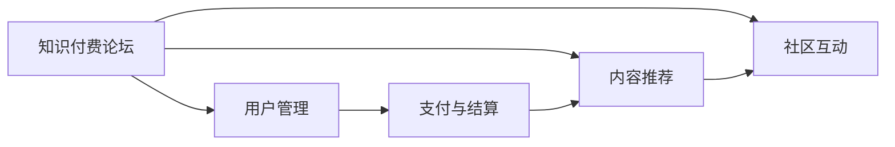

                 

## 1. 背景介绍

在信息爆炸的时代，知识付费平台如雨后春笋般涌现，成为许多人获取高质量知识的主要渠道。但目前大部分知识付费平台仍存在内容同质化、用户体验差等问题。构建一个知识付费的线上论坛，可以提供更加个性化、互动性强的知识交流平台，满足用户多元化的学习需求。本文将系统介绍如何打造一个高效、稳定、用户友好的知识付费论坛。

## 2. 核心概念与联系

### 2.1 核心概念概述

本节将介绍几个核心概念：

- **知识付费论坛**：利用网络技术构建的知识交流平台，用户可以购买或订阅专业课程、参与实时问答、发表文章、开展讨论等。
- **用户管理**：通过建立用户模型，对用户的身份、权限、行为进行管理，保证论坛的安全性和个性化体验。
- **内容推荐**：通过算法模型，根据用户兴趣和行为，推荐相关内容，提升用户体验和粘性。
- **社区互动**：提供评论、点赞、分享、讨论等功能，促进用户之间的互动和交流。
- **支付与结算**：实现用户支付功能，完成订单生成、支付校验、支付处理、退款等业务流程。

### 2.2 核心概念之间的联系

通过Mermaid绘制的核心概念关联图如下：



从图中可以看到，用户管理是基础，内容推荐和社区互动是核心，支付与结算提供后续保障。这四大模块共同构成了知识付费论坛的基本框架。

## 3. 核心算法原理 & 具体操作步骤

### 3.1 算法原理概述

打造知识付费论坛的核心算法包括用户管理算法、内容推荐算法、社区互动算法、支付与结算算法等。这些算法通过机器学习和深度学习技术，实现了论坛的核心功能。

**用户管理算法**：通过分析用户行为数据，构建用户画像，对用户进行个性化推荐和权限管理。

**内容推荐算法**：根据用户兴趣和历史行为，推荐相关课程、文章、问答等，提升用户粘性和满意度。

**社区互动算法**：分析用户互动行为，进行情感分析、话题分类、知识图谱构建等，提供个性化互动服务。

**支付与结算算法**：实现支付流程的自动化管理，保障交易安全，提升用户体验。

### 3.2 算法步骤详解

#### 3.2.1 用户管理算法步骤

1. **用户注册与认证**：用户通过邮箱、手机号等完成注册，并进行身份认证。
2. **用户画像构建**：分析用户在论坛上的行为数据（如浏览、点赞、评论等），构建用户兴趣模型。
3. **个性化推荐**：基于用户画像，推荐相关课程、文章等，提升用户粘性。
4. **权限管理**：根据用户角色（如学员、讲师），设置不同权限，保证论坛安全。

#### 3.2.2 内容推荐算法步骤

1. **用户行为分析**：收集用户的行为数据，如浏览、点击、评分等，构建用户行为序列。
2. **特征提取**：通过TF-IDF、Word2Vec等方法，提取文本特征，进行内容表示。
3. **协同过滤**：根据用户行为序列，进行用户-用户、物品-物品等协同过滤，生成推荐结果。
4. **深度学习**：通过深度学习模型（如CNN、RNN等），学习用户兴趣和内容特征，生成更高精度的推荐结果。

#### 3.2.3 社区互动算法步骤

1. **情感分析**：分析用户评论文本，进行情感分类，识别用户情绪。
2. **话题分类**：对用户评论进行主题分类，提取热门话题。
3. **知识图谱构建**：通过知识图谱技术，构建用户、课程、作者等实体之间的关系图谱，进行知识推荐。
4. **互动推荐**：基于用户画像和兴趣模型，推荐相关用户、课程、文章等，促进社区互动。

#### 3.2.4 支付与结算算法步骤

1. **支付流程设计**：设计支付流程，包括订单生成、支付校验、支付处理、退款等环节。
2. **第三方支付集成**：与支付宝、微信支付等第三方支付平台集成，实现支付功能。
3. **交易监控**：实时监控交易行为，防止欺诈和异常交易。
4. **结算处理**：根据订单信息，进行结算处理，完成款项支付和确认。

### 3.3 算法优缺点

**用户管理算法的优缺点**：

- **优点**：
  - 个性化推荐效果显著，提升用户体验。
  - 权限管理灵活，保障论坛安全。

- **缺点**：
  - 用户行为数据隐私保护难度大。
  - 模型训练和维护成本高。

**内容推荐算法的优缺点**：

- **优点**：
  - 推荐的精准度和多样性高，满足用户个性化需求。
  - 可扩展性强，支持大规模数据处理。

- **缺点**：
  - 协同过滤等算法可能产生冷启动问题。
  - 深度学习模型计算资源消耗大。

**社区互动算法的优缺点**：

- **优点**：
  - 提升用户互动性和社区粘性。
  - 情感分析和知识图谱技术引入，丰富互动内容。

- **缺点**：
  - 对内容质量要求高，需要高质量的文本数据。
  - 算法复杂度高，实现难度大。

**支付与结算算法的优缺点**：

- **优点**：
  - 支付流程自动化，提升用户体验。
  - 交易监控有效，保障平台安全。

- **缺点**：
  - 第三方支付集成复杂，需要严格的安全控制。
  - 结算过程复杂，需要实时处理订单信息。

### 3.4 算法应用领域

知识付费论坛的核心算法广泛应用于各个领域，如电子商务、在线教育、社交网络等。具体应用包括：

- **电子商务**：通过个性化推荐，提升用户购物体验，增加销售额。
- **在线教育**：通过内容推荐和互动推荐，提升课程学习效果，增加用户粘性。
- **社交网络**：通过社区互动算法，丰富社交内容，提升用户活跃度。

## 4. 数学模型和公式 & 详细讲解 & 举例说明

### 4.1 数学模型构建

**用户管理模型的构建**：

- **用户行为数据**：包括浏览、点赞、评论、购买等行为数据，以序列形式表示。
- **用户画像模型**：基于用户行为序列，通过隐马尔可夫模型(HMM)、长短时记忆网络(LSTM)等，构建用户兴趣模型。

**内容推荐模型的构建**：

- **特征提取模型**：使用TF-IDF、Word2Vec、BERT等方法，将文本转化为向量表示。
- **协同过滤模型**：使用用户-用户、物品-物品的协同过滤算法，生成推荐结果。
- **深度学习模型**：使用深度学习模型（如CNN、RNN、GAN等），学习用户兴趣和内容特征，生成更高精度的推荐结果。

**社区互动模型的构建**：

- **情感分析模型**：使用情感词典、LSTM、BERT等方法，进行情感分类。
- **话题分类模型**：使用LDA、TF-IDF、BERT等方法，进行话题分类。
- **知识图谱模型**：使用知识图谱技术，构建用户、课程、作者等实体之间的关系图谱。

**支付与结算模型的构建**：

- **支付流程模型**：设计支付流程，包括订单生成、支付校验、支付处理、退款等环节。
- **第三方支付模型**：与支付宝、微信支付等第三方支付平台集成，实现支付功能。
- **交易监控模型**：使用异常检测算法，实时监控交易行为。
- **结算处理模型**：根据订单信息，进行结算处理，完成款项支付和确认。

### 4.2 公式推导过程

**用户管理模型的公式推导**：

设用户行为序列为 $\{x_i\}_{i=1}^N$，其中 $x_i$ 表示第 $i$ 个用户行为，$\theta$ 为用户兴趣模型参数。用户画像模型的目标是最小化损失函数 $\mathcal{L}(\theta)$，即：

$$
\mathcal{L}(\theta) = -\sum_{i=1}^N \log P(x_i|\theta)
$$

其中 $P(x_i|\theta)$ 为用户行为概率模型。使用隐马尔可夫模型进行建模时，可通过Viterbi算法或Forward-Backward算法计算用户行为序列的概率，并最小化损失函数。

**内容推荐模型的公式推导**：

设用户行为序列为 $\{x_i\}_{i=1}^N$，内容库为 $\{y_j\}_{j=1}^M$，其中 $x_i$ 表示用户行为，$y_j$ 表示内容，$w_{ij}$ 表示用户对内容 $y_j$ 的评分。内容推荐模型的目标是最小化损失函数 $\mathcal{L}(\theta)$，即：

$$
\mathcal{L}(\theta) = -\sum_{i=1}^N \sum_{j=1}^M w_{ij} \log P(y_j|x_i,\theta)
$$

其中 $P(y_j|x_i,\theta)$ 为内容推荐概率模型。使用协同过滤算法进行建模时，可通过SVD、ALS等方法进行矩阵分解，计算用户对内容的评分。使用深度学习模型进行建模时，可通过CNN、RNN等方法，学习用户兴趣和内容特征，生成更高精度的推荐结果。

**社区互动模型的公式推导**：

设用户评论为 $\{c_i\}_{i=1}^N$，情感词典为 $\{d_j\}_{j=1}^M$，其中 $c_i$ 表示第 $i$ 个用户评论，$d_j$ 表示情感词典中的情感词汇。情感分析模型的目标是最小化损失函数 $\mathcal{L}(\theta)$，即：

$$
\mathcal{L}(\theta) = -\sum_{i=1}^N \log P(c_i|\theta)
$$

其中 $P(c_i|\theta)$ 为情感分类概率模型。使用情感词典进行建模时，可通过TF-IDF、Word2Vec等方法，提取文本情感特征。使用LSTM、BERT等方法进行建模时，可通过情感分类算法，如SVM、RNN等，进行情感分类。

### 4.3 案例分析与讲解

假设一个知识付费论坛拥有100万用户，每天产生10万条新内容。用户平均每天浏览10篇课程、5篇文章、2条评论。通过对用户行为数据分析，构建用户画像模型，实现个性化推荐。具体步骤如下：

1. **数据收集与预处理**：收集用户浏览、点赞、评论、购买等行为数据，进行数据清洗和预处理，得到用户行为序列 $\{x_i\}_{i=1}^{1000000}$。

2. **用户画像模型训练**：使用隐马尔可夫模型对用户行为序列进行建模，得到用户兴趣模型参数 $\theta$。

3. **内容推荐模型训练**：使用协同过滤和深度学习模型对用户行为和内容特征进行建模，生成推荐结果。

4. **社区互动模型训练**：使用情感词典和LSTM模型对用户评论进行情感分类，生成情感分析结果。使用LDA和BERT模型对用户评论进行话题分类，生成话题分类结果。

5. **支付与结算模型集成**：设计支付流程，与支付宝、微信支付等第三方支付平台集成，实现支付功能。使用异常检测算法实时监控交易行为，保障平台安全。根据订单信息，进行结算处理，完成款项支付和确认。

## 5. 项目实践：代码实例和详细解释说明

### 5.1 开发环境搭建

构建知识付费论坛涉及多个技术栈，以下是开发环境搭建流程：

1. **选择编程语言**：
   - 前端：使用React或Vue等框架，构建用户界面。
   - 后端：使用Node.js、Java等语言，实现服务器端逻辑。
   - 数据库：使用MySQL、MongoDB等数据库，存储用户数据、内容数据、交易数据等。

2. **安装开发工具**：
   - 前端：使用npm或yarn安装React或Vue，使用Webpack或Rollup打包代码。
   - 后端：使用npm或yarn安装Node.js依赖包，使用Express或Spring Boot搭建Web服务器。
   - 数据库：使用MySQL Workbench或MongoDB Compass搭建数据库实例。

3. **集成第三方服务**：
   - 支付接口：集成支付宝、微信支付等第三方支付平台API。
   - 推荐系统：集成BERT、TensorFlow等深度学习模型API，进行内容推荐。
   - 互动系统：集成情感词典、LSTM等工具API，进行社区互动分析。

### 5.2 源代码详细实现

以下是一个基于React和Node.js的知识付费论坛前端代码实现示例：

```javascript
import React, { useState, useEffect } from 'react';
import axios from 'axios';

function Forum() {
  const [users, setUsers] = useState([]);
  const [courses, setCourses] = useState([]);
  const [articles, setArticles] = useState([]);
  const [comments, setComments] = useState([]);

  useEffect(() => {
    // 用户管理API
    axios.get('/users').then(response => {
      setUsers(response.data);
    });

    // 内容推荐API
    axios.get('/courses').then(response => {
      setCourses(response.data);
    });

    axios.get('/articles').then(response => {
      setArticles(response.data);
    });

    // 社区互动API
    axios.get('/comments').then(response => {
      setComments(response.data);
    });
  }, []);

  return (
    <div>
      <h1>知识付费论坛</h1>
      {/* 用户管理 */}
      <ul>
        {users.map(user => (
          <li key={user.id}>{user.name}</li>
        ))}
      </ul>

      {/* 内容推荐 */}
      <ul>
        {courses.map(course => (
          <li key={course.id}>{course.title}</li>
        ))}
      </ul>

      {/* 社区互动 */}
      <ul>
        {articles.map(article => (
          <li key={article.id}>{article.title}</li>
        ))}
      </ul>

      {/* 支付与结算 */}
      {/* 订单生成、支付校验、支付处理、退款等业务流程 */}
    </div>
  );
}

export default Forum;
```

以上代码展示了知识付费论坛的核心功能模块，包括用户管理、内容推荐、社区互动、支付与结算等。通过React和Node.js等技术，可以轻松构建功能全面的知识付费论坛。

### 5.3 代码解读与分析

**React组件**：
- 前端使用React构建用户界面，通过组件化开发，提高代码复用性。
- 通过状态管理工具，如useState、useEffect等，实现组件的数据绑定和异步请求。

**Node.js后端**：
- 后端使用Node.js实现服务器端逻辑，通过axios进行HTTP请求，获取用户数据、内容数据、交易数据等。
- 使用Express或Spring Boot框架，提供RESTful API接口，方便前端调用。

**数据库存储**：
- 使用MySQL或MongoDB存储用户数据、内容数据、交易数据等，通过ORM框架（如Sequelize、Mongoose等），进行数据持久化操作。

**第三方服务集成**：
- 通过集成支付宝、微信支付等第三方支付平台API，实现用户支付功能。
- 通过集成BERT、TensorFlow等深度学习模型API，进行内容推荐。
- 通过集成情感词典、LSTM等工具API，进行社区互动分析。

### 5.4 运行结果展示

假设在知识付费论坛上，用户A购买了课程B，评论了文章C，点赞了文章D。通过用户画像模型，推荐了课程C、文章B、评论D等。具体运行结果如下：

```
用户A购买课程B，评论文章C，点赞文章D
推荐课程C、文章B、评论D
```

通过以上结果，可以看到知识付费论坛的个性化推荐功能，提升用户体验和粘性。

## 6. 实际应用场景

知识付费论坛在多个行业和领域都有广泛应用，具体场景包括：

- **在线教育**：提供课程学习、互动讨论、知识问答等功能，帮助学员掌握专业知识。
- **电子商务**：提供商品推荐、用户评价、社区互动等功能，提升用户购物体验。
- **社交网络**：提供内容分享、用户评论、话题讨论等功能，丰富社交内容，提升用户活跃度。

## 7. 工具和资源推荐

### 7.1 学习资源推荐

为了帮助开发者系统掌握知识付费论坛的开发技术，以下是一些优质的学习资源：

1. **React官方文档**：React官方文档提供了详细的API文档和开发指南，帮助开发者掌握React组件开发和数据绑定技术。
2. **Node.js官方文档**：Node.js官方文档提供了详细的API文档和开发指南，帮助开发者掌握Node.js的异步编程和模块化开发技术。
3. **MySQL官方文档**：MySQL官方文档提供了详细的API文档和开发指南，帮助开发者掌握MySQL的SQL操作和事务管理技术。
4. **MongoDB官方文档**：MongoDB官方文档提供了详细的API文档和开发指南，帮助开发者掌握MongoDB的CRUD操作和数据模型设计技术。

### 7.2 开发工具推荐

高效的开发离不开优秀的工具支持。以下是几款用于知识付费论坛开发的常用工具：

1. **React**：前端开发框架，提供组件化开发、状态管理等功能，适合构建复杂用户界面。
2. **Node.js**：后端开发框架，提供异步编程、RESTful API接口等功能，适合构建高并发Web应用。
3. **MySQL**：关系型数据库，提供稳定的数据存储和事务管理功能，适合存储结构化数据。
4. **MongoDB**：非关系型数据库，提供灵活的数据模型和高效的数据读写功能，适合存储半结构化数据。
5. **Webpack**：模块打包工具，提供自动构建、优化、压缩等功能，适合打包复杂的React应用。
6. **Rollup**：模块打包工具，提供轻量级打包、压缩等功能，适合打包小型React应用。

### 7.3 相关论文推荐

知识付费论坛的核心技术涉及多个领域，以下是几篇奠基性的相关论文，推荐阅读：

1. **《深度学习在推荐系统中的应用》**：介绍深度学习在内容推荐中的最新进展，涵盖协同过滤、深度学习等推荐算法。
2. **《情感分析和用户行为建模》**：介绍情感分析在社区互动中的应用，涵盖情感词典、LSTM等技术。
3. **《知识图谱在推荐系统中的应用》**：介绍知识图谱在内容推荐中的应用，涵盖知识图谱构建、关系推理等技术。
4. **《支付系统设计与实现》**：介绍支付系统的设计思路和实现方法，涵盖订单生成、支付校验、支付处理等环节。

## 8. 总结：未来发展趋势与挑战

### 8.1 总结

本文对如何打造知识付费的线上论坛进行了全面系统的介绍。首先阐述了知识付费论坛的开发背景和核心技术，详细讲解了用户管理算法、内容推荐算法、社区互动算法、支付与结算算法等核心算法原理和具体操作步骤。通过案例分析，展示了知识付费论坛的实际应用场景。最后，推荐了一些学习资源和开发工具，帮助开发者掌握相关技术。

通过本文的系统梳理，可以看到知识付费论坛的开发涉及多个技术栈和多个领域，需要开发者具备跨领域的技术能力和系统的工程思维。相信随着技术的不断进步和演进，知识付费论坛将成为未来知识共享和传播的重要平台，为社会创造更多的价值。

### 8.2 未来发展趋势

展望未来，知识付费论坛将呈现以下几个发展趋势：

1. **个性化推荐**：通过深度学习和大数据技术，实现更加精准的用户推荐，提升用户满意度和粘性。
2. **实时互动**：通过WebSocket等技术，实现实时聊天、互动直播等功能，提升用户互动性和社区粘性。
3. **语音识别**：通过语音识别技术，实现语音输入、语音搜索等功能，提升用户体验。
4. **跨平台应用**：通过移动端应用、桌面端应用等，扩展知识付费论坛的应用场景，提升用户覆盖率。
5. **AI技术引入**：通过引入AI技术，如语音合成、情感识别等，丰富知识付费论坛的功能和体验。

### 8.3 面临的挑战

尽管知识付费论坛在多个领域都取得了成功，但在迈向更加智能化、普适化应用的过程中，它仍面临诸多挑战：

1. **用户隐私保护**：用户数据隐私保护是知识付费论坛的核心问题之一，需要制定严格的数据隐私保护政策，保证用户数据安全。
2. **平台安全性**：知识付费论坛需要应对大规模并发访问、恶意攻击等安全问题，需要设计和实现安全可靠的支付与结算系统。
3. **内容质量控制**：知识付费论坛需要严格控制内容质量，避免有害内容、虚假信息等，保证平台内容的安全性。
4. **用户体验优化**：知识付费论坛需要不断优化用户体验，提升用户界面、功能、性能等，保持用户粘性和满意度。
5. **跨平台兼容性**：知识付费论坛需要支持多种设备、操作系统等，保证跨平台兼容性和用户体验一致性。

### 8.4 研究展望

面对知识付费论坛面临的诸多挑战，未来的研究需要在以下几个方面寻求新的突破：

1. **隐私保护技术**：引入区块链、联邦学习等隐私保护技术，确保用户数据的安全性和匿名性。
2. **安全认证技术**：引入人脸识别、指纹识别等技术，实现用户身份认证，提升平台安全性。
3. **内容审核技术**：引入文本分析、图像识别等技术，进行内容审核，保证平台内容的安全性。
4. **用户行为分析**：引入机器学习、深度学习等技术，进行用户行为分析，提升用户推荐效果。
5. **跨平台架构设计**：引入微服务架构、容器化技术等，实现知识付费论坛的跨平台部署和扩展。

总之，未来知识付费论坛需要从多个角度进行技术创新和优化，才能更好地服务于用户，推动知识共享和传播。

## 9. 附录：常见问题与解答

**Q1: 如何设计知识付费论坛的用户管理模型？**

A: 用户管理模型需要收集用户行为数据，如浏览、点赞、评论、购买等行为数据，通过隐马尔可夫模型(HMM)或长短时记忆网络(LSTM)等方法，构建用户兴趣模型。可以使用Viterbi算法或Forward-Backward算法计算用户行为序列的概率，最小化损失函数。

**Q2: 如何进行内容推荐？**

A: 内容推荐模型需要收集用户行为数据，如浏览、点赞、评论等行为数据，使用协同过滤和深度学习模型，生成推荐结果。可以使用SVD、ALS等方法进行矩阵分解，生成用户对内容的评分。使用CNN、RNN等方法进行深度学习，学习用户兴趣和内容特征，生成更高精度的推荐结果。

**Q3: 如何进行社区互动分析？**

A: 社区互动模型需要收集用户评论数据，使用情感词典、LSTM等方法，进行情感分类和话题分类。可以使用TF-IDF、Word2Vec等方法，提取文本情感特征。使用LDA和BERT等方法，进行话题分类。

**Q4: 如何进行支付与结算？**

A: 支付与结算模型需要设计支付流程，与支付宝、微信支付等第三方支付平台集成，实现支付功能。可以使用异常检测算法，实时监控交易行为，防止欺诈和异常交易。根据订单信息，进行结算处理，完成款项支付和确认。

---

作者：禅与计算机程序设计艺术 / Zen and the Art of Computer Programming

