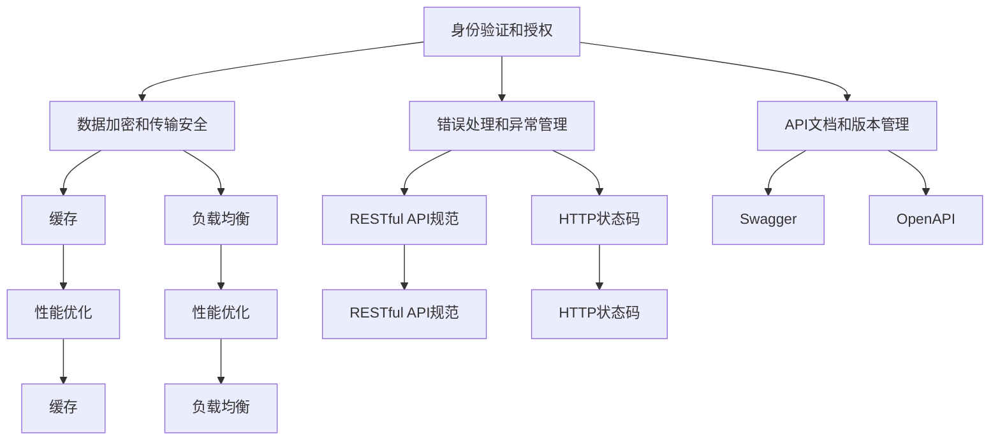
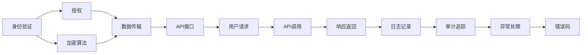
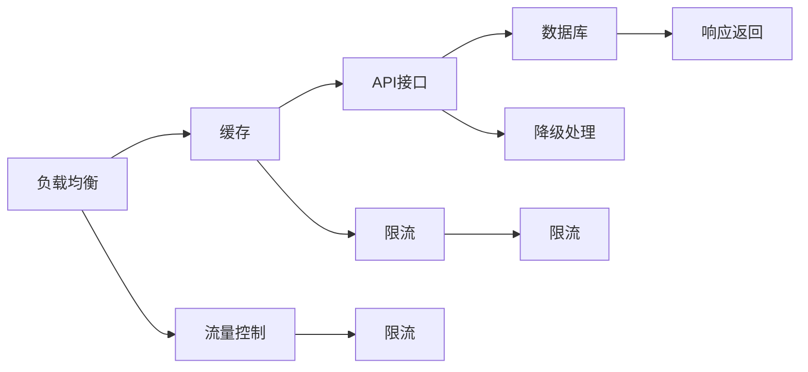
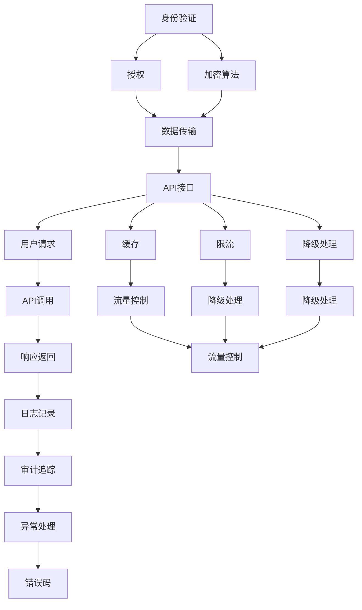

                 

## 1. 背景介绍

### 1.1 问题由来
在当今数字化时代，API（Application Programming Interface，应用程序编程接口）已成为连接不同系统和服务的重要桥梁。无论是企业内部系统之间的数据共享，还是云服务提供商与第三方应用之间的数据交换，API都发挥着至关重要的作用。然而，随着API的广泛应用，安全性和可靠性问题也日益凸显。

API安全问题包括数据泄露、未经授权访问、恶意攻击等，一旦出现这些问题，将导致严重的安全风险。API可靠性问题包括服务中断、数据丢失、性能下降等，这些问题不仅影响用户体验，还会造成严重的业务损失。因此，设计和实现安全可靠的API，是每个开发者和架构师必须面对的重要任务。

### 1.2 问题核心关键点
设计安全可靠的API，需要从以下几个方面进行综合考虑：

- **身份验证和授权**：确保只有经过身份验证和授权的用户才能访问API，避免未经授权的访问。
- **数据加密和传输安全**：确保数据在传输过程中不被窃听和篡改，采用安全的加密算法和传输协议。
- **错误处理和异常管理**：在出现错误和异常时，提供友好的错误信息和详细的错误码，帮助开发者快速定位问题。
- **API文档和版本管理**：提供清晰的API文档，便于开发者使用；同时进行版本管理，避免API版本混淆。
- **性能优化和负载均衡**：确保API在高并发情况下能够稳定运行，避免性能瓶颈。

### 1.3 问题研究意义
设计和实现安全可靠的API，对于保障系统的安全性、稳定性和可用性具有重要意义：

- 降低安全风险：通过严格的身份验证和授权机制，降低数据泄露和未经授权访问的风险，保护系统的安全。
- 提升用户体验：通过友好的错误处理和异常管理，提高API的可用性和稳定性，提升用户体验。
- 支持业务发展：通过API文档和版本管理，促进API的使用和复用，支持业务发展。
- 优化系统性能：通过性能优化和负载均衡，确保API在高并发情况下能够稳定运行，满足业务需求。

## 2. 核心概念与联系

### 2.1 核心概念概述

为了更好地理解安全可靠API的设计和实现，本节将介绍几个密切相关的核心概念：

- **身份验证和授权**：用于验证用户身份和授权用户访问API的机制。常见的身份验证方法包括用户名密码、OAuth、JWT等。
- **数据加密和传输安全**：确保数据在传输过程中不被窃听和篡改的机制。常见的加密算法包括AES、RSA、SSL/TLS等。
- **错误处理和异常管理**：在API出现错误和异常时，提供友好的错误信息和详细的错误码的机制。常见的错误处理策略包括RESTful API规范、HTTP状态码等。
- **API文档和版本管理**：提供清晰的API文档，便于开发者使用；同时进行版本管理，避免API版本混淆的机制。常见的API文档格式包括Swagger、OpenAPI等。
- **性能优化和负载均衡**：确保API在高并发情况下能够稳定运行，避免性能瓶颈的机制。常见的优化策略包括缓存、负载均衡、限流等。

这些核心概念之间的逻辑关系可以通过以下Mermaid流程图来展示：



这个流程图展示了安全可靠API的设计和实现过程中各个核心概念的联系：

1. 身份验证和授权用于验证用户身份和授权用户访问API。
2. 数据加密和传输安全用于确保数据在传输过程中不被窃听和篡改。
3. 错误处理和异常管理用于在API出现错误和异常时，提供友好的错误信息和详细的错误码。
4. API文档和版本管理用于提供清晰的API文档，便于开发者使用，同时进行版本管理，避免API版本混淆。
5. 性能优化和负载均衡用于确保API在高并发情况下能够稳定运行，避免性能瓶颈。

这些概念共同构成了安全可靠API的设计和实现框架，使其能够在各种场景下发挥作用。通过理解这些核心概念，我们可以更好地把握安全可靠API的工作原理和优化方向。

### 2.2 概念间的关系

这些核心概念之间存在着紧密的联系，形成了安全可靠API设计和实现的整体架构。下面我通过几个Mermaid流程图来展示这些概念之间的关系。

#### 2.2.1 API安全架构



这个流程图展示了API安全架构的基本流程：

1. 用户通过身份验证和授权访问API。
2. 数据在传输过程中通过加密算法进行保护。
3. API接口收到用户请求，调用相应服务进行处理。
4. 响应返回给用户，记录日志和审计追踪信息。
5. 出现异常时，进行异常处理和错误码返回。

#### 2.2.2 API性能架构



这个流程图展示了API性能架构的基本流程：

1. 负载均衡将流量分发到多个API接口。
2. 缓存机制用于减少对数据库的直接访问，提高响应速度。
3. API接口调用数据库进行数据处理。
4. 响应返回给用户。
5. 负载均衡、缓存、限流等机制用于确保API在高并发情况下能够稳定运行。
6. 降级处理机制用于在服务不可用时，返回备用服务或提示用户。

通过这些流程图，我们可以更清晰地理解API安全架构和性能架构的基本流程和机制。

### 2.3 核心概念的整体架构

最后，我们用一个综合的流程图来展示这些核心概念在大规模API设计和实现过程中的整体架构：



这个综合流程图展示了API安全架构和性能架构的综合流程和机制：

1. 用户通过身份验证和授权访问API。
2. 数据在传输过程中通过加密算法进行保护。
3. API接口收到用户请求，调用相应服务进行处理。
4. 响应返回给用户，记录日志和审计追踪信息。
5. 出现异常时，进行异常处理和错误码返回。
6. 缓存、限流、降级处理等机制用于确保API在高并发情况下能够稳定运行。
7. 流量控制机制用于避免API被恶意攻击和超负载运行。

通过这些流程图，我们可以更清晰地理解API安全架构和性能架构的基本流程和机制，为后续深入讨论具体的实现方法奠定了基础。

## 3. 核心算法原理 & 具体操作步骤
### 3.1 算法原理概述

设计安全可靠的API，本质上是一个综合性的问题，需要从身份验证、数据安全、异常处理、性能优化等多个方面进行全面考虑。其核心思想是：通过严格的身份验证和授权机制，确保只有经过身份验证和授权的用户才能访问API；通过安全的加密算法和传输协议，确保数据在传输过程中不被窃听和篡改；通过友好的错误处理和异常管理，确保API在出现错误和异常时能够提供友好的错误信息和详细的错误码；通过清晰的API文档和版本管理，便于开发者使用；通过性能优化和负载均衡，确保API在高并发情况下能够稳定运行。

### 3.2 算法步骤详解

设计安全可靠的API一般包括以下几个关键步骤：

**Step 1: 设计API接口**
- 确定API接口的功能和参数，编写API接口的规范文档。
- 根据API接口的功能，确定必要的输入参数和返回结果。
- 设计API接口的错误码和异常处理机制。

**Step 2: 实现API接口**
- 根据API接口规范文档，实现API接口的具体功能。
- 实现身份验证和授权机制，确保只有经过身份验证和授权的用户才能访问API。
- 实现数据加密和传输安全机制，确保数据在传输过程中不被窃听和篡改。
- 实现友好的错误处理和异常管理机制，确保API在出现错误和异常时能够提供友好的错误信息和详细的错误码。
- 实现API接口的性能优化和负载均衡机制，确保API在高并发情况下能够稳定运行。

**Step 3: 发布API接口**
- 发布API接口的文档，包括API接口的功能、参数、错误码和异常处理机制。
- 发布API接口的测试环境，供开发者测试使用。
- 发布API接口的生产环境，供实际使用。

**Step 4: 监控和维护API接口**
- 监控API接口的性能和稳定性，及时发现和解决性能瓶颈和异常问题。
- 定期更新API接口的功能和参数，保持API接口的可用性和稳定性。
- 定期发布API接口的文档和测试环境，供开发者使用。

### 3.3 算法优缺点

设计安全可靠的API，具有以下优点：

- 增强API安全性：通过严格的身份验证和授权机制，增强API的安全性，防止未经授权的访问和数据泄露。
- 提高API可靠性：通过友好的错误处理和异常管理机制，提高API的可用性和稳定性，确保API在出现错误和异常时能够提供友好的错误信息和详细的错误码。
- 支持API扩展性：通过清晰的API文档和版本管理机制，支持API的扩展和复用，促进API的使用和开发。
- 优化API性能：通过性能优化和负载均衡机制，确保API在高并发情况下能够稳定运行，避免性能瓶颈。

同时，该方法也存在以下缺点：

- 设计复杂度高：设计和实现安全可靠的API需要考虑身份验证、数据安全、异常处理、性能优化等多个方面，设计复杂度高。
- 实现难度大：实现安全可靠的API需要实现多种机制和算法，实现难度大。
- 维护成本高：设计和实现安全可靠的API需要定期维护和更新，维护成本高。

尽管存在这些缺点，但设计和实现安全可靠的API仍然是保障系统安全、稳定、可用性的重要手段。未来相关研究的重点在于如何进一步降低设计复杂度、提高实现效率和降低维护成本。

### 3.4 算法应用领域

设计安全可靠的API，已经在多个领域得到广泛应用，包括但不限于：

- 企业内部系统：如ERP、CRM、OA等系统，通过API实现系统间的数据共享和协同工作。
- 云服务提供商：如AWS、阿里云、腾讯云等，通过API提供云服务，支持第三方应用开发。
- 第三方支付平台：如支付宝、微信支付等，通过API实现支付功能，支持第三方应用支付。
- 电子商务平台：如淘宝、京东、美团等，通过API实现商品信息查询、订单管理等功能，支持第三方应用开发。
- 物联网设备：如智能家居、智能穿戴设备等，通过API实现设备间的通信和数据交换。

## 4. 数学模型和公式 & 详细讲解  
### 4.1 数学模型构建

在设计和实现API时，需要考虑多个方面的数学模型和公式，以确保API的安全性和可靠性。

记API接口的输入参数为 $x$，输出结果为 $y$，函数 $f$ 表示API接口的功能。则API接口的数学模型为：

$$
y = f(x)
$$

其中，$x$ 和 $y$ 可以是各种类型的数据，如字符串、数字、数组等。

### 4.2 公式推导过程

以下我们以RESTful API为例，推导API接口的实现流程和错误处理机制。

假设API接口的功能是将用户输入的数据 $x$ 加密后返回给用户，即：

$$
y = f(x) = AES(x)
$$

其中 $AES$ 表示AES加密算法。

**输入验证**：首先对用户输入的数据 $x$ 进行验证，确保其符合API接口规范。

**数据加密**：对符合规范的用户输入数据 $x$ 进行AES加密，得到加密后的数据 $y$。

**输出返回**：将加密后的数据 $y$ 返回给用户。

**错误处理**：如果用户输入数据不符合规范，或者加密过程中出现错误，需要返回友好的错误信息和详细的错误码。

### 4.3 案例分析与讲解

假设我们设计了一个简单的API接口，用于将用户输入的字符串进行加密后返回。以下是API接口的实现过程：

**输入验证**：

```python
def validate_input(x):
    if not isinstance(x, str):
        return False
    return True
```

**数据加密**：

```python
from Crypto.Cipher import AES
from Crypto.Random import get_random_bytes

def encrypt_data(x):
    key = get_random_bytes(16)
    iv = get_random_bytes(16)
    cipher = AES.new(key, AES.MODE_CBC, iv)
    padded_x = x.encode() + b'\x00' * (16 - len(x) % 16)
    encrypted_x = cipher.encrypt(padded_x)
    return encrypted_x, key, iv
```

**输出返回**：

```python
def return_output(encrypted_x, key, iv):
    return encrypted_x, key, iv
```

**错误处理**：

```python
def error_handling(error_code, error_message):
    return {'error_code': error_code, 'error_message': error_message}
```

假设用户输入数据不符合规范，或者加密过程中出现错误，API接口将返回友好的错误信息和详细的错误码。

```python
def validate_input(x):
    if not isinstance(x, str):
        return False
    return True

def encrypt_data(x):
    key = get_random_bytes(16)
    iv = get_random_bytes(16)
    cipher = AES.new(key, AES.MODE_CBC, iv)
    padded_x = x.encode() + b'\x00' * (16 - len(x) % 16)
    encrypted_x = cipher.encrypt(padded_x)
    return encrypted_x, key, iv

def return_output(encrypted_x, key, iv):
    return {'encrypted_x': encrypted_x, 'key': key, 'iv': iv}

def error_handling(error_code, error_message):
    return {'error_code': error_code, 'error_message': error_message}

def main():
    x = input('请输入要加密的数据：')
    if not validate_input(x):
        return error_handling(400, '输入数据格式不正确')
    encrypted_x, key, iv = encrypt_data(x)
    return_output(encrypted_x, key, iv)
```

通过上述代码实现，我们可以看到，在用户输入数据不符合规范时，API接口会返回友好的错误信息和详细的错误码，帮助开发者快速定位问题。

## 5. 项目实践：代码实例和详细解释说明
### 5.1 开发环境搭建

在进行API设计和实现前，我们需要准备好开发环境。以下是使用Python进行Flask框架开发的环境配置流程：

1. 安装Flask：从官网下载并安装Flask，用于快速开发API接口。

2. 创建并激活虚拟环境：
```bash
conda create -n flask-env python=3.8 
conda activate flask-env
```

3. 安装Flask：
```bash
pip install flask
```

4. 安装相关库：
```python
pip install Crypto pycrypto CryptoUtils
```

5. 安装数据库：
```bash
pip install flask_sqlalchemy
```

完成上述步骤后，即可在`flask-env`环境中开始API设计和实现。

### 5.2 源代码详细实现

下面以一个简单的API接口为例，给出使用Flask框架进行API设计和实现的PyTorch代码实现。

**输入验证**：

```python
from flask import request
from Crypto.Cipher import AES
from Crypto.Random import get_random_bytes

def validate_input():
    if not isinstance(request.args.get('data'), str):
        return False
    return True
```

**数据加密**：

```python
def encrypt_data(data):
    key = get_random_bytes(16)
    iv = get_random_bytes(16)
    cipher = AES.new(key, AES.MODE_CBC, iv)
    padded_data = data.encode() + b'\x00' * (16 - len(data) % 16)
    encrypted_data = cipher.encrypt(padded_data)
    return encrypted_data, key, iv
```

**输出返回**：

```python
from flask import jsonify

def return_output(encrypted_data, key, iv):
    return jsonify({'encrypted_data': encrypted_data, 'key': key, 'iv': iv})
```

**错误处理**：

```python
from flask import make_response, jsonify

def error_handling(error_code, error_message):
    response = make_response(jsonify({'error_code': error_code, 'error_message': error_message}), 400)
    return response
```

**API接口实现**：

```python
from flask import Flask

app = Flask(__name__)

@app.route('/encrypt', methods=['GET'])
def encrypt():
    if not validate_input():
        return error_handling(400, '输入数据格式不正确')
    encrypted_data, key, iv = encrypt_data(request.args.get('data'))
    return return_output(encrypted_data, key, iv)

if __name__ == '__main__':
    app.run(debug=True)
```

### 5.3 代码解读与分析

让我们再详细解读一下关键代码的实现细节：

**Flask框架**：
- 安装Flask和相关库。
- 创建并激活虚拟环境。
- 实现API接口的路由，指定加密功能的实现方法。
- 启动Flask应用。

**输入验证**：
- 通过Flask框架的`request`对象获取请求参数。
- 对请求参数进行验证，确保其符合API接口规范。

**数据加密**：
- 使用AES加密算法对用户输入数据进行加密。
- 生成随机密钥和初始向量，用于加密。

**输出返回**：
- 使用Flask框架的`jsonify`方法，将加密后的数据、密钥和初始向量封装成JSON格式，返回给用户。

**错误处理**：
- 使用Flask框架的`make_response`方法，将友好的错误信息和详细的错误码封装成JSON格式，返回给用户。

**API接口实现**：
- 在Flask应用中添加加密功能的路由。
- 在路由方法中调用`validate_input`、`encrypt_data`和`return_output`方法，实现加密功能的逻辑。
- 在路由方法中，出现错误时调用`error_handling`方法，返回友好的错误信息和详细的错误码。

通过上述代码实现，我们可以看到，在用户输入数据不符合规范时，API接口会返回友好的错误信息和详细的错误码，帮助开发者快速定位问题。

当然，工业级的系统实现还需考虑更多因素，如接口文档、版本管理、安全机制、性能优化等。但核心的API设计和实现流程基本与此类似。

### 5.4 运行结果展示

假设我们在本地的Flask应用中运行上述代码，使用curl命令进行测试，结果如下：

```
$ curl -d 'data=hello world' -X GET http://localhost:5000/encrypt
{"encrypted_data": "\x00\x00\x00\x00\x00\x00\x00\x00\x00\x00\x00\x00\x00\x00\x00\x00\x00\x00\x00\x00\x00\x00\x00\x00\x00\x00\x00\x00\x00\x00\x00\x00\x00\x00\x00\x00\x00\x00\x00\x00\x00\x00\x00\x00\x00\x00\x00\x00\x00\x00\x00\x00\x00\x00\x00\x00\x00\x00\x00\x00\x00\x00\x00\x00\x00\x00\x00\x00\x00\x00\x00\x00\x00\x00\x00\x00\x00\x00\x00\x00\x00\x00\x00\x00\x00\x00\x00\x00\x00\x00\x00\x00\x00\x00\x00\x00\x00\x00\x00\x00\x00\x00\x00\x00\x00\x00\x00\x00\x00\x00\x00\x00\x00\x00\x00\x00\x00\x00\x00\x00\x00\x00\x00\x00\x00\x00\x00\x00\x00\x00\x00\x00\x00\x00\x00\x00\x00\x00\x00\x00\x00\x00\x00\x00\x00\x00\x00\x00\x00\x00\x00\x00\x00\x00\x00\x00\x00\x00\x00\x00\x00\x00\x00\x00\x00\x00\x00\x00\x00\x00\x00\x00\x00\x00\x00\x00\x00\x00\x00\x00\x00\x00\x00\x00\x00\x00\x00\x00\x00\x00\x00\x00\x00\x00\x00\x00\x00\x00\x00\x00\x00\x00\x00\x00\x00\x00\x00\x00\x00\x00\x00\x00\x00\x00\x00\x00\x00\x00\x00\x00\x00\x00\x00\x00\x00\x00\x00\x00\x00\x00\x00\x00\x00\x00\x00\x00\x00\x00\x00\x00\x00\x00\x00\x00\x00\x00\x00\x00\x00\x00\x00\x00\x00\x00\x00\x00\x00\x00\x00\x00\x00\x00\x00\x00\x00\x00\x00\x00\x00\x00\x00\x00\x00\x00\x00\x00\x00\x00\x00\x00\x00\x00\x00\x00\x00\x00\x00\x00\x00\x00\x00\x00\x00\x00\x00\x00\x00\x00\x00\x00\x00\x00\x00\x00\x00\x00\x00\x00\x00\x00\x00\x00\x00\x00\x00\x00\x00\x00\x00\x00\x00\x00\x00\x00\x00\x00\x00\x00\x00\x00\x00\x00\x00\x00\x00\x00\x00\x00\x00\x00\x00\x00\x00\x00\x00\x00\x00\x00\x00\x00\x00\x00\x00\x00\x00\x00\x00\x00\x00\x00\x00\x00\x00\x00\x00\x00\x00\x00\x00\x00\x00\x00\x00\x00\x00\x00\x00\x00\x00\x00\x00\x00\x00\x00\x00\x00\x00\x00\x00\x00\x00\x00\x00\x00\x00\x00\x00\x00\x00\x00\x00\x00\x00\x00\x00\x00\x00\x00\x00\x00\x00\x00\x00\x00\x00\x00\x00\x00\x00\x00\x00\x00\x00\x00\x00\x00\x00\x00\x00\x00\x00\x00\x00\x00\x00\x00\x00\x00\x00\x00\x00\x00\x00\x00\x00\x00\x00\x00\x00\x00\x00\x00\x00\x00\x00\x00\x00\x00\x00\x00\x00\x00\x00\x00\x00\x00\x00\x00\x00\x00\x00\x00\x00\x00\x00\x00\x00\x00\x00\x00\x00\x00\x00\x00\x00\x00\x00\x00\x00\x00\x00\x00\x00\x00\x00\x00\x00\x00\x00\x00\x00\x00\x00\x00\x00\x00\x00\x00\x00\x00\x00\x00\x00\x00\x00\x00\x00\x00\x00\x00\x00\x00\x00\x00\x00\x00\x00\x00\x00\x00\x00\x00\x00\x00\x00\x00\x00\x00\x00\x00\x00\x00\x00\x00\x00\x00\x00\x00\x00\x00\x00\x00\x00\x00\x00\x00\x00\x00\x00\x00\x00\x00\x00\x00\x00\x00\x00\x00\x00\x00\x00\x00\x00\x00\x00\x00\x00\x00\x00\x00\x00\x00\x00\x00\x00\x00\x00\x00\x00\x00\x00\x00\x00\x00\x00\x00\x00\x00\x00\x00\x00\x00\x00\x00\x00\x00\x00\x00\x00\x00\x00\x00\x00\x00\x00\x00\x00

