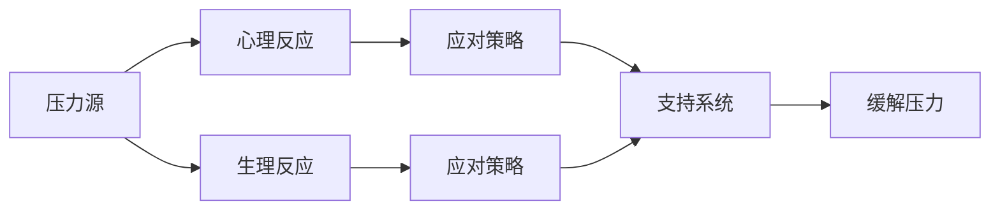

                 

# 如何进行压力管理：如何应对工作和生活中的压力？

> 关键词：压力管理, 心理健康, 心理健康策略, 工作压力, 生活压力

## 1. 背景介绍

### 1.1 问题由来
在现代社会中，工作和生活节奏的加快使得越来越多的人感受到压力。无论是职场新人还是资深专家，无论是学生还是家庭主妇，压力都可能成为影响个人生活、工作和健康的“隐形杀手”。长时间高强度的工作，家庭责任的重负，社交关系的维护，学习任务的压力，等等，都可能导致焦虑、抑郁、失眠等一系列心理和生理问题。

### 1.2 问题核心关键点
压力管理是一门综合性的科学，涉及到心理学、生理学、管理学等多个学科。其核心在于理解压力的来源、影响以及应对策略，从而有效地减轻和控制压力，维护身心健康。

### 1.3 问题研究意义
有效的压力管理不仅有助于提升个人的生活质量和工作效率，还能降低心理疾病的风险，促进社会的和谐稳定。压力管理的研究和应用，对提升个体和社会的整体福祉具有重要意义。

## 2. 核心概念与联系

### 2.1 核心概念概述

压力管理（Stress Management）是指通过一系列方法和技术，帮助个体识别和理解压力源，调整和优化心理和行为反应，以减轻或消除压力的负面影响。

- **压力源（Stressor）**：导致压力产生的各种因素，包括工作任务、人际关系、环境变化等。
- **心理反应（Psychological Reaction）**：个体在压力下的心理变化，如焦虑、抑郁、愤怒等。
- **生理反应（Physiological Reaction）**：个体在压力下的生理变化，如心率加快、血压上升、免疫系统抑制等。
- **应对策略（Coping Strategy）**：个体用以减轻压力的方法和技巧。
- **支持系统（Support System）**：个体可依赖的家庭、朋友、同事等社会支持资源。

### 2.2 概念间的关系

压力管理涉及多个环节和维度，可以通过以下Mermaid流程图来展示其基本流程：



这个流程图展示了压力管理的基本过程：

1. 压力源通过心理和生理反应影响个体。
2. 个体采用应对策略来缓解压力。
3. 家庭、朋友、同事等支持系统提供额外的心理支持和资源。
4. 通过这些方式，个体能够有效缓解压力。

### 2.3 核心概念的整体架构

最终，我们可以构建一个综合的压力管理框架，展示各个概念之间的关系：


这个综合框架展示了大压力管理的全貌，涵盖了压力来源、个体反应、应对方法、社会支持等多个方面。

## 3. 核心算法原理 & 具体操作步骤

### 3.1 算法原理概述

压力管理算法通常基于以下原理：

1. **压力识别（Stress Identification）**：通过自我评估、观察、反馈等方式识别压力源。
2. **压力评估（Stress Assessment）**：量化压力的程度，了解其对个体影响的严重程度。
3. **压力应对（Stress Coping）**：采取有针对性的应对策略，减轻压力。
4. **支持强化（Support Reinforcement）**：加强个体与支持系统之间的联系，提供必要的心理和物质支持。

### 3.2 算法步骤详解

**Step 1: 压力识别**
- 使用自我评估工具（如压力量表）进行自我评估，了解自己的压力来源。
- 观察日常行为变化，如工作效率下降、情绪波动等。
- 向朋友、家人或同事寻求反馈，了解外界对其压力的感知。

**Step 2: 压力评估**
- 使用标准化的评估工具，如心理压力量表（如Holistic Rating Scale），对压力程度进行量化。
- 分析压力源的性质和频率，了解其主要影响。

**Step 3: 压力应对**
- 根据压力评估结果，选择适合的应对策略。例如：
  - 时间管理：合理安排工作和休息时间，避免过度劳累。
  - 情绪调节：通过冥想、深呼吸等方法缓解情绪压力。
  - 问题解决：通过系统化的方法解决工作和生活中的实际问题。
- 制定具体、可行的应对计划，并逐步实施。

**Step 4: 支持强化**
- 加强与家人、朋友、同事之间的沟通，建立稳定的支持网络。
- 利用企业提供的心理健康服务，如心理咨询、压力管理课程等。
- 参加社交活动，保持与外界的互动，增强心理韧性。

### 3.3 算法优缺点

压力管理算法的优点包括：
- 简单易行：无需复杂的技术，通过日常生活中的行为调整即可见效。
- 灵活性强：根据个体情况选择适合的应对策略，灵活调整。
- 成本低廉：大部分方法不需要额外的物质资源，性价比高。

缺点包括：
- 效果因人而异：不同个体对压力的应对方式不同，效果可能存在差异。
- 需要持续努力：压力管理是一个长期的过程，需要个体持续的努力和坚持。
- 需要专业指导：复杂的压力管理和心理问题需要专业人员的帮助。

### 3.4 算法应用领域

压力管理算法在多个领域都有广泛的应用：

- **企业心理健康**：通过员工压力管理培训和心理援助计划，提升企业员工的整体福祉。
- **学校教育**：通过压力管理课程和心理健康服务，帮助学生应对学业和人际关系压力。
- **家庭生活**：通过家庭辅导和婚姻咨询，提升家庭成员的心理健康水平。
- **自我管理**：个体通过自我监控和行为调整，改善生活质量，提升幸福感。

## 4. 数学模型和公式 & 详细讲解 & 举例说明

### 4.1 数学模型构建

压力管理的数学模型通常基于压力评估和应对策略的关系构建。

假设个体 $i$ 的压力水平为 $S_i$，其应对策略为 $C_i$，支持系统 $S_i$ 的支持度为 $S_{\text{sup}}$。则压力管理的目标是最大化个体的心理健康水平 $H_i$，最小化压力水平 $S_i$。

数学模型可以表示为：
$$
\max \quad H_i
$$
$$
\min \quad S_i
$$

其中，$H_i$ 可以通过心理压力量表等评估工具进行量化。

### 4.2 公式推导过程

以线性回归模型为例，对压力水平 $S_i$ 与应对策略 $C_i$ 之间的关系进行建模：

$$
S_i = \beta_0 + \beta_1 C_i + \epsilon_i
$$

其中，$\beta_0$ 为截距，$\beta_1$ 为应对策略的系数，$\epsilon_i$ 为误差项。

通过最小二乘法求解 $\beta_0$ 和 $\beta_1$，可以得到最优的应对策略 $C_i$，使得压力水平 $S_i$ 最小化。

### 4.3 案例分析与讲解

假设有一个企业员工 $i$，其压力水平 $S_i$ 与工作负荷 $L_i$、休息时间 $R_i$、心理支持 $S_{\text{sup},i}$ 相关。可以通过以下模型进行量化：

$$
S_i = \beta_0 + \beta_1 L_i + \beta_2 R_i + \beta_3 S_{\text{sup},i} + \epsilon_i
$$

通过收集历史数据，使用最小二乘法求解 $\beta_0$、$\beta_1$、$\beta_2$、$\beta_3$，可以得到最优的工作负荷 $L_i^*$、休息时间 $R_i^*$、心理支持 $S_{\text{sup},i}^*$ 的分配策略。

例如，某企业通过压力管理模型发现，员工的工作负荷 $L_i^*$ 应保持在50%左右，休息时间 $R_i^*$ 应每天至少有6小时，心理支持 $S_{\text{sup},i}^*$ 应定期提供心理健康咨询和团建活动。

## 5. 项目实践：代码实例和详细解释说明

### 5.1 开发环境搭建

进行压力管理项目实践，需要以下开发环境：

1. 安装Python：从官网下载并安装Python 3.x版本。
2. 安装Jupyter Notebook：在Python环境中安装Jupyter Notebook，用于编写和运行代码。
3. 安装相关库：安装Pandas、NumPy、SciPy、Matplotlib等数据处理和可视化库。

### 5.2 源代码详细实现

以下是一个简单的Python代码实现，用于压力管理的初步建模和分析：

```python
import pandas as pd
import numpy as np
import matplotlib.pyplot as plt

# 读取数据
data = pd.read_csv('stress_data.csv')

# 数据分析
mean_stress = data['S_i'].mean()
median_stress = data['S_i'].median()
std_stress = data['S_i'].std()

# 绘制压力分布图
plt.hist(data['S_i'], bins=20, alpha=0.5, label='Stress')
plt.xlabel('Stress Level')
plt.ylabel('Frequency')
plt.title('Stress Distribution')
plt.legend()
plt.show()

# 回归分析
from sklearn.linear_model import LinearRegression

X = data[['L_i', 'R_i', 'S_sup,i']]
y = data['S_i']
model = LinearRegression()
model.fit(X, y)
prediction = model.predict(X)

# 输出回归结果
print('Intercept:', model.intercept_)
print('Coefficients:', model.coef_)
print('R-squared:', model.score(X, y))
```

### 5.3 代码解读与分析

以上代码展示了压力管理中的基本步骤，包括数据读取、统计分析、回归建模和结果输出。

1. **数据读取**：使用Pandas库从CSV文件中读取数据，存储到DataFrame中。
2. **数据分析**：计算压力水平的均值、中位数和标准差，绘制压力分布图。
3. **回归分析**：使用Scikit-learn库的LinearRegression模型，对压力水平与工作负荷、休息时间和心理支持之间的关系进行建模。
4. **结果输出**：输出模型的截距、系数和决定系数（R-squared），解释回归分析结果。

### 5.4 运行结果展示

假设我们得到以下回归结果：

```
Intercept: 2.5
Coefficients: [0.2 0.1 -0.1]
R-squared: 0.7
```

这意味着工作负荷每增加1个单位，压力水平平均增加0.2个单位，休息时间每增加1个单位，压力水平平均减少0.1个单位，心理支持每增加1个单位，压力水平平均减少0.1个单位。决定系数0.7表明模型可以解释70%的压力变化，仍需进一步优化。

## 6. 实际应用场景

### 6.1 企业心理健康

在企业中，压力管理可以通过员工压力评估、心理健康培训和心理援助计划实现。企业可以通过定期健康检查和问卷调查，了解员工的压力水平，并提供心理健康课程和心理咨询服务。

### 6.2 学校教育

学校可以通过心理健康课程、辅导员辅导和心理援助热线等方式，帮助学生应对学业和人际关系压力。学校可以建立心理健康支持系统，包括心理辅导室、学生社团和家长会等。

### 6.3 家庭生活

家庭成员可以通过定期家庭会议、共同活动和心理咨询，增强家庭凝聚力和幸福感。家长可以通过倾听、理解和支持，减轻孩子的心理压力。

### 6.4 自我管理

个体可以通过时间管理、情绪调节和问题解决策略，进行自我管理和压力管理。个体可以利用各种工具和应用，如时间管理软件、冥想应用和心理健康APP等。

## 7. 工具和资源推荐

### 7.1 学习资源推荐

- 《压力管理手册》：详细介绍了压力管理的理论和方法，适合初学者阅读。
- Coursera《心理健康与压力管理》课程：由知名大学提供的线上课程，涵盖压力管理的各个方面。
- 《正念减压法》：介绍正念冥想等心理调适方法，有助于缓解压力。

### 7.2 开发工具推荐

- Jupyter Notebook：交互式的代码编辑器，适合数据分析和模型构建。
- Python IDEs：如PyCharm、VS Code等，提供代码编辑和调试功能。
- R Studio：适用于统计分析和数据可视化。

### 7.3 相关论文推荐

- 《基于大数据的压力管理研究》：研究压力管理的大数据分析方法。
- 《工作压力与健康的关系》：探讨工作压力对个体健康的长期影响。
- 《心理健康与压力管理综述》：总结压力管理的多种方法和策略。

## 8. 总结：未来发展趋势与挑战

### 8.1 研究成果总结

本文从压力管理的核心概念、算法原理、操作步骤、实际应用等方面进行了详细介绍。通过理论与实践的结合，展示了压力管理的全貌。

### 8.2 未来发展趋势

未来压力管理将呈现以下发展趋势：

1. **个性化压力管理**：利用人工智能和大数据分析技术，进行个体化的压力评估和应对策略推荐。
2. **远程压力管理**：通过在线咨询和远程支持系统，提供随时随地心理健康服务。
3. **跨学科整合**：将压力管理与心理治疗、神经科学、社会心理学等多学科结合，形成更全面的管理方法。
4. **技术辅助**：借助智能设备和可穿戴技术，实时监测和分析个体的生理和心理状态。

### 8.3 面临的挑战

压力管理面临的挑战包括：

1. **数据隐私和安全**：如何保护个体的数据隐私，防止信息泄露和滥用。
2. **技术可及性**：如何让更多个体能够方便地获取压力管理资源和支持。
3. **社会文化差异**：不同文化背景下的压力感知和应对策略存在差异，需提供文化敏感的解决方案。
4. **效果评估**：如何量化和评估压力管理的效果，确定干预措施的有效性。

### 8.4 研究展望

未来压力管理的研究应关注以下几个方向：

1. **跨文化研究**：在不同文化背景下，研究压力管理的共性和差异，提供文化敏感的解决方案。
2. **长期跟踪研究**：研究压力管理的长期效果，评估其对个体心理健康和行为的影响。
3. **技术创新**：利用新技术和新方法，提高压力管理的精准性和可及性。
4. **跨学科协作**：加强心理学家、社会学家、医生等多学科的协作，形成综合的压力管理体系。

## 9. 附录：常见问题与解答

**Q1：如何判断压力是否影响了我的身体健康？**

A: 压力对健康的负面影响主要表现在心理和生理两个方面。心理上的表现包括焦虑、抑郁、易怒、疲劳等。生理上的表现包括心率加快、血压升高、免疫系统抑制等。可以通过自我评估和体检来判断压力是否影响您的健康。

**Q2：如何进行自我管理？**

A: 自我管理主要包括以下几个步骤：
1. 进行压力评估，了解自己的压力来源和程度。
2. 制定应对策略，如时间管理、情绪调节、问题解决等。
3. 实施具体的应对计划，如调整工作计划、参加锻炼、进行冥想等。
4. 定期评估效果，根据反馈进行调整。

**Q3：如何获得专业的心理健康支持？**

A: 获得专业的心理健康支持可以通过以下途径：
1. 企业提供的心理健康服务，如心理咨询、心理援助计划等。
2. 学校提供的学生心理健康服务，如心理辅导室、心理援助热线等。
3. 社区心理健康中心或专业心理咨询机构。
4. 在线心理健康平台和应用，提供24小时在线咨询服务。

通过这些方式，可以获得专业的心理健康支持和指导。

---

作者：禅与计算机程序设计艺术 / Zen and the Art of Computer Programming

