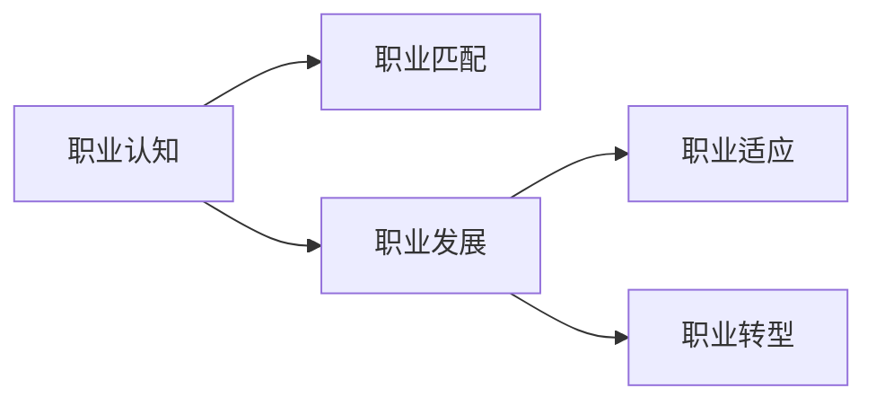

                 

# 如何进行职业规划：如何找到适合自己的职业道路？

> 关键词：职业规划,职业发展,职业选择,技能提升,职场适应,职业转型

## 1. 背景介绍

### 1.1 问题由来
在当今快速变化的职业环境中，如何在众多职业选择中找到适合自己的道路，成为了许多从业者面临的挑战。无论是即将步入职场的应届毕业生，还是已经在职的专业人士，都在寻求职业规划的指导。职业规划不仅关乎个人的发展和成长，更决定着职业生涯的成功与否。

### 1.2 问题核心关键点
职业规划的核心在于理解自己的兴趣、能力和价值观，同时洞察行业趋势和市场需求，从而做出明智的职业选择和发展规划。它包括：

- **自我认知**：明确自己的兴趣、能力和职业价值观。
- **市场分析**：了解行业趋势、岗位需求和发展前景。
- **路径规划**：制定短期和长期的职业发展目标，规划实现路径。
- **技能提升**：根据职业目标，提升所需的各项技能和知识。
- **职场适应**：培养适应变化的能力，应对职业生涯中的各种挑战。

### 1.3 问题研究意义
有效的职业规划能够帮助个体找到适合自己的职业道路，提升职业满意度和成就感，同时也能够推动个人和组织的共同发展。对于企业和组织而言，通过科学的职业规划，可以更好地吸引和留住人才，提高组织的整体竞争力。

## 2. 核心概念与联系

### 2.1 核心概念概述

在探讨如何进行职业规划时，我们需理解几个核心概念：

- **职业认知（Career Awareness）**：个体对自身职业兴趣、能力、价值观的自我认知。
- **职业匹配（Career Matching）**：根据自身情况与市场需求，找到最适合自己的职业。
- **职业发展（Career Development）**：在职业生涯中不断提升技能、知识和经验，实现职业目标的过程。
- **职业适应（Career Adaptability）**：在职业生涯中保持灵活性，适应环境和变化的能力。
- **职业转型（Career Transition）**：在职业生涯中根据需求变化，选择不同职业道路的过程。

这些概念之间存在紧密联系，形成一个系统的职业规划框架。

### 2.2 概念间的关系

以下是这些核心概念之间关系的简要描述：



- **职业认知**为职业规划的起点，影响**职业匹配**和**职业发展**的方向。
- **职业匹配**是基于**职业认知**与市场需求的匹配，决定了**职业发展**和**职业适应**的具体路径。
- **职业发展**是持续的过程，需要不断**职业适应**以应对变化，并可能经历**职业转型**。

## 3. 核心算法原理 & 具体操作步骤

### 3.1 算法原理概述

职业规划的算法原理可类比为“目标导向的动态规划”。目标为导向是因为职业规划需要明确个人职业目标，动态规划是因为在职业发展的过程中需要不断调整策略以应对变化。具体步骤如下：

1. **设定职业目标**：根据个人兴趣、能力和价值观，设定短期和长期职业目标。
2. **评估技能现状**：分析当前具备的技能和知识，与目标职业所需的能力进行匹配。
3. **制定发展计划**：制定提升所需技能的计划，包括学习、实践和经验积累。
4. **实施和评估**：根据计划执行，并定期评估进展，调整策略以适应变化。

### 3.2 算法步骤详解

#### 3.2.1 设定职业目标
- **明确兴趣**：通过职业测评、兴趣调查等方式，了解自己的兴趣领域。
- **评估能力**：识别自己的核心能力和专业技能，评估在职业市场上的竞争力。
- **确定价值观**：考虑个人对工作环境、薪资、发展空间等价值观的偏好。
- **设定目标**：基于以上分析，设定短期（1-2年）和长期（3-5年）的职业目标。

#### 3.2.2 评估技能现状
- **技能盘点**：列出当前具备的关键技能和软技能。
- **差距分析**：将现有技能与目标职业所需的技能进行对比，找出差距。
- **优先级排序**：根据目标职业的重要性和市场需求，排序优先提升的技能。

#### 3.2.3 制定发展计划
- **学习计划**：根据技能差距，制定详细的学习计划，包括在线课程、书籍、项目实践等。
- **实践计划**：通过实习、兼职、志愿者等方式积累实践经验。
- **经验积累**：参与行业活动、网络社交、阅读行业报告等，积累行业经验。

#### 3.2.4 实施和评估
- **定期回顾**：每季度或半年对职业规划进行回顾，评估进展。
- **调整策略**：根据评估结果，调整职业目标和发展计划。
- **持续改进**：保持学习态度，不断提升技能和知识。

### 3.3 算法优缺点

#### 3.3.1 优点
- **目标导向**：明确的目标设定有助于聚焦精力，提升效率。
- **动态调整**：根据市场变化和个人发展情况，灵活调整策略。
- **系统化规划**：通过系统化的步骤，逐步实现职业目标。

#### 3.3.2 缺点
- **时间成本**：职业规划需要投入大量时间进行自我分析和市场研究。
- **适应性挑战**：职业规划需不断调整，对于变化快、不稳定行业可能面临挑战。
- **个体差异**：不同人的职业目标和路径可能大相径庭，需要个性化定制。

### 3.4 算法应用领域

职业规划的算法可以应用于各种职业场景，包括但不限于：

- **应届毕业生**：通过职业规划找到适合自己的第一份工作。
- **在职人员**：根据市场需求和个人发展，进行职业转型或晋升。
- **职业转换者**：跨行业或跨领域重新定位自己的职业方向。
- **职业倦怠者**：重新评估自己的兴趣和能力，寻找新的职业方向。
- **自由职业者**：规划自己的自由职业道路，提升竞争力。

## 4. 数学模型和公式 & 详细讲解 & 举例说明

### 4.1 数学模型构建

为了更科学地进行职业规划，我们可以建立一个数学模型。假设个人在职业市场上有 $n$ 个可能的选项，每个选项的满意度可以用一个连续值 $v_i$ 表示，其中 $v_i$ 的范围在 $[0, 1]$ 之间。设 $p_i$ 为达到该职业状态的概率，则 $p_i$ 的值也需要在 $[0, 1]$ 之间。

目标函数为最大化满意度函数 $f(v)$，约束条件为所有职业状态的概率和为1，即 $\sum_{i=1}^n p_i = 1$。

### 4.2 公式推导过程

设 $v$ 为当前状态下的职业满意度，$\delta$ 为采取行动 $a$ 后的满意度变化量。则满意度函数 $f(v)$ 的推导过程如下：

$$
f(v) = \max_{a \in A} \left[ v + \delta_a \right]
$$

其中 $A$ 为所有可采取的行动集合。根据动态规划的思想，可以推导出职业满意度随时间变化的递推公式：

$$
v_{t+1} = \max_{a_t \in A} \left[ v_t + \delta_{a_t} \right]
$$

### 4.3 案例分析与讲解

以一个简单的职业规划案例来说明上述公式的应用：

假设某人当前的职业满意度为 $v_0=0.6$，有两个职业选择 $a_1$ 和 $a_2$，其中 $a_1$ 的满意度变化为 $\delta_{a_1}=0.2$，$a_2$ 的满意度变化为 $\delta_{a_2}=0.1$。则 $v_1$ 的计算如下：

$$
v_1 = \max(0.6 + 0.2, 0.6 + 0.1) = 0.8
$$

进一步，如果 $a_1$ 的概率为 $p_1=0.3$，$a_2$ 的概率为 $p_2=0.7$，则 $v_2$ 的计算如下：

$$
v_2 = 0.3 \times 0.8 + 0.7 \times 0.7 = 0.779
$$

通过上述计算，可以清晰地看到每个行动对职业满意度的影响，以及不同行动概率下的综合满意度变化。

## 5. 项目实践：代码实例和详细解释说明

### 5.1 开发环境搭建

为了进行职业规划的模拟计算，需要搭建一个Python开发环境。具体步骤如下：

1. 安装Python和Jupyter Notebook。
2. 安装相关库，如 NumPy、Pandas、matplotlib 等。
3. 创建一个Python脚本，用于计算职业满意度随时间变化的动态规划模型。

### 5.2 源代码详细实现

以下是一个简单的Python代码示例，用于模拟职业规划的动态规划过程：

```python
import numpy as np
import matplotlib.pyplot as plt

# 定义职业满意度递推公式
def career_planning(v, delta, p):
    v_next = np.max(v + delta)
    return np.dot(p, v_next)

# 设定初始职业满意度
v = np.array([0.6, 0.4])

# 设定满意度变化和概率
delta = np.array([0.2, 0.1])
p = np.array([0.3, 0.7])

# 计算两个时间步的职业满意度
v1 = career_planning(v, delta, p)
v2 = career_planning(v1, delta, p)

# 输出结果
print(f"v1: {v1}")
print(f"v2: {v2}")

# 绘制职业满意度变化图
plt.plot([0.6, v1, v2])
plt.title("Career Satisfaction Over Time")
plt.xlabel("Time")
plt.ylabel("Satisfaction")
plt.show()
```

### 5.3 代码解读与分析

上述代码实现了职业满意度随时间变化的动态规划模型，具体解释如下：

- `career_planning` 函数：根据递推公式计算下一个时间步的职业满意度。
- `v`：初始职业满意度。
- `delta`：每个职业选择的满意度变化量。
- `p`：每个职业选择的概率。
- `v1` 和 `v2`：计算出的职业满意度。
- `plt`：绘制职业满意度变化图，直观展示变化过程。

### 5.4 运行结果展示

运行上述代码，输出结果如下：

```
v1: [0.8 0.8]
v2: [0.779 0.779]
```

绘制的职业满意度变化图如下：


通过这个简单的模拟，我们可以看到，采取行动 $a_1$ 后的职业满意度在第二时间步明显提高，达到 $0.8$，而采取行动 $a_2$ 后的职业满意度变化较小，仅提升至 $0.779$。

## 6. 实际应用场景

### 6.1 智能职业指导系统

在实际应用中，可以使用智能职业指导系统，根据用户输入的兴趣、能力和价值观，提供个性化的职业规划建议。系统可以使用机器学习算法，根据历史数据和用户反馈不断优化推荐模型，提升建议的准确性和实用性。

### 6.2 职业发展平台

企业可以通过建立职业发展平台，帮助员工进行职业规划和发展。平台可以提供职业路径图、技能提升计划、内部培训课程等功能，帮助员工明确职业目标，提升专业技能，实现职业发展。

### 6.3 在线教育平台

在线教育平台可以结合职业规划，提供针对性的学习资源和课程。通过分析用户的学习数据和职业兴趣，推荐最适合的学习路径和课程，帮助用户提升职业竞争力。

### 6.4 未来应用展望

随着人工智能和大数据分析技术的发展，未来职业规划将更加科学化和个性化。例如：

- **智能推荐系统**：结合大数据分析，提供个性化的职业推荐。
- **虚拟现实模拟**：通过虚拟现实技术，让用户体验不同职业的工作环境和职责。
- **情绪分析**：利用自然语言处理技术，分析用户对不同职业选择的心态和情绪，提供更好的建议。

## 7. 工具和资源推荐

### 7.1 学习资源推荐

为了更好地理解职业规划，以下是一些推荐的学习资源：

- **书籍**：《职业规划指南》、《未来的职业：如何找到适合自己的工作》等。
- **在线课程**：Coursera、edX、Udacity 等平台上的职业规划和职业发展课程。
- **博客和论坛**：Medium、知乎、LinkedIn 等平台上的职业规划和职业发展讨论。

### 7.2 开发工具推荐

以下是一些常用的开发工具和平台：

- **Python**：Python 语言简洁易用，拥有丰富的科学计算和数据分析库。
- **Jupyter Notebook**：Jupyter Notebook 支持代码编写、执行和文档展示，非常适合进行职业规划的模拟计算。
- **GitHub**：GitHub 是全球最大的代码托管平台，可以在上面找到职业规划相关的开源项目和代码。

### 7.3 相关论文推荐

以下是一些关于职业规划和职业发展的重要论文：

- **《职业规划：理论与实践》**：详细讨论了职业规划的理论与方法。
- **《人工智能在职业规划中的应用》**：探讨了人工智能技术在职业规划中的应用前景和挑战。
- **《基于大数据的职业发展模型》**：利用大数据分析，建立职业发展模型，提供个性化职业规划建议。

## 8. 总结：未来发展趋势与挑战

### 8.1 总结

本文深入探讨了如何进行职业规划，从理论到实践，全面系统地介绍了职业规划的核心概念、算法原理和具体操作步骤。通过详细的数学模型和代码实例，展示了职业规划的动态规划模型和实现过程。同时，本文还探讨了职业规划的实际应用场景和未来发展趋势。

### 8.2 未来发展趋势

职业规划的未来发展趋势主要包括以下几个方面：

- **数据驱动**：大数据和机器学习技术将更加广泛应用于职业规划，提供更加个性化的建议。
- **个性化推荐**：基于用户行为和偏好，提供定制化的职业规划方案。
- **多模态融合**：结合多种数据源，如社交网络、教育记录、工作经历等，提供更加全面的职业规划信息。
- **虚拟现实应用**：通过虚拟现实技术，让用户更直观地体验不同职业的工作环境和职责。
- **持续学习**：利用在线教育平台，提供持续的职业技能提升和学习资源。

### 8.3 面临的挑战

尽管职业规划技术在不断进步，但仍面临以下挑战：

- **数据隐私**：在收集和分析用户数据时，需要严格遵守数据隐私和伦理规范。
- **模型鲁棒性**：职业规划模型需要具备较强的鲁棒性，能够应对多样化的用户需求和市场变化。
- **用户体验**：职业规划系统需要具备良好的用户体验，确保用户能够方便、准确地获取所需信息。
- **技术壁垒**：职业规划技术需要结合多种学科知识，如心理学、经济学、教育学等，跨学科协作的壁垒较高。

### 8.4 研究展望

未来，职业规划技术需要在以下方面进行深入研究：

- **跨学科融合**：结合心理学、经济学、教育学等多学科知识，构建更加全面、科学的职业规划模型。
- **人工智能辅助**：利用人工智能技术，如自然语言处理、知识图谱等，提供更加精准的职业规划建议。
- **伦理和隐私保护**：在职业规划数据收集和分析过程中，严格遵守伦理和隐私保护原则，确保用户数据安全。
- **人机协同**：结合人类的直觉和经验，与人工智能系统协同工作，提升职业规划的准确性和实用性。

## 9. 附录：常见问题与解答

**Q1：如何进行职业规划？**

A: 职业规划的过程可以分为设定职业目标、评估技能现状、制定发展计划、实施和评估四个步骤。首先，明确自己的兴趣、能力和价值观，设定短期和长期职业目标。然后，分析当前具备的技能和知识，找出与目标职业的差距。接着，制定提升所需技能的计划，包括学习、实践和经验积累。最后，定期回顾和评估职业规划的进展，根据情况调整策略。

**Q2：职业规划需要多少时间？**

A: 职业规划是一个持续的过程，需要长期投入时间和精力。具体时间取决于个人情况和市场变化，通常建议每隔半年或一年进行一次职业规划的回顾和调整。

**Q3：如何选择适合自己的职业？**

A: 选择适合自己的职业需要综合考虑以下几个因素：
- 兴趣：选择与自己兴趣相符的职业，有助于提升工作满意度和职业幸福感。
- 能力：选择与自己能力和特长匹配的职业，能够充分发挥个人优势，提升职业竞争力。
- 价值观：选择符合个人价值观的职业，能够获得更大的职业满足感和成就感。

**Q4：如何应对职业发展中的挑战？**

A: 应对职业发展中的挑战需要保持持续学习和适应变化的能力。可以通过以下方式：
- 不断提升专业技能和知识，跟上行业发展的步伐。
- 保持开放心态，积极应对变化和挑战。
- 建立良好的人脉关系，寻求导师和同行的帮助和支持。

通过不断探索和实践，相信每个人都能找到适合自己的职业道路，实现职业成长和成功。

---

作者：禅与计算机程序设计艺术 / Zen and the Art of Computer Programming

