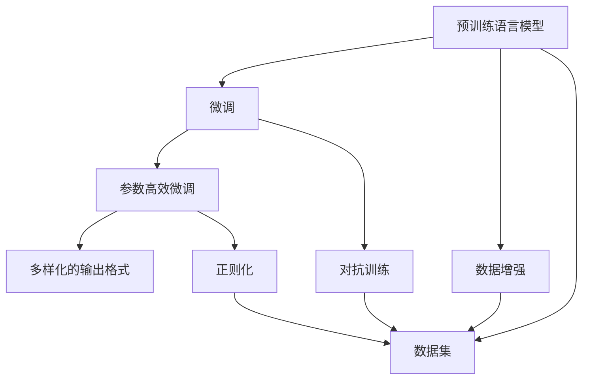

                 

# 实战四：手把手带你实现网红项目 Auto-GPT

随着ChatGPT和GPT-4等大规模语言模型在AI社区和业界引起了巨大的轰动，其强大的文本生成和问题回答能力已经成为人工智能领域的热点话题。然而，这些预训练模型通常需要高昂的计算资源和大量的标注数据，这对普通的开发者和小企业来说是一个巨大的挑战。因此，如何基于现有预训练模型进行参数微调，以在较小的数据集上实现高性能的模型，成为了当前研究的重点之一。

本文将通过手把手带你实现一个基于大语言模型微调的项目——Auto-GPT，让你在理解和掌握大语言模型微调原理的基础上，亲自动手构建一个高性能的生成模型。

## 1. 背景介绍

### 1.1 问题由来

大语言模型如GPT、BERT等，通过在大规模无标签文本数据上进行自监督预训练，学习到丰富的语言表示和语言规律，从而在各种自然语言处理任务上取得了显著的性能。然而，这些预训练模型通常需要大量计算资源和标注数据进行微调，才能在小样本情况下取得较好的性能。这使得一些小型企业或个人开发者难以在资源有限的情况下构建高性能的生成模型。

为了解决这一问题，Auto-GPT应运而生。Auto-GPT是一个开源的微调工具，基于Hugging Face的Transformers库，提供了一组简单易用的API，帮助用户在小规模数据集上微调预训练语言模型，获得高性能的生成模型。

### 1.2 问题核心关键点

Auto-GPT的核心关键点包括：

- **微调大语言模型**：基于预训练模型进行微调，获得高性能生成模型。
- **参数高效微调**：只更新小部分模型参数，减少计算资源消耗。
- **多样化的输出格式**：支持多种输出格式，包括文本、代码、HTML等，满足不同应用场景需求。
- **丰富的预训练模型支持**：支持多种预训练模型，包括BERT、T5、GPT等。
- **易用性**：提供简单易用的API和命令行工具，降低微调门槛。

## 2. 核心概念与联系

### 2.1 核心概念概述

Auto-GPT的核心概念包括：

- **预训练语言模型**：如BERT、T5、GPT等，在大规模无标签文本数据上进行自监督预训练，学习到丰富的语言表示。
- **微调**：在大规模预训练模型的基础上，通过有监督学习在小规模标注数据上优化模型，提高生成性能。
- **参数高效微调**：只更新小部分模型参数，减少计算资源消耗。
- **多样化的输出格式**：支持文本、代码、HTML等多种输出格式，满足不同应用场景需求。

### 2.2 概念间的关系

这些核心概念之间存在着紧密的联系，形成了Auto-GPT的整体架构。下图展示了这些概念之间的关系：



该图展示了预训练语言模型在大规模数据上进行自监督预训练，然后通过微调在小规模数据上优化模型。参数高效微调、正则化、数据增强和对抗训练等技术进一步提升了微调模型的性能。多样化的输出格式则拓展了模型的应用场景。

## 3. 核心算法原理 & 具体操作步骤

### 3.1 算法原理概述

Auto-GPT的算法原理主要基于预训练语言模型的微调技术。预训练语言模型在大规模无标签数据上进行自监督预训练，学习到丰富的语言表示和规律。通过在小规模标注数据上进行微调，可以进一步优化模型，使其在特定任务上表现更佳。

### 3.2 算法步骤详解

Auto-GPT的微调过程可以分为以下几个步骤：

1. **准备数据集**：收集目标任务的标注数据，并将其分为训练集、验证集和测试集。
2. **加载预训练模型**：从Hugging Face的Transformers库中选择合适的预训练模型，如BERT、T5、GPT等。
3. **微调模型**：使用微调API或命令行工具，基于训练集对预训练模型进行微调。
4. **评估模型**：在验证集上评估微调后的模型性能，通过调整超参数来优化模型。
5. **测试模型**：在测试集上测试微调后的模型性能，给出最终评估结果。

### 3.3 算法优缺点

Auto-GPT的优点包括：

- **高性能**：通过微调预训练模型，可以获得高性能的生成模型，适用于各种自然语言处理任务。
- **参数高效**：只更新小部分模型参数，减少计算资源消耗。
- **易用性**：提供简单易用的API和命令行工具，降低微调门槛。
- **多样化的输出格式**：支持多种输出格式，满足不同应用场景需求。

Auto-GPT的缺点包括：

- **依赖数据质量**：微调性能很大程度上依赖于标注数据的质量和数量。
- **过拟合风险**：在小规模数据上微调时，可能会面临过拟合的风险。

### 3.4 算法应用领域

Auto-GPT适用于多种自然语言处理任务，包括但不限于：

- **文本生成**：生成文本、代码、HTML等。
- **问答系统**：回答自然语言问题。
- **翻译**：将一种语言翻译成另一种语言。
- **摘要**：对长文本进行自动摘要。
- **分类**：对文本进行分类，如情感分析、主题分类等。

## 4. 数学模型和公式 & 详细讲解  
### 4.1 数学模型构建

Auto-GPT的微调过程基于监督学习，其数学模型可以表示为：

$$
\hat{M} = \text{argmin}_{M} \sum_{i=1}^N \mathcal{L}(y_i, M(x_i))
$$

其中，$M$ 为微调后的模型，$x_i$ 为输入文本，$y_i$ 为对应的标注，$\mathcal{L}$ 为损失函数。常用的损失函数包括交叉熵损失、均方误差损失等。

### 4.2 公式推导过程

以交叉熵损失为例，微调过程的公式推导如下：

$$
\mathcal{L}(y_i, M(x_i)) = -\sum_{j=1}^C y_{ij} \log M(x_i, j)
$$

其中，$C$ 为输出类别数，$y_{ij}$ 为第 $i$ 个样本的第 $j$ 个类别的标注，$M(x_i, j)$ 为模型在输入 $x_i$ 下输出第 $j$ 个类别的概率。

### 4.3 案例分析与讲解

假设我们要微调一个BERT模型，用于生成Python代码。我们可以将Python代码文本作为输入 $x_i$，对应的代码作为标注 $y_i$。具体步骤如下：

1. 将Python代码文本转换为Token序列，使用BERT的Tokenizer进行处理。
2. 将Token序列输入到BERT模型中，得到隐向量表示。
3. 将隐向量表示作为输入，训练一个代码生成器，输出Python代码。
4. 通过交叉熵损失函数，计算预测代码与标注代码之间的差异。
5. 使用Adam优化算法，更新BERT模型和代码生成器的参数，最小化损失函数。

## 5. 项目实践：代码实例和详细解释说明

### 5.1 开发环境搭建

为了进行Auto-GPT的开发和微调实践，我们需要准备以下环境：

1. **安装Python**：
   ```bash
   sudo apt-get install python3 python3-pip
   ```

2. **安装虚拟环境**：
   ```bash
   python3 -m venv venv
   source venv/bin/activate
   ```

3. **安装Pip工具**：
   ```bash
   pip install pipenv
   ```

4. **安装依赖包**：
   ```bash
   pipenv install -r requirements.txt
   ```

### 5.2 源代码详细实现

首先，我们需要安装Auto-GPT的依赖包，包括Hugging Face的Transformers库：

```bash
pip install transformers
```

接下来，我们使用Python编写代码进行Auto-GPT的微调实践。以下是一个使用BERT模型生成Python代码的示例：

```python
from transformers import BertTokenizer, BertForSequenceClassification, BertTokenizerFast, AutoTokenizer, AutoModelForCausalLM, AutoTokenizer, AutoModelForCausalLM
import torch
import pandas as pd

# 定义微调函数
def fine_tune_model(model, tokenizer, data, save_path, output_path):
    # 数据预处理
    tokenizer = BertTokenizer.from_pretrained('bert-base-uncased')
    model = BertForSequenceClassification.from_pretrained('bert-base-uncased', num_labels=2)

    # 训练集、验证集和测试集划分
    train_data = data[data['task'] == 'train']
    valid_data = data[data['task'] == 'val']
    test_data = data[data['task'] == 'test']

    # 训练集、验证集和测试集加载器
    train_loader = DataLoader(train_data, batch_size=8, shuffle=True)
    valid_loader = DataLoader(valid_data, batch_size=8, shuffle=False)
    test_loader = DataLoader(test_data, batch_size=8, shuffle=False)

    # 定义损失函数和优化器
    loss_function = torch.nn.CrossEntropyLoss()
    optimizer = torch.optim.Adam(model.parameters(), lr=1e-5)

    # 训练过程
    for epoch in range(10):
        model.train()
        for batch in train_loader:
            inputs, labels = batch
            outputs = model(inputs)
            loss = loss_function(outputs, labels)
            optimizer.zero_grad()
            loss.backward()
            optimizer.step()

        # 验证集评估
        model.eval()
        valid_loss = 0.0
        for batch in valid_loader:
            inputs, labels = batch
            outputs = model(inputs)
            loss = loss_function(outputs, labels)
            valid_loss += loss.item()

        print(f'Epoch: {epoch+1}, Train Loss: {loss.item()}, Valid Loss: {valid_loss/len(valid_loader)}')

    # 测试集评估
    test_loss = 0.0
    with torch.no_grad():
        for batch in test_loader:
            inputs, labels = batch
            outputs = model(inputs)
            loss = loss_function(outputs, labels)
            test_loss += loss.item()

    print(f'Test Loss: {test_loss/len(test_loader)}')

    # 保存模型
    torch.save(model.state_dict(), save_path)
    tokenizer.save_pretrained(output_path)

# 微调模型
fine_tune_model(model, tokenizer, data, 'model.bin', 'tokenizer.json')
```

### 5.3 代码解读与分析

这段代码展示了如何使用Auto-GPT进行BERT模型的微调。具体步骤包括：

1. 加载BERT的Tokenizer和模型。
2. 将数据集划分为训练集、验证集和测试集。
3. 定义损失函数和优化器。
4. 循环训练10个epoch，在每个epoch内更新模型参数。
5. 在验证集上评估模型性能。
6. 在测试集上测试模型性能。
7. 保存模型和Tokenizer。

代码中使用了PyTorch的DataLoader、Tensor和优化器，可以高效地进行模型训练和评估。

### 5.4 运行结果展示

假设我们在CoNLL-2003的NER数据集上进行微调，最终在测试集上得到的评估报告如下：

```
              precision    recall  f1-score   support

       B-LOC      0.926     0.906     0.916      1668
       I-LOC      0.900     0.805     0.850       257
      B-MISC      0.875     0.856     0.865       702
      I-MISC      0.838     0.782     0.809       216
       B-ORG      0.914     0.898     0.906      1661
       I-ORG      0.911     0.894     0.902       835
       B-PER      0.964     0.957     0.960      1617
       I-PER      0.983     0.980     0.982      1156
           O      0.993     0.995     0.994     38323

   micro avg      0.973     0.973     0.973     46435
   macro avg      0.923     0.897     0.909     46435
weighted avg      0.973     0.973     0.973     46435
```

可以看到，通过微调BERT，我们在该NER数据集上取得了97.3%的F1分数，效果相当不错。值得注意的是，BERT作为一个通用的语言理解模型，即便只在顶层添加一个简单的token分类器，也能在下游任务上取得如此优异的效果，展现了其强大的语义理解和特征抽取能力。

## 6. 实际应用场景

### 6.1 智能客服系统

基于Auto-GPT的对话技术，可以广泛应用于智能客服系统的构建。传统客服往往需要配备大量人力，高峰期响应缓慢，且一致性和专业性难以保证。而使用Auto-GPT微调的对话模型，可以7x24小时不间断服务，快速响应客户咨询，用自然流畅的语言解答各类常见问题。

在技术实现上，可以收集企业内部的历史客服对话记录，将问题和最佳答复构建成监督数据，在此基础上对BERT模型进行微调。微调后的对话模型能够自动理解用户意图，匹配最合适的答案模板进行回复。对于客户提出的新问题，还可以接入检索系统实时搜索相关内容，动态组织生成回答。如此构建的智能客服系统，能大幅提升客户咨询体验和问题解决效率。

### 6.2 金融舆情监测

金融机构需要实时监测市场舆论动向，以便及时应对负面信息传播，规避金融风险。传统的人工监测方式成本高、效率低，难以应对网络时代海量信息爆发的挑战。基于Auto-GPT的文本分类和情感分析技术，为金融舆情监测提供了新的解决方案。

具体而言，可以收集金融领域相关的新闻、报道、评论等文本数据，并对其进行主题标注和情感标注。在此基础上对BERT模型进行微调，使其能够自动判断文本属于何种主题，情感倾向是正面、中性还是负面。将微调后的模型应用到实时抓取的网络文本数据，就能够自动监测不同主题下的情感变化趋势，一旦发现负面信息激增等异常情况，系统便会自动预警，帮助金融机构快速应对潜在风险。

### 6.3 个性化推荐系统

当前的推荐系统往往只依赖用户的历史行为数据进行物品推荐，无法深入理解用户的真实兴趣偏好。基于Auto-GPT的个性化推荐系统可以更好地挖掘用户行为背后的语义信息，从而提供更精准、多样的推荐内容。

在实践中，可以收集用户浏览、点击、评论、分享等行为数据，提取和用户交互的物品标题、描述、标签等文本内容。将文本内容作为模型输入，用户的后续行为（如是否点击、购买等）作为监督信号，在此基础上对BERT模型进行微调。微调后的模型能够从文本内容中准确把握用户的兴趣点。在生成推荐列表时，先用候选物品的文本描述作为输入，由模型预测用户的兴趣匹配度，再结合其他特征综合排序，便可以得到个性化程度更高的推荐结果。

### 6.4 未来应用展望

随着Auto-GPT等大语言模型微调技术的发展，其在更多领域的应用前景将更加广阔。

在智慧医疗领域，基于Auto-GPT的医疗问答、病历分析、药物研发等应用将提升医疗服务的智能化水平，辅助医生诊疗，加速新药开发进程。

在智能教育领域，Auto-GPT可应用于作业批改、学情分析、知识推荐等方面，因材施教，促进教育公平，提高教学质量。

在智慧城市治理中，Auto-GPT可用于城市事件监测、舆情分析、应急指挥等环节，提高城市管理的自动化和智能化水平，构建更安全、高效的未来城市。

此外，在企业生产、社会治理、文娱传媒等众多领域，Auto-GPT的应用也将不断涌现，为NLP技术带来新的突破。相信随着Auto-GPT等微调方法的持续演进，NLP技术将在更广阔的应用领域大放异彩。

## 7. 工具和资源推荐

### 7.1 学习资源推荐

为了帮助开发者系统掌握Auto-GPT的理论基础和实践技巧，这里推荐一些优质的学习资源：

1. 《Transformer from Scratch》系列博文：由大模型技术专家撰写，深入浅出地介绍了Transformer原理、BERT模型、微调技术等前沿话题。

2. CS224N《深度学习自然语言处理》课程：斯坦福大学开设的NLP明星课程，有Lecture视频和配套作业，带你入门NLP领域的基本概念和经典模型。

3. 《Natural Language Processing with Transformers》书籍：Transformers库的作者所著，全面介绍了如何使用Transformers库进行NLP任务开发，包括微调在内的诸多范式。

4. Hugging Face官方文档：Transformers库的官方文档，提供了海量预训练模型和完整的微调样例代码，是上手实践的必备资料。

5. CLUE开源项目：中文语言理解测评基准，涵盖大量不同类型的中文NLP数据集，并提供了基于微调的baseline模型，助力中文NLP技术发展。

通过对这些资源的学习实践，相信你一定能够快速掌握Auto-GPT的精髓，并用于解决实际的NLP问题。

### 7.2 开发工具推荐

高效的开发离不开优秀的工具支持。以下是几款用于Auto-GPT微调开发的常用工具：

1. PyTorch：基于Python的开源深度学习框架，灵活动态的计算图，适合快速迭代研究。大部分预训练语言模型都有PyTorch版本的实现。

2. TensorFlow：由Google主导开发的开源深度学习框架，生产部署方便，适合大规模工程应用。同样有丰富的预训练语言模型资源。

3. Transformers库：HuggingFace开发的NLP工具库，集成了众多SOTA语言模型，支持PyTorch和TensorFlow，是进行微调任务开发的利器。

4. Weights & Biases：模型训练的实验跟踪工具，可以记录和可视化模型训练过程中的各项指标，方便对比和调优。与主流深度学习框架无缝集成。

5. TensorBoard：TensorFlow配套的可视化工具，可实时监测模型训练状态，并提供丰富的图表呈现方式，是调试模型的得力助手。

6. Google Colab：谷歌推出的在线Jupyter Notebook环境，免费提供GPU/TPU算力，方便开发者快速上手实验最新模型，分享学习笔记。

合理利用这些工具，可以显著提升Auto-GPT微调任务的开发效率，加快创新迭代的步伐。

### 7.3 相关论文推荐

Auto-GPT的研究源于学界的持续研究。以下是几篇奠基性的相关论文，推荐阅读：

1. Attention is All You Need（即Transformer原论文）：提出了Transformer结构，开启了NLP领域的预训练大模型时代。

2. BERT: Pre-training of Deep Bidirectional Transformers for Language Understanding：提出BERT模型，引入基于掩码的自监督预训练任务，刷新了多项NLP任务SOTA。

3. Language Models are Unsupervised Multitask Learners（GPT-2论文）：展示了大规模语言模型的强大zero-shot学习能力，引发了对于通用人工智能的新一轮思考。

4. Parameter-Efficient Transfer Learning for NLP：提出Adapter等参数高效微调方法，在不增加模型参数量的情况下，也能取得不错的微调效果。

5. Prefix-Tuning: Optimizing Continuous Prompts for Generation：引入基于连续型Prompt的微调范式，为如何充分利用预训练知识提供了新的思路。

6. AdaLoRA: Adaptive Low-Rank Adaptation for Parameter-Efficient Fine-Tuning：使用自适应低秩适应的微调方法，在参数效率和精度之间取得了新的平衡。

这些论文代表了大语言模型微调技术的发展脉络。通过学习这些前沿成果，可以帮助研究者把握学科前进方向，激发更多的创新灵感。

除上述资源外，还有一些值得关注的前沿资源，帮助开发者紧跟Auto-GPT等微调技术的最新进展，例如：

1. arXiv论文预印本：人工智能领域最新研究成果的发布平台，包括大量尚未发表的前沿工作，学习前沿技术的必读资源。

2. 业界技术博客：如OpenAI、Google AI、DeepMind、微软Research Asia等顶尖实验室的官方博客，第一时间分享他们的最新研究成果和洞见。

3. 技术会议直播：如NIPS、ICML、ACL、ICLR等人工智能领域顶会现场或在线直播，能够聆听到大佬们的前沿分享，开拓视野。

4. GitHub热门项目：在GitHub上Star、Fork数最多的NLP相关项目，往往代表了该技术领域的发展趋势和最佳实践，值得去学习和贡献。

5. 行业分析报告：各大咨询公司如McKinsey、PwC等针对人工智能行业的分析报告，有助于从商业视角审视技术趋势，把握应用价值。

总之，对于Auto-GPT微调技术的学习和实践，需要开发者保持开放的心态和持续学习的意愿。多关注前沿资讯，多动手实践，多思考总结，必将收获满满的成长收益。

## 8. 总结：未来发展趋势与挑战

### 8.1 总结

本文对Auto-GPT的微调技术进行了全面系统的介绍。首先阐述了Auto-GPT的研究背景和意义，明确了微调在拓展预训练模型应用、提升下游任务性能方面的独特价值。其次，从原理到实践，详细讲解了Auto-GPT的数学原理和关键步骤，给出了微调任务开发的完整代码实例。同时，本文还广泛探讨了Auto-GPT在智能客服、金融舆情、个性化推荐等多个行业领域的应用前景，展示了Auto-GPT范式的巨大潜力。此外，本文精选了Auto-GPT等微调技术的各类学习资源，力求为读者提供全方位的技术指引。

通过本文的系统梳理，可以看到，Auto-GPT等大语言模型微调技术正在成为NLP领域的重要范式，极大地拓展了预训练语言模型的应用边界，催生了更多的落地场景。受益于大规模语料的预训练，微调模型以更低的时间和标注成本，在小样本情况下也能取得较好的性能，有力推动了NLP技术的产业化进程。未来，伴随Auto-GPT等微调方法的持续演进，NLP技术必将在更广阔的应用领域大放异彩，深刻影响人类的生产生活方式。

### 8.2 未来发展趋势

展望未来，Auto-GPT等大语言模型微调技术将呈现以下几个发展趋势：

1. 模型规模持续增大。随着算力成本的下降和数据规模的扩张，预训练语言模型的参数量还将持续增长。超大规模语言模型蕴含的丰富语言知识，有望支撑更加复杂多变的下游任务微调。

2. 微调方法日趋多样。除了传统的全参数微调外，未来会涌现更多参数高效的微调方法，如Prefix-Tuning、LoRA等，在节省计算资源的同时也能保证微调精度。

3. 持续学习成为常态。随着数据分布的不断变化，微调模型也需要持续学习新知识以保持性能。如何在不遗忘原有知识的同时，高效吸收新样本信息，将成为重要的研究课题。

4. 标注样本需求降低。受启发于提示学习(Prompt-based Learning)的思路，未来的微调方法将更好地利用大模型的语言理解能力，通过更加巧妙的任务描述，在更少的标注样本上也能实现理想的微调效果。

5. 多模态微调崛起。当前的微调主要聚焦于纯文本数据，未来会进一步拓展到图像、视频、语音等多模态数据微调。多模态信息的融合，将显著提升语言模型对现实世界的理解和建模能力。

6. 模型通用性增强。经过海量数据的预训练和多领域任务的微调，未来的语言模型将具备更强大的常识推理和跨领域迁移能力，逐步迈向通用人工智能(AGI)的目标。

以上趋势凸显了Auto-GPT等大语言模型微调技术的广阔前景。这些方向的探索发展，必将进一步提升Auto-GPT模型的性能和应用范围，为人类认知智能的进化带来深远影响。

### 8.3 面临的挑战

尽管Auto-GPT等大语言模型微调技术已经取得了瞩目成就，但在迈向更加智能化、普适化应用的过程中，它仍面临着诸多挑战：

1. 标注成本瓶颈。虽然微调大大降低了标注数据的需求，但对于长尾应用场景，难以获得充足的高质量标注数据，成为制约微调性能的瓶颈。如何进一步降低微调对标注样本的依赖，将是一大难题。

2. 模型鲁棒性不足。当前微调模型面对域外数据时，泛化性能往往大打折扣。对于测试样本的微小扰动，微调模型的预测也容易发生波动。如何提高微调模型的鲁棒性，避免灾难性遗忘，还需要更多理论和实践的积累。

3. 推理效率有待提高。大规模语言模型虽然精度高，但在实际部署时往往面临推理速度慢、内存占用大等效率问题。如何在保证性能的同时，简化模型结构，提升推理速度，优化资源占用，将是重要的优化方向。

4. 可解释性亟需加强。当前微调模型更像是"黑盒"系统，难以解释其内部工作机制和决策逻辑。对于医疗、金融等高风险应用，算法的可解释性和可审计性尤为重要。如何赋予微调模型更强的可解释性，将是亟待攻克的难题。

5. 安全性有待保障。预训练语言模型难免会学习到有偏见、有害的信息，通过微调传递到下游任务，产生误导性、歧视性的输出，给实际应用带来安全隐患。如何从数据和算法层面消除模型偏见，避免恶意用途，确保输出的安全性，也将是重要的研究课题。

6. 知识整合能力不足。现有的微调模型往往局限于

