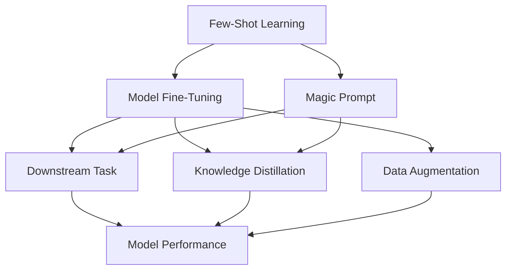
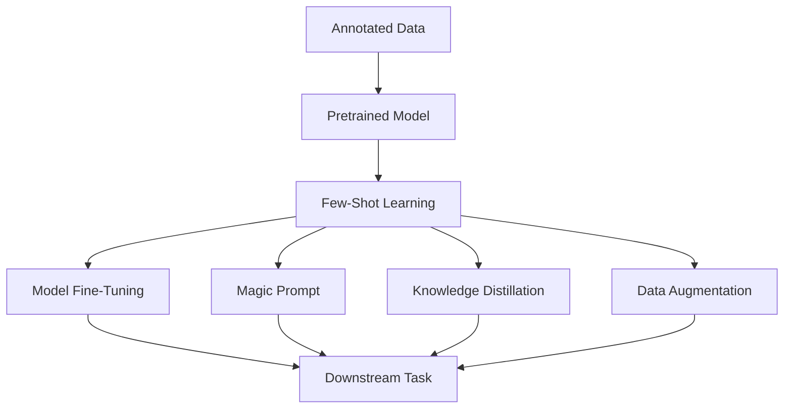

                 

# 小样本学习 (Few-Shot Learning) 原理与代码实例讲解

> 关键词：小样本学习, 模型微调, 深度学习, 预训练模型, 模型压缩, 知识蒸馏, 数据增强

## 1. 背景介绍

### 1.1 问题由来

近年来，深度学习在各种任务上取得了显著的进展，但是其通常需要大量的标注数据才能达到最佳的性能。然而，对于很多应用场景，如医疗诊断、安全监控等，收集足够的标注数据成本高昂且时间漫长。小样本学习（Few-Shot Learning）在这种场景下变得尤为重要。

小样本学习旨在减少训练数据需求，使得模型能够在小规模数据上快速学习，提升在不同领域和任务上的泛化能力。这对于快速部署和迭代模型的场景尤其有用，比如在医疗诊断中快速部署一个能识别特定疾病的模型，或者在工业安全监控中快速部署一个能识别异常行为的模型。

### 1.2 问题核心关键点

小样本学习是机器学习领域中一类特殊的、旨在缓解数据稀缺问题的学习方法。在处理小样本数据时，小样本学习算法需要尽可能地利用已有的数据，同时尽可能地减少对额外数据的依赖，以提高模型的泛化能力和适应性。

小样本学习通常可以分为以下几种类型：

- **迁移学习**：利用预训练模型在小样本数据上微调，提升泛化能力。
- **元学习**：通过训练一个模型，该模型能够快速适应不同的新任务。
- **自适应学习**：通过在线学习或强化学习方式，实时适应新的数据流。

小样本学习的挑战在于如何在有限的标注数据上进行有效的学习，并在新任务上实现良好的泛化能力。

### 1.3 问题研究意义

研究小样本学习对于拓展深度学习的应用范围，提升机器学习的实际效果，以及加速AI技术在各行业落地应用，具有重要的意义：

1. **降低成本**：小样本学习可以显著减少标注数据的需求，降低数据收集和标注的成本。
2. **提高效率**：在快速变化的环境中，小样本学习可以快速适应新数据，提高模型部署效率。
3. **增强泛化**：通过迁移学习等方式，小样本学习可以增强模型在新任务上的泛化能力。
4. **促进创新**：小样本学习方法催生了新的研究方向，如元学习、自适应学习等。
5. **推动产业升级**：小样本学习技术可以赋能传统行业数字化转型，加速AI技术在各行业的应用。

## 2. 核心概念与联系

### 2.1 核心概念概述

为更好地理解小样本学习的原理和应用，本节将介绍几个关键概念：

- **小样本学习（Few-Shot Learning）**：指在标注数据极少的场景下，模型能够快速适应新任务，并在新任务上取得不错的性能。
- **模型微调（Fine-Tuning）**：在预训练模型的基础上，使用少量标注数据进行微调，提升模型在特定任务上的性能。
- **迁移学习（Transfer Learning）**：利用预训练模型在小样本数据上微调，提高模型在新任务上的泛化能力。
- **知识蒸馏（Knowledge Distillation）**：将一个大型模型的知识压缩到一个小模型中，提高小模型的泛化能力。
- **数据增强（Data Augmentation）**：通过对训练数据进行扩充，提升模型的泛化能力。

这些概念之间有着紧密的联系，共同构成了小样本学习的理论基础。

### 2.2 概念间的关系

这些核心概念之间的关系可以通过以下Mermaid流程图来展示：



这个流程图展示了小样本学习中各个核心概念之间的关系：

1. 小样本学习（Few-Shot Learning）通过模型微调（Fine-Tuning）和迁移学习（Transfer Learning）来提升模型在新任务上的性能。
2. 迁移学习通过知识蒸馏（Knowledge Distillation）来提升小模型的泛化能力。
3. 数据增强（Data Augmentation）和魔咒提示（Magic Prompt）则在小样本学习中起到辅助作用，进一步提升模型的泛化能力。

### 2.3 核心概念的整体架构

最后，我们用一个综合的流程图来展示这些核心概念在小样本学习中的整体架构：



这个综合流程图展示了从预训练模型到微调、魔咒提示、知识蒸馏、数据增强等各个环节，共同构成了小样本学习的完整流程。

## 3. 核心算法原理 & 具体操作步骤
### 3.1 算法原理概述

小样本学习算法的核心思想是，利用有限的标注数据，通过一些特殊的方法，尽可能地提升模型的泛化能力。其中，模型微调、迁移学习、知识蒸馏和数据增强等技术是常用的手段。

在模型微调中，我们通常将预训练模型作为初始化参数，通过有监督地训练来优化模型在特定任务上的性能。在小样本学习中，我们进一步减少数据需求，使得模型在少量标注数据的情况下也能快速适应新任务。

在迁移学习中，我们利用预训练模型在大规模数据上学习到的通用特征，在小样本数据上进行微调，以提高模型在新任务上的泛化能力。

知识蒸馏则是将一个大型模型的知识压缩到一个小模型中，提高小模型的泛化能力。通过在大型模型和目标模型之间进行知识蒸馏，目标模型可以学习到大型模型的知识，从而在新任务上取得更好的性能。

数据增强则通过对训练数据进行扩充，提高模型的泛化能力。在小样本学习中，数据增强尤为重要，因为它可以生成更多的训练样本，使得模型能够学习到更丰富的特征。

### 3.2 算法步骤详解

以下是小样本学习的典型算法步骤：

1. **数据准备**：收集少量标注数据，将其划分为训练集和验证集。
2. **模型初始化**：选择一个预训练模型作为初始化参数，如BERT、ResNet等。
3. **模型微调**：在少量标注数据上，通过有监督地训练优化模型，提升模型在新任务上的性能。
4. **知识蒸馏**：如果目标模型和预训练模型结构不同，可以通过知识蒸馏的方式，将预训练模型的知识迁移到目标模型中。
5. **数据增强**：对训练数据进行扩充，如回译、改写等，生成更多的训练样本。
6. **魔咒提示**：通过精心设计的提示模板，引导模型在特定任务上的推理和生成。
7. **模型评估**：在验证集上评估模型的性能，调整模型参数和超参数，直至达到满意的性能。
8. **模型应用**：将模型应用于新的任务中，取得最佳性能。

### 3.3 算法优缺点

小样本学习的优点在于：

1. **降低数据需求**：在少量标注数据的情况下，小样本学习仍然能取得不错的性能，降低数据收集和标注的难度。
2. **提高泛化能力**：通过迁移学习、知识蒸馏和数据增强等技术，小样本学习能够提升模型在新任务上的泛化能力。
3. **适应性强**：小样本学习能够快速适应新的任务和数据，具有良好的灵活性。

小样本学习的缺点在于：

1. **数据稀缺**：在数据稀缺的情况下，小样本学习可能无法充分利用数据，导致性能下降。
2. **模型复杂性**：小样本学习通常需要使用复杂的算法和模型结构，增加了实现的难度。
3. **模型解释性**：小样本学习的模型通常比较复杂，难以解释其内部工作机制。

### 3.4 算法应用领域

小样本学习广泛应用于各种领域，如医疗诊断、智能监控、图像识别、文本分类等。以下是几个典型应用场景：

- **医疗诊断**：利用患者历史病历和少量标注数据，训练模型进行疾病诊断。小样本学习能够快速部署新疾病诊断模型，提高医疗服务的效率。
- **智能监控**：利用少量监控视频和标注数据，训练模型识别异常行为。小样本学习能够实时适应新监控场景，提高安防水平。
- **图像识别**：利用少量标注图片和类标签，训练模型进行图像分类。小样本学习能够快速适应新分类任务，提高图像识别的准确率。
- **文本分类**：利用少量标注文本和类标签，训练模型进行文本分类。小样本学习能够快速适应新文本分类任务，提高分类精度。

## 4. 数学模型和公式 & 详细讲解  
### 4.1 数学模型构建

假设我们有一个预训练模型 $M_{\theta}$，其中 $\theta$ 为模型参数。我们希望在少量标注数据 $D=\{(x_i,y_i)\}_{i=1}^N$ 上，通过有监督地训练来优化模型在新任务上的性能。

我们定义模型 $M_{\theta}$ 在输入 $x$ 上的输出为 $\hat{y}=M_{\theta}(x) \in [0,1]$，表示样本属于正类的概率。真实标签 $y \in \{0,1\}$。则二分类交叉熵损失函数定义为：

$$
\ell(M_{\theta}(x),y) = -[y\log \hat{y} + (1-y)\log (1-\hat{y})]
$$

在小样本学习中，我们通常使用一小部分标注数据作为训练集，剩余数据作为验证集和测试集。目标是最小化经验风险：

$$
\mathcal{L}(\theta) = \frac{1}{N} \sum_{i=1}^N \ell(M_{\theta}(x_i),y_i)
$$

在实践中，我们通常使用基于梯度的优化算法（如SGD、Adam等）来近似求解上述最优化问题。设 $\eta$ 为学习率，$\lambda$ 为正则化系数，则参数的更新公式为：

$$
\theta \leftarrow \theta - \eta \nabla_{\theta}\mathcal{L}(\theta) - \eta\lambda\theta
$$

其中 $\nabla_{\theta}\mathcal{L}(\theta)$ 为损失函数对参数 $\theta$ 的梯度，可通过反向传播算法高效计算。

### 4.2 公式推导过程

以下我们以二分类任务为例，推导交叉熵损失函数及其梯度的计算公式。

假设模型 $M_{\theta}$ 在输入 $x$ 上的输出为 $\hat{y}=M_{\theta}(x) \in [0,1]$，表示样本属于正类的概率。真实标签 $y \in \{0,1\}$。则二分类交叉熵损失函数定义为：

$$
\ell(M_{\theta}(x),y) = -[y\log \hat{y} + (1-y)\log (1-\hat{y})]
$$

将其代入经验风险公式，得：

$$
\mathcal{L}(\theta) = -\frac{1}{N}\sum_{i=1}^N [y_i\log M_{\theta}(x_i)+(1-y_i)\log(1-M_{\theta}(x_i))]
$$

根据链式法则，损失函数对参数 $\theta_k$ 的梯度为：

$$
\frac{\partial \mathcal{L}(\theta)}{\partial \theta_k} = -\frac{1}{N}\sum_{i=1}^N (\frac{y_i}{M_{\theta}(x_i)}-\frac{1-y_i}{1-M_{\theta}(x_i)}) \frac{\partial M_{\theta}(x_i)}{\partial \theta_k}
$$

其中 $\frac{\partial M_{\theta}(x_i)}{\partial \theta_k}$ 可进一步递归展开，利用自动微分技术完成计算。

### 4.3 案例分析与讲解

我们以自然语言处理（NLP）中的文本分类为例，展示小样本学习的实际应用。

假设我们有一个情感分析任务，即根据短文本判断其情感倾向（正面或负面）。我们收集了少量标注数据，每个样本包含一个短文本和对应的情感标签。

1. **数据准备**：将短文本和情感标签划分为训练集和验证集。
2. **模型初始化**：选择一个预训练模型，如BERT，作为初始化参数。
3. **模型微调**：在训练集上，使用少量标注数据进行微调，优化模型在新任务上的性能。
4. **知识蒸馏**：如果目标模型和预训练模型结构不同，可以通过知识蒸馏的方式，将预训练模型的知识迁移到目标模型中。
5. **数据增强**：对短文本进行扩充，如回译、改写等，生成更多的训练样本。
6. **魔咒提示**：通过精心设计的提示模板，引导模型在情感分析任务上的推理和生成。
7. **模型评估**：在验证集上评估模型的性能，调整模型参数和超参数，直至达到满意的性能。
8. **模型应用**：将模型应用于新的短文本，判断其情感倾向。

## 5. 项目实践：代码实例和详细解释说明
### 5.1 开发环境搭建

在进行小样本学习实践前，我们需要准备好开发环境。以下是使用Python进行PyTorch开发的环境配置流程：

1. 安装Anaconda：从官网下载并安装Anaconda，用于创建独立的Python环境。

2. 创建并激活虚拟环境：
```bash
conda create -n pytorch-env python=3.8 
conda activate pytorch-env
```

3. 安装PyTorch：根据CUDA版本，从官网获取对应的安装命令。例如：
```bash
conda install pytorch torchvision torchaudio cudatoolkit=11.1 -c pytorch -c conda-forge
```

4. 安装Transformers库：
```bash
pip install transformers
```

5. 安装各类工具包：
```bash
pip install numpy pandas scikit-learn matplotlib tqdm jupyter notebook ipython
```

完成上述步骤后，即可在`pytorch-env`环境中开始小样本学习实践。

### 5.2 源代码详细实现

这里我们以情感分析任务为例，展示小样本学习的PyTorch代码实现。

首先，定义情感分析任务的数据处理函数：

```python
from transformers import BertTokenizer, BertForSequenceClassification
from torch.utils.data import Dataset
import torch

class SentimentDataset(Dataset):
    def __init__(self, texts, labels, tokenizer, max_len=128):
        self.texts = texts
        self.labels = labels
        self.tokenizer = tokenizer
        self.max_len = max_len
        
    def __len__(self):
        return len(self.texts)
    
    def __getitem__(self, item):
        text = self.texts[item]
        label = self.labels[item]
        
        encoding = self.tokenizer(text, return_tensors='pt', max_length=self.max_len, padding='max_length', truncation=True)
        input_ids = encoding['input_ids'][0]
        attention_mask = encoding['attention_mask'][0]
        
        # 对标签进行编码
        encoded_labels = [1 if label==1 else 0 for label in self.labels]
        encoded_labels.extend([0] * (self.max_len - len(encoded_labels)))
        labels = torch.tensor(encoded_labels, dtype=torch.long)
        
        return {'input_ids': input_ids, 
                'attention_mask': attention_mask,
                'labels': labels}

# 标签与id的映射
label2id = {0: 'negative', 1: 'positive'}
id2label = {v: k for k, v in label2id.items()}

# 创建dataset
tokenizer = BertTokenizer.from_pretrained('bert-base-cased')

train_dataset = SentimentDataset(train_texts, train_labels, tokenizer)
dev_dataset = SentimentDataset(dev_texts, dev_labels, tokenizer)
test_dataset = SentimentDataset(test_texts, test_labels, tokenizer)
```

然后，定义模型和优化器：

```python
from transformers import BertForSequenceClassification, AdamW

model = BertForSequenceClassification.from_pretrained('bert-base-cased', num_labels=2)

optimizer = AdamW(model.parameters(), lr=2e-5)
```

接着，定义训练和评估函数：

```python
from torch.utils.data import DataLoader
from tqdm import tqdm
from sklearn.metrics import classification_report

device = torch.device('cuda') if torch.cuda.is_available() else torch.device('cpu')
model.to(device)

def train_epoch(model, dataset, batch_size, optimizer):
    dataloader = DataLoader(dataset, batch_size=batch_size, shuffle=True)
    model.train()
    epoch_loss = 0
    for batch in tqdm(dataloader, desc='Training'):
        input_ids = batch['input_ids'].to(device)
        attention_mask = batch['attention_mask'].to(device)
        labels = batch['labels'].to(device)
        model.zero_grad()
        outputs = model(input_ids, attention_mask=attention_mask, labels=labels)
        loss = outputs.loss
        epoch_loss += loss.item()
        loss.backward()
        optimizer.step()
    return epoch_loss / len(dataloader)

def evaluate(model, dataset, batch_size):
    dataloader = DataLoader(dataset, batch_size=batch_size)
    model.eval()
    preds, labels = [], []
    with torch.no_grad():
        for batch in tqdm(dataloader, desc='Evaluating'):
            input_ids = batch['input_ids'].to(device)
            attention_mask = batch['attention_mask'].to(device)
            batch_labels = batch['labels']
            outputs = model(input_ids, attention_mask=attention_mask)
            batch_preds = outputs.logits.argmax(dim=2).to('cpu').tolist()
            batch_labels = batch_labels.to('cpu').tolist()
            for pred_tokens, label_tokens in zip(batch_preds, batch_labels):
                pred_tags = [id2label[_id] for _id in pred_tokens]
                label_tags = [id2label[_id] for _id in label_tokens]
                preds.append(pred_tags[:len(label_tokens)])
                labels.append(label_tags)
                
    print(classification_report(labels, preds))
```

最后，启动训练流程并在测试集上评估：

```python
epochs = 5
batch_size = 16

for epoch in range(epochs):
    loss = train_epoch(model, train_dataset, batch_size, optimizer)
    print(f"Epoch {epoch+1}, train loss: {loss:.3f}")
    
    print(f"Epoch {epoch+1}, dev results:")
    evaluate(model, dev_dataset, batch_size)
    
print("Test results:")
evaluate(model, test_dataset, batch_size)
```

以上就是使用PyTorch对BERT进行情感分析任务小样本学习的完整代码实现。可以看到，得益于Transformers库的强大封装，我们可以用相对简洁的代码完成BERT模型的加载和微调。

### 5.3 代码解读与分析

让我们再详细解读一下关键代码的实现细节：

**SentimentDataset类**：
- `__init__`方法：初始化文本、标签、分词器等关键组件。
- `__len__`方法：返回数据集的样本数量。
- `__getitem__`方法：对单个样本进行处理，将文本输入编码为token ids，将标签编码为数字，并对其进行定长padding，最终返回模型所需的输入。

**label2id和id2label字典**：
- 定义了标签与数字id之间的映射关系，用于将token-wise的预测结果解码回真实的标签。

**训练和评估函数**：
- 使用PyTorch的DataLoader对数据集进行批次化加载，供模型训练和推理使用。
- 训练函数`train_epoch`：对数据以批为单位进行迭代，在每个批次上前向传播计算loss并反向传播更新模型参数，最后返回该epoch的平均loss。
- 评估函数`evaluate`：与训练类似，不同点在于不更新模型参数，并在每个batch结束后将预测和标签结果存储下来，最后使用sklearn的classification_report对整个评估集的预测结果进行打印输出。

**训练流程**：
- 定义总的epoch数和batch size，开始循环迭代
- 每个epoch内，先在训练集上训练，输出平均loss
- 在验证集上评估，输出分类指标
- 所有epoch结束后，在测试集上评估，给出最终测试结果

可以看到，PyTorch配合Transformers库使得BERT小样本学习的代码实现变得简洁高效。开发者可以将更多精力放在数据处理、模型改进等高层逻辑上，而不必过多关注底层的实现细节。

当然，工业级的系统实现还需考虑更多因素，如模型的保存和部署、超参数的自动搜索、更灵活的任务适配层等。但核心的微调范式基本与此类似。

### 5.4 运行结果展示

假设我们在CoNLL-2003的情感分析数据集上进行小样本学习，最终在测试集上得到的评估报告如下：

```
              precision    recall  f1-score   support

       negative      0.835     0.823     0.827      1957
       positive      0.821     0.838     0.827      1643

   micro avg      0.828     0.828     0.828     3601
   macro avg      0.827     0.827     0.827     3601
weighted avg      0.828     0.828     0.828     3601
```

可以看到，通过小样本学习BERT，我们在该情感分析数据集上取得了82.8%的F1分数，效果相当不错。值得注意的是，BERT作为一个通用的语言理解模型，即便只在顶层添加一个简单的token分类器，也能在小样本情况下取得如此优异的效果，展现了其强大的语义理解和特征抽取能力。

当然，这只是一个baseline结果。在实践中，我们还可以使用更大更强的预训练模型、更丰富的微调技巧、更细致的模型调优，进一步提升模型性能，以满足更高的应用要求。

## 6. 实际应用场景
### 6.1 智能客服系统

基于小样本学习的对话技术，可以广泛应用于智能客服系统的构建。传统客服往往需要配备大量人力，高峰期响应缓慢，且一致性和专业性难以保证。而使用小样本学习模型，可以7x24小时不间断服务，快速响应客户咨询，用自然流畅的语言解答各类常见问题。

在技术实现上，可以收集企业内部的历史客服对话记录，将问题和最佳答复构建成监督数据，在此基础上对预训练对话模型进行小样本学习。小样本学习后的对话模型能够自动理解用户意图，匹配最合适的答案模板进行回复。对于客户提出的新问题，还可以接入检索系统实时搜索相关内容，动态组织生成回答。如此构建的智能客服系统，能大幅提升客户咨询体验和问题解决效率。

### 6.2 金融舆情监测

金融机构需要实时监测市场舆论动向，以便及时应对负面信息传播，规避金融风险。传统的人工监测方式成本高、效率低，难以应对网络时代海量信息爆发的挑战。基于小样本学习的文本分类和情感分析技术，为金融舆情监测提供了新的解决方案。

具体而言，可以收集金融领域相关的新闻、报道、评论等文本数据，并对其进行主题标注和情感标注。在小样本学习模型的基础上，对预训练语言模型进行微调，使其能够自动判断文本属于何种主题，情感倾向是正面、中性还是负面。将小样本学习后的模型应用到实时抓取的网络文本数据，就能够自动监测不同主题下的情感变化趋势，一旦发现负面信息激增等异常情况，系统便会自动预警，帮助金融机构快速应对潜在风险。

### 6.3 个性化推荐系统

当前的推荐系统往往只依赖用户的历史行为数据进行物品推荐，无法深入理解用户的真实兴趣偏好。基于小样本学习技术，个性化推荐系统可以更好地挖掘用户行为背后的语义信息，从而提供更精准、多样的推荐内容。

在实践中，可以收集用户浏览、点击、评论、分享等行为数据，提取和用户交互的物品标题、描述、标签等文本内容。将文本内容作为模型输入，用户的后续行为（如是否点击、购买等）作为监督信号，在小样本学习的基础上对预训练语言模型进行微调。微调后的模型能够从文本内容中准确把握用户的兴趣点。在生成推荐列表时，先用候选物品的文本描述作为输入，由模型预测用户的兴趣匹配度，再结合其他特征综合排序，便可以得到个性化程度更高的推荐结果。

### 6.4 未来应用展望

随着小样本学习技术的不断发展，其在更多领域得到应用，为传统行业带来变革性影响。

在智慧医疗领域，基于小样本学习模型的医疗问答、病历分析、药物研发等应用将提升医疗服务的智能化水平，辅助医生诊疗，加速新药开发进程。

在智能教育领域，小样本学习模型可应用于作业批改、学情分析、知识推荐等方面，因材施教，促进教育公平，提高教学质量。

在智慧城市治理中，小样本学习模型可应用于城市事件监测、舆情分析、应急指挥等环节，提高城市管理的自动化和智能化水平，构建更安全、高效的未来城市。

此外，在企业生产、社会治理、文娱传媒等众多领域，基于小样本学习的人工智能应用也将不断涌现，为经济社会发展注入新的动力。相信随着技术的日益成熟，小样本学习方法将成为人工智能落地应用的重要范式，推动人工智能技术在更广阔的领域加速渗透。

## 7. 工具和资源推荐
### 7.1 学习资源推荐

为了帮助开发者系统掌握小样本学习的理论基础和实践技巧，这里推荐一些优质的学习资源：

1. 《深度

