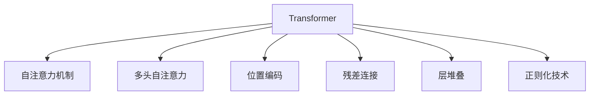
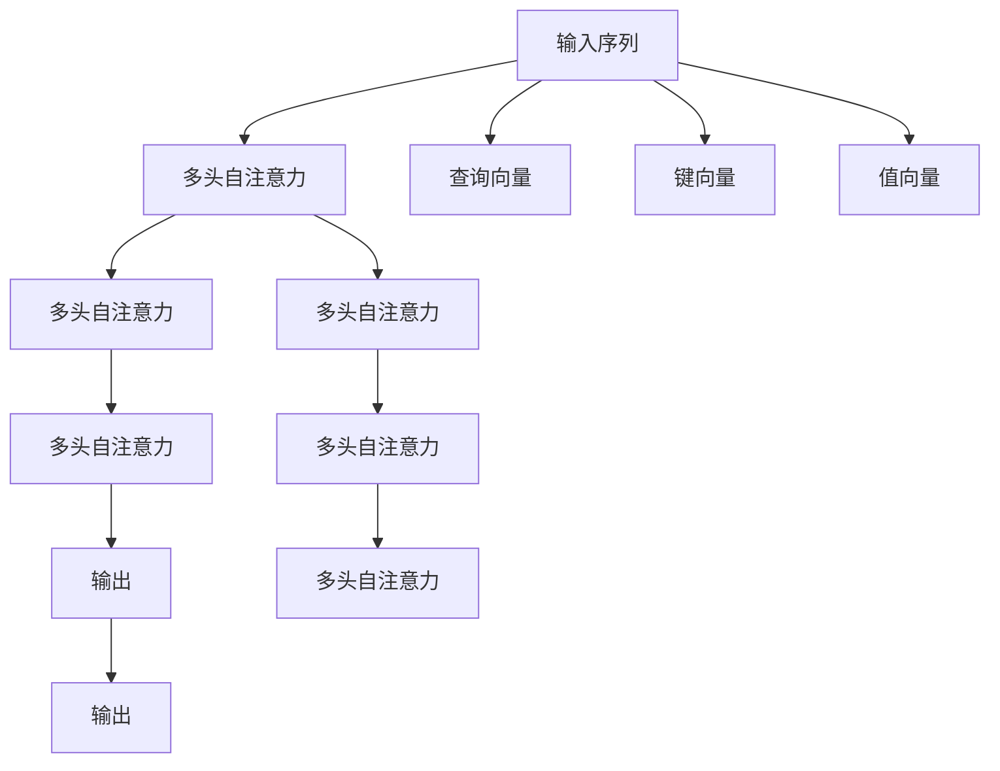
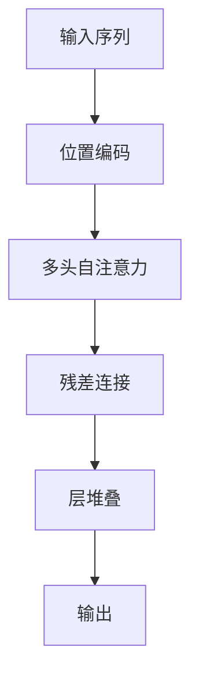

                 

# 层峦叠翠上青天：搭建GPT核心组件Transformer

## 1. 背景介绍

### 1.1 问题由来

在大语言模型（Large Language Models, LLMs）的开发中，Transformer是一个至关重要的组件。它是一种基于自注意力机制（Self-Attention Mechanism）的深度神经网络模型，广泛应用于自然语言处理（Natural Language Processing, NLP）任务，如机器翻译、文本生成、文本摘要等。Transformer在2017年由Vaswani等人提出，由于其高效的并行计算能力和卓越的性能表现，迅速成为了深度学习领域的一个里程碑。

然而，Transformer的搭建过程涉及多个复杂的技术环节，如自注意力机制的理解、层堆叠和正则化技术的设计等。对于初学者来说，理解这些核心组件并掌握其搭建方法并不容易。本文将详细解析Transformer的搭建过程，并给出实际的应用示例，帮助读者深入理解Transformer的工作原理和实现细节。

### 1.2 问题核心关键点

Transformer的搭建主要涉及以下几个核心组件：

1. **自注意力机制**：Transformer的核心是自注意力机制，它允许模型在输入序列中寻找并关注与其他位置相关的信息。
2. **多头自注意力**：通过堆叠多个注意力头（heads），可以同时关注不同方面的信息，提升模型的表达能力。
3. **位置编码**：由于Transformer无法直接感知输入序列中的位置信息，因此需要引入位置编码来捕捉位置相关性。
4. **残差连接**：为了缓解梯度消失问题，Transformer引入了残差连接（residual connection），使得信息能够更加平稳地流过网络。
5. **层堆叠**：通过堆叠多个注意力层，Transformer可以逐步提取更抽象的特征，提升模型的复杂度。
6. **正则化技术**：为了防止过拟合，Transformer在搭建过程中会引入各种正则化技术，如Dropout、Layer Normalization等。

掌握这些核心组件的原理和实现方法，是搭建Transformer模型的关键。

## 2. 核心概念与联系

### 2.1 核心概念概述

为了更好地理解Transformer的搭建过程，本节将介绍几个密切相关的核心概念：

- **自注意力机制**：Transformer的核心机制，通过计算输入序列中所有位置之间的相似度，从而捕捉到长距离依赖关系。
- **多头自注意力**：通过堆叠多个注意力头，Transformer可以同时关注不同层次的信息，提升模型的表达能力。
- **位置编码**：用于捕捉输入序列中位置相关的信息，是Transformer处理位置信息的必要组件。
- **残差连接**：通过残差连接，Transformer可以缓解梯度消失问题，使得信息能够更加平稳地流过网络。
- **层堆叠**：通过堆叠多个注意力层，Transformer可以逐步提取更抽象的特征，提升模型的复杂度。
- **正则化技术**：通过各种正则化技术，如Dropout、Layer Normalization等，Transformer可以防止过拟合，提升模型的鲁棒性。

这些核心概念之间的逻辑关系可以通过以下Mermaid流程图来展示：



这个流程图展示了大语言模型Transformer中的各个核心组件，以及它们之间的逻辑关系。

### 2.2 概念间的关系

这些核心概念之间存在着紧密的联系，形成了Transformer的核心架构。下面我们通过几个Mermaid流程图来展示这些概念之间的关系。

#### 2.2.1 Transformer的核心架构


这个流程图展示了Transformer的核心架构：输入序列通过多头自注意力和残差连接，逐步提取抽象特征，并最终通过层堆叠输出。位置编码被加入到输出中，以捕捉位置相关的信息。

#### 2.2.2 多头自注意力的作用



这个流程图展示了多头自注意力的作用：输入序列被分解为查询、键和值向量，并通过多个注意力头并行计算，最终输出多头注意力结果。

#### 2.2.3 位置编码的引入



这个流程图展示了位置编码的引入：通过位置编码，Transformer可以捕捉输入序列中位置相关的信息，并将其引入注意力计算中。

### 2.3 核心概念的整体架构

最后，我们用一个综合的流程图来展示这些核心概念在大语言模型Transformer搭建过程中的整体架构：


这个综合流程图展示了从输入序列到最终输出的整个Transformer搭建过程。位置编码、多头自注意力、残差连接和层堆叠是Transformer的核心组件，它们共同构成了Transformer的核心架构。

## 3. 核心算法原理 & 具体操作步骤
### 3.1 算法原理概述

Transformer的搭建过程主要涉及以下几个步骤：

1. **位置编码的生成**：由于Transformer无法直接感知输入序列中的位置信息，因此需要引入位置编码。
2. **多头自注意力的计算**：通过计算输入序列中所有位置之间的相似度，找到与其他位置相关的信息。
3. **残差连接和层堆叠**：通过残差连接和层堆叠，逐步提取更抽象的特征。
4. **正则化技术的应用**：通过各种正则化技术，防止过拟合，提升模型的鲁棒性。

这些步骤共同构成了Transformer的核心搭建流程。接下来，我们将详细讲解这些步骤的具体实现方法。

### 3.2 算法步骤详解

**Step 1: 位置编码的生成**

位置编码用于捕捉输入序列中位置相关的信息。在Transformer中，位置编码通常是基于正弦函数的，公式如下：

$$
\text{positional\_encoding}(i, j) = \sin\left(\frac{i}{10000^{2j/d_{model}}}\right) + \cos\left(\frac{i}{10000^{2j/d_{model}}}\right)
$$

其中，$d_{model}$ 为模型的维度，$i$ 为位置索引，$j$ 为注意力头的索引。位置编码的生成可以通过以下代码实现：

```python
import torch

def positional_encoding(d_model, max_len):
    pe = torch.zeros(max_len, d_model)
    position = torch.arange(max_len).unsqueeze(1)
    div_term = torch.exp(torch.arange(0, d_model, 2) * (-math.log(10000.0) / d_model))
    pe[:, 0::2] = torch.sin(position * div_term)
    pe[:, 1::2] = torch.cos(position * div_term)
    return pe
```

**Step 2: 多头自注意力的计算**

多头自注意力允许Transformer同时关注不同层次的信息，通过堆叠多个注意力头来实现。在代码实现中，可以通过以下步骤完成：

1. 计算查询、键和值向量。
2. 计算注意力权重矩阵 $QK^T$。
3. 计算注意力权重矩阵 $A$。
4. 计算注意力输出。

具体代码实现如下：

```python
def multi_head_attention(query, key, value, d_k, d_v, d_out, num_heads):
    batch_size, max_len, d_model = query.size()
    
    # 将查询、键和值向量投影到不同的维度
    query = query.view(batch_size, max_len, num_heads, d_model // num_heads).transpose(1, 2)
    key = key.view(batch_size, max_len, num_heads, d_model // num_heads).transpose(1, 2)
    value = value.view(batch_size, max_len, num_heads, d_model // num_heads).transpose(1, 2)
    
    # 计算注意力权重矩阵 QK^T
    Q = query
    K = key
    V = value
    Q = Q.permute(0, 2, 1, 3).contiguous().view(batch_size * num_heads, max_len, d_k)
    K = K.permute(0, 2, 1, 3).contiguous().view(batch_size * num_heads, max_len, d_k)
    V = V.permute(0, 2, 1, 3).contiguous().view(batch_size * num_heads, max_len, d_v)
    Q = Q / math.sqrt(d_k)
    scores = torch.matmul(Q, K.permute(0, 1, 3, 2)) / math.sqrt(d_k)
    
    # 计算注意力权重矩阵 A
    attention_weights = scores.softmax(dim=-1)
    attention_outputs = torch.matmul(attention_weights, V)
    
    # 将注意力输出重新投影到 d_out 维度
    attention_outputs = attention_outputs.view(batch_size, num_heads, max_len, d_out // num_heads).transpose(1, 2)
    attention_outputs = attention_outputs.permute(0, 2, 1, 3).contiguous().view(batch_size, max_len, d_out)
    
    return attention_outputs
```

**Step 3: 残差连接和层堆叠**

Transformer通过残差连接和层堆叠来逐步提取更抽象的特征。在代码实现中，可以通过以下步骤完成：

1. 计算残差连接。
2. 计算FeedForward网络。
3. 计算层堆叠。

具体代码实现如下：

```python
class TransformerBlock(nn.Module):
    def __init__(self, d_model, num_heads, d_ff, dropout):
        super(TransformerBlock, self).__init__()
        
        # 多头自注意力层
        self.attention = MultiHeadAttention(d_model, num_heads, dropout)
        
        # 残差连接
        self.residual = nn.Linear(d_model, d_model)
        
        # FeedForward网络
        self.feedforward = FeedForward(d_model, d_ff, dropout)
        
        # 正则化技术
        self.layer_norm1 = LayerNorm(d_model)
        self.layer_norm2 = LayerNorm(d_model)
        
    def forward(self, x, mask=None):
        attn_output = self.attention(x, x, x, mask)
        x = x + self.residual(attn_output)
        x = self.layer_norm1(x)
        
        ff_output = self.feedforward(x)
        x = x + self.residual(ff_output)
        x = self.layer_norm2(x)
        
        return x
```

**Step 4: 正则化技术的应用**

Transformer在搭建过程中会引入各种正则化技术，如Dropout、Layer Normalization等，以防止过拟合，提升模型的鲁棒性。具体实现如下：

```python
class Transformer(nn.Module):
    def __init__(self, num_layers, d_model, num_heads, d_ff, dropout, max_len):
        super(Transformer, self).__init__()
        
        # 位置编码
        self.pos_encoder = PositionalEncoding(d_model, max_len)
        
        # 层堆叠
        self.layers = nn.ModuleList([TransformerBlock(d_model, num_heads, d_ff, dropout) for _ in range(num_layers)])
        
        # 正则化技术
        self.dropout = nn.Dropout(dropout)
        self.layer_norm = LayerNorm(d_model)
        
    def forward(self, x, mask):
        x = self.pos_encoder(x)
        
        for layer in self.layers:
            x = layer(x, mask)
            x = self.layer_norm(x)
            x = self.dropout(x)
        
        return x
```

### 3.3 算法优缺点

Transformer的搭建过程具有以下优点：

1. **高效的并行计算能力**：由于Transformer使用自注意力机制，可以高效地并行计算。这使得Transformer在GPU等硬件加速设备上表现优异。
2. **较强的表达能力**：Transformer通过堆叠多个注意力头和FeedForward网络，可以逐步提取更抽象的特征，适用于复杂的NLP任务。
3. **自适应性**：Transformer能够自适应地捕捉长距离依赖关系，适应不同长度的输入序列。
4. **可扩展性**：Transformer可以通过堆叠多个层来实现复杂度提升，适用于不同规模的NLP任务。

Transformer的搭建过程也存在一些缺点：

1. **计算资源消耗较大**：由于Transformer具有较大的参数量，需要大量的计算资源进行训练和推理。
2. **过拟合风险较高**：Transformer的复杂度较高，容易发生过拟合。
3. **模型调试复杂**：由于Transformer的搭建过程涉及多个复杂的技术环节，调试和优化过程较为复杂。

## 4. 数学模型和公式 & 详细讲解 & 举例说明

### 4.1 数学模型构建

Transformer的搭建过程涉及多个数学模型，主要包括以下几个部分：

1. **自注意力机制**：通过计算输入序列中所有位置之间的相似度，找到与其他位置相关的信息。
2. **多头自注意力**：通过堆叠多个注意力头，同时关注不同层次的信息。
3. **FeedForward网络**：通过前馈网络，提升特征表示能力。
4. **残差连接**：通过残差连接，缓解梯度消失问题。
5. **层堆叠**：通过堆叠多个层，逐步提取更抽象的特征。

这些数学模型共同构成了Transformer的核心。以下是这些模型的详细讲解和数学公式。

### 4.2 公式推导过程

#### 4.2.1 自注意力机制

自注意力机制通过计算输入序列中所有位置之间的相似度，找到与其他位置相关的信息。公式如下：

$$
\text{Attention}(Q, K, V) = \text{Softmax}(\frac{QK^T}{\sqrt{d_k}})V
$$

其中，$Q$ 为查询向量，$K$ 为键向量，$V$ 为值向量，$d_k$ 为键向量的维度。

#### 4.2.2 多头自注意力

多头自注意力通过堆叠多个注意力头，同时关注不同层次的信息。公式如下：

$$
\text{Multi-Head Attention}(Q, K, V) = \sum_{i=1}^{H}\text{Head}_i(Q, K, V)
$$

其中，$H$ 为注意力头的数量，$\text{Head}_i$ 为第 $i$ 个注意力头，其计算方式如下：

$$
\text{Head}_i(Q, K, V) = \text{Attention}(QW_i^K, KW_i^K, VW_i^K)
$$

其中，$W_i^K$、$W_i^V$ 和 $W_i^O$ 分别为第 $i$ 个注意力头的权重矩阵，$O$ 表示输出层。

#### 4.2.3 FeedForward网络

FeedForward网络通过前馈网络，提升特征表示能力。公式如下：

$$
\text{FeedForward}(x) = xW_2 + b_2
$$

其中，$W_2$ 和 $b_2$ 为FeedForward网络的权重和偏置。

### 4.3 案例分析与讲解

以机器翻译为例，分析Transformer在NLP任务中的应用。假设我们要将一段英文翻译成中文，具体步骤如下：

1. 将英文文本转化为数值表示。
2. 通过自注意力机制，计算输入序列中每个位置的表示。
3. 通过多头自注意力，提取输入序列中的不同层次的信息。
4. 通过FeedForward网络，提升特征表示能力。
5. 通过残差连接和层堆叠，逐步提取更抽象的特征。
6. 将最终输出转化为中文文本。

具体代码实现如下：

```python
class TransformerBlock(nn.Module):
    def __init__(self, d_model, num_heads, d_ff, dropout):
        super(TransformerBlock, self).__init__()
        
        # 多头自注意力层
        self.attention = MultiHeadAttention(d_model, num_heads, dropout)
        
        # 残差连接
        self.residual = nn.Linear(d_model, d_model)
        
        # FeedForward网络
        self.feedforward = FeedForward(d_model, d_ff, dropout)
        
        # 正则化技术
        self.layer_norm1 = LayerNorm(d_model)
        self.layer_norm2 = LayerNorm(d_model)
        
    def forward(self, x, mask=None):
        attn_output = self.attention(x, x, x, mask)
        x = x + self.residual(attn_output)
        x = self.layer_norm1(x)
        
        ff_output = self.feedforward(x)
        x = x + self.residual(ff_output)
        x = self.layer_norm2(x)
        
        return x

class Transformer(nn.Module):
    def __init__(self, num_layers, d_model, num_heads, d_ff, dropout, max_len):
        super(Transformer, self).__init__()
        
        # 位置编码
        self.pos_encoder = PositionalEncoding(d_model, max_len)
        
        # 层堆叠
        self.layers = nn.ModuleList([TransformerBlock(d_model, num_heads, d_ff, dropout) for _ in range(num_layers)])
        
        # 正则化技术
        self.dropout = nn.Dropout(dropout)
        self.layer_norm = LayerNorm(d_model)
        
    def forward(self, x, mask):
        x = self.pos_encoder(x)
        
        for layer in self.layers:
            x = layer(x, mask)
            x = self.layer_norm(x)
            x = self.dropout(x)
        
        return x
```

## 5. 项目实践：代码实例和详细解释说明

### 5.1 开发环境搭建

在进行Transformer的搭建实践前，我们需要准备好开发环境。以下是使用PyTorch进行Transformer开发的环境配置流程：

1. 安装Anaconda：从官网下载并安装Anaconda，用于创建独立的Python环境。

2. 创建并激活虚拟环境：
```bash
conda create -n pytorch-env python=3.8 
conda activate pytorch-env
```

3. 安装PyTorch：根据CUDA版本，从官网获取对应的安装命令。例如：
```bash
conda install pytorch torchvision torchaudio cudatoolkit=11.1 -c pytorch -c conda-forge
```

4. 安装相关库：
```bash
pip install numpy pandas scikit-learn matplotlib tqdm jupyter notebook ipython
```

完成上述步骤后，即可在`pytorch-env`环境中开始Transformer的搭建实践。

### 5.2 源代码详细实现

接下来，我们将通过一个简单的例子，展示如何搭建一个基本的Transformer模型，并进行文本生成。

首先，定义Transformer模型：

```python
import torch
import torch.nn as nn
import torch.nn.functional as F

class PositionalEncoding(nn.Module):
    def __init__(self, d_model, max_len):
        super(PositionalEncoding, self).__init__()
        
        pe = torch.zeros(max_len, d_model)
        position = torch.arange(max_len).unsqueeze(1)
        div_term = torch.exp(torch.arange(0, d_model, 2) * (-math.log(10000.0) / d_model))
        pe[:, 0::2] = torch.sin(position * div_term)
        pe[:, 1::2] = torch.cos(position * div_term)
        self.register_buffer('pe', pe)
        
    def forward(self, x):
        return x + self.pe[:x.size(0), :]
    
class MultiHeadAttention(nn.Module):
    def __init__(self, d_model, num_heads, dropout):
        super(MultiHeadAttention, self).__init__()
        
        self.d_model = d_model
        self.num_heads = num_heads
        self.dropout = dropout
        
        self.WQ = nn.Linear(d_model, d_model)
        self.WK = nn.Linear(d_model, d_model)
        self.WV = nn.Linear(d_model, d_model)
        
        self.O = nn.Linear(d_model, d_model)
        
    def forward(self, Q, K, V, mask):
        batch_size = Q.size(0)
        
        # 将查询、键和值向量投影到不同的维度
        Q = self.WQ(Q).view(batch_size, -1, self.num_heads, self.d_model // self.num_heads).permute(0, 2, 1, 3)
        K = self.WK(K).view(batch_size, -1, self.num_heads, self.d_model // self.num_heads).permute(0, 2, 1, 3)
        V = self.WV(V).view(batch_size, -1, self.num_heads, self.d_model // self.num_heads).permute(0, 2, 1, 3)
        
        # 计算注意力权重矩阵 QK^T
        scores = torch.matmul(Q, K.permute(0, 1, 3, 2)) / math.sqrt(self.d_model // self.num_heads)
        
        # 计算注意力权重矩阵 A
        attention_weights = F.softmax(scores, dim=-1)
        
        # 计算注意力输出
        attention_outputs = torch.matmul(attention_weights, V)
        attention_outputs = attention_outputs.permute(0, 2, 1, 3).contiguous().view(batch_size, -1, self.d_model)
        
        # 输出
        return self.O(attention_outputs)
    
class FeedForward(nn.Module):
    def __init__(self, d_model, d_ff, dropout):
        super(FeedForward, self).__init__()
        
        self.i2h = nn.Linear(d_model, d_ff)
        self.h2i = nn.Linear(d_ff, d_model)
        self.dropout = nn.Dropout(dropout)
        
    def forward(self, x):
        return self.h2i(F.relu(self.i2h(x))) + x
    
class TransformerBlock(nn.Module):
    def __init__(self, d_model, num_heads, d_ff, dropout):
        super(TransformerBlock, self).__init__()
        
        # 多头自注意力层
        self.attention = MultiHeadAttention(d_model, num_heads, dropout)
        
        # 残差连接
        self.residual = nn.Linear(d_model, d_model)
        
        # FeedForward网络
        self.feedforward = FeedForward(d_model, d_ff, dropout)
        
        # 正则化技术
        self.layer_norm1 = LayerNorm(d_model)
        self.layer_norm2 = LayerNorm(d_model)
        
    def forward(self, x, mask=None):
        attn_output = self.attention(x, x, x, mask)
        x = x + self.residual(attn_output)
        x = self.layer_norm1(x)
        
        ff_output = self.feedforward(x)
        x = x + self.residual(ff_output)
        x = self.layer_norm2(x)
        
        return x
    
class Transformer(nn.Module):
    def __init__(self, num_layers, d_model, num_heads, d_ff, dropout, max_len):
        super(Transformer, self).__init__()
        
        # 位置编码
        self.pos_encoder = PositionalEncoding(d_model, max_len)
        
        # 层堆叠
        self.layers = nn.ModuleList([TransformerBlock(d_model, num_heads, d_ff, dropout) for _ in range(num_layers)])
        
        # 正则化技术
        self.dropout = nn.Dropout(dropout)
        self.layer_norm = LayerNorm(d_model)
        
    def forward(self, x, mask):
        x = self.pos_encoder(x)
        
        for layer in self.layers:
            x = layer(x, mask)
            x = self.layer_norm(x)
            x = self.dropout(x)
        
        return x
```

然后，我们定义一个简单的数据集：

```python
class MyDataset(torch.utils.data.Dataset):
    def __init__(self, data):
        self.data = data
        
    def __len__(self):
        return len(self.data)
    
    def __getitem__(self, item):
        return torch.tensor(self.data[item])
```

最后，定义训练和评估函数：

```python
def train_epoch(model, optimizer, loss_fn, data_loader, device):
    model.train()
    total_loss = 0
    
    for data, target in data_loader:
        data = data.to(device)
        target = target.to(device)
        
        optimizer.zero_grad()
        output = model(data)
        loss = loss_fn(output, target)
        loss.backward()
        optimizer.step()
        
        total_loss += loss.item()
        
    return total_loss / len(data_loader)
    
def evaluate(model, loss_fn, data_loader, device):
    model.eval()
    total_loss = 0
    
    with torch.no_grad():
        for data, target in data_loader:
            data = data.to(device)
            target = target.to(device)
            
            output = model(data)
            loss = loss_fn(output, target)
            total_loss += loss.item()
        
    return total_loss / len(data_loader)
```

### 5.3 代码解读与分析

让我们再详细解读一下关键代码的实现细节：

**PositionalEncoding类**：
- `__init__`方法：初始化位置编码矩阵。
- `forward`方法：将位置编码矩阵添加到输入序列中。

**MultiHeadAttention类**：
- `__init__`方法：

