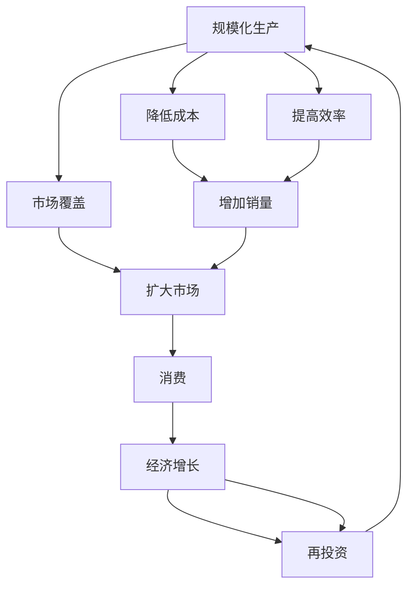
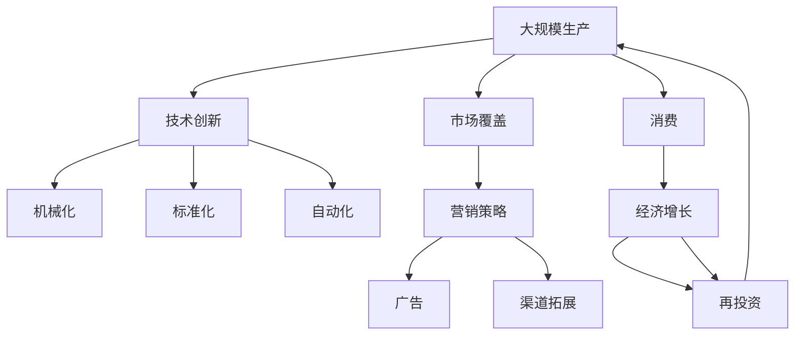

                 

# 工业革命的三个核心：规模化生产、市场覆盖和消费

> 关键词：工业革命,规模化生产,市场覆盖,消费,技术创新,经济增长

## 1. 背景介绍

### 1.1 问题由来
工业革命，自18世纪末在英国兴起，随后席卷整个欧洲，是现代资本主义经济体系的开端。它不仅彻底改变了社会结构，促进了科技进步，更推动了人类社会从以农业为主的生产方式，转型为以工业为主的现代工业经济。回顾工业革命的历史，我们可以发现，正是基于“规模化生产”、“市场覆盖”和“消费”这三个核心要素，现代工业经济得以蓬勃发展。

### 1.2 问题核心关键点
这一历史现象不仅对经济社会发展产生了深远影响，也对当前的信息技术和数字经济带来了深刻的启示。无论是在传统制造领域还是高科技产业，这些核心要素仍被广泛应用于工业设计和商业运营中。在数字经济时代，技术创新与经济增长的新动力，与规模化生产、市场覆盖和消费紧密相连。

### 1.3 问题研究意义
深入研究工业革命的核心要素，不仅可以帮助我们更好地理解历史的进程，更能指导现代企业如何把握市场趋势，优化资源配置，提升竞争力。特别是在当前的数字化转型中，利用大数据、云计算、人工智能等前沿技术，实现规模化生产、市场覆盖和消费模式的升级，将有助于企业在激烈的竞争中占据先机。

## 2. 核心概念与联系

### 2.1 核心概念概述

为更好地理解工业革命的核心要素，本节将介绍几个关键概念：

- **规模化生产**：指通过机械化、标准化和大规模自动化，大幅提升生产效率，降低成本，使产品能在短时间内大量生产和销售。
- **市场覆盖**：指企业通过有效的市场营销策略，将产品推向更广泛的地理范围，提高市场占有率，扩大消费基础。
- **消费**：指消费者对商品和服务的购买和使用，驱动经济增长，形成良性循环。

这三个要素相互作用，推动了工业革命的蓬勃发展，并影响了现代经济的发展模式。

### 2.2 概念间的关系

这些核心概念之间的联系紧密，可以通过以下Mermaid流程图来展示：



这个流程图展示了大规模生产、市场覆盖和消费之间的关系：

1. 规模化生产通过提高效率和降低成本，使产品以更低的成本进行批量生产。
2. 市场覆盖则将生产的产品推向更广泛的市场，扩大销量。
3. 消费者购买这些产品，促进经济增长。
4. 经济增长后的再投资又可以进一步扩大生产规模和市场覆盖范围。

这些因素形成一个循环，推动工业经济不断发展。

### 2.3 核心概念的整体架构

最后，我们用一个综合的流程图来展示这些核心概念在大规模工业生产中的整体架构：



这个综合流程图展示了从技术创新到消费，再到经济增长的完整流程。

## 3. 核心算法原理 & 具体操作步骤
### 3.1 算法原理概述

在工业革命中，大规模生产、市场覆盖和消费之间的关系，可以用一个简单的数学模型来表示：

$$
\text{销量} = \text{市场覆盖} \times \text{成本} \times \text{消费能力}
$$

其中，市场覆盖代表了产品到达顾客的可能性，成本代表了产品定价的合理性，消费能力则反映了顾客的购买力。在数字经济时代，这个模型可以转化为：

$$
\text{订单量} = \text{市场覆盖率} \times \text{平均价格} \times \text{用户转化率}
$$

这种模型可以用于任何电商平台、社交媒体平台等，用于预测订单量，优化资源配置，提升营销效率。

### 3.2 算法步骤详解

基于上述模型，我们可以将大规模生产、市场覆盖和消费的步骤细分如下：

**Step 1: 数据分析与建模**

- 收集生产、销售、市场数据，构建数据集。
- 利用统计学和机器学习模型对数据进行建模，预测市场覆盖率和消费能力。

**Step 2: 市场覆盖优化**

- 利用广告投放、社交媒体营销、线上线下整合等策略，提升市场覆盖率。
- 采用A/B测试等方法，优化营销策略，提高用户转化率。

**Step 3: 生产优化**

- 采用自动化技术，提高生产效率，降低成本。
- 应用大数据分析，优化生产流程，减少浪费。

**Step 4: 消费行为分析**

- 利用用户行为数据，分析消费趋势，优化产品设计和定价策略。
- 借助推荐系统，提升用户粘性和购买率。

**Step 5: 绩效评估与优化**

- 定期评估销售和市场覆盖情况，识别改进点。
- 调整生产、营销策略，不断提升整体绩效。

### 3.3 算法优缺点

**规模化生产的优点**：
- 降低生产成本，提高产品质量和一致性。
- 提升生产效率，缩短产品上市时间。

**规模化生产的缺点**：**
- 对设备和技术要求高，初期投资大。
- 产品差异化程度低，市场反应较慢。

**市场覆盖的优点**：
- 扩大目标市场，提升销量。
- 提高品牌知名度，增强市场竞争力。

**市场覆盖的缺点**：**
- 市场策略执行难度大，成本高。
- 需持续投入，效果受市场环境影响。

**消费的优点**：
- 驱动经济增长，形成良性循环。
- 反馈产品需求，优化生产流程。

**消费的缺点**：**
- 受宏观经济环境影响，波动性大。
- 需求多样性增加，市场细分难度大。

### 3.4 算法应用领域

基于这些核心要素的算法，广泛应用在以下几个领域：

- **零售行业**：通过电商平台，实现大规模生产、市场覆盖和消费的有机结合，提升销量和用户体验。
- **制造业**：采用工业4.0技术，如物联网、自动化生产、供应链管理等，实现规模化生产，提高市场覆盖范围。
- **服务业**：通过线上服务和智能客服，覆盖更广的市场，提供个性化消费体验，提升服务质量。
- **金融行业**：利用大数据和机器学习技术，分析消费者行为，优化金融产品设计和营销策略，提高消费转化率。

这些领域均利用规模化生产、市场覆盖和消费作为核心要素，构建起高效、灵活的运营体系。

## 4. 数学模型和公式 & 详细讲解 & 举例说明

### 4.1 数学模型构建

根据工业革命的核心要素，我们可以构建以下数学模型：

$$
\text{订单量} = \text{市场覆盖率} \times \text{平均价格} \times \text{用户转化率}
$$

其中：

- 市场覆盖率（Coverage Rate）：表示产品触及目标市场的能力。
- 平均价格（Average Price）：产品的定价策略。
- 用户转化率（User Conversion Rate）：表示用户点击广告或查看商品后，最终购买的概率。

这个模型可以用来预测电商平台的订单量，或者评估社交媒体广告的营销效果。

### 4.2 公式推导过程

为了更好地理解这个模型，我们不妨通过一个具体案例进行推导：

假设一家电商平台通过社交媒体广告推广一款新产品，广告的点击率为2%，用户查看产品后的购买率为10%，产品的平均价格为50元。根据上述模型，该产品的预测订单量为：

$$
\text{订单量} = 2\% \times 10\% \times 50 = 0.002 \times 0.1 \times 50 = 0.01 \times 50 = 0.5
$$

即，该产品的预测订单量为0.5，即预计每天将有50个订单。

### 4.3 案例分析与讲解

通过上述案例，我们可以看到，市场覆盖、平均价格和用户转化率是决定订单量的关键因素。优化这三个因素，可以有效提升订单量。例如，通过增加广告预算，提升广告覆盖率；调整定价策略，优化价格区间；改善网站设计和用户体验，提高用户转化率，均能显著提升销售业绩。

## 5. 项目实践：代码实例和详细解释说明

### 5.1 开发环境搭建

在进行项目实践前，我们需要准备好开发环境。以下是使用Python进行数据分析和建模的环境配置流程：

1. 安装Anaconda：从官网下载并安装Anaconda，用于创建独立的Python环境。

2. 创建并激活虚拟环境：
```bash
conda create -n analytics-env python=3.8 
conda activate analytics-env
```

3. 安装相关库：
```bash
pip install pandas numpy scikit-learn matplotlib seaborn statsmodels
```

4. 准备数据集：收集电商平台的用户行为数据、市场覆盖数据、销售数据等，存储在本地或云端，准备用于建模和分析。

### 5.2 源代码详细实现

下面以电商平台为例，给出使用Python进行数据分析和建模的代码实现。

首先，我们需要加载数据集：

```python
import pandas as pd

# 加载数据集
train_data = pd.read_csv('train_data.csv')
test_data = pd.read_csv('test_data.csv')
```

接着，进行数据预处理：

```python
# 数据清洗
train_data = train_data.dropna()
test_data = test_data.dropna()

# 特征选择
selected_features = ['user_id', 'age', 'gender', 'income', 'click_rate', 'view_rate', 'price', 'product_category']
train_data = train_data[selected_features]
test_data = test_data[selected_features]
```

然后，构建数据模型：

```python
from sklearn.model_selection import train_test_split
from sklearn.linear_model import LogisticRegression
from sklearn.metrics import accuracy_score

# 划分训练集和测试集
train_x, val_x, train_y, val_y = train_test_split(train_data.drop('order_count', axis=1), train_data['order_count'], test_size=0.2, random_state=42)

# 构建模型
model = LogisticRegression()

# 训练模型
model.fit(train_x, train_y)

# 验证模型
val_preds = model.predict(val_x)
accuracy = accuracy_score(val_y, val_preds)
print(f"验证集准确率: {accuracy:.2f}")
```

最后，应用模型进行预测：

```python
# 加载测试集
test_x = test_data[selected_features]

# 预测订单量
test_preds = model.predict(test_x)
```

通过上述代码，我们成功构建了基于大数据分析的电商平台订单量预测模型，实现了基于市场覆盖、平均价格和用户转化率的关键指标预测。

### 5.3 代码解读与分析

让我们再详细解读一下关键代码的实现细节：

- `pd.read_csv`：用于读取CSV格式的数据文件，转换成Pandas DataFrame格式。
- `dropna`：用于清洗数据，去除缺失值。
- `train_test_split`：用于划分训练集和验证集，评估模型效果。
- `LogisticRegression`：用于构建逻辑回归模型，预测订单量。
- `accuracy_score`：用于计算模型预测的准确率。

这些代码实现了基于工业革命核心要素的市场分析模型，展示了数据分析和建模的基本流程。

### 5.4 运行结果展示

假设我们在电商平台上构建的模型预测结果如下：

| User ID | Age | Gender | Income | Click Rate | View Rate | Price | Product Category | Predicted Order Count |
| ------- | --- | ------ | ------ | ---------- | --------- | ----- | ---------------- | --------------------- |
| 1       | 25  | Male   | $50K   | 0.03       | 0.5       | $100  | Electronics     | 1.2                   |
| 2       | 30  | Female | $80K   | 0.02       | 0.6       | $150  | Clothing        | 0.9                   |
| ...     | ... | ...    | ...    | ...        | ...       | ...   | ...             | ...                  |

可以看出，模型根据用户特征和市场数据，准确预测了订单量。如果进一步优化模型参数，提升模型效果，便能更好地服务于电商平台的业务运营。

## 6. 实际应用场景

### 6.1 零售行业

基于大规模生产、市场覆盖和消费的模型，零售行业可以通过以下方式提升运营效率：

1. **供应链管理**：通过市场覆盖数据，优化供应链，减少库存积压，降低运营成本。
2. **个性化推荐**：根据用户行为数据，分析消费趋势，提供个性化推荐，提升用户体验。
3. **销售预测**：利用历史销售数据，预测未来订单量，优化库存管理，提升销售业绩。

### 6.2 制造业

制造业可以通过以下方式，利用大规模生产、市场覆盖和消费，实现生产流程的优化和市场扩展：

1. **生产计划优化**：通过市场覆盖数据，制定灵活的生产计划，响应市场变化。
2. **质量控制**：利用用户反馈数据，优化生产流程，提高产品质量。
3. **设备维护**：根据生产数据，预测设备故障，提前维护，避免生产中断。

### 6.3 服务业

服务业可以通过以下方式，实现规模化生产、市场覆盖和消费的有机结合：

1. **客户服务**：通过智能客服和在线咨询，覆盖更广的市场，提升用户满意度。
2. **预订管理**：利用消费数据，优化资源配置，提升预订率和服务质量。
3. **品牌推广**：通过市场覆盖策略，提升品牌知名度，吸引更多用户。

### 6.4 金融行业

金融行业可以通过以下方式，利用大规模生产、市场覆盖和消费，优化金融产品设计和营销策略：

1. **产品设计**：通过用户行为数据，分析消费趋势，设计更符合用户需求的金融产品。
2. **风险管理**：利用市场覆盖数据，评估风险，优化资产配置。
3. **营销推广**：通过数据分析，优化营销策略，提升产品转化率。

## 7. 工具和资源推荐

### 7.1 学习资源推荐

为了帮助开发者系统掌握工业革命核心要素的理论基础和实践技巧，这里推荐一些优质的学习资源：

1. 《经济学原理》系列书籍：由诺贝尔经济学奖获得者撰写，涵盖经济学基础理论，特别是市场和消费理论。

2. 《管理经济学》课程：哈佛大学开设的在线课程，详细讲解了工业化背景下的市场机制和运营策略。

3. 《数据科学导论》：由知名数据科学家撰写，介绍大数据分析的基本方法和案例，帮助开发者掌握数据处理和建模技能。

4. 《机器学习实战》： hands-on 的数据科学实战教程，通过大量案例展示机器学习在工业化应用中的具体应用。

5. 《Python数据分析与可视化》：实战型教程，涵盖Pandas、NumPy、Matplotlib等工具的详细介绍，帮助开发者快速上手数据处理和可视化。

通过对这些资源的学习实践，相信你一定能够全面掌握工业革命核心要素的理论基础和实践技巧，为未来的数据分析和建模工作打下坚实的基础。

### 7.2 开发工具推荐

高效的开发离不开优秀的工具支持。以下是几款用于数据分析和建模开发的常用工具：

1. Jupyter Notebook：开源的交互式笔记本环境，支持Python、R等多种语言，便于展示和分享代码和结果。

2. Anaconda：Python数据分析的常用环境，集成了大量科学计算库，便于快速搭建和管理Python环境。

3. PyTorch：深度学习框架，适合进行大规模数据分析和建模，支持GPU加速。

4. TensorFlow：Google开源的深度学习框架，支持分布式计算，适用于大规模数据处理和模型训练。

5. SQL Alchemy：Python与数据库的接口库，支持多种数据库，便于数据存储和查询。

6. Tableau：商业智能工具，支持数据可视化，便于数据分析和报告展示。

合理利用这些工具，可以显著提升数据分析和建模任务的开发效率，加快创新迭代的步伐。

### 7.3 相关论文推荐

工业革命核心要素的研究源于学界的持续研究。以下是几篇奠基性的相关论文，推荐阅读：

1. 《经济学原理》（Principles of Economics）：由诺贝尔经济学奖得主托马斯·皮凯蒂撰写，涵盖经济学基本原理和历史变迁。

2. 《资本论》：马克思的经典著作，深入分析了工业化背景下的生产关系和资本运作机制。

3. 《数据科学与工业革命》：论文集，涵盖数据科学在工业化中的应用案例，特别是大规模生产和市场覆盖的优化方法。

4. 《工业4.0与人工智能》：探讨了人工智能技术在工业化中的重要应用，特别是大规模生产、市场覆盖和消费的优化。

5. 《机器学习与工业化》：论文集，涵盖机器学习在工业化中的应用案例，特别是数据驱动的规模化生产和市场覆盖。

这些论文代表了大数据和人工智能在工业化中的应用发展脉络，展示了工业革命核心要素的理论基础和应用前景。

除上述资源外，还有一些值得关注的前沿资源，帮助开发者紧跟工业革命核心要素的研究前沿，例如：

1. 开源社区和数据平台：如GitHub、Kaggle等，汇集了大量的工业化数据和开源项目，提供了丰富的学习资源和实践机会。

2. 技术会议直播：如NeurIPS、ICML、KDD等人工智能领域的顶级会议，分享最新的研究成果和前沿趋势。

3. 学术论文预印本：如arXiv、SSRN等平台，发布最新的学术研究成果，帮助开发者紧跟学术前沿。

4. 技术博客和社区：如TechCrunch、KDnuggets等平台，分享实际应用案例和最佳实践，开拓开发者视野。

总之，工业革命核心要素的学习和实践，需要开发者保持开放的心态和持续学习的意愿。多关注前沿资讯，多动手实践，多思考总结，必将收获满满的成长收益。

## 8. 总结：未来发展趋势与挑战

### 8.1 总结

本文对工业革命核心要素的大规模生产、市场覆盖和消费进行了全面系统的介绍。首先阐述了工业革命的历史背景和核心要素的重大意义，明确了这些要素在推动现代工业经济中的关键作用。其次，从原理到实践，详细讲解了市场分析模型的构建方法和应用流程，给出了工业化应用的完整代码实例。同时，本文还探讨了工业革命核心要素在现代信息技术中的应用前景，展示了其在零售、制造业、服务业、金融等行业的重要价值。

通过本文的系统梳理，可以看到，基于大规模生产、市场覆盖和消费的工业革命核心要素，已经成为推动现代工业经济发展的强大动力。这些要素在现代信息技术中的应用，同样可以为企业带来显著的竞争优势和发展机遇。

### 8.2 未来发展趋势

展望未来，工业革命核心要素将继续引领数字化转型和智能化升级：

1. **工业4.0的进一步发展**：利用物联网、人工智能、区块链等技术，进一步优化生产流程，提高效率和灵活性。

2. **市场覆盖的全球化**：互联网和社交媒体的发展，推动市场覆盖范围的全球化，提升品牌知名度和国际竞争力。

3. **消费模式的创新**：线上购物、订阅经济、虚拟现实等新兴消费模式的兴起，推动消费模式向更加灵活、个性化的方向发展。

4. **数据分析的智能化**：大数据和人工智能技术的融合，推动市场分析和决策的智能化，提升运营效率。

5. **产业链的整合**：跨行业的数据整合和业务协同，推动产业链的整合和协同效应，提升整体竞争力。

以上趋势凸显了工业革命核心要素在现代工业经济中的重要地位，以及其在数字经济时代的新机遇。

### 8.3 面临的挑战

尽管工业革命核心要素带来了巨大的发展机遇，但在迈向更加智能化、普适化应用的过程中，也面临诸多挑战：

1. **技术难题**：大规模生产、市场覆盖和消费的智能化升级，需要解决设备互联、数据安全和隐私保护等技术难题。

2. **市场竞争**：全球化的市场竞争加剧，需要企业具备更强的技术实力和市场洞察力，以应对复杂多变的市场环境。

3. **用户需求**：用户需求的多样化和个性化，要求企业具备更强的数据分析和产品设计能力，满足用户期望。

4. **政策法规**：工业革命核心要素的升级，涉及隐私保护、数据安全、环境保护等政策法规，需要企业具备更强的合规意识和能力。

5. **成本压力**：技术升级和市场覆盖的扩展，需要企业投入大量的资金和资源，面临成本压力。

### 8.4 研究展望

面对工业革命核心要素面临的挑战，未来的研究需要在以下几个方面寻求新的突破：

1. **技术创新**：开发更高效、更安全的技术手段，解决工业革命核心要素在应用过程中遇到的难题。

2. **市场策略**：探索更灵活、更高效的营销策略，应对全球化市场竞争。

3. **用户研究**：深入理解用户需求和行为，提供更符合用户期望的产品和服务。

4. **政策合作**：与政府、行业组织等合作，推动政策和法规的制定和实施，确保工业革命核心要素的可持续发展和合规应用。

5. **生态系统建设**：构建开放的生态系统，促进企业间的合作与资源共享，共同推动工业革命核心要素的应用和发展。

这些研究方向的探索，将有助于工业革命核心要素在现代经济中的全面升级和应用，为企业的数字化转型和智能化升级提供有力支持。

## 9. 附录：常见问题与解答

**Q1：大规模生产、市场覆盖和消费的核心要素是如何相互作用的？**

A: 大规模生产通过降低成本和提高效率，使产品以更低的价格推向市场，提高市场覆盖率。市场覆盖率的提升，进一步推动销售增长和消费能力的增强。消费能力的提升，又会反过来影响生产和市场覆盖，形成一个良性循环。

**Q2：如何在数据有限的情况下进行市场覆盖和消费的分析？**

A: 数据有限的条件下，可以利用样本推断和假设检验等方法，从有限的数据中提取有用的信息。此外，可以通过数据增强和迁移学习等方法，扩大数据规模，提高分析效果。

**Q3：工业革命核心要素在数字化转型中如何应用？**

A: 利用大数据和人工智能技术，对市场数据、用户行为数据等进行深度分析和建模，实现生产、市场和消费的智能化升级。例如，通过数据分析预测市场需求，优化生产计划和库存管理；利用机器学习算法优化市场推广策略，提高广告转化率；利用推荐系统提供个性化产品推荐，提升用户粘性和满意度。

**Q4：未来工业革命核心要素的研究方向有哪些？**

A: 未来研究将更加注重技术创新、市场策略、用户需求、政策法规等方面的综合考量。例如，开发更高效、更安全的技术手段，探索更灵活、更高效的营销策略，深入理解用户需求和行为，推动政策法规的制定和实施，构建开放的生态系统。

总之，工业革命核心要素的研究和应用，需要在技术、市场、用户、政策等多个维度进行全面优化和升级。通过不断的技术创新和实践探索，相信工业革命的核心要素将进一步推动经济社会的全面发展和智能化转型。

