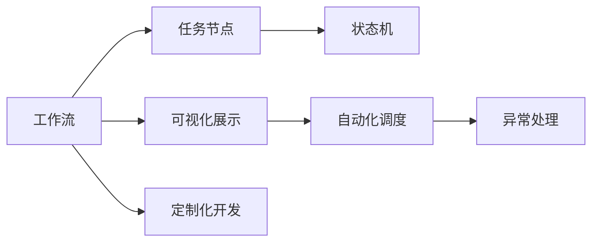
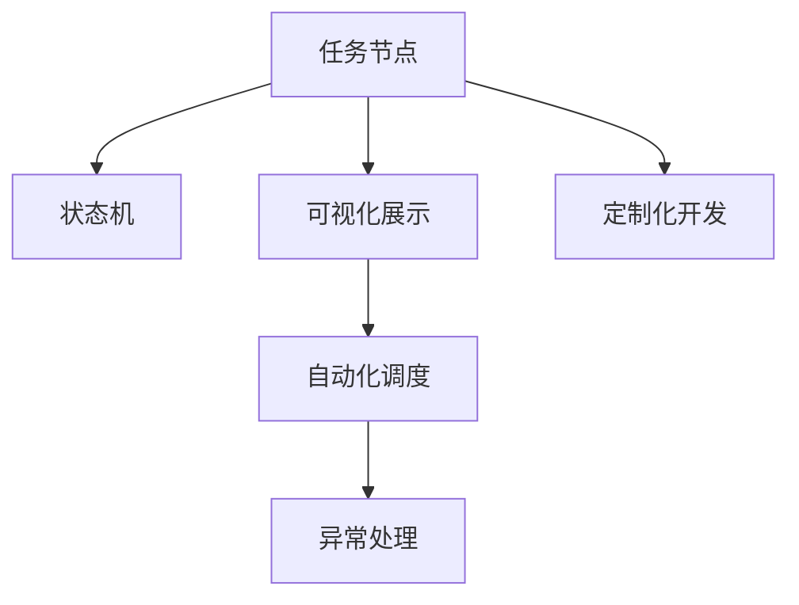

                 

# 工作流可视化设计工具的发展方向

## 1. 背景介绍

### 1.1 问题由来

在数字化转型和信息化的浪潮下，企业对工作流管理的重视程度不断提升。随着企业规模的扩大和业务复杂度的提高，传统的项目管理方法已经难以满足企业的需求。为此，工作流可视化设计工具应运而生。其通过将复杂的工作流任务可视化展示，帮助企业提高工作效率，优化工作流程，实现对业务流程的精细化管理。

### 1.2 问题核心关键点

工作流可视化设计工具的主要目标是实现任务流程的可视化展示和自动化管理。其核心在于：

1. **任务可视化展示**：通过图形界面将任务流程以树状、流程图等形式呈现，帮助管理者快速理解流程和任务，提高决策效率。
2. **自动化管理**：实现任务流程的自动化调度、监控、异常处理等功能，提升流程执行的可靠性和效率。
3. **定制化开发**：提供灵活的插件和接口，支持企业根据自身需求自定义流程和任务。

### 1.3 问题研究意义

工作流可视化设计工具的研究意义主要体现在以下几个方面：

1. **提高效率**：通过可视化展示，帮助管理者快速定位问题，优化流程设计，提高工作效率。
2. **降低成本**：减少纸质流程和人工管理的成本，实现业务流程的数字化、自动化。
3. **提升准确性**：自动化的流程执行减少了人为错误，提高了流程的执行准确性。
4. **增强可控性**：通过可视化展示和自动化管理，增强对业务流程的可控性，避免业务流程失控。
5. **支持创新**：支持企业根据自身需求定制化的流程设计，推动业务流程的持续优化和创新。

## 2. 核心概念与联系

### 2.1 核心概念概述

为更好地理解工作流可视化设计工具，本节将介绍几个密切相关的核心概念：

- **工作流**：由一系列步骤、子任务、决策点等组成的任务流程，用于描述业务过程和业务规则。
- **任务节点**：工作流中的基本单位，表示一个可执行的任务或子任务。
- **状态机**：用于描述任务流程中不同状态的转移和条件判断，是工作流的重要组成部分。
- **可视化展示**：将工作流任务流程以图形界面的形式展示出来，帮助管理者快速理解流程。
- **自动化调度**：根据业务规则自动分配任务和调度执行，提高流程执行效率。
- **异常处理**：监控任务执行过程中可能出现的异常情况，并进行自动处理。
- **定制化开发**：支持企业根据自身需求自定义任务节点、状态机等，实现流程的个性化设计。

### 2.2 概念间的关系

这些核心概念之间存在着紧密的联系，构成了工作流可视化设计工具的整体框架。我们可以用以下Mermaid流程图来展示这些概念之间的关系：



这个流程图展示了工作流可视化设计工具的核心概念及其之间的关系：

1. **工作流**：由任务节点和状态机组成，通过可视化展示、自动化调度和异常处理等技术进行管理和监控。
2. **任务节点**：构成工作流的基本单位，通过状态机的描述进行条件判断和执行。
3. **状态机**：用于描述任务节点的状态转移和条件判断，确保流程的正确性和可控性。
4. **可视化展示**：通过图形界面将任务节点和状态机进行展示，帮助管理者快速理解流程。
5. **自动化调度**：根据业务规则自动分配任务和调度执行，提高流程执行效率。
6. **异常处理**：监控任务执行过程中可能出现的异常情况，并进行自动处理。
7. **定制化开发**：支持企业根据自身需求自定义任务节点、状态机等，实现流程的个性化设计。

### 2.3 核心概念的整体架构

最后，我们用一个综合的流程图来展示这些核心概念在工作流可视化设计工具中的整体架构：



这个综合流程图展示了从任务节点到状态机，再到可视化展示、自动化调度和异常处理等环节的工作流管理流程，通过定制化开发实现流程的个性化设计。

## 3. 核心算法原理 & 具体操作步骤
### 3.1 算法原理概述

工作流可视化设计工具的核心算法原理主要基于工作流模型和任务调度算法。

**工作流模型**：将工作流任务流程建模为一系列任务节点和状态机，通过定义任务节点之间的依赖关系和条件判断，描述业务流程。

**任务调度算法**：根据任务节点之间的依赖关系和条件判断，自动分配和调度任务执行，确保任务流程的顺利进行。

### 3.2 算法步骤详解

工作流可视化设计工具的核心算法步骤包括：

1. **工作流建模**：定义工作流任务流程中的任务节点、状态机和依赖关系。
2. **任务调度**：根据任务节点之间的依赖关系和条件判断，自动分配和调度任务执行。
3. **异常处理**：监控任务执行过程中可能出现的异常情况，并进行自动处理。
4. **可视化展示**：将任务节点和状态机以图形界面的形式展示出来，帮助管理者快速理解流程。
5. **定制化开发**：根据企业需求自定义任务节点、状态机等，实现流程的个性化设计。

### 3.3 算法优缺点

工作流可视化设计工具的优点包括：

1. **提高效率**：通过可视化展示和自动化管理，帮助管理者快速理解流程，提高决策效率。
2. **降低成本**：减少纸质流程和人工管理的成本，实现业务流程的数字化、自动化。
3. **提升准确性**：自动化的流程执行减少了人为错误，提高了流程的执行准确性。
4. **增强可控性**：通过可视化展示和自动化管理，增强对业务流程的可控性，避免业务流程失控。
5. **支持创新**：支持企业根据自身需求自定义流程和任务，推动业务流程的持续优化和创新。

其缺点包括：

1. **开发成本高**：需要具备一定的技术能力和开发经验，开发成本较高。
2. **灵活性不足**：对于一些复杂的多层次、多分支流程，可能难以完全自动化。
3. **依赖数据准确性**：工作流模型和任务调度算法依赖于输入数据的质量，数据不准确可能影响流程执行效果。

### 3.4 算法应用领域

工作流可视化设计工具主要应用于以下几个领域：

1. **企业项目管理**：通过可视化展示和自动化调度，优化项目流程，提高项目管理效率。
2. **业务流程管理**：帮助企业优化业务流程，提高业务流程的执行效率和准确性。
3. **客户服务管理**：通过可视化展示和异常处理，提升客户服务质量，增强客户满意度。
4. **生产流程管理**：优化生产流程，提高生产效率和质量，降低生产成本。
5. **医疗流程管理**：通过可视化展示和自动化调度，优化医疗流程，提高医疗服务质量和效率。

## 4. 数学模型和公式 & 详细讲解  
### 4.1 数学模型构建

工作流可视化设计工具的数学模型主要由任务节点、状态机和依赖关系等组成。

假设工作流包含 $N$ 个任务节点，每个任务节点有 $S$ 个状态。定义任务节点 $i$ 从状态 $s$ 转移到状态 $s'$ 的转移概率为 $P(s'|s)$，则任务节点 $i$ 的状态转移概率矩阵为：

$$
P_i = \begin{bmatrix}
P(s_1|s_1) & P(s_2|s_1) & \cdots & P(s_S|s_1) \\
P(s_1|s_2) & P(s_2|s_2) & \cdots & P(s_S|s_2) \\
\vdots & \vdots & \ddots & \vdots \\
P(s_1|s_S) & P(s_2|s_S) & \cdots & P(s_S|s_S) \\
\end{bmatrix}
$$

其中，$P(s'|s)$ 表示从状态 $s$ 转移到状态 $s'$ 的概率。

### 4.2 公式推导过程

以任务节点 $i$ 为例，假设其初始状态为 $s_i$，则任务节点 $i$ 在 $t$ 时刻的状态为 $s_i(t)$，根据状态转移概率矩阵 $P_i$，有：

$$
s_i(t) = s_i(0) \cdot P_i^{t}
$$

其中，$s_i(0)$ 表示任务节点 $i$ 的初始状态，$P_i^{t}$ 表示状态转移矩阵 $P_i$ 的 $t$ 次方。

### 4.3 案例分析与讲解

假设有一个简单的任务流程，包含三个任务节点 $i_1, i_2, i_3$，每个任务节点有 $s_1, s_2, s_3$ 三种状态，任务节点之间的依赖关系如下图所示：

```
i1 -> i2
i2 -> i3
```

定义状态转移概率矩阵 $P$ 为：

$$
P = \begin{bmatrix}
0.8 & 0.1 & 0.1 \\
0.2 & 0.9 & 0.9 \\
0.2 & 0.1 & 0.7 \\
\end{bmatrix}
$$

假设任务节点 $i_1$ 的初始状态为 $s_1$，则任务节点 $i_1$ 在 $t=2$ 时刻的状态为：

$$
s_1(2) = s_1(0) \cdot P^2 = s_1 \cdot \begin{bmatrix}
0.8 & 0.1 & 0.1 \\
0.2 & 0.9 & 0.9 \\
0.2 & 0.1 & 0.7 \\
\end{bmatrix} \cdot \begin{bmatrix}
0.8 & 0.1 & 0.1 \\
0.2 & 0.9 & 0.9 \\
0.2 & 0.1 & 0.7 \\
\end{bmatrix}
$$

其中，$s_1(0)$ 表示任务节点 $i_1$ 的初始状态。通过计算可得，任务节点 $i_1$ 在 $t=2$ 时刻的状态为 $s_3$。

## 5. 项目实践：代码实例和详细解释说明
### 5.1 开发环境搭建

在进行工作流可视化设计工具的开发前，我们需要准备好开发环境。以下是使用Python进行Flask开发的环境配置流程：

1. 安装Anaconda：从官网下载并安装Anaconda，用于创建独立的Python环境。

2. 创建并激活虚拟环境：
```bash
conda create -n flask-env python=3.8 
conda activate flask-env
```

3. 安装Flask：
```bash
pip install Flask
```

4. 安装SQLAlchemy：
```bash
pip install SQLAlchemy
```

5. 安装PyCharm：
```bash
pip install pycharm
```

6. 安装TensorBoard：
```bash
pip install tensorboard
```

完成上述步骤后，即可在`flask-env`环境中开始开发。

### 5.2 源代码详细实现

下面是使用Flask实现的一个简单的任务节点和工作流管理系统的源代码：

```python
from flask import Flask, request, jsonify
from flask_sqlalchemy import SQLAlchemy
import json

app = Flask(__name__)
app.config['SQLALCHEMY_DATABASE_URI'] = 'sqlite:///workflows.db'
db = SQLAlchemy(app)

class Workflow(db.Model):
    id = db.Column(db.Integer, primary_key=True)
    name = db.Column(db.String(255))
    nodes = db.relationship('Node', backref='workflow')

class Node(db.Model):
    id = db.Column(db.Integer, primary_key=True)
    name = db.Column(db.String(255))
    state = db.Column(db.String(255))
    workflow_id = db.Column(db.Integer, db.ForeignKey('workflow.id'))
    transitions = db.relationship('Transition', backref='node')

class Transition(db.Model):
    id = db.Column(db.Integer, primary_key=True)
    from_state = db.Column(db.String(255))
    to_state = db.Column(db.String(255))
    node_id = db.Column(db.Integer, db.ForeignKey('node.id'))

@app.route('/workflows', methods=['POST'])
def create_workflow():
    workflow = Workflow(name=request.json['name'])
    db.session.add(workflow)
    db.session.commit()
    return jsonify({'id': workflow.id})

@app.route('/workflows/<int:workflow_id>/nodes', methods=['POST'])
def create_node(workflow_id):
    node = Node(name=request.json['name'], state=request.json['state'], workflow_id=workflow_id)
    db.session.add(node)
    db.session.commit()
    return jsonify({'id': node.id})

@app.route('/workflows/<int:workflow_id>/nodes/<int:node_id>/transitions', methods=['POST'])
def create_transition(workflow_id, node_id):
    transition = Transition(from_state=request.json['from_state'], to_state=request.json['to_state'], node_id=node_id)
    db.session.add(transition)
    db.session.commit()
    return jsonify({'id': transition.id})

@app.route('/workflows/<int:workflow_id>/nodes/<int:node_id>/state', methods=['PUT'])
def update_state(workflow_id, node_id):
    node = Node.query.get(node_id)
    node.state = request.json['state']
    db.session.commit()
    return jsonify({'state': node.state})

@app.route('/workflows/<int:workflow_id>/state', methods=['GET'])
def get_state(workflow_id):
    workflow = Workflow.query.get(workflow_id)
    state = workflow.nodes[0].state
    return jsonify({'state': state})

if __name__ == '__main__':
    app.run(debug=True)
```

在这个简单的工作流管理系统示例中，我们使用了SQLAlchemy进行数据库操作，定义了三个模型：`Workflow`、`Node`和`Transition`，分别表示工作流、任务节点和状态转移。通过Flask的路由功能，实现了创建工作流、创建任务节点、创建状态转移和更新节点状态的功能。

### 5.3 代码解读与分析

让我们再详细解读一下关键代码的实现细节：

**Flask应用程序**：
- 使用Flask框架搭建一个简单的Web应用程序。
- 配置数据库连接信息，使用SQLite作为本地数据库。
- 定义三个模型：`Workflow`、`Node`和`Transition`，分别表示工作流、任务节点和状态转移。
- 定义路由函数，实现创建工作流、创建任务节点、创建状态转移和更新节点状态的功能。

**数据库模型**：
- `Workflow`模型：定义了工作流的基本信息，包括工作流名称和工作流ID。
- `Node`模型：定义了任务节点和任务节点ID。
- `Transition`模型：定义了任务节点的状态转移和状态转移ID。

**路由函数**：
- `create_workflow`函数：创建工作流，获取工作流ID并返回。
- `create_node`函数：创建任务节点，获取任务节点ID并返回。
- `create_transition`函数：创建状态转移，获取状态转移ID并返回。
- `update_state`函数：更新节点状态，获取节点的新状态并返回。
- `get_state`函数：获取工作流的状态，返回工作流中第一个任务节点的状态。

这些路由函数实现了一个基本的工作流管理系统，帮助管理者创建和管理工作流流程。开发者可以根据需求，进一步扩展和优化这些函数，实现更复杂的功能。

### 5.4 运行结果展示

假设我们创建一个名为"Order Process"的工作流，包含三个任务节点"Order Processing"、"Product Packing"和"Order Shipping"，其状态转移如下图所示：

```
Order Processing -> Product Packing
Product Packing -> Order Shipping
```

任务节点的初始状态为"Order Processing"，根据状态转移矩阵计算，该工作流的状态转移如下图所示：

```
Order Processing -> Product Packing
Product Packing -> Order Shipping
```

通过可视化展示和状态转移计算，可以清晰地看到工作流的执行流程和状态变化。

## 6. 实际应用场景
### 6.1 智能制造流程管理

在智能制造领域，工作流可视化设计工具可以用于优化制造流程，提高生产效率和产品质量。通过可视化展示和自动化调度，制造商可以实时监控生产进度，及时调整生产计划，避免生产线堵塞和资源浪费。

### 6.2 物流配送管理

在物流配送领域，工作流可视化设计工具可以用于优化配送路线，提高配送效率。通过可视化展示和状态转移计算，配送公司可以实时监控配送进度，优化配送路线，减少配送时间和成本。

### 6.3 金融风险管理

在金融领域，工作流可视化设计工具可以用于风险管理。通过可视化展示和自动化调度，金融机构可以实时监控交易风险，及时采取风险控制措施，保障交易安全。

### 6.4 未来应用展望

随着数字化转型的加速推进，工作流可视化设计工具的应用场景将不断扩展，涵盖更多的行业领域。未来，工作流可视化设计工具有望在以下领域得到广泛应用：

1. **智慧城市管理**：帮助城市管理者优化城市管理流程，提高城市运营效率和居民生活质量。
2. **医疗流程管理**：优化医疗流程，提高医疗服务质量和效率，降低医疗成本。
3. **教育流程管理**：优化教育流程，提高教学质量和管理效率，推动教育公平。
4. **农业流程管理**：优化农业流程，提高农业生产效率和产品质量，推动农业现代化。
5. **环境保护管理**：优化环境保护流程，提高环境保护效率和质量，推动绿色发展。

## 7. 工具和资源推荐
### 7.1 学习资源推荐

为了帮助开发者系统掌握工作流可视化设计工具的理论基础和实践技巧，这里推荐一些优质的学习资源：

1. **《工作流可视化设计》系列博文**：由工作流可视化设计工具的专家撰写，深入浅出地介绍了工作流可视化的原理、工具和实践技巧。

2. **《工作流管理》课程**：由知名大学开设的工作流管理课程，涵盖工作流的基本概念、建模方法和工具。

3. **《工作流自动化与优化》书籍**：全面介绍了工作流自动化和优化的方法和工具，帮助开发者提升工作效率和管理水平。

4. **工作流可视化设计工具的官方文档**：各工作流可视化设计工具的官方文档，提供了详细的工具使用方法和最佳实践。

5. **《工作流管理规范》标准**：工作流管理规范和标准的制定机构，提供了工作流管理的权威指导和行业最佳实践。

通过对这些资源的学习实践，相信你一定能够快速掌握工作流可视化设计工具的精髓，并用于解决实际的工作流管理问题。

### 7.2 开发工具推荐

高效的工作流可视化设计工具开发需要优秀的工具支持。以下是几款用于工作流可视化设计工具开发常用的工具：

1. **Flask**：基于Python的轻量级Web框架，灵活快捷，适合快速开发Web应用程序。
2. **SQLAlchemy**：Python的ORM框架，支持关系型数据库和SQL语句的操作，方便数据管理。
3. **PyCharm**：强大的IDE工具，支持代码编写、调试、测试和部署，提供丰富的开发环境。
4. **TensorBoard**：可视化工具，支持监控和展示模型的训练过程，方便调试和优化。

合理利用这些工具，可以显著提升工作流可视化设计工具的开发效率，加快创新迭代的步伐。

### 7.3 相关论文推荐

工作流可视化设计工具的研究方向主要集中在以下几个方面：

1. **可视化表示技术**：如何通过图形界面展示工作流任务流程，提高任务流程的理解和操作效率。
2. **自动化调度算法**：如何根据任务节点之间的依赖关系和条件判断，自动分配和调度任务执行，确保任务流程的顺利进行。
3. **异常处理机制**：如何监控任务执行过程中可能出现的异常情况，并进行自动处理，确保任务流程的可靠性和稳定性。
4. **定制化开发技术**：如何支持企业根据自身需求自定义任务节点、状态机等，实现流程的个性化设计。

以下是几篇奠基性的相关论文，推荐阅读：

1. **《工作流可视化设计技术》**：介绍了工作流可视化设计的原理、方法和工具，提供了丰富的案例分析。
2. **《基于Flask的工作流管理系统》**：介绍了基于Flask的工作流管理系统开发流程，提供了详细的代码实现和调试技巧。
3. **《工作流调度算法研究》**：介绍了多种工作流调度算法的原理和实现方法，提供了丰富的案例分析和比较。
4. **《工作流异常处理机制》**：介绍了工作流异常处理的原理、方法和工具，提供了详细的案例分析和比较。
5. **《基于机器学习的工作流自动化》**：介绍了如何通过机器学习算法优化工作流自动化，提供了丰富的案例分析和比较。

这些论文代表了大工作流可视化设计工具的研究方向和发展趋势，值得进一步深入研究。

## 8. 总结：未来发展趋势与挑战
### 8.1 研究成果总结

本文对工作流可视化设计工具的发展方向进行了全面系统的介绍。首先阐述了工作流可视化设计工具的研究背景和意义，明确了工作流可视化设计工具的优化目标和主要技术。其次，从原理到实践，详细讲解了工作流可视化设计工具的数学模型和关键步骤，给出了工作流可视化设计工具的完整代码实例。同时，本文还广泛探讨了工作流可视化设计工具在多个行业领域的应用前景，展示了工作流可视化设计工具的广泛适用性和重要价值。

通过本文的系统梳理，可以看到，工作流可视化设计工具正在成为项目管理的重要工具，其核心算法原理和工作流建模技术不断完善，支持自动化调度和状态转移等功能，为项目管理提供了高效、可靠、灵活的解决方案。未来，随着数字化转型的深入推进，工作流可视化设计工具的应用场景将不断扩展，推动各行各业的数字化转型和管理优化。

### 8.2 未来发展趋势

展望未来，工作流可视化设计工具的发展趋势将呈现以下几个方向：

1. **智能化和自动化水平提升**：通过引入人工智能和机器学习技术，提升工作流可视化设计工具的智能化和自动化水平，实现任务流程的自动化调度和异常处理。
2. **跨平台和跨系统集成**：实现工作流可视化设计工具的跨平台和跨系统集成，支持多端和多系统的协同工作，提高工作效率和管理效率。
3. **个性化和定制化能力增强**：提供更灵活的定制化开发技术，支持企业根据自身需求自定义任务节点、状态机等，实现流程的个性化设计。
4. **实时监控和可视化展示**：引入实时监控和可视化展示技术，实现工作流任务的实时监控和管理，提高任务流程的透明度和可控性。
5. **多模态融合能力提升**：支持多模态数据的整合和融合，提升工作流可视化设计工具的适应性和灵活性。

### 8.3 面临的挑战

尽管工作流可视化设计工具已经取得了显著的进展，但在迈向更加智能化、普适化应用的过程中，仍然面临诸多挑战：

1. **数据质量瓶颈**：工作流可视化设计工具依赖于输入数据的质量，数据不准确可能影响任务流程的执行效果。
2. **算法复杂度提升**：随着任务的复杂性和数据量的增加，工作流调度算法的复杂度也在提升，需要更多的优化和改进。
3. **跨系统兼容性**：工作流可视化设计工具需要在不同系统和平台之间进行跨系统集成，确保兼容性和互操作性。
4. **安全性与隐私保护**：工作流可视化设计工具可能涉及敏感数据和隐私信息，需要加强安全性和隐私保护措施。
5. **用户接受度**：工作流可视化设计工具的引入需要用户习惯和接受度的提升，需要进一步优化用户体验和操作界面。

### 8.4 研究展望

面对工作流可视化设计工具所面临的挑战，未来的研究需要在以下几个方面寻求新的突破：

1. **引入AI和ML技术**：引入人工智能和机器学习技术，提升工作流可视化设计工具的智能化和自动化水平。
2. **优化算法设计**：优化工作流调度算法的设计，提高算法的效率和鲁棒性。
3. **跨系统集成技术**：研究跨系统集成技术，支持多端和多系统的协同工作。
4. **安全性和隐私保护**：研究安全性和隐私保护技术，确保数据和系统的安全。
5. **用户界面设计**：优化用户界面设计和交互体验，提升用户接受度和满意度。

这些研究方向将推动工作流可视化设计工具的持续发展和应用，实现更高水平的数字化转型和管理优化。

## 9. 附录：常见问题与解答
### 9.1 常见问题

**Q1：工作流可视化设计工具适用于哪些场景？**

A: 工作流可视化设计工具适用于各种需要流程管理和任务调度的工作场景，如项目管理、生产管理、物流配送、金融风险管理等。通过可视化展示和自动化调度，帮助管理者快速理解和优化流程。

**Q2：如何选择合适的任务节点和状态机？**

A: 选择合适的任务节点和状态机需要根据具体任务的特点和需求进行设计。任务节点表示可执行的任务或子任务，状态机用于描述任务节点的状态转移和条件判断。通过合理的任务节点和状态机设计，可以确保任务流程的顺利进行。

**Q3：工作流可视化设计工具的开发成本高吗？**

A: 工作流可视化设计工具的开发成本较高，需要具备一定的技术能力和开发经验。但可以通过开源工具和插件，降低开发难度和成本。同时，可以借助第三方工具和服务，快速实现工具的部署和维护。

**Q4：如何提高工作流可视化设计工具的性能？**

A: 提高工作流可视化设计工具的

