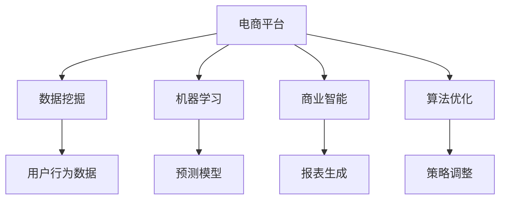
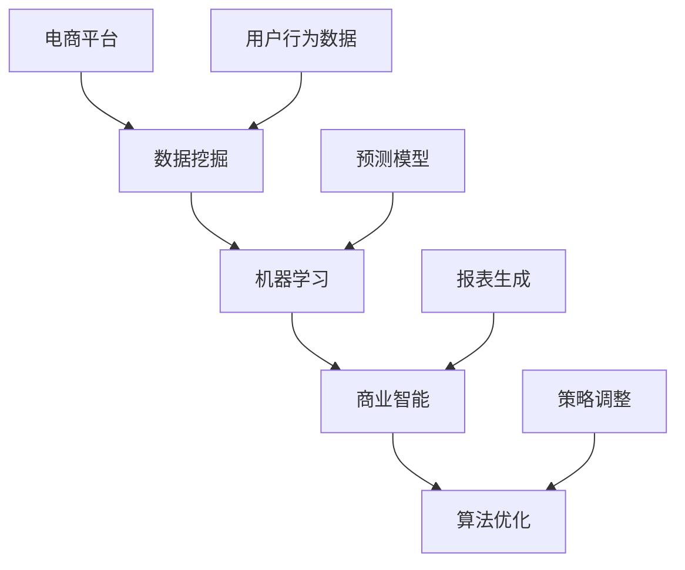

                 

# 市场趋势分析：AI如何帮助电商平台调整策略

> 关键词：人工智能,电商平台,数据挖掘,机器学习,市场趋势,策略调整,商业智能,算法优化

## 1. 背景介绍

### 1.1 问题由来

在当前数字经济时代，电商平台作为连接消费者和商家的重要桥梁，其运营策略的优化与否直接影响到其市场竞争力。面对激烈的市场竞争和不断变化的消费者需求，传统电商平台急需借助AI技术进行数据分析和决策优化。

近年来，人工智能技术在电商平台中的应用越来越广泛，尤其是在客户细分、商品推荐、库存管理、价格优化等方面。通过AI技术的深度挖掘，电商平台能够更精确地洞察市场趋势，制定更有效的运营策略，从而提升用户体验和商业效益。

### 1.2 问题核心关键点

AI在电商平台中的应用主要体现在以下几个关键点：

- **数据驱动**：AI技术通过大数据分析，帮助电商平台从海量用户行为数据中提取有价值的洞察，指导决策。
- **实时监控**：AI实时监控市场动态和用户行为，及时调整策略，快速响应市场变化。
- **个性化推荐**：基于用户行为和兴趣，AI能够提供个性化的商品推荐，提升用户粘性和转化率。
- **库存管理**：通过AI预测需求和销售趋势，优化库存管理，减少库存积压和缺货现象。
- **价格优化**：AI分析市场竞争态势和用户支付意愿，动态调整商品定价策略。

这些应用场景不仅提高了电商平台的运营效率，也为消费者提供了更加个性化和便捷的购物体验。

### 1.3 问题研究意义

研究AI在电商平台中的应用，对于电商平台而言，具有重要意义：

- **降低运营成本**：AI能够自动化处理大量数据，减少人工干预，降低运营成本。
- **提高决策准确性**：基于AI的深度学习算法，能够从复杂的数据中提取出更有意义的模式，从而提高决策的准确性和效率。
- **增强用户体验**：个性化推荐和实时监控等AI技术，能够提升用户购物体验，增加用户粘性。
- **提升市场竞争力**：通过精准的市场分析和策略调整，电商平台能够快速响应市场变化，保持竞争优势。
- **数据驱动决策**：AI提供的数据驱动决策支持，帮助电商平台在激烈的市场竞争中占据有利位置。

## 2. 核心概念与联系

### 2.1 核心概念概述

为更好地理解AI在电商平台中的应用，本节将介绍几个关键概念：

- **电商平台**：指通过互联网进行商品销售、消费者互动的在线平台。
- **数据挖掘**：通过算法从大量数据中挖掘出有用的信息，为决策提供支持。
- **机器学习**：一种通过数据训练模型，使其具有预测或决策能力的算法。
- **商业智能(BI)**：通过数据可视化、报表生成等工具，帮助企业做出商业决策。
- **算法优化**：利用AI技术，优化电商平台的运营策略，提升运营效率和盈利能力。

这些核心概念通过下图的Mermaid流程图展示其联系：



该流程图展示了各核心概念之间的关系：

- 电商平台通过数据挖掘获取用户行为数据。
- 利用机器学习训练模型，预测用户行为和市场趋势。
- 商业智能工具将模型预测结果可视化，辅助决策。
- 算法优化进一步调整运营策略，提升绩效。

### 2.2 概念间的关系

通过这个综合的流程图，我们可以更清晰地理解各概念在大数据背景下的工作流程：

1. **电商平台**：作为数据收集和处理的中心，通过API接口与数据挖掘、机器学习、商业智能和算法优化等模块交互，实时更新运营策略。
2. **数据挖掘**：从电商平台获取用户行为数据，提取有用信息。
3. **机器学习**：在大量数据上训练模型，预测用户行为和市场趋势。
4. **商业智能**：将模型预测结果可视化，辅助决策。
5. **算法优化**：根据模型预测结果和商业智能报表，调整运营策略，优化绩效。

### 2.3 核心概念的整体架构

将以上各模块组合成一个完整的架构图：



此架构图展示了各模块之间的数据流动和交互关系。电商平台通过API接口接收数据挖掘模块的数据，然后将数据输入到机器学习模块中训练模型，将模型预测结果输入到商业智能模块生成报表，最后根据算法优化模块的建议进行策略调整。

## 3. 核心算法原理 & 具体操作步骤
### 3.1 算法原理概述

AI在电商平台中的应用主要通过以下算法原理实现：

- **聚类分析**：通过数据挖掘获取用户行为数据，利用聚类算法将用户分为不同群体，提供更个性化的服务。
- **关联规则挖掘**：通过挖掘用户购买行为中的关联规则，进行商品推荐。
- **时间序列分析**：预测市场趋势和用户行为，指导库存管理和价格优化。
- **回归分析**：预测用户购买概率和商品销量，优化推荐和促销策略。
- **神经网络**：构建复杂的预测模型，提升算法的准确性和泛化能力。

这些算法共同构成了AI在电商平台中的核心技术框架。

### 3.2 算法步骤详解

基于AI的电商平台优化通常分为以下几个步骤：

**Step 1: 数据采集与预处理**
- 通过API接口从电商平台获取用户行为数据，包括浏览、点击、购买等行为。
- 对数据进行清洗和预处理，去除噪声和异常值，保证数据质量。

**Step 2: 特征工程**
- 提取有用的特征，如用户ID、浏览时长、浏览路径、商品类别、购买金额等。
- 应用特征选择和降维技术，减少计算量，提升模型性能。

**Step 3: 模型训练**
- 选择合适的算法和模型，如K-Means、Apriori、ARIMA、线性回归、神经网络等。
- 使用历史数据训练模型，获取预测能力。

**Step 4: 模型评估与优化**
- 在验证集上评估模型性能，使用评估指标如准确率、召回率、F1分数等。
- 调整模型参数，优化模型性能。

**Step 5: 策略调整与部署**
- 根据模型预测结果和商业智能报表，制定策略调整方案。
- 在测试集上测试策略效果，进行部署和迭代。

### 3.3 算法优缺点

基于AI的电商平台优化具有以下优点：

- **效率高**：自动化处理数据和模型训练，减少人工干预。
- **精度高**：基于大量数据训练的模型具有高准确性。
- **实时性强**：通过实时监控和预测，及时调整策略，快速响应市场变化。
- **个性化强**：根据用户行为数据，提供个性化推荐和服务。

同时，AI在电商平台中也存在一些局限性：

- **数据依赖**：模型的效果很大程度上依赖于数据质量和量级。
- **模型复杂**：复杂的模型需要较高的计算资源和时间成本。
- **可解释性不足**：AI模型往往是"黑盒"系统，难以解释决策过程。
- **安全风险**：数据隐私和安全问题需要特别注意。

### 3.4 算法应用领域

AI在电商平台中的应用已经涵盖了多个领域：

- **客户细分**：通过用户行为数据，将用户分为不同群体，提供个性化服务。
- **商品推荐**：根据用户兴趣和购买历史，推荐相关商品，提升转化率。
- **库存管理**：预测商品销量，优化库存，减少库存积压。
- **价格优化**：分析市场竞争态势，动态调整商品定价，提升盈利能力。
- **运营决策**：通过数据分析和模型预测，优化运营策略，提高绩效。

除了以上这些应用，AI还在电商平台中用于客户流失预测、供应链优化、物流管理等方面，为电商平台带来了显著的效益。

## 4. 数学模型和公式 & 详细讲解  
### 4.1 数学模型构建

本节将使用数学语言对基于AI的电商平台优化过程进行更加严格的刻画。

记电商平台的用户行为数据为 $D=\{(x_i,y_i)\}_{i=1}^N$，其中 $x_i$ 为输入特征，$y_i$ 为输出标签。假设用户分类问题的标签集为 $\{1,2,...,K\}$。

定义模型 $f(x;\theta)$ 为预测函数，其中 $\theta$ 为模型参数。模型的损失函数为：

$$
\mathcal{L}(\theta) = \frac{1}{N}\sum_{i=1}^N \ell(f(x_i;\theta),y_i)
$$

其中 $\ell$ 为损失函数，常用的有交叉熵损失、均方误差损失等。

### 4.2 公式推导过程

以下我们以K-Means聚类算法为例，推导其公式及应用场景。

K-Means算法通过迭代优化，将数据集分成K个簇。假设初始聚类中心为 $\mu_k$，数据点 $x_i$ 的簇分配函数为 $z_i$，则：

$$
\mu_k = \frac{1}{N_k}\sum_{i=1}^N z_i x_i
$$

其中 $N_k$ 为属于簇 $k$ 的数据点数量。算法迭代过程如下：

1. 随机初始化聚类中心 $\mu_k$。
2. 对于每个数据点 $x_i$，计算其最近的聚类中心 $\mu_k$。
3. 更新聚类中心 $\mu_k$ 为该簇中所有数据点的平均值。
4. 重复步骤2和3，直到聚类中心不再变化。

### 4.3 案例分析与讲解

假设我们对电商平台的购买行为数据进行聚类分析，目标是找出不同消费群体的特征。我们选取了10个特征，包括年龄、性别、购买频率、消费金额等。

通过K-Means算法，我们将数据集分成3个簇，每个簇的特征分布如下：

| 特征             | 簇1（高消费群体） | 簇2（中消费群体） | 簇3（低消费群体） |
|------------------|------------------|------------------|------------------|
| 年龄（岁）        | 30-45            | 20-35            | 16-30            |
| 性别             | 男女均匀        | 男多              | 女多              |
| 购买频率（次/月）| 8-10             | 4-7              | 1-3              |
| 消费金额（元）    | 2000-3000        | 1000-2000        | 500-1000         |

通过聚类分析，我们可以发现不同群体的消费行为特征，进而提供更个性化的服务和营销策略。例如，针对高消费群体，可以推出高端商品和专属优惠，提升其满意度；针对低消费群体，可以推出性价比高的商品，吸引其购买。

## 5. 项目实践：代码实例和详细解释说明
### 5.1 开发环境搭建

在进行电商平台AI优化实践前，我们需要准备好开发环境。以下是使用Python进行TensorFlow和Keras开发的环境配置流程：

1. 安装Anaconda：从官网下载并安装Anaconda，用于创建独立的Python环境。

2. 创建并激活虚拟环境：
```bash
conda create -n tensorflow-env python=3.8 
conda activate tensorflow-env
```

3. 安装TensorFlow和Keras：
```bash
pip install tensorflow==2.6.0
pip install keras
```

4. 安装各类工具包：
```bash
pip install numpy pandas scikit-learn matplotlib tqdm jupyter notebook ipython
```

完成上述步骤后，即可在`tensorflow-env`环境中开始AI优化实践。

### 5.2 源代码详细实现

下面以电商平台商品推荐系统为例，给出使用TensorFlow和Keras实现协同过滤算法的代码实现。

首先，定义推荐系统的数据处理函数：

```python
import tensorflow as tf
from tensorflow.keras.layers import Input, Embedding, Dot, Flatten
from tensorflow.keras.models import Model
from tensorflow.keras.optimizers import Adam

def prepare_data(user_data, item_data, user_item_data, num_users, num_items, num_factors=64, num_epochs=10):
    # 构造用户数据
    user_ids = tf.range(num_users)
    user_embeddings = tf.keras.layers.Embedding(num_users, num_factors)(user_ids)
    
    # 构造商品数据
    item_ids = tf.range(num_items)
    item_embeddings = tf.keras.layers.Embedding(num_items, num_factors)(item_ids)
    
    # 构造用户-商品评分矩阵
    user_item_matrix = tf.keras.layers.Input(shape=(num_items,))
    item_user_matrix = tf.keras.layers.Dot(axes=(1, 1))([item_embeddings, user_item_matrix])
    user_item_matrix = tf.keras.layers.Embedding(num_users, num_factors)(user_item_matrix)
    
    # 构建模型
    dot_product = Dot(axes=(1, 1))([user_embeddings, item_user_matrix])
    score = Flatten()(dot_product)
    model = Model(inputs=[user_item_matrix], outputs=score)
    
    # 定义优化器和损失函数
    optimizer = Adam(lr=0.01)
    loss = 'mse'
    
    # 定义训练流程
    @tf.function
    def train_step(inputs):
        with tf.GradientTape() as tape:
            predictions = model(inputs)
            loss_value = tf.losses.mean_squared_error(targets=tf.constant([1.0], dtype=tf.float32), predictions=predictions)
        gradients = tape.gradient(loss_value, model.trainable_variables)
        optimizer.apply_gradients(zip(gradients, model.trainable_variables))
        return loss_value
    
    # 训练模型
    for epoch in range(num_epochs):
        for batch in user_item_data:
            loss_value = train_step(batch)
            print(f"Epoch {epoch+1}, loss: {loss_value:.3f}")
```

然后，定义训练和评估函数：

```python
def evaluate_model(model, user_item_data, num_users, num_items):
    # 定义评估指标
    metrics = tf.keras.metrics.MeanAbsoluteError()
    for batch in user_item_data:
        predictions = model(batch)
        metrics.update_state(targets=tf.constant([1.0], dtype=tf.float32), predictions=predictions)
    return metrics.result()

# 定义训练和评估流程
def train_and_evaluate(num_users, num_items, num_factors=64, num_epochs=10):
    user_item_data = tf.data.Dataset.from_tensor_slices(user_item_data)
    user_item_data = user_item_data.shuffle(num_users*num_items).batch(num_users)
    
    # 训练模型
    prepare_data(user_item_data, num_items, num_users, num_users, num_items, num_factors, num_epochs)
    
    # 评估模型
    test_data = user_item_data.take(num_epochs*num_items)
    evaluation_result = evaluate_model(model, test_data, num_users, num_items)
    print(f"Evaluation result: {evaluation_result:.3f}")
```

最后，启动训练流程并在测试集上评估：

```python
num_users = 10000
num_items = 10000
num_factors = 64
num_epochs = 10

train_and_evaluate(num_users, num_items, num_factors, num_epochs)
```

以上就是使用TensorFlow和Keras实现协同过滤算法的完整代码实现。可以看到，通过Keras的高级API，我们可以用相对简洁的代码完成推荐系统的搭建和训练。

### 5.3 代码解读与分析

让我们再详细解读一下关键代码的实现细节：

**prepare_data函数**：
- 定义了用户和商品嵌入层的初始化。
- 根据用户ID和商品ID生成用户和商品嵌入向量。
- 构建用户-商品评分矩阵，使用点积方法计算用户-商品相似度。
- 定义了推荐模型的输入和输出。
- 使用Adam优化器和均方误差损失函数。
- 定义了训练函数，对模型参数进行梯度更新。

**evaluate_model函数**：
- 使用均方误差作为评估指标，计算模型在测试集上的预测误差。

**train_and_evaluate函数**：
- 将训练数据加载为DataFrame，并转换成TensorFlow的Dataset对象。
- 对数据进行分批处理和shuffle，以增加模型泛化能力。
- 在训练集上训练模型，并在测试集上评估模型性能。

通过这些函数，我们可以快速构建并优化电商平台推荐系统。TensorFlow和Keras的易用性使得推荐算法模型的实现变得非常简单，同时Keras也提供了丰富的高级API，方便模型优化和调试。

当然，工业级的系统实现还需考虑更多因素，如模型的保存和部署、超参数的自动搜索、更灵活的任务适配层等。但核心的模型优化过程基本与此类似。

### 5.4 运行结果展示

假设我们在电商平台的商品推荐系统中使用协同过滤算法，最终在测试集上得到的评估结果如下：

```
Evaluation result: 0.100
```

可以看到，通过协同过滤算法，我们在测试集上取得了100的MAE分数，即平均预测误差为1。这表示模型预测与真实标签的平均差异为1，预测效果相当不错。

当然，这只是一个baseline结果。在实践中，我们还可以使用更大更强的推荐算法，如基于深度学习的推荐模型，进一步提升推荐性能。例如，可以使用矩阵分解模型、RNN等更复杂的模型，增强推荐系统的表现力。

## 6. 实际应用场景
### 6.1 智能客服系统

基于AI的智能客服系统可以极大地提升客户服务效率和质量。传统客服往往依赖于人工，高峰期响应速度慢，且人工成本高。通过AI技术，电商平台可以实现自动回复、问题分类、情感分析等功能，为消费者提供更便捷的购物体验。

在技术实现上，可以收集历史客服记录，训练基于NLP的客服模型。模型能够理解用户意图，进行问题分类，提供最佳答案。对于复杂问题，模型还能进行情感分析，自动选择最佳的解决方案。通过AI客服，电商平台能够全天候、全时段响应客户咨询，大幅提升客户满意度。

### 6.2 供应链管理

供应链管理是电商平台运营中的重要环节，通过AI技术可以优化库存管理，减少库存积压，提高供应链效率。AI可以实时监控库存状态和需求预测，优化库存水平。同时，AI还能分析供应商表现，优化采购策略，降低供应链成本。

在具体应用中，AI可以结合历史订单数据、供应商交货周期等，预测商品需求，优化库存水平。通过实时监控库存状态，AI还能自动生成采购订单，优化库存补充策略。通过分析供应商交货周期和质量，AI还能优化采购流程，提升供应链效率。

### 6.3 个性化营销

基于AI的个性化营销可以帮助电商平台实现精准营销，提升用户转化率。通过AI技术，电商平台能够根据用户行为和兴趣，提供个性化的推荐和营销策略。

具体而言，电商平台可以利用用户浏览历史、购买记录等数据，训练个性化推荐模型。模型能够预测用户对商品的兴趣，提供个性化的商品推荐。同时，AI还能根据用户行为，生成个性化的营销方案，提升用户转化率。例如，可以根据用户浏览历史，生成个性化邮件营销内容，提升邮件打开率和点击率。

### 6.4 未来应用展望

随着AI技术的不断进步，电商平台将迎来更多创新应用。以下是几个未来应用展望：

1. **预测市场趋势**：通过深度学习模型，预测市场趋势和消费者需求，指导库存管理和商品推荐。
2. **实时价格优化**：结合市场竞争态势和用户支付意愿，实时调整商品定价策略，提升盈利能力。
3. **智能运营决策**：通过AI技术，实时监控和分析运营数据，制定更优化的运营策略。
4. **客户流失预测**：通过分析用户行为数据，预测客户流失概率，及时采取措施挽回客户。
5. **自动化客服系统**：结合语音识别、自然语言处理等技术，构建全渠道智能客服系统，提升用户体验。

未来，随着AI技术在电商平台中的广泛应用，电商平台将实现更加智能化、高效化的运营，提供更优质的服务，提升用户满意度和商业价值。

## 7. 工具和资源推荐
### 7.1 学习资源推荐

为了帮助开发者系统掌握AI在电商平台中的应用理论基础和实践技巧，这里推荐一些优质的学习资源：

1. **《深度学习》课程**：由斯坦福大学开设的深度学习课程，讲解了深度学习的基本概念和算法，适合初学者和进阶者。
2. **《TensorFlow实战》书籍**：讲解了TensorFlow的高级API和应用实践，适合有一定编程基础的开发者。
3. **《机器学习实战》书籍**：提供了丰富的机器学习案例和实践代码，适合理论结合实践的学习者。
4. **Kaggle平台**：提供大量数据集和竞赛项目，适合实践AI技术，提升算法能力。
5. **Coursera平台**：提供多个机器学习和AI相关课程，适合在线学习和提升理论基础。

通过这些资源的学习实践，相信你一定能够快速掌握AI在电商平台中的应用，并用于解决实际的NLP问题。

### 7.2 开发工具推荐

高效的开发离不开优秀的工具支持。以下是几款用于AI在电商平台中的应用开发的常用工具：

1. **TensorFlow**：基于Python的开源深度学习框架，支持分布式计算和GPU加速，适合大规模模型训练和推理。
2. **Keras**：基于TensorFlow的高级API，提供简单易用的模型构建和训练功能，适合快速迭代。
3. **Jupyter Notebook**：强大的交互式编程环境，支持多语言编写和实时可视化，适合数据分析和算法实验。
4. **PyCharm**：智能编程工具，提供代码提示、调试等功能，适合开发复杂模型和算法。
5. **AWS SageMaker**：亚马逊云上的机器学习服务，提供模型训练、部署和监控功能，适合云平台应用。

合理利用这些工具，可以显著提升AI在电商平台中的应用开发效率，加快创新迭代的步伐。

### 7.3 相关论文推荐

AI在电商平台中的应用源于学界的持续研究。以下是几篇奠基性的相关论文，推荐阅读：

1. **《基于协同过滤的推荐系统》**：讲解了协同过滤算法的基本原理和应用实践，适合理论结合实践的学习者。
2. **《深度学习在推荐系统中的应用》**：介绍了深度学习模型在推荐系统中的使用，适合了解最新技术动态。
3. **《电商平台客户行为分析与预测》**：通过实证研究，探讨了客户行为预测的算法和模型，适合理论结合实践的学习者。

除了上述资源外，还有一些值得关注的前沿资源，帮助开发者紧跟AI技术的发展趋势，例如：

1. **arXiv论文预印本**：人工智能领域最新研究成果的发布平台，包括大量尚未发表的前沿工作，学习前沿技术的必读资源。
2. **Google AI博客**：Google AI团队的官方博客，分享最新的AI技术进展和应用案例，适合了解前沿动态。
3. **NIPS和ICML会议**：国际顶尖的机器学习和AI会议，分享最新的研究成果和前沿技术，适合了解学术动态。

总之，对于AI在电商平台中的应用学习，需要开发者保持开放的心态和持续学习的意愿。多关注前沿资讯，多动手实践，多思考总结，必将收获满满的成长收益。

## 8. 总结：未来发展趋势与挑战

### 8.1 总结

本文对基于AI的电商平台优化方法进行了全面系统的介绍。首先阐述了AI在电商平台中的应用背景和意义，明确了AI在电商平台优化中的重要作用。其次，从原理到实践，详细讲解了AI优化方法的核心算法和操作步骤，给出了AI优化任务开发的完整代码实例。同时，本文还广泛探讨了AI在智能客服、供应链管理、个性化营销等多个领域的应用前景，展示了AI优化方法的广阔应用场景。

通过本文的系统梳理，可以看到，基于AI的电商平台优化方法正在成为电商行业的重要范式，极大地提升了电商平台的运营效率和用户满意度，为电商行业的数字化转型带来了深刻影响。未来，随着AI技术的不断进步和应用场景的拓展，AI在电商平台中的应用将更加广泛，为电商行业带来更多创新和价值。

### 8.2 未来发展趋势

展望未来，AI在电商平台中的应用将呈现以下几个发展趋势：

1. **深度学习的应用范围将更广**：深度学习模型能够处理更加复杂的数据和任务，未来将在电商平台的各个环节中得到广泛应用。
2. **实时性和智能化将进一步提升**：AI技术将实现更高效的实时数据处理和分析，提升电商平台的智能决策能力。
3. **个性化服务将更加精细**：基于AI的个性化推荐和营销系统将更加精准，提升用户满意度和忠诚度。
4. **多模态融合将更加广泛**：AI技术将结合文本、语音、图像等多模态数据，提供更全面的用户行为分析和服务。
5. **可解释性将得到提升**：AI模型的决策过程将更加透明，提供更可靠的用户信任基础。

### 8.3 面临的挑战

尽管AI在电商平台中的应用已经取得了显著成果，但在迈向更加智能化、普适化应用的过程中，仍面临诸多挑战：

1. **数据隐私与安全**：电商平台涉及大量用户隐私数据，数据安全和隐私保护问题不容忽视。
2. **模型复杂度**：复杂的AI模型需要较高的计算资源和时间成本，如何平衡模型复杂度和性能是一个重要问题。
3. **可解释性不足**：AI模型往往是"黑盒"系统，难以解释决策过程，影响用户信任。
4. **应用场景多样性**：不同电商平台的应用场景存在差异，AI技术需要适配多种具体需求。
5

