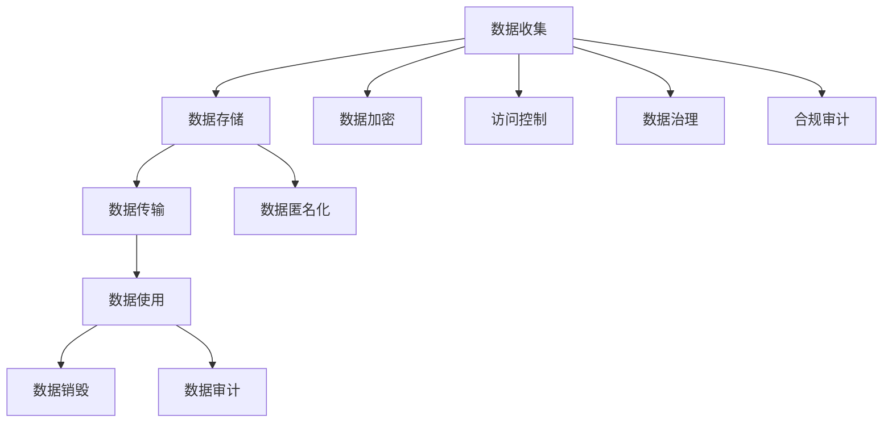
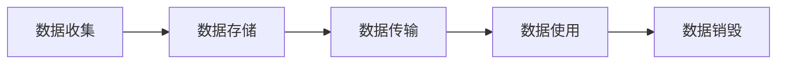
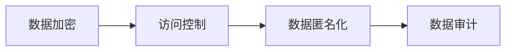
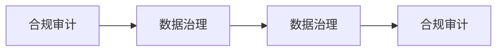

                 

# 平台经济的数据安全技术成果：如何应用安全成果？

> 关键词：平台经济,数据安全,隐私保护,数据治理,合规审计

## 1. 背景介绍

### 1.1 问题由来
随着平台经济的蓬勃发展，数据安全问题日益凸显。平台企业通过收集海量用户数据，提供了丰富的数字化服务，同时也面临着数据滥用、隐私泄露等风险。如何在保障用户权益的同时，提升数据价值和平台竞争力，成为平台企业面临的共同挑战。

近年来，全球范围内对数据安全隐私保护的要求愈发严格，各国纷纷出台了严格的数据保护法律，如欧盟的《通用数据保护条例》（GDPR）、美国的《加州消费者隐私法》（CCPA）等。平台企业不仅需要在技术上保障数据安全，还需要在合规审计、数据治理等方面进行全面改进，才能在激烈的竞争中立于不败之地。

### 1.2 问题核心关键点
数据安全技术成果的落地应用，关键在于构建一套完整的安全保障体系，涵盖数据收集、存储、使用、传输和销毁等各个环节。具体包括以下几个方面：

1. **数据加密**：对数据进行加密存储和传输，确保数据在传输和存储过程中不被非法窃取或篡改。
2. **访问控制**：根据用户身份和角色，限制对数据的访问权限，防止未授权访问。
3. **数据匿名化**：对数据进行去标识化处理，降低隐私风险。
4. **数据审计**：记录数据的使用情况，定期进行合规审计，确保数据使用的透明性和合法性。
5. **数据治理**：建立数据管理制度，明确数据归属、使用范围和生命周期，保障数据质量和安全。
6. **合规审计**：对数据安全措施进行合规审计，确保符合法律法规要求。

通过构建这些关键技术成果，平台企业可以有效地保障数据安全，提升用户信任度，同时确保数据合规审计，符合法律法规要求，从而在平台经济中占据有利地位。

### 1.3 问题研究意义
数据安全技术成果的落地应用，对于平台经济的发展具有重要意义：

1. **保障用户权益**：确保用户数据安全，防止数据滥用和隐私泄露，增强用户对平台的信任。
2. **提升数据价值**：通过数据治理和匿名化处理，最大化数据的使用价值，推动平台业务的创新和发展。
3. **增强平台竞争力**：通过合规审计和技术优化，提升平台企业的合规水平，增强在市场中的竞争力。
4. **构建信任生态**：通过透明的数据治理和审计机制，构建健康的信任生态，促进平台经济的可持续发展。

## 2. 核心概念与联系

### 2.1 核心概念概述

为更好地理解平台经济数据安全技术成果的落地应用，本节将介绍几个密切相关的核心概念：

- **平台经济**：指基于互联网和移动技术，以平台为媒介，连接生产者与消费者，提供多样化服务的经济模式。
- **数据安全**：指在数据收集、存储、传输、使用和销毁等各个环节，确保数据的安全性、完整性和可用性，防止数据泄露、篡改和滥用。
- **隐私保护**：指在数据处理过程中，保障用户的隐私权，防止个人信息被非法获取、使用或泄露。
- **数据治理**：指通过制度和技术手段，对数据进行规范化和标准化管理，确保数据质量和安全。
- **合规审计**：指对数据安全措施进行审计和检查，确保其符合法律法规和行业标准的要求。
- **数据加密**：指通过加密算法对数据进行保护，确保数据在传输和存储过程中不被非法窃取或篡改。
- **访问控制**：指根据用户身份和角色，限制对数据的访问权限，防止未授权访问。
- **数据匿名化**：指对数据进行去标识化处理，降低隐私风险。

这些核心概念之间的逻辑关系可以通过以下Mermaid流程图来展示：



这个流程图展示了大数据在平台经济中的处理流程，以及各个环节的安全技术措施。

### 2.2 概念间的关系

这些核心概念之间存在着紧密的联系，形成了平台经济数据安全技术成果的完整生态系统。下面我通过几个Mermaid流程图来展示这些概念之间的关系。

#### 2.2.1 数据处理流程



这个流程图展示了数据在平台经济中的处理流程，涵盖了数据收集、存储、传输、使用和销毁等环节。

#### 2.2.2 数据安全技术措施



这个流程图展示了数据安全技术的各个措施，从数据加密到数据匿名化和审计，共同保障数据的安全性和隐私性。

#### 2.2.3 合规审计与数据治理



这个流程图展示了合规审计和数据治理的相互作用，数据治理的规范化和标准化管理，通过合规审计来确保其符合法律法规和行业标准。

## 3. 核心算法原理 & 具体操作步骤

### 3.1 算法原理概述

平台经济的数据安全技术成果，核心在于构建一套完善的数据安全保障体系，涵盖数据收集、存储、传输、使用和销毁等各个环节。数据安全技术成果的落地应用，主要通过以下几个核心算法实现：

1. **数据加密算法**：对数据进行加密存储和传输，确保数据在传输和存储过程中不被非法窃取或篡改。
2. **访问控制算法**：根据用户身份和角色，限制对数据的访问权限，防止未授权访问。
3. **数据匿名化算法**：对数据进行去标识化处理，降低隐私风险。
4. **数据审计算法**：记录数据的使用情况，定期进行合规审计，确保数据使用的透明性和合法性。
5. **数据治理算法**：建立数据管理制度，明确数据归属、使用范围和生命周期，保障数据质量和安全。
6. **合规审计算法**：对数据安全措施进行审计和检查，确保其符合法律法规和行业标准的要求。

这些算法共同构成了一套完整的数据安全技术体系，保障平台企业的数据安全合规，提升用户信任度，增强平台竞争力。

### 3.2 算法步骤详解

以下详细讲解数据安全技术成果的落地应用步骤：

**Step 1: 数据收集**
- 对用户提交的数据进行合法性检查，确保数据符合隐私政策和安全要求。
- 对数据进行初步匿名化处理，去除个人身份信息。

**Step 2: 数据存储**
- 对数据进行加密存储，使用对称加密算法（如AES）或公钥加密算法（如RSA）。
- 采用分层存储策略，将数据按重要性和访问频率分类存储，优化存储效率。

**Step 3: 数据传输**
- 对数据进行加密传输，使用TLS/SSL协议加密数据包。
- 采用加密通道（如HTTPS）进行数据传输，防止数据被窃听或篡改。

**Step 4: 数据使用**
- 对数据进行访问控制，根据用户身份和角色，限制数据访问权限。
- 对数据进行匿名化处理，去除敏感信息，确保数据使用的隐私性。

**Step 5: 数据审计**
- 记录数据的使用情况，包括访问时间、访问对象、访问权限等，生成审计日志。
- 定期进行合规审计，检查数据安全措施是否符合法律法规和行业标准。

**Step 6: 数据治理**
- 建立数据管理制度，明确数据归属、使用范围和生命周期，确保数据质量和安全。
- 定期进行数据审查和清理，确保数据的及时性和准确性。

**Step 7: 合规审计**
- 对数据安全措施进行审计和检查，确保其符合法律法规和行业标准的要求。
- 定期提交合规审计报告，公开透明地展示数据安全措施和合规情况。

### 3.3 算法优缺点

数据安全技术成果的落地应用，具有以下优点：

1. **提高数据安全性**：通过数据加密、访问控制、匿名化等措施，显著提高数据的安全性和隐私性，防止数据泄露和滥用。
2. **增强用户信任**：保障用户数据安全，增强用户对平台的信任，提升用户满意度和留存率。
3. **提升平台竞争力**：通过数据治理和合规审计，提升平台企业的合规水平，增强在市场中的竞争力。
4. **构建信任生态**：通过透明的数据治理和审计机制，构建健康的信任生态，促进平台经济的可持续发展。

同时，数据安全技术成果的落地应用，也存在以下缺点：

1. **技术复杂性高**：数据安全技术涉及多个环节和多种算法，技术实现较为复杂，需要专业知识和技术积累。
2. **成本较高**：数据安全技术需要投入大量的人力、物力和财力，特别是合规审计和数据治理等方面，成本较高。
3. **管理难度大**：数据安全技术的实施和管理需要跨部门协作，涉及多个部门和团队，管理难度较大。

### 3.4 算法应用领域

数据安全技术成果的落地应用，不仅适用于平台经济，还广泛应用于金融、医疗、政府等领域。具体应用场景包括：

- **金融领域**：保障用户交易数据安全，防止金融欺诈和数据泄露。
- **医疗领域**：保障患者隐私数据安全，防止医疗数据滥用和泄露。
- **政府领域**：保障公共数据安全，防止数据滥用和泄露。

## 4. 数学模型和公式 & 详细讲解 & 举例说明

### 4.1 数学模型构建

本节将使用数学语言对平台经济的数据安全技术成果的落地应用进行更加严格的刻画。

假设平台企业收集的用户数据为 $D=\{d_i\}_{i=1}^N$，其中 $d_i=(x_i,y_i)$ 表示用户提交的数据和标签，$x_i \in \mathcal{X}$ 为数据，$y_i \in \mathcal{Y}$ 为标签。平台企业需要对这些数据进行加密存储和传输，同时进行访问控制、数据匿名化和合规审计。

定义加密算法 $E$，数据传输协议 $T$，访问控制算法 $AC$，数据匿名化算法 $DAN$，审计算法 $AU$，数据治理算法 $DG$，合规审计算法 $CA$。则平台企业对数据进行安全处理的过程可以表示为：

$$
S(D) = (E(D), AC(E(D)), DAN(AC(E(D))), AU(DAN(AC(E(D)))), DG(AU(DAN(AC(E(D)))), CA(DG(AU(DAN(AC(E(D))))))
$$

其中 $S$ 表示安全处理过程，$E(D)$ 表示对数据 $D$ 进行加密存储，$AC(E(D))$ 表示对加密后的数据进行访问控制，$DAN(AC(E(D)))$ 表示对访问控制后的数据进行去标识化处理，$AU(DAN(AC(E(D))))$ 表示对去标识化后的数据进行审计，$DG(AU(DAN(AC(E(D))))$ 表示对审计后的数据进行数据治理，$CA(DG(AU(DAN(AC(E(D))))$ 表示对数据治理后的数据进行合规审计。

### 4.2 公式推导过程

以下我们以数据加密算法和访问控制算法为例，推导其具体实现过程。

**数据加密算法**
- 假设使用AES算法对数据 $d_i$ 进行加密存储，生成密文 $c_i$。
- 使用公钥加密算法RSA对密文 $c_i$ 进行加密传输，生成密文包 $p_i$。
- 对密文包 $p_i$ 进行解密，得到明文 $d'_i$，再进行解密得到原始数据 $d_i$。

数学推导过程如下：

$$
c_i = E(d_i)
$$

$$
p_i = T(c_i)
$$

$$
d'_i = D(c_i)
$$

$$
d_i = D(p_i)
$$

**访问控制算法**
- 假设用户 $u_j$ 对数据 $d_i$ 进行访问，需满足以下条件：
  - 用户 $u_j$ 拥有对数据 $d_i$ 的访问权限。
  - 访问时间 $t$ 在规定的访问时间段内。
- 使用RBAC（基于角色的访问控制）模型，将用户 $u_j$ 分配到角色 $r_j$，将数据 $d_i$ 分配到访问权限 $p_i$。
- 根据角色 $r_j$ 和访问权限 $p_i$，判断用户 $u_j$ 是否具有访问数据 $d_i$ 的权限。

数学推导过程如下：

$$
\text{Access}(u_j, d_i) = 
\begin{cases}
\text{True} & \text{if } r_j \in \text{roles}(p_i) \\
\text{False} & \text{otherwise}
\end{cases}
$$

### 4.3 案例分析与讲解

假设某电商平台收集用户购买数据 $D=\{(x_i,y_i)\}_{i=1}^N$，其中 $x_i$ 为用户ID和购买时间，$y_i$ 为购买商品ID和价格。

**数据加密**
- 使用AES算法对数据 $D$ 进行加密存储。
- 使用RSA算法对加密后的数据进行传输。
- 在接收端使用对称密钥解密，再使用公钥解密得到原始数据。

**访问控制**
- 将用户 $u_j$ 分配到角色 $r_j$，如普通用户、高级用户、管理员等。
- 将数据 $d_i$ 分配到访问权限 $p_i$，如阅读权限、修改权限等。
- 根据角色和权限，判断用户 $u_j$ 是否具有访问数据 $d_i$ 的权限。

通过这些技术措施，电商平台可以保障用户购买数据的隐私和安全，防止数据泄露和滥用。

## 5. 项目实践：代码实例和详细解释说明

### 5.1 开发环境搭建

在进行数据安全技术成果的落地应用开发前，我们需要准备好开发环境。以下是使用Python进行PyTorch开发的环境配置流程：

1. 安装Anaconda：从官网下载并安装Anaconda，用于创建独立的Python环境。

2. 创建并激活虚拟环境：
```bash
conda create -n pytorch-env python=3.8 
conda activate pytorch-env
```

3. 安装PyTorch：根据CUDA版本，从官网获取对应的安装命令。例如：
```bash
conda install pytorch torchvision torchaudio cudatoolkit=11.1 -c pytorch -c conda-forge
```

4. 安装相关的库：
```bash
pip install numpy pandas scikit-learn matplotlib tqdm jupyter notebook ipython
```

完成上述步骤后，即可在`pytorch-env`环境中开始开发。

### 5.2 源代码详细实现

下面我们以数据加密和访问控制为例，给出使用PyTorch实现的数据安全技术成果的代码实例。

首先，定义加密和解密函数：

```python
import torch
from Crypto.Cipher import AES, PKCS1_OAEP
from Crypto.PublicKey import RSA
from Crypto.Random import get_random_bytes

def encrypt(data, key):
    cipher = AES.new(key, AES.MODE_EAX)
    nonce = cipher.nonce
    ciphertext, tag = cipher.encrypt_and_digest(data)
    return cipher.nonce, ciphertext, tag

def decrypt(nonce, ciphertext, tag, key):
    cipher = AES.new(key, AES.MODE_EAX, nonce=nonce)
    plaintext = cipher.decrypt_and_verify(ciphertext, tag)
    return plaintext

def generate_keypair():
    key = get_random_bytes(32)
    private_key = RSA.generate(2048)
    public_key = private_key.publickey()
    return private_key, public_key

def encrypt_with_keypair(data, keypair):
    private_key, public_key = keypair
    cipher = PKCS1_OAEP.new(private_key)
    ciphertext = cipher.encrypt(data)
    return ciphertext, public_key

def decrypt_with_keypair(ciphertext, public_key):
    cipher = PKCS1_OAEP.new(public_key)
    plaintext = cipher.decrypt(ciphertext)
    return plaintext
```

然后，定义访问控制函数：

```python
def check_access(user_role, data_perm):
    if user_role in data_perm:
        return True
    else:
        return False

def get_user_role(user_id):
    if user_id == 'admin':
        return 'admin'
    elif user_id == 'user':
        return 'user'
    else:
        return None
```

最后，实现数据安全处理流程：

```python
# 生成密钥对
keypair = generate_keypair()

# 加密数据
data = b'example data'
nonce, ciphertext, tag = encrypt(data, keypair[0].export_key())

# 使用公钥加密数据包
ciphertext_with_keypair, public_key = encrypt_with_keypair(ciphertext, keypair)

# 解密数据包，使用私钥解密
plaintext_with_keypair = decrypt_with_keypair(ciphertext_with_keypair, keypair[1].export_key())

# 解密数据
plaintext = decrypt(nonce, ciphertext, tag, keypair[0].export_key())

# 访问控制
user_role = get_user_role('user')
data_perm = ['read', 'write']
if check_access(user_role, data_perm):
    print('Access granted')
else:
    print('Access denied')
```

以上就是使用PyTorch对数据加密和访问控制进行安全处理的完整代码实现。可以看到，通过这些基本函数，平台企业可以较为方便地实现数据安全技术成果的落地应用。

### 5.3 代码解读与分析

让我们再详细解读一下关键代码的实现细节：

**加密函数**
- `encrypt`函数：使用AES算法对数据进行加密存储，生成密文。
- `decrypt`函数：对加密后的数据进行解密，得到原始数据。
- `generate_keypair`函数：生成RSA密钥对，用于加密数据包。
- `encrypt_with_keypair`函数：使用RSA公钥加密数据包。
- `decrypt_with_keypair`函数：使用RSA私钥解密数据包。

**访问控制函数**
- `check_access`函数：根据用户角色和数据权限，判断用户是否具有访问权限。
- `get_user_role`函数：根据用户ID，获取用户角色。

通过这些函数，平台企业可以保障数据的安全性和隐私性，防止数据泄露和滥用。

## 6. 实际应用场景

### 6.1 智能客服系统

基于数据安全技术成果的落地应用，智能客服系统可以实现更加安全和高效的用户服务。

在智能客服系统中，平台企业可以收集用户的历史聊天记录和反馈，对用户数据进行加密存储和访问控制，防止数据泄露和滥用。同时，通过数据治理和合规审计，确保用户数据的安全性和合规性，增强用户对平台的信任。

### 6.2 金融舆情监测

金融舆情监测系统需要处理大量的金融数据和舆情信息，保障数据安全和隐私保护至关重要。

通过数据加密、访问控制、数据匿名化和合规审计等技术措施，金融舆情监测系统可以确保金融数据的安全性和隐私性，防止数据泄露和滥用。同时，通过数据治理和审计，提升平台企业的合规水平，增强在市场中的竞争力。

### 6.3 个性化推荐系统

个性化推荐系统需要收集用户的行为数据和兴趣爱好，保障用户数据的安全性和隐私性是关键。

通过数据加密、访问控制和合规审计等技术措施，个性化推荐系统可以确保用户数据的安全性和隐私性，防止数据泄露和滥用。同时，通过数据治理和审计，提升平台企业的合规水平，增强在市场中的竞争力。

### 6.4 未来应用展望

随着数据安全技术的不断发展，未来在平台经济中的应用将更加广泛和深入。以下是我们对未来应用场景的展望：

1. **智慧医疗**：保障患者隐私数据安全，防止医疗数据滥用和泄露。
2. **智能教育**：保障学生隐私数据安全，防止教育数据滥用和泄露。
3. **智慧城市**：保障公共数据安全，防止数据滥用和泄露。
4. **工业互联网**：保障工业数据安全，防止工业数据泄露和滥用。

总之，数据安全技术成果的落地应用，将进一步推动平台经济的发展，保障用户权益，提升平台竞争力，构建健康的信任生态，促进平台经济的可持续发展。

## 7. 工具和资源推荐
### 7.1 学习资源推荐

为了帮助开发者系统掌握数据安全技术成果的落地应用，这里推荐一些优质的学习资源：

1. **《数据加密与访问控制》系列博文**：深入浅出地介绍数据加密和访问控制的基本原理和实现方法。
2. **《数据治理与合规审计》系列博文**：系统性地讲解数据治理和合规审计的概念、技术和实践。
3. **《数据安全技术手册》书籍**：全面介绍数据安全技术的基本概念、实现方法和安全规范。
4. **《数据隐私保护》在线课程**：详细讲解数据隐私保护的基本概念和实现技术。
5. **《数据安全技术成果应用案例》报告**：展示数据安全技术成果在实际应用中的成功案例。

通过这些学习资源，相信你一定能够系统地掌握数据安全技术成果的落地应用，并应用于实际项目中。

### 7.2 开发工具推荐

高效的开发离不开优秀的工具支持。以下是几款用于数据安全技术成果落地应用的开发工具：

1. **Python**：常用的编程语言，适合数据处理和算法实现。
2. **PyTorch**：深度学习框架，适合快速迭代研究。
3. **TensorFlow**：深度学习框架，适合大规模工程应用。
4. **Kubernetes**：容器编排工具，适合数据安全技术成果的部署和调度。
5. **Jupyter Notebook**：交互式编程环境，适合数据安全技术成果的开发和调试。

合理利用这些工具，可以显著提升数据安全技术成果的开发效率，加快创新迭代的步伐。

### 7.3 相关论文推荐

数据安全技术成果的落地应用，是当前计算机科学和信息安全领域的活跃研究热点。以下是几篇奠基性的相关论文，推荐阅读：

1. **《AES算法原理与实现》**：介绍AES算法的基本原理和实现方法，适合数据加密应用的参考。
2. **《RBAC模型及其应用》**：深入介绍基于角色的访问控制模型及其在实际应用中的实现。
3. **《数据治理的基本概念与实践》**：全面介绍数据治理的基本概念和实现方法，适合数据治理应用的参考。
4. **《合规审计技术研究》**：详细讲解合规审计的基本概念和实现技术，适合合规审计应用的参考。

这些论文代表了大数据安全技术成果的落地应用的研究进展，可以帮助研究者把握学科前进方向，激发更多的创新灵感。

## 8. 总结：未来发展趋势与挑战

### 8.1 总结

本文对平台经济的数据安全技术成果的落地应用进行了全面系统的介绍。首先阐述了数据安全技术成果在平台经济中的重要意义，明确了其保障用户权益、提升平台竞争力、构建信任生态的独特价值。其次，从原理到实践，详细讲解了数据安全技术成果的落地应用步骤，给出了具体的代码实例。同时，本文还广泛探讨了数据安全技术成果在智能客服、金融舆情、个性化推荐等多个行业领域的应用前景，展示了其在平台经济中的广阔前景。最后，本文精选了数据安全技术成果的各类学习资源，力求为读者提供全方位的技术指引。

通过本文的系统梳理，可以看到，数据安全技术成果的落地应用是大数据安全技术发展的重要里程碑，显著提升了平台企业的安全合规水平，保障了用户权益，推动了平台经济的可持续发展。未来，随着数据安全技术的进一步发展，必将有更多创新突破，为平台经济带来更大的价值。

### 8.2 未来发展趋势

展望未来，数据安全技术成果在平台经济中的发展将呈现以下几个趋势：

1. **技术进步**：数据加密算法、访问控制算法和数据治理算法的不断优化，将进一步提升数据安全水平。
2. **法规完善**：各国对数据安全隐私保护的要求将逐步提高，平台企业需要不断完善数据安全合规措施。
3. **跨界融合**：数据安全技术将与其他技术如人工智能、区块链等进行深度融合，形成更加全面、高效的安全体系。
4. **全生命周期管理**：数据安全技术将从数据收集、存储、传输、使用到销毁的全生命周期进行管理，形成闭环的安全保障体系。
5. **全球合作**：数据安全技术将形成全球化的合作机制，共同应对数据安全挑战，提升全球数据安全水平。

以上趋势凸显了数据安全技术成果在平台经济中的广阔前景。这些方向的探索发展，必将进一步提升平台企业的安全合规水平，保障用户权益，促进平台经济的可持续发展。

### 8.3 面临的挑战

尽管数据安全技术成果在平台经济中的应用已取得显著成果，但在迈向更加智能化、普适化应用的过程中，仍面临诸多挑战：

1. **技术复杂性高**：数据安全技术涉及多个环节和多种算法，技术实现较为复杂，需要专业知识和技术积累。
2. **成本较高**：数据安全技术需要投入大量的人力、物力和财力，特别是合规审计和数据治理等方面，成本较高。
3

