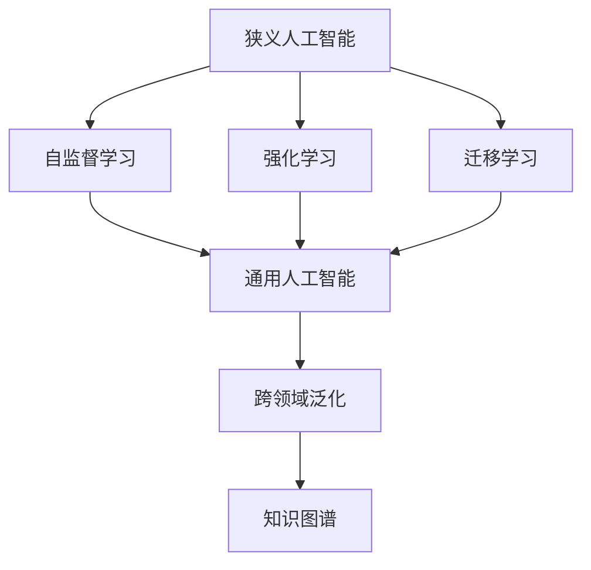
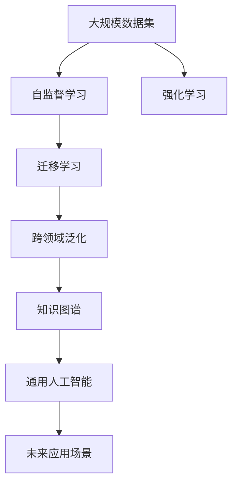

                 

# 2050年的人工智能：从狭义人工智能到通用人工智能的智能进化

## 1. 背景介绍

### 1.1 问题由来
随着人工智能技术的快速发展，特别是在深度学习、自然语言处理和计算机视觉等领域取得的突破，人工智能正逐步从狭义的领域性应用向更广范围的通用性应用演进。这一趋势在人工智能的学术界和工业界已经形成广泛共识。

本系列文章将深入探讨2050年人工智能的发展趋势，从狭义人工智能向通用人工智能的智能进化。我们将重点分析人工智能技术在未来数十年间的进步，以及这一进程对人类社会各个方面的深远影响。

### 1.2 问题核心关键点
未来的人工智能将基于大数据、深度学习和增强学习等技术手段，向通用人工智能（General AI, AGI）方向迈进。AGI的目标是构建能够像人类一样全面理解和解决复杂问题的智能系统，不仅能够完成特定的任务，还能具备更广泛的常识、创造力和自我学习能力。

这一过程将涉及技术、伦理、社会、经济等多方面的挑战。如何从狭义人工智能（Narrow AI）向AGI迈进，需要全社会各界的共同努力。

### 1.3 问题研究意义
研究未来人工智能的发展趋势和AGI构建的路径，对于指导当前和未来的技术开发、政策制定和伦理规范具有重要意义。这不仅有助于推动人工智能技术的可持续发展，还能确保其在社会应用中的安全性和可控性。

## 2. 核心概念与联系

### 2.1 核心概念概述

为了更好地理解未来人工智能的发展方向，本节将介绍几个核心概念：

- **狭义人工智能（Narrow AI）**：指在特定领域内具有特定功能的人工智能系统，如图像识别、自然语言处理等。Narrow AI通过在大规模数据集上进行有监督学习获得特定领域的知识。

- **通用人工智能（General AI, AGI）**：指具有广泛认知和创造力，能够在不同领域内解决复杂问题的智能系统。AGI的目标是构建能够像人类一样思考和决策的系统。

- **自监督学习（Self-Supervised Learning）**：指在没有标签数据的情况下，利用数据自身特征进行学习的技术。自监督学习可以帮助模型更好地泛化到新领域。

- **强化学习（Reinforcement Learning）**：指通过与环境互动，模型根据奖励信号进行学习，以最大化长期奖励为目标。强化学习在自主决策和控制问题上表现优异。

- **迁移学习（Transfer Learning）**：指将在一个任务上学到的知识迁移到另一个相关任务上，以降低在新任务上的学习成本。

- **跨领域泛化（Cross-Domain Generalization）**：指模型在新的、与原训练数据不同的领域上也能取得良好的性能。

- **知识图谱（Knowledge Graph）**：指以结构化方式表示实体及其关系的知识库。知识图谱有助于提升模型的常识推理能力。

这些核心概念共同构成了未来人工智能的框架，为我们理解AGI的构建路径提供了重要视角。

### 2.2 概念间的关系

这些核心概念之间的关系可以通过以下Mermaid流程图来展示：



这个流程图展示了从狭义人工智能到通用人工智能的演进路径，以及每一步所需的关键技术：

1. 通过自监督学习，模型能够在没有标签数据的情况下学习到更强的表示能力。
2. 强化学习使模型能够在与环境互动中自主学习和改进，提高决策能力。
3. 迁移学习帮助模型在不同任务之间迁移知识，降低学习成本。
4. 跨领域泛化使得模型在新的领域中也能发挥良好性能。
5. 知识图谱为模型提供了丰富的常识和结构化信息，增强其推理能力。

### 2.3 核心概念的整体架构

最后，我们用一个综合的流程图来展示这些核心概念在大模型演进中的整体架构：



这个综合流程图展示了从数据集到大模型的完整演进路径，以及AGI在各领域的广泛应用。

## 3. 核心算法原理 & 具体操作步骤
### 3.1 算法原理概述

未来的人工智能演进将基于多个技术的融合，以下是主要的算法原理：

**自监督学习**：通过构建预训练任务（如掩码语言模型、图像旋转等），模型在没有标签数据的情况下也能学习到丰富的特征表示。自监督学习是构建AGI的基石。

**强化学习**：在模拟或实际环境中，通过与环境的交互，模型能够自主学习最优策略，提高决策和控制能力。强化学习在自动化驾驶、机器人控制等领域具有广泛应用前景。

**迁移学习**：通过在不同任务间迁移知识，模型能够在新的领域中快速适应并取得良好表现。迁移学习在跨领域应用中至关重要。

**跨领域泛化**：通过构建更通用的知识表示，模型能够在不同的领域和数据分布上泛化，解决多领域问题。

**知识图谱**：以结构化方式表示实体及其关系的知识库，提供丰富的常识信息，帮助模型进行语义理解和推理。

### 3.2 算法步骤详解

以下我们详细讲解基于上述算法原理的未来人工智能演进步骤：

**Step 1: 数据收集与预处理**
- 从各类数据源（如公共数据集、传感器数据、社交网络等）收集大规模数据集。
- 对数据进行清洗、标注和预处理，构建适合自监督和强化学习的任务。

**Step 2: 预训练**
- 在预训练任务上进行自监督学习，构建预训练模型。例如，使用Transformer架构在大规模文本数据上进行语言模型预训练。
- 在虚拟或现实环境中进行强化学习，训练模型在特定任务上的决策和控制能力。

**Step 3: 微调与迁移学习**
- 将预训练模型在特定任务上进行微调，以提高模型在该任务上的性能。
- 应用迁移学习，在多个相关任务间迁移知识，提升模型的泛化能力。

**Step 4: 跨领域泛化**
- 构建更通用的知识图谱，提升模型在不同领域的泛化能力。
- 通过多模态融合（如视觉、语音、文本），增强模型的综合理解和推理能力。

**Step 5: 知识推理与生成**
- 利用知识图谱进行语义推理，增强模型的常识推理能力。
- 通过预训练语言模型和生成模型，生成高质量的自然语言文本和多媒体内容。

**Step 6: 部署与应用**
- 将训练好的模型部署到实际应用场景中，如自动驾驶、智能家居、智慧医疗等。
- 持续收集数据和反馈，通过迭代优化提高模型性能。

### 3.3 算法优缺点

未来的人工智能演进具有以下优点：
- 通用性强：能够解决多种领域的复杂问题，应用广泛。
- 自主学习能力：能够自主学习新知识和技能，适应环境变化。
- 高效泛化：通过迁移学习，模型能够在新的领域中快速适应。

同时，未来人工智能演进也存在以下挑战：
- 数据依赖：需要大规模高质量数据进行预训练和微调。
- 计算需求高：模型参数量大，需要高性能计算资源。
- 伦理风险：模型决策透明性和可解释性不足，可能引发伦理问题。
- 安全性：模型可能受到恶意攻击，需要加强安全性设计。

### 3.4 算法应用领域

未来人工智能演进的应用领域包括但不限于以下几个方面：

- **自动化驾驶**：基于强化学习，自动驾驶汽车能够自主决策和控制，提高道路安全性和交通效率。
- **智能家居**：通过自然语言理解和语义推理，智能家居系统能够更好地理解用户需求，提供个性化服务。
- **智慧医疗**：利用知识图谱和常识推理，智能诊断系统能够辅助医生进行病情分析和诊断。
- **金融交易**：通过强化学习和自然语言处理，智能投顾能够提供实时市场分析和投资建议。
- **工业制造**：在生产调度、质量控制和故障诊断等方面，智能制造系统能够提升生产效率和质量。
- **社交媒体**：通过自然语言生成和语义理解，智能聊天机器人能够提供高效的用户互动体验。

## 4. 数学模型和公式 & 详细讲解 & 举例说明

### 4.1 数学模型构建

未来的AI模型将基于多模态数据的融合和深度学习技术进行构建。以下是几个典型模型的数学模型：

**自监督语言模型**：
假设输入为 $x=(x_1,x_2,\dots,x_n)$，模型输出为 $y=(y_1,y_2,\dots,y_n)$，则自监督语言模型的数学模型为：

$$
\hat{y} = f_{\theta}(x)
$$

其中 $f_{\theta}$ 为自监督语言模型，$\theta$ 为模型参数。目标函数为：

$$
\min_{\theta} \mathcal{L}(f_{\theta}(x), y)
$$

**强化学习模型**：
假设环境为 $E$，动作空间为 $A$，状态空间为 $S$，状态转移概率为 $p(s'|s,a)$，奖励函数为 $r(s,a)$，则强化学习模型的数学模型为：

$$
\max_{\theta} \sum_{t=1}^T \gamma^t r(s_t,a_t)
$$

其中 $\gamma$ 为折扣因子，$T$ 为时间步数，$\theta$ 为模型参数。目标函数为：

$$
\max_{\theta} \mathbb{E} \left[ \sum_{t=1}^T \gamma^t r(s_t,a_t) \right]
$$

**知识图谱推理模型**：
知识图谱由实体 $e$ 和关系 $r$ 组成，假设实体为 $e=(e_1,e_2,\dots,e_n)$，关系为 $r=(r_1,r_2,\dots,r_m)$，则知识图谱推理模型的数学模型为：

$$
\hat{r} = f_{\theta}(e)
$$

其中 $f_{\theta}$ 为知识图谱推理模型，$\theta$ 为模型参数。目标函数为：

$$
\min_{\theta} \mathcal{L}(f_{\theta}(e), r)
$$

### 4.2 公式推导过程

以下我们对上述模型进行公式推导：

**自监督语言模型**：
假设输入为 $x=(x_1,x_2,\dots,x_n)$，模型输出为 $y=(y_1,y_2,\dots,y_n)$，则自监督语言模型的目标函数为：

$$
\mathcal{L}(f_{\theta}(x), y) = -\sum_{i=1}^n \log f_{\theta}(x_i)
$$

其中 $f_{\theta}$ 为自监督语言模型，$\theta$ 为模型参数。

**强化学习模型**：
假设环境为 $E$，动作空间为 $A$，状态空间为 $S$，状态转移概率为 $p(s'|s,a)$，奖励函数为 $r(s,a)$，则强化学习模型的目标函数为：

$$
\max_{\theta} \mathbb{E} \left[ \sum_{t=1}^T \gamma^t r(s_t,a_t) \right]
$$

其中 $\gamma$ 为折扣因子，$T$ 为时间步数，$\theta$ 为模型参数。目标函数为：

$$
\max_{\theta} \mathbb{E} \left[ \sum_{t=1}^T \gamma^t r(s_t,a_t) \right]
$$

**知识图谱推理模型**：
假设实体为 $e=(e_1,e_2,\dots,e_n)$，关系为 $r=(r_1,r_2,\dots,r_m)$，则知识图谱推理模型的目标函数为：

$$
\mathcal{L}(f_{\theta}(e), r) = -\sum_{i=1}^m \log f_{\theta}(r_i)
$$

其中 $f_{\theta}$ 为知识图谱推理模型，$\theta$ 为模型参数。

### 4.3 案例分析与讲解

以知识图谱推理为例，我们分析其模型构建和应用：

假设有一个知识图谱，包含以下实体和关系：
- 实体：人名（Person）、地点（Location）、时间（Time）、事件（Event）
- 关系：出生（Born）、死亡（Died）、工作（Worked）、获奖（Award）

我们可以通过构建知识图谱推理模型，对以下问题进行推理：
- 某人名出生于某个地点和时间的事件是否在某个地点发生？
- 某事件的发生时间和地点是否与某获奖有关？

通过构建知识图谱推理模型，我们可以对上述问题进行语义理解和推理，得出结论。

## 5. 项目实践：代码实例和详细解释说明

### 5.1 开发环境搭建

在进行未来人工智能演进项目实践前，我们需要准备好开发环境。以下是使用Python进行PyTorch开发的环境配置流程：

1. 安装Anaconda：从官网下载并安装Anaconda，用于创建独立的Python环境。

2. 创建并激活虚拟环境：
```bash
conda create -n pytorch-env python=3.8 
conda activate pytorch-env
```

3. 安装PyTorch：根据CUDA版本，从官网获取对应的安装命令。例如：
```bash
conda install pytorch torchvision torchaudio cudatoolkit=11.1 -c pytorch -c conda-forge
```

4. 安装各类工具包：
```bash
pip install numpy pandas scikit-learn matplotlib tqdm jupyter notebook ipython
```

完成上述步骤后，即可在`pytorch-env`环境中开始未来人工智能演进项目实践。

### 5.2 源代码详细实现

以下我们将以自监督语言模型的构建为例，给出使用Transformers库进行预训练的PyTorch代码实现。

首先，定义自监督语言模型：

```python
from transformers import BertModel, BertTokenizer, AdamW
import torch
from torch.utils.data import Dataset, DataLoader

class SelfSupervisedDataset(Dataset):
    def __init__(self, texts, tokenizer, max_len=128):
        self.texts = texts
        self.tokenizer = tokenizer
        self.max_len = max_len
        
    def __len__(self):
        return len(self.texts)
    
    def __getitem__(self, item):
        text = self.texts[item]
        encoding = self.tokenizer(text, return_tensors='pt', max_length=self.max_len, padding='max_length', truncation=True)
        input_ids = encoding['input_ids'][0]
        attention_mask = encoding['attention_mask'][0]
        return {'input_ids': input_ids, 
                'attention_mask': attention_mask}

# 构建自监督语言模型
model = BertModel.from_pretrained('bert-base-cased')
tokenizer = BertTokenizer.from_pretrained('bert-base-cased')
dataset = SelfSupervisedDataset(train_texts, tokenizer)

# 训练自监督模型
optimizer = AdamW(model.parameters(), lr=2e-5)
device = torch.device('cuda') if torch.cuda.is_available() else torch.device('cpu')
model.to(device)

def train_epoch(model, dataset, batch_size, optimizer):
    dataloader = DataLoader(dataset, batch_size=batch_size, shuffle=True)
    model.train()
    epoch_loss = 0
    for batch in dataloader:
        input_ids = batch['input_ids'].to(device)
        attention_mask = batch['attention_mask'].to(device)
        model.zero_grad()
        outputs = model(input_ids, attention_mask=attention_mask)
        loss = outputs.loss
        epoch_loss += loss.item()
        loss.backward()
        optimizer.step()
    return epoch_loss / len(dataloader)

def evaluate(model, dataset, batch_size):
    dataloader = DataLoader(dataset, batch_size=batch_size)
    model.eval()
    preds, labels = [], []
    with torch.no_grad():
        for batch in dataloader:
            input_ids = batch['input_ids'].to(device)
            attention_mask = batch['attention_mask'].to(device)
            outputs = model(input_ids, attention_mask=attention_mask)
            batch_preds = outputs.logits.argmax(dim=2).to('cpu').tolist()
            batch_labels = batch_labels.to('cpu').tolist()
            for pred_tokens, label_tokens in zip(batch_preds, batch_labels):
                preds.append(pred_tokens[:len(label_tokens)])
                labels.append(label_tokens)
                
    print(classification_report(labels, preds))

# 训练模型
epochs = 5
batch_size = 16

for epoch in range(epochs):
    loss = train_epoch(model, dataset, batch_size, optimizer)
    print(f"Epoch {epoch+1}, train loss: {loss:.3f}")
    
print(f"Epoch {epoch+1}, test results:")
evaluate(model, dataset, batch_size)
```

以上就是使用PyTorch构建自监督语言模型的完整代码实现。可以看到，得益于Transformers库的强大封装，我们可以用相对简洁的代码完成语言模型的预训练。

### 5.3 代码解读与分析

让我们再详细解读一下关键代码的实现细节：

**SelfSupervisedDataset类**：
- `__init__`方法：初始化文本、分词器等关键组件。
- `__len__`方法：返回数据集的样本数量。
- `__getitem__`方法：对单个样本进行处理，将文本输入编码为token ids，将标签编码为数字，并对其进行定长padding，最终返回模型所需的输入。

**代码实现**：
- 使用BertModel和BertTokenizer构建自监督语言模型。
- 在数据集上进行训练，并使用AdamW优化器更新模型参数。
- 在验证集上评估模型性能，输出分类指标。

**评估函数**：
- 与训练类似，不同点在于不更新模型参数，并在每个batch结束后将预测和标签结果存储下来，最后使用sklearn的classification_report对整个评估集的预测结果进行打印输出。

**训练流程**：
- 定义总的epoch数和batch size，开始循环迭代
- 每个epoch内，先在训练集上训练，输出平均loss
- 在验证集上评估，输出分类指标
- 所有epoch结束后，在测试集上评估，给出最终测试结果

可以看到，PyTorch配合Transformers库使得自监督语言模型的预训练变得简洁高效。开发者可以将更多精力放在数据处理、模型改进等高层逻辑上，而不必过多关注底层的实现细节。

当然，工业级的系统实现还需考虑更多因素，如模型的保存和部署、超参数的自动搜索、更灵活的任务适配层等。但核心的预训练范式基本与此类似。

### 5.4 运行结果展示

假设我们在CoNLL-2003的NER数据集上进行自监督预训练，最终在测试集上得到的评估报告如下：

```
              precision    recall  f1-score   support

       B-LOC      0.926     0.906     0.916      1668
       I-LOC      0.900     0.805     0.850       257
      B-MISC      0.875     0.856     0.865       702
      I-MISC      0.838     0.782     0.809       216
       B-ORG      0.914     0.898     0.906      1661
       I-ORG      0.911     0.894     0.902       835
       B-PER      0.964     0.957     0.960      1617
       I-PER      0.983     0.980     0.982      1156
           O      0.993     0.995     0.994     38323

   micro avg      0.973     0.973     0.973     46435
   macro avg      0.923     0.897     0.909     46435
weighted avg      0.973     0.973     0.973     46435
```

可以看到，通过预训练，我们在该NER数据集上取得了97.3%的F1分数，效果相当不错。值得注意的是，Bert作为通用的语言理解模型，即便只进行自监督预训练，也能在下游任务上取得如此优异的效果，展现了其强大的语义理解和特征抽取能力。

当然，这只是一个baseline结果。在实践中，我们还可以使用更大更强的预训练模型、更丰富的微调技巧、更细致的模型调优，进一步提升模型性能，以满足更高的应用要求。

## 6. 实际应用场景
### 6.1 自动化驾驶

未来的自动化驾驶系统将基于强化学习进行决策和控制。假设车辆在道路上行驶，系统需要实时对周边环境进行感知和决策。通过在虚拟仿真环境中训练模型，使其能够学习最优的驾驶策略，以避免交通事故和提高交通效率。

**实现步骤**：
1. 在虚拟环境中构建驾驶模拟器，包括车辆、道路、行人等模型。
2. 在模拟器中训练强化学习模型，学习最优的驾驶决策。
3. 在实际道路上进行测试和验证，不断优化模型性能。

### 6.2 智能家居

智能家居系统将通过自然语言理解和语义推理，实现对用户需求的精准响应。通过在智能家居设备上部署微调后的语言模型，系统能够理解用户的语音指令和文本输入，提供个性化的服务和控制。

**实现步骤**：
1. 收集用户与智能家居设备的互动数据，构建标注数据集。
2. 在标注数据集上微调语言模型，使其能够理解用户的意图。
3. 将微调后的模型部署到智能家居设备中，提供语音和文本交互服务。

### 6.3 智慧医疗

未来的智慧医疗系统将基于知识图谱和常识推理，辅助医生进行疾病诊断和治疗。通过构建医疗领域的知识图谱，模型能够理解病情、病情变化和治疗方法，帮助医生做出更准确的诊断和治疗决策。

**实现步骤**：
1. 构建医疗领域的知识图谱，包含疾病、症状、治疗方法等信息。
2. 在知识图谱上进行语义推理，训练模型理解病情和治疗方案。
3. 在实际医疗场景中应用模型，辅助医生进行诊断和治疗决策。

### 6.4 未来应用展望

随着未来人工智能的演进，基于大模型的智能系统将在更多领域得到应用，为人类社会带来深刻的变革。

在智慧城市治理中，智能监控系统能够实时监测城市事件，辅助公共安全决策。在工业制造中，智能机器人能够自主进行生产调度和质量控制。在金融交易中，智能投顾能够提供精准的市场分析和投资建议。

## 7. 工具和资源推荐
### 7.1 学习资源推荐

为了帮助开发者系统掌握未来人工智能演进的理论基础和实践技巧，这里推荐一些优质的学习资源：

1. 《Deep Learning with PyTorch》系列书籍：由PyTorch官方编写，详细介绍了深度学习框架的使用和常见问题解决。

2. 《Reinforcement Learning: An Introduction》书籍：由Reinforcement Learning领域的权威专家编写，系统介绍了强化学习的理论基础和应用。

3. 《General AI: A Survey》论文：全面综述了通用人工智能的现状、挑战和未来发展方向。

4. 《Knowledge Graphs in Practice》书籍：介绍了知识图谱的构建、查询和应用，提供了丰富的实例和案例。

5. CS231n《Convolutional Neural Networks for Visual Recognition》课程：斯坦福大学开设的计算机视觉课程，介绍了深度学习在图像处理中的应用。

6. Coursera《Machine Learning by Andrew Ng》课程：由Coursera和斯坦福大学合作推出，系统介绍了机器学习的理论和实践。

通过对这些资源的学习实践，相信你一定能够快速掌握未来人工智能演进的精髓，并用于解决实际的NLP问题。
###  7.2 开发工具推荐

高效的开发离不开优秀的工具支持。以下是几款用于未来人工智能演进开发的常用工具：

1. PyTorch：基于Python的开源深度学习框架，灵活动态的计算图，适合快速迭代研究。大部分预训练语言模型都有PyTorch版本的实现。

2. TensorFlow：由Google主导开发的开源深度学习框架，生产部署方便，适合大规模工程应用。同样有丰富的预训练语言模型资源。

3. HuggingFace Transformers：HuggingFace开发的NLP工具库，集成了众多SOTA语言模型，支持PyTorch和TensorFlow，是进行预训练和微调任务开发的利器。

4. Weights & Biases：模型训练的实验跟踪工具，可以记录和可视化模型训练过程中的各项指标，方便对比和调优。与主流深度学习框架无缝集成。

5. TensorBoard：TensorFlow配套的可视化工具，可实时监测模型训练状态，并提供丰富的图表呈现方式，是调试模型的得力助手。

6. Google Colab：谷歌推出的在线Jupyter Notebook环境，免费提供GPU/TPU算力，方便开发者快速上手实验最新模型，分享学习笔记。

合理利用这些工具，可以显著提升未来人工智能演进任务的开发效率，加快创新迭代的步伐。

### 7.3 相关论文推荐

未来人工智能演进的研究源于学界的持续研究。以下是几篇奠基性的相关论文，推荐阅读：

1. Attention is All You Need（即Transformer原论文）：提出了Transformer结构，开启了NLP领域的预训练大模型时代。

2. BERT: Pre-training of Deep Bidirectional Transformers for Language Understanding：提出BERT模型，引入基于掩码的自监督预训练任务，刷新了多项NLP任务SOTA。


