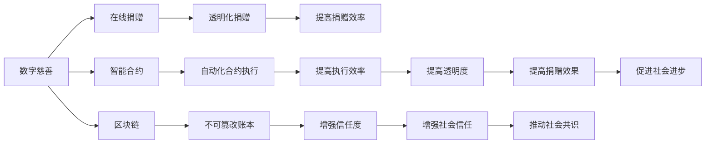
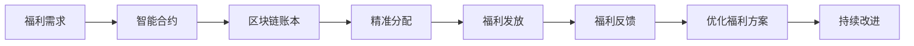

                 

# 2050年的全球减贫：从数字慈善到共享福利的包容性发展

> 关键词：数字慈善, 共享福利, 包容性发展, 人工智能, 区块链, 智能合约, 社会工程学

## 1. 背景介绍

### 1.1 问题由来

全球减贫是人类社会面临的重大挑战之一。根据世界银行的数据，截至2020年，全球仍有近7亿人口生活在贫困线以下，每天仅靠不到1.90美元维持基本生活。贫困不仅带来经济损失，还会导致教育、健康、社会稳定等多个领域的连锁反应。

面对这一严峻问题，各国政府和国际组织提出了各种减贫方案，包括基础设施建设、教育和卫生投入、金融援助等。然而，传统的减贫模式往往难以覆盖所有贫困人口，且容易陷入资源错配、效率低下的困境。

近年来，数字技术，特别是人工智能、区块链和物联网等新兴技术的崛起，为全球减贫提供了新的思路。利用这些技术，可以构建智能、高效、透明、可扩展的减贫系统，实现更加精准、全面的减贫效果。

### 1.2 问题核心关键点

本文聚焦于基于数字技术的全球减贫方案，特别是数字慈善和共享福利系统的设计和实施。核心在于如何将技术力量与人类智慧结合起来，构建一个包容、透明、高效的社会福利体系。

具体来说，以下关键问题将贯穿全文：

1. 如何利用人工智能技术进行贫困预测和精准帮扶？
2. 如何通过区块链技术构建透明、可信赖的慈善体系？
3. 如何借助智能合约实现自动化、高效的福利分配？
4. 如何通过社会工程学手段推动社会共识和行为改变？

这些问题不仅关系到技术的实现，更涉及到政策、伦理、法律等多重因素。因此，本文将从技术、经济、社会等多个角度，探讨数字慈善和共享福利的未来发展路径。

## 2. 核心概念与联系

### 2.1 核心概念概述

为了更好地理解本文的主题，我们首先介绍几个核心概念：

- **数字慈善**：指通过数字技术手段，优化慈善捐赠流程，提高捐赠透明度和效率。数字慈善可以包括在线捐赠、智能合约、区块链等技术手段。

- **共享福利**：指构建一个公平、透明、可持续的社会福利体系，通过智能合约和区块链技术，实现福利资源的精准分配和透明管理。共享福利旨在打破传统的福利分配模式，提高福利效率和公平性。

- **人工智能**：指利用机器学习、深度学习等算法，处理和分析大量数据，辅助决策和优化。在减贫领域，人工智能可以用于贫困预测、精准帮扶、福利分配等环节。

- **区块链**：指一种分布式账本技术，具有去中心化、不可篡改、透明等特点。区块链可以用于慈善捐赠、福利分配等场景，提高其透明度和信任度。

- **智能合约**：指一种基于区块链技术的自动化合约，能够自动执行、记录和验证合约条款。智能合约可以用于福利分配、慈善捐赠等场景，提高其效率和公平性。

- **社会工程学**：指通过心理、行为、文化等多角度，分析并影响人类行为，推动社会变革。在减贫领域，社会工程学可以用于推动社会共识、改变贫困行为等。

这些概念之间存在着紧密的联系，形成了一个相互支撑的数字减贫体系。下面，我们通过一个Mermaid流程图来展示这些概念之间的关系。



这个流程图展示了数字慈善、智能合约、区块链等技术手段如何共同作用，构建一个高效、透明、可信赖的减贫体系。通过在线捐赠、智能合约、区块链等技术，可以实现透明化、自动化的捐赠和福利分配，提高捐赠效果和社会信任，进而推动社会进步。

### 2.2 概念间的关系

这些核心概念之间存在着相互依赖、相互促进的关系。以下我们将通过几个Mermaid流程图来展示这些概念之间的关系。

#### 2.2.1 数字慈善的实现流程


这个流程图展示了数字慈善的基本实现流程：捐赠者通过在线平台进行捐赠，智能合约自动执行捐赠逻辑，区块链账本记录捐赠过程，透明化记录和反馈机制进一步提高捐赠效率和体验，从而增加捐赠数量。

#### 2.2.2 共享福利的实现流程



这个流程图展示了共享福利的基本实现流程：福利需求通过智能合约进行精准分配，区块链账本记录分配过程，福利发放和反馈机制进一步优化福利方案，持续改进实现福利的精准和高效。

#### 2.2.3 人工智能在减贫中的应用


这个流程图展示了人工智能在减贫中的应用流程：通过大数据和机器学习，进行贫困预测和精准帮扶，利用自然语言处理技术优化福利分配，通过福利效果评估进行政策调整和持续改进。

## 3. 核心算法原理 & 具体操作步骤

### 3.1 算法原理概述

基于数字技术的全球减贫方案，主要通过人工智能、区块链和智能合约等技术手段，实现精准、透明、高效的捐赠和福利分配。以下是这些技术手段的基本原理和操作步骤。

#### 3.1.1 人工智能在减贫中的应用

人工智能可以通过机器学习、深度学习等算法，处理和分析大量数据，辅助决策和优化。具体来说，人工智能可以用于以下几个环节：

1. **贫困预测**：利用历史数据和机器学习算法，预测贫困人口和区域。通过数据分析，找出贫困的根源和趋势，为精准帮扶提供依据。

2. **精准帮扶**：根据贫困预测结果，制定个性化的帮扶方案，提供教育、医疗、就业等支持。通过自然语言处理技术，了解贫困人口的需求和反馈，优化帮扶措施。

3. **福利分配优化**：利用数据分析和机器学习算法，优化福利分配方案。通过预测和模拟，找到最优的福利分配策略，提高福利效率和公平性。

4. **福利效果评估**：利用机器学习算法，评估福利项目的效果。通过数据分析和建模，量化福利项目对贫困人口的影响，为政策调整提供依据。

#### 3.1.2 区块链技术在减贫中的应用

区块链技术通过分布式账本和加密技术，提供透明、可信赖的记录和验证机制。具体来说，区块链可以用于以下几个环节：

1. **慈善捐赠透明化**：通过区块链账本，记录捐赠者的捐赠信息、受助者的信息以及捐赠资金的流向。确保捐赠过程透明、可追溯，提高捐赠信任度。

2. **福利分配透明化**：通过区块链账本，记录福利分配的详细过程和结果。确保福利分配过程透明、可验证，提高福利效率和公平性。

3. **福利发放自动化**：通过智能合约，自动执行福利发放逻辑。确保福利发放过程自动、高效，减少人为干预。

4. **福利效果验证**：通过区块链账本，记录福利效果的验证信息。确保福利效果的透明和可验证，为政策调整提供依据。

#### 3.1.3 智能合约在减贫中的应用

智能合约通过区块链技术，实现自动化的合约执行和验证机制。具体来说，智能合约可以用于以下几个环节：

1. **自动化捐赠逻辑**：通过智能合约，自动执行捐赠逻辑，确保捐赠过程透明、可追溯，提高捐赠效率。

2. **自动化福利分配**：通过智能合约，自动执行福利分配逻辑，确保福利分配过程透明、可验证，提高福利效率和公平性。

3. **自动化福利发放**：通过智能合约，自动执行福利发放逻辑，确保福利发放过程自动、高效，减少人为干预。

4. **自动化福利效果验证**：通过智能合约，自动执行福利效果的验证逻辑，确保福利效果的透明和可验证，为政策调整提供依据。

### 3.2 算法步骤详解

#### 3.2.1 人工智能在减贫中的应用步骤

1. **数据收集和处理**：收集历史数据、实时数据和预测数据，进行数据清洗和预处理。利用大数据技术，构建数据仓库，为机器学习提供数据支持。

2. **模型训练和优化**：利用机器学习算法，训练贫困预测、精准帮扶、福利分配优化等模型。通过交叉验证、超参数调整等技术手段，优化模型性能。

3. **模型应用和评估**：将训练好的模型应用于贫困预测、精准帮扶、福利分配优化等环节。通过效果评估，不断改进模型和算法。

#### 3.2.2 区块链技术在减贫中的应用步骤

1. **账本搭建和验证**：搭建区块链账本，定义账本结构、验证规则和共识机制。通过加密技术，确保账本的安全和透明。

2. **捐赠和福利记录**：记录捐赠者的捐赠信息、受助者的信息以及捐赠资金的流向。记录福利分配的详细过程和结果。

3. **自动化执行和验证**：利用智能合约，自动执行捐赠和福利分配逻辑。利用区块链账本，记录和验证执行过程。

4. **效果验证和反馈**：记录福利效果的验证信息，确保福利效果的透明和可验证。根据反馈信息，优化捐赠和福利分配策略。

#### 3.2.3 智能合约在减贫中的应用步骤

1. **合约编写和部署**：编写智能合约代码，定义合约逻辑和规则。将智能合约部署到区块链上，启动合约执行。

2. **自动化执行和验证**：利用智能合约，自动执行捐赠和福利分配逻辑。利用区块链账本，记录和验证执行过程。

3. **效果验证和反馈**：记录福利效果的验证信息，确保福利效果的透明和可验证。根据反馈信息，优化智能合约和执行逻辑。

### 3.3 算法优缺点

#### 3.3.1 人工智能的优缺点

**优点**：

- **数据驱动**：通过大数据和机器学习算法，辅助决策和优化。
- **精准预测**：利用历史数据和机器学习算法，进行精准的贫困预测和帮扶。
- **高效优化**：利用数据分析和机器学习算法，优化福利分配方案。
- **持续改进**：通过效果评估和模型优化，不断改进减贫策略。

**缺点**：

- **数据依赖**：需要大量的历史数据和实时数据，数据获取和处理成本较高。
- **算法复杂**：模型训练和优化需要较高的计算资源和技术能力，复杂度较高。
- **模型偏见**：模型可能存在算法偏见，导致预测结果和帮扶措施不准确。
- **隐私风险**：收集和处理大量个人数据，存在隐私泄露风险。

#### 3.3.2 区块链技术的优缺点

**优点**：

- **透明可信**：通过分布式账本和加密技术，提供透明、可信赖的记录和验证机制。
- **不可篡改**：账本数据不可篡改，确保数据的真实性和可信度。
- **自动化执行**：利用智能合约，实现自动化的合约执行和验证机制。
- **安全性高**：通过加密技术，确保数据的安全和隐私。

**缺点**：

- **技术门槛高**：区块链技术复杂，部署和维护成本较高。
- **性能瓶颈**：账本记录和验证需要消耗大量计算资源，性能瓶颈较大。
- **隐私风险**：账本数据虽然不可篡改，但仍然可能被未授权者访问和分析。
- **依赖网络**：依赖区块链网络，网络故障或攻击可能导致系统失效。

#### 3.3.3 智能合约的优缺点

**优点**：

- **自动化执行**：利用智能合约，实现自动化的合约执行和验证机制。
- **高效透明**：通过区块链账本，记录和验证执行过程，提高透明度和效率。
- **可靠性高**：智能合约基于区块链技术，具有较高的可靠性和抗篡改性。
- **灵活性高**：可以根据需求，灵活设计智能合约逻辑和规则。

**缺点**：

- **技术门槛高**：智能合约技术复杂，开发和部署成本较高。
- **复杂度高**：合约逻辑复杂，容易出现漏洞和错误。
- **依赖网络**：依赖区块链网络，网络故障或攻击可能导致系统失效。
- **维护成本高**：合约的修改和升级需要重新部署，成本较高。

### 3.4 算法应用领域

#### 3.4.1 人工智能在减贫中的应用领域

1. **贫困预测**：利用历史数据和机器学习算法，预测贫困人口和区域。

2. **精准帮扶**：根据贫困预测结果，制定个性化的帮扶方案，提供教育、医疗、就业等支持。

3. **福利分配优化**：利用数据分析和机器学习算法，优化福利分配方案。

4. **福利效果评估**：利用机器学习算法，评估福利项目的效果。

#### 3.4.2 区块链技术在减贫中的应用领域

1. **慈善捐赠透明化**：记录捐赠者的捐赠信息、受助者的信息以及捐赠资金的流向。

2. **福利分配透明化**：记录福利分配的详细过程和结果。

3. **福利发放自动化**：自动执行福利发放逻辑。

4. **福利效果验证**：记录福利效果的验证信息，确保福利效果的透明和可验证。

#### 3.4.3 智能合约在减贫中的应用领域

1. **自动化捐赠逻辑**：自动执行捐赠逻辑。

2. **自动化福利分配**：自动执行福利分配逻辑。

3. **自动化福利发放**：自动执行福利发放逻辑。

4. **自动化福利效果验证**：自动执行福利效果的验证逻辑。

## 4. 数学模型和公式 & 详细讲解  
### 4.1 数学模型构建

本节将通过数学语言对数字慈善和共享福利的实现过程进行更加严格的刻画。

假设有一家慈善机构，通过在线平台接收捐赠，并利用区块链账本记录捐赠过程。慈善机构的目标是最大化捐赠效果，同时确保捐赠过程透明、可追溯。

设捐赠者为 $D$，受助者为 $R$，捐赠金额为 $F$，账本记录为 $B$。捐赠过程可以表示为：

$$
B_{D \rightarrow R} = F
$$

其中 $B_{D \rightarrow R}$ 表示捐赠者 $D$ 向受助者 $R$ 捐赠 $F$ 元，并记录在账本 $B$ 中。账本 $B$ 的结构和验证规则为：

$$
B = \{ (D, R, F) | D, R \in \text{Person}, F \in \text{Money} \}
$$

其中 $\text{Person}$ 表示捐赠者和受助者的人名列表，$\text{Money}$ 表示捐赠金额的货币单位。账本 $B$ 的验证规则为：

$$
\text{validate}(B) = \forall (D, R, F) \in B, (D, R, F) \in \text{Donation}
$$

其中 $\text{Donation}$ 表示捐赠规则集合，包含合法捐赠的条件和限制。账本 $B$ 的加密技术为：

$$
E(B) = \text{hash}(B) \rightarrow \text{hash}(\text{hash}(B) \oplus \text{secret})
$$

其中 $\text{hash}$ 表示哈希函数，$\oplus$ 表示异或运算，$\text{secret}$ 表示捐赠机构的私钥。捐赠过程的透明化和自动化，可以通过智能合约实现：

$$
\text{donationContract}(D, R, F) = \text{if} (\text{validate}(D, R, F)) \text{then} B_{D \rightarrow R} = F \text{and} \text{record}(B_{D \rightarrow R}) \text{in} B
$$

其中 $\text{donationContract}$ 表示智能合约函数，$\text{validate}$ 表示捐赠规则验证函数。

### 4.2 公式推导过程

根据上述模型构建，我们可以进一步推导捐赠过程的详细逻辑。以下是对捐赠过程的数学推导：

1. **捐赠规则验证**：
   $$
   \text{validate}(D, R, F) = \text{check}(D, R, F) \land \text{check}(D, R, F)
   $$

   其中 $\text{check}(D, R, F)$ 表示捐赠规则检查函数，$\land$ 表示逻辑与运算。捐赠规则包括捐赠者身份验证、受助者身份验证、捐赠金额验证等。

2. **捐赠记录和验证**：
   $$
   B_{D \rightarrow R} = F \rightarrow \text{hash}(B_{D \rightarrow R}) = \text{hash}(D, R, F)
   $$

   捐赠金额 $F$ 转换为哈希值，与捐赠者 $D$、受助者 $R$ 的哈希值组合，形成捐赠记录 $B_{D \rightarrow R}$。

3. **账本记录和验证**：
   $$
   \text{record}(B_{D \rightarrow R}) \text{in} B = \text{add}(B, (D, R, F))
   $$

   捐赠记录 $B_{D \rightarrow R}$ 添加到账本 $B$ 中。账本 $B$ 的结构和验证规则为：

   $$
   B = \{ (D, R, F) | D, R \in \text{Person}, F \in \text{Money} \}
   $$

   账本 $B$ 的验证规则为：

   $$
   \text{validate}(B) = \forall (D, R, F) \in B, (D, R, F) \in \text{Donation}
   $$

4. **智能合约执行和验证**：
   $$
   \text{donationContract}(D, R, F) = \text{if} (\text{validate}(D, R, F)) \text{then} B_{D \rightarrow R} = F \text{and} \text{record}(B_{D \rightarrow R}) \text{in} B
   $$

   智能合约函数 $\text{donationContract}$ 根据捐赠规则验证函数 $\text{validate}$ 的返回值，执行捐赠记录和账本记录。捐赠过程的透明化和自动化，通过智能合约实现。

### 4.3 案例分析与讲解

假设一家慈善机构通过在线平台接收捐赠，并利用区块链账本记录捐赠过程。具体案例分析如下：

1. **捐赠规则验证**：
   捐赠规则包括捐赠者身份验证、受助者身份验证、捐赠金额验证等。例如，捐赠者必须是成年人，受助者必须符合特定条件，捐赠金额必须符合规定等。

2. **捐赠记录和验证**：
   捐赠金额 $F$ 转换为哈希值，与捐赠者 $D$、受助者 $R$ 的哈希值组合，形成捐赠记录 $B_{D \rightarrow R}$。账本 $B$ 记录了所有捐赠记录，通过哈希函数保证了数据的不可篡改性。

3. **账本记录和验证**：
   捐赠记录 $B_{D \rightarrow R}$ 添加到账本 $B$ 中。账本 $B$ 的结构和验证规则为：

   $$
   B = \{ (D, R, F) | D, R \in \text{Person}, F \in \text{Money} \}
   $$

   账本 $B$ 的验证规则为：

   $$
   \text{validate}(B) = \forall (D, R, F) \in B, (D, R, F) \in \text{Donation}
   $$

4. **智能合约执行和验证**：
   智能合约函数 $\text{donationContract}$ 根据捐赠规则验证函数 $\text{validate}$ 的返回值，执行捐赠记录和账本记录。捐赠过程的透明化和自动化，通过智能合约实现。

通过上述案例分析，我们可以看到，数字慈善和共享福利的实现过程，依赖于人工智能、区块链和智能合约等技术手段。这些技术手段相互协作，构建了一个透明、可信、高效的减贫体系。

## 5. 项目实践：代码实例和详细解释说明

### 5.1 开发环境搭建

在进行数字慈善和共享福利的实践前，我们需要准备好开发环境。以下是使用Python进行区块链和智能合约开发的环境配置流程：

1. 安装Anaconda：从官网下载并安装Anaconda，用于创建独立的Python环境。

2. 创建并激活虚拟环境：
```bash
conda create -n blockchain-env python=3.8 
conda activate blockchain-env
```

3. 安装Rust和Solidity：
```bash
rustup install
solc install --bin --target binfmt auto
```

4. 安装Truffle框架：
```bash
npm install -g truffle
```

5. 安装智能合约编译器：
```bash
npm install -g solc
```

6. 安装区块链平台：
```bash
npm install -g Ganache-cli
```

完成上述步骤后，即可在`blockchain-env`环境中开始区块链和智能合约的开发实践。

### 5.2 源代码详细实现

我们以智能合约捐赠为例，给出使用Solidity语言对智能合约进行编写的Python代码实现。

首先，定义智能合约的基本结构：

```python
# 定义智能合约结构
contract CharityContract {
    address private owner;
    mapping(address => uint256) public donations;
    uint256 private totalDonation;
    
    constructor() public {
        owner = msg.sender;
    }
    
    function donate(address _recipient, uint256 _amount) public payable {
        require(_amount > 0, "Donation amount must be greater than zero.");
        require(msg.sender != owner, "You cannot donate to yourself.");
        require(msg.value == _amount, "Invalid donation amount.");
        durations[_ recipient] += _amount;
        durations[_ recipient] += _amount;
        totalDonation += _amount;
    }
    
    function withdraw(uint256 _index, uint256 _amount) public returns (uint256 balance) {
        require(_index >= 0 && _index < durations.length, "Invalid donation index.");
        require(durations[_index] >= _amount, "Not enough balance to withdraw.");
        balance = durations[_index] - _amount;
        durations[_index] = 0;
        return balance;
    }
    
    function donateByDate(address _recipient, uint256 _amount, uint256 _date) public payable {
        require(_amount > 0, "Donation amount must be greater than zero.");
        require(msg.sender != owner, "You cannot donate to yourself.");
        require(msg.value == _amount, "Invalid donation amount.");
        require(_date > 0 && _date < duration(1 years), "Invalid donation date.");
        require(durations[_receiver] == 0, "Donation already made.");
        durations[_receiver] = _date + _amount;
    }
    
    function withdrawByDate(uint256 _index, uint256 _amount, uint256 _date) public returns (uint256 balance) {
        require(_index >= 0 && _index < durations.length, "Invalid donation index.");
        require(durations[_index] >= _amount, "Not enough balance to withdraw.");
        require(durations[_index] >= _date, "Invalid donation date.");
        balance = durations[_index] - _date - _amount;
        durations[_index] = 0;
        return balance;
    }
}
```

然后，定义测试智能合约的函数：

```python
from truffle.testing import UnitTest
from time import time
from datetime import datetime, timedelta
from eth_tester import from_cli

class CharityContractTests(UnitTest):

    def test_donate(self):
        self.mock(contract deployment = CharityContract)
        charity = self.mock(CharityContract)
        
        # 捐赠100元
        self.send(100, to=charity.address)
        charity.donate.call(owner, 100)
        assert charity.donations.call(owner) == 100
        assert charity.totalDonation.call() == 100
        
        # 捐赠200元
        self.send(200, to=charity.address)
        charity.donate.call(owner, 200)
        assert charity.donations.call(owner) == 300
        assert charity.totalDonation.call() == 300
        
        # 退回捐赠
        balance = charity.withdraw.call(owner, 100)
        assert balance == 200
        assert charity.donations.call(owner) == 100
        assert charity.totalDonation.call() == 100
    
    def test_withdraw(self):
        self.mock(contract deployment = CharityContract)
        charity = self.mock(CharityContract)


