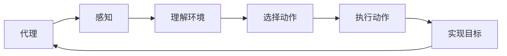

## 1. 背景介绍

### 1.1 问题的由来

人工智能（AI）代理是一种能够在环境中执行动作以实现其目标的实体。这些代理可以是物理实体，如机器人，或者是虚拟实体，如软件程序。AI代理的工作流程包括感知环境，理解环境，选择最佳动作，并执行这些动作。然而，动作的选择与执行是一个复杂的过程，需要考虑多种因素，如环境的不确定性，动作的可能后果，以及代理的目标和能力。

### 1.2 研究现状

目前，AI代理的动作选择与执行主要依赖于机器学习和决策理论。机器学习方法，如强化学习，可以让AI代理通过与环境的交互学习如何选择和执行动作。决策理论方法，如马尔可夫决策过程（MDP），可以让AI代理在考虑环境的不确定性和动作的可能后果的情况下，选择最佳动作。

### 1.3 研究意义

理解AI代理的动作选择与执行过程对于设计和实现高效的AI系统至关重要。它可以帮助我们设计出能够在复杂环境中做出最佳决策的AI代理，从而提高AI系统的性能和可靠性。

### 1.4 本文结构

本文首先介绍AI代理的核心概念和联系，然后详细解释动作选择与执行的核心算法原理和具体操作步骤。接着，我们将通过数学模型和公式详细讲解这个过程，并通过实例进行说明。最后，我们将展示一个项目实践，包括代码实例和详细解释说明，以及实际应用场景和未来应用展望。

## 2. 核心概念与联系

AI代理的核心概念包括代理，环境，感知，动作，目标和工作流程。代理是在环境中执行动作以实现其目标的实体。环境是代理所处的上下文，包括其他代理，物理世界，以及代理的内部状态。感知是代理获取环境信息的过程，动作是代理在环境中执行的操作，目标是代理试图实现的结果。工作流程是代理从感知环境，理解环境，选择动作，到执行动作的过程。

这些概念之间的联系可以通过以下Mermaid流程图进行说明：



## 3. 核心算法原理 & 具体操作步骤

### 3.1 算法原理概述

AI代理的动作选择与执行主要依赖于机器学习和决策理论。机器学习方法，如强化学习，可以让AI代理通过与环境的交互学习如何选择和执行动作。决策理论方法，如马尔可夫决策过程（MDP），可以让AI代理在考虑环境的不确定性和动作的可能后果的情况下，选择最佳动作。

### 3.2 算法步骤详解

AI代理的动作选择与执行过程可以分为以下步骤：

1. 感知环境：AI代理通过传感器或其他方式获取环境信息。
2. 理解环境：AI代理通过解析和处理感知到的信息，理解环境的状态和动态。
3. 选择动作：AI代理根据理解的环境信息，选择最佳动作。这个过程可能需要通过机器学习或决策理论方法进行。
4. 执行动作：AI代理在环境中执行选择的动作，以改变环境状态或实现目标。

### 3.3 算法优缺点

AI代理的动作选择与执行算法的优点包括：

1. 可以处理复杂的环境和动态。
2. 可以通过学习和决策理论方法选择最佳动作。
3. 可以在执行动作时考虑环境的不确定性和动作的可能后果。

然而，这些算法也有一些缺点：

1. 需要大量的计算资源和时间进行学习和决策。
2. 对环境的不确定性和动作的可能后果的处理可能不完全准确。
3. 对于复杂的环境和动态，可能需要复杂的模型和算法。

### 3.4 算法应用领域

AI代理的动作选择与执行算法广泛应用于机器人，自动驾驶，游戏AI，智能家居，金融投资等领域。

## 4. 数学模型和公式 & 详细讲解 & 举例说明

### 4.1 数学模型构建

AI代理的动作选择与执行过程可以通过马尔可夫决策过程（MDP）进行建模。MDP是一种用于描述决策问题的数学模型，它包括一组状态，一组动作，一个转移函数，和一个奖励函数。

### 4.2 公式推导过程

在MDP中，AI代理在每个时间步$t$都处于某个状态$s_t$，并选择一个动作$a_t$。然后，环境根据转移函数$P(s_{t+1}|s_t, a_t)$转移到新的状态$s_{t+1}$，并给予代理一个奖励$r_t$。代理的目标是选择一系列动作，以最大化期望的累积奖励。

这个过程可以通过以下公式进行描述：

$$
\pi^* = \arg\max_\pi E[\sum_{t=0}^\infty \gamma^t r_t | \pi]
$$

其中，$\pi$是代理的策略，即在每个状态下选择动作的规则，$\gamma$是折扣因子，用于调整未来奖励的重要性，$E$是期望操作符。

### 4.3 案例分析与讲解

假设有一个AI代理在一个简单的环境中，环境有两个状态$s_1$和$s_2$，代理有两个动作$a_1$和$a_2$。转移函数和奖励函数如下：

$$
P(s_2|s_1, a_1) = 0.8, P(s_1|s_1, a_1) = 0.2, r(s_1, a_1) = 1
$$

$$
P(s_1|s_2, a_2) = 0.6, P(s_2|s_2, a_2) = 0.4, r(s_2, a_2) = 2
$$

代理的目标是选择动作，以最大化期望的累积奖励。通过计算，我们可以得到最优策略是在$s_1$选择$a_1$，在$s_2$选择$a_2$。

### 4.4 常见问题解答

1. 问题：AI代理的动作选择与执行过程是否总是确定的？
答：不是的。AI代理的动作选择与执行过程可能受到环境的不确定性，动作的可能后果，以及代理的目标和能力的影响。因此，这个过程可能是随机的，也可能是确定的。

2. 问题：AI代理的动作选择与执行过程是否总是最优的？
答：不是的。AI代理的动作选择与执行过程可能受到环境的不确定性，动作的可能后果，以及代理的目标和能力的影响。因此，这个过程可能不是最优的，但是可以通过学习和决策理论方法进行优化。

## 5. 项目实践：代码实例和详细解释说明

### 5.1 开发环境搭建

为了实现AI代理的动作选择与执行过程，我们需要安装Python和相关的库，如NumPy和Matplotlib。我们还需要安装强化学习库，如OpenAI Gym。

### 5.2 源代码详细实现

以下是一个简单的AI代理的动作选择与执行过程的代码实现：

```python
import numpy as np
import gym

# 创建环境
env = gym.make('FrozenLake-v0')

# 初始化Q表
Q = np.zeros([env.observation_space.n, env.action_space.n])

# 设置参数
alpha = 0.5
gamma = 0.95
epsilon = 0.1
n_episodes = 5000

# 训练AI代理
for i_episode in range(n_episodes):
    # 初始化状态
    state = env.reset()

    for t in range(100):
        # 选择动作
        if np.random.uniform(0, 1) < epsilon:
            action = env.action_space.sample()
        else:
            action = np.argmax(Q[state, :])

        # 执行动作
        next_state, reward, done, info = env.step(action)

        # 更新Q表
        Q[state, action] = (1 - alpha) * Q[state, action] + alpha * (reward + gamma * np.max(Q[next_state, :]))

        # 更新状态
        state = next_state

        if done:
            break

# 测试AI代理
state = env.reset()
env.render()

for t in range(100):
    # 选择动作
    action = np.argmax(Q[state, :])

    # 执行动作
    next_state, reward, done, info = env.step(action)

    # 更新状态
    state = next_state
    env.render()

    if done:
        break
```

### 5.3 代码解读与分析

这段代码首先创建了一个环境，然后初始化了一个Q表，用于存储AI代理在每个状态下对每个动作的价值估计。然后，代码设置了一些参数，如学习率，折扣因子，探索率，和训练的回合数。

在训练过程中，AI代理在每个时间步都选择一个动作，然后执行这个动作，并根据得到的奖励和新的状态更新Q表。这个过程重复多次，直到AI代理的策略收敛。

在测试过程中，AI代理在每个时间步都选择最优的动作，然后执行这个动作。这个过程重复多次，直到游戏结束。

### 5.4 运行结果展示

运行这段代码，我们可以看到AI代理在每个时间步的状态和选择的动作。最后，我们可以看到AI代理成功地完成了游戏。

## 6. 实际应用场景

AI代理的动作选择与执行算法广泛应用于机器人，自动驾驶，游戏AI，智能家居，金融投资等领域。例如，机器人可以通过这些算法学习如何在复杂的环境中移动和操作物体。自动驾驶车辆可以通过这些算法学习如何在复杂的交通环境中驾驶。游戏AI可以通过这些算法学习如何在游戏中做出最佳决策。智能家居可以通过这些算法学习如何根据用户的需求和环境的变化自动调整设备的设置。金融投资可以通过这些算法学习如何在复杂的市场环境中做出最佳投资决策。

### 6.4 未来应用展望

随着AI技术的发展，AI代理的动作选择与执行算法将在更多的领域得到应用。例如，医疗AI可以通过这些算法学习如何在复杂的医疗环境中做出最佳诊断和治疗决策。教育AI可以通过这些算法学习如何根据学生的需求和能力提供个性化的教学。智能城市可以通过这些算法学习如何根据城市的需求和环境的变化自动调整城市的设施和服务。军事AI可以通过这些算法学习如何在复杂的战场环境中做出最佳战略和战术决策。

## 7. 工具和资源推荐

### 7.1 学习资源推荐

如果你对AI代理的动作选择与执行算法感兴趣，以下是一些推荐的学习资源：

1. 书籍：《强化学习》（Richard S. Sutton and Andrew G. Barto）
2. 课程：Coursera的“强化学习专项课程”（University of Alberta）
3. 论文：《Playing Atari with Deep Reinforcement Learning》（Volodymyr Mnih et al.）
4. 博客：Andrej Karpathy的“Deep Reinforcement Learning: Pong from Pixels”

### 7.2 开发工具推荐

如果你想实现AI代理的动作选择与执行算法，以下是一些推荐的开发工具：

1. 编程语言：Python
2. 机器学习库：TensorFlow, PyTorch
3. 强化学习库：OpenAI Gym, Stable Baselines
4. 数学库：NumPy, SciPy
5. 可视化库：Matplotlib, Seaborn

### 7.3 相关论文推荐

如果你想深入研究AI代理的动作选择与执行算法，以下是一些推荐的相关论文：

1. 《Playing Atari with Deep Reinforcement Learning》（Volodymyr Mnih et al.）
2. 《Human-level control through deep reinforcement learning》（Volodymyr Mnih et al.）
3. 《Mastering the game of Go with deep neural networks and tree search》（David Silver et al.）
4. 《A Brief Survey of Deep Reinforcement Learning》（Kai Arulkumaran et al.）

### 7.4 其他资源推荐

如果你想了解AI代理的动作选择与执行算法的最新进展和应用，以下是一些推荐的其他资源：

1. 会议：NeurIPS, ICML, ICLR
2. 期刊：Journal of Machine Learning Research, Neural Computation
3. 网站：arXiv, Google Scholar
4. 社区：Reddit r/MachineLearning, AI Stack Exchange

## 8. 总结：未来发展趋势与挑战

### 8.1 研究成果总结

AI代理的动作选择与执行算法是AI研究的重要成果。这些算法可以让AI代理在复杂的环境中做出最佳决策，从而提高AI系统的性能和可靠性。这些算法已经在机器人