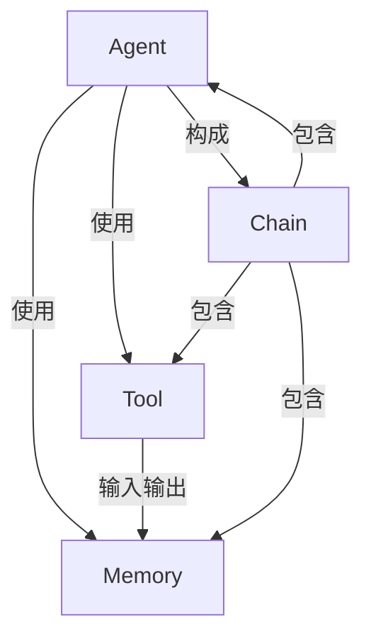

# 【LangChain编程：从入门到实践】框架介绍

## 1. 背景介绍

### 1.1 问题的由来

在当今数据爆炸式增长的时代，人工智能(AI)和自然语言处理(NLP)技术的应用越来越广泛。然而,构建一个端到端的AI系统并非易事,需要集成多种复杂的组件,如数据采集、预处理、模型训练、部署和维护等。这给开发人员带来了巨大的挑战。

LangChain旨在简化AI系统的构建过程,为开发人员提供了一个强大而灵活的框架,使他们能够轻松地组合各种AI模型、数据源和其他组件,快速构建生产级的AI应用程序。

### 1.2 研究现状

目前,市面上已经存在一些AI框架,如TensorFlow、PyTorch和Hugging Face等。然而,这些框架主要关注于模型训练和推理,而忽视了AI系统的整体构建过程。

另一方面,一些工作流编排工具(如Apache Airflow和Prefect)则专注于任务调度和数据管道构建,但缺乏对AI模型的直接支持。

LangChain则试图弥合这一差距,提供一个统一的框架,将AI模型、数据源和其他组件无缝集成,简化端到端AI系统的开发过程。

### 1.3 研究意义

LangChain的出现为AI应用程序的开发带来了诸多好处:

1. **简化开发流程**:LangChain抽象出了常见的AI任务,如问答、文本生成、文本总结等,使开发人员能够快速构建相应的应用程序,而无需从头开始编写复杂的代码。

2. **提高开发效率**:通过模块化设计和组件复用,LangChain极大地提高了开发效率,缩短了应用程序的上线时间。

3. **增强系统可扩展性**:LangChain支持多种AI模型、数据源和其他组件,使得系统能够根据需求进行灵活扩展和升级。

4. **促进AI技术普及**:LangChain降低了AI应用程序开发的门槛,使更多的开发人员能够参与到AI领域,促进了AI技术的普及和发展。

### 1.4 本文结构

本文将全面介绍LangChain框架,内容安排如下:

1. 背景介绍
2. 核心概念与联系
3. 核心算法原理与具体操作步骤
4. 数学模型和公式详细讲解及举例说明
5. 项目实践:代码实例和详细解释说明
6. 实际应用场景
7. 工具和资源推荐
8. 总结:未来发展趋势与挑战
9. 附录:常见问题与解答

## 2. 核心概念与联系

LangChain的核心概念包括Agent、Tool、Memory和Chain。这些概念相互关联,共同构建了LangChain的基础框架。



1. **Agent**: 代表一个智能体,负责执行特定的任务。Agent可以根据当前状态和记忆(Memory)选择合适的Tool来完成任务。

2. **Tool**: 代表一个具体的功能模块,如问答系统、文本生成器、数据库查询等。每个Tool都有明确的输入和输出接口。

3. **Memory**: 用于存储Agent执行任务过程中的中间状态和结果,供Agent在后续步骤中参考和利用。

4. **Chain**: 是一个更高层次的抽象,将多个Agent、Tool和Memory组合在一起,形成一个完整的任务流程。Chain可以嵌套其他Chain,构建复杂的AI系统。

这些核心概念的紧密联系赋予了LangChain强大的灵活性和可扩展性。开发人员可以根据需求自由组合不同的Agent、Tool和Memory,快速构建各种AI应用程序。

## 3. 核心算法原理与具体操作步骤

### 3.1 算法原理概述

LangChain的核心算法是一种基于规则的决策过程,用于指导Agent选择合适的Tool来完成任务。该算法的主要思想是:

1. 将任务分解为一系列子任务
2. 为每个子任务选择合适的Tool
3. 根据Tool的输出结果,更新Memory并决定下一步操作

该算法的伪代码如下:

```
function LangChainAlgorithm(task, agent, tools, memory):
    subtasks = DecomposeTask(task)
    for subtask in subtasks:
        tool = SelectTool(subtask, tools)
        result = ExecuteTool(tool, memory)
        memory.Update(result)
        if TaskCompleted(subtasks, memory):
            break
    return memory.GetFinalResult()
```

### 3.2 算法步骤详解

1. **任务分解(DecomposeTask)**

   Agent首先需要将原始任务分解为一系列更细化的子任务。这一步骤通常需要利用自然语言处理技术来分析任务描述,并将其转化为一系列具体的操作步骤。

2. **工具选择(SelectTool)**

   对于每个子任务,Agent需要从可用的Tool集合中选择最合适的Tool来执行。这一选择过程可以基于子任务的语义信息、Tool的功能描述以及历史记录等因素。

3. **工具执行(ExecuteTool)**

   选定合适的Tool后,Agent将调用该Tool的执行接口,并将相关的Memory信息作为输入传递给Tool。Tool根据输入执行相应的操作,并将结果返回给Agent。

4. **内存更新(memory.Update)**

   Agent将Tool的执行结果更新到Memory中,以供后续步骤使用。

5. **任务完成检查(TaskCompleted)**

   在每个子任务完成后,Agent需要检查原始任务是否已经完全完成。如果所有子任务都已执行,则任务完成;否则,将转入下一个子任务的处理。

6. **结果输出(memory.GetFinalResult)**

   当原始任务完全完成后,Agent从Memory中获取最终结果并输出。

该算法的优点在于其模块化设计和灵活性。开发人员可以根据需求定制任务分解、工具选择和内存更新等具体策略,使算法适应不同的应用场景。

### 3.3 算法优缺点

**优点**:

1. **模块化设计**:算法将不同的功能模块(如任务分解、工具选择等)分离,便于开发和维护。

2. **高度灵活性**:可以根据需求定制各个模块的具体实现,适应不同的应用场景。

3. **可扩展性强**:可以方便地集成新的Tool,扩展系统功能。

4. **易于理解**:算法思路清晰,易于人类理解和调试。

**缺点**:

1. **规则依赖**:算法高度依赖于任务分解和工具选择等规则的质量,规则设计不当可能导致性能下降。

2. **有限智能**:算法本身缺乏真正的"智能",无法自主学习和优化决策过程。

3. **可解释性差**:算法的决策过程对人类来说是一个黑箱,缺乏可解释性。

4. **局限性**:对于一些复杂的任务,简单的规则可能无法有效分解和处理。

### 3.4 算法应用领域

LangChain的核心算法适用于各种需要将复杂任务分解为一系列操作步骤的场景,例如:

1. **问答系统**:将问题分解为多个子任务,如信息检索、上下文理解、答案生成等,并选择合适的工具执行每个子任务。

2. **任务自动化**:将复杂的业务流程分解为多个步骤,并orchestrate不同的工具来执行每个步骤。

3. **决策支持系统**:将决策过程分解为信息收集、分析和评估等步骤,利用不同的工具辅助每个步骤的执行。

4. **智能助理**:将用户请求分解为多个子任务,如查询、计算、文本生成等,并协调相应的工具完成这些子任务。

总的来说,LangChain的核心算法为构建各种基于规则的智能系统提供了一个通用框架,使开发过程更加模块化和可扩展。

## 4. 数学模型和公式详细讲解及举例说明

虽然LangChain主要是一个基于规则的框架,但在某些模块中也涉及了一些数学模型和公式。本节将重点介绍其中一个常用的数学模型:语义相似度计算模型。

### 4.1 数学模型构建

在LangChain中,语义相似度计算模型用于衡量两个文本之间的语义相似程度。这对于选择合适的Tool执行特定的子任务至关重要。

语义相似度计算模型的构建基于词向量(Word Embedding)技术。具体来说,我们首先需要将文本转换为向量表示,然后计算两个向量之间的相似度作为语义相似度的度量。

常用的词向量表示方法包括Word2Vec、GloVe和BERT等。以Word2Vec为例,它将每个单词表示为一个固定长度的密集向量,这些向量能够捕捉单词之间的语义和语法关系。

设有两个文本$T_1$和$T_2$,它们的词向量表示分别为$\vec{V}_1$和$\vec{V}_2$。我们可以使用余弦相似度(Cosine Similarity)来计算它们的语义相似度:

$$\text{sim}(T_1, T_2) = \frac{\vec{V}_1 \cdot \vec{V}_2}{||\vec{V}_1|| \times ||\vec{V}_2||}$$

其中$\vec{V}_1 \cdot \vec{V}_2$表示两个向量的点积,而$||\vec{V}_1||$和$||\vec{V}_2||$分别表示向量的范数。

余弦相似度的取值范围是$[-1, 1]$,值越接近1,表示两个文本的语义越相似。

### 4.2 公式推导过程

余弦相似度公式的推导过程如下:

1. 设有两个向量$\vec{A}$和$\vec{B}$,它们的点积定义为:

$$\vec{A} \cdot \vec{B} = \sum_{i=1}^{n} A_i B_i$$

其中$n$是向量的维度。

2. 向量的范数(或长度)定义为:

$$||\vec{A}|| = \sqrt{\vec{A} \cdot \vec{A}} = \sqrt{\sum_{i=1}^{n} A_i^2}$$

3. 将点积除以两个向量的范数乘积,我们得到:

$$\frac{\vec{A} \cdot \vec{B}}{||\vec{A}|| \times ||\vec{B}||} = \frac{\sum_{i=1}^{n} A_i B_i}{\sqrt{\sum_{i=1}^{n} A_i^2} \sqrt{\sum_{i=1}^{n} B_i^2}}$$

这个值的范围是$[-1, 1]$,当两个向量完全相同时,值为1;当两个向量完全相反时,值为-1;当两个向量正交(即相互垂直)时,值为0。

4. 在语义相似度计算中,我们将$\vec{A}$和$\vec{B}$替换为文本$T_1$和$T_2$的词向量表示$\vec{V}_1$和$\vec{V}_2$,得到最终的语义相似度公式:

$$\text{sim}(T_1, T_2) = \frac{\vec{V}_1 \cdot \vec{V}_2}{||\vec{V}_1|| \times ||\vec{V}_2||}$$

### 4.3 案例分析与讲解

现在,我们来看一个具体的案例,计算两个句子"I love natural language processing"和"I like machine learning"的语义相似度。

首先,我们需要将这两个句子转换为词向量表示。假设使用预训练的Word2Vec模型,并将每个单词表示为100维向量,那么:

$$\vec{V}_1 = \begin{bmatrix} 0.2 & 0.5 & \cdots & 0.1 \end{bmatrix}_{1 \times 100}$$
$$\vec{V}_2 = \begin{bmatrix} 0.3 & 0.4 & \cdots & 0.2 \end{bmatrix}_{1 \times 100}$$

接下来,我们计算两个向量的点积:

$$\vec{V}_1 \cdot \vec{V}_2 = 0.2 \times 0.3 + 0.5 \times 0.4 + \cdots + 0.1 \times 0.2 = 0.23$$

以及它们的范数:

$$||\vec{