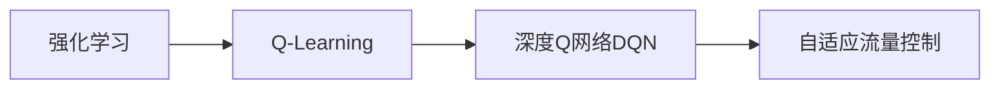
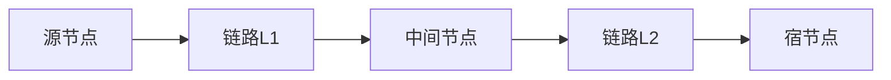

# 一切皆是映射：DQN在自适应网络流量控制中的应用

关键词：深度Q网络、强化学习、自适应流量控制、网络拥塞控制、端到端网络

## 1. 背景介绍

### 1.1 问题的由来
随着互联网的快速发展,网络流量呈现爆炸式增长,如何高效地利用网络资源、避免网络拥塞,成为了亟待解决的问题。传统的网络流量控制算法,如TCP拥塞控制,很难适应复杂多变的网络环境。因此,迫切需要一种自适应、智能化的流量控制方法。

### 1.2 研究现状
近年来,深度强化学习(Deep Reinforcement Learning, DRL)在众多领域取得了突破性进展。其中,深度Q网络(Deep Q-Network, DQN)算法更是广泛应用于连续控制、策略优化等任务。一些学者尝试将DQN引入网络流量控制中,希望借助其强大的学习和决策能力,实现网络流量的自适应优化调控。

### 1.3 研究意义
DQN自适应网络流量控制的研究,有望突破传统拥塞控制算法的局限,实现端到端(End-to-End)的网络流量全局优化。这不仅可以提升网络资源利用率,缓解网络拥塞,还能改善用户体验。同时,该研究为其他类型网络的智能化流量控制提供了新思路。

### 1.4 本文结构
本文将首先介绍DQN的核心概念和基本原理,然后重点阐述如何将其应用于自适应网络流量控制。通过数学建模和算法推导,详细讲解DQN流量控制的实现过程。并给出具体的代码实例和实验结果。最后,探讨该方法的实际应用场景和未来发展方向。

## 2. 核心概念与联系

**强化学习(Reinforcement Learning)**：一种让智能体(Agent)通过与环境的交互,学习最优决策的机器学习范式。
**Q-Learning**：一种常见的无模型(Model-Free)强化学习算法,通过值函数逼近(Value Function Approximation)来评估动作的长期收益。
**深度Q网络(DQN)**：用深度神经网络(DNN)逼近Q值函数,将强化学习拓展到高维连续状态空间。
**自适应流量控制**：根据网络状态的变化,动态调整发送速率,避免拥塞,提高网络利用率的一类方法。

它们的关系如下图所示：



## 3. 核心算法原理 & 具体操作步骤

### 3.1 算法原理概述
DQN的核心思想是：用深度神经网络近似Q值函数,通过最小化TD误差来更新网络参数,使之收敛到最优Q值。在此基础上,引入经验回放(Experience Replay)和目标网络(Target Network)等技巧,提高算法的稳定性和训练效率。

### 3.2 算法步骤详解
DQN在自适应流量控制中的应用,可分为以下几个关键步骤:

1. **状态表示**：将网络状态(如延迟、丢包率等)编码为固定维度的向量,作为DQN的输入。
2. **动作空间**：定义发送速率的调整方式(如加速、减速、保持不变),作为DQN的输出。
3. **奖励设计**：根据网络性能指标(如吞吐量、公平性),设计即时奖励函数,引导DQN学习最优策略。
4. **神经网络结构**：搭建包含输入层、隐藏层、输出层的DNN,用于逼近Q值函数。
5. **训练更新**：智能体与网络环境交互,产生状态-动作-奖励-下一状态的四元组,存入经验回放池。从中随机采样一个批次,计算TD误差,反向传播更新DQN参数。
6. **策略改进**：根据训练好的DQN,选择Q值最大的动作作为当前状态下的最优决策。

### 3.3 算法优缺点
DQN流量控制的优点在于:
- 可从海量的网络状态样本中自主学习,挖掘隐藏的规律,生成最优控制策略。
- 端到端的架构,无需人工设计特征,具有良好的泛化能力。
- 决策过程实时在线,适应动态变化的网络环境。

但它也存在一些不足:
- 需要大量的训练数据和时间,才能达到理想的控制效果。
- 难以设计最优的奖励函数,通常需要反复调试。
- 推理决策的过程不透明,缺乏可解释性。

### 3.4 算法应用领域
除了计算机网络,DQN还被广泛应用于以下领域:
- 自动驾驶：端到端学习车辆操控策略
- 智能电网：优化能源调度与需求响应
- 交通控制：多智能体协同控制交通流
- 机器人控制：学习连续动作空间下的运动规划

## 4. 数学模型和公式 & 详细讲解 & 举例说明

### 4.1 数学模型构建
考虑一个典型的网络流量控制场景,令$s_t$表示$t$时刻的网络状态,$a_t$为智能体执行的速率调整动作,$r_t$为采取该动作后获得的即时奖励。智能体的目标是最大化累积奖励:

$$
\max_{\pi} \mathbb{E}\left[\sum_{t=0}^{\infty} \gamma^t r_t | \pi \right]
$$

其中$\pi$为控制策略,$\gamma \in [0,1]$为折扣因子。定义状态-动作值函数(Q函数):

$$
Q^{\pi}(s,a) = \mathbb{E}\left[\sum_{k=0}^{\infty} \gamma^k r_{t+k} | s_t=s, a_t=a, \pi \right]
$$

表示在状态$s$下采取动作$a$,之后遵循策略$\pi$可获得的期望累积奖励。最优Q函数满足Bellman最优方程:

$$
Q^*(s,a) = \mathbb{E}_{s'} \left[ r + \gamma \max_{a'} Q^*(s',a') | s,a \right]
$$

### 4.2 公式推导过程
DQN用函数$Q(s,a;\theta)$来近似$Q^*(s,a)$,其中$\theta$为神经网络参数。在训练过程中,最小化如下损失函数:

$$
L(\theta) = \mathbb{E}_{(s,a,r,s')\sim \mathcal{D}} \left[ \left( r + \gamma \max_{a'} Q(s',a';\theta^-) - Q(s,a;\theta) \right)^2 \right]
$$

其中$\mathcal{D}$为经验回放池,$\theta^-$为目标网络参数,它每隔一段时间从$\theta$复制而来。根据梯度下降法更新$\theta$:

$$
\theta \leftarrow \theta - \alpha \nabla_{\theta} L(\theta)
$$

其中$\alpha$为学习率。重复这一过程,直至Q网络收敛。

### 4.3 案例分析与讲解
下面我们以一个简单的网络拓扑为例,说明DQN流量控制的工作流程。



假设L1和L2的带宽分别为10Mbps和5Mbps,链路缓冲区大小为5个分组。初始时,源节点以8Mbps的速率发送数据。

1. t=0时,状态$s_0$为(8,0,0),表示源发送速率为8Mbps,L1和L2上的排队长度为0。DQN选择动作$a_0=+2$,将发送速率提高到10Mbps。
2. t=1时,状态$s_1$为(10,0,5),L2产生拥塞,队列长度为5。但由于L1未拥塞,即时奖励$r_1=1$。DQN选择动作$a_1=-5$,降低发送速率到5Mbps。
3. t=2时,状态$s_2$为(5,0,0),网络恢复正常,奖励$r_2=2$。DQN选择动作$a_2=0$,维持当前速率不变。
4. 不断重复上述过程,DQN逐步学习如何根据网络状态动态调整速率,收敛到最优控制策略。

### 4.4 常见问题解答

**Q**: DQN能否处理高维或连续的状态空间?

**A**: 可以。DQN的优势在于用DNN拟合Q函数,它对状态特征具有很强的表达能力,适用于高维连续状态。但状态维度越高,训练的难度也会增加。

**Q**: DQN的收敛性和稳定性如何?

**A**: 原始DQN可能出现Q值估计过高、难以收敛等问题。一些改进方法如Double DQN、Dueling DQN,通过减小Q值估计偏差、分别估计状态值函数和优势函数,提高了收敛性和稳定性。此外,适当设置学习率、批大小等超参数也很重要。

## 5. 项目实践：代码实例和详细解释说明

### 5.1 开发环境搭建
首先需要安装必要的深度学习库,如PyTorch或TensorFlow。本文以PyTorch为例。

```bash
pip install torch
```

然后构建一个模拟网络环境,用于智能体的训练和测试。可使用OpenAI Gym接口定义环境类。

```bash
pip install gym
```

### 5.2 源代码详细实现
下面给出DQN流量控制的核心代码。

```python
import torch
import torch.nn as nn
import torch.optim as optim
import random
from collections import deque

# 定义Q网络结构
class DQN(nn.Module):
    def __init__(self, state_dim, action_dim):
        super(DQN, self).__init__()
        self.fc1 = nn.Linear(state_dim, 64)
        self.fc2 = nn.Linear(64, 64)
        self.fc3 = nn.Linear(64, action_dim)

    def forward(self, x):
        x = torch.relu(self.fc1(x))
        x = torch.relu(self.fc2(x))
        x = self.fc3(x)
        return x

# 定义智能体
class DQNAgent:
    def __init__(self, state_dim, action_dim, lr, gamma, epsilon, buffer_size, batch_size):
        self.state_dim = state_dim
        self.action_dim = action_dim
        self.lr = lr
        self.gamma = gamma
        self.epsilon = epsilon
        self.buffer = deque(maxlen=buffer_size)
        self.batch_size = batch_size

        self.policy_net = DQN(state_dim, action_dim)
        self.target_net = DQN(state_dim, action_dim)
        self.target_net.load_state_dict(self.policy_net.state_dict())
        self.optimizer = optim.Adam(self.policy_net.parameters(), lr=lr)
        self.loss_func = nn.MSELoss()

    def select_action(self, state):
        if random.random() < self.epsilon:
            return random.randint(0, self.action_dim - 1)
        else:
            with torch.no_grad():
                state = torch.tensor(state, dtype=torch.float32).unsqueeze(0)
                q_values = self.policy_net(state)
                return q_values.argmax().item()

    def train(self):
        if len(self.buffer) < self.batch_size:
            return

        batch = random.sample(self.buffer, self.batch_size)
        states, actions, rewards, next_states, dones = zip(*batch)

        states = torch.tensor(states, dtype=torch.float32)
        actions = torch.tensor(actions, dtype=torch.long).unsqueeze(1)
        rewards = torch.tensor(rewards, dtype=torch.float32).unsqueeze(1)
        next_states = torch.tensor(next_states, dtype=torch.float32)
        dones = torch.tensor(dones, dtype=torch.float32).unsqueeze(1)

        q_values = self.policy_net(states).gather(1, actions)
        next_q_values = self.target_net(next_states).max(1)[0].unsqueeze(1)
        expected_q_values = rewards + self.gamma * next_q_values * (1 - dones)

        loss = self.loss_func(q_values, expected_q_values)
        self.optimizer.zero_grad()
        loss.backward()
        self.optimizer.step()

# 训练主循环
def train_loop(env, agent, num_episodes, target_update):
    for episode in range(num_episodes):
        state = env.reset()
        done = False
        total_reward = 0

        while not done: