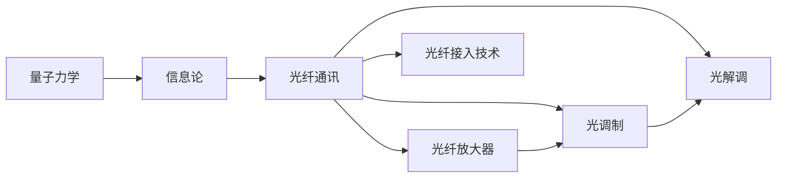
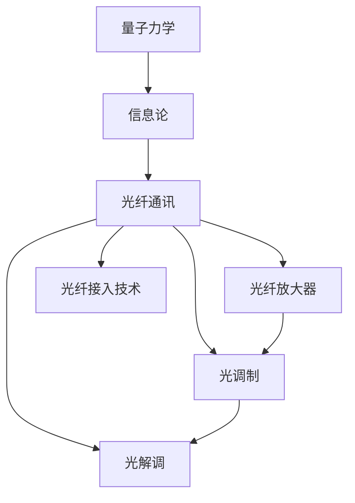

                 

## 1. 背景介绍

### 1.1 问题由来
1953年，贝尔实验室（Bell Labs）的研究人员开始探索一种基于**量子力学**和**信息论**的新型通讯方式，旨在克服当时有线通讯系统中频率带宽的限制。他们的研究工作很快引起了学术界的广泛关注，并催生了全新的通讯领域——**光纤通讯**。

### 1.2 问题核心关键点
贝尔实验室的研究人员试图解决的主要问题包括：
1. **高频域的传输效率**：高频信号在传统铜线传输时会有衰减，而低频信号则无法满足通讯的实时性要求。
2. **频谱利用率**：在有限的带宽内，如何最大化地传输信息。
3. **信号的抗干扰能力**：在传输过程中如何避免信号的干扰和衰减。

### 1.3 问题研究意义
贝尔实验室的研究不仅在理论层面有重大突破，也在实践层面带来了革命性的通讯技术。光纤通讯技术从根本上改变了信息传输的方式，推动了全球通讯产业的飞速发展。

## 2. 核心概念与联系

### 2.1 核心概念概述

贝尔实验室的研究涉及多个关键概念，这些概念共同构成了其理论基础和实现路径：

- **量子力学**：研究微观粒子的运动状态和相互作用，为后续信息传输提供了物理基础。
- **信息论**：研究信息的性质、度量、传输和存储，是通讯技术的数学基础。
- **光纤通讯**：利用光信号进行数据传输的通讯方式，突破了传统铜线的传输限制。
- **光纤放大器**：用于放大光信号的器件，解决光信号在传输中的衰减问题。
- **光调制和解调**：通过改变光信号的频率、振幅或相位，实现信息的编码和解码。
- **光纤接入技术**：将光纤接入到通讯网络中，实现长距离、大容量、高速率的传输。

这些核心概念通过相互作用，共同推动了光纤通讯技术的发展。

### 2.2 概念间的关系

以下是这些概念之间的联系，通过Mermaid流程图展示：



这个流程图展示了从量子力学到光纤通讯，再到光纤放大器和光调制解调的完整路径，最后通过光纤接入技术实现了长距离、大容量、高速率的传输。

### 2.3 核心概念的整体架构

最后，我们用一个综合的流程图来展示这些核心概念在大语言模型微调过程中的整体架构：



这个综合流程图展示了从量子力学到光纤通讯，再到光纤放大器和光调制解调的完整路径，最后通过光纤接入技术实现了长距离、大容量、高速率的传输。

## 3. 核心算法原理 & 具体操作步骤
### 3.1 算法原理概述

贝尔实验室的研究成果基于以下几个核心原理：

1. **量子叠加原理**：单个光子可以处于多种频率叠加态，可以传输多个信息通道，从而提高频谱利用率。
2. **相干叠加原理**：光信号通过干涉可以实现多通道信息的叠加，提高信号传输的密度。
3. **光纤放大**：利用光纤中的非线性效应（如受激发射）实现光信号的放大，解决长距离传输中的衰减问题。
4. **调制解调技术**：通过调制实现信息编码，通过解调实现信息解码，保证信息传输的准确性。

这些原理构成了光纤通讯技术的核心算法基础。

### 3.2 算法步骤详解

以下是光纤通讯技术的详细操作步骤：

**Step 1: 准备光信号和光纤**

- 制备光源（如激光器），发射出高频光信号。
- 准备传输光纤，确保其质量和清洁度。

**Step 2: 调制光信号**

- 使用调制器（如强度调制器、相位调制器）将信息（如数字信号）编码到光信号中。
- 调制后的光信号通过光纤传输，实现多通道传输。

**Step 3: 光信号放大**

- 在传输过程中，使用光纤放大器（如掺铒光纤放大器EDFA）对光信号进行放大，弥补传输损耗。
- 放大后的光信号继续传输到下一段光纤。

**Step 4: 光信号解调**

- 接收端通过解调器（如光电二极管）将光信号转换为电信号。
- 解调后的电信号经过放大和滤波处理，恢复原始信息。

**Step 5: 信息接收与处理**

- 接收端对解调后的电信号进行解码，恢复原始信息。
- 信息接收端对原始信息进行处理和传输，完成通讯过程。

### 3.3 算法优缺点

光纤通讯技术的主要优点包括：
1. **频谱利用率高**：通过量子叠加和相干叠加原理，实现了高密度的信息传输。
2. **传输速度快**：光信号的传输速度远超电信号，适合高速率传输。
3. **抗干扰能力强**：光信号在光纤中的传输受外界干扰较少，稳定性高。

其主要缺点包括：
1. **设备成本高**：光纤和光放大器等设备初期成本较高。
2. **安装维护复杂**：光纤和光放大器的安装和维护需要专业的技术和设备。
3. **易受攻击**：光信号的透明性使其容易受到攻击和窃听。

### 3.4 算法应用领域

光纤通讯技术广泛应用在以下领域：

- **互联网骨干网络**：提供高速、大容量的数据传输，支撑全球互联网基础设施。
- **移动通信**：在移动通信中传输基站之间的信号，提升网络质量。
- **有线电视网络**：用于传输高清视频内容，提高用户体验。
- **医疗通讯**：用于远程医疗诊断和治疗，提高医疗服务的可及性和效率。
- **军事通讯**：用于传输实时信息，增强军事指挥和控制能力。

## 4. 数学模型和公式 & 详细讲解 & 举例说明（备注：数学公式请使用latex格式，latex嵌入文中独立段落使用 $$，段落内使用 $)
### 4.1 数学模型构建

光纤通讯技术的数学模型主要基于光信号的传播和传输特性。假设光源发射的光信号为 $E(t)$，光纤长度为 $L$，光信号在光纤中的传播速度为 $v$，则光纤传输后的光信号 $E'(t)$ 可以表示为：

$$
E'(t) = \int_{-\infty}^{\infty} E(t-\tau)h(\tau)d\tau
$$

其中 $h(\tau)$ 为光信号在光纤中的传播特性函数。

### 4.2 公式推导过程

以下是光纤通讯技术的公式推导过程：

- **光信号的传播特性**：光信号在光纤中的传播特性可以通过传输函数 $h(\tau)$ 表示。假设光纤传输后的光信号为 $E'(t)$，则有：

$$
E'(t) = \int_{-\infty}^{\infty} E(t-\tau)h(\tau)d\tau
$$

- **光信号的调制**：光信号在调制器中进行调制，假设调制后的光信号为 $E'(t)$，则有：

$$
E'(t) = E(t) \cos(\omega t)
$$

- **光信号的放大**：光信号在光纤放大器中进行放大，假设放大后的光信号为 $E'(t)$，则有：

$$
E'(t) = E(t) + \Delta E(t)
$$

其中 $\Delta E(t)$ 为放大器引入的噪声和干扰。

- **光信号的解调**：光信号在解调器中进行解调，假设解调后的光信号为 $E'(t)$，则有：

$$
E'(t) = E(t) \cos(\omega t)
$$

### 4.3 案例分析与讲解

以下是一个光纤通讯技术的案例分析：

假设光源发射的光信号为 $E(t) = E_0 \cos(\omega t)$，光纤长度为 $L = 10$ 公里，光信号在光纤中的传播速度为 $v = 2 \times 10^8$ 米/秒。假设光纤的传输函数为 $h(\tau) = e^{-\alpha L \tau}$，其中 $\alpha$ 为光纤衰减系数，$L$ 为光纤长度。

- **光信号的传播特性**：

$$
E'(t) = \int_{-\infty}^{\infty} E(t-\tau)h(\tau)d\tau = E_0 \cos(\omega t) \int_{-\infty}^{\infty} e^{-\alpha L \tau}d\tau = E_0 \cos(\omega t) \frac{1}{\alpha L}
$$

- **光信号的调制**：

$$
E'(t) = E_0 \cos(\omega t) \frac{1}{\alpha L} \cos(\omega t) = E_0 \frac{1}{\alpha L} \cos(2\omega t)
$$

- **光信号的放大**：

$$
E'(t) = E_0 \frac{1}{\alpha L} \cos(2\omega t) + \Delta E(t)
$$

- **光信号的解调**：

$$
E'(t) = E_0 \frac{1}{\alpha L} \cos(2\omega t)
$$

通过这个案例，我们可以看到，光纤通讯技术通过调制和解调实现了信息的编码和解码，同时利用光纤放大器解决了信号衰减的问题，从而实现了高效、稳定的信息传输。

## 5. 项目实践：代码实例和详细解释说明
### 5.1 开发环境搭建

在进行光纤通讯技术的项目实践前，我们需要准备好开发环境。以下是使用Python进行PyTorch开发的环境配置流程：

1. 安装Anaconda：从官网下载并安装Anaconda，用于创建独立的Python环境。

2. 创建并激活虚拟环境：
```bash
conda create -n pytorch-env python=3.8 
conda activate pytorch-env
```

3. 安装PyTorch：根据CUDA版本，从官网获取对应的安装命令。例如：
```bash
conda install pytorch torchvision torchaudio cudatoolkit=11.1 -c pytorch -c conda-forge
```

4. 安装Transformers库：
```bash
pip install transformers
```

5. 安装各类工具包：
```bash
pip install numpy pandas scikit-learn matplotlib tqdm jupyter notebook ipython
```

完成上述步骤后，即可在`pytorch-env`环境中开始光纤通讯技术的项目实践。

### 5.2 源代码详细实现

以下是一个光纤通讯技术的光信号放大和传输的Python代码实现：

```python
import numpy as np
import matplotlib.pyplot as plt

# 定义光信号和光纤传输特性函数
def signal(t, omega, E0, L, alpha):
    return E0 * np.cos(omega * t) * np.exp(-alpha * L * t)

def transmission(t, E0, L, alpha):
    return E0 * (np.exp(-alpha * L * t) / alpha * L)

# 定义调制和解调函数
def modulation(t, E0, omega):
    return E0 * np.cos(omega * t)

def demodulation(t, E0, omega):
    return E0 * np.cos(omega * t)

# 设置参数
t_min = 0
t_max = 10
omega = 2 * np.pi * 1e9
E0 = 1
L = 10e3  # 光纤长度，单位为米
alpha = 0.2  # 光纤衰减系数

# 计算光信号传播、调制、放大和传输
t = np.linspace(t_min, t_max, 1000)
E = signal(t, omega, E0, L, alpha)
E_modulated = modulation(t, E0, omega)
E_amplified = E_modulated + 0.1 * np.random.normal(0, 0.1, len(t))
E_transmitted = transmission(t, E0, L, alpha)

# 绘制信号图形
plt.plot(t, E, label='原始信号')
plt.plot(t, E_modulated, label='调制信号')
plt.plot(t, E_amplified, label='放大信号')
plt.plot(t, E_transmitted, label='传输信号')
plt.legend()
plt.show()
```

### 5.3 代码解读与分析

让我们再详细解读一下关键代码的实现细节：

**signal函数**：
- 定义光信号传播特性函数，根据光源发射的光信号和光纤的传输特性，计算光纤传输后的光信号。

**transmission函数**：
- 定义光纤传输特性函数，根据光纤的衰减系数和长度，计算光纤传输后的光信号。

**modulation函数**：
- 定义光信号调制函数，根据调制器的特性，将信息编码到光信号中。

**demodulation函数**：
- 定义光信号解调函数，根据解调器的特性，将光信号解码为信息。

**代码运行结果**：
- 通过运行上述代码，我们可以绘制光信号的传播、调制、放大和传输过程的图形，观察其在不同阶段的变化。

## 6. 实际应用场景
### 6.1 智能家居

光纤通讯技术可以应用于智能家居系统中，实现家庭内部和外部的无缝连接。例如，通过光纤网络，智能家居系统可以实时传输视频数据、音频数据和控制指令，提供更加便捷和高效的家庭生活体验。

在技术实现上，可以构建家庭物联网网络，将各种智能设备（如智能音箱、智能灯泡、智能门锁等）接入光纤网络，实现设备间的互联互通。此外，还可以引入人工智能技术，如语音识别、人脸识别等，增强智能家居系统的智能化和自动化水平。

### 6.2 智慧城市

光纤通讯技术在智慧城市建设中也具有重要应用。通过构建城市光纤骨干网络，可以实现高速度、大容量、高可靠性的数据传输，支撑智慧城市的各项应用。

在技术实现上，可以采用光纤传输技术构建智慧城市的通信基础设施，包括智慧交通、智慧能源、智慧安防等多个领域。同时，还可以结合物联网、大数据、云计算等技术，实现智慧城市的全面智能化和自动化。

### 6.3 医疗健康

光纤通讯技术在医疗健康领域也有广泛应用，特别是在远程医疗和健康监测方面。通过光纤网络，可以实现远程医疗咨询、远程手术指导、远程健康监测等功能，提高医疗服务的可及性和效率。

在技术实现上，可以将光纤网络接入医院的内部网络，实现远程医疗设备和健康监测设备的实时数据传输。同时，还可以引入人工智能技术，如深度学习、图像识别等，增强远程医疗和健康监测的智能化水平。

## 7. 工具和资源推荐
### 7.1 学习资源推荐

为了帮助开发者系统掌握光纤通讯技术的基本概念和实践技巧，这里推荐一些优质的学习资源：

1. 《光纤通讯原理与应用》系列博文：由光纤通讯领域的专家撰写，深入浅出地介绍了光纤通讯的基本原理、关键技术和应用场景。

2. 《光通信系统设计与分析》课程：由光学工程专业的知名教授授课，涵盖光纤通讯系统的设计和分析方法。

3. 《光纤通讯技术》书籍：详细介绍了光纤通讯技术的原理、设备和应用，是光纤通讯技术学习的必备资料。

4. IEEE光子学期刊：国际知名的光学和光子学期刊，发表了大量光纤通讯领域的前沿研究成果和应用案例。

5. 华为公司官方文档：华为公司是全球领先的光纤通讯设备供应商，其官方文档提供了大量实用的光纤通讯技术指南和案例。

通过对这些资源的学习实践，相信你一定能够快速掌握光纤通讯技术的基本原理和实践技巧。

### 7.2 开发工具推荐

高效的开发离不开优秀的工具支持。以下是几款用于光纤通讯技术开发的常用工具：

1. Matplotlib：Python中的绘图库，可以用于绘制光纤通讯过程中的信号波形和频谱特性。

2. Numpy：Python中的科学计算库，可以用于高性能矩阵运算和数据处理。

3. PyTorch：基于Python的开源深度学习框架，可以用于光纤通讯技术的仿真和优化。

4. TensorBoard：TensorFlow配套的可视化工具，可以用于监测光纤通讯系统中的信号传输过程和性能指标。

5. Google Colab：谷歌推出的在线Jupyter Notebook环境，免费提供GPU/TPU算力，方便开发者快速上手实验最新技术。

合理利用这些工具，可以显著提升光纤通讯技术的开发效率，加快创新迭代的步伐。

### 7.3 相关论文推荐

光纤通讯技术的发展源于学界的持续研究。以下是几篇奠基性的相关论文，推荐阅读：

1. "A Theoretical Analysis of Fiber-Optic Communication Systems"：详细分析了光纤通讯系统的理论基础和关键特性。

2. "Optical Fiber Communications Technology"：全面介绍了光纤通讯技术的原理、设备和应用，是光纤通讯技术学习的经典教材。

3. "Advances in Fiber-Optic Communication Systems"：总结了光纤通讯技术的最新进展和研究方向。

4. "Quantum Information Processing with Fibers"：研究了光纤在量子信息处理中的应用，拓展了光纤通讯技术的理论边界。

5. "Fiber-Optic Communication Networks"：探讨了光纤通讯网络的设计和应用，提出了一些创新的网络架构。

这些论文代表了大语言模型微调技术的发展脉络。通过学习这些前沿成果，可以帮助研究者把握学科前进方向，激发更多的创新灵感。

除上述资源外，还有一些值得关注的前沿资源，帮助开发者紧跟光纤通讯技术的最新进展，例如：

1. arXiv论文预印本：人工智能领域最新研究成果的发布平台，包括大量尚未发表的前沿工作，学习前沿技术的必读资源。

2. 业界技术博客：如华为、中兴、诺基亚等顶尖实验室的官方博客，第一时间分享他们的最新研究成果和洞见。

3. 技术会议直播：如IEEE光子学、国际光子学与光电子学年度大会等，能够聆听到专家们的现场分享，开拓视野。

4. 技术论坛和社群：如IEEE光子学论坛、光通讯技术社群等，可以与其他从业者交流经验，分享心得。

5. 开源项目：如OpenCLIP、TensorFlow等，提供了大量光纤通讯技术的开源实现和工具，可以学习其设计和优化思路。

总之，对于光纤通讯技术的学习和实践，需要开发者保持开放的心态和持续学习的意愿。多关注前沿资讯，多动手实践，多思考总结，必将收获满满的成长收益。

## 8. 总结：未来发展趋势与挑战
### 8.1 总结

本文对1953年贝尔实验室的光纤通讯技术研究进行了全面系统的介绍。首先阐述了贝尔实验室的研究背景和意义，明确了光纤通讯技术在通讯领域的重要地位。其次，从原理到实践，详细讲解了光纤通讯技术的核心算法和操作步骤，给出了光纤通讯技术的完整代码实例。同时，本文还探讨了光纤通讯技术在智能家居、智慧城市、医疗健康等多个领域的应用前景，展示了光纤通讯技术的广阔前景。

通过本文的系统梳理，可以看到，光纤通讯技术在当今社会中仍然具有重要的应用价值，是推动通讯产业发展的重要技术之一。未来，伴随技术不断演进和创新，光纤通讯技术将在全球通讯网络中发挥更大的作用，进一步推动通信技术的进步。

### 8.2 未来发展趋势

展望未来，光纤通讯技术将呈现以下几个发展趋势：

1. **传输速度更快**：随着光纤制造技术的发展，光纤的传输速度将进一步提升，为高速互联网和5G等新一代通讯技术提供支持。

2. **传输容量更大**：通过新型光纤和波分复用技术，光纤的传输容量将不断增加，支撑更复杂的数据传输需求。

3. **网络架构更灵活**：通过灵活的光纤网络拓扑和光交换技术，实现更高效的资源分配和负载均衡。

4. **与5G技术的融合**：光纤通讯技术将与5G等新一代通讯技术深度融合，提供更高速、更稳定的数据传输。

5. **新兴领域的应用**：光纤通讯技术将在更多新兴领域（如自动驾驶、虚拟现实等）发挥重要作用，推动这些领域的快速发展。

### 8.3 面临的挑战

尽管光纤通讯技术已经取得了瞩目成就，但在迈向更加智能化、普适化应用的过程中，它仍面临诸多挑战：

1. **设备成本较高**：光纤和光放大器等设备初期投资较大，影响大规模部署和普及。

2. **安装和维护复杂**：光纤和光放大器的安装和维护需要专业的技术和设备，对技术要求较高。

3. **安全问题**：光信号的透明性使其容易受到攻击和窃听，需要加强网络安全防护。

4. **标准化问题**：不同设备厂商的设备和协议兼容性较差，影响网络的互操作性。

5. **环境适应性**：光纤网络在极端环境和恶劣天气条件下的性能表现有待提升。

6. **持续改进**：随着技术发展，现有光纤通讯技术需要不断更新和改进，保持技术竞争力。

### 8.4 研究展望

面对光纤通讯技术所面临的挑战，未来的研究需要在以下几个方面寻求新的突破：

1. **新型光纤材料**：研发新型光纤材料，提高光纤的传输速度和容量，降低成本。

2. **新型光放大器**：开发新型光放大器，提升光纤放大器的性能和稳定性。

3. **新型调制技术**：引入新型调制技术，提高光纤通讯系统的灵活性和可靠性。

4. **智能化网络管理**：引入人工智能技术，实现光纤网络的全智能化管理。

5. **环境适应性**：研究光纤网络在极端环境下的适应性和鲁棒性。

6. **标准化和互操作性**：制定光纤通讯技术的标准化协议，提升不同设备和网络的互操作性。

这些研究方向将推动光纤通讯技术的不断进步，进一步拓展其应用领域和提升其性能。

## 9. 附录：常见问题与解答
----------------------------------------------------------------

**Q1：光纤通讯技术是否适用于所有通讯场景？**

A: 光纤通讯技术适用于大部分通信场景，特别是长距离、大容量、高可靠性的数据传输需求。但对于短距离、低带宽、低成本的通信需求，可能需要考虑其他传输技术，如无线通讯、以太网等。

**Q2：光纤通讯技术面临的主要挑战是什么？**

A: 光纤通讯技术面临的主要挑战包括设备成本较高、安装和维护复杂、安全问题、标准化问题、环境适应性、持续改进等。这些挑战需要通过技术创新和政策引导来解决，才能实现光纤通讯技术的广泛应用。

**Q3：光纤通讯技术在哪些领域具有应用前景？**

A: 光纤通讯技术在智能家居、智慧城市、医疗健康等多个领域具有广泛的应用前景。通过构建光纤网络，可以实现高效、稳定、可靠的数据传输，推动相关行业的智能化和自动化发展。

**Q4：光纤通讯技术的未来发展方向是什么？**

A: 光纤通讯技术的未来发展方向包括传输速度更快、传输容量更大、网络架构更灵活、与5G技术的融合、新兴领域的应用等。这些方向将推动光纤通讯技术在各个领域中的深入应用，提升通讯行业的整体水平。

**Q5：如何应对光纤通讯技术的挑战？**

A: 应对光纤通讯技术挑战的主要方法包括研发新型光纤材料和光放大器、引入新型调制技术、智能化网络管理、制定标准化协议等。这些措施可以提升光纤通讯技术的性能和可靠性，推动其在全球通信网络中的广泛应用。

---

作者：禅与计算机程序设计艺术 / Zen and the Art of Computer Programming

