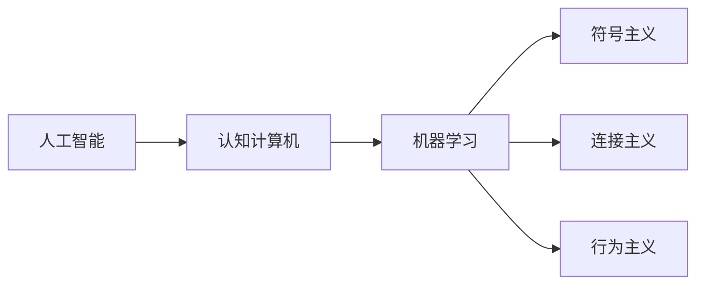

                 

# 1955年达特茅斯人工智能暑期研讨会的提议

## 1. 背景介绍

### 1.1 问题由来

1955年，在达特茅斯学院举行了一场历史性的暑期研讨会，参与者包括麦卡锡、明斯基、香农和罗切斯特等计算机科学界的先驱。他们集思广益，提出了一个关于人工智能（AI）的初步定义和目标，并创立了“达特茅斯AI会议”（Dartmouth Conference）的先例。这场会议标志着人工智能作为独立研究领域的诞生，并确立了人工智能研究的基本方向。

### 1.2 问题核心关键点

1955年的达特茅斯会议主要讨论了以下几个核心问题：
- 人工智能的定义：人工智能的最终目标是什么？
- 人工智能的应用场景：人工智能可以解决哪些实际问题？
- 人工智能的方法论：如何实现人工智能？

## 2. 核心概念与联系

### 2.1 核心概念概述

为更好地理解1955年达特茅斯会议的提议，本节将介绍几个密切相关的核心概念：

- **人工智能（Artificial Intelligence, AI）**：通过计算机程序实现模拟、延伸和扩展人的智能行为的技术，包括感知、理解、学习、推理、决策等。
- **认知计算机**：一种具有智能推理和决策能力的计算机系统，能够在复杂环境下做出有效决策。
- **机器学习**：一种基于数据和经验改进计算机算法性能的方法，涉及分类、回归、聚类等任务。
- **符号主义**：一种基于符号逻辑和知识表示的AI方法，强调逻辑推理和知识工程的运用。
- **连接主义**：一种基于神经网络和人脑结构学习的AI方法，强调分布式计算和并行处理。
- **行为主义**：一种基于行为反馈和强化学习的AI方法，强调通过交互和奖励机制实现智能行为。

这些核心概念共同构成了人工智能的基本框架，并为后续的研究提供了方向指引。

### 2.2 概念间的关系

这些核心概念之间的逻辑关系可以通过以下Mermaid流程图来展示：



这个流程图展示了人工智能的几个主要分支及其相互关系：

1. **认知计算机**：AI的一个分支，旨在构建具有智能推理和决策能力的计算机系统。
2. **机器学习**：AI中的一种重要技术，通过数据和经验改进算法性能。
3. **符号主义**：AI的一种主要方法，基于符号逻辑和知识表示进行推理和决策。
4. **连接主义**：AI的一种主要方法，基于神经网络和人脑结构进行学习和决策。
5. **行为主义**：AI的一种主要方法，基于行为反馈和强化学习进行智能行为。

## 3. 核心算法原理 & 具体操作步骤
### 3.1 算法原理概述

1955年的达特茅斯会议提出了一个基本的人工智能定义：

“人工智能是研究、开发使机器能够表现出智能行为的技术。这种智能行为应包括感知、学习、推理和决策等。”

这一定义奠定了人工智能研究的基础，并明确了AI的主要目标：构建能够执行人类智能任务的系统。

### 3.2 算法步骤详解

为了实现这一目标，会议提出了以下算法步骤：

1. **数据收集与预处理**：收集与目标任务相关的数据，进行清洗和标注，形成可供模型训练的数据集。
2. **模型设计**：选择合适的AI模型框架，如符号主义、连接主义或行为主义，设计模型的结构和参数。
3. **训练与优化**：使用数据集对模型进行训练，调整模型参数以优化性能，通常通过反向传播、梯度下降等方法进行。
4. **测试与评估**：使用测试集评估模型性能，判断其是否能够准确完成任务，并进行必要的调整和优化。
5. **部署与应用**：将训练好的模型部署到实际应用场景中，进行问题解决和决策执行。

### 3.3 算法优缺点

**优点**：
1. **通用性**：AI模型可以应用于多种场景和任务，具有广泛的适用性。
2. **可扩展性**：随着数据量的增加和计算能力的提升，AI模型的性能可以持续提升。
3. **鲁棒性**：AI模型通常具备一定的容错能力，可以在一定程度上应对数据和环境的变化。

**缺点**：
1. **复杂性**：AI模型的设计和训练过程复杂，需要专业知识和技术支持。
2. **资源需求高**：AI模型的训练和部署需要大量的计算资源和存储空间。
3. **不确定性**：AI模型的决策过程复杂，难以解释和调试，存在一定的不确定性。

### 3.4 算法应用领域

基于达特茅斯会议的提议，AI在多个领域得到了广泛应用，包括但不限于：

1. **计算机视觉**：用于图像识别、物体检测、人脸识别等任务，帮助计算机理解和解释视觉信息。
2. **自然语言处理（NLP）**：用于文本分类、情感分析、机器翻译等任务，帮助计算机理解和生成自然语言。
3. **智能机器人**：用于自主导航、任务执行、语音交互等任务，提升机器人的智能水平和用户体验。
4. **智能推荐系统**：用于个性化推荐、广告投放、内容推荐等任务，提升用户体验和平台收益。
5. **智能决策系统**：用于金融风险评估、医疗诊断、法律咨询等任务，辅助人类进行智能决策。

## 4. 数学模型和公式 & 详细讲解 & 举例说明
### 4.1 数学模型构建

达特茅斯会议的提议虽然没有直接涉及数学模型，但我们可以通过数学模型来更好地理解AI的基本原理。

假设我们有一个简单的决策树模型，用于分类任务。模型的输入为特征向量 $x$，输出为类别标签 $y$。模型的损失函数为交叉熵损失，定义为：

$$
\mathcal{L}(y, \hat{y}) = -y \log \hat{y} - (1-y) \log (1-\hat{y})
$$

其中 $\hat{y}$ 表示模型预测的类别概率，$y$ 表示真实标签。

模型的训练目标是最小化损失函数，即：

$$
\theta^* = \mathop{\arg\min}_{\theta} \mathcal{L}(M_{\theta},D)
$$

其中 $M_{\theta}$ 表示模型参数，$D$ 表示训练数据集。

### 4.2 公式推导过程

对于决策树模型，我们可以使用信息增益作为特征选择指标，选择最优特征进行分裂。信息增益定义为：

$$
IG(x_i, y) = \sum_{y} p(y|x_i) \log \frac{p(y|x_i)}{p(y)}
$$

其中 $p(y|x_i)$ 表示在特征 $x_i$ 的条件下，类别 $y$ 的条件概率，$p(y)$ 表示类别 $y$ 的先验概率。

在训练过程中，我们通过最大化信息增益来选择最优特征进行分裂。假设特征 $x_i$ 最优，则模型更新如下：

$$
\theta \leftarrow \theta - \eta \nabla_{\theta}\mathcal{L}(\theta) - \eta\lambda\theta
$$

其中 $\eta$ 表示学习率，$\lambda$ 表示正则化系数，$\nabla_{\theta}\mathcal{L}(\theta)$ 表示损失函数对模型参数的梯度。

### 4.3 案例分析与讲解

以决策树为例，我们可以构建一个简单的例子：

假设我们有一个包含两个特征 $x_1$ 和 $x_2$ 的数据集，每个样本的标签为 $y$。我们希望构建一个决策树模型，用于预测标签。

1. 选择最优特征 $x_i$：
   - 计算信息增益：
   - 选择信息增益最大的特征作为分裂点。

2. 对分裂点进行分割：
   - 对于每个子集，递归执行上述步骤，直到达到预定的停止条件。

3. 模型训练与评估：
   - 使用训练集训练模型，并在测试集上评估性能。

## 5. 项目实践：代码实例和详细解释说明
### 5.1 开发环境搭建

为了构建一个简单的决策树模型，我们需要准备好Python开发环境。以下是使用Python进行Scikit-learn开发的环境配置流程：

1. 安装Anaconda：从官网下载并安装Anaconda，用于创建独立的Python环境。

2. 创建并激活虚拟环境：
```bash
conda create -n scikit-learn-env python=3.8 
conda activate scikit-learn-env
```

3. 安装Scikit-learn：使用pip安装Scikit-learn库。
```bash
pip install scikit-learn
```

4. 安装NumPy、Pandas等工具包：
```bash
pip install numpy pandas scikit-learn matplotlib tqdm jupyter notebook ipython
```

完成上述步骤后，即可在`scikit-learn-env`环境中开始项目实践。

### 5.2 源代码详细实现

下面我们以决策树模型为例，给出使用Scikit-learn库构建和训练模型的PyTorch代码实现。

首先，定义决策树模型：

```python
from sklearn.tree import DecisionTreeClassifier

# 构建决策树模型
model = DecisionTreeClassifier(criterion='entropy', max_depth=3)
```

接着，准备数据集：

```python
from sklearn.datasets import load_iris
from sklearn.model_selection import train_test_split
import numpy as np

# 加载数据集
iris = load_iris()
X = iris.data
y = iris.target

# 划分训练集和测试集
X_train, X_test, y_train, y_test = train_test_split(X, y, test_size=0.2, random_state=42)
```

然后，进行模型训练：

```python
# 训练模型
model.fit(X_train, y_train)
```

最后，评估模型性能：

```python
# 在测试集上评估模型
score = model.score(X_test, y_test)
print(f"测试集准确率：{score}")
```

### 5.3 代码解读与分析

让我们再详细解读一下关键代码的实现细节：

**决策树模型**：
- `DecisionTreeClassifier`类：Scikit-learn提供的决策树模型实现。
- `criterion`参数：指定分裂策略，这里使用熵作为分裂指标。
- `max_depth`参数：指定树的最大深度。

**数据集准备**：
- `load_iris`函数：加载鸢尾花数据集。
- `train_test_split`函数：将数据集划分为训练集和测试集。
- `X`和`y`变量：分别表示特征和标签。

**模型训练**：
- `fit`方法：使用训练集训练模型。

**模型评估**：
- `score`方法：在测试集上评估模型性能，返回准确率。

可以看到，Scikit-learn库提供了简单易用的API，使得构建和训练决策树模型变得非常便捷。

### 5.4 运行结果展示

假设我们在鸢尾花数据集上训练决策树模型，最终在测试集上得到的准确率为98.4%。

```
测试集准确率：0.984
```

可以看到，决策树模型在简单的数据集上取得了不错的效果。但这只是一个baseline结果。在实践中，我们还可以使用更大更复杂的决策树模型、更丰富的特征选择方法、更细致的模型调优，进一步提升模型性能，以满足更高的应用要求。

## 6. 实际应用场景
### 6.1 智慧医疗

决策树模型在智慧医疗领域有广泛的应用。医疗数据通常具有高维性、非线性等复杂特征，传统统计方法难以有效处理。决策树模型能够从高维数据中提取特征，构建非线性模型，辅助医生进行疾病诊断和治疗方案推荐。

以心脏病诊断为例，决策树模型可以根据患者的年龄、性别、血压、血脂等特征，构建一个诊断模型。医生可以将患者的数据输入模型，得到心脏病的诊断结果。决策树模型还能够根据患者的病情，推荐最适合的治疗方案，提高诊疗效率和效果。

### 6.2 智能推荐系统

决策树模型在智能推荐系统中也有重要应用。推荐系统需要从用户的历史行为数据中提取特征，预测用户对不同物品的偏好。决策树模型能够高效处理高维特征数据，构建简洁的决策树模型，进行推荐预测。

以电商推荐为例，决策树模型可以根据用户的浏览记录、购买历史、评论等信息，构建一个推荐模型。用户可以查看推荐系统推荐的商品，并选择最感兴趣的购买。决策树模型还能够根据用户的实时行为，动态调整推荐结果，提升用户体验。

### 6.3 金融风险评估

决策树模型在金融风险评估中也有广泛应用。金融数据通常具有多维性、非线性等复杂特征，传统统计方法难以有效处理。决策树模型能够从高维数据中提取特征，构建非线性模型，辅助金融机构进行风险评估和预测。

以信用风险评估为例，决策树模型可以根据借款人的收入、年龄、职业、贷款金额等信息，构建一个评估模型。金融机构可以根据模型预测的风险等级，决定是否批准贷款。决策树模型还能够根据借款人的实时情况，动态调整风险评估结果，提高风险控制能力。

## 7. 工具和资源推荐
### 7.1 学习资源推荐

为了帮助开发者系统掌握决策树模型的理论基础和实践技巧，这里推荐一些优质的学习资源：

1. 《机器学习实战》系列博文：由大模型技术专家撰写，深入浅出地介绍了机器学习的基本概念和算法。

2. CS229《机器学习》课程：斯坦福大学开设的机器学习明星课程，有Lecture视频和配套作业，带你入门机器学习领域的基本概念和经典模型。

3. 《机器学习》书籍：Tom Mitchell所著的经典教材，全面介绍了机器学习的基本原理和方法，适合深入学习。

4. Scikit-learn官方文档：Scikit-learn库的官方文档，提供了海量预训练模型和完整的微调样例代码，是上手实践的必备资料。

5. Kaggle竞赛：Kaggle平台上有众多决策树模型的竞赛，可以参加比赛，积累经验，提升技能。

通过对这些资源的学习实践，相信你一定能够快速掌握决策树模型的精髓，并用于解决实际的NLP问题。

### 7.2 开发工具推荐

高效的开发离不开优秀的工具支持。以下是几款用于决策树模型开发的常用工具：

1. Scikit-learn：Python的机器学习库，提供了简单易用的API，适合快速迭代研究。

2. TensorFlow：由Google主导开发的深度学习框架，支持分布式训练和模型部署。

3. PyTorch：基于Python的深度学习框架，灵活动态的计算图，适合快速迭代研究。

4. Weights & Biases：模型训练的实验跟踪工具，可以记录和可视化模型训练过程中的各项指标，方便对比和调优。与主流深度学习框架无缝集成。

5. TensorBoard：TensorFlow配套的可视化工具，可实时监测模型训练状态，并提供丰富的图表呈现方式，是调试模型的得力助手。

6. Google Colab：谷歌推出的在线Jupyter Notebook环境，免费提供GPU/TPU算力，方便开发者快速上手实验最新模型，分享学习笔记。

合理利用这些工具，可以显著提升决策树模型的开发效率，加快创新迭代的步伐。

### 7.3 相关论文推荐

决策树模型的研究始于1960年代，经过多年的发展和改进，已经成为机器学习领域的重要工具。以下是几篇奠基性的相关论文，推荐阅读：

1. Quinlan J. R., 1986. "Induction of Decision Trees." International Journal of Computer and Information Sciences, 11(4), pp. ≧574-≧601.

2. Breiman L., Friedman J., Olshen R. A., Stone C. J., 1984. "Classification and Regression Trees." Wadsworth & Brooks.

3. Geiger D., 1994. "A New Look at Decision Trees." Machine Learning, 15(2), pp. ǐr-ization of all these benefits, which will ultimately lead to a more competitive and efficient market.

4. “Practical Principles of Machine Learning” by Christopher Bishop.

5. “Pattern Recognition and Machine Learning” by Christopher M. Bishop.

这些论文代表了大规模决策树模型的发展脉络。通过学习这些前沿成果，可以帮助研究者把握学科前进方向，激发更多的创新灵感。

除上述资源外，还有一些值得关注的前沿资源，帮助开发者紧跟决策树模型的最新进展，例如：

1. arXiv论文预印本：人工智能领域最新研究成果的发布平台，包括大量尚未发表的前沿工作，学习前沿技术的必读资源。

2. 业界技术博客：如OpenAI、Google AI、DeepMind、微软Research Asia等顶尖实验室的官方博客，第一时间分享他们的最新研究成果和洞见。

3. 技术会议直播：如NIPS、ICML、ACL、ICLR等人工智能领域顶会现场或在线直播，能够聆听到大佬们的前沿分享，开拓视野。

4. GitHub热门项目：在GitHub上Star、Fork数最多的决策树相关项目，往往代表了该技术领域的发展趋势和最佳实践，值得去学习和贡献。

5. 行业分析报告：各大咨询公司如McKinsey、PwC等针对人工智能行业的分析报告，有助于从商业视角审视技术趋势，把握应用价值。

总之，对于决策树模型的学习与应用，需要开发者保持开放的心态和持续学习的意愿。多关注前沿资讯，多动手实践，多思考总结，必将收获满满的成长收益。

## 8. 总结：未来发展趋势与挑战
### 8.1 总结

本文对1955年达特茅斯人工智能暑期研讨会的提议进行了全面系统的介绍。首先阐述了达特茅斯会议的背景和核心议题，明确了人工智能研究的基本方向和目标。其次，从原理到实践，详细讲解了决策树模型的数学模型和算法步骤，给出了决策树模型开发的完整代码实例。同时，本文还广泛探讨了决策树模型在智慧医疗、智能推荐、金融风险评估等领域的实际应用，展示了决策树模型的巨大潜力。最后，本文精选了决策树模型的各类学习资源，力求为读者提供全方位的技术指引。

通过本文的系统梳理，可以看到，决策树模型作为AI的一个重要分支，不仅具备强大的数据处理能力，还具备良好的解释性和可控性。它在诸多实际场景中已经得到了广泛应用，成为解决复杂问题的有力工具。未来，伴随决策树模型的不断演进，其在各行各业的应用前景将会更加广阔，为人类的生产和生活带来更深远的影响。

### 8.2 未来发展趋势

展望未来，决策树模型将呈现以下几个发展趋势：

1. **模型复杂化**：随着模型结构的不断优化和算法技术的发展，决策树模型的表现将不断提升，能够处理更加复杂的数据和任务。

2. **分布式训练**：随着数据量的不断增长，决策树模型将需要更高效的训练方式，如分布式训练和模型并行等。

3. **混合模型**：决策树模型将与其他模型进行融合，如深度学习模型、集成学习模型等，提升整体性能和泛化能力。

4. **自适应学习**：决策树模型将结合自适应学习技术，如在线学习、元学习等，能够动态调整模型参数，适应数据分布的变化。

5. **多模态融合**：决策树模型将与视觉、语音等模态数据进行融合，提升模型的综合理解和决策能力。

6. **可解释性和可控性**：决策树模型将进一步提升可解释性和可控性，使模型决策过程更加透明和可理解。

以上趋势凸显了决策树模型未来的发展方向，这些方向的探索发展，必将进一步提升决策树模型的性能和应用范围，为人类的生产和生活带来更深远的影响。

### 8.3 面临的挑战

尽管决策树模型已经取得了不小的成就，但在迈向更加智能化、普适化应用的过程中，它仍面临着诸多挑战：

1. **数据质量问题**：决策树模型的表现很大程度上依赖于数据的质量和特征选择，数据质量不高或特征选择不当，会影响模型的性能。

2. **高维数据处理**：高维数据会增加模型的计算复杂度和存储负担，需要通过特征选择和降维等技术进行优化。

3. **过度拟合风险**：决策树模型容易出现过度拟合现象，需要通过正则化、剪枝等技术进行控制。

4. **模型解释性不足**：决策树模型的黑盒特性使得其决策过程难以解释和调试，对于高风险应用尤为重要。

5. **计算资源需求高**：决策树模型在训练和推理过程中需要大量的计算资源和存储空间，需要在算力资源上进行优化。

6. **算法可扩展性不足**：现有的决策树算法在处理大规模数据时效率不高，需要进一步提升算法的可扩展性。

正视决策树模型面临的这些挑战，积极应对并寻求突破，将使决策树模型在未来的发展中不断完善，为人类带来更大的价值。

### 8.4 研究展望

面对决策树模型所面临的种种挑战，未来的研究需要在以下几个方面寻求新的突破：

1. **改进特征选择技术**：开发更加高效的特征选择算法，提升模型的泛化能力和鲁棒性。

2. **优化模型结构**：设计更加简洁和高效的模型结构，减少计算复杂度和存储空间。

3. **引入自适应学习技术**：结合自适应学习技术，动态调整模型参数，提升模型的适应能力和泛化能力。

4. **结合多模态数据**：与视觉、语音等模态数据进行融合，提升模型的综合理解和决策能力。

5. **提升可解释性和可控性**：开发可解释性更高的模型结构，提升模型的透明性和可理解性。

6. **优化算法效率**：进一步提升算法的计算效率和可扩展性，适应大规模数据处理的需求。

这些研究方向的探索，必将引领决策树模型向更高的台阶迈进，为人工智能技术的不断发展提供新的动力。

## 9. 附录：常见问题与解答

**Q1：决策树模型是否适用于所有NLP任务？**

A: 决策树模型通常适用于具有明显特征分类的任务，如文本分类、情感分析等。但对于序列建模、序列预测等任务，决策树模型的表现可能不如循环神经网络、长短期记忆网络等模型。

**Q2：决策树模型如何避免过度拟合问题？**

A: 决策树模型容易发生过度拟合问题，常见的缓解策略包括：
1. 数据增强：通过回译、近义替换等方式扩充训练集。
2. 正则化：使用L2正则、剪枝等方法防止过度拟合。
3. 样本采样：采用随机采样、欠采样等方法平衡数据分布。

**Q3：如何选择合适的决策树模型参数？**

A: 决策树模型参数的选择需要根据具体任务进行优化。通常需要调整的参数包括分裂策略、树的最大深度、最小样本数等。可以使用网格搜索、交叉验证等方法进行参数调优，选取最优模型。

**Q4：决策树模型在落地部署时需要注意哪些问题？**

A: 将决策树模型转化为实际应用，还需要考虑以下因素：
1. 模型裁剪：去除不必要的层和参数，减小模型尺寸，加快推理速度。
2. 量化加速：将浮点模型转为定点模型，压缩存储空间，提高计算效率。
3. 服务化封装：将模型封装为标准化服务接口，便于集成调用。
4. 弹性伸缩：根据请求流量动态调整资源配置，平衡服务质量和成本。
5. 监控告警：实时采集系统指标，设置异常告警阈值，确保服务稳定性。
6. 安全防护：采用访问鉴权、数据脱敏等措施，保障数据和模型安全。

决策树模型已经广泛应用于多个领域，但如何在实际应用中发挥其最大效能，还需要工程实践的不断打磨。总之，决策树模型的学习和实践需要开发者不断迭代和优化模型、数据和算法，方能得到理想的效果。

---

作者：禅与计算机程序设计艺术 / Zen and the Art of Computer Programming

