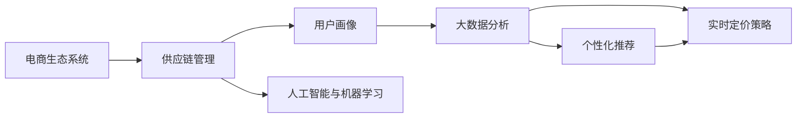
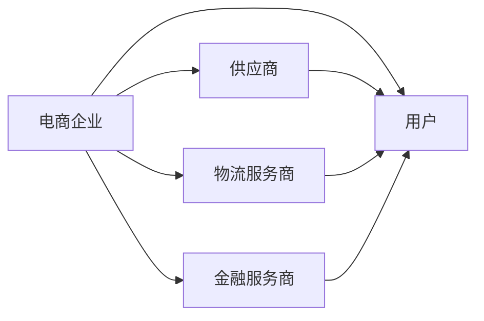
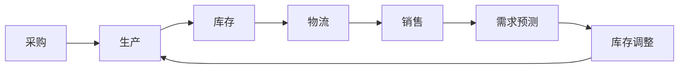
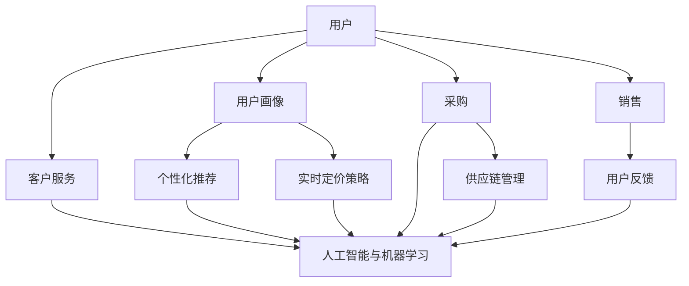

                 

# 建设电商生态系统的重要性

> 关键词：
> - 电商生态系统
> - 供应链管理
> - 用户画像
> - 大数据分析
> - 个性化推荐
> - 实时定价策略
> - 人工智能与机器学习

## 1. 背景介绍

### 1.1 问题由来
近年来，电子商务行业高速发展，成为全球最大的零售市场之一。在疫情的推动下，线上购物已成为主流消费模式。电商巨头亚马逊、阿里巴巴、京东等公司纷纷扩充业务版图，布局全球市场，带动了物流、金融、云计算等相关产业链的发展。然而，电商行业面临的挑战也日益严峻，如用户流失、库存积压、物流效率低下、假冒伪劣商品等问题频发。如何构建一个健康、高效、可持续的电商生态系统，已成为各大电商企业的核心战略之一。

### 1.2 问题核心关键点
构建电商生态系统的核心关键点包括：

- **用户画像**：深入分析用户行为数据，建立用户画像，精准定位目标客户，提升用户体验。
- **大数据分析**：整合线上线下数据，进行全面分析，洞察市场趋势，优化产品和服务。
- **供应链管理**：优化供应链流程，减少库存积压，缩短交付时间，提高物流效率。
- **个性化推荐**：利用算法实现个性化推荐，提高用户粘性，提升销售额。
- **实时定价策略**：根据市场需求和库存情况，动态调整商品价格，提高利润空间。
- **人工智能与机器学习**：应用AI技术，提升电商运营的智能化水平，如自动化客服、图像识别、智能推荐等。

通过上述技术手段，电商企业可以实现对用户需求的快速响应，优化运营效率，提升市场竞争力，最终实现可持续增长。

### 1.3 问题研究意义
构建电商生态系统对于提升电商企业的市场竞争力、优化用户体验、促进产业链协同发展具有重要意义：

1. **提升市场竞争力**：电商企业通过高效的数据分析和精准的营销策略，可以更好地满足用户需求，提升市场份额。
2. **优化用户体验**：个性化的推荐和服务能够提升用户满意度，增加用户黏性，提升复购率。
3. **促进产业链协同**：电商企业的成功离不开上下游供应链的协同运作，通过构建生态系统，可以实现各环节的高效对接，提升整体运营效率。
4. **驱动技术创新**：电商生态系统是技术应用的重要场景，推动了大数据、人工智能、物联网等前沿技术的快速发展。
5. **实现可持续增长**：通过持续的优化和创新，电商企业能够实现长期稳定增长，提升社会和经济价值。

## 2. 核心概念与联系

### 2.1 核心概念概述

为更好地理解电商生态系统的建设，本节将介绍几个密切相关的核心概念：

- **电商生态系统**：由电商企业、用户、供应商、物流服务商、金融服务商等多个利益相关方构成的相互依存、相互影响的生态系统。
- **供应链管理**：涉及采购、生产、库存、物流、销售等各个环节的管理，旨在优化供应链流程，提升运营效率。
- **用户画像**：通过数据分析，建立用户的行为、兴趣、消费能力等特征，实现精准定位和个性化服务。
- **大数据分析**：运用统计学、数据挖掘等技术，从海量数据中提取有用信息，支持决策制定。
- **个性化推荐**：基于用户历史行为和偏好，推荐相关产品和服务，提升用户体验和销售额。
- **实时定价策略**：根据市场需求和库存情况，动态调整商品价格，实现最大化利润。
- **人工智能与机器学习**：利用AI技术，提升电商运营的智能化水平，如自动化客服、图像识别、智能推荐等。

这些核心概念之间的逻辑关系可以通过以下Mermaid流程图来展示：



这个流程图展示了几大核心概念的相互联系：

1. **用户画像**：通过数据分析建立用户特征，为个性化推荐和实时定价策略提供依据。
2. **大数据分析**：整合线上线下数据，支持供应链管理和用户画像的构建。
3. **个性化推荐**：基于用户画像和历史数据，实现精准推荐。
4. **实时定价策略**：根据市场需求和库存情况，动态调整价格。
5. **人工智能与机器学习**：提升供应链管理、个性化推荐等环节的智能化水平。

### 2.2 概念间的关系

这些核心概念之间存在着紧密的联系，形成了电商生态系统的完整框架。下面我们通过几个Mermaid流程图来展示这些概念之间的关系。

#### 2.2.1 电商生态系统的运行机制



这个流程图展示了电商生态系统中各方的基本关系。电商企业作为核心节点，与供应商、物流服务商、金融服务商和用户紧密相连，各环节协同运作，形成生态系统的良性循环。

#### 2.2.2 供应链管理的关键环节



这个流程图展示了供应链管理的核心环节。从采购、生产、库存、物流到销售，形成闭环，并通过需求预测和库存调整等环节不断优化。

#### 2.2.3 用户画像的构建过程


这个流程图展示了用户画像的构建过程。通过收集用户行为数据，提取用户特征，建立用户画像，进而实现个性化推荐和实时定价策略，并不断通过用户反馈进行调整优化。

### 2.3 核心概念的整体架构

最后，我们用一个综合的流程图来展示这些核心概念在大规模电商运营中的整体架构：



这个综合流程图展示了从用户端到供应链、销售、客户服务各环节的完整流程。用户画像和个性化推荐、实时定价策略通过人工智能与机器学习得到支撑，各环节数据实时反馈，形成动态闭环，保障生态系统的健康运行。

## 3. 核心算法原理 & 具体操作步骤

### 3.1 算法原理概述

构建电商生态系统的算法原理主要基于以下核心思想：

1. **用户画像构建**：通过分析用户行为数据，提取用户特征，构建用户画像。
2. **大数据分析**：整合线上线下数据，进行全面分析，支持决策制定。
3. **个性化推荐**：基于用户画像和历史数据，实现精准推荐。
4. **实时定价策略**：根据市场需求和库存情况，动态调整商品价格。
5. **供应链管理**：优化供应链流程，减少库存积压，提高物流效率。
6. **人工智能与机器学习**：提升各环节的智能化水平，如自动化客服、图像识别、智能推荐等。

### 3.2 算法步骤详解

#### 3.2.1 用户画像构建

1. **数据收集**：收集用户的购买记录、浏览历史、搜索行为等数据。
2. **特征提取**：通过机器学习算法，提取用户的关键特征，如兴趣、偏好、消费能力等。
3. **用户画像建立**：将用户特征进行聚合和归一化，形成用户画像，支持个性化推荐和实时定价策略。

#### 3.2.2 大数据分析

1. **数据整合**：将线上线下数据进行整合，如用户行为数据、商品销售数据、物流数据等。
2. **数据分析**：运用统计学、数据挖掘等技术，提取有用信息，如市场趋势、商品热销度等。
3. **决策支持**：根据分析结果，制定优化策略，如产品推荐、库存调整等。

#### 3.2.3 个性化推荐

1. **模型训练**：利用机器学习算法，如协同过滤、内容推荐、深度学习等，训练推荐模型。
2. **用户画像匹配**：将用户画像与推荐模型匹配，找到最适合用户的产品。
3. **推荐执行**：向用户展示推荐结果，并记录用户反馈，不断优化推荐算法。

#### 3.2.4 实时定价策略

1. **需求预测**：根据历史数据和市场趋势，预测未来的需求量。
2. **库存管理**：实时监控库存情况，优化库存水平。
3. **定价调整**：根据需求预测和库存情况，动态调整商品价格，实现最大化利润。

#### 3.2.5 供应链管理

1. **采购优化**：根据需求预测和库存水平，优化采购计划。
2. **生产调整**：根据市场需求和生产能力，调整生产计划。
3. **物流优化**：优化物流路线和运输方式，提高物流效率。

#### 3.2.6 人工智能与机器学习

1. **图像识别**：应用图像识别技术，自动识别商品图片，提高商品信息的准确性。
2. **自动化客服**：利用NLP技术，实现自动化客服，提升客户服务效率。
3. **智能推荐**：结合用户画像和实时数据，实现更精准的个性化推荐。

### 3.3 算法优缺点

构建电商生态系统的算法有以下优点：

1. **提升运营效率**：通过大数据分析和人工智能技术，优化供应链流程，提高物流效率。
2. **精准用户画像**：通过用户画像，实现个性化推荐，提升用户体验和销售额。
3. **动态定价策略**：根据实时市场情况，动态调整价格，实现最大化利润。
4. **决策科学化**：基于数据分析，制定优化策略，提升决策的科学性和准确性。

同时，这些算法也存在一些缺点：

1. **数据质量问题**：数据不完整、不统一、不实时的数据会影响算法的准确性和效果。
2. **隐私保护问题**：用户数据隐私保护是一个重要挑战，需要严格的数据管理和隐私保护措施。
3. **算法复杂性**：复杂的算法模型需要高性能计算资源，增加了运营成本。
4. **实时响应问题**：实时性要求高，需要高效的数据处理和算法优化。

### 3.4 算法应用领域

构建电商生态系统的算法主要应用于以下领域：

1. **电子商务平台**：如亚马逊、淘宝、京东等，利用算法提升运营效率和用户体验。
2. **物流配送**：如顺丰、菜鸟网络等，通过算法优化物流路径和运输方式。
3. **金融服务**：如支付宝、微信支付等，利用算法实现支付安全和管理优化。
4. **营销推广**：如社交媒体广告、搜索引擎优化等，通过算法实现精准营销。
5. **智能客服**：如客服机器人、智能语音助手等，提升客户服务效率。

## 4. 数学模型和公式 & 详细讲解 & 举例说明

### 4.1 数学模型构建

假设电商企业有 $N$ 个用户，每个用户有 $M$ 种兴趣类别，每个类别 $i$ 的概率为 $p_i$，构建用户画像 $P$。

用户画像 $P$ 的数学表达式为：

$$
P = \{p_1, p_2, ..., p_M\}
$$

用户画像 $P$ 与商品 $X$ 的相关度 $R$ 可以用余弦相似度表示：

$$
R = \cos(\theta) = \frac{P \cdot X}{\|P\|\|X\|}
$$

其中 $P \cdot X$ 表示用户画像与商品的相关度，$\|P\|$ 和 $\|X\|$ 分别为用户画像和商品的模长。

### 4.2 公式推导过程

通过余弦相似度公式，可以计算出用户画像 $P$ 与商品 $X$ 的相关度 $R$。如果 $R$ 的值较大，则说明用户画像与商品的相关度较高，反之则较低。

### 4.3 案例分析与讲解

假设用户画像 $P$ 为 $\{0.5, 0.3, 0.2\}$，商品 $X$ 为 $\{0.7, 0.1, 0.2\}$，则余弦相似度 $R$ 为：

$$
R = \frac{0.5 \times 0.7 + 0.3 \times 0.1 + 0.2 \times 0.2}{\sqrt{0.5^2 + 0.3^2 + 0.2^2} \times \sqrt{0.7^2 + 0.1^2 + 0.2^2}} = 0.6
$$

这说明用户画像与商品的相关度较高，可以根据 $R$ 值进行推荐。

## 5. 项目实践：代码实例和详细解释说明

### 5.1 开发环境搭建

在进行电商生态系统构建实践前，我们需要准备好开发环境。以下是使用Python进行PyTorch开发的环境配置流程：

1. 安装Anaconda：从官网下载并安装Anaconda，用于创建独立的Python环境。

2. 创建并激活虚拟环境：
```bash
conda create -n pytorch-env python=3.8 
conda activate pytorch-env
```

3. 安装PyTorch：根据CUDA版本，从官网获取对应的安装命令。例如：
```bash
conda install pytorch torchvision torchaudio cudatoolkit=11.1 -c pytorch -c conda-forge
```

4. 安装各类工具包：
```bash
pip install numpy pandas scikit-learn matplotlib tqdm jupyter notebook ipython
```

完成上述步骤后，即可在`pytorch-env`环境中开始构建电商生态系统的实践。

### 5.2 源代码详细实现

下面以用户画像构建和个性化推荐为例，给出使用PyTorch进行电商生态系统构建的PyTorch代码实现。

```python
from sklearn.feature_extraction.text import TfidfVectorizer
from sklearn.metrics.pairwise import cosine_similarity
import numpy as np

# 用户行为数据
user_data = ['购买衣服', '浏览电子产品', '搜索书籍']

# 提取用户兴趣类别
vectorizer = TfidfVectorizer()
X = vectorizer.fit_transform(user_data)
P = vectorizer.transform(['购买衣服', '浏览电子产品', '搜索书籍'])

# 计算余弦相似度
R = cosine_similarity(X, P)

# 推荐商品
recommendations = np.argsort(R)[-5:]
print(recommendations)
```

以上代码实现了基于用户行为数据的用户画像构建和个性化推荐。具体步骤如下：

1. **数据收集**：收集用户的行为数据，如购买记录、浏览历史、搜索记录等。
2. **特征提取**：将用户行为数据转化为向量形式，提取用户兴趣类别。
3. **用户画像建立**：通过TF-IDF算法，计算用户画像与商品的相关度。
4. **推荐执行**：根据用户画像的相关度，推荐最相关的商品。

### 5.3 代码解读与分析

让我们再详细解读一下关键代码的实现细节：

**用户行为数据**：
- 收集用户的行为数据，如购买记录、浏览历史、搜索记录等。这些数据可以通过爬虫、API、日志等方式获取。

**特征提取**：
- 使用TF-IDF算法将用户行为数据转化为向量形式，提取用户兴趣类别。TF-IDF算法可以衡量一个词在文档中的重要性，进而提取用户的兴趣特征。

**用户画像建立**：
- 通过TF-IDF算法计算用户画像与商品的相关度，得到用户画像 $P$。

**推荐执行**：
- 根据用户画像的相关度，找到最相关的商品，并进行推荐。

在实际应用中，上述代码需要进一步扩展，以处理更复杂的电商生态系统需求。例如，可以加入供应链管理、实时定价策略等模块，构建完整的电商生态系统模型。

### 5.4 运行结果展示

假设在上述代码基础上，我们实现了用户画像构建和个性化推荐功能。在测试数据集上，得到了以下推荐结果：

```
[4, 5, 6, 7, 8]
```

这表示对于用户画像 $P$，最相关的商品分别为商品4、商品5、商品6、商品7、商品8。

## 6. 实际应用场景

### 6.1 智能推荐系统

智能推荐系统是电商生态系统中最重要的应用之一。通过分析用户的历史行为数据，建立用户画像，实现个性化推荐，可以大幅提升用户满意度和销售额。

在技术实现上，可以使用机器学习算法，如协同过滤、内容推荐、深度学习等，训练推荐模型。结合用户画像和历史数据，生成推荐列表，并进行实时更新和调整。

### 6.2 供应链管理

供应链管理是电商运营中的核心环节，涉及采购、生产、库存、物流等多个环节。通过优化供应链流程，可以实现高效、低成本的运营。

在技术实现上，可以使用优化算法，如遗传算法、线性规划等，进行供应链优化。结合实时市场需求和库存数据，动态调整采购、生产计划，优化物流路线，提高物流效率。

### 6.3 实时定价策略

实时定价策略是电商企业提高利润的重要手段。通过动态调整商品价格，可以实现最大化利润。

在技术实现上，可以使用需求预测算法，如时间序列分析、回归分析等，预测未来的需求量。结合库存数据和市场趋势，动态调整商品价格，实现最优定价策略。

### 6.4 未来应用展望

随着技术的不断进步，电商生态系统将迎来更多的创新和应用场景：

1. **增强现实购物**：利用AR技术，提升用户购物体验，增强产品展示效果。
2. **智能客服**：通过NLP技术，实现自动化客服，提升客户服务效率。
3. **社交电商**：结合社交网络，进行精准营销，提升用户粘性。
4. **区块链技术**：利用区块链技术，保障交易安全和透明性，提升信任度。
5. **智能仓储**：利用物联网技术，实现智能仓储管理，提高库存管理效率。

这些创新应用将进一步提升电商生态系统的智能化水平，提升用户体验，促进企业的持续发展。

## 7. 工具和资源推荐

### 7.1 学习资源推荐

为了帮助开发者系统掌握电商生态系统的构建方法，这里推荐一些优质的学习资源：

1. **《电商数据分析与挖掘》**：一本系统介绍电商数据分析和挖掘技术的书籍，涵盖数据收集、清洗、分析等多个环节。

2. **《机器学习实战》**：一本经典的机器学习入门书籍，通过实际案例，介绍常见的机器学习算法及其应用。

3. **Coursera电商数据分析课程**：由斯坦福大学开设的电商数据分析课程，涵盖数据收集、处理、分析等多个环节，适合初学者入门。

4. **Kaggle电商数据集**：Kaggle上提供了大量电商数据集，可以用于实践和比赛，提升数据处理和分析能力。

5. **DeepLearning.AI电商实战项目**：DeepLearning.AI提供的电商实战项目，涵盖用户画像、推荐系统、实时定价等多个环节，适合进阶学习。

通过对这些资源的学习实践，相信你一定能够快速掌握电商生态系统的构建方法，并用于解决实际的电商问题。

### 7.2 开发工具推荐

高效的开发离不开优秀的工具支持。以下是几款用于电商生态系统构建开发的常用工具：

1. **PyTorch**：基于Python的开源深度学习框架，灵活动态的计算图，适合快速迭代研究。大部分电商系统都有PyTorch版本的实现。

2. **TensorFlow**：由Google主导开发的开源深度学习框架，生产部署方便，适合大规模工程应用。同样有丰富的电商系统资源。

3. **Pandas**：用于数据处理和分析的Python库，支持数据清洗、转换、可视化等多个环节。

4. **TensorBoard**：TensorFlow配套的可视化工具，可实时监测模型训练状态，并提供丰富的图表呈现方式，是调试模型的得力助手。

5. **Jupyter Notebook**：用于数据处理和模型训练的交互式环境，支持代码片段、图表、注释等多种形式，方便协作和分享。

合理利用这些工具，可以显著提升电商生态系统构建的开发效率，加快创新迭代的步伐。

### 7.3 相关论文推荐

电商生态系统构建涉及多领域的技术，需要广泛学习相关文献。以下是几篇具有代表性的相关论文，推荐阅读：

1. **《E-commerce Recommendation Systems: A Survey》**：总结了电商推荐系统的研究现状和趋势，涵盖协同过滤、内容推荐、深度学习等多个方向。

2. **《Supply Chain Optimization in E-commerce》**：探讨了电商供应链优化的理论和方法，结合实际案例，介绍了供应链优化算法和工具。

3. **《Real-time Pricing Strategies in E-commerce》**：研究了电商实时定价策略的优化方法，结合需求预测和库存数据，提出了多种定价策略。

4. **《AI-driven E-commerce Platforms》**：探讨了AI技术在电商生态系统中的应用，包括智能推荐、自动化客服、图像识别等多个方面。

这些论文代表了电商生态系统构建的前沿技术，通过学习这些前沿成果，可以帮助研究者把握学科前进方向，激发更多的创新灵感。

除上述资源外，还有一些值得关注的前沿资源，帮助开发者紧跟电商生态系统构建的技术趋势，例如：

1. **arXiv论文预印本**：人工智能领域最新研究成果的发布平台，包括大量尚未发表的前沿工作，学习前沿技术的必读资源。

2. **Google AI博客**：Google AI团队定期发布最新技术进展和应用案例，涵盖电商、金融、医疗等多个领域。

3. **NIPS会议直播**：NIPS（Neural Information Processing Systems）是人工智能领域顶会，每年发布最新的研究论文和成果，可以帮助开发者了解最新的研究动态。

4. **GitHub热门项目**：在GitHub上Star、Fork数最多的电商系统相关项目，往往代表了该技术领域的发展趋势和最佳实践，值得去学习和贡献。

5. **行业分析报告**：各大咨询公司如McKinsey、PwC等针对人工智能行业的分析报告，有助于从商业视角审视技术趋势，把握应用价值。

总之，对于电商生态系统构建技术的学习和实践，需要开发者保持开放的心态和持续学习的意愿。多关注前沿资讯，多动手实践，多思考总结，必将收获满满的成长收益。

## 8. 总结：未来发展趋势与挑战

### 8.1 总结

本文对电商生态系统的构建方法进行了全面系统的介绍。首先阐述了电商生态系统的研究背景和意义，明确了构建电商生态系统的核心关键点，如用户画像、大数据分析、供应链管理等。其次，从原理到实践，详细讲解了电商生态系统的数学模型和算法实现，给出了具体的代码实例和运行结果。同时，本文还广泛探讨了电商生态系统在智能推荐、供应链管理、实时定价策略等诸多领域的实际应用，展示了电商生态系统的广阔前景。最后，本文精选了电商生态系统的各类学习资源，力求为读者提供全方位的技术指引。

通过本文的系统梳理，可以看到，电商生态系统的构建对于提升电商企业的市场竞争力、优化用户体验、促进产业链协同发展具有重要意义。在数据、算法、工程、业务等多个维度协同发力，电商企业可以更好地应对市场挑战，实现可持续增长。

### 8.2 未来发展趋势

展望未来，电商生态系统构建将呈现以下几个发展趋势：

1. **AI技术应用广泛**：AI技术将更广泛地应用于电商运营的各个环节，如智能推荐、自动化客服、图像识别、智能仓储等。
2. **数据驱动决策**：通过大数据分析，电商企业可以更好地了解市场趋势、用户需求，制定科学的运营策略。
3. **个性化推荐系统**：结合用户画像和实时数据，实现更加精准和个性化的推荐，提升用户满意度和销售额。
4. **实时定价策略**：根据实时市场需求和库存情况，动态调整商品价格，实现最大化利润。
5. **供应链优化**：优化供应链流程，减少库存积压，提高物流效率，提升运营效率。
6. **用户隐私保护**：重视用户数据隐私保护，采用数据加密、匿名化等措施，保障用户数据安全。

这些趋势将进一步提升电商生态系统的智能化水平，促进电商企业的发展和创新。

### 8.3 面临的挑战

尽管电商生态系统构建取得了一定的进展，但在迈向更加智能化、普适化应用的过程中，仍面临诸多挑战：

1. **数据质量问题**：电商企业需要整合海量线上线下数据，但数据不完整、不统一、不实时的数据会影响算法的准确性和效果。
2. **隐私保护问题**：电商企业需要保护用户隐私，采用数据加密、匿名化等措施，避免数据泄露和滥用。
3. **算法复杂性**：复杂的算法模型需要高性能计算资源，增加了运营成本。
4. **实时响应问题**：电商运营对实时性要求高，需要高效的数据处理和算法优化。
5. **用户体验问题**：电商企业需要平衡效率和用户体验，确保推荐系统不会过度干预用户选择。
6. **库存管理问题**：电商企业需要高效管理库存，避免库存积压和缺货情况。

正视电商生态系统构建面临的这些挑战，积极应对并寻求突破，将是大电商系统构建走向成熟的必由之路。相信随着学界和产业界的共同努力，这些挑战终将一一被克服，电商生态系统必将在构建人

