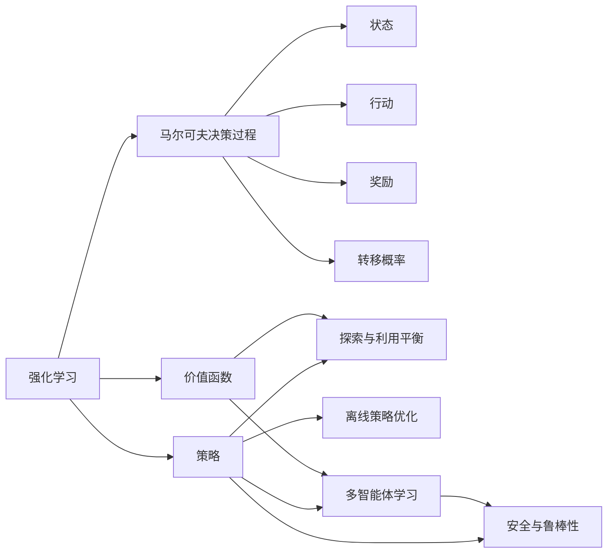
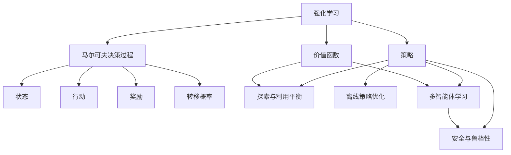
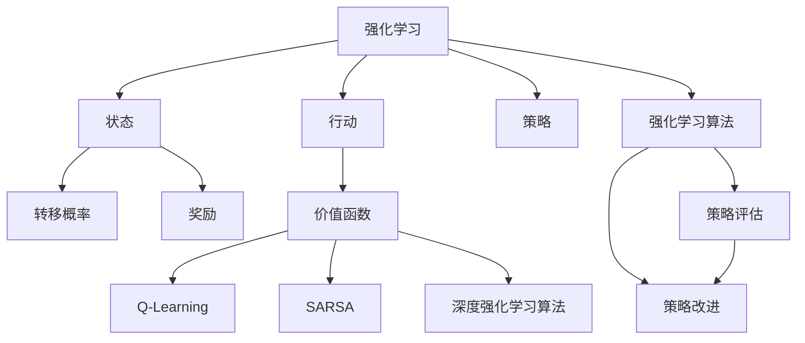
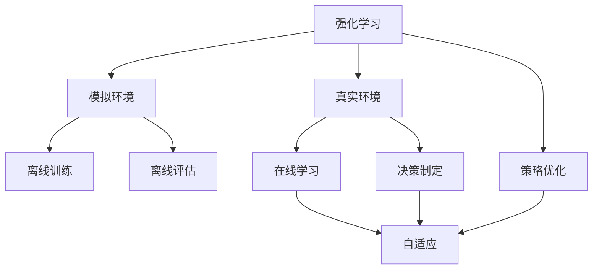
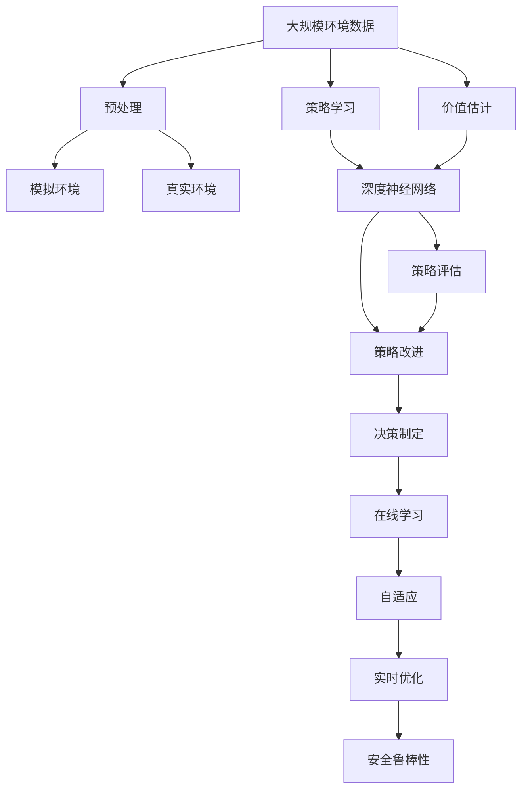

                 

# 强化学习 原理与代码实例讲解

> 关键词：强化学习,深度学习,神经网络,马尔可夫决策过程,算法优化,Deep Q-Network

## 1. 背景介绍

### 1.1 问题由来
强化学习(Reinforcement Learning, RL)是一种基于试错的学习方法，通过智能体与环境的交互，在动态的、不确定的环境中，寻找最优策略来最大化长期奖励。与传统监督学习、无监督学习不同，强化学习要求智能体具备主动探索、策略优化和反馈学习的能力。

近年来，强化学习在人工智能、游戏AI、机器人控制、自动驾驶等领域取得了显著进展。在AlphaGo、AlphaStar等游戏中，强化学习算法已能超越人类，在某些复杂任务上表现出色。

### 1.2 问题核心关键点
强化学习问题的核心在于构建智能体的策略，使智能体在特定环境中，通过不断试错和调整策略，最大化累积奖励。常见的方法包括：

- 探索与利用平衡：在策略优化过程中，智能体需要平衡探索未知状态和利用已知状态，以避免陷入局部最优。
- 离线策略优化：利用历史数据进行离线策略训练，避免在实际应用中需要实时与环境交互，从而提高学习效率。
- 多智能体学习：在复杂环境中，如何通过多个智能体的协同学习，提高整体系统的智能水平。
- 安全与鲁棒性：在风险较高的环境中，如何保证学习过程的安全性、鲁棒性和可解释性。

强化学习的研究方向涉及模型、算法、数据、应用等多个层面，具有广阔的应用前景和深入的理论意义。

### 1.3 问题研究意义
研究强化学习算法，对于拓展智能体的自主决策能力，提高复杂任务解决效率，构建安全可靠的智能系统，具有重要意义：

1. 自主决策能力。强化学习能够使智能体自主选择行动策略，适应不断变化的环境。
2. 问题求解效率。强化学习通过不断探索和优化，能够高效解决复杂的规划问题，如路径规划、资源分配等。
3. 系统鲁棒性。强化学习算法通过与环境的互动，能够适应复杂多变的场景，提升系统的稳定性和可靠性。
4. 数据驱动决策。强化学习算法可以从数据中学习决策模型，无需人工干预，适用于大数据、高复杂度场景。
5. 协同学习。强化学习算法可以通过多智能体的协作，实现任务分解、资源共享，提高整体系统的智能水平。

## 2. 核心概念与联系

### 2.1 核心概念概述

为更好地理解强化学习的原理和算法，本节将介绍几个关键概念：

- 强化学习(Reinforcement Learning, RL)：通过智能体与环境的交互，使智能体学习最优策略，以最大化累积奖励。
- 马尔可夫决策过程(Markov Decision Process, MDP)：描述智能体与环境交互的模型，包括状态、行动、奖励、转移概率等要素。
- 策略(Policy)：智能体选择行动的策略函数，通常表示为$\pi(a|s)$，表示在状态$s$下选择行动$a$的概率。
- 价值函数(Value Function)：估计状态或行动的价值，通常表示为$V(s)$或$Q(s,a)$，表示在状态$s$下或执行行动$a$的长期累积奖励。
- 深度强化学习(Deep Reinforcement Learning, DRL)：利用深度神经网络构建策略和价值函数，提升强化学习算法的表达能力和计算效率。
- 探索与利用平衡(Exploration and Exploitation Balance)：在策略优化过程中，平衡探索未知状态和利用已知状态，以避免陷入局部最优。
- 离线策略优化(Off-policy Policy Improvement)：利用历史数据进行离线策略训练，避免在实际应用中需要实时与环境交互，从而提高学习效率。
- 多智能体学习(Multi-agent Learning)：在复杂环境中，通过多个智能体的协作学习，提高整体系统的智能水平。
- 安全与鲁棒性(Safety and Robustness)：在风险较高的环境中，保证学习过程的安全性、鲁棒性和可解释性。

这些核心概念之间的逻辑关系可以通过以下Mermaid流程图来展示：



这个流程图展示了一些核心概念之间的联系：

1. 强化学习通过智能体与环境的交互，学习最优策略。
2. 马尔可夫决策过程描述了智能体与环境的交互模型，包括状态、行动、奖励和转移概率。
3. 策略是智能体选择行动的策略函数，用于平衡探索和利用。
4. 价值函数用于估计状态或行动的价值，帮助智能体选择最优策略。
5. 深度强化学习利用神经网络提升策略和价值函数的表达能力。
6. 离线策略优化利用历史数据进行离线策略训练，提高学习效率。
7. 多智能体学习通过多个智能体的协作，提高整体系统的智能水平。
8. 安全与鲁棒性保障学习过程的安全性和稳定性。

这些概念共同构成了强化学习的学习框架，使其能够在各种环境中实现自主决策和最优策略选择。通过理解这些核心概念，我们可以更好地把握强化学习的工作原理和优化方向。

### 2.2 概念间的关系

这些核心概念之间存在着紧密的联系，形成了强化学习的完整生态系统。下面我通过几个Mermaid流程图来展示这些概念之间的关系。

#### 2.2.1 强化学习的学习范式



这个流程图展示了一些核心概念之间的联系：

1. 强化学习通过智能体与环境的交互，学习最优策略。
2. 马尔可夫决策过程描述了智能体与环境的交互模型，包括状态、行动、奖励和转移概率。
3. 策略是智能体选择行动的策略函数，用于平衡探索和利用。
4. 价值函数用于估计状态或行动的价值，帮助智能体选择最优策略。
5. 深度强化学习利用神经网络提升策略和价值函数的表达能力。
6. 离线策略优化利用历史数据进行离线策略训练，提高学习效率。
7. 多智能体学习通过多个智能体的协作，提高整体系统的智能水平。
8. 安全与鲁棒性保障学习过程的安全性和稳定性。

#### 2.2.2 强化学习的求解方法



这个流程图展示了强化学习的求解方法：

1. 强化学习通过智能体与环境的交互，学习最优策略。
2. 状态和行动定义了智能体与环境的交互模型。
3. 转移概率和奖励定义了环境对智能体行为的响应。
4. 策略用于选择行动，平衡探索和利用。
5. 价值函数用于评估状态或行动的价值，帮助选择最优策略。
6. 强化学习算法如Q-Learning、SARSA等用于求解最优策略。
7. 深度强化学习算法如DQN、PPO等用于提高策略和价值函数的表达能力。
8. 策略评估和改进用于优化策略选择。

#### 2.2.3 强化学习的部署方式



这个流程图展示了强化学习的部署方式：

1. 强化学习通过智能体与环境的交互，学习最优策略。
2. 模拟环境用于离线训练和评估。
3. 真实环境用于在线学习。
4. 策略优化用于改进智能体的决策制定。
5. 自适应用于根据环境变化调整策略。

### 2.3 核心概念的整体架构

最后，我们用一个综合的流程图来展示这些核心概念在大规模强化学习中的整体架构：



这个综合流程图展示了从数据预处理到在线学习的整体过程。强化学习首先从大规模环境数据中预处理提取特征，构建模拟环境和真实环境。在大规模神经网络中，智能体学习最优策略和价值函数。通过策略评估和改进，优化决策制定。在线学习和自适应机制用于实时优化策略，确保系统在实际应用中的安全性、鲁棒性和可解释性。

通过这些流程图，我们可以更清晰地理解强化学习中的核心概念及其关系，为后续深入讨论具体的算法和实现方法奠定基础。

## 3. 核心算法原理 & 具体操作步骤
### 3.1 算法原理概述

强化学习的核心在于构建智能体的策略，使智能体在特定环境中通过不断试错和调整策略，最大化长期累积奖励。常见的方法包括：

- 策略梯度方法：通过梯度下降优化策略，最大化累积奖励。
- 值函数方法：通过估计状态或行动的价值函数，指导策略选择。
- 模型免费方法：通过探索-利用平衡，在未知状态和已知状态之间找到最优策略。
- 深度强化学习：利用深度神经网络提升策略和价值函数的表达能力。

强化学习的目标是找到最优策略$\pi^*$，使得在所有策略$\pi$中，期望累积奖励最大。即：

$$
\pi^* = \mathop{\arg\max}_{\pi} \mathbb{E}_{s \sim p_0, a \sim \pi} \sum_{t=0}^{\infty} \gamma^t r_t
$$

其中$p_0$为初始状态分布，$\gamma$为折扣因子，$r_t$为在第$t$步的即时奖励。

### 3.2 算法步骤详解

强化学习的求解过程包括以下几个关键步骤：

1. 环境定义：构建描述环境状态、行动、奖励和转移概率的马尔可夫决策过程(MDP)。
2. 策略选择：设计策略$\pi$，用于选择行动。
3. 价值函数定义：定义价值函数$V$或$Q$，用于估计状态或行动的价值。
4. 学习算法选择：选择合适的强化学习算法，如策略梯度、值函数方法等。
5. 参数优化：通过优化参数$\theta$，使智能体学习到最优策略。
6. 评估与测试：使用测试集评估模型性能，并进行在线学习。

以下以深度Q网络(DQN)为例，详细介绍基于强化学习的大规模部署流程：

**Step 1: 环境定义**

首先，需要定义环境的状态、行动、奖励和转移概率。例如，对于简单的四臂赌博机问题，环境由4个状态和2个行动组成。每个状态对应一个行动，每次执行行动后，环境会转移到一个新的状态，并返回一个奖励。

**Step 2: 策略选择**

设计策略$\pi$，通常采用$\epsilon$-贪心策略，表示为：

$$
\pi(a|s) = \begin{cases}
\frac{1}{2}, & a = \arg\max_a Q(s,a) \\
1-\frac{1}{2}, & \text{uniformly}
\end{cases}
$$

其中$Q(s,a)$为估计的行动价值函数。$\epsilon$为探索因子，控制智能体在探索未知状态和利用已知状态之间的平衡。

**Step 3: 价值函数定义**

定义价值函数$Q(s,a)$，通常采用DQN算法，表示为：

$$
Q(s,a) = Q_{\theta}(s,a) = r + \gamma \max_a Q_{\theta}(s',a')
$$

其中$r$为即时奖励，$\gamma$为折扣因子，$s'$为转移后的新状态，$a'$为新的行动。

**Step 4: 学习算法选择**

选择DQN算法进行训练。DQN算法利用深度神经网络构建行动价值函数，通过离线训练和目标网络更新，不断优化价值函数。具体步骤如下：

1. 在线学习：智能体与环境交互，记录状态、行动、奖励和转移概率。
2. 离线训练：利用离线数据更新网络参数。
3. 目标网络更新：更新目标网络参数，使其跟随在线网络。

**Step 5: 参数优化**

通过优化参数$\theta$，使智能体学习到最优策略。DQN算法通过优化损失函数来更新网络参数，损失函数表示为：

$$
L = \mathbb{E}_{s,a,r,s'} [(y - Q_{\theta}(s,a))^2]
$$

其中$y$为真实值，$Q_{\theta}(s,a)$为估计的行动价值。

**Step 6: 评估与测试**

使用测试集评估模型性能，并进行在线学习。DQN算法使用测试集中的状态和奖励，评估策略的累积奖励，并进行在线学习，更新网络参数。

### 3.3 算法优缺点

强化学习的优点包括：

- 适应性：适用于复杂的非结构化环境，能够自主学习和优化策略。
- 自主探索：通过试错和奖励反馈，智能体可以自主探索未知状态和优化策略。
- 泛化能力：通过与环境的互动，智能体能够适应新环境和问题。

强化学习的缺点包括：

- 样本复杂度高：需要大量样本进行学习，特别是在高维连续空间中，收敛速度较慢。
- 局部最优：存在局部最优问题，即智能体可能陷入局部最优策略，无法找到全局最优策略。
- 可解释性不足：强化学习算法通常缺乏可解释性，难以理解智能体的决策过程。
- 高维度问题：在复杂环境中，状态和行动空间往往非常高维，增加了算法的复杂度。

尽管存在这些局限性，但强化学习作为自主决策和学习的重要方法，已经在大规模复杂问题中取得了显著的进展。未来研究仍需关注如何提高算法的样本效率、泛化能力和可解释性。

### 3.4 算法应用领域

强化学习算法已经在多个领域得到了广泛应用，以下是几个典型案例：

1. 游戏AI：AlphaGo、AlphaStar等算法在围棋、星际争霸等游戏中取得了显著的成果。
2. 机器人控制：利用强化学习算法，机器人可以自主学习动作和策略，完成复杂任务。
3. 自动驾驶：强化学习算法在自动驾驶中用于决策制定和路径规划，提升车辆的智能化水平。
4. 金融交易：利用强化学习算法进行市场分析和投资决策，提高交易策略的效率和效果。
5. 资源管理：在资源调度、网络优化等领域，强化学习算法可以优化资源分配和系统管理。
6. 医疗诊断：强化学习算法在医疗影像分析、疾病预测等方面，辅助医生进行诊断和治疗。

除了这些经典应用，强化学习还在更多领域得到了创新应用，如语音识别、聊天机器人、广告推荐等，为人工智能技术的发展提供了新的方向。

## 4. 数学模型和公式 & 详细讲解 & 举例说明

### 4.1 数学模型构建

本节将使用数学语言对强化学习的数学模型进行更加严格的刻画。

记强化学习问题为$MDP = (S, A, P, R, \gamma)$，其中$S$为状态集合，$A$为行动集合，$P(s'|s,a)$为状态转移概率，$R(s,a)$为即时奖励函数，$\gamma$为折扣因子。

定义策略$\pi(a|s)$为智能体选择行动的概率分布，价值函数$V(s)$或$Q(s,a)$为状态或行动的价值函数。

### 4.2 公式推导过程

以下是强化学习中一些关键公式的推导过程：

#### 4.2.1 动作-价值函数

动作-价值函数$Q(s,a)$定义为：

$$
Q(s,a) = \mathbb{E}_{s' \sim P(\cdot|s,a)} \left[ \sum_{t=0}^{\infty} \gamma^t R(s_t,a_t) \right]
$$

其中$s_t$为$t$步状态，$a_t$为$t$步行动，$R(s_t,a_t)$为$t$步奖励。

根据递归公式，动作-价值函数可以表示为：

$$
Q(s,a) = r + \gamma \max_a Q(s',a')
$$

其中$r$为即时奖励，$s'$为转移后的新状态，$a'$为新的行动。

#### 4.2.2 状态-价值函数

状态-价值函数$V(s)$定义为：

$$
V(s) = \mathbb{E}_{a \sim \pi(\cdot|s)} \left[ Q(s,a) \right]
$$

其中$\pi(\cdot|s)$为策略函数，$\pi(a|s)$为在状态$s$下选择行动$a$的概率。

根据递归公式，状态-价值函数可以表示为：

$$
V(s) = r + \gamma \max_a Q(s,a)
$$

其中$r$为即时奖励，$s'$为转移后的新状态，$a'$为新的行动。

#### 4.2.3 策略梯度算法

策略梯度算法通过优化策略$\pi$，使累积奖励最大化。常见的策略梯度算法包括REINFORCE算法和REINFORCE DDPG算法。

REINFORCE算法通过梯度上升优化策略，最大化累积奖励：

$$
\pi^* = \mathop{\arg\max}_{\pi} \mathbb{E}_{s \sim p_0, a \sim \pi} \sum_{t=0}^{\infty} \gamma^t r_t
$$

其中$p_0$为初始状态分布，$\gamma$为折扣因子，$r_t$为在第$t$步的即时奖励。

REINFORCE DDPG算法结合深度确定性策略梯度(DDPG)和REINFORCE，用于优化策略和价值函数：

$$
\pi^* = \mathop{\arg\max}_{\pi} \mathbb{E}_{s \sim p_0, a \sim \pi} \sum_{t=0}^{\infty} \gamma^t r_t
$$

其中$p_0$为初始状态分布，$\gamma$为折扣因子，$r_t$为在第$t$步的即时奖励。

#### 4.2.4 价值迭代算法

价值迭代算法通过迭代优化价值函数$V$，最大化累积奖励。常见的价值迭代算法包括蒙特卡罗(Monte Carlo)算法和TD算法。

蒙特卡罗算法通过蒙特卡罗采样，计算状态-价值函数$V$：

$$
V^* = \mathop{\arg\max}_{V} \mathbb{E}_{s_0} \left[ \sum_{t=0}^{\infty} \gamma^t R(s_t,a_t) \right]
$$

其中$s_0$为初始状态，$r$为即时奖励，$s'$为转移后的新状态，$a'$为新的行动。

TD算法通过时间差分学习，更新价值函数$V$：

$$
V(s) = V(s) + \alpha(r + \gamma V(s') - V(s))
$$

其中$\alpha$为学习率，$r$为即时奖励，$s'$为转移后的新状态，$a'$为新的行动。

## 5. 项目实践：代码实例和详细解释说明
### 5.1 开发环境搭建

在进行强化学习实践前，我们需要准备好开发环境。以下是使用Python进行OpenAI Gym环境构建的开发环境配置流程：

1. 安装Anaconda：从官网下载并安装Anaconda，用于创建独立的Python环境。

2. 创建并激活虚拟环境：
```bash
conda create -n reinforcement-env python=3.8 
conda activate reinforcement-env
```

3. 安装Gym和PyTorch：
```bash
pip install gym==0.24.1 pytorch==1.12.0 torchvision==0.13.0 torchtext==0.11.1 
```

4. 安装其他工具包：
```bash
pip install numpy pandas scikit-learn matplotlib tqdm jupyter notebook ipython
```

完成上述步骤后，即可在`reinforcement-env`环境中开始强化学习实践。

### 5.2 源代码详细实现

这里我们以DQN算法为例，给出使用TensorFlow实现四臂赌博机问题的强化学习实践代码。

首先，定义环境类：

```python
import gym
import numpy as np

class Bandit(gym.Env):
    def __init__(self, n=4, arm_values=[1.0, 0.5, 0.25, 0.0]):
        self.n = n
        self.arm_values = arm_values
        self.total_rewards = 0
        self.untried = np.arange(self.n)
        self.tried = np.zeros(self.n, dtype=bool)
        self.reset()
        
    def step(self, action):
        rewards = np.array([self.arm_values[action] if action in self.untried else 0])
        self.total_rewards += np.sum(rewards)
        self.tried[action] = True
        self.untried = self.untried[~self.tried]
        return np.sum(rewards), None, self.is_done(), {}
        
    def reset(self):
        self.total_rewards = 0
        self.tried = np.zeros(self.n, dtype=bool)
        self.untried = np.arange(self.n)
        return np.zeros(self.n)
        
    def is_done(self):
        return self.total_rewards > 2
```

然后，定义DQN模型：

```python
import tensorflow as tf
from tensorflow.keras.models import Sequential
from tensorflow.keras.layers import Dense
import numpy as np

class DQN(tf.keras.Model):
    def __init__(self, input_size, output_size):
        super(DQN, self).__init__()
        self.model = Sequential()
        self.model.add(Dense(64, input_dim=input_size, activation='relu'))
        self.model.add(Dense(64, activation='relu'))
        self.model.add(Dense(output_size, activation='linear'))
    
    def call(self, x):
        return self.model(x)
```

接着，定义DQN算法实现：

```python
import tensorflow as tf
import numpy as np
import time

class DQN:
    def __init__(self, env, input_size, output_size, gamma, epsilon):
        self.env = env
        self.input_size = input_size
        self.output_size = output_size
        self.gamma = gamma
        self.epsilon = epsilon
        self.memory = np.zeros((1024, 3))
        self.memory_index = 0
        self.model = DQN(input_size, output_size)
        self.target_model = DQN(input_size, output_size)
        self.target_model.set_weights(self.model.get_weights())
        self.optimizer = tf.keras.optimizers.Adam(learning_rate=0.001)
        
    def act(self, state):
        if np.random.rand() < self.epsilon:
            return self.env.action_space.sample()
        q_values = self.model(tf.constant(state))
        return np.argmax(q_values.numpy()[0])
    
    def remember(self, state, action, reward, next_state, done):
        self.memory[self.memory_index] = state
        self.memory[self.memory_index, 0] = action
        self.memory[self.memory_index, 1] = reward
        self.memory[self.memory_index, 2] = done
        self.memory_index = (self.memory_index + 1) % 1024
    
    def replay(self, batch_size):
        mini_batch = self.memory[np.random.choice(self.memory_index, batch_size, replace=False)]
        targets = np.zeros((batch_size, self.output_size))
        for i in range(batch_size):
            targets[i, mini_batch[i, 1]] = mini_batch[i, 2]*self.gamma + mini_batch[i, 2]
            targets[i, np.argmax(self.model(np.array(mini_batch[i, 0]))) = mini_batch[i, 2]*self.gamma + mini_batch[i, 2]
        with tf.GradientTape() as tape:
            targets = targets.numpy()
            q_values = self.model(tf.constant(mini_batch[:, 0]))
            loss = tf.reduce_mean((q_values - targets) ** 2)
        gradients = tape.gradient(loss, self.model.trainable_variables)
        self.optimizer.apply_gradients(zip(gradients, self.model.trainable_variables))
        self.target_model.set_weights

