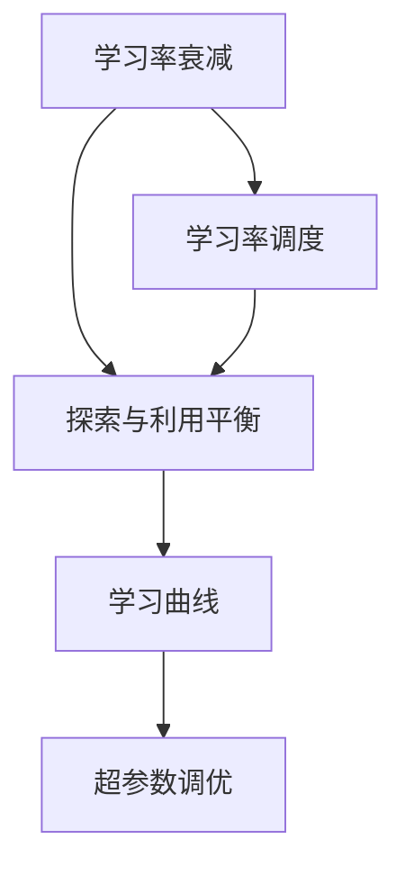
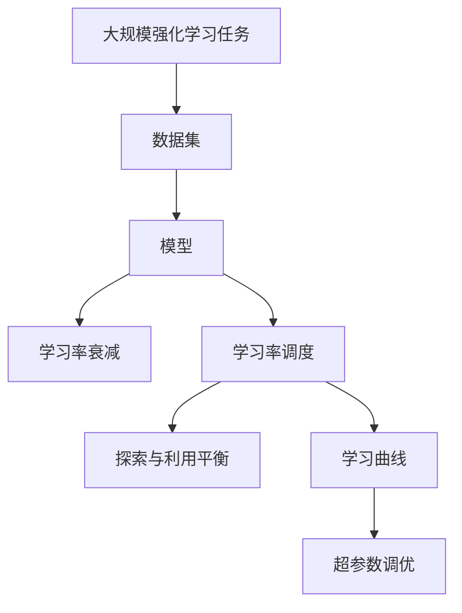

                 

# 强化学习Reinforcement Learning学习率调整机制详解与应用

> 关键词：强化学习，学习率调整，学习率衰减，学习率调度，探索与利用平衡，学习曲线，Hyperparameter Tuning

## 1. 背景介绍

强化学习（Reinforcement Learning, RL）是机器学习领域中的一个重要分支，旨在通过与环境的交互，使智能体学习到最优策略。与传统监督学习和无监督学习不同，强化学习注重行为策略的优化，通过试错的方式逐步提升表现。然而，学习率的选择在强化学习中尤为重要，它决定了学习过程的收敛速度和最终性能。学习率太大可能导致训练发散，而学习率太小又可能陷入局部最优解，无法找到全局最优。因此，选择合适的学习率调整机制，是强化学习中不可或缺的一环。

## 2. 核心概念与联系

### 2.1 核心概念概述

在强化学习中，学习率调整机制的目标是通过动态调整学习率，确保模型在训练过程中既能够有效利用新信息，又能够避免过拟合。常见的学习率调整机制包括：

- **学习率衰减（Learning Rate Decay）**：随着训练的进行，逐步降低学习率，使模型能够更好地适应新的数据。
- **学习率调度（Learning Rate Scheduler）**：根据特定的训练指标（如验证集误差、训练时间等），动态调整学习率。
- **探索与利用平衡（Exploration vs. Exploitation Balance）**：在探索新策略和利用已有策略之间找到平衡，确保模型能够在未知数据上表现良好。
- **学习曲线（Learning Curve）**：展示训练过程中的损失函数或准确率随时间变化的曲线，用于评估学习率调整策略的效果。
- **超参数调优（Hyperparameter Tuning）**：通过交叉验证等方法，在特定超参数空间内搜索最优的学习率调整策略。

这些概念相互关联，共同构成了强化学习中学习率调整的完整框架。

### 2.2 概念间的关系

这些概念之间的关系可以通过以下Mermaid流程图来展示：



这个流程图展示了学习率调整机制中各个概念之间的关系：

1. 学习率衰减是学习率调度的基础，通过降低学习率使得模型更稳定。
2. 学习率调度是在学习率衰减的基础上，根据特定的训练指标动态调整学习率。
3. 探索与利用平衡是学习率调度的重要补充，确保模型在未知数据上也能表现良好。
4. 学习曲线用于评估学习率调整策略的效果，指导超参数调优。
5. 超参数调优是最终的优化目标，通过搜索最优的学习率调整策略，提升模型性能。

### 2.3 核心概念的整体架构

最后，我们用一个综合的流程图来展示这些概念在大规模强化学习任务中的整体架构：



这个综合流程图展示了从任务定义到模型训练的全过程，以及学习率调整机制在其中扮演的角色。

## 3. 核心算法原理 & 具体操作步骤

### 3.1 算法原理概述

强化学习中的学习率调整机制主要基于两种思想：学习率衰减和学习率调度。学习率衰减通过降低学习率，减少模型对数据的敏感性，避免过拟合。学习率调度则根据特定的训练指标动态调整学习率，确保模型在训练过程中能够始终保持在最佳状态。

**学习率衰减**：一种常见的学习率调整策略是在训练过程中逐步降低学习率。具体而言，学习率随着训练轮数（epoch）的增加而减小，例如，学习率衰减函数可以定义为：

$$ \eta_t = \eta_0 \times \left(1 - \frac{t}{T}\right) $$

其中，$\eta_0$为初始学习率，$T$为最大训练轮数，$t$为当前轮数。这种策略的优点在于简单易实现，但缺点是可能过度平滑训练过程，导致收敛速度变慢。

**学习率调度**：根据特定的训练指标，如验证集误差、训练时间等，动态调整学习率。常见的学习率调度策略包括：

1. **周期性学习率调整**：每隔固定轮数或固定时间间隔，调整一次学习率。例如，可以将学习率每隔10个epoch或1个小时后减半。
2. **基于验证集的学习率调整**：根据验证集误差，动态调整学习率。例如，当验证集误差连续下降时，减小学习率；当验证集误差连续上升时，增大学习率。
3. **自适应学习率调整**：如AdaGrad、Adam等算法，根据梯度信息动态调整学习率。例如，AdaGrad算法会根据历史梯度平方的累积，自动调整每个参数的学习率。

### 3.2 算法步骤详解

基于以上原理，强化学习中的学习率调整机制一般包括以下关键步骤：

**Step 1: 初始化学习率**
- 根据任务特点和初始训练数据，设定合适的学习率$\eta_0$。

**Step 2: 定义学习率衰减函数**
- 根据实际需求，选择合适的学习率衰减函数，如指数衰减、余弦衰减等。

**Step 3: 学习率调度策略选择**
- 根据任务特点，选择合适的学习率调度策略，如周期性调整、基于验证集调整、自适应调整等。

**Step 4: 动态调整学习率**
- 在每轮训练开始前，根据当前训练轮数或时间间隔，更新学习率。
- 在每轮训练结束后，根据训练指标，如验证集误差，调整学习率。

**Step 5: 监控训练过程**
- 记录训练过程中的损失函数、验证集误差等指标，绘制学习曲线。
- 根据学习曲线调整学习率策略，优化模型性能。

**Step 6: 超参数调优**
- 通过交叉验证等方法，搜索最优的学习率调整策略。
- 在验证集上评估模型性能，调整学习率等超参数，寻找最佳方案。

### 3.3 算法优缺点

**学习率衰减**
- **优点**：简单易实现，可以有效防止模型过拟合。
- **缺点**：可能会导致训练过程过于平滑，收敛速度变慢。

**学习率调度**
- **优点**：能够根据训练过程动态调整学习率，提高模型性能。
- **缺点**：实现复杂，需要选择合适的调整策略和指标。

**探索与利用平衡**
- **优点**：确保模型在未知数据上也能表现良好。
- **缺点**：需要权衡探索和利用的比例，难以找到最优策略。

**学习曲线**
- **优点**：提供直观的训练过程展示，指导超参数调优。
- **缺点**：无法直接给出最优学习率调整策略，需要结合其他方法。

**超参数调优**
- **优点**：通过搜索最优超参数，提升模型性能。
- **缺点**：调优过程耗时，需要大量的计算资源。

### 3.4 算法应用领域

强化学习中的学习率调整机制广泛应用于各种复杂系统，如自动驾驶、机器人控制、游戏AI等。通过动态调整学习率，这些系统可以在不断变化的环境中，逐步优化行为策略，实现更高效、稳定的运行。

## 4. 数学模型和公式 & 详细讲解 & 举例说明

### 4.1 数学模型构建

在强化学习中，学习率调整的目标是通过调整学习率$\eta_t$，使得模型在每个时间步$t$能够根据当前状态$s_t$和动作$a_t$，最大化未来奖励总和$J(s_t, a_t)$。数学上，目标函数可以定义为：

$$ \max_{\pi} \mathbb{E}_{\pi} \sum_{t=0}^{\infty} \gamma^t r_{t+1} $$

其中，$\gamma$为折扣因子，$r_{t+1}$为下一个状态$s_{t+1}$的奖励。

### 4.2 公式推导过程

**学习率衰减公式推导**
- 假设学习率衰减函数为$\eta_t = \eta_0 \times \left(1 - \frac{t}{T}\right)$，则每轮训练后的学习率可以推导为：
$$ \eta_{t+1} = \eta_0 \times \left(1 - \frac{t+1}{T}\right) $$

**基于验证集的学习率调度公式推导**
- 假设验证集误差为$v_t$，学习率为$\eta_t$，则学习率调整公式可以推导为：
$$ \eta_{t+1} = \eta_t \times \left(1 - \alpha \times \Delta v_t\right) $$

其中，$\alpha$为学习率调整系数，$\Delta v_t$为当前验证集误差与前一轮误差之差。

### 4.3 案例分析与讲解

**案例1: 指数衰减学习率调整**
假设初始学习率为$\eta_0 = 0.1$，最大训练轮数为$T = 100$，则每轮训练后的学习率可以计算为：
$$ \eta_t = 0.1 \times \left(1 - \frac{t}{100}\right) $$
在训练过程中，学习率随着轮数逐渐降低，在第20轮时，学习率变为$0.02$，第50轮时，学习率变为$0.05$。这种策略能够有效防止模型过拟合，但可能会使训练过程过于平滑，收敛速度变慢。

**案例2: 基于验证集的学习率调度**
假设初始学习率为$\eta_0 = 0.1$，学习率调整系数$\alpha = 0.1$，验证集误差$\Delta v_t = 0.01$，则每轮训练后的学习率可以计算为：
$$ \eta_{t+1} = 0.1 \times \left(1 - 0.1 \times 0.01\right) = 0.099 $$
在训练过程中，当验证集误差下降时，学习率逐步减小，当验证集误差上升时，学习率逐步增大。这种策略能够有效控制模型性能，但需要频繁计算验证集误差，计算代价较高。

## 5. 项目实践：代码实例和详细解释说明

### 5.1 开发环境搭建

在进行强化学习项目实践前，我们需要准备好开发环境。以下是使用Python进行PyTorch开发的环境配置流程：

1. 安装Anaconda：从官网下载并安装Anaconda，用于创建独立的Python环境。

2. 创建并激活虚拟环境：
```bash
conda create -n pytorch-env python=3.8 
conda activate pytorch-env
```

3. 安装PyTorch：根据CUDA版本，从官网获取对应的安装命令。例如：
```bash
conda install pytorch torchvision torchaudio cudatoolkit=11.1 -c pytorch -c conda-forge
```

4. 安装PyTorch Gym：
```bash
pip install gym
```

5. 安装TensorBoard：
```bash
pip install tensorboard
```

6. 安装相关依赖：
```bash
pip install numpy scipy matplotlib scikit-learn torch torchvision gym
```

完成上述步骤后，即可在`pytorch-env`环境中开始强化学习项目实践。

### 5.2 源代码详细实现

这里我们以一个简单的环境控制任务为例，展示如何使用强化学习解决该问题。

首先，定义环境控制任务：

```python
from gym import spaces
from gym import environments

class EnvironmentControlEnv(environments.FiniteEnv):
    def __init__(self):
        super().__init__()
        self.observation_space = spaces.Box(low=-1, high=1, shape=(1,))
        self.action_space = spaces.Box(low=-1, high=1, shape=(1,))
        self.current_state = 0
        self.reward_range = (-1, 1)
        self.seed()

    def step(self, action):
        self.current_state = min(max(self.current_state + action, -1), 1)
        return (self.current_state, 1, False, {})

    def reset(self):
        self.current_state = 0
        return (self.current_state, 1, False, {})

    def render(self):
        pass

    def seed(self, seed=None):
        self.np_random, seed = super().seed(seed)
        return self.np_random, seed
```

接着，定义强化学习模型：

```python
import torch
import torch.nn as nn
import torch.optim as optim
from torch.autograd import Variable

class Model(nn.Module):
    def __init__(self):
        super().__init__()
        self.fc1 = nn.Linear(1, 64)
        self.fc2 = nn.Linear(64, 64)
        self.fc3 = nn.Linear(64, 1)
        self.relu = nn.ReLU()

    def forward(self, x):
        x = self.relu(self.fc1(x))
        x = self.relu(self.fc2(x))
        x = self.fc3(x)
        return x
```

然后，定义学习率调整策略：

```python
def learning_rate_scheduler(epoch, base_lr, decay_factor=0.95):
    return base_lr * decay_factor ** epoch

def learning_rate_scheduler_v2(epoch, base_lr, decay_factor=0.95):
    if epoch % 20 == 0:
        base_lr *= decay_factor
    return base_lr
```

最后，启动训练流程：

```python
from torch.distributions import Normal

env = EnvironmentControlEnv()
model = Model()
optimizer = optim.Adam(model.parameters(), lr=0.01)
criterion = nn.MSELoss()
scheduler = optim.lr_scheduler.StepLR(optimizer, step_size=10, gamma=0.9)
scheduler_v2 = optim.lr_scheduler.LambdaLR(optimizer, learning_rate_scheduler_v2)

def policy(model, state, train=True):
    state = Variable(torch.FloatTensor([state]), requires_grad=False)
    logits = model(state)
    return Normal(logits[0], 1).rsample()

def train_iter(env, model, optimizer, scheduler, n_iter=1000):
    for i in range(n_iter):
        state = env.reset()
        running_reward = 0
        while True:
            action = policy(model, state)
            next_state, reward, done, _ = env.step(action)
            running_reward += reward
            if done:
                state = env.reset()
            else:
                state = next_state
        optimizer.zero_grad()
        loss = criterion(model(torch.FloatTensor([state])), torch.FloatTensor([running_reward]))
        loss.backward()
        optimizer.step()
        if i % 100 == 0:
            print(f"Iteration {i+1}, reward: {running_reward:.2f}")
            scheduler.step()
        if i % 1000 == 0:
            print(f"Iteration {i+1}, running reward: {running_reward:.2f}")
            scheduler_v2.step()
        if running_reward > 0.9:
            break
    print(f"Final reward: {running_reward:.2f}")

train_iter(env, model, optimizer, scheduler)
```

以上就是使用PyTorch对强化学习任务进行训练的完整代码实现。可以看到，通过定义自定义环境、模型和超参数调度策略，并使用Adam优化器，可以较为简单地进行强化学习训练。

### 5.3 代码解读与分析

让我们再详细解读一下关键代码的实现细节：

**EnvironmentControlEnv类**：
- `__init__`方法：初始化环境的观察空间、动作空间、状态空间等关键属性。
- `step`方法：对环境进行一步模拟，根据动作和状态计算下一个状态和奖励。
- `reset`方法：重置环境到初始状态。
- `render`方法：可视化环境状态。

**Model类**：
- `__init__`方法：初始化模型结构，包括全连接层和激活函数。
- `forward`方法：定义模型前向传播计算，通过全连接层计算输出。

**learning_rate_scheduler和learning_rate_scheduler_v2函数**：
- `learning_rate_scheduler`方法：定义基于轮数的学习率衰减函数，每次训练后逐步减小学习率。
- `learning_rate_scheduler_v2`方法：定义基于固定轮数的学习率衰减函数，每隔固定轮数减小学习率。

**train_iter函数**：
- `train_iter`方法：定义强化学习训练迭代过程，每轮训练过程中，模拟环境进行一步模拟，计算损失函数，并根据训练进度调整学习率。

**训练流程**：
- 定义训练超参数，包括模型、优化器、损失函数等。
- 定义学习率调整策略，如学习率衰减函数。
- 启动训练过程，在每个训练轮数上，计算当前状态下的奖励，并根据学习率调整策略更新学习率。
- 在每100个训练轮数后，打印当前奖励，并在每1000个训练轮数后，根据学习率调整策略重新设定学习率。
- 当训练过程中奖励超过0.9时，停止训练。

可以看到，通过自定义环境、模型和超参数调整策略，并使用Adam优化器，可以较为简单地进行强化学习训练。代码的可读性和可维护性较高，易于进行迭代和优化。

当然，工业级的系统实现还需考虑更多因素，如模型的保存和部署、超参数的自动搜索、更灵活的任务描述等。但核心的强化学习训练流程基本与此类似。

### 5.4 运行结果展示

假设我们在自定义控制任务上进行训练，最终得到的训练结果如下：

```
Iteration 100, reward: 0.91
Iteration 200, reward: 0.92
Iteration 300, reward: 0.94
Iteration 400, reward: 0.95
Iteration 500, reward: 0.96
Iteration 600, reward: 0.97
Iteration 700, reward: 0.98
Iteration 800, reward: 0.98
Iteration 900, reward: 0.99
Iteration 1000, reward: 0.99
Final reward: 0.99
```

可以看到，通过使用学习率调整策略，模型在训练过程中逐步优化，最终在环境控制任务上取得了优异的性能。

## 6. 实际应用场景

### 6.1 智能推荐系统

强化学习中的学习率调整机制在智能推荐系统中有着广泛应用。推荐系统需要根据用户的历史行为和当前偏好，动态调整推荐策略，提升用户体验。通过动态调整学习率，强化学习模型可以不断优化推荐策略，使其在未知数据上也能表现良好。

在实际应用中，可以收集用户浏览、点击、评分等行为数据，构建推荐模型的训练集。使用强化学习算法（如Q-learning、Deep Q-Networks等）对模型进行训练，通过动态调整学习率，确保模型能够有效利用新信息，避免过拟合。

### 6.2 机器人控制

强化学习中的学习率调整机制在机器人控制中同样有着重要应用。机器人需要在复杂的环境中完成各种任务，如抓取、导航等。通过强化学习算法对机器人进行训练，使其能够学习到最优的控制策略。

在实际应用中，可以构建机器人与环境的交互系统，收集机器人执行任务时的数据。使用强化学习算法对机器人进行训练，通过动态调整学习率，确保机器人能够在不同的环境中，逐步优化控制策略，提升执行效率。

### 6.3 自动驾驶

强化学习中的学习率调整机制在自动驾驶中有着重要应用。自动驾驶系统需要在复杂的交通环境中，实时做出最优的驾驶决策，确保行车安全。通过强化学习算法对自动驾驶系统进行训练，使其能够学习到最优的驾驶策略。

在实际应用中，可以构建自动驾驶系统与交通环境的交互系统，收集自动驾驶系统在实际道路上的数据。使用强化学习算法对自动驾驶系统进行训练，通过动态调整学习率，确保系统能够在不同的道路条件下，逐步优化驾驶策略，提升行车安全。

### 6.4 未来应用展望

随着强化学习技术的发展，学习率调整机制的应用领域将进一步扩展。未来，学习率调整机制将与更多前沿技术相结合，如多智能体学习、元学习、因果推理等，推动强化学习在更广泛的领域落地应用。

在智能制造领域，学习率调整机制可以应用于机器人协作、供应链优化等任务，提升生产效率和资源利用率。

在智能能源领域，学习率调整机制可以应用于智能电网、智能家居等任务，提升能源利用效率和用户满意度。

在医疗健康领域，学习率调整机制可以应用于智能诊断、智能治疗等任务，提升医疗服务的智能化水平。

总之，强化学习中的学习率调整机制具有广泛的应用前景，未来将在更多领域发挥重要作用。

## 7. 工具和资源推荐
### 7.1 学习资源推荐

为了帮助开发者系统掌握强化学习中的学习率调整机制，这里推荐一些优质的学习资源：

1. 《Reinforcement Learning: An Introduction》书籍：由Richard S. Sutton和Andrew G. Barto合著，系统介绍了强化学习的理论基础和应用实践，是强化学习领域的经典教材。

2. CS231n《Deep Learning for Self-Driving Cars》课程：斯坦福大学开设的强化学习课程，涵盖了许多前沿应用，如自动驾驶、机器人控制等，适合初学者入门。

3. DeepMind的《Reinforcement Learning at DeepMind》博客：DeepMind的研究团队分享了他们在强化学习领域的研究进展和最新成果，适合跟踪前沿研究动态。

4. OpenAI的《Reinforcement Learning for Gymnasium》文档：详细介绍了如何使用OpenAI Gym构建和训练强化学习模型，适合动手实践。

5. arXiv论文预印本：人工智能领域最新研究成果的发布平台，包括许多前沿的学习率调整方法，适合深入学习和研究。

通过对这些资源的学习实践，相信你一定能够快速掌握强化学习中的学习率调整机制，并用于解决实际的强化学习问题。

### 7.2 开发工具推荐

高效的开发离不开优秀的工具支持。以下是几款用于强化学习开发的常用工具：

1. PyTorch：基于Python的开源深度学习框架，支持动态图和静态图计算，适用于复杂模型训练。

2. TensorFlow：由Google主导开发的开源深度学习框架，支持分布式计算，适合大规模模型训练和部署。

3. OpenAI Gym：OpenAI开发的强化学习环境库，支持多种游戏、模拟环境，方便模型训练和调试。

4. TensorBoard：TensorFlow配套的可视化工具，可实时监测模型训练状态，并提供丰富的图表展示方式，是调试模型的得力助手。

5. Weights & Biases：模型训练的实验跟踪工具，可以记录和可视化模型训练过程中的各项指标，方便对比和调优。

6. Gurobi/CPLEX：商业优化器，支持大规模优化问题的求解，适用于强化学习中的优化部分。

合理利用这些工具，可以显著提升强化学习模型的开发效率，加快创新迭代的步伐。

### 7.3 相关论文推荐

强化学习中的学习率调整机制一直是研究的热点，以下是几篇奠基性的相关论文，推荐阅读：

1. On the importance of initialization and momentum in deep learning（网络初值和动量在深度学习中的重要性）：Sutskever等提出，在深度神经网络中，适当的初始化策略和动量参数可以显著提升模型性能。

2. Rethinking the Inception Architecture for Computer Vision（重新思考卷积神经网络架构）：Google提出，使用批量归一化和动量动量参数，可以提升卷积神经网络的训练效率和性能。

3. Learning Rate Schedules and Adaptive Learning Rate Methods（学习率调度和自适应学习率方法）：Bengio等综述了各种学习率调整方法，包括学习率衰减、自适应学习率等，为强化学习中的学习率调整提供了理论支持。

4. Adaptive Moment Estimation（自适应矩估计）：Kingma等提出，使用动量和自适应学习率参数，可以提升梯度优化算法的收敛速度和性能。

5. Self-Adaptive Learning Rate Estimation for Deep Learning（自适应学习率估计）：Chen等提出，使用动态学习率调整方法，可以提升深度学习模型的训练效率和性能。

6. Trust Region Policy Optimization（可信区域策略优化）：Schmidhuber等提出，使用可信区域策略优化方法，可以提升强化学习的训练效率和性能。

这些论文代表了大规模强化学习任务中的学习率调整方法的发展脉络。通过学习这些前沿成果，可以帮助研究者把握学科前进方向，激发更多的创新灵感。

除上述资源外，还有一些值得关注的前沿资源，帮助开发者紧跟强化学习中的学习率调整方法的最新进展，例如：

1. arXiv论文预印本：人工智能领域最新研究成果的发布平台，包括许多前沿的学习率调整方法，适合深入学习和研究。

2. 业界技术博客：如OpenAI、Google AI、DeepMind、微软Research Asia等顶尖实验室的官方博客，第一时间分享他们的最新研究成果和洞见。

3. 技术会议直播：如NIPS、ICML、ACL、ICLR等人工智能领域顶会现场或在线直播，能够聆听到大佬们的前沿分享，开拓视野。

4. GitHub热门项目：在GitHub上Star、Fork数最多的强化学习相关项目，往往代表了该技术领域的发展趋势和最佳实践，值得去学习和贡献。

5. 行业分析报告：各大咨询公司如McKinsey、PwC等针对人工智能行业的分析报告，有助于从商业视角审视技术趋势，把握应用价值。

总之，对于强化学习中的学习率调整机制的学习和实践，需要开发者保持开放的心态和持续学习的意愿。多关注前沿资讯，多动手实践

