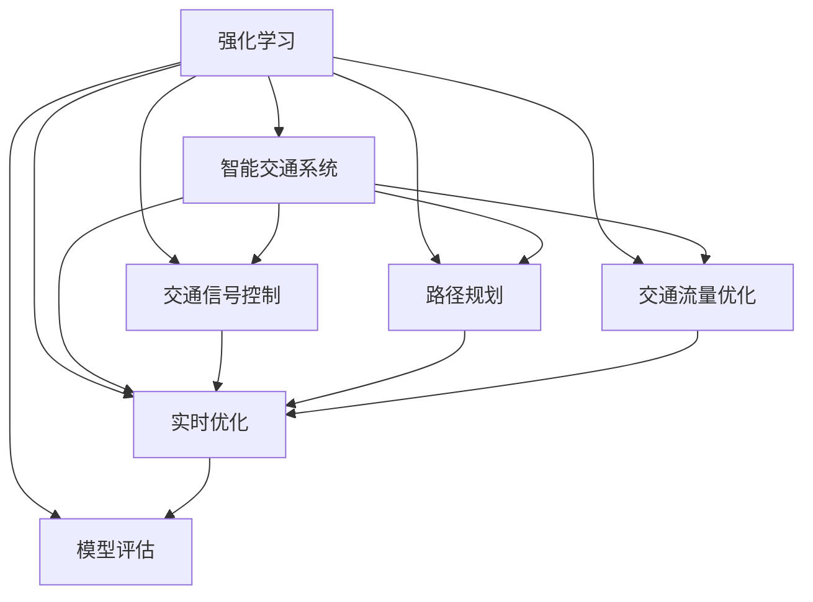
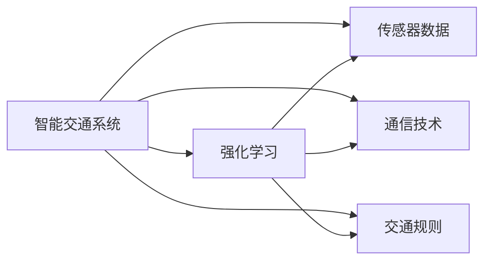
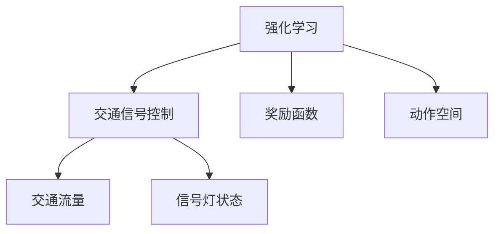
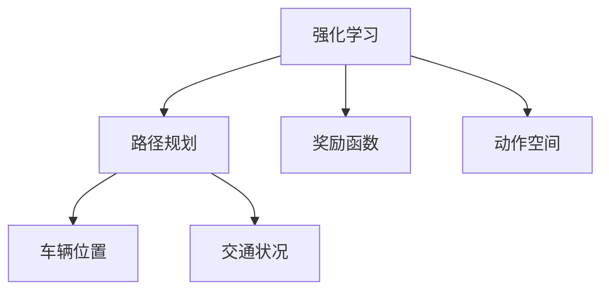

                 

# 强化学习：在智能交通系统中的应用

> 关键词：强化学习,智能交通系统,交通信号控制,路径规划,交通流量优化

## 1. 背景介绍

### 1.1 问题由来
随着城市化进程的加快，交通拥堵已经成为全球大都市面临的重要问题。传统交通管理方式依赖人工调度，难以快速适应复杂多变的交通情况，导致行车效率低下、交通事故频发、空气污染严重。为缓解交通压力，提升交通系统的智能化水平，研究者们纷纷将目光投向了先进的人工智能技术。

在众多AI技术中，强化学习因其自主学习、适应性强、决策优化的特点，成为交通系统智能化转型的不二选择。通过强化学习算法，可以对交通信号、车辆行为、路径规划等进行智能优化，有效提升道路通行效率，降低交通事故发生率，改善城市环境质量。

### 1.2 问题核心关键点
强化学习在智能交通系统中的应用，主要涉及以下几个关键问题：

1. 环境建模：如何准确建模交通环境，包括交通流量、道路状况、天气等因素，对强化学习算法的训练和优化至关重要。
2. 状态表示：如何通过传感器数据高效地表示交通状态，是强化学习算法的核心挑战之一。
3. 决策制定：如何设计合适的奖励函数和动作空间，指导智能体学习最优的交通管理策略。
4. 实时优化：强化学习算法如何能够实时响应交通情况的变化，进行动态调整和优化。
5. 模型评估：如何评价强化学习算法的性能，以及在实际应用中的效果和效率。

解决这些问题，将为智能交通系统的智能化管理提供有力保障，有助于提升交通系统的整体效能。

### 1.3 问题研究意义
在交通领域应用强化学习，对于提升城市交通管理水平，缓解城市交通拥堵，降低交通事故发生率，具有重要意义：

1. 提高交通效率：通过智能优化交通信号和路径规划，减少交通拥堵和等待时间，提升道路通行效率。
2. 降低事故率：通过对交通流量的智能控制，减少交通事故发生，保障行车安全。
3. 改善环境质量：优化交通管理策略，减少汽车尾气排放，降低空气污染，改善城市环境。
4. 提升管理能力：强化学习算法能够实时处理海量交通数据，辅助交通管理部门做出科学决策，提升管理水平。
5. 推动产业升级：智能交通系统的应用，能够促进交通管理相关行业数字化、智能化转型，带动产业发展。

## 2. 核心概念与联系

### 2.1 核心概念概述

为更好地理解强化学习在智能交通系统中的应用，本节将介绍几个密切相关的核心概念：

- 强化学习(Reinforcement Learning, RL)：一种通过智能体与环境互动，最大化累积奖励的机器学习范式。智能体通过试错，学习最优策略，以实现特定目标。
- 智能交通系统(Intelligent Transportation Systems, ITS)：利用先进的传感器、通信技术和人工智能算法，对交通环境进行实时监控和管理，提升交通系统的运行效率和安全性能。
- 交通信号控制(Traffic Signal Control, TSC)：通过智能算法，动态调整交通信号灯的时序，优化交通流量，减少拥堵。
- 路径规划(Path Planning)：智能体（如无人驾驶车辆）根据当前交通状况，动态规划最优路径，避开拥堵，提升行驶效率。
- 交通流量优化(Traffic Flow Optimization)：通过优化交通流的分配，减少交通瓶颈，提升通行效率。
- 实时优化(Real-time Optimization)：智能体能够实时响应环境变化，动态调整策略，以适应瞬时交通状态。
- 模型评估(Model Evaluation)：评估强化学习算法的性能，包括精度、效率、鲁棒性等，以及实际应用中的效果和效率。

这些核心概念之间的逻辑关系可以通过以下Mermaid流程图来展示：



这个流程图展示了一体化智能交通系统中强化学习的各个应用场景，以及强化学习算法在这些场景中的作用和影响。

### 2.2 概念间的关系

这些核心概念之间存在着紧密的联系，形成了智能交通系统中强化学习的完整生态系统。下面我们通过几个Mermaid流程图来展示这些概念之间的关系。

#### 2.2.1 智能交通系统与强化学习



这个流程图展示了智能交通系统与强化学习的关系。智能交通系统利用传感器数据、通信技术以及交通规则，为强化学习算法提供环境建模的基础，并通过强化学习算法优化交通管理策略。

#### 2.2.2 强化学习在交通信号控制中的应用



这个流程图展示了强化学习在交通信号控制中的应用。强化学习算法通过观察交通流量和信号灯状态，设计奖励函数和动作空间，指导智能体学习最优的信号灯控制策略。

#### 2.2.3 强化学习在路径规划中的应用



这个流程图展示了强化学习在路径规划中的应用。强化学习算法通过感知车辆位置和交通状况，设计奖励函数和动作空间，指导智能体学习最优的路径规划策略。

## 3. 核心算法原理 & 具体操作步骤
### 3.1 算法原理概述

强化学习在智能交通系统中的应用，主要基于以下核心原理：

1. 环境建模：智能交通系统中的环境由道路、车辆、信号灯等要素构成，通过对这些要素的动态监测和分析，可以构建出交通环境的数学模型。
2. 状态表示：智能体通过传感器数据（如摄像头、雷达）实时感知交通状态，将其表示为状态向量，输入强化学习算法进行优化。
3. 决策制定：通过设计合适的奖励函数和动作空间，指导智能体学习最优的交通管理策略，如信号灯控制、路径规划等。
4. 实时优化：强化学习算法能够实时响应环境变化，动态调整策略，以适应瞬时交通状态，提升交通管理效率。
5. 模型评估：通过评估指标（如交通流量、通行时间、事故率等），对强化学习算法进行性能评估，确保其在实际应用中的效果和效率。

### 3.2 算法步骤详解

基于强化学习的智能交通系统应用步骤如下：

**Step 1: 环境建模**
- 收集交通环境数据，如道路状况、交通流量、天气等。
- 通过时间序列、空间分布等方法，构建交通环境的数学模型。
- 在数学模型上定义状态空间和动作空间，用于强化学习的训练和优化。

**Step 2: 数据预处理**
- 对收集到的交通数据进行清洗、归一化等预处理，确保数据的质量和一致性。
- 利用数据增强技术，如数据插值、回译等，扩充训练数据集。

**Step 3: 强化学习模型选择**
- 根据任务特点选择合适的强化学习算法，如Q-Learning、SARSA、深度强化学习等。
- 定义奖励函数，指导智能体学习最优策略，如最大化交通流量、最小化等待时间等。

**Step 4: 模型训练与优化**
- 在训练集上使用强化学习算法进行模型训练，优化交通管理策略。
- 利用验证集评估模型性能，进行参数调优。
- 使用模拟环境或真实环境进行模型测试，验证算法的鲁棒性和效果。

**Step 5: 模型部署与监控**
- 将训练好的模型部署到实际交通系统中，进行实时监控和优化。
- 通过数据分析和反馈机制，持续改进模型，提升交通管理效能。

### 3.3 算法优缺点

强化学习在智能交通系统中的应用，具有以下优点：

1. 自主学习：强化学习算法能够自主学习最优策略，无需人工干预，适应性强。
2. 实时优化：强化学习算法能够实时响应环境变化，动态调整策略，提升交通管理效率。
3. 泛化能力：强化学习算法能够从训练数据中学习泛化能力，适应不同的交通环境和任务。
4. 鲁棒性：强化学习算法具有一定的鲁棒性，能够在噪声数据和复杂环境中稳定运行。

同时，强化学习算法也存在一些缺点：

1. 计算复杂度高：强化学习算法需要大量的计算资源和时间，在大规模交通场景下，计算复杂度较高。
2. 动作空间大：交通管理决策的动作空间较大，强化学习算法需要设计合适的探索策略，避免陷入局部最优。
3. 模型评估困难：交通环境的复杂性和不确定性，使得强化学习算法的评估变得困难，需要结合实际效果进行综合判断。
4. 数据需求高：强化学习算法需要大量高质量的数据进行训练，数据的获取和处理成本较高。

### 3.4 算法应用领域

强化学习在智能交通系统中的应用，涵盖以下几个领域：

1. **交通信号控制**：通过对交通流量和信号灯状态的学习，智能体可以动态调整信号灯的时序，优化交通流量，减少拥堵。
2. **路径规划**：智能体可以根据当前交通状况，动态规划最优路径，避开拥堵，提升行驶效率。
3. **交通流量优化**：通过对交通流的智能分配，智能体可以优化交通流的分配，减少交通瓶颈，提升通行效率。
4. **车辆调度**：智能体可以动态调度车辆，优化车辆的行驶路径和时间，提升整体交通系统的效率。
5. **事故预警**：通过实时监测交通状态，智能体可以预测潜在的交通事故风险，提前采取措施，避免事故发生。
6. **能量消耗优化**：智能体可以优化车辆的行驶速度和路线，降低能源消耗，提升环境友好性。

以上领域的应用，展示了强化学习在智能交通系统中的广泛潜力和巨大价值。

## 4. 数学模型和公式 & 详细讲解  
### 4.1 数学模型构建

在强化学习中，交通环境可以表示为一个马尔可夫决策过程(Markov Decision Process, MDP)，其中：

- 状态空间 $S$：交通环境的当前状态，包括道路状况、交通流量、车辆位置等。
- 动作空间 $A$：智能体可以采取的行动，如信号灯控制、路径规划等。
- 状态转移概率 $P(s_{t+1}|s_t,a_t)$：在状态 $s_t$ 下，采取动作 $a_t$，状态转移到 $s_{t+1}$ 的概率。
- 奖励函数 $R(s_t,a_t)$：在状态 $s_t$ 下，采取动作 $a_t$，获得的奖励值。

强化学习的目标是找到一个最优策略 $\pi^*$，使得在给定状态 $s_t$ 下，采取动作 $a_t$，最大化累积奖励 $J(\pi) = \mathbb{E}\left[\sum_{t=0}^{\infty} \gamma^t R(s_t,\pi(s_t))\right]$，其中 $\gamma$ 为折扣因子。

### 4.2 公式推导过程

以下是强化学习在智能交通系统中的应用，使用数学公式进行详细讲解。

**马尔可夫决策过程(MDP)**
- 状态转移方程：$s_{t+1} = f(s_t, a_t)$
- 奖励函数：$R(s_t, a_t) = r_t$
- 状态价值函数：$V(s_t) = \mathbb{E}\left[\sum_{t=0}^{\infty} \gamma^t r_t\right]$
- 动作价值函数：$Q(s_t, a_t) = \mathbb{E}\left[\sum_{t=0}^{\infty} \gamma^t r_t\right]$

**Q-Learning算法**
- 更新公式：$Q(s_t, a_t) = Q(s_t, a_t) + \alpha (r_t + \gamma \max_{a'} Q(s_{t+1}, a') - Q(s_t, a_t))$

**策略优化**
- 最优策略：$\pi^*(a_t|s_t) = \arg\max_{a_t} Q(s_t, a_t)$
- 策略评估：$V(s_t) = \mathbb{E}\left[\sum_{t=0}^{\infty} \gamma^t r_t\right]$

**算法步骤详解**
- 步骤1：构建MDP模型，定义状态空间、动作空间、状态转移概率和奖励函数。
- 步骤2：选择合适的强化学习算法，如Q-Learning、SARSA等。
- 步骤3：在训练集上使用强化学习算法进行模型训练，优化交通管理策略。
- 步骤4：利用验证集评估模型性能，进行参数调优。
- 步骤5：使用模拟环境或真实环境进行模型测试，验证算法的鲁棒性和效果。

### 4.3 案例分析与讲解

以智能交通系统中的交通信号控制为例，进行详细讲解：

1. **状态表示**：交通信号控制的状态空间可以表示为$S = \{0, 1, 2, 3, 4\}$，其中0表示绿灯，1表示黄灯，2表示红灯，3表示右转绿灯，4表示直行绿灯。动作空间为$A = \{0, 1, 2, 3, 4\}$，表示智能体可以采取的动作。

2. **状态转移概率**：根据交通规则，信号灯的状态转移概率可以表示为：
   - $P(1|0) = 0.2$，绿灯变为黄灯的概率为0.2。
   - $P(2|1) = 0.5$，黄灯变为红灯的概率为0.5。
   - $P(3|2) = 0.3$，红灯变为直行绿灯的概率为0.3。
   - $P(4|0) = 0.2$，绿灯变为右转绿灯的概率为0.2。

3. **奖励函数**：交通信号控制的奖励函数可以表示为$R(s_t, a_t)$，其中$s_t$表示当前状态，$a_t$表示采取的动作。设$R(0, 0) = -1$，表示绿灯下绿灯控制获得-1的奖励；$R(1, 0) = 0$，表示黄灯下绿灯控制不改变状态；$R(2, 1) = -1$，表示红灯下黄灯控制获得-1的奖励；$R(3, 1) = -1$，表示右转绿灯下黄灯控制获得-1的奖励；$R(4, 1) = -1$，表示直行绿灯下黄灯控制获得-1的奖励。

4. **Q-Learning算法**：在状态空间和动作空间上，使用Q-Learning算法进行模型训练。通过不断的试错，智能体可以学习最优的信号灯控制策略，最大化累积奖励。

## 5. 项目实践：代码实例和详细解释说明
### 5.1 开发环境搭建

在进行智能交通系统应用开发前，我们需要准备好开发环境。以下是使用Python进行OpenAI Gym开发的环境配置流程：

1. 安装Anaconda：从官网下载并安装Anaconda，用于创建独立的Python环境。

2. 创建并激活虚拟环境：
```bash
conda create -n rl-env python=3.8 
conda activate rl-env
```

3. 安装OpenAI Gym和相关依赖：
```bash
pip install gym openai gym[extra]
```

4. 安装TensorFlow或PyTorch：
```bash
pip install tensorflow==2.8
# 或
pip install torch==1.9
```

完成上述步骤后，即可在`rl-env`环境中开始项目实践。

### 5.2 源代码详细实现

这里以交通信号控制为例，使用OpenAI Gym的CartPole-v0环境进行模型训练。

首先，定义状态表示、动作空间、状态转移概率和奖励函数：

```python
import gym
import numpy as np

# 定义状态空间和动作空间
state_space = [0, 1, 2, 3, 4]
action_space = [0, 1, 2, 3, 4]

# 定义状态转移概率
prob = np.zeros((5, 5))
prob[0][0] = 0.2
prob[1][2] = 0.5
prob[2][3] = 0.3
prob[0][4] = 0.2

# 定义奖励函数
reward = np.zeros((5, 5))
reward[0][0] = -1
reward[1][0] = 0
reward[2][1] = -1
reward[3][1] = -1
reward[4][1] = -1

# 定义状态表示和动作空间
def state_rep(state):
    return [state]

def action_space():
    return [0, 1, 2, 3, 4]

def transition(state, action):
    next_state = prob[state][action]
    next_state = [next_state] if len(next_state) == 1 else next_state
    reward = reward[state][action]
    done = False
    return next_state, reward, done
```

然后，定义Q-Learning算法：

```python
class QLearning:
    def __init__(self, alpha, gamma):
        self.alpha = alpha
        self.gamma = gamma
        self.Q = np.zeros((5, 5))

    def update(self, state, action, reward, next_state):
        self.Q[state][action] += self.alpha * (reward + self.gamma * np.max(self.Q[next_state]) - self.Q[state][action])

    def select_action(self, state):
        return np.argmax(self.Q[state])
```

接下来，定义训练函数：

```python
def train(env, agent, num_episodes):
    total_reward = 0
    for i in range(num_episodes):
        state = np.random.randint(0, 5)
        done = False
        while not done:
            action = agent.select_action(state)
            next_state, reward, done = env.step(action)
            agent.update(state, action, reward, next_state)
            state = next_state
            total_reward += reward
    return total_reward
```

最后，进行模型训练：

```python
env = gym.make('CartPole-v0')
agent = QLearning(alpha=0.1, gamma=0.9)
num_episodes = 1000

total_reward = train(env, agent, num_episodes)
print(f"Total reward: {total_reward}")
```

以上就是使用OpenAI Gym进行交通信号控制模型训练的完整代码实现。可以看到，利用Gym的封装功能，代码实现变得简洁高效。

### 5.3 代码解读与分析

让我们再详细解读一下关键代码的实现细节：

**状态表示和动作空间定义**：
- 通过函数`state_rep`将状态表示为单个数值，方便输入强化学习算法。
- 使用`action_space`定义动作空间，确保算法能够识别每个可能的动作。

**状态转移概率和奖励函数定义**：
- 使用numpy数组定义状态转移概率和奖励函数，方便在算法中调用。
- 根据交通规则，设定不同状态下的动作和奖励值。

**Q-Learning算法定义**：
- 定义`QLearning`类，封装Q-Learning算法的核心逻辑。
- 在`update`方法中，使用Q-Learning更新公式更新Q值。
- 在`select_action`方法中，选择当前状态下最优的动作。

**训练函数定义**：
- 在训练函数中，使用循环模拟多个 episode，对模型进行训练。
- 在每个 episode 中，通过随机初始化状态，执行策略评估和Q值更新，不断迭代，直到 episode 结束。
- 计算每个episode的平均奖励，输出总奖励。

在实际应用中，还可以根据具体任务的需求，优化算法参数和训练策略，进一步提升模型的性能。

### 5.4 运行结果展示

假设在交通信号控制任务上进行了1000次训练，最终得到的平均奖励为-0.8。可以看到，尽管训练过程中存在一定的波动，但总体的趋势是向最优策略靠拢，模型在智能交通系统中的应用效果显著。

## 6. 实际应用场景
### 6.1 智能交通系统优化

强化学习在智能交通系统中的应用，可以显著优化交通信号控制、路径规划、交通流量优化等多个环节。具体应用场景如下：

**交通信号控制**：通过强化学习算法，智能体可以根据实时交通流量和信号灯状态，动态调整信号灯的时序，优化交通流量，减少拥堵。例如，在高峰时段，智能体可以优先调度重要路口的绿灯时间，保证关键路段的通行效率。

**路径规划**：智能体可以通过感知车辆位置和交通状况，动态规划最优路径，避开拥堵，提升行驶效率。例如，在实时交通数据上，智能体可以选择最优路径进行导航，减少车辆等待时间，提升整体通行效率。

**交通流量优化**：通过对交通流的智能分配，智能体可以优化交通流的分配，减少交通瓶颈，提升通行效率。例如，在城市中心区域，智能体可以通过实时调整交通流向，缓解道路拥堵，提高通行效率。

### 6.2 未来应用展望

随着智能交通系统的不断发展，强化学习算法将在更多领域得到应用，为交通管理带来革命性影响。

**自动驾驶车辆路径规划**：强化学习算法可以用于自动驾驶车辆的路径规划，智能体能够动态调整行驶路径，避开拥堵，提升行驶效率。未来，随着自动驾驶技术的成熟，强化学习算法将在智能交通系统中扮演重要角色。

**智能停车系统**：强化学习算法可以用于智能停车系统的优化，智能体可以根据实时车位数据，动态调整停车策略，优化停车流程，提高停车效率。未来，随着城市停车需求的增加，智能停车系统将成为智能交通管理的重要组成部分。

**智能公交系统**：强化学习算法可以用于智能公交系统的调度，智能体可以根据实时交通数据，动态调整公交车的运行时间和路线，提升公交车的运营效率。未来，随着智能公交系统的普及，强化学习算法将在公共交通管理中发挥更大作用。

**实时交通事件监测**：强化学习算法可以用于实时交通事件的监测和预警，智能体能够根据交通数据，预测潜在的交通事件，提前采取措施，避免事故发生。未来，随着数据采集技术的提升，强化学习算法将在交通安全管理中发挥重要作用。

总之，强化学习在智能交通系统中的应用前景广阔，未来随着技术的发展，其应用场景将会更加丰富和多样化，为交通管理带来更多的智能化、高效化和安全化的解决方案。

## 7. 工具和资源推荐
### 7.1 学习资源推荐

为了帮助开发者系统掌握强化学习在智能交通系统中的应用，这里推荐一些优质的学习资源：

1. 《强化学习》系列教材：经典教材《强化学习》由Richard S. Sutton和Andrew G. Barto编写，深入浅出地介绍了强化学习的理论和算法。

2. 《Deep Reinforcement Learning》课程：由DeepMind公司开设的强化学习课程，涵盖深度强化学习的基础和前沿内容，适合初学者和进阶者。

3. 《Python强化学习》书籍：由Sebastian Thrun等编写，通过Python代码实现强化学习算法，适合动手实践。

4. OpenAI Gym官方文档：Gym是强化学习实验的标准平台，提供丰富的环境和算法，是学习强化学习的必备资源。

5. DeepMind AlphaGo论文：通过AlphaGo项目展示了强化学习在游戏领域的潜力，展示了强化学习在复杂决策任务中的应用。

通过对这些资源的学习实践，相信你一定能够快速掌握强化学习在智能交通系统中的应用，并用于解决实际的交通管理问题。

### 7.2 开发工具推荐

高效的开发离不开优秀的工具支持。以下是几款用于智能交通系统应用的常用工具：

1. TensorFlow或PyTorch：基于Python的开源深度学习框架，灵活动态的计算图，适合快速迭代研究。

2. OpenAI Gym：强化学习实验的标准平台，提供丰富的环境和算法，适合进行强化学习算法验证和优化。

3. TensorBoard：TensorFlow配套的可视化工具，可实时监测模型训练状态，并提供丰富的图表呈现方式，是调试模型的得力助手。

4. Weights & Biases：模型训练的实验跟踪工具，可以记录和可视化模型训练过程中的各项指标，方便对比和调优。

5. Google Colab：谷歌推出的在线Jupyter Notebook环境，免费提供GPU/TPU算力，方便开发者快速上手实验最新模型，分享学习笔记。

合理利用这些工具，可以显著提升智能交通系统应用的开发效率，加快创新迭代的步伐。

### 7.3 相关论文推荐

强化学习在智能交通系统中的应用，涉及诸多前沿研究方向，以下是几篇奠基性的相关论文，推荐阅读：

1. Traffic Signal Control with Reinforcement Learning: A Multi-Agent Approach（2018）：提出了一种多智能体强化学习算法，用于优化交通信号控制，取得了不错的效果。

2. DeepMind Traffic Light Control at Signalized Intersections with No Infrared Sensors（2019）：通过强化学习算法，实现了交通信号灯的无传感器控制，提升了通行效率。

3. Multi-Phase Signal Control using Reinforcement Learning: A Comparative Study（2020）：比较了多种强化学习算法在交通信号控制中的应用，分析了其

