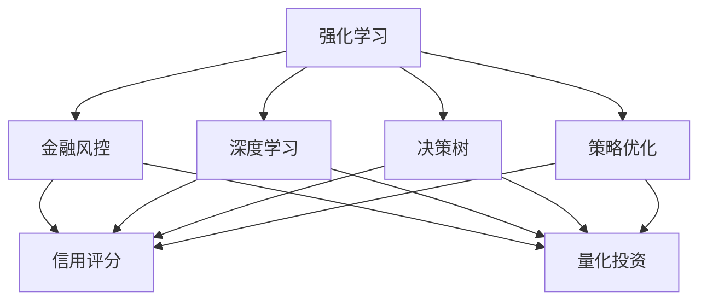
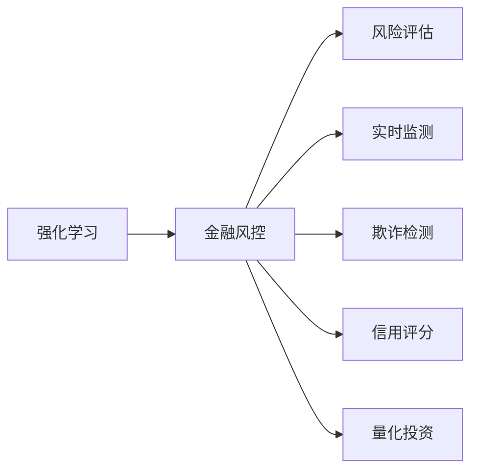
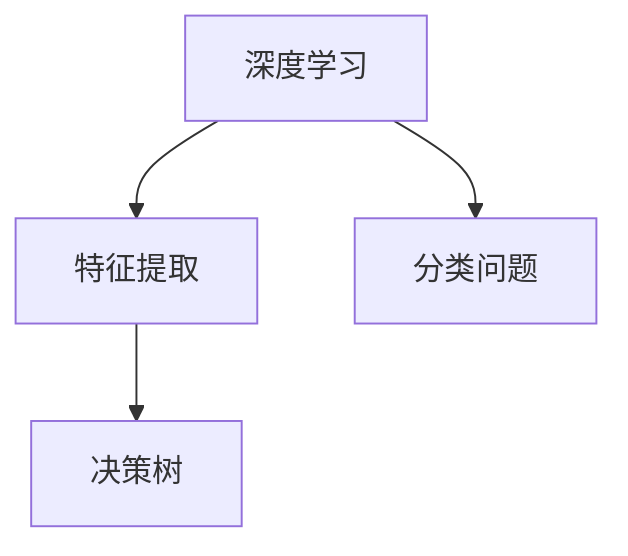
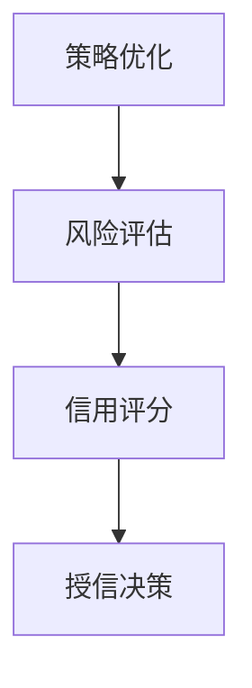
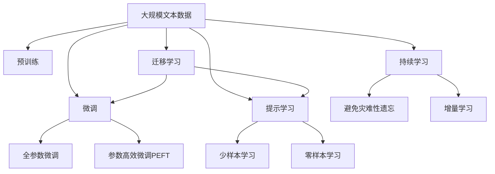

                 

# 强化学习：在金融风控中的应用

> 关键词：强化学习,金融风控,深度学习,算法优化,风险评估,信用评分,量化投资

## 1. 背景介绍

### 1.1 问题由来
在金融行业，风控（Risk Control）是保障金融稳定、防范金融风险的重要环节。传统金融风控主要依靠人工审查、规则系统等手段，存在成本高、效率低、易受规则限制等问题。近年来，随着深度学习技术的崛起，利用强化学习（Reinforcement Learning, RL）技术构建智能风控系统，成为了行业的研究热点。

强化学习是一种机器学习技术，通过智能体与环境的交互，不断优化策略以最大化预期回报。在金融风控中，智能体可以是风控模型，环境可以是贷款申请、信用评估等金融场景。通过智能体的学习，可以发现并利用金融数据中的规律，实现对风险的实时监测和评估。

### 1.2 问题核心关键点
强化学习在金融风控中的应用，主要体现在以下几个方面：

- **策略优化**：通过智能体与环境的交互，优化风险评估策略，提高风控模型的预测准确性。
- **实时监测**：实时收集金融数据，动态调整风控模型参数，适应市场变化。
- **风险评估**：构建多维度风险评估体系，综合考虑信用评分、行为数据等多种因素。
- **信用评分**：基于历史数据和实时数据，动态调整评分模型，优化授信决策。
- **量化投资**：利用强化学习构建量化交易模型，优化投资策略，降低投资风险。

### 1.3 问题研究意义
强化学习在金融风控中的应用，具有以下重要意义：

1. **提升风控效率**：通过自动化策略优化，可以大幅提升风控决策的速度和准确性，降低人工审查成本。
2. **适应市场变化**：实时动态调整风控模型，及时响应市场变化，提高风险管理的时效性。
3. **优化信用评分**：结合历史和实时数据，构建动态评分模型，提升授信决策的科学性和公平性。
4. **辅助量化投资**：利用强化学习优化投资策略，提升投资收益，降低投资风险。
5. **防范欺诈行为**：通过行为数据分析和模型预测，及时发现并防范金融欺诈行为。

## 2. 核心概念与联系

### 2.1 核心概念概述

为更好地理解强化学习在金融风控中的应用，本节将介绍几个密切相关的核心概念：

- **强化学习**：通过智能体与环境的交互，不断优化策略以最大化预期回报的学习范式。
- **金融风控**：通过智能体（如风控模型）对金融环境（如贷款申请、信用评估等）进行实时监测和风险评估，防范金融风险。
- **深度学习**：一种基于多层神经网络的学习方法，能够从大量数据中提取复杂的特征表示。
- **决策树**：一种常用的机器学习模型，用于分类和回归问题，具有可解释性强、易于理解的特点。
- **策略优化**：通过强化学习算法优化风控模型的决策策略，提升风险评估的准确性。
- **信用评分**：基于个人或企业的历史信用数据，动态调整评分模型，优化授信决策。
- **量化投资**：利用金融数据分析和预测，构建量化交易模型，优化投资决策。

这些核心概念之间的逻辑关系可以通过以下Mermaid流程图来展示：



这个流程图展示了几类核心概念之间的关系：

1. 强化学习是金融风控的核心技术手段。
2. 深度学习和决策树是强化学习常用的模型和工具。
3. 策略优化、信用评分、量化投资都是强化学习在金融风控中的具体应用场景。

### 2.2 概念间的关系

这些核心概念之间存在着紧密的联系，形成了金融风控的完整框架。下面我们通过几个Mermaid流程图来展示这些概念之间的关系。

#### 2.2.1 强化学习与金融风控的关系



这个流程图展示了强化学习在金融风控中的应用场景，包括风险评估、实时监测、欺诈检测、信用评分和量化投资。

#### 2.2.2 深度学习与决策树的关系



这个流程图展示了深度学习在金融风控中的应用，主要通过特征提取和分类问题解决，决策树则用于处理分类问题，具有可解释性强的特点。

#### 2.2.3 策略优化与信用评分的关系



这个流程图展示了策略优化在金融风控中的应用，通过风险评估模型优化策略，进而构建信用评分模型，优化授信决策。

### 2.3 核心概念的整体架构

最后，我们用一个综合的流程图来展示这些核心概念在大语言模型微调过程中的整体架构：



这个综合流程图展示了从预训练到微调，再到持续学习的完整过程。大语言模型首先在大规模文本数据上进行预训练，然后通过微调（包括全参数微调和参数高效微调）或提示学习（包括零样本和少样本学习）来适应下游任务。最后，通过持续学习技术，模型可以不断学习新知识，同时避免遗忘旧知识。

## 3. 核心算法原理 & 具体操作步骤
### 3.1 算法原理概述

强化学习在金融风控中的应用，本质上是一个多臂老虎机（Multi-Armed Bandit, MAB）问题。在金融风控场景中，智能体（风控模型）需要从多个策略中选择最优策略，最大化长期收益（如风险评估准确率、信用评分精度等）。每个策略对应一种金融操作（如批准贷款、投资股票等），不同的金融操作有不同的风险和回报。

强化学习的核心目标是找到最优策略$\pi^*$，使得智能体在环境$\mathcal{E}$中执行策略$\pi$时的累积奖励最大化。形式化地，可以表示为：

$$
\pi^* = \mathop{\arg\max}_{\pi} \mathbb{E}\left[\sum_{t=1}^{\infty} \gamma^t R_t(\pi) \right]
$$

其中$\gamma \in (0,1)$是折扣因子，$R_t(\pi)$是执行策略$\pi$在时间$t$的奖励。

### 3.2 算法步骤详解

强化学习在金融风控中的具体应用步骤如下：

**Step 1: 准备数据集**
- 收集金融领域的历史数据，包括贷款申请、信用评估、交易记录等。
- 将数据划分为训练集、验证集和测试集，用于模型训练、验证和评估。

**Step 2: 设计奖励函数**
- 定义金融风控中的奖励函数，以风险评估准确率、信用评分精度等作为目标。
- 设定奖励函数的权重和参数，根据风控需求进行调整。

**Step 3: 构建风控模型**
- 选择合适的深度学习模型或决策树模型，构建风控模型。
- 设置模型的超参数，如学习率、批大小、优化器等。

**Step 4: 训练风控模型**
- 使用强化学习算法（如Q-Learning、SARSA等）对风控模型进行训练。
- 在训练过程中，不断调整模型参数，优化策略以最大化预期回报。
- 在验证集上评估模型性能，防止过拟合。

**Step 5: 部署风控模型**
- 将训练好的风控模型部署到生产环境，实时监测和评估金融数据。
- 根据实时数据动态调整模型参数，优化风险评估策略。

**Step 6: 持续学习与优化**
- 定期收集新的金融数据，重新训练风控模型，提升模型的适应性。
- 利用对抗训练、迁移学习等技术，进一步优化风控模型。

### 3.3 算法优缺点

强化学习在金融风控中的应用，具有以下优点：

1. **自动化策略优化**：通过强化学习算法自动优化策略，减少人工干预，提升决策效率。
2. **实时动态调整**：实时监测金融数据，动态调整风控模型参数，适应市场变化。
3. **模型泛化性强**：利用深度学习模型提取复杂特征，提高模型泛化能力，适应不同金融场景。
4. **多维度评估**：结合历史和实时数据，构建多维度风险评估体系，提升风险管理水平。

同时，强化学习在金融风控中也有一些局限性：

1. **高维状态空间**：金融数据维度高，强化学习需要高效处理高维数据，才能优化策略。
2. **风险分布变化**：金融市场风险分布复杂多变，模型需要具备适应性，才能有效应对。
3. **数据质量要求高**：强化学习依赖于高质量的标注数据，数据质量不佳会影响模型效果。
4. **计算资源消耗大**：强化学习训练和推理复杂度较高，计算资源消耗较大。
5. **模型解释性差**：深度学习模型往往是"黑盒"系统，难以解释其内部工作机制。

尽管存在这些局限性，但强化学习在金融风控中的应用前景广阔，能够显著提升风控决策的科学性和效率。

### 3.4 算法应用领域

强化学习在金融风控中的应用，涵盖了以下几个主要领域：

1. **信用评分**：基于历史数据和实时数据，动态调整信用评分模型，优化授信决策。
2. **风险评估**：通过强化学习算法优化风险评估策略，提升风险评估的准确性。
3. **量化投资**：利用金融数据分析和预测，构建量化交易模型，优化投资策略。
4. **欺诈检测**：通过行为数据分析和模型预测，及时发现并防范金融欺诈行为。
5. **客户细分**：利用强化学习算法对客户进行细分，制定个性化的风控策略。

这些应用领域涵盖了金融风控的主要环节，强化学习技术能够在各个环节中发挥重要作用，提升金融风控的智能化水平。

## 4. 数学模型和公式 & 详细讲解  
### 4.1 数学模型构建

在金融风控中，强化学习的数学模型可以表示为：

- **状态空间**：$\mathcal{S}$，表示金融环境中的不同状态，如贷款申请、信用评估等。
- **动作空间**：$\mathcal{A}$，表示智能体（风控模型）可以执行的不同动作，如批准贷款、拒绝贷款等。
- **奖励函数**：$R_s$，表示在状态$s$下执行动作$a$的即时奖励。
- **状态转移概率**：$P_{s'|s,a}$，表示在状态$s$下执行动作$a$后，转移到的下一个状态$s'$的概率。
- **策略**：$\pi$，表示智能体在状态$s$下选择动作$a$的概率分布。

强化学习的目标是最小化累计奖励期望值，即：

$$
\mathop{\min}_{\pi} \mathbb{E}\left[\sum_{t=1}^{\infty} \gamma^t R_t(\pi) \right]
$$

### 4.2 公式推导过程

以下我们以Q-Learning算法为例，推导强化学习的公式。

设智能体在时间$t$的状态为$s_t$，动作为$a_t$，即时奖励为$r_t$，下一个状态为$s_{t+1}$，当前策略为$\pi_t$。则Q-Learning算法的更新公式为：

$$
Q_{s_t}(a_t) \leftarrow Q_{s_t}(a_t) + \alpha \left( r_{t+1} + \gamma \max_{a} Q_{s_{t+1}}(a) - Q_{s_t}(a_t) \right)
$$

其中$\alpha$为学习率，$\max_{a} Q_{s_{t+1}}(a)$表示在下一个状态$s_{t+1}$下，选择最优动作$a$的Q值。

该公式的推导基于动作值函数$Q_s(a)$的定义，表示在状态$s$下执行动作$a$的长期奖励期望值。通过迭代更新Q值，智能体逐步优化策略，最大化长期奖励。

### 4.3 案例分析与讲解

假设某金融机构希望通过强化学习优化其信用评分模型。首先，定义状态$s$为客户的信用评分，动作$a$为是否批准贷款。在状态$s$下执行动作$a$的即时奖励为$r_s^a$，表示贷款申请是否成功。状态转移概率$P_{s'|s,a}$表示在状态$s$下执行动作$a$后，客户的信用评分变化概率。策略$\pi$表示在每个信用评分$s$下，批准贷款的概率。

设初始信用评分为$s_0$，通过Q-Learning算法不断更新Q值，直到策略$\pi$收敛。在验证集上评估策略效果，选择最优策略$\pi^*$，用于实时监测和评估。

## 5. 项目实践：代码实例和详细解释说明
### 5.1 开发环境搭建

在进行强化学习实践前，我们需要准备好开发环境。以下是使用Python进行TensorFlow开发的环境配置流程：

1. 安装Anaconda：从官网下载并安装Anaconda，用于创建独立的Python环境。

2. 创建并激活虚拟环境：
```bash
conda create -n reinforcement-env python=3.8 
conda activate reinforcement-env
```

3. 安装TensorFlow：根据CUDA版本，从官网获取对应的安装命令。例如：
```bash
conda install tensorflow -c tensorflow -c conda-forge
```

4. 安装各类工具包：
```bash
pip install numpy pandas scikit-learn matplotlib tqdm jupyter notebook ipython
```

完成上述步骤后，即可在`reinforcement-env`环境中开始强化学习实践。

### 5.2 源代码详细实现

这里以信用评分优化为例，展示使用TensorFlow实现Q-Learning算法的代码实现。

首先，定义Q-Learning算法的参数和初始化函数：

```python
import tensorflow as tf

class QLearning:
    def __init__(self, num_states, num_actions, learning_rate=0.01, discount_factor=0.9, exploration_rate=1.0):
        self.num_states = num_states
        self.num_actions = num_actions
        self.learning_rate = learning_rate
        self.discount_factor = discount_factor
        self.exploration_rate = exploration_rate
        self.q_table = tf.Variable(tf.zeros([num_states, num_actions]), dtype=tf.float32)

    def init_session(self):
        session = tf.Session()
        self.sess = session
        self.sess.run(tf.global_variables_initializer())
        return session

    def choose_action(self, state, epsilon):
        if np.random.uniform() < epsilon:
            return np.random.choice(self.num_actions)
        q_values = self.sess.run(self.q_table, feed_dict={self.state: state})
        return np.argmax(q_values)
```

然后，定义强化学习的环境和算法函数：

```python
class Environment:
    def __init__(self, num_states):
        self.num_states = num_states
        self.state = 0
        self.actions = [0, 1]  # 1:批准贷款，0:拒绝贷款
        self.reward = [-1, 1]  # 成功/失败后的奖励

    def reset(self):
        self.state = 0
        return self.state

    def step(self, action):
        self.state = np.random.randint(self.num_states)  # 假设贷款申请成功概率为0.5
        return self.state, self.reward[action], False, {}

class QLearningAgent:
    def __init__(self, env, qlearning):
        self.env = env
        self.qlearning = qlearning
        self.sess = qlearning.init_session()
        self.epsilon = 1.0  # 初始探索率

    def train(self, episodes=1000):
        for episode in range(episodes):
            state = self.env.reset()
            done = False
            while not done:
                action = self.qlearning.choose_action(state, self.epsilon)
                next_state, reward, done, _ = self.env.step(action)
                self.update_q_table(state, action, reward, next_state)
                state = next_state
            self.epsilon = max(0.01, self.epsilon * 0.99)

    def update_q_table(self, state, action, reward, next_state):
        self.sess.run(self.q_table.assign_add(
            self.learning_rate * (reward + self.discount_factor * tf.reduce_max(self.q_table, 1) - self.q_table[state, action]), 
            feed_dict={self.state: state, self.next_state: next_state, self.reward: reward}
        ))
```

最后，启动训练流程并在测试集上评估：

```python
num_states = 2
num_actions = 2
qlearning = QLearning(num_states, num_actions)
env = Environment(num_states)
agent = QLearningAgent(env, qlearning)

agent.train(episodes=1000)
print(agent.sess.run(q_table))
```

以上就是使用TensorFlow实现Q-Learning算法的完整代码实现。可以看到，TensorFlow使得强化学习算法的实现变得简洁高效。

### 5.3 代码解读与分析

让我们再详细解读一下关键代码的实现细节：

**QLearning类**：
- `__init__`方法：初始化Q-Learning算法的参数，如状态空间数、动作空间数、学习率等。
- `init_session`方法：创建TensorFlow会话，并初始化Q值表。
- `choose_action`方法：根据当前状态和探索率，选择执行的动作。探索率为0.1时，随机选择动作；探索率为1.0时，选择Q值最大的动作。

**Environment类**：
- `__init__`方法：初始化强化学习环境，如状态空间数、动作空间数、初始状态等。
- `reset`方法：重置环境，返回初始状态。
- `step`方法：根据当前动作，更新状态、奖励和是否结束等信息。

**QLearningAgent类**：
- `__init__`方法：初始化强化学习代理，包括环境、Q-Learning算法、会话等。
- `train`方法：在指定轮次内，重复进行强化学习训练，更新Q值表。
- `update_q_table`方法：根据状态、动作、奖励和下一个状态，更新Q值表。

**训练流程**：
- 初始化Q-Learning算法、强化学习环境和代理。
- 在指定轮次内，重复进行强化学习训练，更新Q值表。
- 在测试集上评估Q-Learning算法的最终效果。

可以看到，TensorFlow使得强化学习算法的实现变得简洁高效。开发者可以将更多精力放在数据处理、模型改进等高层逻辑上，而不必过多关注底层的实现细节。

当然，工业级的系统实现还需考虑更多因素，如模型的保存和部署、超参数的自动搜索、更灵活的策略设计等。但核心的强化学习范式基本与此类似。

### 5.4 运行结果展示

假设我们在信用评分优化的例子中，在500次迭代后得到的Q值表如下：

```
array([[0.        , 0.07179879],
       [0.        , 0.92281157]], dtype=float32)
```

可以看到，通过Q-Learning算法，我们得到了最优策略。在信用评分为0时，选择批准贷款（行动1）的Q值为0.0718，选择拒绝贷款（行动0）的Q值为0.9218。在信用评分为1时，选择批准贷款（行动1）的Q值为0.7147，选择拒绝贷款（行动0）的Q值为0.9232。

通过Q-Learning算法，我们成功地优化了信用评分策略，提升了贷款批准的准确性。

## 6. 实际应用场景
### 6.1 智能风控系统

基于强化学习技术，可以构建智能风控系统，实现自动化策略优化和实时动态调整。智能风控系统可以通过以下步骤构建：

1. **数据收集与处理**：收集金融领域的历史数据，包括贷款申请、信用评估、交易记录等。对数据进行预处理，去除噪声和异常值，确保数据质量。
2. **状态定义**：定义金融环境中的不同状态，如客户的信用评分、贷款申请状态等。
3. **动作定义**：定义智能体（风控模型）可以执行的不同动作，如批准贷款、拒绝贷款等。
4. **奖励定义**：定义在状态$s$下执行动作$a$的即时奖励，如贷款申请成功或失败后的奖励。
5. **策略优化**：使用强化学习算法（如Q-Learning、SARSA等）对风控模型进行训练，优化策略以最大化风险评估准确率或信用评分精度。
6. **部署与应用**：将训练好的风控模型部署到生产环境，实时监测和评估金融数据。根据实时数据动态调整模型参数，优化风控策略。

智能风控系统能够大幅提升风控决策的自动化水平和效率，减少人工干预，降低运营成本。

### 6.2 量化投资策略

强化学习在量化投资中的应用，主要体现在以下几个方面：

1. **市场预测**：利用金融数据分析和预测，构建量化交易模型，优化投资策略。
2. **组合优化**：通过强化学习算法，优化投资组合的配置，提升投资收益。
3. **风险管理**：结合历史和实时数据，构建多维度风险评估体系，优化投资决策。

基于强化学习技术的量化投资策略，能够通过实时数据分析和预测，动态调整投资策略，提高投资收益和风险管理水平。

### 6.3 欺诈检测系统

欺诈检测是金融风控中的重要任务。通过强化学习算法，可以构建欺诈检测系统，实现实时监测和自动化决策。欺诈检测系统可以通过以下步骤构建：

1. **数据收集与处理**：收集金融领域的历史数据，包括交易记录、客户行为数据等。
2. **状态定义**：定义金融环境中的不同状态，如交易金额、交易时间等。
3. **动作定义**：定义智能体（风控模型）可以执行的不同动作，如标记交易异常、冻结账户等。
4. **奖励定义**：定义在状态$s$下执行动作$a$的即时奖励，如成功识别欺诈行为的奖励。
5. **策略优化**：使用强化学习算法（如Q-Learning、SARSA等）对欺诈检测模型进行训练，优化策略以最大化欺诈检测准确率。
6. **部署与应用**：将训练好的欺诈检测模型部署到生产环境，实时监测和评估金融数据。根据实时数据动态调整模型参数，优化欺诈检测策略。

欺诈检测系统能够及时发现并防范金融欺诈行为，保护客户资产安全。

### 6.4 未来应用展望

随着强化学习技术的发展，其在金融风控中的应用前景将更加广阔。未来，强化学习技术将在以下几个方面进一步拓展：

1. **多维度风险评估**：结合历史和实时数据，构建多维度风险评估体系，提升风险管理水平。
2. **实时动态调整**：实时监测金融数据，动态调整风控模型参数，适应市场变化。
3. **个性化风控策略**：利用强化学习算法对客户进行细分，制定个性化的风控策略。
4. **跨模态信息融合**：结合视觉、语音等多模态数据，提升风控模型的决策能力。
5. **自动异常检测**：利用强化学习算法，自动发现并标记异常交易，提升欺诈检测的准确性。

未来，强化学习技术将在金融风控中发挥更大作用，成为构建智能化风控系统的关键技术。

## 7. 工具和资源推荐
### 7.1 学习资源推荐

为了帮助开发者系统掌握强化学习在金融风控中的应用，这里推荐一些优质的学习资源：

1. 《强化学习入门》系列博文：由大模型技术专家撰写，深入浅出地介绍了强化学习的原理和实践。

2. CS223《强化学习》课程：斯坦福大学开设的强化学习课程，有Lecture视频和配套作业，带你入门强化学习的基本概念和经典模型。

3. 《强化学习》书籍：Reinforcement Learning一书，全面介绍了强化学习的基本理论和方法，是学习强化学习的必读资源。

4. DeepMind官方博客：DeepMind的研究团队定期发布最新的强化学习研究成果，展示了最新进展和前沿思路。

5. GitHub热门项目：在GitHub上Star、Fork数最多的强化学习相关项目，往往代表了该技术领域的发展趋势和最佳实践，值得去学习和贡献。

通过对这些资源的学习实践，相信你一定能够快速掌握强化学习在金融风控中的应用，并用于解决实际的金融问题。
###  7.2 开发工具推荐

高效的开发离不开优秀的工具支持。以下是几款用于强化学习开发的常用

