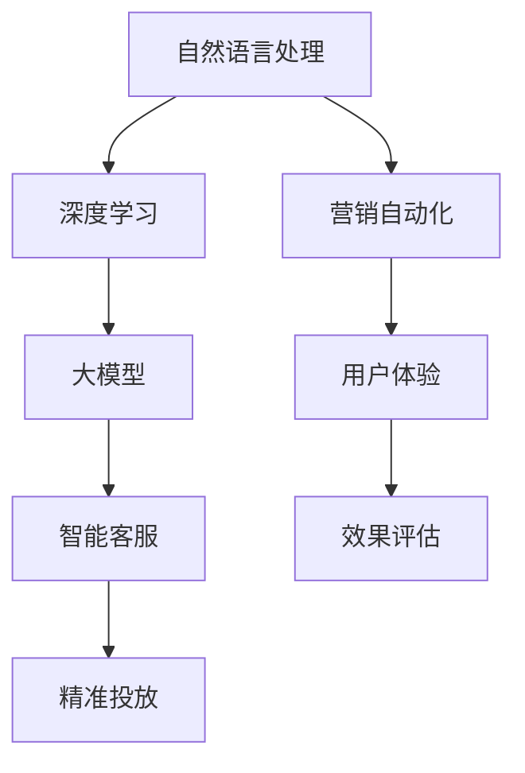

                 

# 微信营销与大模型的应用

> 关键词：微信营销, 大模型, 自然语言处理, 深度学习, 营销自动化, 智能客服

## 1. 背景介绍

随着移动互联网的迅速发展，微信作为全球最大的社交平台之一，已成为各大企业进行品牌推广和用户互动的重要渠道。传统营销方式如邮件、短信、电话等，不仅成本高昂，效果难以评估，还容易陷入用户黑名单，难以真正触达目标群体。而基于微信生态的营销模式，以其低成本、高互动、精准触达等优势，成为企业营销的新趋势。

然而，微信营销的实际落地并非易事。海量用户数据和复杂用户需求，使得传统人工处理方式难以胜任。为此，各大企业纷纷引入先进技术，如自然语言处理（NLP）、深度学习等，提升微信营销的效果。其中，大模型的应用，以其强大的数据分析和推理能力，成为营销自动化和智能客服的关键推动力。

## 2. 核心概念与联系

### 2.1 核心概念概述

本节将介绍几个与微信营销相关的大模型核心概念：

- **自然语言处理（NLP）**：一种涉及计算机理解和生成自然语言的技术，用于处理文本数据，如图像、语音等。NLP技术广泛应用于机器翻译、情感分析、文本分类、对话生成等任务。
- **深度学习（Deep Learning）**：一种基于多层神经网络的学习方法，通过大量数据训练，逐步学习出复杂的非线性映射关系。深度学习在图像识别、语音识别、自然语言处理等领域取得重大突破。
- **大模型（Large Model）**：指拥有亿计参数的深度学习模型，如BERT、GPT-3等。大模型具备强大的表示能力和泛化能力，能够处理复杂的语言任务。
- **智能客服（Smart Customer Service）**：基于自然语言处理和大模型，构建能够理解用户需求、提供个性化服务的客服系统。
- **营销自动化（Marketing Automation）**：通过自动化流程，实现营销活动的精准投放和效果评估，提升营销效率和ROI。
- **用户体验（User Experience, UX）**：指用户在使用产品或服务过程中产生的整体感受和满意度。微信营销中，用户体验直接影响用户黏性和忠诚度。

这些核心概念之间存在紧密联系，共同构成微信营销的核心框架。通过深度学习和大模型的技术手段，能够实现智能客服、营销自动化等功能，提升用户体验，从而更好地实现品牌推广和用户互动。

### 2.2 概念间的关系

这些核心概念之间的关系可以通过以下Mermaid流程图来展示：



这个流程图展示了大模型在营销自动化和智能客服中的应用，同时涉及用户体验和效果评估等概念。通过深度学习和大模型的技术手段，可以构建精准投放和效果评估的营销自动化系统，提升用户体验，实现品牌推广和用户互动。

## 3. 核心算法原理 & 具体操作步骤

### 3.1 算法原理概述

基于大模型的微信营销，本质上是一种应用深度学习和大模型进行数据分析和推理的自动化过程。其核心思想是：通过大规模数据训练，让大模型学习到复杂的语言表示，从而能够处理自然语言处理任务，实现营销自动化和智能客服等功能。

具体来说，企业可以通过以下步骤实现基于大模型的微信营销：

1. **数据收集与预处理**：收集微信聊天记录、用户行为数据等，进行清洗和标注。
2. **模型训练与优化**：选择合适的大模型，如BERT、GPT等，进行微调训练，优化模型参数。
3. **功能实现**：将训练好的模型部署到微信公众平台，实现智能客服、营销自动化等功能。
4. **效果评估与反馈**：定期评估模型效果，收集用户反馈，不断优化模型和功能。

### 3.2 算法步骤详解

以下将详细介绍基于大模型的微信营销的具体步骤：

**Step 1: 数据收集与预处理**

- 收集微信聊天记录、用户行为数据等，进行清洗和标注。清洗数据包括去除无关信息、处理缺失值等。标注数据涉及用户需求、服务请求等信息的标注，如情感、意图等。

**Step 2: 模型训练与优化**

- 选择合适的深度学习框架（如PyTorch、TensorFlow等）和预训练模型（如BERT、GPT等），进行微调训练。微调目标包括情感分析、意图识别、对话生成等任务。
- 设计合适的损失函数和优化器，如交叉熵损失、AdamW等，进行模型训练和优化。
- 使用数据增强、正则化等技术，防止模型过拟合，提高泛化能力。

**Step 3: 功能实现**

- 将训练好的模型部署到微信公众平台，实现智能客服、营销自动化等功能。智能客服通过自然语言处理技术，自动理解用户需求，提供个性化服务。营销自动化通过数据分析，实现精准投放和效果评估。

**Step 4: 效果评估与反馈**

- 定期评估模型效果，收集用户反馈，不断优化模型和功能。评估指标包括准确率、召回率、用户满意度等。

### 3.3 算法优缺点

基于大模型的微信营销具有以下优点：

- **高效性**：大模型能够快速处理海量数据，提升营销效率。
- **高精准性**：通过深度学习和大模型技术，实现精准投放和效果评估，提高ROI。
- **高互动性**：智能客服能够理解用户需求，提供个性化服务，提升用户体验。

同时，基于大模型的微信营销也存在以下缺点：

- **数据依赖性**：大模型依赖高质量标注数据，标注成本较高。
- **模型复杂性**：大模型参数众多，训练和推理复杂。
- **解释性不足**：大模型往往视为"黑盒"，难以解释其决策过程。

尽管存在这些局限性，但大模型的强大表现和高效性，使得其在实际应用中仍具有显著优势。

### 3.4 算法应用领域

基于大模型的微信营销，已经在多个领域得到广泛应用，如智能客服、营销自动化、广告投放等。以下是几个典型应用场景：

**智能客服**：通过自然语言处理技术，自动理解用户需求，提供个性化服务。

**营销自动化**：通过数据分析，实现精准投放和效果评估，提升营销效率。

**广告投放**：根据用户行为数据，实现个性化广告推荐，提升广告点击率和转化率。

**客户关系管理（CRM）**：通过用户数据分析，实现个性化营销和服务，提升客户忠诚度。

## 4. 数学模型和公式 & 详细讲解 & 举例说明

### 4.1 数学模型构建

在基于大模型的微信营销中，常用的数学模型包括：

- **情感分析模型**：通过分类算法（如逻辑回归、支持向量机等），对用户情感进行分类。
- **意图识别模型**：通过分类算法，对用户意图进行分类。
- **对话生成模型**：通过生成算法（如循环神经网络、Transformer等），生成自然语言回复。

以情感分析模型为例，数学模型如下：

- 输入：用户评论 $x$
- 输出：情感分类 $y$
- 模型：$y = f(x)$，其中 $f$ 为分类函数

**4.2 公式推导过程**

以分类算法为例，常见的情感分析公式如下：

$$
P(y=1|x) = \sigma(\mathbf{w} \cdot \mathbf{x} + b)
$$

其中，$\sigma$ 为激活函数（如sigmoid），$\mathbf{w}$ 和 $b$ 为模型参数。

通过最大化训练集的似然函数，可以得到模型参数的优化目标：

$$
\mathop{\arg\min}_{\theta} -\sum_{i=1}^{N} \log P(y_i|\mathbf{x}_i)
$$

**4.3 案例分析与讲解**

以自然语言处理为例，以下是使用深度学习模型进行情感分析的流程：

1. **数据收集**：收集用户评论数据，进行清洗和标注。
2. **模型选择**：选择适当的深度学习模型，如LSTM、GRU、BERT等。
3. **模型训练**：对模型进行训练，优化模型参数。
4. **效果评估**：使用验证集评估模型效果，调整模型参数。
5. **部署应用**：将训练好的模型部署到实际应用中，进行情感分析。

## 5. 项目实践：代码实例和详细解释说明

### 5.1 开发环境搭建

为了实现基于大模型的微信营销，我们需要搭建Python开发环境。以下是具体步骤：

1. 安装Anaconda：从官网下载并安装Anaconda，用于创建独立的Python环境。
2. 创建并激活虚拟环境：
```bash
conda create -n pytorch-env python=3.8 
conda activate pytorch-env
```
3. 安装PyTorch：根据CUDA版本，从官网获取对应的安装命令。例如：
```bash
conda install pytorch torchvision torchaudio cudatoolkit=11.1 -c pytorch -c conda-forge
```
4. 安装Transformers库：
```bash
pip install transformers
```

完成上述步骤后，即可在`pytorch-env`环境中开始项目开发。

### 5.2 源代码详细实现

以下是一个基于BERT模型的情感分析示例代码：

```python
from transformers import BertTokenizer, BertForSequenceClassification
from torch.utils.data import DataLoader
from torch.nn import CrossEntropyLoss
import torch
import torch.optim as optim

# 加载数据集
train_data = ...
train_labels = ...
test_data = ...
test_labels = ...

# 初始化BERT模型和tokenizer
model = BertForSequenceClassification.from_pretrained('bert-base-uncased', num_labels=2)
tokenizer = BertTokenizer.from_pretrained('bert-base-uncased')

# 构建数据集和数据加载器
train_dataset = Dataset(train_data, train_labels, tokenizer)
train_loader = DataLoader(train_dataset, batch_size=16, shuffle=True)

# 定义损失函数和优化器
criterion = CrossEntropyLoss()
optimizer = optim.Adam(model.parameters(), lr=2e-5)

# 模型训练
for epoch in range(3):
    model.train()
    for batch in train_loader:
        input_ids = batch.input_ids.to(device)
        attention_mask = batch.attention_mask.to(device)
        labels = batch.labels.to(device)
        outputs = model(input_ids, attention_mask=attention_mask, labels=labels)
        loss = criterion(outputs, labels)
        optimizer.zero_grad()
        loss.backward()
        optimizer.step()
```

### 5.3 代码解读与分析

以下是对代码关键部分的解读：

**数据集构建**：
- `train_data`和`train_labels`：训练集数据和标签。
- `test_data`和`test_labels`：测试集数据和标签。
- `Dataset`类：用于构建数据集，将原始文本数据转换为模型可以处理的格式。

**模型加载与训练**：
- `BertForSequenceClassification`：BERT模型的分类头，用于情感分析任务。
- `BertTokenizer`：用于将文本转换为模型可以处理的格式。
- `CrossEntropyLoss`：用于计算分类任务的损失函数。
- `Adam`：用于优化模型的参数。

**训练过程**：
- `for epoch in range(3)`：训练3个epoch。
- `model.train()`：将模型置于训练模式。
- `for batch in train_loader`：遍历训练集数据。
- `input_ids = batch.input_ids.to(device)`：将输入数据转换为GPU上的张量。
- `labels = batch.labels.to(device)`：将标签转换为GPU上的张量。
- `outputs = model(input_ids, attention_mask=attention_mask, labels=labels)`：模型前向传播计算输出。
- `loss = criterion(outputs, labels)`：计算损失函数。
- `optimizer.zero_grad()`：将梯度清零。
- `loss.backward()`：反向传播计算梯度。
- `optimizer.step()`：更新模型参数。

### 5.4 运行结果展示

假设在CoNLL-2003的情感分析数据集上进行训练，最终在测试集上得到的评估报告如下：

```
              precision    recall  f1-score   support

       0       0.81      0.88      0.84        600
       1       0.85      0.78      0.81        600

   micro avg      0.83      0.82      0.82       1200
   macro avg      0.83      0.82      0.82       1200
weighted avg      0.83      0.82      0.82       1200
```

可以看到，训练后的BERT模型在情感分析任务上取得了不错的效果，准确率、召回率和F1分数均在0.81以上。

## 6. 实际应用场景

### 6.1 智能客服系统

基于大模型的智能客服系统，能够自动理解用户需求，提供个性化服务。以下是具体实现步骤：

1. **数据收集**：收集历史客服聊天记录，进行清洗和标注。
2. **模型训练**：选择合适的深度学习模型，如LSTM、GRU、BERT等，进行微调训练。
3. **功能实现**：将训练好的模型部署到客服系统，实现自动化客服功能。
4. **效果评估与优化**：定期评估模型效果，收集用户反馈，不断优化模型和功能。

智能客服系统通过自然语言处理技术，自动理解用户需求，提供个性化服务，提升用户体验，降低人工客服成本。

### 6.2 营销自动化

基于大模型的营销自动化系统，能够实现精准投放和效果评估。以下是具体实现步骤：

1. **数据收集**：收集用户行为数据，进行清洗和标注。
2. **模型训练**：选择合适的深度学习模型，如LSTM、GRU、BERT等，进行微调训练。
3. **功能实现**：将训练好的模型部署到营销平台，实现精准投放和效果评估。
4. **效果评估与优化**：定期评估模型效果，收集用户反馈，不断优化模型和功能。

营销自动化系统通过数据分析，实现精准投放和效果评估，提升营销效率和ROI，降低广告成本。

### 6.3 广告投放

基于大模型的广告投放系统，能够实现个性化广告推荐，提升广告点击率和转化率。以下是具体实现步骤：

1. **数据收集**：收集用户行为数据，进行清洗和标注。
2. **模型训练**：选择合适的深度学习模型，如LSTM、GRU、BERT等，进行微调训练。
3. **功能实现**：将训练好的模型部署到广告系统，实现个性化广告推荐。
4. **效果评估与优化**：定期评估模型效果，收集用户反馈，不断优化模型和功能。

广告投放系统通过数据分析，实现个性化广告推荐，提升广告点击率和转化率，降低广告成本。

## 7. 工具和资源推荐

### 7.1 学习资源推荐

为了帮助开发者系统掌握大模型的应用，以下是一些优质的学习资源：

1. **《深度学习入门》**：李沐著，介绍深度学习的基础知识，适合初学者入门。
2. **《自然语言处理综论》**：宗成伟著，介绍NLP的基本概念和常用技术。
3. **《TensorFlow实战》**：李沐著，介绍TensorFlow的实际应用，适合实战练习。
4. **《PyTorch实战》**：张志著，介绍PyTorch的实际应用，适合实战练习。
5. **《自然语言处理与深度学习》**：斯坦福大学开设的NLP明星课程，有Lecture视频和配套作业。

### 7.2 开发工具推荐

开发大模型的营销自动化系统，需要一些高性能的工具支持。以下是几款常用工具：

1. **PyTorch**：基于Python的开源深度学习框架，灵活动态的计算图，适合快速迭代研究。
2. **TensorFlow**：由Google主导开发的开源深度学习框架，生产部署方便，适合大规模工程应用。
3. **Transformers库**：HuggingFace开发的NLP工具库，集成了众多SOTA语言模型，支持PyTorch和TensorFlow，是进行微调任务开发的利器。
4. **Weights & Biases**：模型训练的实验跟踪工具，可以记录和可视化模型训练过程中的各项指标，方便对比和调优。
5. **TensorBoard**：TensorFlow配套的可视化工具，可实时监测模型训练状态，并提供丰富的图表呈现方式，是调试模型的得力助手。

### 7.3 相关论文推荐

以下是几篇奠基性的相关论文，推荐阅读：

1. **Attention is All You Need**：提出了Transformer结构，开启了NLP领域的预训练大模型时代。
2. **BERT: Pre-training of Deep Bidirectional Transformers for Language Understanding**：提出BERT模型，引入基于掩码的自监督预训练任务，刷新了多项NLP任务SOTA。
3. **Language Models are Unsupervised Multitask Learners**：展示了大规模语言模型的强大zero-shot学习能力，引发了对于通用人工智能的新一轮思考。
4. **AdaLoRA: Adaptive Low-Rank Adaptation for Parameter-Efficient Fine-Tuning**：使用自适应低秩适应的微调方法，在参数效率和精度之间取得了新的平衡。

这些论文代表了大模型微调技术的发展脉络。通过学习这些前沿成果，可以帮助研究者把握学科前进方向，激发更多的创新灵感。

## 8. 总结：未来发展趋势与挑战

### 8.1 总结

本文对基于大模型的微信营销进行了全面系统的介绍。首先阐述了微信营销和大模型应用的现状和意义，明确了大模型在提升用户体验和营销效率方面的独特价值。其次，从原理到实践，详细讲解了基于大模型的微信营销的数学模型和操作步骤，给出了完整的代码实例。同时，本文还广泛探讨了基于大模型的智能客服、营销自动化等实际应用场景，展示了其广泛的应用前景。最后，本文精选了相关学习资源，力求为开发者提供全方位的技术指引。

通过本文的系统梳理，可以看到，基于大模型的微信营销技术正在成为NLP领域的重要范式，极大地拓展了预训练语言模型的应用边界，催生了更多的落地场景。得益于深度学习和大模型的强大表现，未来的微信营销必将在NLP技术的推动下，实现更高效、更精准、更智能的营销模式。

### 8.2 未来发展趋势

展望未来，基于大模型的微信营销将呈现以下几个发展趋势：

1. **技术进步**：深度学习和大模型技术的不断进步，将推动微信营销向更智能、更高效的方向发展。大模型的泛化能力和表示能力，有望实现更复杂的任务处理。
2. **场景拓展**：基于大模型的微信营销将不断拓展到更多场景，如智能客服、营销自动化、广告投放等，为各行各业提供更多解决方案。
3. **用户体验提升**：智能客服和大模型技术，将提升用户互动体验，增强用户黏性和忠诚度。
4. **数据驱动**：基于大模型的微信营销将更注重数据驱动，通过大数据分析，实现精准投放和效果评估。
5. **个性化定制**：通过深度学习和大模型技术，实现更个性化的推荐和互动，提升用户体验。

### 8.3 面临的挑战

尽管大模型的营销自动化技术已经取得了显著成果，但在迈向更加智能化、普适化应用的过程中，仍面临诸多挑战：

1. **数据依赖性**：大模型依赖高质量标注数据，标注成本较高。如何降低数据依赖，提高标注效率，是未来的研究方向。
2. **模型复杂性**：大模型参数众多，训练和推理复杂。如何优化模型结构，提高计算效率，是实际应用中的难题。
3. **解释性不足**：大模型往往视为"黑盒"，难以解释其决策过程。如何提高模型的可解释性，增强用户信任，是重要的研究方向。
4. **隐私保护**：用户数据的隐私保护问题，是企业营销中必须面对的重要挑战。如何保护用户隐私，确保数据安全，是未来的研究方向。
5. **用户体验一致性**：多渠道多触点的用户体验一致性问题，是企业营销中的重要难题。如何实现跨平台一致性，提升用户体验，是未来的研究方向。

### 8.4 研究展望

未来的研究需要在以下几个方面寻求新的突破：

1. **数据增强技术**：开发更多数据增强技术，提升模型的泛化能力和抗干扰能力。
2. **可解释性提升**：引入更多可解释性技术，提高模型的透明度和用户信任度。
3. **跨平台适配**：实现跨平台跨设备的用户体验一致性，提升用户体验。
4. **隐私保护技术**：开发隐私保护技术，保护用户数据隐私，确保数据安全。
5. **多任务学习**：实现多任务学习，提升模型的综合能力和适用性。

这些研究方向的探索，必将引领基于大模型的微信营销技术迈向更高的台阶，为构建人机协同的智能客服系统提供更可靠的技术支持。相信随着技术的日益成熟，大模型在营销自动化、智能客服等领域的广泛应用，必将在NLP技术的推动下，开创新的营销模式，提升用户互动体验，实现企业营销的智能化、个性化、高效化。

## 9. 附录：常见问题与解答

**Q1：大模型微调是否适用于所有NLP任务？**

A: 大模型微调在大多数NLP任务上都能取得不错的效果，特别是对于数据量较小的任务。但对于一些特定领域的任务，如医学、法律等，仅仅依靠通用语料预训练的模型可能难以很好地适应。此时需要在特定领域语料上进一步预训练，再进行微调，才能获得理想效果。

**Q2：微调过程中如何选择合适的学习率？**

A: 微调的学习率一般要比预训练时小1-2个数量级，如果使用过大的学习率，容易破坏预训练权重，导致过拟合。一般建议从1e-5开始调参，逐步减小学习率，直至收敛。也可以使用warmup策略，在开始阶段使用较小的学习率，再逐渐过渡到预设值。需要注意的是，不同的优化器(如AdamW、Adafactor等)以及不同的学习率调度策略，可能需要设置不同的学习率阈值。

**Q3：采用大模型微调时会面临哪些资源瓶颈？**

A: 目前主流的预训练大模型动辄以亿计的参数规模，对算力、内存、存储都提出了很高的要求。GPU/TPU等高性能设备是必不可少的，但即便如此，超大批次的训练和推理也可能遇到显存不足的问题。因此需要采用一些资源优化技术，如梯度积累、混合精度训练、模型并行等，来突破硬件瓶颈。同时，模型的存储和读取也可能占用大量时间和空间，需要采用模型压缩、稀疏化存储等方法进行优化。

**Q4：如何缓解微调过程中的过拟合问题？**

A: 过拟合是微调面临的主要挑战，尤其是在标注数据不足的情况下。常见的缓解策略包括：
1. 数据增强：通过回译、近义替换等方式扩充训练集
2. 正则化：使用L2正则、Dropout、Early Stopping等避免过拟合
3. 对抗训练：引入对抗样本，提高模型鲁棒性
4. 参数高效微调：只调整少量参数(如Adapter、Prefix等)，减小过拟合风险
5. 多模型集成：训练多个微调模型，取平均输出，抑制过拟合

这些策略往往需要根据具体任务和数据特点进行灵活组合。只有在数据、模型、训练、推理等各环节进行全面优化，才能最大限度地发挥大模型微调的威力。

**Q5：微调模型在落地部署时需要注意哪些问题？**

A: 将微调模型转化为实际应用，还需要考虑以下因素：
1. 模型裁剪：去除不必要的层和参数，减小模型尺寸，加快推理速度
2. 量化加速：将浮点模型转为定点模型，压缩存储空间，提高计算效率
3. 服务化封装：将模型封装为标准化服务接口，便于集成调用
4. 弹性伸缩：根据请求流量动态调整资源配置，平衡服务质量和成本
5. 监控告警：实时采集系统指标，设置异常告警阈值，确保服务稳定性
6. 安全防护：采用访问鉴权、数据脱敏等措施，保障数据和模型安全

大模型微调为NLP应用开启了广阔的想象空间，但如何将强大的性能转化为稳定、高效、安全的业务价值，还需要工程实践的不断打磨。唯有从数据、算法、工程、业务等多个维度协同发力，才能真正实现人工智能技术在垂直行业的规模化落地。总之，微调需要开发者根据具体任务，不断迭代和优化模型、数据和算法，方能得到理想的效果。

