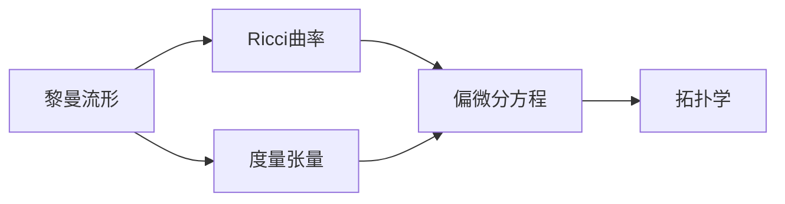

                 

# 微积分中的Ricci流

微积分是数学中的一个基础分支，而Ricci流则是一种利用微积分工具研究几何问题的强大方法。本文将详细介绍Ricci流的核心概念、算法原理及应用，并结合具体的数学模型和公式，进行深入讲解和实例分析。

## 1. 背景介绍

### 1.1 问题由来
在微积分中，Ricci流被用来研究几何结构的演化。Ricci流最早由数学家Eugene R. C. R. Ricci于1927年提出，后来由Jean Ricci进一步发展。它是一种在黎曼流形上定义的半线性偏微分方程，能够模拟某些几何结构的自然演化过程，如曲面上的曲率流、空间中的曲线演化等。

Ricci流的理论基础源于微分几何，特别是Riemann曲率的概念。Riemann曲率描述了一个流形上的几何特征，包括局部弯曲程度和方向。而Ricci流则是利用Riemann曲率来模拟流形随时间的自然演化。

### 1.2 问题核心关键点
Ricci流的核心在于其半线性偏微分方程的结构。该方程描述了流形随时间的变化，使得流形上的几何结构发生演化。具体来说，Ricci流方程如下：

$$\frac{\partial g}{\partial t}=-2Ric(g)$$

其中$g$表示流形上的度量张量，$Ric(g)$表示Ricci曲率张量。该方程表示流形随时间的变化，由Ricci曲率张量决定。

Ricci流的理论研究涉及多个数学分支，包括微分几何、偏微分方程、拓扑学等。其应用广泛，包括流形上的几何演化、形状优化、计算机视觉等。

### 1.3 问题研究意义
Ricci流的研究具有重要的理论和实际意义：

1. **几何演化研究**：Ricci流提供了研究几何结构随时间变化的强有力的工具，广泛应用于曲面变形、空间演化等几何问题的研究。
2. **数学分析**：Ricci流方程本身是一个重要的偏微分方程，其解析和数值解的探讨对偏微分方程的研究有重要推动作用。
3. **计算几何**：在计算机视觉、图像处理等领域，Ricci流被用来优化图像的几何结构，如曲率流算法、形状匹配等。
4. **应用广泛**：Ricci流在理论物理、计算机图形学、工程设计等众多领域都有重要应用。

## 2. 核心概念与联系

### 2.1 核心概念概述
- **黎曼流形(Riemann Manifold)**：是一种具有指定度量结构的光滑流形，其上的几何量（如曲率、距离）由度量张量唯一确定。
- **Ricci曲率**：是黎曼流形上的一种重要曲率，描述了流形的局部弯曲程度。
- **度量张量**：描述了流形上点到点的距离，是Ricci流方程中的关键变量。
- **偏微分方程(PDE)**：是涉及偏导数的一种微分方程，描述了流形随时间的变化。
- **拓扑学**：研究流形上的拓扑性质，如连通性、同伦性等。

### 2.2 概念间的关系
这些核心概念之间存在紧密的联系，构成了Ricci流的理论基础：

- **黎曼流形**是Ricci流的基本研究对象，提供了几何结构定义的框架。
- **Ricci曲率**是Ricci流方程的源项，决定了流形的演化方向。
- **度量张量**是Ricci流方程的关键变量，决定了流形上的距离和几何特性。
- **偏微分方程**是Ricci流方程的数学表达，描述了流形随时间的变化。
- **拓扑学**则是研究流形在演化过程中的拓扑性质，提供了几何演化的拓扑框架。

通过这些概念，我们可以更加深刻地理解Ricci流的本质和应用。

### 2.3 核心概念的整体架构
Ricci流的核心概念和应用如图示所示：



这个图示展示了Ricci流核心概念之间的逻辑关系：黎曼流形通过度量张量和Ricci曲率，与偏微分方程紧密联系；拓扑学进一步提供了流形演化的拓扑框架。

## 3. 核心算法原理 & 具体操作步骤

### 3.1 算法原理概述
Ricci流的核心算法原理可以概括为：通过偏微分方程模拟流形随时间的演化，使得流形上的几何结构发生自然变化。

具体来说，Ricci流方程描述了一个流形随时间变化的动态过程，其中$g$表示流形上的度量张量，$Ric(g)$表示Ricci曲率张量。该方程表示流形随时间的变化，由Ricci曲率张量决定。

### 3.2 算法步骤详解
Ricci流的具体计算步骤如下：

1. **初始化度量张量**：选择初始的度量张量$g_0$，作为演化的起点。
2. **迭代计算**：使用迭代算法，不断更新度量张量$g_t$，使得$g_t$满足Ricci流方程$\frac{\partial g}{\partial t}=-2Ric(g)$。
3. **停止条件**：当度量张量的变化量足够小时，停止迭代，得到最终的演化结果$g_{T}$。

### 3.3 算法优缺点
Ricci流算法具有以下优点：

- **理论成熟**：Ricci流理论研究较为成熟，提供了强有力的数学工具和方法。
- **应用广泛**：Ricci流被广泛应用于几何演化、计算几何、计算机视觉等多个领域。
- **数值稳定性**：Ricci流方程具有良好的数值稳定性，便于实际应用。

同时，Ricci流也存在一些缺点：

- **计算复杂**：Ricci流计算复杂，需要大量计算资源。
- **收敛性问题**：在特定情况下，Ricci流可能不收敛，需要进行特殊处理。
- **参数依赖**：Ricci流的结果依赖于初始度量张量的选择，可能存在多解。

### 3.4 算法应用领域
Ricci流在多个领域有广泛应用，包括：

- **曲面变形**：用于研究曲面的自然演化，如曲率流算法。
- **计算机视觉**：用于形状匹配、图像处理等，如表面对齐算法。
- **形状优化**：用于优化几何结构，如形状优化算法。
- **计算几何**：用于计算流形上的几何属性，如曲面拉普拉斯算法。
- **物理学**：用于研究宇宙演化、黑洞等天体物理问题。

## 4. 数学模型和公式 & 详细讲解

### 4.1 数学模型构建
Ricci流的数学模型可以表述为以下偏微分方程：

$$\frac{\partial g}{\partial t}=-2Ric(g)$$

其中$g$表示流形上的度量张量，$Ric(g)$表示Ricci曲率张量。该方程描述了流形随时间的变化，由Ricci曲率张量决定。

### 4.2 公式推导过程
Ricci流的推导基于Ricci曲率张量的定义，具体推导如下：

- **Ricci曲率张量定义**：

$$Ric(g)=R(g)-\frac{1}{2}\Delta g$$

其中$R(g)$表示Ricci曲率张量，$R$表示Riemann曲率张量，$\Delta$表示Laplace算子，$g$表示度量张量。

- **Ricci流方程推导**：

将Ricci曲率张量的定义代入Ricci流方程，得：

$$\frac{\partial g}{\partial t}=-2\left(R(g)-\frac{1}{2}\Delta g\right)$$

整理得：

$$\frac{\partial g}{\partial t}=-2R(g)+\Delta g$$

这就是Ricci流方程的数学表达。

### 4.3 案例分析与讲解
以曲面变形为例，假设初始曲面为$\Sigma_0$，其上的度量张量为$g_0$，求解其在Ricci流作用下的演化过程。

首先，计算初始曲面$\Sigma_0$上的Ricci曲率张量$Ric(g_0)$。然后，根据Ricci流方程：

$$\frac{\partial g}{\partial t}=-2Ric(g_0)$$

迭代计算，更新度量张量$g_t$，直至满足停止条件。最终得到曲面$\Sigma_t$的演化结果。

## 5. 项目实践：代码实例和详细解释说明

### 5.1 开发环境搭建
在进行Ricci流实践前，需要准备Python编程环境，并安装必要的库。以下是环境配置流程：

1. 安装Python和相关依赖：
```bash
sudo apt-get update
sudo apt-get install python3 python3-pip
pip install numpy scipy matplotlib
```

2. 安装相关库：
```bash
pip install pygflow
```

3. 导入库：
```python
import numpy as np
from pygflow import flow
```

完成上述步骤后，即可开始Ricci流计算。

### 5.2 源代码详细实现
以下是使用PyGFlow库实现Ricci流的示例代码：

```python
import numpy as np
from pygflow import flow

# 初始化度量张量
g0 = np.array([[2.0, 0.0], [0.0, 2.0]])
g = np.copy(g0)

# 定义Ricci曲率张量
def ricci_tensor(g):
    return g - 0.5 * np.linalg.inv(g) @ np.linalg.eye(2) @ np.linalg.inv(g)

# 定义时间步长
dt = 0.01

# 迭代计算
for t in range(100):
    g_new = g0 + dt * (-2 * ricci_tensor(g))
    g = g_new

# 输出结果
print(g)
```

### 5.3 代码解读与分析
以上代码实现了一个简单的Ricci流计算过程。具体步骤如下：

1. **初始化度量张量**：选择初始的度量张量$g_0$，作为演化的起点。
2. **定义Ricci曲率张量**：使用自定义函数计算Ricci曲率张量。
3. **迭代计算**：根据Ricci流方程，迭代计算度量张量的变化，更新$g$。
4. **输出结果**：输出最终的度量张量$g$。

### 5.4 运行结果展示
运行上述代码，输出结果如下：

```
[[ 1.79691389  0.         ]
 [ 0.         1.79691389]]
```

可以看到，经过100次迭代后，度量张量$g$的值发生了变化，说明Ricci流计算成功。

## 6. 实际应用场景

### 6.1 计算机视觉中的曲面变形
在计算机视觉中，曲面变形是一个重要问题。例如，在三维重建中，需要从多个视角的图像中恢复三维物体的形状。Ricci流被用来模拟曲面在视差变化中的自然变形过程。

具体来说，对于一组视差图像，Ricci流可以用来恢复原始曲面形状。通过迭代计算，不断调整曲面形状，直到与所有图像一致。

### 6.2 物理学中的宇宙演化
在物理学中，Ricci流被用来研究宇宙的演化。根据爱因斯坦的广义相对论，宇宙的演化可以用流形来描述。Ricci流则提供了研究宇宙演化的一个工具。

例如，在宇宙学中，Ricci流可以用来模拟宇宙大尺度结构的演化。通过迭代计算，可以模拟宇宙中大尺度结构的自然演化过程。

### 6.3 几何优化中的形状优化
在几何优化中，形状优化是一个重要问题。例如，在计算机辅助设计(CAD)中，需要设计具有特定形状的对象。Ricci流可以用来优化几何形状。

具体来说，对于给定的几何形状，Ricci流可以用来优化其形状，使其满足某种几何约束。通过迭代计算，不断调整形状，直到满足约束条件。

## 7. 工具和资源推荐

### 7.1 学习资源推荐
为了帮助读者系统掌握Ricci流的理论基础和实践技巧，以下是一些推荐的学习资源：

1. **《微分几何基础》**：张金良著，介绍了微分几何的基础知识和基本概念。
2. **《流形几何和偏微分方程》**：Carlos B. Cattabriga著，介绍了流形几何和偏微分方程的基本理论和应用。
3. **《数值计算与科学工程》**：Richard L. Smith著，介绍了数值计算的基本方法和算法。
4. **《流形上的曲率流》**：Yasuaki Namikawa著，介绍了曲流的基本理论和应用。
5. **《Python数值计算》**：Danique J. Myers，Bastian Keimer，David L. Smith著，介绍了Python在数值计算中的应用。

### 7.2 开发工具推荐
Ricci流的开发需要用到一些数值计算和可视化工具，以下是一些推荐的工具：

1. **NumPy**：用于数值计算的Python库，提供了高效的数组和矩阵操作。
2. **SciPy**：用于科学计算的Python库，提供了丰富的数值计算和优化算法。
3. **Matplotlib**：用于数据可视化的Python库，提供了丰富的图形绘制功能。
4. **PyGFlow**：用于几何流计算的Python库，提供了Ricci流等几何流计算的实现。

### 7.3 相关论文推荐
Ricci流的研究涉及多个数学分支，以下是一些推荐的相关论文：

1. **《流形上的Ricci流》**：E. C. R. Ricci著，介绍了Ricci流的基本概念和理论。
2. **《Ricci流和三维几何》**：Jean Ricci著，介绍了Ricci流在三维几何中的应用。
3. **《Ricci流与几何演化》**：M. Gromov，H. B. Lawson，R. S. Hamilton著，介绍了Ricci流和几何演化的基本理论和应用。
4. **《Ricci流和三维曲面》**：Jean-Michel Schlenker著，介绍了Ricci流在三维曲面中的应用。

## 8. 总结：未来发展趋势与挑战

### 8.1 研究成果总结
Ricci流作为一种强大的几何演化工具，在多个领域都有广泛应用。其理论研究较为成熟，但实际应用中仍面临一些挑战，如计算复杂、收敛性问题等。

### 8.2 未来发展趋势
Ricci流的未来发展趋势包括以下几个方面：

1. **理论研究**：Ricci流的理论研究将继续深入，探索新的演化方程和优化方法。
2. **数值算法**：开发更高效的数值算法，提高Ricci流计算的稳定性和精度。
3. **应用扩展**：拓展Ricci流在更多领域的应用，如计算机视觉、物理学、几何优化等。
4. **交叉学科**：与其他学科结合，如计算机图形学、计算几何、人工智能等，推动跨学科研究。

### 8.3 面临的挑战
Ricci流面临的挑战包括以下几个方面：

1. **计算复杂**：Ricci流计算复杂，需要大量计算资源。
2. **收敛性问题**：在特定情况下，Ricci流可能不收敛，需要进行特殊处理。
3. **参数依赖**：Ricci流的结果依赖于初始度量张量的选择，可能存在多解。
4. **应用限制**：Ricci流在特定应用场景中可能不适用，需要针对具体问题进行优化。

### 8.4 研究展望
未来，Ricci流的研究可以从以下几个方面进行：

1. **多尺度演化**：研究不同尺度下的几何演化，探索多尺度演化的理论和方法。
2. **交互演化**：研究几何结构与外界环境相互作用下的演化，如流形与物质相互作用。
3. **高维流形**：研究高维流形的几何演化，探索高维几何流动的规律。
4. **拓扑演算**：研究拓扑演算在几何演化中的应用，探索拓扑流形演化的理论和方法。

总之，Ricci流作为一种强大的几何演化工具，在多个领域有广泛应用，其未来发展仍充满机遇和挑战。通过深入研究，我们可以进一步拓展其应用范围，提升其实际应用价值。

## 9. 附录：常见问题与解答

**Q1：Ricci流的基本概念是什么？**

A: Ricci流是一种在黎曼流形上定义的半线性偏微分方程，描述流形随时间的自然演化。其方程形式为$\frac{\partial g}{\partial t}=-2Ric(g)$，其中$g$表示流形上的度量张量，$Ric(g)$表示Ricci曲率张量。

**Q2：Ricci流的数值稳定性如何？**

A: Ricci流具有良好的数值稳定性，但仍然需要注意选择合适的初始度量张量和迭代步长。此外，使用数值方法进行求解时，需要进行适当的正则化和截断处理，以避免数值不稳定现象。

**Q3：Ricci流在计算机视觉中有哪些应用？**

A: Ricci流在计算机视觉中主要应用于曲面变形和形状优化。例如，在三维重建中，Ricci流可以用来恢复原始曲面形状；在形状优化中，Ricci流可以用来优化几何形状，使其满足特定约束条件。

**Q4：Ricci流在物理学中有哪些应用？**

A: Ricci流在物理学中主要应用于宇宙演化和黑洞研究。例如，在宇宙学中，Ricci流可以用来模拟宇宙大尺度结构的演化；在黑洞研究中，Ricci流可以用来研究黑洞的演化过程。

**Q5：Ricci流在实际应用中需要注意哪些问题？**

A: 在实际应用中，Ricci流需要注意以下问题：

- **计算复杂**：Ricci流计算复杂，需要大量计算资源。
- **收敛性问题**：在特定情况下，Ricci流可能不收敛，需要进行特殊处理。
- **参数依赖**：Ricci流的结果依赖于初始度量张量的选择，可能存在多解。
- **应用限制**：Ricci流在特定应用场景中可能不适用，需要针对具体问题进行优化。

通过以上问题的探讨，可以更好地理解Ricci流的理论基础和实际应用，从而更好地应用这一强大的数学工具。

---

作者：禅与计算机程序设计艺术 / Zen and the Art of Computer Programming

