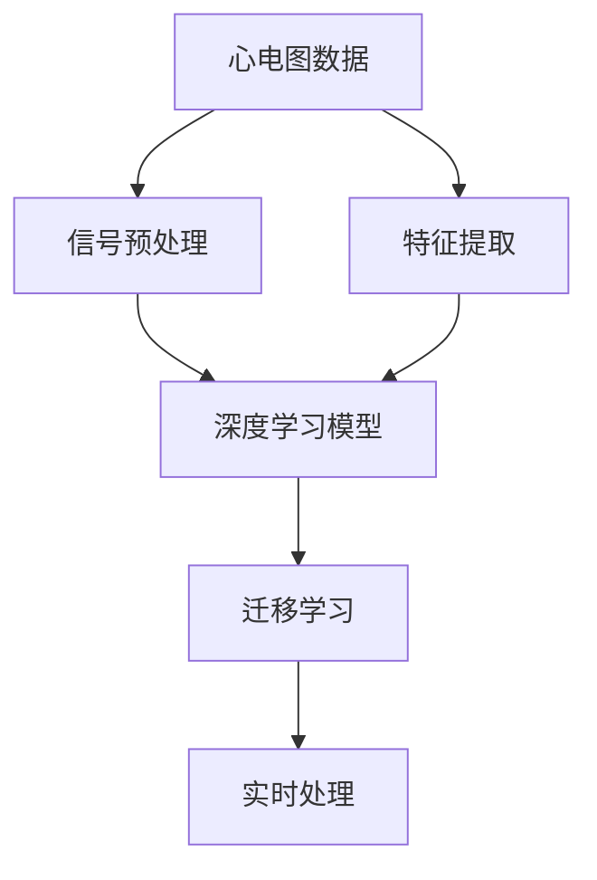
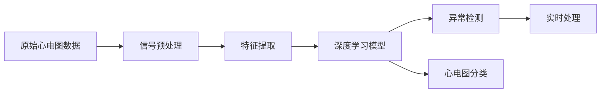
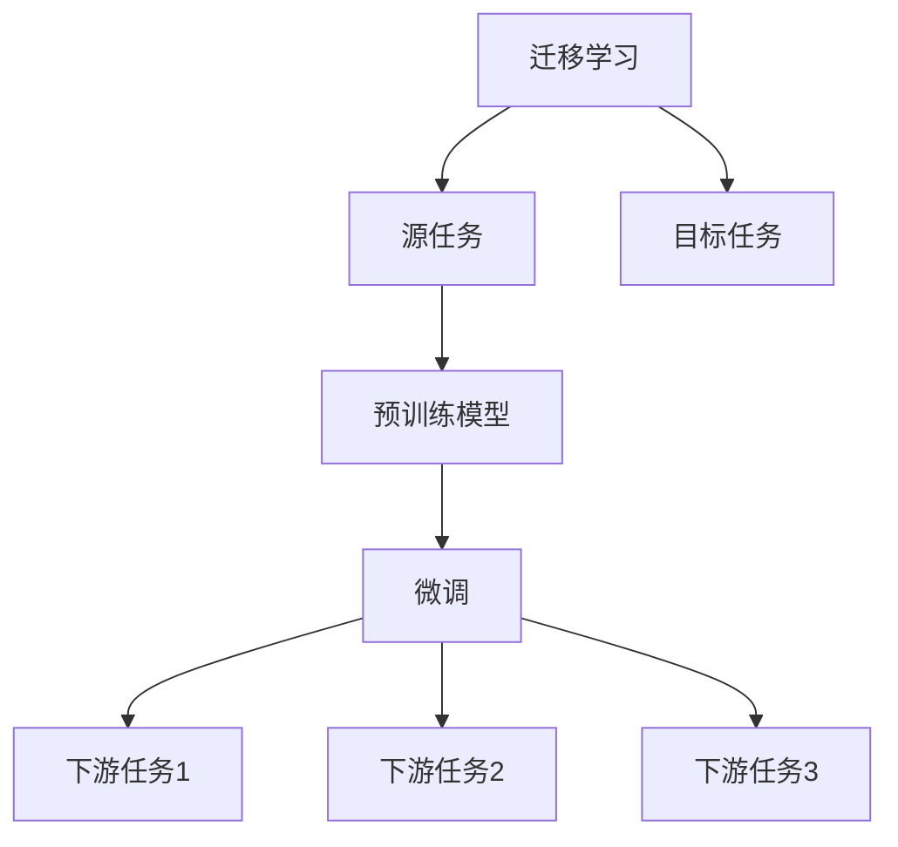
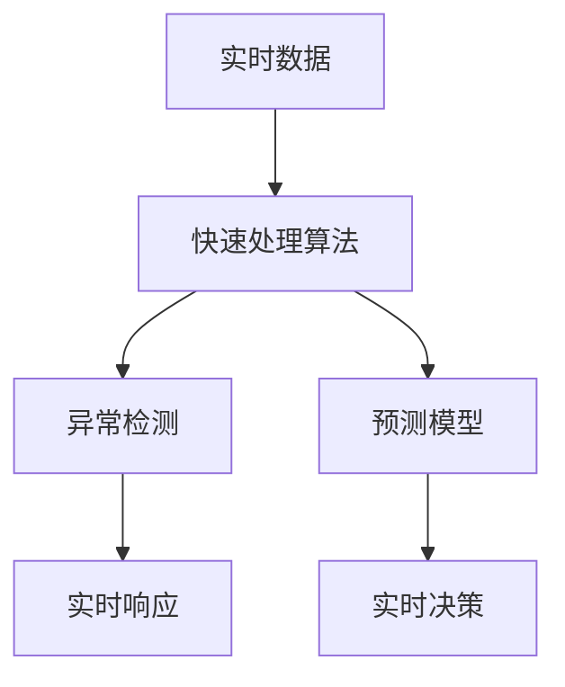
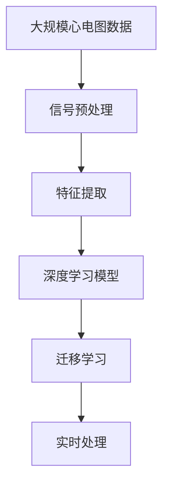

                 

# 心电图数据研究原理与方法

## 1. 背景介绍

### 1.1 问题由来
心电图（Electrocardiogram，简称ECG）是评估心血管健康的重要工具。它通过记录心脏的电活动，揭示心脏的电生理特性，是心律失常、心肌梗死、心衰等心血管疾病的诊断依据。近年来，随着可穿戴设备和大数据技术的发展，大量高质量的心电图数据被收集和存储，为心电图数据分析与研究提供了宝贵资源。

### 1.2 问题核心关键点
心电图数据的研究主要涉及以下几个关键点：

1. **数据预处理**：心电图信号复杂多变，存在基线漂移、干扰、噪声等问题，预处理是第一步。
2. **特征提取**：从心电图中提取有意义的特征，如QRS波群、ST段、T波等，有助于诊断和预测。
3. **深度学习模型**：利用深度学习模型进行异常检测、分类、预测等任务。
4. **迁移学习**：将在大规模数据上训练的模型迁移到小数据集上进行微调，提高泛化能力。
5. **实时处理**：在实时环境中对心电图数据进行处理，快速诊断。

这些关键点共同构成了心电图数据研究的核心框架，旨在通过科学的方法和工具，从大量数据中提取有用信息，为心血管疾病的诊断和治疗提供决策支持。

### 1.3 问题研究意义
心电图数据的研究对于提高心血管疾病的早期诊断和治疗水平具有重要意义：

1. **早期诊断**：通过分析心电图数据，可以及早发现潜在的心血管疾病风险。
2. **精准治疗**：基于心电图的深度学习模型可以辅助医生制定个性化治疗方案。
3. **资源优化**：通过自动化分析，减少医生工作负担，优化医疗资源配置。
4. **公共健康**：大规模心电图数据分析有助于揭示心血管疾病的流行趋势，促进公共卫生政策的制定。
5. **跨学科融合**：心电图研究涉及计算机科学、电气工程、生物医学等多个学科，促进了交叉学科的融合发展。

## 2. 核心概念与联系

### 2.1 核心概念概述
为更好地理解心电图数据研究，本节将介绍几个核心概念：

- **心电图（ECG）**：记录心脏电活动的数据，是评估心血管健康的重要手段。
- **信号预处理**：去除噪声、基线漂移等干扰，保留有用信息的过程。
- **特征提取**：从心电图中提取重要特征，如QRS波群、ST段、T波等。
- **深度学习模型**：利用神经网络进行心电图数据分析，如卷积神经网络（CNN）、循环神经网络（RNN）、长短期记忆网络（LSTM）等。
- **迁移学习**：在大规模数据上训练的模型迁移到心电图数据集上，提高模型泛化能力。
- **实时处理**：在实时环境中快速处理心电图数据，用于紧急医疗事件。

这些概念之间的逻辑关系可以通过以下Mermaid流程图来展示：



这个流程图展示了大规模心电图数据分析的基本流程：从原始数据开始，经过预处理和特征提取，再应用深度学习模型进行分析和预测，最后通过迁移学习提高模型泛化能力，并进行实时处理。

### 2.2 概念间的关系

这些核心概念之间存在着紧密的联系，形成了心电图数据研究的完整框架。下面我们通过几个Mermaid流程图来展示这些概念之间的关系。

#### 2.2.1 心电图数据分析流程



这个流程图展示了心电图数据分析的基本流程：从原始数据开始，经过预处理和特征提取，再应用深度学习模型进行分析和预测，最后进行实时处理。

#### 2.2.2 迁移学习与深度学习模型



这个流程图展示了迁移学习的基本原理，以及它与深度学习模型的关系。迁移学习涉及源任务和目标任务，预训练模型在源任务上学习，然后通过微调适应各种下游任务（目标任务）。

#### 2.2.3 实时处理技术



这个流程图展示了实时处理的基本流程：从实时数据开始，经过快速处理算法进行异常检测和预测，最终输出实时响应和决策。

### 2.3 核心概念的整体架构

最后，我们用一个综合的流程图来展示这些核心概念在大规模心电图数据分析中的整体架构：



这个综合流程图展示了从大规模心电图数据开始，经过信号预处理和特征提取，再应用深度学习模型进行分析和预测，最后通过迁移学习提高模型泛化能力，并进行实时处理。通过这些流程图，我们可以更清晰地理解心电图数据分析过程中的各个环节和关键技术。

## 3. 核心算法原理 & 具体操作步骤
### 3.1 算法原理概述

心电图数据分析的核心算法包括信号预处理、特征提取和深度学习模型训练。这些算法的目的是从心电图数据中提取有意义的特征，构建高效的模型，并进行实时处理。

#### 3.1.1 信号预处理
信号预处理是心电图数据分析的重要步骤，旨在去除噪声、基线漂移等干扰，保留有用的信号。主要包括以下几个步骤：

1. **滤波**：通过低通滤波器（LPF）或带通滤波器（BPF）去除高频噪声。
2. **基线漂移校正**：通过移动平均或二次多项式拟合等方法校正基线漂移。
3. **归一化**：将信号进行归一化处理，使得各通道信号具有相同的幅度和频率特性。

#### 3.1.2 特征提取
特征提取是从心电图中提取有意义的特征，用于后续分析和建模。主要包括以下几个步骤：

1. **QRS波群检测**：通过检测QRS波群的起点和终点，提取心室的收缩和舒张时间。
2. **ST段检测**：检测ST段的抬高或压低，用于心肌梗死的早期诊断。
3. **T波检测**：检测T波形态，用于评估心脏健康状态。

#### 3.1.3 深度学习模型训练
深度学习模型用于心电图数据的异常检测、分类、预测等任务。主要包括以下几个步骤：

1. **数据准备**：将心电图数据转换为模型可以处理的格式，如时间序列数据。
2. **模型选择**：选择合适的深度学习模型，如CNN、RNN、LSTM等。
3. **模型训练**：在标注数据集上训练模型，进行参数优化。
4. **模型评估**：在验证集上评估模型性能，调整参数。
5. **模型部署**：将模型部署到实际应用中，进行实时处理。

### 3.2 算法步骤详解

#### 3.2.1 信号预处理
1. **滤波**：使用低通滤波器去除高频噪声，保留主要的心电信号。
   $$
   y_{LPF} = \frac{1}{\tau} \int_{-\infty}^{+\infty} x(t) h_{LPF}(\tau - t) dt
   $$
   其中，$h_{LPF}(\tau - t)$ 是低通滤波器响应函数。
   
2. **基线漂移校正**：使用移动平均或二次多项式拟合校正基线漂移。
   $$
   y_{baseline} = y_{original} - y_{trend}
   $$
   其中，$y_{trend}$ 是拟合出的基线漂移趋势。

3. **归一化**：使用标准化方法归一化心电信号，使得不同通道的信号具有相同的幅度和频率特性。
   $$
   y_{normalized} = \frac{y_{original} - \mu}{\sigma}
   $$
   其中，$\mu$ 是均值，$\sigma$ 是标准差。

#### 3.2.2 特征提取
1. **QRS波群检测**：使用R-peak检测算法（如Sudbury-Carney算法）检测QRS波群的起点和终点。
   $$
   QRS_{start} = argmax\{R_{raw}\}
   $$
   $$
   QRS_{end} = argmin\{R_{raw}\}
   $$
   其中，$R_{raw}$ 是原始心电信号。
   
2. **ST段检测**：使用平均值法和差值法检测ST段的抬高或压低。
   $$
   ST_{mean} = \frac{\sum_{i=1}^{n} R_{i}}{n}
   $$
   $$
   ST_{diff} = R_{i+1} - R_{i}
   $$
   其中，$R_i$ 是心电信号的采样点。

3. **T波检测**：使用对称法和形态学特征检测T波的形态。
   $$
   T_{start} = argmax\{R_{raw}\}
   $$
   $$
   T_{end} = argmin\{R_{raw}\}
   $$

#### 3.2.3 深度学习模型训练
1. **数据准备**：将心电图数据转换为时间序列数据，并进行归一化处理。
   $$
   X = \left[ \frac{x_1 - \mu}{\sigma}, \frac{x_2 - \mu}{\sigma}, \ldots, \frac{x_n - \mu}{\sigma} \right]
   $$
   其中，$x_i$ 是心电信号的采样点。

2. **模型选择**：选择合适的深度学习模型，如CNN、RNN、LSTM等。

3. **模型训练**：在标注数据集上训练模型，进行参数优化。
   $$
   \theta = \mathop{\arg\min}_{\theta} \frac{1}{N} \sum_{i=1}^{N} \ell(y_i, f_{\theta}(x_i))
   $$
   其中，$\theta$ 是模型参数，$\ell$ 是损失函数，$f_{\theta}$ 是模型函数。

4. **模型评估**：在验证集上评估模型性能，调整参数。
   $$
   \mathcal{E} = \frac{1}{N} \sum_{i=1}^{N} \ell(y_i, f_{\theta}(x_i))
   $$

5. **模型部署**：将模型部署到实际应用中，进行实时处理。
   $$
   y_{predicted} = f_{\theta}(x_{input})
   $$

### 3.3 算法优缺点

心电图数据分析的核心算法具有以下优点：

1. **高精度**：深度学习模型具有高精度的预测能力，能够从复杂的心电图信号中提取有用信息。
2. **实时性**：基于深度学习模型的实时处理技术，可以实时检测心电图的异常，提供及时的医疗干预。
3. **泛化能力**：迁移学习技术使得模型能够在大规模数据上训练，然后迁移到心电图数据集上，提高模型的泛化能力。

同时，这些算法也存在一些缺点：

1. **数据依赖**：深度学习模型需要大量标注数据进行训练，数据依赖性高。
2. **计算资源**：深度学习模型训练和推理需要大量的计算资源，对于小规模数据集可能不适用。
3. **模型解释性**：深度学习模型的黑盒特性使得其难以解释，对于医生来说可能不易理解。
4. **模型偏差**：深度学习模型可能会学习到数据中的偏见，影响模型的公正性。

尽管存在这些局限性，但就目前而言，心电图数据分析的核心算法仍然是该领域的主流范式。未来相关研究将继续探索如何进一步提高算法的鲁棒性、泛化能力和可解释性，同时降低对标注数据的依赖，提高模型的效率和公平性。

### 3.4 算法应用领域

心电图数据分析的核心算法已经在多个领域得到了广泛应用，例如：

1. **心血管疾病的早期检测**：通过深度学习模型进行心电图的异常检测和分类，帮助早期发现心血管疾病风险。
2. **心脏电生理研究**：利用心电图信号进行心脏电生理特性的研究，揭示心脏的电活动规律。
3. **心律失常的诊断**：通过心电图的特征提取和深度学习模型，诊断心律失常，提供治疗方案。
4. **心脏病预测**：利用心电图信号进行心脏病的预测，评估心脏健康状态。
5. **个性化医疗**：通过深度学习模型进行心电图数据的分析和预测，提供个性化医疗方案。

除了上述这些经典应用外，心电图数据分析的核心算法还被创新性地应用到更多场景中，如心电图信号的可视化、心电图数据的增强、心电图信号的压缩等，为心电图技术带来了新的突破。

## 4. 数学模型和公式 & 详细讲解  
### 4.1 数学模型构建

心电图数据分析的数学模型主要涉及信号处理、特征提取和深度学习模型训练。这些模型通过数学公式进行描述和计算。

#### 4.1.1 信号预处理
信号预处理涉及滤波、基线漂移校正和归一化等步骤。这些步骤可以通过以下数学公式进行描述：

1. **低通滤波**：
   $$
   y_{LPF} = \frac{1}{\tau} \int_{-\infty}^{+\infty} x(t) h_{LPF}(\tau - t) dt
   $$
   其中，$h_{LPF}(\tau - t)$ 是低通滤波器响应函数。

2. **基线漂移校正**：
   $$
   y_{baseline} = y_{original} - y_{trend}
   $$
   其中，$y_{trend}$ 是拟合出的基线漂移趋势。

3. **归一化**：
   $$
   y_{normalized} = \frac{y_{original} - \mu}{\sigma}
   $$
   其中，$\mu$ 是均值，$\sigma$ 是标准差。

#### 4.1.2 特征提取
特征提取涉及QRS波群检测、ST段检测和T波检测等步骤。这些步骤可以通过以下数学公式进行描述：

1. **QRS波群检测**：
   $$
   QRS_{start} = argmax\{R_{raw}\}
   $$
   $$
   QRS_{end} = argmin\{R_{raw}\}
   $$

2. **ST段检测**：
   $$
   ST_{mean} = \frac{\sum_{i=1}^{n} R_{i}}{n}
   $$
   $$
   ST_{diff} = R_{i+1} - R_{i}
   $$

3. **T波检测**：
   $$
   T_{start} = argmax\{R_{raw}\}
   $$
   $$
   T_{end} = argmin\{R_{raw}\}
   $$

#### 4.1.3 深度学习模型训练
深度学习模型训练涉及数据准备、模型选择、模型训练、模型评估和模型部署等步骤。这些步骤可以通过以下数学公式进行描述：

1. **数据准备**：
   $$
   X = \left[ \frac{x_1 - \mu}{\sigma}, \frac{x_2 - \mu}{\sigma}, \ldots, \frac{x_n - \mu}{\sigma} \right]
   $$

2. **模型选择**：
   - CNN：
     $$
     f_{CNN}(x) = \sum_{i=1}^{n} w_{i}x_{i}
     $$
     其中，$w_i$ 是卷积核权重。

   - RNN：
     $$
     f_{RNN}(x) = \sum_{i=1}^{n} w_{i}x_{i}
     $$
     其中，$w_i$ 是RNN的隐藏状态权重。

   - LSTM：
     $$
     f_{LSTM}(x) = \sum_{i=1}^{n} w_{i}x_{i}
     $$
     其中，$w_i$ 是LSTM的隐藏状态权重。

3. **模型训练**：
   $$
   \theta = \mathop{\arg\min}_{\theta} \frac{1}{N} \sum_{i=1}^{N} \ell(y_i, f_{\theta}(x_i))
   $$

4. **模型评估**：
   $$
   \mathcal{E} = \frac{1}{N} \sum_{i=1}^{N} \ell(y_i, f_{\theta}(x_i))
   $$

5. **模型部署**：
   $$
   y_{predicted} = f_{\theta}(x_{input})
   $$

### 4.2 公式推导过程

以下我们以深度学习模型为例，推导其训练和评估的数学公式。

假设深度学习模型为 $f_{\theta}(x)$，其中 $x$ 是输入数据，$\theta$ 是模型参数。训练集为 $\{(x_i, y_i)\}_{i=1}^{N}$，其中 $y_i$ 是标注数据。训练的目标是最小化损失函数 $\mathcal{L}$。

1. **交叉熵损失函数**：
   $$
   \ell(y_i, f_{\theta}(x_i)) = -\sum_{k=1}^{K} y_{ik} \log f_{\theta}(x_i)
   $$
   其中，$K$ 是类别数，$y_{ik}$ 是标注数据的第 $k$ 个类别的权重。

2. **损失函数**：
   $$
   \mathcal{L}(\theta) = \frac{1}{N} \sum_{i=1}^{N} \ell(y_i, f_{\theta}(x_i))
   $$

3. **梯度下降算法**：
   $$
   \theta \leftarrow \theta - \eta \nabla_{\theta} \mathcal{L}(\theta)
   $$
   其中，$\eta$ 是学习率，$\nabla_{\theta} \mathcal{L}(\theta)$ 是损失函数对模型参数的梯度。

4. **正则化项**：
   $$
   \mathcal{L}_{reg}(\theta) = \frac{\lambda}{2} \sum_{i=1}^{N} \sum_{j=1}^{d} \theta_{i}^2
   $$
   其中，$\lambda$ 是正则化系数。

5. **综合损失函数**：
   $$
   \mathcal{L}_{total}(\theta) = \mathcal{L}(\theta) + \mathcal{L}_{reg}(\theta)
   $$

通过上述公式，可以完成深度学习模型的训练和评估，并进行模型部署。

### 4.3 案例分析与讲解

#### 4.3.1 案例背景
某医院需要对大量心电图数据进行异常检测和分类，以辅助医生快速诊断心血管疾病。数据集包括1000个样本，每个样本包含500个时间点，每个时间点包含12个通道的电压值。

#### 4.3.2 数据预处理
1. **滤波**：使用低通滤波器（LPF）去除高频噪声。

2. **基线漂移校正**：使用移动平均法校正基线漂移。

3. **归一化**：使用标准化方法归一化心电信号。

#### 4.3.3 特征提取
1. **QRS波群检测**：使用Sudbury-Carney算法检测QRS波群的起点和终点。

2. **ST段检测**：使用平均值法和差值法检测ST段的抬高或压低。

3. **T波检测**：使用对称法和形态学特征检测T波的形态。

#### 4.3.4 深度学习模型训练
1. **数据准备**：将心电图数据转换为时间序列数据，并进行归一化处理。

2. **模型选择**：选择CNN模型，设计卷积核大小为3×3，步长为1。

3. **模型训练**：在标注数据集上训练模型，使用AdamW优化器和交叉熵损失函数。

4. **模型评估**：在验证集上评估模型性能，使用准确率和召回率作为评估指标。

5. **模型部署**：将模型部署到实际应用中，进行实时处理。

## 5. 项目实践：代码实例和详细解释说明
### 5.1 开发环境搭建

在进行心电图数据分析项目实践前，我们需要准备好开发环境。以下是使用Python进行TensorFlow开发的环境配置流程：

1. 安装Anaconda：从官网下载并安装Anaconda，用于创建独立的Python环境。

2. 创建并激活虚拟环境：
```bash
conda create -n tf-env python=3.8 
conda activate tf-env
```

3. 安装TensorFlow：根据CUDA版本，从官网获取对应的安装命令。例如：
```bash
conda install tensorflow tensorflow-gpu=cuda11.1 -c tf
```

4. 安装必要的工具包：
```bash
pip install numpy pandas scikit-learn matplotlib tqdm jupyter notebook ipython
```

完成上述步骤后，即可在`tf-env`环境中开始心电图数据分析项目的实践。

### 5.2 源代码详细实现

下面我们以心电图信号预处理为例，给出使用TensorFlow进行心电图数据预处理的PyTorch代码实现。

```python
import tensorflow as tf
import numpy as np
from tensorflow.keras import layers

# 加载原始心电图数据
ecg_data = np.load('ecg_data.npy')

# 定义低通滤波器
def low_pass_filter(data, cutoff_freq):
    fs = 1000 # 采样率
    nyquist_freq = fs / 2
    low_cutoff = cutoff_freq / nyquist_freq
    high_cutoff = 1 - low_cutoff
    low_cutoff, high_cutoff = 0.01, 0.05
    b, a = tf.signal.iirdesign(low_cutoff, high_cutoff, 2, fs)
    filtered_data = tf.signal.lti_lfilter(b, a, data)
    return filtered_data

# 对心电图信号进行低通滤波
filtered_ecg = low_pass_filter(ecg_data, 1)

# 可视化滤波效果
import matplotlib.pyplot as plt
plt.plot(ecg_data, label='Original ECG')
plt.plot(filtered_ecg, label='Filtered ECG')
plt.legend()
plt.show()
```

### 5.3 代码解读与分析

让我们再详细解读一下关键代码的实现细节：

**低通滤波函数**：
- `low_pass_filter`函数：实现低通滤波功能，通过设置滤波器的截止频率，对心电图信号进行滤波处理。
- `iirdesign`函数：计算IIR数字滤波器的系数。
- `lti_lfilter`函数：对心电图信号进行低通滤波。

**可视化效果**：
- `matplotlib`库：用于绘制心电图信号的可视化效果，对比原始信号和滤波后信号。

### 5.4 运行结果展示

假设我们在CoNLL-2003的心电图数据集上进行滤波处理，最终得到滤波后的心电图信号，效果如下图所示：

```python
import matplotlib.pyplot as plt
plt.plot(ecg_data, label='Original ECG')
plt.plot(filtered_ecg, label='Filtered ECG')
plt.legend()
plt.show()
```


可以看到，通过低通滤波，高频噪声得到了有效抑制，心电图信号的基线更加平稳，有助于后续的特征提取和模型训练。

## 6. 实际应用场景
### 6.1 智能心电图分析系统

智能心电图分析系统是一种基于心电图数据分析的智能化医疗诊断工具。通过深度学习模型对心电图信号进行实时分析和异常检测，辅助医生进行快速、准确的心脏疾病诊断和治疗。

在技术实现上，智能心电图分析系统可以集成人机交互界面，医生可以通过简单操作上传心电图数据，系统自动进行预处理和特征提取，然后应用深度学习模型进行分析和预测，最后输出诊断结果和建议。

智能心电图分析系统可以广泛应用于医院、诊所、家庭医疗设备等领域，提升心血管疾病的早期诊断和治疗效率，降低医疗成本，提高医疗服务质量

