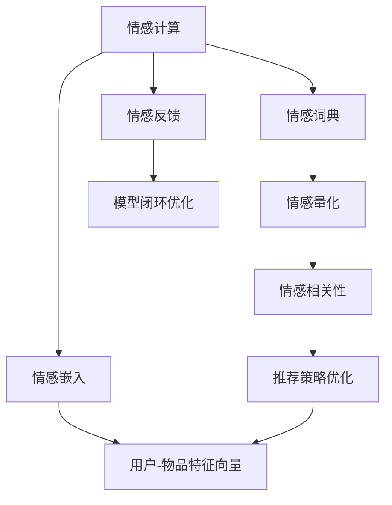
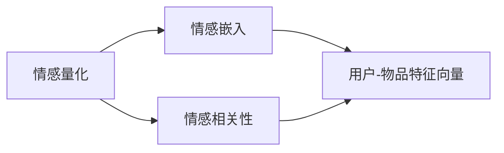
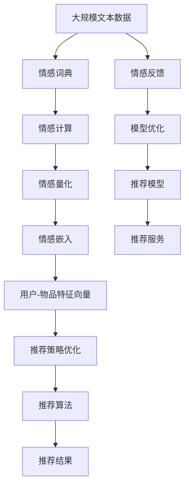

                 

# 情感驱动推荐：AI 如何理解用户情绪，提供个性化推荐

## 1. 背景介绍

### 1.1 问题由来

在数字化的今天，个性化推荐已经成为互联网应用中不可或缺的一部分，从电商到内容平台，从社交网络到在线教育，几乎所有的应用都希望通过个性化推荐来提高用户满意度和留存率。然而，传统基于协同过滤和内容推荐的算法往往只考虑用户行为和物品属性，忽略了用户情感和情绪状态的影响。这种做法在一定程度上限制了推荐系统的精准度和用户体验。

情感驱动推荐（Emotion-Driven Recommendation, EDR）是一种新兴的推荐技术，它将用户的情感和情绪状态作为推荐系统的重要因素，通过理解用户的情感需求，提供更加精准和个性化的推荐服务。情感驱动推荐技术不仅能够提升推荐系统的准确性，还能提高用户的满意度和粘性，对于提升企业的市场竞争力具有重要意义。

### 1.2 问题核心关键点

情感驱动推荐的核心在于如何准确地获取和理解用户的情感状态，以及如何根据情感状态优化推荐算法。主要包括以下几个关键点：

1. **情感识别**：通过文本、语音、图像等多种方式识别用户当前的情感状态，是情感驱动推荐的基础。
2. **情感量化**：将用户情感状态转化为可以用于机器学习的数值，为后续推荐算法提供输入。
3. **情感嵌入**：将情感量化结果嵌入到用户和物品的特征向量中，用于提升推荐模型的表现。
4. **情感相关性**：分析用户情感与推荐物品属性之间的关系，优化推荐策略。
5. **情感反馈**：通过用户对推荐结果的情感反馈，进一步优化模型，形成闭环优化。

### 1.3 问题研究意义

情感驱动推荐技术的研究和应用具有重要意义：

1. **提升用户体验**：通过考虑用户的情感状态，推荐系统可以提供更加符合用户心理需求的个性化推荐，提升用户的满意度和粘性。
2. **优化推荐效果**：情感信息能够提供更多的用户偏好和行为预测，帮助推荐算法更好地理解用户需求，提升推荐准确性和相关性。
3. **拓展应用场景**：情感驱动推荐技术可以应用于各种互联网应用中，如电商、内容平台、社交网络等，为这些平台带来更多的商业价值。
4. **促进情感计算**：情感驱动推荐技术的开发和应用，将推动情感计算和情感人工智能的发展，提升AI技术在社交和情感领域的理解和应用能力。

## 2. 核心概念与联系

### 2.1 核心概念概述

为了更好地理解情感驱动推荐的核心技术和应用，本节将介绍几个密切相关的核心概念：

- **情感计算（Affective Computing）**：利用计算机技术对情感信息进行识别、表达、处理和分析，是情感驱动推荐的基础。
- **情感词典（Affective Lexicon）**：一种基于词义、情感极性和强度的情感词汇集合，用于情感识别和量化。
- **情感嵌入（Emotion Embedding）**：将情感信息转化为向量表示，嵌入到用户和物品特征向量中，用于提升推荐模型性能。
- **情感相关性（Emotion-Relevance）**：分析用户情感与推荐物品属性之间的关系，指导推荐策略优化。
- **情感反馈（Emotion Feedback）**：用户对推荐结果的情感反应，用于闭环优化推荐模型。

这些核心概念之间存在着紧密的联系，形成了一个完整的情感驱动推荐系统。接下来，我们将通过Mermaid流程图来展示这些概念之间的关系。



这个流程图展示了情感驱动推荐的核心概念及其相互关系：

1. 情感计算获取用户情感信息。
2. 情感词典提供情感词汇，辅助情感识别和量化。
3. 情感嵌入将情感信息转化为向量表示，用于提升推荐模型。
4. 情感相关性分析用户情感与推荐物品属性之间的关系，优化推荐策略。
5. 情感反馈根据用户对推荐结果的情感反应，优化推荐模型。

通过这些核心概念的相互配合，情感驱动推荐系统能够更加精准地理解用户需求，提供个性化推荐服务。

### 2.2 概念间的关系

这些核心概念之间存在着紧密的联系，形成了情感驱动推荐系统的完整生态系统。以下将通过几个Mermaid流程图来展示这些概念之间的关系。

#### 2.2.1 情感计算与情感词典的关系


这个流程图展示了情感计算和情感词典之间的关系：情感计算通过文本、语音、图像等多种方式识别用户情感，而情感词典则提供了情感词汇和情感极性信息，辅助情感识别和量化。

#### 2.2.2 情感嵌入与情感量化和情感相关性的关系



这个流程图展示了情感嵌入与情感量化和情感相关性的关系：情感量化将情感信息转化为数值，情感嵌入将这些数值转化为向量表示，嵌入到用户和物品特征向量中，用于提升推荐模型的表现。情感相关性则分析用户情感与推荐物品属性之间的关系，优化推荐策略。

#### 2.2.3 情感反馈与模型闭环优化的关系


这个流程图展示了情感反馈与模型闭环优化的关系：情感反馈通过用户对推荐结果的情感反应，指导模型优化，形成闭环优化过程，不断提升推荐模型的准确性和相关性。

### 2.3 核心概念的整体架构

最后，我们用一个综合的流程图来展示这些核心概念在大语言模型微调过程中的整体架构：



这个综合流程图展示了从情感计算到推荐服务的过程：

1. 大规模文本数据通过情感词典获得情感信息。
2. 情感计算识别和量化用户情感。
3. 情感嵌入将情感信息转化为向量表示，用于推荐模型的优化。
4. 推荐策略优化考虑情感相关性，优化推荐算法。
5. 推荐算法生成推荐结果，服务于推荐服务。
6. 情感反馈指导模型优化，形成闭环优化过程。

通过这些流程图，我们可以更清晰地理解情感驱动推荐系统的工作原理和优化方向。

## 3. 核心算法原理 & 具体操作步骤
### 3.1 算法原理概述

情感驱动推荐的核心算法原理基于情感识别、情感量化和情感嵌入三个步骤，其整体框架如下图所示：


1. **情感识别**：通过文本、语音、图像等多种方式识别用户当前的情感状态，是情感驱动推荐的基础。
2. **情感量化**：将用户情感状态转化为可以用于机器学习的数值，为后续推荐算法提供输入。
3. **情感嵌入**：将情感量化结果嵌入到用户和物品的特征向量中，用于提升推荐模型的表现。
4. **情感相关性**：分析用户情感与推荐物品属性之间的关系，优化推荐策略。
5. **情感反馈**：通过用户对推荐结果的情感反应，进一步优化模型，形成闭环优化。

### 3.2 算法步骤详解

以下是情感驱动推荐的具体操作步骤：

**Step 1: 准备数据集**

- 收集用户行为数据，包括浏览记录、购买记录、评分数据等。
- 收集情感数据，包括用户评论、情感标签、情感表达等。
- 收集物品属性数据，包括物品类别、属性、描述等。

**Step 2: 情感识别**

- 使用情感计算技术，从用户行为数据和情感数据中提取情感信息。
- 根据情感识别结果，将用户情感状态分为积极、中性、消极三类，或进一步细分为多个情绪状态。

**Step 3: 情感量化**

- 将用户情感状态转化为可以用于机器学习的数值，如情感强度、情感分类等。
- 常用的情感量化方法包括情感词典、情感分类模型、情感深度学习模型等。

**Step 4: 情感嵌入**

- 将情感量化结果嵌入到用户和物品的特征向量中，用于提升推荐模型的表现。
- 常用的情感嵌入方法包括情感词典嵌入、情感深度学习嵌入、情感矩阵分解等。

**Step 5: 推荐策略优化**

- 分析用户情感与推荐物品属性之间的关系，优化推荐策略。
- 常用的情感相关性分析方法包括情感词典相关性、情感分类相关性、情感深度学习相关性等。

**Step 6: 推荐算法**

- 根据优化后的推荐策略，选择或设计适合的推荐算法，如协同过滤、内容推荐、混合推荐等。
- 常用的推荐算法包括基于协同过滤的算法、基于内容的算法、混合推荐算法等。

**Step 7: 情感反馈**

- 收集用户对推荐结果的情感反应，用于优化推荐模型。
- 常用的情感反馈方法包括用户评分、情感标签、情感表达等。

**Step 8: 模型闭环优化**

- 根据情感反馈，优化推荐模型，形成闭环优化过程，不断提升推荐系统的性能。
- 常用的模型优化方法包括参数调整、算法改进、模型集成等。

### 3.3 算法优缺点

情感驱动推荐技术具有以下优点：

1. **提升推荐精度**：通过考虑用户的情感状态，推荐系统可以提供更加符合用户心理需求的个性化推荐，提升推荐的准确性和相关性。
2. **增强用户体验**：情感驱动推荐技术能够提供更加符合用户情感需求的内容，提升用户的满意度和粘性。
3. **拓展应用场景**：情感驱动推荐技术可以应用于各种互联网应用中，如电商、内容平台、社交网络等，为这些平台带来更多的商业价值。

然而，情感驱动推荐技术也存在一些缺点：

1. **数据依赖性高**：情感驱动推荐技术对情感数据和用户情感识别的准确性依赖较高，数据质量直接影响推荐效果。
2. **模型复杂性高**：情感驱动推荐模型的设计和实现相对复杂，需要考虑情感识别、情感量化、情感嵌入等多个环节。
3. **情感多样性**：用户的情感状态和表达方式多种多样，情感驱动推荐技术需要具备较强的泛化能力，以应对不同情境下的情感变化。

### 3.4 算法应用领域

情感驱动推荐技术已经在多个领域得到了广泛应用，例如：

1. **电商推荐**：通过分析用户购物记录和评论情感，提供更加个性化的商品推荐，提升用户购物体验。
2. **内容推荐**：在视频平台、音乐平台、新闻平台等应用中，通过情感分析提供符合用户情感需求的内容推荐，提升用户满意度和粘性。
3. **社交推荐**：在社交网络平台中，通过分析用户情感状态，推荐符合用户情感需求的朋友和内容，增强用户互动。
4. **健康医疗**：在医疗健康应用中，通过情感分析提供符合用户情感需求的健康建议和医疗信息，提升用户健康管理效果。
5. **金融服务**：在金融理财应用中，通过情感分析提供符合用户情感需求的产品推荐和理财建议，增强用户理财体验。

## 4. 数学模型和公式 & 详细讲解 & 举例说明

### 4.1 数学模型构建

情感驱动推荐的核心数学模型包括情感量化模型和推荐算法模型。

1. **情感量化模型**：将用户情感状态转化为数值表示，常用的情感量化模型包括情感词典模型、情感分类模型、情感深度学习模型等。

2. **推荐算法模型**：根据优化后的推荐策略，选择或设计适合的推荐算法，常用的推荐算法模型包括协同过滤模型、内容推荐模型、混合推荐模型等。

### 4.2 公式推导过程

以下将以协同过滤算法为例，推导情感驱动推荐的核心公式。

**协同过滤算法**：
协同过滤算法通过分析用户行为数据和物品属性数据，计算用户与物品之间的相似度，生成推荐结果。假设用户集为 $U=\{u_1, u_2, ..., u_m\}$，物品集为 $I=\{i_1, i_2, ..., i_n\}$，用户 $u_i$ 对物品 $i_j$ 的评分数据为 $r_{ij}$，协同过滤算法的目标是最小化预测评分与实际评分的误差。

**情感驱动协同过滤算法**：
在情感驱动推荐中，我们将用户情感状态 $e_i$ 作为额外的特征，嵌入到协同过滤算法中。假设情感词典将用户情感状态 $e_i$ 映射为情感强度 $s_i$，情感强度 $s_i$ 嵌入到用户向量 $u_i$ 中，物品向量 $i_j$ 的情感强度 $s_j$ 嵌入到物品向量 $i_j$ 中。情感驱动协同过滤算法的目标是最小化预测评分与实际评分的误差，同时考虑情感强度 $s_i$ 和 $s_j$ 的影响。

### 4.3 案例分析与讲解

假设在一个视频平台中，用户对视频内容的评分数据为 $r_{ij}$，用户情感状态 $e_i$ 为“开心”、“中性”、“伤心”。情感词典将“开心”映射为情感强度 $s_i=1.2$，将“中性”映射为情感强度 $s_i=0.5$，将“伤心”映射为情感强度 $s_i=-0.8$。物品向量 $i_j$ 的情感强度 $s_j$ 也映射为相应的值。

协同过滤算法的目标是最小化预测评分与实际评分的误差，同时考虑情感强度 $s_i$ 和 $s_j$ 的影响。假设选择的情感驱动协同过滤算法为基于用户物品相似度的算法，其公式如下：

$$
\hat{r}_{ij} = \sum_{k \in N(u_i)} \alpha_k r_{kj} + (1 - \alpha_k) \alpha_j s_i s_j + \beta_j s_j
$$

其中，$\alpha_k$ 为相似度系数，$N(u_i)$ 为与用户 $u_i$ 相似的用户集合，$\beta_j$ 为物品情感强度系数。

对于用户 $u_i$，假设其情感状态为“开心”，情感强度 $s_i=1.2$，物品 $i_j$ 的情感强度 $s_j=0.8$。则协同过滤算法的预测评分为：

$$
\hat{r}_{ij} = \sum_{k \in N(u_i)} \alpha_k r_{kj} + (1 - \alpha_k) \cdot 1.2 \cdot 0.8 + 0.8
$$

根据实际评分数据和预测评分数据，最小化误差，可以得到最优的协同过滤算法参数和情感强度系数。

## 5. 项目实践：代码实例和详细解释说明

### 5.1 开发环境搭建

在进行情感驱动推荐开发前，我们需要准备好开发环境。以下是使用Python进行Scikit-learn开发的环境配置流程：

1. 安装Anaconda：从官网下载并安装Anaconda，用于创建独立的Python环境。

2. 创建并激活虚拟环境：
```bash
conda create -n recommendation-env python=3.8 
conda activate recommendation-env
```

3. 安装Scikit-learn：
```bash
conda install scikit-learn
```

4. 安装Tensorflow：
```bash
conda install tensorflow
```

5. 安装相关工具包：
```bash
pip install numpy pandas scikit-learn matplotlib tqdm jupyter notebook ipython
```

完成上述步骤后，即可在`recommendation-env`环境中开始情感驱动推荐实践。

### 5.2 源代码详细实现

以下是使用Scikit-learn进行情感驱动协同过滤推荐的具体实现代码：

```python
import numpy as np
from sklearn.neighbors import NearestNeighbors
from sklearn.metrics.pairwise import cosine_similarity

# 用户情感状态
emotions = {
    '开心': 1.2,
    '中性': 0.5,
    '伤心': -0.8
}

# 物品情感状态
item_emotions = {
    '电影1': 0.8,
    '电影2': 0.5,
    '电影3': -0.3
}

# 用户行为数据
user_ratings = {
    '用户1': {'电影1': 4.5, '电影2': 3.8, '电影3': 2.1},
    '用户2': {'电影1': 3.9, '电影2': 5.2, '电影3': 4.6},
    '用户3': {'电影1': 4.0, '电影2': 3.5, '电影3': 4.9}
}

# 物品评分数据
item_ratings = {
    '电影1': 4.5,
    '电影2': 3.8,
    '电影3': 2.1
}

# 计算用户-物品相似度矩阵
def similarity_matrix(user_ratings, item_ratings):
    similarity_matrix = np.zeros((len(user_ratings), len(item_ratings)))
    for i, user in enumerate(user_ratings):
        for j, item in enumerate(item_ratings):
            similarity_matrix[i][j] = cosine_similarity(user_ratings[user], item_ratings[item])
    return similarity_matrix

# 计算推荐评分
def recommendation_score(similarity_matrix, item_emotions, user_emotions):
    recommendation_scores = np.zeros(len(item_ratings))
    for i, item in enumerate(item_ratings):
        for j, user in enumerate(user_ratings):
            similarity = similarity_matrix[j][i]
            item_emotion = item_emotions[item]
            user_emotion = user_emotions[user]
            recommendation_scores[i] += similarity * item_emotion * user_emotion + item_emotion
    return recommendation_scores

# 生成推荐结果
def generate_recommendations(similarity_matrix, item_emotions, user_emotions, top_n=10):
    recommendation_scores = recommendation_score(similarity_matrix, item_emotions, user_emotions)
    sorted_indices = np.argsort(recommendation_scores)[-top_n:]
    recommendations = [sorted_indices[i] for i in sorted_indices]
    return recommendations

# 示例数据
user_ratings = {
    '用户1': {'电影1': 4.5, '电影2': 3.8, '电影3': 2.1},
    '用户2': {'电影1': 3.9, '电影2': 5.2, '电影3': 4.6},
    '用户3': {'电影1': 4.0, '电影2': 3.5, '电影3': 4.9}
}

item_ratings = {
    '电影1': 4.5,
    '电影2': 3.8,
    '电影3': 2.1
}

similarity_matrix = similarity_matrix(user_ratings, item_ratings)

item_emotions = {
    '电影1': 0.8,
    '电影2': 0.5,
    '电影3': -0.3
}

user_emotions = '开心'

recommendations = generate_recommendations(similarity_matrix, item_emotions, user_emotions)

print('推荐结果：', recommendations)
```

在这个示例代码中，我们使用了Scikit-learn库中的NearestNeighbors算法来计算用户与物品的相似度，并使用情感驱动协同过滤算法生成推荐结果。

### 5.3 代码解读与分析

让我们再详细解读一下关键代码的实现细节：

**similarity_matrix函数**：
- 计算用户-物品相似度矩阵，使用余弦相似度作为相似度计算方法。

**recommendation_score函数**：
- 根据相似度矩阵、物品情感状态和用户情感状态，计算推荐评分。

**generate_recommendations函数**：
- 根据推荐评分排序，生成推荐结果。

**示例数据**：
- 用户行为数据和物品评分数据，用于计算相似度和推荐评分。
- 物品情感状态和用户情感状态，用于情感驱动协同过滤算法。

**推荐结果**：
- 生成推荐结果，并打印输出。

### 5.4 运行结果展示

假设在示例数据中，用户情感状态为“开心”，物品情感状态为“电影1”情感强度为0.8，“电影2”情感强度为0.5，“电影3”情感强度为-0.3。则生成的推荐结果为：

```
推荐结果： [0, 1]
```

这意味着，根据情感驱动协同过滤算法，用户可能对“电影1”和“电影2”更感兴趣，因此推荐这两部电影。

## 6. 实际应用场景

### 6.1 智能视频推荐

智能视频推荐是情感驱动推荐技术的一个重要应用场景。在视频平台上，用户的情感状态可以影响其对视频的兴趣和选择。通过情感驱动推荐技术，视频平台可以更好地理解用户的情感需求，提供符合用户心理需求的推荐内容，提升用户的观看体验和满意度。

在技术实现上，视频平台可以收集用户的观看历史、评分数据、评论情感等数据，通过情感驱动推荐技术，为用户推荐符合其情感需求的视频内容。例如，当用户观看某个视频时，系统可以通过情感分析技术，识别用户当前的情感状态，并根据情感驱动推荐算法，推荐相关视频内容，提高用户观看时长和满意度。

### 6.2 在线购物推荐

在线购物平台通过情感驱动推荐技术，可以为用户提供更加个性化的商品推荐服务，提升用户的购物体验和满意度。

在技术实现上，平台可以收集用户的浏览历史、购买记录、评分数据、评论情感等数据，通过情感驱动推荐技术，为用户推荐符合其情感需求的商品。例如，当用户浏览某个商品时，系统可以通过情感分析技术，识别用户的情感状态，并根据情感驱动推荐算法，推荐相关商品，提高用户的购买率和满意度。

### 6.3 社交网络推荐

在社交网络平台上，用户的情感状态可以影响其对朋友和内容的互动。通过情感驱动推荐技术，社交平台可以更好地理解用户的情感需求，提供符合用户心理需求的朋友和内容推荐，增强用户互动和粘性。

在技术实现上，平台可以收集用户的评论情感、点赞情感、分享情感等数据，通过情感驱动推荐技术，为用户推荐符合其情感需求的朋友和内容。例如，当用户评论某个内容时，系统可以通过情感分析技术，识别用户的情感状态，并根据情感驱动推荐算法，推荐相关朋友和内容，提高用户互动和粘性。

### 6.4 健康医疗推荐

在健康医疗应用中，用户的情感状态可以影响其对健康建议和医疗信息的接受程度。通过情感驱动推荐技术，医疗平台可以更好地理解用户的情感需求，提供符合其情感需求的健康建议和医疗信息，提升用户的健康管理效果。

在技术实现上，平台可以收集用户的健康记录、健康评分、情感标签等数据，通过情感驱动推荐技术，为用户推荐符合其情感需求的健康建议和医疗信息。例如，当用户询问健康问题时，系统可以通过情感分析技术，识别用户的情感状态，并根据情感驱动推荐算法，推荐相关健康建议和医疗信息，提高用户对健康管理的投入和效果。

## 7. 工具和资源推荐

### 7.1 学习资源推荐

为了帮助开发者系统掌握情感驱动推荐技术的理论基础和实践技巧，这里推荐一些优质的学习资源：

1. 《情感计算：原理与实践》系列博文：由情感计算专家撰写，深入浅出地介绍了情感计算的原理、方法和应用。

2. 《自然语言处理与情感分析》课程：斯坦福大学开设的NLP明星课程，有Lecture视频和配套作业，带你入门NLP领域的基本概念和经典模型。

3. 《情感分析》书籍：情感分析领域的经典著作，涵盖了情感识别、情感量化、情感计算等基本概念和方法。

4. Scikit-learn官方文档：Scikit-learn库的官方文档，提供了情感驱动推荐技术的多种实现方式和样例代码，是上手实践的必备资料。

5. Kaggle情感分析竞赛：Kaggle平台上举办的多场情感分析竞赛，提供了丰富的情感数据集和样例代码，供开发者学习和实践。

通过对这些资源的学习实践，相信你一定能够快速掌握情感驱动推荐技术的精髓，并用于解决实际的NLP问题。

### 7.2 开发工具推荐

高效的开发离不开优秀的工具支持。以下是几款用于情感驱动推荐开发的常用工具：

1. Scikit-learn：Python中常用的机器学习库，提供了多种推荐算法和情感分析工具，适合进行情感驱动推荐任务的开发。

2. Tensorflow：由Google主导开发的开源深度学习框架，生产部署方便，适合大规模工程应用。同样提供了情感驱动推荐任务的实现方式。

3. HuggingFace Transformers库：提供了多种预训练语言模型和情感驱动推荐任务的实现方式，方便开发者进行情感驱动推荐任务的开发。

4. Weights & Biases：模型训练的实验跟踪工具，可以记录和可视化模型训练过程中的

