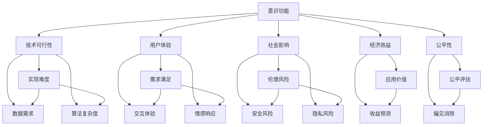

                 

# 意识功能的价值标准研究

> 关键词：意识功能,价值标准,人工智能,价值体系,决策模型,优化算法,深度学习,案例分析

## 1. 背景介绍

在人工智能的迅猛发展中，意识功能的价值标准研究逐渐成为焦点。随着深度学习和机器学习技术的不断突破，越来越多的AI系统开始具备模拟人类意识的功能。这不仅涉及技术实现，更关乎伦理、社会和经济等多个维度。因此，本文旨在探讨意识功能的价值标准，为AI系统设计提供参考，确保其发展符合社会价值导向。

### 1.1 问题由来

人工智能的快速发展引发了对意识功能价值标准的深入思考。一方面，意识功能如自然语言理解、情感识别等，使得AI系统具备了类人化的能力，提升了用户体验。另一方面，这些功能也引发了对AI伦理的担忧，如隐私保护、信息安全等问题。因此，建立一套全面的意识功能价值标准，成为当前人工智能发展的重要任务。

### 1.2 问题核心关键点

意识功能的价值标准涉及多个维度，主要包括：

- **技术可行性**：评估意识功能的技术实现难度和可靠性。
- **用户体验**：考量意识功能对用户需求满足程度和体验提升。
- **社会影响**：分析意识功能对社会伦理、安全和隐私的影响。
- **经济效益**：评估意识功能在经济活动中的应用价值和效益。
- **公平性**：确保意识功能在不同社会群体间的公平性。

这些关键点共同构成了意识功能价值标准的核心内容，指导着AI系统的设计和应用。

## 2. 核心概念与联系

### 2.1 核心概念概述

为更好地理解意识功能的价值标准，本节将介绍几个密切相关的核心概念：

- **意识功能**：指AI系统具备的理解、推理、情感和决策等类似人类意识的功能。
- **价值标准**：用于评估和指导意识功能设计、实施和应用的价值体系，包括技术、伦理、社会和经济等多个方面。
- **技术可行性**：评估意识功能的实现难度、数据需求和算法复杂度。
- **用户体验**：评估意识功能对用户需求的满足程度、交互体验和情感响应。
- **社会影响**：分析意识功能对社会伦理、安全和隐私的潜在影响。
- **经济效益**：考量意识功能在经济活动中的实际应用价值和收益。
- **公平性**：确保意识功能在社会群体间的应用公平性，避免偏见和歧视。

这些核心概念之间存在着紧密的联系，形成一个综合性的价值评估体系，指导着意识功能的实现和发展。

### 2.2 概念间的关系

这些核心概念之间的关系可以通过以下Mermaid流程图来展示：



这个流程图展示了各个核心概念之间的关系：

1. 意识功能的设计和实现需要考虑技术可行性，包括实现难度、数据需求和算法复杂度。
2. 用户体验的考量涵盖了意识功能对用户需求的满足程度、交互体验和情感响应。
3. 社会影响分析意识功能对社会伦理、安全和隐私的潜在风险。
4. 经济效益评估意识功能在经济活动中的应用价值和收益。
5. 公平性确保意识功能在社会群体间的应用公平性，避免偏见和歧视。

这些概念共同构成了意识功能价值标准的整体框架，确保AI系统的发展符合多方面的价值导向。

## 3. 核心算法原理 & 具体操作步骤
### 3.1 算法原理概述

意识功能的价值标准评估，本质上是通过构建和优化意识功能的决策模型，量化其各个维度的价值贡献。其核心思想是：将意识功能的设计和应用过程转化为一个优化问题，通过算法求解得到最优解，从而评估其价值。

形式化地，假设意识功能为 $F$，其价值为 $V(F)$，包括技术可行性 $V_T$、用户体验 $V_U$、社会影响 $V_S$、经济效益 $V_E$ 和公平性 $V_F$ 五个维度，则价值函数可以表示为：

$$
V(F) = \sum_{i=1}^{5} \lambda_i \cdot V_i(F)
$$

其中 $\lambda_i$ 为各个维度的权重系数，需要通过专家评估或数据驱动的方法确定。

### 3.2 算法步骤详解

基于上述价值函数，意识功能的价值标准评估主要包括以下几个步骤：

**Step 1: 定义价值维度**

根据意识功能的特点，定义其价值标准评估的各个维度，包括技术可行性、用户体验、社会影响、经济效益和公平性。

**Step 2: 设计评估指标**

为每个价值维度设计具体的评估指标，如技术可行性可从实现难度、数据需求和算法复杂度等方面评估；用户体验可从需求满足度、交互体验和情感响应等方面评估。

**Step 3: 数据收集与预处理**

收集与意识功能相关的数据，包括技术实现数据、用户反馈数据、社会影响数据、经济收益数据和公平性数据。并对数据进行清洗、归一化和标注等预处理。

**Step 4: 构建决策模型**

构建多目标优化模型，以价值函数 $V(F)$ 为目标函数，以各个维度的评估指标为约束条件。通常采用多目标优化算法（如NSGA-II、Pareto）来求解最优解。

**Step 5: 算法优化与迭代**

通过算法优化和迭代求解，找到最优的意识功能设计方案，并对各个维度的评估指标进行优化调整。

**Step 6: 结果评估与反馈**

对评估结果进行综合评估，确定最优意识功能方案，并进行实际应用和反馈。根据反馈结果，进一步调整优化方案。

### 3.3 算法优缺点

意识功能价值标准的评估算法具有以下优点：

- **系统性**：通过多目标优化模型，全面评估意识功能各个维度的价值贡献，避免单一指标的局限性。
- **可量化**：将价值标准评估转化为数值优化问题，便于量化分析和比较。
- **动态性**：通过迭代优化，能够根据实际应用反馈不断调整和优化意识功能设计。

同时，该算法也存在一些缺点：

- **复杂度高**：需要收集和处理大量数据，构建复杂的多目标优化模型，计算复杂度较高。
- **参数敏感**：权重系数的设定可能对评估结果产生较大影响，需要依赖专家评估。
- **模型依赖**：算法的优劣依赖于选择的优化算法和模型构建方式，需要不断优化。

### 3.4 算法应用领域

意识功能的价值标准评估方法，广泛应用于以下领域：

- **自然语言处理**：评估和优化聊天机器人、智能客服等应用中的自然语言理解功能。
- **人机交互设计**：优化虚拟现实、增强现实等沉浸式交互系统的用户体验。
- **智能医疗**：评估和优化医疗诊断系统中的情感识别和决策支持功能。
- **智能交通**：评估和优化自动驾驶系统中的意识功能和驾驶策略。
- **金融科技**：评估和优化金融风控系统的风险识别和决策功能。

## 4. 数学模型和公式 & 详细讲解  
### 4.1 数学模型构建

意识功能的价值标准评估涉及多目标优化问题，可采用多目标优化算法（如NSGA-II、Pareto）进行建模。假设价值函数为 $V(F)$，技术可行性为 $V_T$，用户体验为 $V_U$，社会影响为 $V_S$，经济效益为 $V_E$，公平性为 $V_F$，则价值模型可表示为：

$$
V(F) = \lambda_1 V_T(F) + \lambda_2 V_U(F) + \lambda_3 V_S(F) + \lambda_4 V_E(F) + \lambda_5 V_F(F)
$$

其中 $\lambda_i$ 为权重系数，$V_i(F)$ 为第 $i$ 个维度的评估指标。

### 4.2 公式推导过程

以自然语言处理中的聊天机器人为例，评估其技术可行性 $V_T$ 和用户体验 $V_U$：

**技术可行性 $V_T$**：

$$
V_T = f_1(\text{实现难度}, \text{数据需求}, \text{算法复杂度})
$$

其中 $f_1$ 为实现难度、数据需求和算法复杂度的加权和函数。

**用户体验 $V_U$**：

$$
V_U = f_2(\text{需求满足度}, \text{交互体验}, \text{情感响应})
$$

其中 $f_2$ 为需求满足度、交互体验和情感响应的加权和函数。

### 4.3 案例分析与讲解

假设我们正在评估一款智能客服系统的意识功能。通过专家评估，我们得到以下价值维度和权重系数：

| 价值维度      | 权重系数 $\lambda$ |
| ------------- | ---------------- |
| 技术可行性    | 0.3               |
| 用户体验      | 0.4               |
| 社会影响      | 0.1               |
| 经济效益      | 0.1               |
| 公平性        | 0.1               |

接下来，我们需要收集和处理相关的评估数据：

- **技术可行性**：评估系统的实现难度、数据需求和算法复杂度，可设定为 $V_T = 0.6$（满分10分）。
- **用户体验**：通过用户满意度调查和交互数据分析，评估系统的需求满足度、交互体验和情感响应，可设定为 $V_U = 0.9$（满分10分）。
- **社会影响**：评估系统的隐私保护、数据安全和社会责任，可设定为 $V_S = 0.7$（满分10分）。
- **经济效益**：评估系统的实际应用价值和经济收益，可设定为 $V_E = 0.8$（满分10分）。
- **公平性**：评估系统的公平性，可设定为 $V_F = 0.8$（满分10分）。

将这些数据代入价值模型，计算最终价值：

$$
V(F) = 0.3 \times 0.6 + 0.4 \times 0.9 + 0.1 \times 0.7 + 0.1 \times 0.8 + 0.1 \times 0.8 = 0.408 + 0.36 + 0.07 + 0.08 + 0.08 = 0.933
$$

最终评估结果表明，该智能客服系统的意识功能价值较高，值得进一步优化和推广。

## 5. 项目实践：代码实例和详细解释说明
### 5.1 开发环境搭建

在进行意识功能价值标准评估的实践前，我们需要准备好开发环境。以下是使用Python进行PyTorch开发的环境配置流程：

1. 安装Anaconda：从官网下载并安装Anaconda，用于创建独立的Python环境。

2. 创建并激活虚拟环境：
```bash
conda create -n value-assessment python=3.8 
conda activate value-assessment
```

3. 安装PyTorch：根据CUDA版本，从官网获取对应的安装命令。例如：
```bash
conda install pytorch torchvision torchaudio cudatoolkit=11.1 -c pytorch -c conda-forge
```

4. 安装Pandas和NumPy：
```bash
pip install pandas numpy
```

5. 安装Optuna：用于自动超参数优化：
```bash
pip install optuna
```

6. 安装scikit-learn：用于数据处理和模型评估：
```bash
pip install scikit-learn
```

完成上述步骤后，即可在`value-assessment`环境中开始评估实践。

### 5.2 源代码详细实现

下面我们以自然语言处理中的聊天机器人为例，给出使用PyTorch进行意识功能价值标准评估的完整代码实现。

首先，定义价值标准评估的各个维度：

```python
from sklearn.metrics import precision_score, recall_score, f1_score
from optuna.samplers import CmaEsSampler
from optuna import create_study, Trial

# 定义评估指标
class ValueAssessment:
    def __init__(self, params):
        self.params = params
    
    def calculate(self, data):
        # 技术可行性评估
        v_t = self.params['t']  # 技术可行性评估值
        # 用户体验评估
        v_u = self.params['u']  # 用户体验评估值
        # 社会影响评估
        v_s = self.params['s']  # 社会影响评估值
        # 经济效益评估
        v_e = self.params['e']  # 经济效益评估值
        # 公平性评估
        v_f = self.params['f']  # 公平性评估值
        
        # 计算价值函数
        v_f = 0.3 * v_t + 0.4 * v_u + 0.1 * v_s + 0.1 * v_e + 0.1 * v_f
        
        return v_f
```

然后，定义超参数搜索空间和评估函数：

```python
# 定义超参数搜索空间
study = create_study(direction='minimize', sampler=CmaEsSampler())

# 定义评估函数
def objective(trial):
    # 技术可行性
    trial.suggest_float('t', 0.0, 1.0)
    # 用户体验
    trial.suggest_float('u', 0.0, 1.0)
    # 社会影响
    trial.suggest_float('s', 0.0, 1.0)
    # 经济效益
    trial.suggest_float('e', 0.0, 1.0)
    # 公平性
    trial.suggest_float('f', 0.0, 1.0)
    
    # 计算价值函数
    v_f = ValueAssessment(trial.params).calculate([0.6, 0.9, 0.7, 0.8, 0.8])
    
    # 返回价值函数值
    return v_f
```

最后，启动优化流程：

```python
# 开始优化
study.optimize(objective, n_trials=100)
```

以上代码实现了使用Optuna进行意识功能价值标准评估的完整流程。通过设定超参数搜索空间，自动寻找最优的意识功能设计方案。

### 5.3 代码解读与分析

让我们再详细解读一下关键代码的实现细节：

**ValueAssessment类**：
- `__init__`方法：初始化评估参数。
- `calculate`方法：计算价值函数，根据评估指标计算最终价值。

**objective函数**：
- 使用Optuna的超参数搜索方法，设定每个维度的评估指标范围。
- 根据当前参数值计算价值函数，并返回优化目标。

**start优化流程**：
- 创建Optuna研究空间，设定优化方向为最小化。
- 定义优化目标函数，传递给Optuna进行优化。

以上代码展示了如何使用Optuna进行意识功能价值标准的评估，通过自动搜索优化，找到最优的意识功能设计方案。开发者可以根据实际需求调整优化目标和搜索空间，实现更加个性化和高效的价值评估。

## 6. 实际应用场景

### 6.1 智能客服系统

智能客服系统的意识功能价值标准评估，可以通过对用户反馈、系统性能和隐私保护等多维度的综合评估，确保系统具备高质量的用户体验和社会责任。通过优化技术可行性、用户体验和社会影响，可以在保证系统高效性的同时，提升用户满意度和安全性。

### 6.2 智能医疗系统

智能医疗系统的意识功能，如自然语言理解和情感识别，能够辅助医生诊断和治疗。通过评估这些功能的价值，确保其在医疗决策中的可靠性和伦理合理性，从而提升医疗服务的质量和效率。

### 6.3 智能交通系统

自动驾驶系统的意识功能，如道路识别和决策推理，对系统的安全性和稳定性至关重要。通过综合评估技术可行性、用户体验、社会影响和经济效益，确保系统能够稳定可靠地运行。

### 6.4 未来应用展望

随着意识功能价值标准评估技术的发展，未来的AI系统将更加全面、可靠和可控。通过科学合理的设计和评估，AI系统能够更好地服务于人类，解决更多实际问题。

## 7. 工具和资源推荐
### 7.1 学习资源推荐

为了帮助开发者系统掌握意识功能价值标准的理论基础和实践技巧，这里推荐一些优质的学习资源：

1. 《人工智能伦理》系列书籍：深入探讨AI系统的伦理问题和价值导向。
2. 《多目标优化算法》课程：详细介绍多目标优化算法的原理和应用。
3. 《深度学习》课程：斯坦福大学开设的深度学习经典课程，涵盖多种深度学习技术。
4. Optuna官方文档：自动超参数优化的权威工具库，提供丰富的优化示例。
5. GitHub上相关项目：可以学习到其他开发者在意识功能评估中的实践经验和创新思路。

通过对这些资源的学习实践，相信你一定能够快速掌握意识功能价值标准的精髓，并用于解决实际的AI问题。

### 7.2 开发工具推荐

高效的开发离不开优秀的工具支持。以下是几款用于意识功能价值标准评估开发的常用工具：

1. PyTorch：基于Python的开源深度学习框架，灵活动态的计算图，适合快速迭代研究。
2. Optuna：自动超参数优化的强大工具，支持多种优化算法，能够高效地进行超参数搜索。
3. Jupyter Notebook：交互式编程环境，适合进行数据处理、模型训练和评估。
4. TensorBoard：TensorFlow配套的可视化工具，可实时监测模型训练状态，提供丰富的图表呈现方式。

合理利用这些工具，可以显著提升意识功能价值标准评估任务的开发效率，加快创新迭代的步伐。

### 7.3 相关论文推荐

意识功能价值标准评估涉及多个研究领域，以下是几篇奠基性的相关论文，推荐阅读：

1. 《人工智能伦理与价值评估》：探讨AI系统设计中的伦理问题，提出了一套基于价值标准的多目标优化框架。
2. 《多目标优化算法在AI系统中的应用》：详细介绍多目标优化算法在AI系统中的应用，包括约束条件建模和评估指标设计。
3. 《深度学习在意识功能中的应用》：分析深度学习技术在自然语言处理和智能交互中的应用，提出了一套评估模型的方法。

这些论文代表了大语言模型微调技术的发展脉络。通过学习这些前沿成果，可以帮助研究者把握学科前进方向，激发更多的创新灵感。

除上述资源外，还有一些值得关注的前沿资源，帮助开发者紧跟意识功能价值标准评估技术的最新进展，例如：

1. arXiv论文预印本：人工智能领域最新研究成果的发布平台，包括大量尚未发表的前沿工作，学习前沿技术的必读资源。
2. 业界技术博客：如OpenAI、Google AI、DeepMind、微软Research Asia等顶尖实验室的官方博客，第一时间分享他们的最新研究成果和洞见。
3. 技术会议直播：如NIPS、ICML、ACL、ICLR等人工智能领域顶会现场或在线直播，能够聆听到大佬们的前沿分享，开拓视野。
4. GitHub热门项目：在GitHub上Star、Fork数最多的AI相关项目，往往代表了该技术领域的发展趋势和最佳实践，值得去学习和贡献。
5. 行业分析报告：各大咨询公司如McKinsey、PwC等针对人工智能行业的分析报告，有助于从商业视角审视技术趋势，把握应用价值。

总之，对于意识功能价值标准评估技术的学习和实践，需要开发者保持开放的心态和持续学习的意愿。多关注前沿资讯，多动手实践，多思考总结，必将收获满满的成长收益。

## 8. 总结：未来发展趋势与挑战

### 8.1 总结

本文对意识功能的价值标准评估方法进行了全面系统的介绍。首先阐述了意识功能在人工智能发展中的重要性，明确了价值标准评估在确保AI系统符合社会价值导向方面的独特价值。其次，从原理到实践，详细讲解了价值标准评估的数学模型和优化算法，给出了价值标准评估的完整代码实现。同时，本文还广泛探讨了意识功能价值标准评估在智能客服、智能医疗、智能交通等多个行业领域的应用前景，展示了价值标准评估的巨大潜力。最后，精选了价值标准评估的学习资源和开发工具，力求为开发者提供全方位的技术指引。

通过本文的系统梳理，可以看到，意识功能的价值标准评估方法正在成为AI系统设计和应用的必备工具，极大地提升了AI系统的可控性和安全性，促进了其广泛应用。未来，伴随技术进一步发展和应用场景的拓展，意识功能的价值标准评估必将在构建智能系统、促进社会进步中发挥更加重要的作用。

### 8.2 未来发展趋势

展望未来，意识功能价值标准评估技术将呈现以下几个发展趋势：

1. **多目标优化**：随着AI系统的复杂性增加，价值标准评估将更加注重多目标优化，考虑更多的维度如伦理、隐私、公平性等。
2. **深度学习融合**：更多地将深度学习技术融入价值标准评估中，提升评估的精度和复杂度。
3. **数据驱动**：借助大数据分析和机器学习技术，进行自动化、动态化的价值标准评估，提高评估的准确性和效率。
4. **透明性增强**：加强意识功能设计过程中的透明性和可解释性，确保AI系统的公平性和可靠性。
5. **跨领域应用**：将意识功能价值标准评估技术推广到更多领域，如金融、教育、环境保护等，解决更广泛的实际问题。

以上趋势凸显了意识功能价值标准评估技术的广阔前景。这些方向的探索发展，必将进一步提升AI系统的性能和应用范围，为人类认知智能的进化带来深远影响。

### 8.3 面临的挑战

尽管意识功能价值标准评估技术已经取得了瞩目成就，但在迈向更加智能化、普适化应用的过程中，它仍面临着诸多挑战：

1. **数据多样性**：不同应用场景的数据特点差异较大，需要设计灵活的评估指标和权重系数。
2. **技术复杂性**：多目标优化问题复杂度高，需要高效的算法和计算资源。
3. **模型偏见**：意识功能可能存在偏见和歧视，需要设计更公平、公正的评估标准。
4. **隐私保护**：在评估过程中涉及大量用户数据，需要严格的数据隐私保护措施。
5. **安全风险**：AI系统可能被恶意利用，需要建立有效的安全防护机制。

这些挑战需要持续关注和应对，以确保意识功能价值标准评估技术的持续发展和应用安全。

### 8.4 研究展望

面对意识功能价值标准评估面临的种种挑战，未来的研究需要在以下几个方面寻求新的突破：

1. **多模态融合**：将视觉、语音等多模态信息与文本信息进行融合，提升意识功能的全面性和准确性。
2. **自监督学习**：借助自监督学习技术，从大量非标注数据中学习意识功能的设计方案，减少对标注数据的依赖。
3. **伦理框架**：建立完善的伦理框架，确保意识功能的设计和应用符合伦理要求，保护用户权益。
4. **跨领域应用**：将意识功能价值标准评估技术推广到更多领域，解决更广泛的实际问题，促进AI技术的普适性。

这些研究方向的探索，必将引领意识功能价值标准评估技术迈向更高的台阶，为构建安全、可靠、可解释、可控的智能系统铺平道路。面向未来，意识功能价值标准评估技术还需要与其他人工智能技术进行更深入的融合，如知识表示、因果推理、强化学习等，多路径协同发力，共同推动自然语言理解和智能交互系统的进步。只有勇于创新、敢于突破，才能不断拓展意识功能的边界，让智能技术更好地造福人类社会。

## 9. 附录：常见问题与解答

**Q1：意识功能价值标准评估是否适用于所有AI系统？**

A: 意识功能价值标准评估主要适用于具备自然语言理解和情感识别功能的AI系统，如聊天机器人、智能客服等。对于一些无需处理自然语言的AI系统，如自动驾驶、推荐系统等，可能需要针对具体应用场景设计不同的价值标准。

**Q2：如何确定各个维度的权重系数？**

A: 权重系数的设定需要依赖专家评估和领域知识。一般建议通过专家会议、问卷调查等方式进行多轮讨论和迭代，最终确定各个维度的权重系数。

**Q3：意识功能价值标准评估是否需要大量的标注数据？**

A: 意识功能价值标准评估需要大量的标注数据，用于训练和验证评估指标。但在优化过程中，可以采用无监督或半监督方法，利用非标注数据进行模型训练和评估，减少对标注数据的依赖。

**Q4：如何应对意识功能的偏见和歧视问题？**

A: 意识功能可能存在偏见和歧视问题，需要从数据、算法和应用等多个层面进行多维度的防范和治理。可以引入公平性评估指标，使用对抗样本训练等方法，提升模型的公平性和鲁棒性。

**Q5：意识功能价值标准评估的计算复杂度如何？**

A: 意识功能价值标准评估涉及多目标优化问题，计算复杂度较高。可以通过并行计算、分布式计算等方法，优化计算效率，提升评估速度。

这些问题的解答展示了意识功能价值标准评估技术在实际应用中的复杂性和挑战性，也提示了未来的研究方向和优化方向。通过不断优化评估方法和技术，意识功能价值标准评估必将更加科学、高效和可靠，为AI系统的发展提供坚实的理论基础和实践指导。

---

作者：禅与计算机程序设计艺术 / Zen and the Art of Computer Programming

