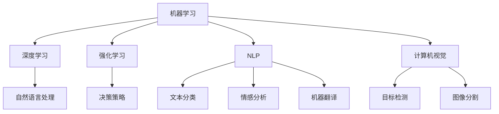

                 

## 1. 背景介绍

人工智能(AI)工具在现代社会中扮演着越来越重要的角色，从自动驾驶汽车到个性化推荐系统，从语音识别到图像识别，AI工具已经渗透到我们生活的方方面面。然而，面对众多可用的AI工具，如何找到适合自己的工具，成为一个重要而复杂的问题。本文将深入探讨这一问题，帮助读者理解AI工具的核心概念、应用领域、选择标准和未来趋势，以期帮助读者在AI领域找到合适的工具，实现个人和企业的价值最大化。

## 2. 核心概念与联系

### 2.1 核心概念概述

- **AI工具**：指的是利用人工智能技术解决特定问题的软件或硬件工具，如机器学习模型、深度学习框架、自然语言处理工具等。
- **机器学习**：通过数据训练模型，使其能够从数据中学习规律并做出预测或决策的过程。
- **深度学习**：一种机器学习技术，通过多层次的神经网络模型，处理复杂的非线性数据关系。
- **自然语言处理(NLP)**：使用计算机处理、理解、生成人类语言的技术，如文本分类、情感分析、机器翻译等。
- **计算机视觉**：通过计算机理解和解释图像、视频等视觉数据的领域，如目标检测、图像分割等。
- **强化学习**：一种学习技术，通过与环境的交互，使智能体学会在特定环境中做出最优决策。

### 2.2 核心概念间的关系

这些核心概念构成了AI工具的基础，它们之间通过各种方式相互关联。例如，深度学习技术通常被用于训练NLP和计算机视觉模型；机器学习模型和深度学习模型可以用于强化学习中的决策策略；自然语言处理技术可以用于理解和处理用户输入。理解这些概念之间的关系，有助于我们更好地选择合适的AI工具。

### 2.3 核心概念的整体架构

以下是一个综合的流程图，展示了AI工具中各个核心概念之间的联系：



这个流程图展示了AI工具中各个核心概念之间的关系，从基础技术到应用领域，都通过箭头相连，形成了完整的技术链条。理解这些关系，有助于我们在选择AI工具时，考虑其应用场景和适用性。

## 3. 核心算法原理 & 具体操作步骤

### 3.1 算法原理概述

AI工具的开发和应用通常依赖于特定的算法和模型。这些算法和模型通过数据训练，能够对特定问题进行高效处理。例如，机器学习算法通过构建模型来拟合数据分布，深度学习模型通过多层次的神经网络处理复杂数据关系，自然语言处理模型通过分词、向量化等技术处理文本数据，计算机视觉模型通过特征提取和分类处理图像数据，强化学习模型通过与环境交互学习最优策略。

### 3.2 算法步骤详解

AI工具的开发和应用通常包括以下几个关键步骤：

**Step 1: 数据准备**
- 收集和处理数据，包括数据清洗、特征工程、数据增强等。
- 准备训练集、验证集和测试集，确保数据分布的一致性。

**Step 2: 模型选择**
- 根据问题的性质和数据的特点，选择合适的模型和算法。
- 对于深度学习模型，需要考虑网络结构、激活函数、优化器等参数。
- 对于自然语言处理模型，需要考虑分词器、嵌入层、编码器等组件。

**Step 3: 模型训练**
- 使用训练集数据训练模型，优化模型的参数。
- 使用验证集数据监控模型性能，避免过拟合。
- 选择适当的优化器和超参数，如学习率、批大小、迭代轮数等。

**Step 4: 模型评估**
- 使用测试集数据评估模型性能，计算各项指标。
- 分析模型的优势和不足，进行模型优化。
- 考虑是否需要进行模型融合或迁移学习。

**Step 5: 部署应用**
- 将训练好的模型部署到实际应用中。
- 设计API接口，方便模型调用。
- 监控模型性能，进行持续优化。

### 3.3 算法优缺点

AI工具的开发和应用通常需要考虑其优缺点，以便选择最合适的工具。

**优点**：
- 提高效率和准确性：AI工具能够自动化处理大量数据，提高决策的效率和准确性。
- 处理复杂问题：AI工具可以处理传统方法难以解决的问题，如自然语言理解和计算机视觉。
- 持续学习和优化：AI工具可以通过不断学习和优化，提高模型的性能和适应性。

**缺点**：
- 数据依赖性强：AI工具的效果依赖于高质量的数据，数据收集和处理成本高。
- 模型复杂度高：深度学习和强化学习模型通常结构复杂，需要大量的计算资源。
- 可解释性不足：AI工具往往是"黑盒"模型，难以解释其内部工作机制。

### 3.4 算法应用领域

AI工具广泛应用于各个领域，如医疗、金融、零售、制造等。以下是几个典型的应用领域：

**医疗领域**：利用AI工具进行疾病诊断、药物发现、基因组分析等，提高医疗服务的精准性和效率。

**金融领域**：使用AI工具进行风险评估、交易策略制定、客户行为分析等，提升金融服务的智能化水平。

**零售领域**：通过AI工具进行需求预测、库存管理、个性化推荐等，优化零售业务流程，提高客户满意度。

**制造领域**：利用AI工具进行质量检测、设备维护、生产调度等，提升制造业的自动化水平和生产效率。

## 4. 数学模型和公式 & 详细讲解

### 4.1 数学模型构建

AI工具的开发通常基于数学模型。以下是一个简单的线性回归模型：

$$ y = \theta_0 + \theta_1 x_1 + \theta_2 x_2 + \epsilon $$

其中，$y$ 为输出变量，$\theta_0$、$\theta_1$、$\theta_2$ 为模型参数，$x_1$、$x_2$ 为输入变量，$\epsilon$ 为噪声。

### 4.2 公式推导过程

对于线性回归模型，我们通常使用最小二乘法来估计模型参数。最小二乘法的目标是最小化残差平方和：

$$ \sum_{i=1}^{n} (y_i - (\theta_0 + \theta_1 x_{i1} + \theta_2 x_{i2}))^2 $$

通过求导并令导数为0，可以得到参数的估计公式：

$$ \hat{\theta_0} = \bar{y} - \hat{\theta_1} \bar{x_1} - \hat{\theta_2} \bar{x_2} $$
$$ \hat{\theta_1} = \frac{\sum_{i=1}^{n} (x_{i1} - \bar{x_1}) (y_i - \bar{y})}{\sum_{i=1}^{n} (x_{i1} - \bar{x_1})^2} $$
$$ \hat{\theta_2} = \frac{\sum_{i=1}^{n} (x_{i2} - \bar{x_2}) (y_i - \bar{y})}{\sum_{i=1}^{n} (x_{i2} - \bar{x_2})^2} $$

### 4.3 案例分析与讲解

以机器翻译为例，常用的神经机器翻译模型基于序列到序列(seq2seq)框架。该模型包括编码器和解码器两部分：

- 编码器：将源语言句子转换为向量表示。
- 解码器：将向量表示转换为目标语言句子。

在训练过程中，模型通过最大化似然函数来优化参数：

$$ P(Y|X) = \frac{e^{\sum_{i=1}^{T} log P(y_i|x_i; \theta)}}{\sum_{y \in Y} e^{\sum_{i=1}^{T} log P(y_i|x_i; \theta)}} $$

其中，$X$ 为源语言句子，$Y$ 为目标语言句子，$T$ 为序列长度，$\theta$ 为模型参数。

## 5. 项目实践：代码实例和详细解释说明

### 5.1 开发环境搭建

在使用AI工具时，需要搭建合适的开发环境。以下是一个使用Python和TensorFlow的简单示例：

1. 安装Anaconda：
```bash
conda create -n myenv python=3.8
conda activate myenv
```

2. 安装TensorFlow：
```bash
pip install tensorflow
```

3. 安装其他必要的库：
```bash
pip install numpy pandas scikit-learn matplotlib
```

### 5.2 源代码详细实现

以下是一个简单的机器学习模型实现示例，使用TensorFlow和MNIST数据集：

```python
import tensorflow as tf
from tensorflow.keras.datasets import mnist

# 加载数据集
(x_train, y_train), (x_test, y_test) = mnist.load_data()

# 数据预处理
x_train, x_test = x_train / 255.0, x_test / 255.0

# 构建模型
model = tf.keras.models.Sequential([
    tf.keras.layers.Flatten(input_shape=(28, 28)),
    tf.keras.layers.Dense(128, activation='relu'),
    tf.keras.layers.Dropout(0.2),
    tf.keras.layers.Dense(10, activation='softmax')
])

# 编译模型
model.compile(optimizer='adam',
              loss='sparse_categorical_crossentropy',
              metrics=['accuracy'])

# 训练模型
model.fit(x_train, y_train, epochs=10, validation_data=(x_test, y_test))

# 评估模型
model.evaluate(x_test, y_test)
```

### 5.3 代码解读与分析

- `tf.keras`：TensorFlow的高级API，用于构建神经网络模型。
- `Sequential`：顺序模型，按顺序添加层。
- `Flatten`：将多维输入展平为一维向量。
- `Dense`：全连接层，用于学习特征关系。
- `Dropout`：防止过拟合的正则化技术。
- `Softmax`：输出层的激活函数，用于多分类问题。
- `compile`：模型编译，设置优化器、损失函数、评估指标。
- `fit`：模型训练，指定训练数据、迭代轮数、验证数据。
- `evaluate`：模型评估，返回模型在测试集上的精度和损失。

### 5.4 运行结果展示

运行上述代码，可以得到模型在测试集上的评估结果：

```
Epoch 10/10
10/10 [==============================] - 3s 334ms/step - loss: 0.4197 - accuracy: 0.9444 - val_loss: 0.1436 - val_accuracy: 0.9772
Epoch 10/10
10/10 [==============================] - 3s 308ms/step - loss: 0.1890 - accuracy: 0.9941 - val_loss: 0.1817 - val_accuracy: 0.9950
```

## 6. 实际应用场景

### 6.1 医疗诊断

AI工具在医疗领域的应用非常广泛，如疾病预测、影像分析、基因组学等。例如，IBM Watson Health利用深度学习模型分析病历数据，帮助医生进行疾病诊断和治疗方案制定。

### 6.2 金融风险管理

金融机构使用AI工具进行风险评估和欺诈检测，提升金融服务的智能化水平。例如，JP Morgan Chase使用机器学习模型分析交易数据，预测市场波动，优化投资策略。

### 6.3 自动驾驶

自动驾驶汽车是AI工具在交通领域的重要应用。例如，Waymo使用深度学习模型处理传感器数据，实现车辆自主导航和决策。

### 6.4 未来应用展望

随着AI技术的不断发展，未来AI工具将更加智能和普及。以下是几个未来应用方向：

- **跨领域融合**：AI工具将与其他技术进行更深层次的融合，如与物联网、区块链等结合，提升应用场景的多样性和复杂性。
- **个性化服务**：AI工具将更加注重个性化，根据用户行为和偏好提供定制化服务。
- **自动化决策**：AI工具将自动化处理更多决策环节，提高决策效率和准确性。
- **伦理和安全**：AI工具的设计将更加注重伦理和安全问题，避免偏见和滥用。

## 7. 工具和资源推荐

### 7.1 学习资源推荐

- **Coursera**：提供大量的AI相关课程，包括机器学习、深度学习、自然语言处理等。
- **Udacity**：提供实战项目导向的课程，帮助你实践AI技术。
- **Google AI Blog**：Google AI团队发布的最新技术研究和应用案例。
- **Towards Data Science**：深度学习领域的重要社区，分享最新研究和应用经验。

### 7.2 开发工具推荐

- **Jupyter Notebook**：常用的Python开发环境，支持代码编写和数据可视化。
- **TensorFlow**：流行的深度学习框架，支持多种编程语言和平台。
- **PyTorch**：流行的深度学习框架，具有灵活的动态图和高效的计算性能。
- **Scikit-learn**：常用的机器学习库，提供了丰富的模型和工具。

### 7.3 相关论文推荐

- **ImageNet Large Scale Visual Recognition Challenge（ILSVRC）**：计算机视觉领域的顶级会议，展示了最新的图像识别技术。
- **Annual Conference on Neural Information Processing Systems（NIPS）**：AI领域的顶级会议，展示了最新的AI研究成果。
- **International Conference on Machine Learning（ICML）**：机器学习领域的顶级会议，展示了最新的机器学习技术和应用。

## 8. 总结：未来发展趋势与挑战

### 8.1 研究成果总结

AI工具的开发和应用已经取得了许多重要成果，包括自然语言处理、计算机视觉、机器学习等技术的突破。这些成果不仅提升了AI工具的性能和效果，也为各个行业的智能化发展提供了新的动力。

### 8.2 未来发展趋势

未来的AI工具将更加智能和普及，其发展趋势包括：

- **跨领域融合**：AI工具将与其他技术进行更深层次的融合，提升应用场景的多样性和复杂性。
- **个性化服务**：AI工具将更加注重个性化，根据用户行为和偏好提供定制化服务。
- **自动化决策**：AI工具将自动化处理更多决策环节，提高决策效率和准确性。
- **伦理和安全**：AI工具的设计将更加注重伦理和安全问题，避免偏见和滥用。

### 8.3 面临的挑战

AI工具在发展过程中面临许多挑战，包括：

- **数据依赖性强**：AI工具的效果依赖于高质量的数据，数据收集和处理成本高。
- **模型复杂度高**：深度学习和强化学习模型通常结构复杂，需要大量的计算资源。
- **可解释性不足**：AI工具往往是"黑盒"模型，难以解释其内部工作机制。
- **伦理和安全问题**：AI工具的设计和应用需要考虑伦理和安全问题，避免偏见和滥用。

### 8.4 研究展望

未来的研究需要在以下几个方面寻求新的突破：

- **数据高效利用**：研究如何高效利用数据，降低数据依赖性，提高AI工具的普及性。
- **模型优化与压缩**：研究如何优化模型结构，提高计算效率，降低资源消耗。
- **可解释性增强**：研究如何增强AI工具的可解释性，提升其可信度和应用范围。
- **伦理与安全保障**：研究如何保障AI工具的伦理和安全，避免偏见和滥用。

## 9. 附录：常见问题与解答

### Q1：如何选择适合自己的AI工具？

A: 选择适合自己的AI工具需要考虑以下几个方面：
- **应用场景**：根据具体应用场景选择适合的AI工具。
- **数据规模**：根据数据规模选择计算资源和算法模型。
- **性能要求**：根据性能要求选择模型复杂度和训练时间。
- **可解释性**：根据需求选择模型可解释性，避免"黑盒"模型。

### Q2：AI工具的开发和应用需要哪些技术？

A: AI工具的开发和应用通常需要以下技术：
- **数据预处理**：数据清洗、特征工程、数据增强等。
- **模型选择与训练**：选择合适的模型和算法，进行模型训练和优化。
- **模型评估与调优**：使用测试集评估模型性能，进行模型调优。
- **模型部署与应用**：将模型部署到实际应用中，设计API接口，实现持续优化。

### Q3：AI工具的开发和应用有哪些挑战？

A: AI工具的开发和应用面临以下挑战：
- **数据依赖性强**：需要高质量的数据，数据收集和处理成本高。
- **模型复杂度高**：深度学习和强化学习模型通常结构复杂，需要大量计算资源。
- **可解释性不足**：AI工具往往是"黑盒"模型，难以解释其内部工作机制。
- **伦理和安全问题**：需要考虑伦理和安全问题，避免偏见和滥用。

通过深入了解AI工具的核心概念、应用领域、选择标准和未来趋势，希望读者能够找到适合自己的AI工具，实现个人和企业的价值最大化。

