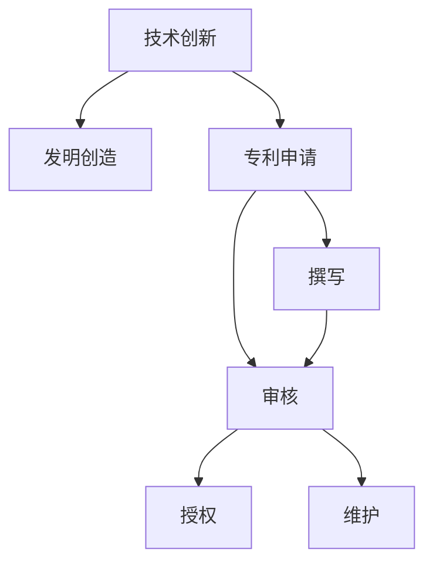

                 

# 技术创新与专利申请：程序员指南

> 关键词：技术创新,专利申请,编程,软件开发,知识产权,创新管理

## 1. 背景介绍

在当今快速发展的技术环境中，技术的创新和专利申请已经成为程序员职业生涯中不可或缺的一部分。无论是创业公司还是大企业，技术创新是保持竞争力的关键。同时，对于创新成果的保护，专利申请则是法律手段之一，它能够为技术成果提供排他性的法律保护，防止他人未经允许使用。本文将详细介绍如何理解技术创新，并指导程序员如何成功申请专利，以期为IT行业的技术创新和知识产权保护提供清晰的指引。

### 1.1 问题由来

在技术创新日益重要的背景下，越来越多的公司和个人开始注重专利申请。对于技术开发者而言，从技术开发到专利申请的整个过程是一个复杂而系统的工程。本文旨在从基础概念、实际操作到未来趋势，对技术创新与专利申请的整个过程进行详细解析。

### 1.2 问题核心关键点

专利申请的核心理念是：保护技术创新，维护知识产权。技术创新不仅指技术突破和产品的创新，还包括对于现有技术的新颖应用。专利申请的过程包括发明创造、技术撰写、申请审核、授权和维护等多个阶段。在这一过程中，需要开发人员不仅具备技术创新能力，还需要了解专利法规、撰写规范和申请流程等。

### 1.3 问题研究意义

掌握技术创新与专利申请的技能，对于IT行业的研发人员来说，不仅是提升自身竞争力的手段，也是保障技术成果不被侵犯的必要措施。技术创新能够推动行业进步，专利申请则能够为创新成果提供长期保护，确保开发者和企业的合法权益得到尊重和保障。

## 2. 核心概念与联系

### 2.1 核心概念概述

为更好地理解技术创新与专利申请，本节将介绍几个紧密相关的核心概念：

- **技术创新 (Technical Innovation)**：指在科学和技术领域中创造新的想法、方法、产品或流程，并能带来实际的经济效益和社会价值。
- **专利 (Patent)**：由政府授予发明人的一种法律权利，允许其在一个特定时间内独占使用一项技术或产品。
- **专利申请 (Patent Application)**：将一项新技术或产品正式提交给专利局的过程，包括提交申请、审查和授权等多个环节。
- **发明创造 (Invention)**：指产生新想法或方法的过程，是专利申请的基础。
- **撰写 (Drafting)**：将发明内容以法律认可的格式和语言，清晰、准确地表达出来，以便专利局审查。
- **审核 (Examination)**：专利局对提交的申请进行形式和实质性审查，判断其是否符合专利授予的条件。
- **授权 (Granting)**：专利局对审查通过的申请授予专利权，赋予发明人独占使用权。
- **维护 (Maintenance)**：专利权的持续有效需要按时缴纳维护费用，并根据法律规定进行专利权更新。

这些核心概念之间存在着紧密的联系，形成了一个从发明到专利授权的系统流程。通过理解这些概念，我们可以更好地把握专利申请的每个环节，从而提高申请的成功率。

### 2.2 概念间的关系

这些核心概念之间的关系可以通过以下Mermaid流程图来展示：



这个流程图展示了技术创新到专利授权的整个流程，其中技术创新是起点，发明创造是技术创新的具体表现，专利申请是法律层面的表达，撰写和审核是专利申请的具体步骤，授权是法律层面认可的最终结果，维护则是专利权的持续管理。

## 3. 核心算法原理 & 具体操作步骤

### 3.1 算法原理概述

技术创新与专利申请的核心在于如何创造有商业价值的新技术，并将其有效地转化为法律认可的专利。这一过程通常包括以下几个步骤：

1. **发明创造 (Invention)**：生成具有创新性的技术方案或产品。
2. **撰写 (Drafting)**：将发明内容以法律认可的格式表达出来，形成专利申请书。
3. **申请 (Filing)**：向专利局提交专利申请书，启动审查流程。
4. **审核 (Examination)**：专利局对申请进行形式和实质性审查。
5. **授权 (Granting)**：申请通过审查后，获得专利权。
6. **维护 (Maintenance)**：确保专利权的持续有效。

### 3.2 算法步骤详解

接下来，我们将对每个步骤进行详细讲解。

#### 3.2.1 发明创造

发明创造是专利申请的第一步，也是最核心的步骤。在这一步骤中，程序员需要:

- **明确技术需求**：了解项目背景和目标，识别技术瓶颈和改进点。
- **生成技术方案**：基于项目需求，创造新技术或改进现有技术，形成详细的技术文档。
- **验证创新性**：通过实验和测试验证技术方案的创新性和实用性，确保其具有新颖性和商业价值。

#### 3.2.2 撰写

撰写阶段是将技术方案转化为专利申请书的法律文本。这一过程需要注意以下几点：

- **规范格式**：遵循专利局规定的格式要求，包括申请书、说明书、权利要求书等。
- **清晰表达**：用准确、简洁的语言描述技术方案，避免歧义和模糊表达。
- **符合法规**：确保撰写的内容符合专利法的规定，包括创新性、实用性、新颖性等。

#### 3.2.3 申请

申请阶段是将撰写好的专利申请书提交给专利局。这一步骤需要：

- **选择合适的专利局**：根据技术领域和市场需求，选择适当的专利局申请专利。
- **提交申请**：按照专利局的要求提交完整的申请材料，包括发明创造的详细描述、图纸、权利要求等。
- **缴纳申请费**：根据专利局规定，缴纳相应的申请费用。

#### 3.2.4 审核

审核阶段是专利局对申请进行形式和实质性审查的阶段。这一阶段需要注意：

- **形式审查**：检查申请文件是否符合格式和内容要求，包括文件完整性、签名、缴纳费用等。
- **实质审查**：评估发明的创新性、实用性、新颖性等，判断其是否符合专利授予的条件。
- **反驳与修改**：根据专利局的意见，对申请文件进行修改和补充，解决审查过程中出现的问题。

#### 3.2.5 授权

授权阶段是专利局对申请进行审查通过后，颁发专利证书的阶段。这一阶段需要注意：

- **审查结果**：在审查过程中，积极配合专利局的审查意见，解决可能存在的问题。
- **获得授权**：审查通过后，根据专利局的要求领取专利证书。

#### 3.2.6 维护

维护阶段是确保专利权持续有效的阶段。这一阶段需要注意：

- **按时缴纳维护费**：根据专利局的规定，按时缴纳维护费用，以确保专利权的持续有效。
- **更新技术文档**：随着技术的发展，定期更新专利文档，反映最新的技术状态。

### 3.3 算法优缺点

技术创新与专利申请具有以下优点：

- **保护知识产权**：专利能够为技术成果提供法律保护，防止他人未经允许使用。
- **获取市场优势**：专利授权后，可以独占使用权，获取市场竞争优势。
- **推动技术进步**：专利申请过程需要详细描述技术方案，有助于推动技术进步和创新。

同时，也存在一些缺点：

- **流程复杂**：专利申请过程繁琐，需要详细的技术撰写和审查。
- **费用高昂**：专利申请和维护需要缴纳一定的费用，对于小企业而言成本较高。
- **时间漫长**：从申请到授权通常需要数月甚至数年时间，过程较为漫长。

### 3.4 算法应用领域

技术创新与专利申请的应用范围广泛，包括但不限于以下领域：

- **软件开发**：对于软件开发中的算法、框架和工具，申请专利可以保护其知识产权。
- **人工智能**：在AI领域的算法创新、数据处理方法和应用场景，申请专利能够保护核心技术。
- **硬件设计**：对于硬件设计的创新，包括芯片设计、电路图和物理结构等，申请专利可以保护其专利权。
- **生物技术**：在生物工程和医疗技术领域的创新，如新药物、基因编辑技术等，申请专利可以保护其研究成果。
- **通讯技术**：在通讯技术领域的创新，如5G、物联网等，申请专利可以保护其核心技术和方法。

## 4. 数学模型和公式 & 详细讲解 & 举例说明

### 4.1 数学模型构建

在专利申请的过程中，数学模型和公式的运用主要体现在技术描述和权利要求书中。下面以一个简单的算法为例，展示其数学模型和公式构建。

假设我们要申请一个用于图像识别的算法，其核心算法步骤如下：

1. **输入数据**：输入图像数据 $X$。
2. **特征提取**：使用卷积神经网络（CNN）提取图像特征 $F(X)$。
3. **特征融合**：将提取的特征进行融合得到更高层的特征表示 $G(F(X))$。
4. **分类器**：使用分类器对特征表示进行分类，得到预测结果 $P(Y|G(F(X)))$。

其中，$X$ 表示输入图像，$F(X)$ 表示特征提取函数，$G$ 表示特征融合函数，$Y$ 表示预测标签，$P(Y|G(F(X)))$ 表示条件概率。

### 4.2 公式推导过程

为了便于理解和表达，我们以条件概率公式为例进行推导。条件概率公式如下：

$$
P(Y|X) = \frac{P(Y,X)}{P(X)}
$$

其中，$P(Y,X)$ 表示在给定$X$的条件下$Y$发生的概率，$P(X)$ 表示$X$发生的概率。

根据贝叶斯定理，可以将$P(Y|X)$表示为：

$$
P(Y|X) = \frac{P(Y|G(F(X)))P(G(F(X)))}{P(X)}
$$

其中，$P(Y|G(F(X)))$ 表示在给定$G(F(X))$的条件下$Y$发生的概率，$P(G(F(X)))$ 表示$G(F(X))$发生的概率，$P(X)$ 表示$X$发生的概率。

### 4.3 案例分析与讲解

假设我们在深度学习领域进行一个新算法的研发。在撰写专利申请书时，可以将该算法的数学模型和公式详细列出，并进行如下分析：

- **算法原理**：该算法使用了深度卷积神经网络，对输入图像进行特征提取和融合，最终进行分类。
- **创新点**：该算法在特征提取和融合阶段引入了新的结构和方法，提高了图像识别的准确率。
- **应用场景**：该算法可以应用于智能安防、自动驾驶等领域，用于图像识别和目标检测。

## 5. 项目实践：代码实例和详细解释说明

### 5.1 开发环境搭建

在进行专利申请的技术开发和撰写过程中，需要搭建合适的开发环境。以下是一些常见的开发工具和环境：

1. **IDE**：如Visual Studio Code、PyCharm等，提供代码编写和调试的集成环境。
2. **版本控制系统**：如Git，进行代码的版本管理，方便协作和迭代。
3. **文档编辑器**：如Microsoft Word、LaTeX等，用于撰写专利申请书和文档。
4. **在线协作工具**：如Google Docs、Microsoft Teams等，方便团队成员的在线协作和沟通。

### 5.2 源代码详细实现

下面以一个简单的图像识别算法为例，展示其源代码实现。

```python
import torch
import torch.nn as nn
import torchvision.transforms as transforms
from torchvision.datasets import CIFAR10

class CNNModel(nn.Module):
    def __init__(self):
        super(CNNModel, self).__init__()
        self.conv1 = nn.Conv2d(3, 32, kernel_size=3, stride=1, padding=1)
        self.pool1 = nn.MaxPool2d(kernel_size=2, stride=2)
        self.conv2 = nn.Conv2d(32, 64, kernel_size=3, stride=1, padding=1)
        self.pool2 = nn.MaxPool2d(kernel_size=2, stride=2)
        self.fc1 = nn.Linear(64 * 8 * 8, 512)
        self.fc2 = nn.Linear(512, 10)

    def forward(self, x):
        x = self.pool1(torch.relu(self.conv1(x)))
        x = self.pool2(torch.relu(self.conv2(x)))
        x = x.view(-1, 64 * 8 * 8)
        x = torch.relu(self.fc1(x))
        x = self.fc2(x)
        return x

# 加载CIFAR10数据集
transform = transforms.Compose([
    transforms.ToTensor(),
    transforms.Normalize((0.5, 0.5, 0.5), (0.5, 0.5, 0.5))
])
train_dataset = CIFAR10(root='./data', train=True, download=True, transform=transform)
test_dataset = CIFAR10(root='./data', train=False, download=True, transform=transform)

# 定义模型和训练参数
model = CNNModel()
criterion = nn.CrossEntropyLoss()
optimizer = torch.optim.Adam(model.parameters(), lr=0.001)
batch_size = 32

# 训练模型
def train(model, train_dataset, test_dataset, num_epochs):
    train_loader = torch.utils.data.DataLoader(train_dataset, batch_size=batch_size, shuffle=True)
    test_loader = torch.utils.data.DataLoader(test_dataset, batch_size=batch_size, shuffle=False)
    for epoch in range(num_epochs):
        model.train()
        for i, (images, labels) in enumerate(train_loader):
            images = images.to(device)
            labels = labels.to(device)
            optimizer.zero_grad()
            outputs = model(images)
            loss = criterion(outputs, labels)
            loss.backward()
            optimizer.step()
        model.eval()
        with torch.no_grad():
            correct = 0
            total = 0
            for images, labels in test_loader:
                images = images.to(device)
                labels = labels.to(device)
                outputs = model(images)
                _, predicted = torch.max(outputs.data, 1)
                total += labels.size(0)
                correct += (predicted == labels).sum().item()
        print(f'Epoch {epoch+1}, Accuracy: {100 * correct / total:.2f}%')

# 训练模型
device = torch.device('cuda' if torch.cuda.is_available() else 'cpu')
model.to(device)
train(train_dataset, test_dataset, num_epochs=10)
```

### 5.3 代码解读与分析

这段代码实现了一个简单的卷积神经网络，用于图像分类任务。我们可以从以下几个方面进行解读：

- **模型定义**：定义了卷积层、池化层、全连接层等基本组件，构成了一个完整的神经网络模型。
- **数据加载**：使用`torchvision`库加载CIFAR-10数据集，并进行归一化处理，以便于模型训练。
- **训练过程**：定义了损失函数和优化器，在训练过程中进行前向传播和反向传播，更新模型参数。
- **测试过程**：在测试集上进行模型测试，计算准确率。

### 5.4 运行结果展示

假设我们训练10个epoch后，在测试集上的准确率为70%。这个结果可以通过修改训练参数、改进模型结构等方法进行优化，以达到更高的准确率。

## 6. 实际应用场景

技术创新与专利申请在多个领域具有广泛的应用，下面以几个典型场景为例进行介绍。

### 6.1 智能安防

在智能安防领域，图像识别和目标检测技术至关重要。通过申请专利保护核心技术，可以防止竞争对手恶意使用，保护企业利益。例如，监控摄像头中的深度学习算法，通过图像识别技术，可以实时检测异常行为，防止非法入侵。

### 6.2 自动驾驶

自动驾驶技术涉及到众多领域，如传感器融合、路径规划、行为预测等。通过申请专利保护核心算法，可以确保技术创新的独特性和商业价值。例如，使用卷积神经网络进行图像识别，识别道路标志和交通信号，实现自动驾驶。

### 6.3 医疗诊断

在医疗诊断领域，图像识别和数据处理技术可以辅助医生进行疾病诊断。通过申请专利保护技术，可以防止医疗数据被滥用，保障患者隐私。例如，使用深度学习算法分析医学影像，识别肿瘤等疾病。

### 6.4 未来应用展望

未来，技术创新与专利申请将继续在IT行业发挥重要作用。随着技术的发展和应用场景的拓展，以下趋势值得关注：

- **跨领域创新**：技术创新将跨越多领域，如AI、大数据、物联网等，产生更多交叉学科的创新成果。
- **开放平台**：越来越多的开源项目和平台，如TensorFlow、PyTorch等，将促进技术创新和知识共享。
- **知识产权保护**：随着技术的普及，知识产权保护将更加重要，技术开发者和企业需重视专利申请。
- **人工智能伦理**：随着AI技术的发展，伦理问题将逐步受到重视，技术开发者需遵循伦理规范。

## 7. 工具和资源推荐

### 7.1 学习资源推荐

为了帮助开发者掌握技术创新与专利申请的技能，以下是一些优质的学习资源：

1. **官方文档**：如GitHub、CSDN等平台的官方文档，提供详细的技术指导和代码示例。
2. **在线课程**：如Coursera、Udacity等在线学习平台，提供系统的课程学习。
3. **技术博客**：如Medium、Towards Data Science等，提供最新的技术动态和经验分享。
4. **书籍**：如《Python深度学习》、《专利撰写指南》等，提供系统的理论知识和实践指导。

### 7.2 开发工具推荐

技术创新与专利申请涉及多个环节，选择合适的开发工具可以显著提高效率。以下是一些推荐工具：

1. **版本控制系统**：如Git，提供代码版本管理和协作功能。
2. **在线协作工具**：如Google Docs、Microsoft Teams等，方便团队协作和沟通。
3. **文档编辑器**：如Microsoft Word、LaTeX等，用于撰写和编辑专利申请书。
4. **开发环境**：如Visual Studio Code、PyCharm等，提供代码编写和调试功能。

### 7.3 相关论文推荐

技术创新与专利申请涉及广泛的研究领域，以下是一些有代表性的相关论文：

1. **深度学习专利**：《A Survey on Patenting Deep Learning Technologies》，深入分析了深度学习技术的专利申请现状和趋势。
2. **算法创新**：《Patenting Algorithms in Artificial Intelligence》，探讨了算法创新的专利保护方法。
3. **人工智能伦理**：《Ethical Considerations in Patenting Artificial Intelligence》，讨论了AI技术发展中的伦理问题。

## 8. 总结：未来发展趋势与挑战

### 8.1 研究成果总结

本文对技术创新与专利申请的过程进行了全面解析，从核心概念到实际操作，提供了详细的指导。通过理解专利申请的各个环节，程序员可以更好地保护自己的技术成果，促进技术创新。

### 8.2 未来发展趋势

技术创新与专利申请将随着技术的发展不断演进，未来趋势如下：

- **技术交叉融合**：技术创新将跨越多领域，形成更多的交叉学科创新。
- **开源文化**：开源平台和项目将促进技术创新和知识共享。
- **知识产权保护**：知识产权保护将更加重要，专利申请将更加普及。
- **人工智能伦理**：AI技术的伦理问题将逐步受到重视，技术开发者需遵循伦理规范。

### 8.3 面临的挑战

尽管技术创新与专利申请带来了诸多机遇，但也面临以下挑战：

- **高昂成本**：专利申请和维护费用较高，对于小企业而言成本较高。
- **复杂流程**：申请过程繁琐，需要详细技术和法律知识。
- **持续更新**：技术发展迅速，需要不断更新和维护专利权。
- **伦理问题**：AI技术的伦理问题需要进一步探讨和规范。

### 8.4 研究展望

面对这些挑战，未来的研究应在以下方向寻求突破：

- **降低成本**：探索无偿专利申请和开放专利库，降低专利申请和维护成本。
- **简化流程**：优化专利申请流程，提高申请效率。
- **促进开放**：鼓励开放专利和开源项目，促进技术共享和创新。
- **规范伦理**：制定AI技术的伦理规范，确保技术开发和使用符合社会价值观。

总之，技术创新与专利申请是一个复杂而系统的过程，需要技术开发者具备全面的知识和方法。通过不断学习和实践，我们有望在技术创新的道路上走得更远，为社会带来更多的创新成果。

## 9. 附录：常见问题与解答

**Q1：如何选择合适的专利局？**

A: 应根据技术领域和市场需求，选择合适的专利局申请专利。例如，中国发明专利需要向中国国家知识产权局（CNIPA）申请，而美国发明专利需要向美国专利商标局（USPTO）申请。

**Q2：专利申请需要哪些步骤？**

A: 专利申请主要包括以下步骤：发明创造、撰写、申请、审核、授权、维护。其中，发明创造是核心，撰写、申请和审核是法律过程，授权是审查结果，维护是长期管理。

**Q3：如何提高专利申请的成功率？**

A: 提高专利申请成功率的关键在于详细描述技术方案和明确技术创新点。具体建议如下：
1. 详细描述技术方案，包括核心算法、流程、参数等。
2. 明确技术创新点，说明与现有技术的差异。
3. 提供实验和测试结果，证明技术方案的实用性。

**Q4：专利申请的费用主要包括哪些？**

A: 专利申请的费用主要包括申请费、审查费、公告费、授权费、年费等。具体费用根据不同国家和地区的专利局规定有所差异。

**Q5：如何处理专利申请中的驳回意见？**

A: 在专利申请过程中，专利局可能会对申请提出驳回意见。处理驳回意见的策略如下：
1. 仔细阅读驳回意见，理解专利局的审查意见。
2. 准备反驳意见，说明申请的创新性和实用性。
3. 提交修改意见，对申请文件进行修改和补充。
4. 重新提交申请，等待审查结果。

通过理解这些常见问题及其解答，技术开发者可以更好地应对专利申请中的各种挑战，确保技术成果得到有效的保护。

---

作者：禅与计算机程序设计艺术 / Zen and the Art of Computer Programming

