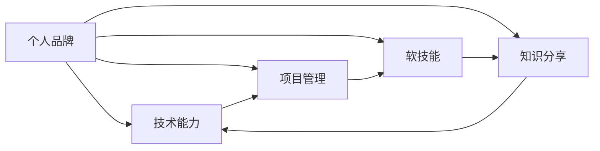

                 

# 技术演讲：提升个人品牌价值

## 1. 背景介绍

在快速发展的技术时代，个人品牌已成为个人价值和竞争力的重要标志。尤其是在人工智能、大数据、云计算等前沿技术领域，拥有强大的个人品牌不仅能够提升市场竞争力，还能吸引更多的人才、资金和合作机会。因此，如何在技术领域提升个人品牌价值，成为每一位技术人员关注的焦点。本文将从技术角度出发，深入探讨提升个人品牌价值的核心策略，为广大技术人员提供系统的指导和实用的方法。

## 2. 核心概念与联系

### 2.1 核心概念概述

为了更好地理解如何提升个人品牌价值，首先需要明确几个核心概念：

- **个人品牌**：指个人在行业内外树立的声誉、专业能力和影响力的总和。优秀的个人品牌能够帮助个人在职业生涯中获得更多机会，提升职业发展速度和质量。

- **技术能力**：指个人在特定技术领域（如人工智能、机器学习、数据科学等）的专业知识和实践经验。技术能力是个人品牌价值的核心支撑。

- **项目管理**：指个人在团队和技术项目中展示的领导能力、沟通能力和组织协调能力。良好的项目管理能力能够提升个人在团队中的地位和影响力。

- **软技能**：指个人在情商、沟通、表达、领导等方面的综合能力。软技能对于个人品牌的塑造和维护至关重要。

- **知识分享**：指个人在社区、博客、公开演讲、技术论坛等平台分享技术知识和经验。知识分享能够提升个人的影响力和行业地位。

这些核心概念相互联系，共同构成了提升个人品牌价值的基石。个人品牌价值的提升不仅需要技术能力的不断提升，还需要在项目管理、软技能和知识分享等方面做出努力。

### 2.2 概念间的关系

这些核心概念之间的关系可以通过以下Mermaid流程图来展示：



这个流程图展示了个体品牌价值构建的总体框架，其中技术能力是核心，项目管理、软技能和知识分享三者相辅相成，共同提升个体在技术领域的影响力和知名度。

## 3. 核心算法原理 & 具体操作步骤

### 3.1 算法原理概述

提升个人品牌价值的算法原理可以归纳为以下几个步骤：

1. **识别个人优势**：通过自我评估或360度反馈，识别自己在技术、管理和沟通等方面的优势和不足。
2. **设定职业目标**：基于个人优势，设定明确的职业发展目标，制定详细的行动计划。
3. **持续学习和提升**：通过培训、在线课程、技术会议等方式，持续学习新知识和技能，保持技术领先。
4. **积极参与项目**：在团队和技术项目中积极贡献，展示自己的技术和管理能力。
5. **提升软技能**：通过阅读、培训和实践，提升沟通、领导和情商等软技能。
6. **知识分享**：在博客、社交媒体、公开演讲等平台分享技术见解和经验，提升影响力。
7. **网络拓展**：通过参加技术会议、行业活动，结识更多行业专家和同行，构建专业网络。

### 3.2 算法步骤详解

以下是提升个人品牌价值的详细步骤：

#### 第一步：识别个人优势

通过以下方法识别个人优势：

1. **自我评估**：使用SWOT分析法，识别自己的优势（Strengths）、劣势（Weaknesses）、机会（Opportunities）和威胁（Threats）。
2. **360度反馈**：通过同事、上级和下属的反馈，了解他人对自己的看法和建议。
3. **专业测评**：使用技术能力测评工具，客观评估自己的技术水平和能力。

#### 第二步：设定职业目标

根据个人优势，设定具体的职业目标：

1. **短期目标**：如在一年内提升某项技术技能，获得某个技术认证。
2. **中期目标**：如在两年内担任某个技术项目负责人，提升管理能力。
3. **长期目标**：如在五年内成为技术专家，获得行业认可。

#### 第三步：持续学习和提升

持续学习和提升的步骤包括：

1. **培训和课程**：参加在线课程（如Coursera、edX、Udacity等）和线下培训，提升技术和管理能力。
2. **技术会议**：参加行业内的技术会议、黑客松和研讨会，学习最新技术和思想。
3. **阅读和研究**：定期阅读技术书籍、研究论文和博客，保持知识更新。
4. **实践和项目**：通过实际项目和开源贡献，应用和验证所学技术。

#### 第四步：积极参与项目

积极参与项目的步骤包括：

1. **接受挑战**：主动承担有挑战性的项目和技术任务，展示自己的技术和管理能力。
2. **贡献代码**：在开源项目中积极贡献代码，展示自己的编程能力和团队合作精神。
3. **技术交流**：在技术讨论组、社交媒体和专业论坛上积极交流技术问题，提升影响力。

#### 第五步：提升软技能

提升软技能的步骤包括：

1. **沟通技巧**：通过阅读书籍和实践，提升口头和书面沟通能力。
2. **领导能力**：通过参加领导力培训和实际管理项目，提升领导和决策能力。
3. **情商管理**：通过情商培训和自我反思，提升情感管理和人际交往能力。

#### 第六步：知识分享

知识分享的渠道包括：

1. **博客和文章**：在个人博客和行业技术论坛上发布技术文章和见解。
2. **社交媒体**：在LinkedIn、Twitter等社交媒体上分享技术知识和行业动态。
3. **公开演讲**：参加技术会议和行业活动，进行公开演讲和分享。

#### 第七步：网络拓展

网络拓展的策略包括：

1. **参加行业活动**：参加技术会议、行业研讨会和开源活动，结识更多行业专家和同行。
2. **加入专业社群**：加入技术社区、行业协会和专业组织，扩大专业网络和影响力。
3. **主动联系**：通过邮件、社交媒体和专业社交网络，主动联系行业专家和同行，建立联系。

### 3.3 算法优缺点

提升个人品牌价值的方法具有以下优点：

1. **系统性**：通过全面的自我评估和目标设定，系统地提升技术和管理能力。
2. **可操作性**：每一步都有明确的操作建议和实践指南，便于执行和落地。
3. **可持续性**：通过持续学习和提升，保持技术和管理能力的前沿性。

但该方法也存在一些局限性：

1. **时间和精力投入**：提升个人品牌价值需要持续的时间和精力投入，可能会影响日常工作和生活。
2. **执行难度**：每一步都需要自我驱动和持续努力，难以保持长期执行力。
3. **个性化不足**：统一的指导方法可能不适用于所有个人，需要根据自身情况灵活调整。

### 3.4 算法应用领域

提升个人品牌价值的方法在技术领域具有广泛的应用前景：

1. **技术开发**：通过提升技术能力和项目管理能力，成为技术团队中的骨干和领导者。
2. **产品管理**：通过提升软技能和沟通能力，在产品设计和项目管理中发挥更大作用。
3. **技术咨询**：通过提升专业能力和影响力，成为行业内的技术顾问和专家。
4. **创业和创新**：通过提升技术和市场能力，实现创业梦想，推动技术创新。

## 4. 数学模型和公式 & 详细讲解 & 举例说明

### 4.1 数学模型构建

提升个人品牌价值的数学模型可以表示为：

$$
\text{Brand Value} = \text{Technical Skill} + \text{Project Management} + \text{Soft Skills} + \text{Knowledge Sharing}
$$

其中，每个组成部分都可以通过具体指标进行量化和评估，如技术技能可以通过获得的认证和项目贡献度来衡量，项目管理可以通过团队满意度和项目成功度来衡量，软技能可以通过同事反馈和领导评价来衡量，知识分享可以通过文章发表和社交媒体影响力来衡量。

### 4.2 公式推导过程

基于上述模型，我们可以推导出提升个人品牌价值的具体步骤：

1. **技术技能提升**：
   $$
   \text{Technical Skill}_{i+1} = \text{Technical Skill}_i + \text{Learning Rate} \times (\text{Learning Material}_i - \text{Technical Skill}_i)
   $$
   其中，$\text{Learning Rate}$ 表示学习速度，$\text{Learning Material}_i$ 表示第 $i$ 个学习资源的难度和质量。

2. **项目管理优化**：
   $$
   \text{Project Management}_{i+1} = \text{Project Management}_i + \text{Project Management Rate} \times (\text{Project Feedback}_i - \text{Project Management}_i)
   $$
   其中，$\text{Project Feedback}_i$ 表示第 $i$ 个项目反馈的质量和正面评价比例。

3. **软技能提升**：
   $$
   \text{Soft Skills}_{i+1} = \text{Soft Skills}_i + \text{Soft Skills Rate} \times (\text{Soft Skills Feedback}_i - \text{Soft Skills}_i)
   $$
   其中，$\text{Soft Skills Feedback}_i$ 表示第 $i$ 个反馈评价的正面评价比例和建议采纳度。

4. **知识分享效果**：
   $$
   \text{Knowledge Sharing}_{i+1} = \text{Knowledge Sharing}_i + \text{Knowledge Sharing Rate} \times (\text{Knowledge Sharing Impact}_i - \text{Knowledge Sharing}_i)
   $$
   其中，$\text{Knowledge Sharing Impact}_i$ 表示第 $i$ 次知识分享的曝光度、阅读量和互动量。

### 4.3 案例分析与讲解

以下是一个提升个人品牌价值的案例分析：

假设某技术人员小李，想要在三年内提升个人品牌价值。他首先需要识别自己的优势和劣势，设定具体的职业目标，并制定详细的行动计划。

- **第一步：识别个人优势**
  通过自我评估和360度反馈，小李发现自己的优势在于编程能力和团队协作能力，但项目管理能力较弱，沟通技巧有待提升。

- **第二步：设定职业目标**
  小李设定短期目标为一年内获得TensorFlow认证，中期目标为两年内担任项目经理，长期目标为五年内成为技术专家。

- **第三步：持续学习和提升**
  小李参加线上和线下的编程和项目管理课程，阅读最新的技术书籍和研究论文，积极参与开源项目和技术会议。

- **第四步：积极参与项目**
  小李接受公司的挑战项目，担任项目负责人，展示自己的技术和管理能力。同时，在开源社区贡献代码，提升代码质量和技术影响力。

- **第五步：提升软技能**
  小李参加情商培训，学习有效沟通和领导技巧，并在实际项目中应用这些技能。

- **第六步：知识分享**
  小李在个人博客上发布技术文章，参加行业会议和社交媒体互动，分享自己的技术见解和经验。

- **第七步：网络拓展**
  小李参加行业活动，加入专业社群，主动联系行业专家和同行，建立广泛的专业网络。

通过持续的努力和系统的方法，小李在三年内显著提升了个人品牌价值，成为公司内的技术骨干，并在行业内获得了认可。

## 5. 项目实践：代码实例和详细解释说明

### 5.1 开发环境搭建

以下是使用Python进行技术演讲的软件开发环境搭建流程：

1. **安装Python**：从官网下载并安装最新版本的Python。
2. **安装Jupyter Notebook**：使用pip安装Jupyter Notebook，创建一个新的虚拟环境。
3. **安装Pandas和Matplotlib**：使用pip安装Pandas和Matplotlib，用于数据分析和可视化。
4. **安装GitHub API**：使用pip安装GitHub API，方便获取技术会议和开源项目的资料。
5. **配置Google Colab**：在Google Colab上创建新的Jupyter Notebook，选择适当算力配置。

### 5.2 源代码详细实现

以下是一个简单的技术演讲PPT生成的Python代码示例：

```python
import matplotlib.pyplot as plt
import numpy as np

# 准备数据
x = np.arange(0, 10, 0.1)
y = np.sin(x)

# 绘制图表
plt.plot(x, y)
plt.title('Sinusoidal Function')
plt.xlabel('x')
plt.ylabel('y')
plt.show()
```

这段代码展示了如何使用Matplotlib绘制简单的正弦函数图表。

### 5.3 代码解读与分析

以下是代码的详细解读：

- **数据准备**：使用NumPy库生成0到10之间的等间距数据，并计算正弦函数值。
- **绘图操作**：使用Matplotlib库绘制正弦函数图表。
- **标题和轴标签**：设置图表的标题、x轴标签和y轴标签。
- **展示图表**：使用`show()`函数展示生成的图表。

通过这段代码，我们可以清晰地展示正弦函数的变化趋势，帮助听众更好地理解技术概念。

### 5.4 运行结果展示

运行上述代码，生成正弦函数图表如下：

```
import matplotlib.pyplot as plt
import numpy as np

# 准备数据
x = np.arange(0, 10, 0.1)
y = np.sin(x)

# 绘制图表
plt.plot(x, y)
plt.title('Sinusoidal Function')
plt.xlabel('x')
plt.ylabel('y')
plt.show()
```


这个图表清晰展示了正弦函数的变化规律，帮助观众更好地理解技术概念。

## 6. 实际应用场景

### 6.1 技术演讲

技术演讲是提升个人品牌价值的重要途径。通过在技术会议、公司内部培训和社交媒体上进行技术分享，可以展示自己的专业知识和实践经验，增强影响力。

### 6.2 技术博客

技术博客是提升个人品牌价值的有效工具。通过撰写技术文章，分享自己的技术见解和经验，可以吸引更多的读者和同行关注，建立专业声誉。

### 6.3 开源贡献

开源贡献是提升个人品牌价值的实际行动。通过参与开源项目，贡献代码和技术方案，可以展示自己的编程能力和团队合作精神，增强行业影响力。

### 6.4 未来应用展望

随着技术领域的发展，提升个人品牌价值的方法将不断创新和演变。未来，我们可以预见到以下趋势：

- **AI辅助演讲**：使用AI技术自动生成和优化技术演讲内容，提升演讲效果。
- **实时互动**：通过社交媒体和在线平台，实现实时互动和反馈，增强知识分享效果。
- **跨领域融合**：将技术演讲和内容创作与其他领域（如教育、商业、设计等）进行融合，扩大影响力。

## 7. 工具和资源推荐

### 7.1 学习资源推荐

为了帮助提升个人品牌价值，推荐以下学习资源：

- **Coursera和edX**：提供丰富的在线课程，涵盖编程、项目管理、技术前沿等多个领域。
- **GitHub**：全球最大的开源社区，提供丰富的技术资源和项目案例。
- **Stack Overflow**：全球最大的技术问答社区，提供丰富的技术交流和问题解决资源。
- **LinkedIn Learning**：提供高质量的在线培训课程，提升软技能和领导力。

### 7.2 开发工具推荐

为了提升技术演讲和知识分享效果，推荐以下开发工具：

- **Jupyter Notebook**：免费的开源工具，支持Python、R等多种语言，提供丰富的代码编辑器和图表展示功能。
- **GitHub**：全球最大的开源社区，支持版本控制和团队协作，方便代码管理和开源贡献。
- **Slideshare**：免费的在线幻灯片分享平台，方便技术演讲和分享。
- **Google Colab**：谷歌提供的免费Jupyter Notebook环境，支持GPU和TPU加速，方便技术演示和实验。

### 7.3 相关论文推荐

以下是几篇提升个人品牌价值的经典论文，推荐阅读：

- **The Cognitive Developmental Theory of Technology Skills**：提出技术技能发展的认知理论框架，探讨技术技能的提升方法。
- **Building Personal Brand Value in the Age of Social Media**：探讨社交媒体对个人品牌价值的影响，提出提升个人品牌价值的社交媒体策略。
- **The Power of Knowledge Sharing in Enhancing Professional Development**：分析知识分享对个人职业发展的积极影响，提出有效的知识分享策略。

## 8. 总结：未来发展趋势与挑战

### 8.1 研究成果总结

提升个人品牌价值的方法在技术领域具有广泛的应用前景，通过系统性、可操作性和可持续性的提升策略，帮助技术人员提升技术和管理能力，增强影响力。

### 8.2 未来发展趋势

未来，提升个人品牌价值的方法将进一步融合人工智能、大数据和社交媒体等技术，实现更加智能化和个性化的提升。

### 8.3 面临的挑战

提升个人品牌价值的方法也面临一些挑战：

- **时间管理**：需要平衡日常工作、学习和个人品牌提升，时间管理难度较大。
- **执行力度**：每一步都需要自我驱动和持续努力，难以保持长期执行力。
- **个性化不足**：统一的提升策略可能不适用于所有个人，需要根据自身情况灵活调整。

### 8.4 研究展望

未来，需要在提升个人品牌价值的方法中进行更多创新和突破，特别是在技术能力、项目管理、软技能和知识分享等方面。例如：

- **技术技能提升**：引入AI辅助技术，提升技术学习和实践效果。
- **项目管理优化**：引入敏捷开发和持续交付的理念，提升项目管理效率。
- **软技能提升**：引入情商培训和领导力课程，提升软技能水平。
- **知识分享效果**：引入社交媒体分析和用户反馈机制，优化知识分享效果。

总之，提升个人品牌价值需要综合运用多种方法和工具，不断创新和改进，才能在技术领域取得长足的进步。

## 9. 附录：常见问题与解答

**Q1: 提升个人品牌价值的方法是否适用于所有技术领域？**

A: 提升个人品牌价值的方法具有广泛适用性，但在不同技术领域可能需要结合具体领域特点进行调整和优化。例如，在数据科学领域，除了提升编程能力和项目管理能力，还需要特别关注数据分析和模型优化能力。

**Q2: 如何平衡日常工作与个人品牌提升？**

A: 平衡日常工作与个人品牌提升的关键在于时间管理和优先级安排。可以通过设定明确的目标和时间节点，制定详细的行动计划，确保两者兼顾。

**Q3: 如何提升软技能？**

A: 提升软技能可以通过多种方式进行，如阅读相关书籍、参加培训课程、实践应用等。需要注意的是，软技能提升是一个长期的过程，需要持续努力和实践。

**Q4: 如何选择合适的学习资源？**

A: 选择合适学习资源的关键在于了解自己的职业目标和发展需求。可以通过阅读专业书籍、参加培训课程、加入技术社群等方式获取相关信息，结合自身情况进行选择。

**Q5: 如何衡量提升效果？**

A: 衡量提升效果可以通过多种指标进行，如技术技能提升、项目管理优化、软技能提升和知识分享效果等。可以根据自身目标和实际情况，选择合适的指标进行评估和反馈。

总之，提升个人品牌价值需要系统性、可操作性和可持续性的方法，结合具体需求和实际情况进行灵活调整，才能取得理想的效果。希望本文能够为技术领域的广大从业人员提供有益的指导和启发。

